# P9：9. L2_4 Basic Probability Jupyter - Python小能 - BV1CB4y1U7P6

 OK。 So we can just， you know， do our usual thing， import MXNet。

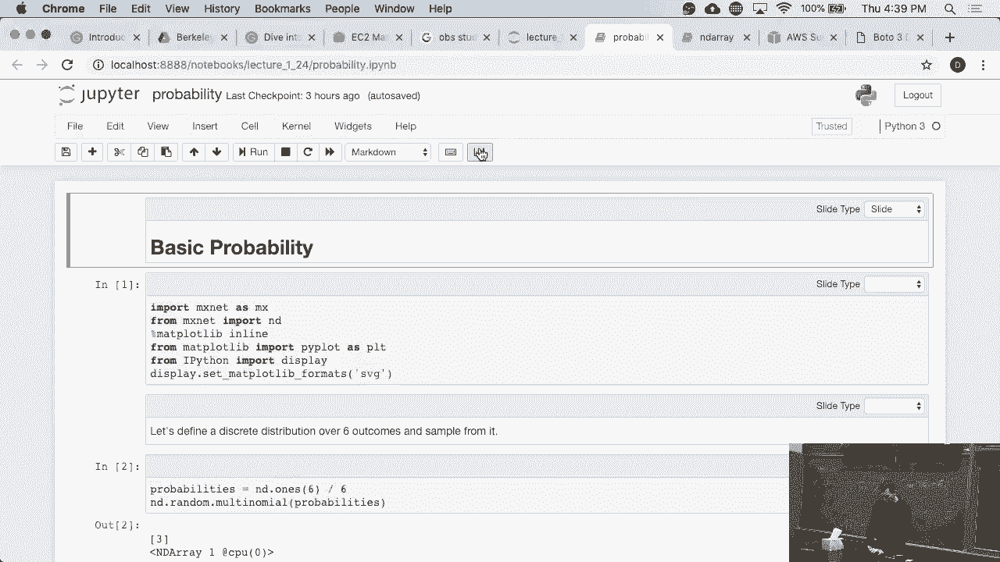

 And this is really just to play a little bit with a random number generator in it and what it can do。

 All those plotting routines are just there to make sure that the plots look pretty。 Now， if I have。

 you know， given set of probabilities， in this case I'm just picking， you know， six outcomes。

 all of them have even probability namely one over six。 Well。

 what I can do then is I can just sample from it and I'll get some outcome in this case it's three。

 OK。

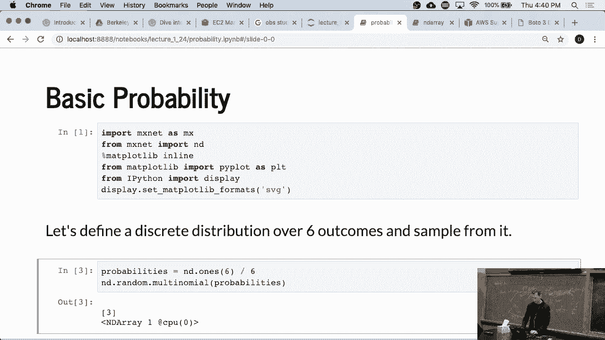

 Not sure why it always gives me three， it shouldn't。 Now。

 what I might want to do is I might want to draw from it more than once。 And so we get， you know。

 I can draw something off a， you know， ten dimensional vector or， you know， five by ten matrix。

 And it'll give me that object。 These are just in， in there。 OK， it's kind of straightforward。

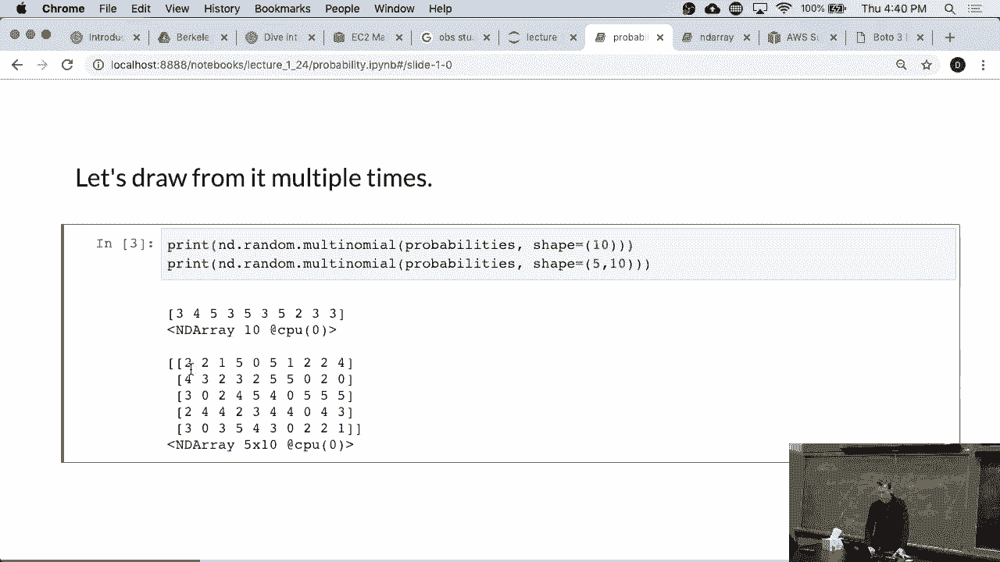

 So let's actually see what happens if we， sorry， roll the dice a thousand times。 If we do that。

 Let's look at the numbers。 OK， we get some probabilities that aren't quite one-six。

 Some are a little bit larger， some are a little bit smaller。

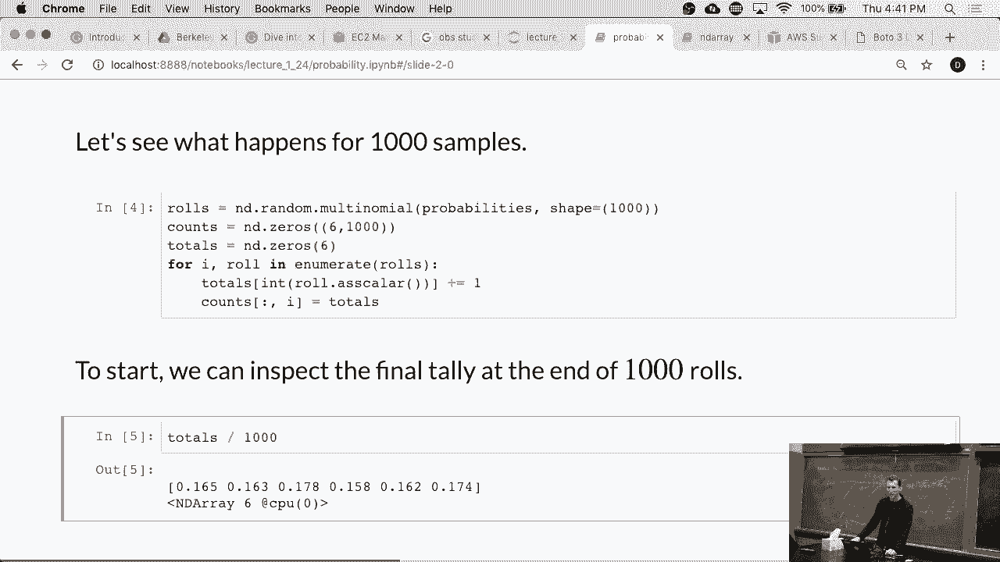

 That's what you would expect。 So now the interesting question is how quickly does this actually converge？

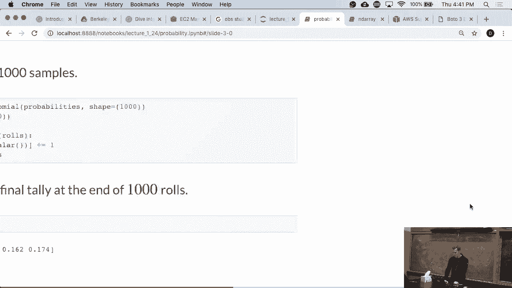

 So these are just accounts， right？

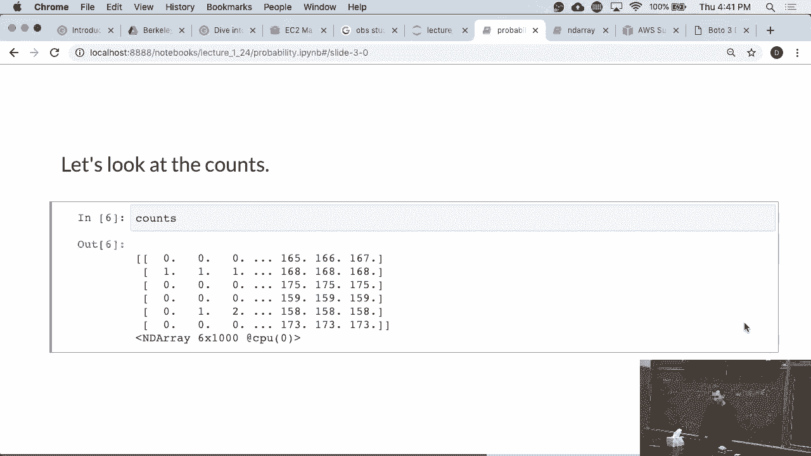

 Just performing the cumulative sum over all the counts。 This is what we computed here before。

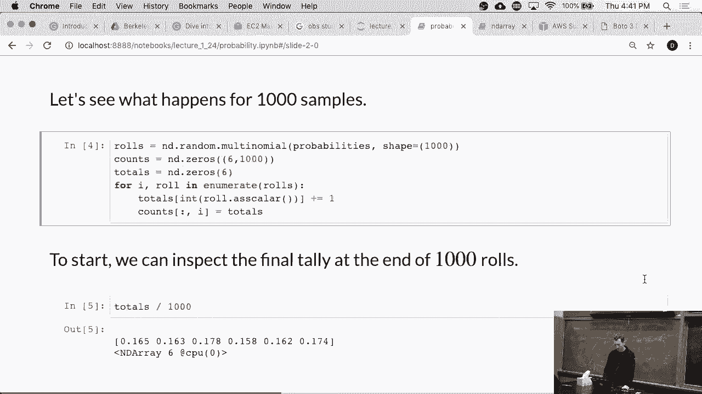

 This was a very tedious and ineligant way of summing things up。

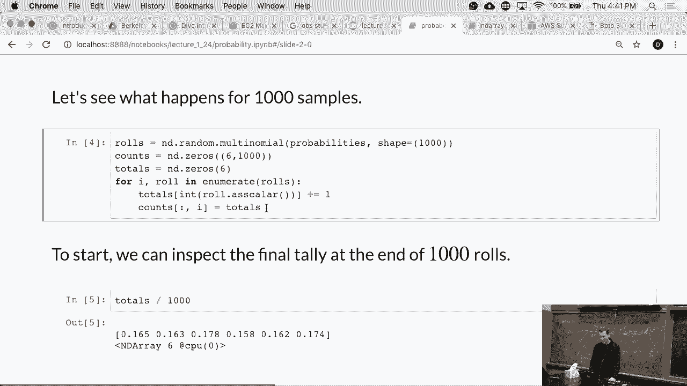

 But anyway， we did this。 Here are the counts。

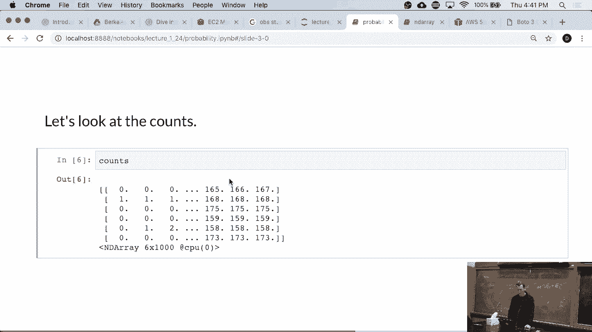

 Now let's normalize things。 And you can see that after， you know， zero one or a hundred tosses。

 the numbers are still much further off。 OK。

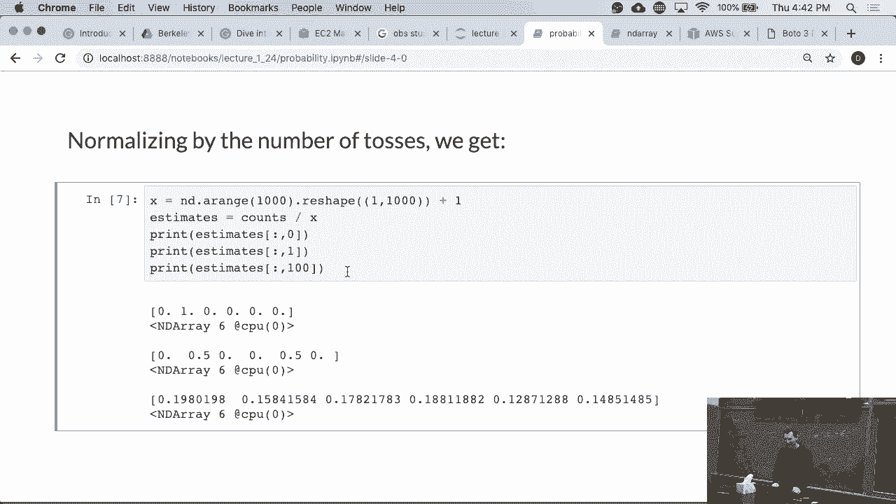

 And the mystery deepness， and you can see that as we， you know， wait longer and longer。

 all those averages will converge nicely to the proper probability。

 So the empirical averages will converge to the expectation。

 Now if you've taken any slightly interesting statistics class。

 you would have probably looked at tail bounds。 You would have looked at， you know， Chebyshev。

 Chernoff， other inequalities， that tell you how rapidly you will converge to that number。

 There are very nice theorems that govern how the shape looks like。

 and we'll get to that in a moment。 Probably actually on Tuesday。

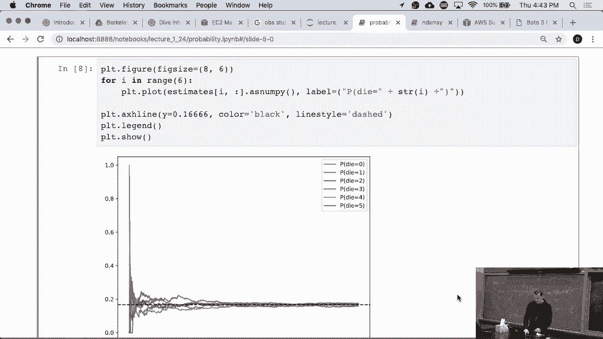

 OK。