# 001：应用与算法概述

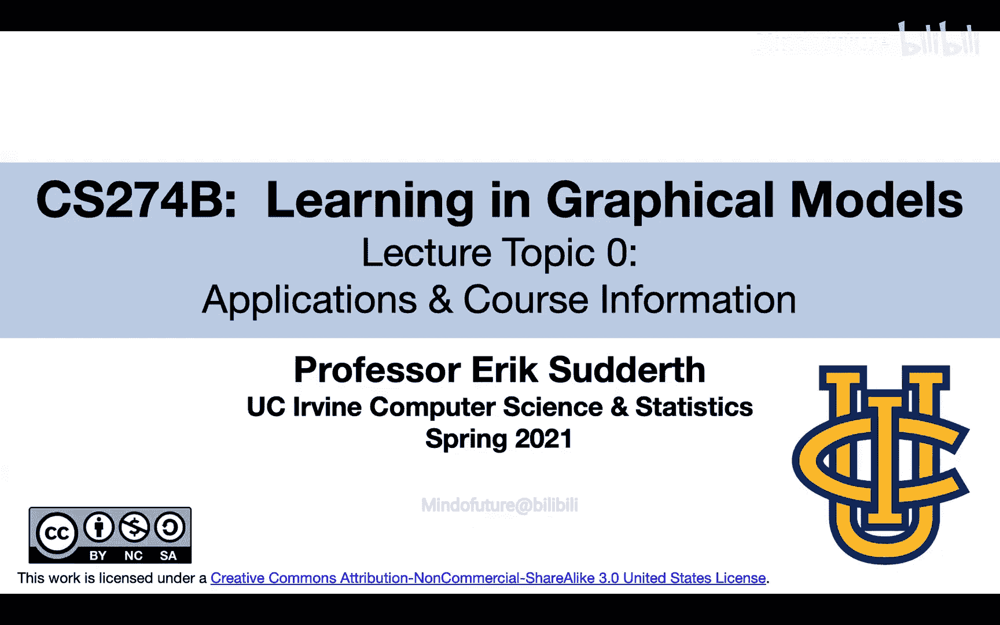

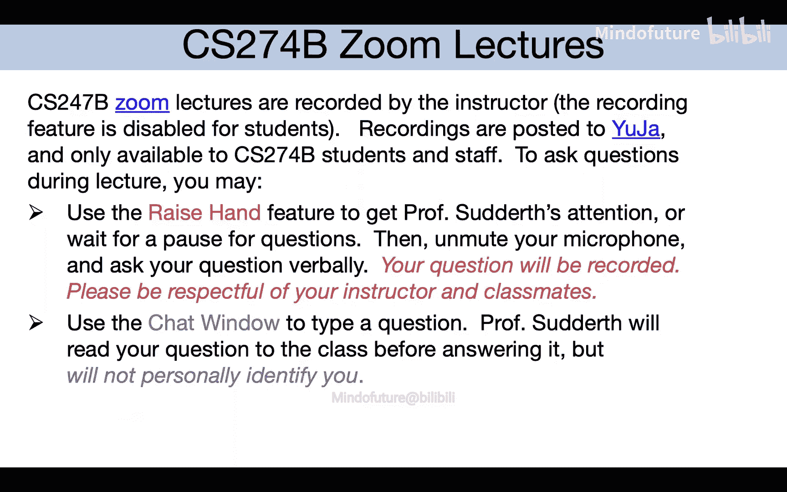

在本节课中，我们将学习图形模型的基本概念、其广泛的应用领域以及核心算法的初步介绍。图形模型是机器学习中用于表示和处理结构化概率分布的有力工具。

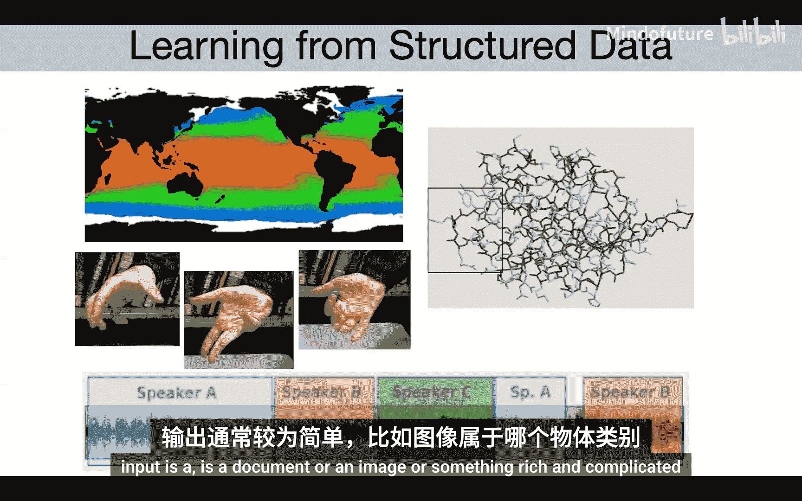

## 课程介绍与背景

欢迎来到CS 274B：图形模型中的学习。我是Eric，是加州大学尔湾分校的教员，主要研究方向是计算机视觉中的机器学习应用，以及其他涉及时空数据的科学领域。本季度我们有一位助教Dahai，他也在线上。

本课程将重点讨论从结构化数据中学习。图形模型是机器学习的一部分，其独特之处在于两点：首先，我们通常对明确表示概率和不确定性感兴趣；其次，我们关注的应用场景中，不仅输入是高维和结构化的，输出本身也常常是高维和结构化的。

## 什么是概率图形模型？

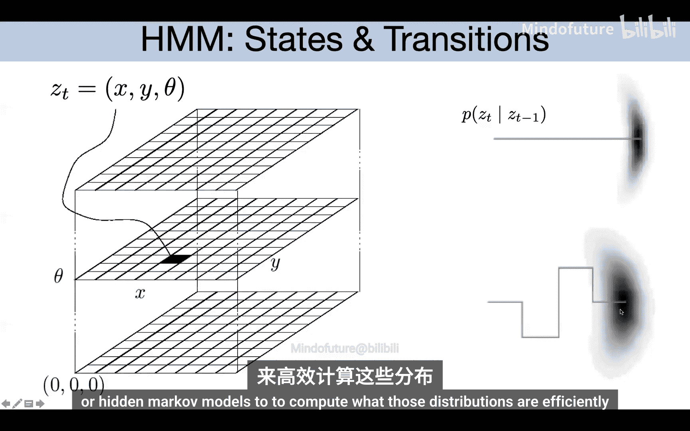

上一节我们介绍了图形模型的核心思想，本节中我们来看看其具体形式。概率图形模型使用图（由节点和边组成）来表示随机变量之间的依赖关系。节点代表随机变量，图则指明了联合概率分布的分解结构。

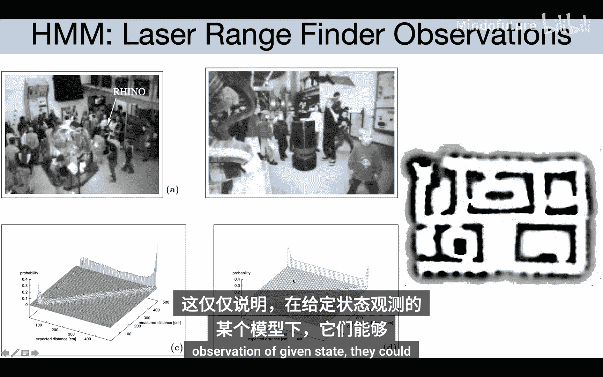

以下是图形模型的主要类型：
*   **有向图模型**：使用有向边，如贝叶斯网络。
*   **无向图模型**：使用无向边，如马尔可夫随机场。
*   **超图模型**：边可以连接两个以上的节点。

图结构不仅使模型对人类可解释，还能被算法利用，将原本指数级复杂度的推理问题转化为线性或多项式复杂度的问题。

## 从隐马尔可夫模型开始

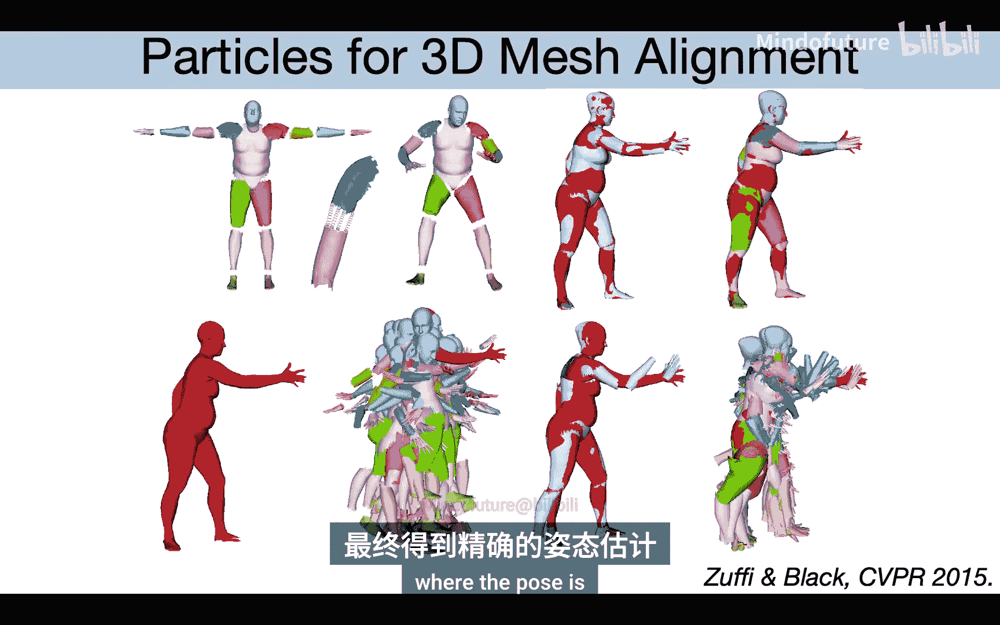

为了理解图形模型如何工作，我们先从一个简单但经典的模型——隐马尔可夫模型开始。HMM用于建模序列数据，如语言或时间序列。

在HMM中，我们有一系列隐藏状态 `Z_t` 和对应的观测值 `X_t`。其图模型表示如下：隐藏状态形成一个马尔可夫链，每个观测值仅依赖于当前时刻的隐藏状态。这对应着联合概率的分解公式：

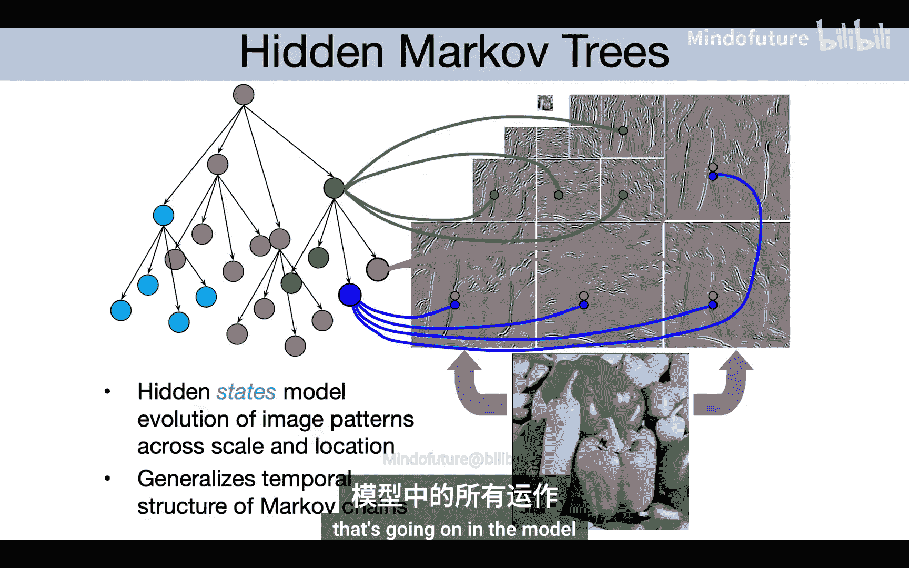

`P(X, Z) = P(Z_1) * ∏_{t=2}^T P(Z_t | Z_{t-1}) * ∏_{t=1}^T P(X_t | Z_t)`

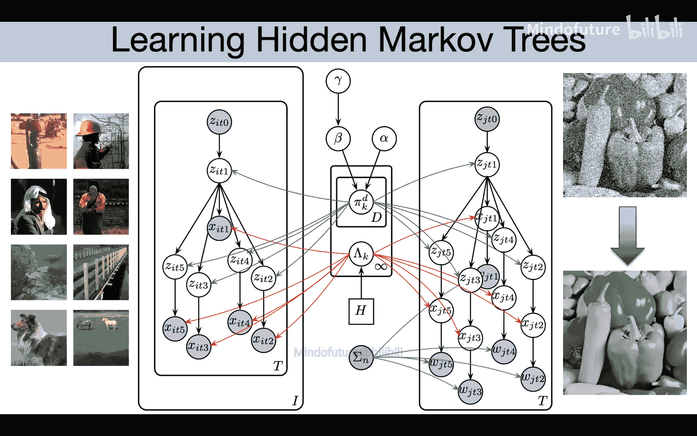

HMM在语音识别、机器人定位等领域有广泛应用。例如，在机器人定位中，状态 `Z_t` 表示机器人的位置，观测 `X_t` 表示传感器读数，通过推理算法可以实时估计机器人的位置。

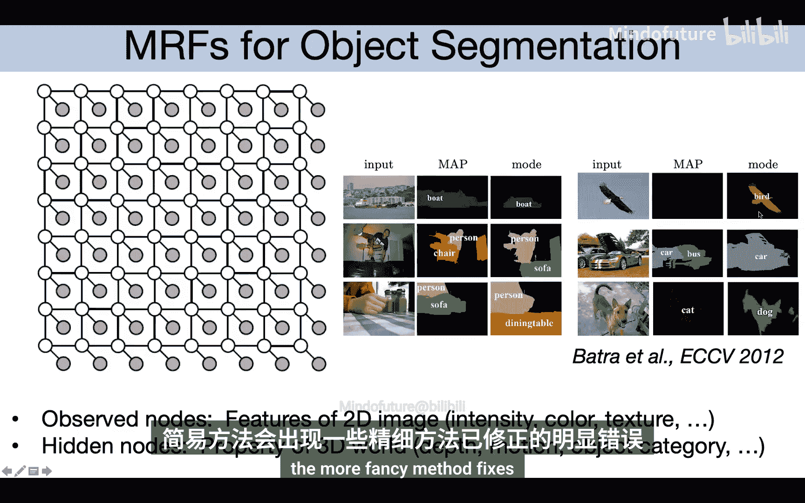

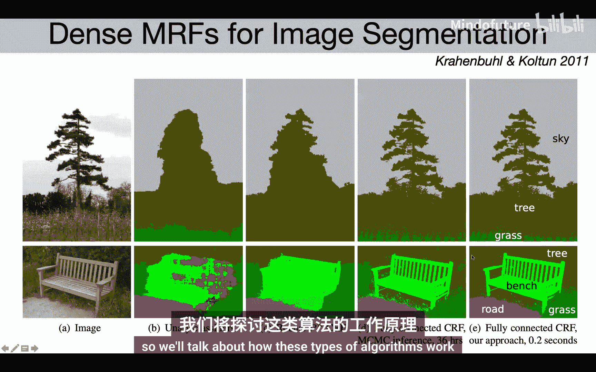

## 更复杂的图形模型应用

HMM展示了图形模型处理序列数据的能力。现在，我们来看看图形模型如何扩展到更复杂的结构和应用中。

**同时定位与地图构建**：在SLAM问题中，机器人需要在未知环境中同时估计自身位置和构建地图。其图模型不仅包含机器人位姿的马尔可夫链，还包含了未知的地标位置节点，观测则同时依赖于机器人位姿和地标位置。

**人体姿态估计**：人体可以建模为关节连接的部件图。每个身体部件对应一个节点。给定图像，通过高效的图模型推理算法，可以估计出所有部件的2D或3D位置，避免了在巨大姿态空间中进行暴力搜索。

**图像处理与遥感**：图形模型可用于图像去噪、立体视觉深度估计和语义分割。例如，在语义分割中，目标是为每个像素分配一个物体类别标签，这可以建模为一个在像素网格上的无向图模型。多尺度树状模型也被用于对图像或海面温度等空间数据进行建模和插值。

**其他领域应用**：
*   **纠错编码**：现代最好的纠错解码器使用基于图模型的消息传递算法。
*   **蛋白质结构预测**：分子间的物理相互作用可以建模为图，进而用推理算法预测蛋白质的3D折叠结构。
*   **主题建模**：潜在狄利克雷分配模型将文档视为多个主题的混合，每个词来自某个主题，这是一种对文本数据的概率生成模型。
*   **网络分析**：社会网络等关系数据可以用潜在社区模型来分析，推断节点的社区归属和社区间的连接概率。
*   **游戏评分系统**：如Xbox Live的TrueSkill系统，使用大型图模型根据比赛结果推断玩家的隐含技能水平。
*   **脑机接口**：通过植入电极读取神经元信号，并用图模型实时解码用户的运动意图，控制光标移动。

## 核心算法思想预览

了解了众多应用后，我们来看看支撑这些应用的核心算法思想。许多图形模型推理算法都属于**消息传递算法**的变体。

在这些算法中，图中的节点会向其邻居传递“消息”（可以理解为函数或向量）。每个节点根据来自邻居的消息和本地概率信息，计算新的消息并传递给其他邻居。信念传播算法就是一个典型例子，其消息更新规则可以看作是动态规划的推广。

对于复杂的模型，我们还需要更强大的推理工具：
*   **马尔可夫链蒙特卡洛**：通过抽样模拟来近似复杂的概率分布。
*   **变分推断**：将推理问题转化为优化问题，通过寻找一个易处理的近似分布来逼近真实后验分布。

此外，我们也会学习如何从数据中**学习图结构本身**，这与特征选择问题紧密相连。例如，可以通过稀疏正则化方法从完全连接的图开始，剪枝掉不重要的边，得到更能反映数据依赖关系的稀疏图。

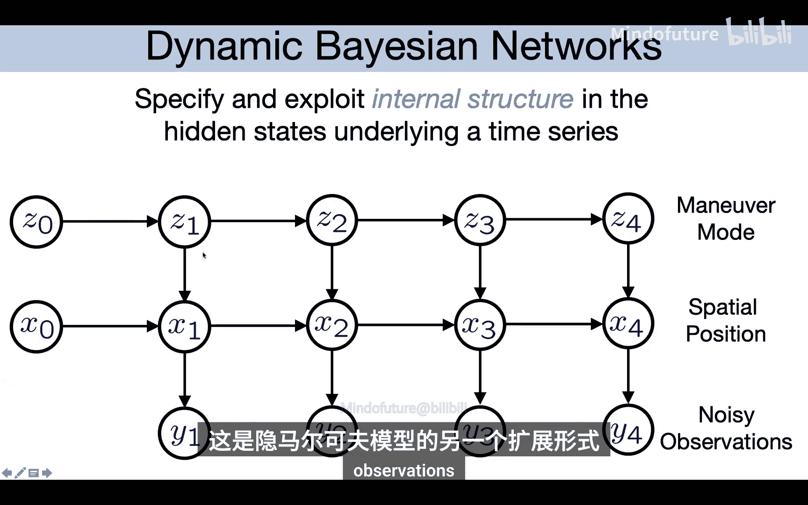

最后，课程也会涉及如何将图形模型与**深度学习**（如神经网络）结合，以建模更复杂的非线性关系，并扩展到海量数据集，例如使用随机变分推断等方法。

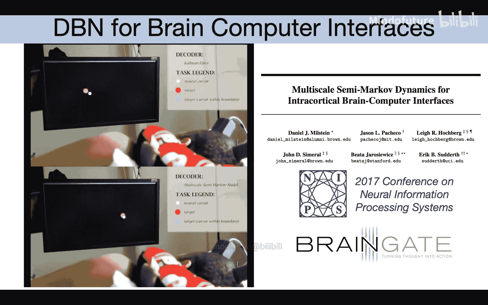

## 课程管理与总结

本节课我们一起概览了图形模型的学习内容。以下是课程的管理信息：

**预备知识**：需要熟练掌握多变量微积分、线性代数、概率论基础，以及机器学习入门知识（如朴素贝叶斯、逻辑回归、SVM、EM算法、PCA等）。未正式选修CS274A的同学需自行评估。

**作业与项目**：
*   课程无考试，成绩由作业（50%）和期末项目（50%）构成。
*   共有3次计分作业，每次为期两周，包含数学推导、算法设计和编程（使用**Python**）。
*   期末项目以小组（2-4人）形式进行，鼓励与个人研究结合，需提交提案、进行展示并完成最终报告。

**学习资源**：课程网站提供多种教材和论文作为参考，鼓励根据个人偏好选择阅读。

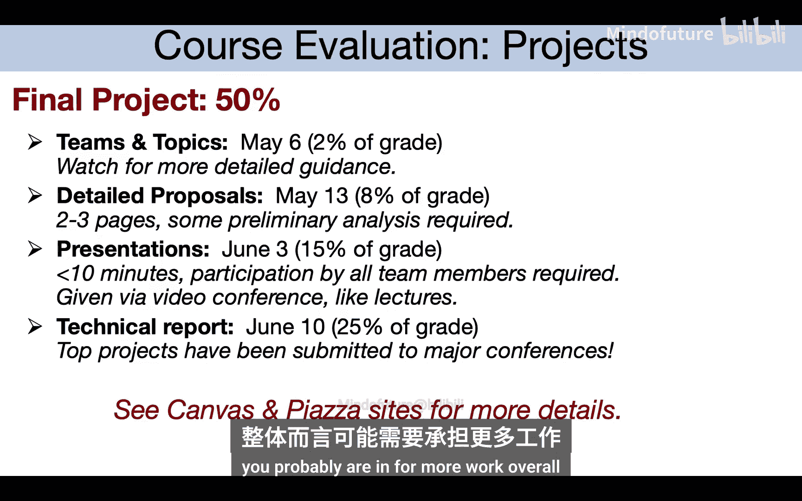

希望本课程能帮助你深入理解图形模型的原理，并具备开发和扩展新模型的能力。