# 002：有向与无向图模型

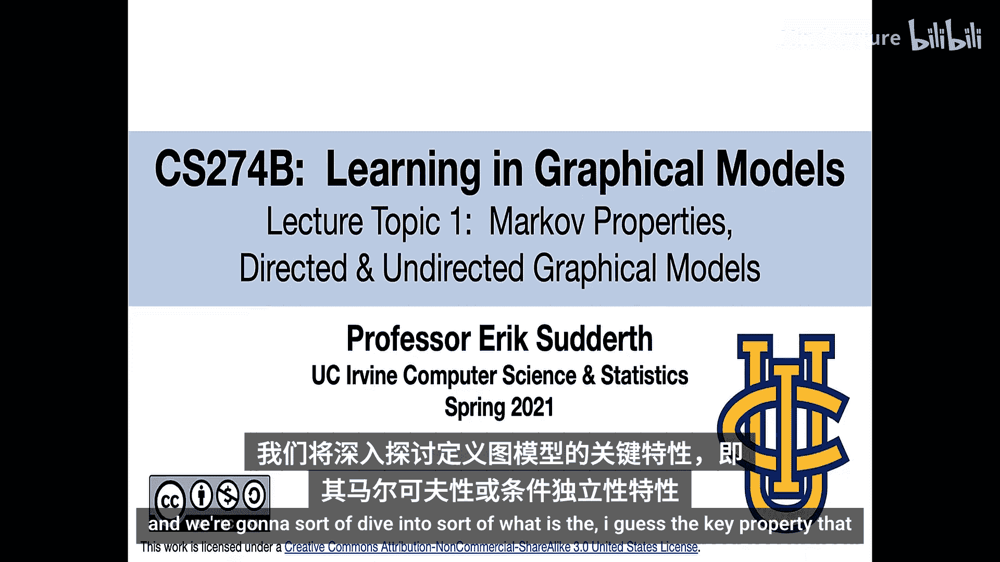


在本节课中，我们将深入探讨定义图形模型的关键属性——马尔可夫性或条件独立性。我们将更精确地讨论不同类型的图形模型，包括基于有向图、无向图以及更复杂的超图的模型，并阐述它们是如何定义以及彼此之间如何关联的。

## 有向图模型

上一节我们介绍了图形模型的基本概念，本节中我们来看看有向图模型。这是最容易理解的一种模型。

根据概率的链式法则和条件概率的定义，对于任意分布 **p(x)**，我们总可以将其重写为：
```
p(x) = p(x1) * p(x2|x1) * p(x3|x2, x1) * ... * p(xn|x1, x2, ..., xn-1)
```
实际上，对于变量的任意排序，这个分解都成立。

有向图模型的核心思想是简化这个分解。它指出，对于某些分布，这些条件概率并不依赖于所有先前的变量，而只依赖于其中的一个子集。我们用一个图来描述这种依赖关系。

在有向图中，每个节点对应一个随机变量。我们用 **Γ(S)** 表示节点 **S** 的父节点集合，即图中所有指向该节点的节点。一个有向图模型定义联合分布为所有节点上条件概率的乘积：
```
p(x) = ∏_S p(x_S | x_{Γ(S)})
```
其中，每个节点的概率仅依赖于其父节点的变量。

为了使这样定义的联合分布有效，其对应的图必须是一个**有向无环图**。这意味着图中不能存在有向环，即不能从一个节点出发，沿着箭头方向前进最终又回到该节点。

### 参数化表示

除了图结构，我们还需要指定概率的具体数值。这取决于变量是离散的还是连续的，以及它们取值的数量。

以一个简单的二值变量为例，每个变量取值为0或1。对于没有父节点的变量，其分布可以用一个和为1的二维向量表示。对于有一个父节点的变量，其条件分布可以用一个2x2的矩阵表示。对于有多个父节点的变量，则需要一个更高维的数组来表示所有父节点取值组合下的条件分布。

### 模型的优势

使用图形表示法能带来显著的效率提升。一个无约束的n个二值变量的联合分布需要约 **2^n** 个参数。而在有向图模型中，参数数量与节点数呈线性关系，仅与节点的父节点数量呈指数关系。这大大减少了存储需求、计算复杂度以及从数据中学习参数所需的样本量。

### 示例：警报网络

考虑一个简单的警报模型。警报可能因入室盗窃或地震而触发。邻居约翰和玛丽在听到警报后可能会打电话报警。

对应的有向图模型如下：
*   入室盗窃和地震是独立的根节点。
*   警报的概率依赖于入室盗窃和地震是否发生。
*   约翰和玛丽打电话的概率仅依赖于警报是否响起，并且在给定警报的条件下彼此独立。

这个模型仅用少量参数就描述了五个变量间的复杂依赖关系，而完整的联合分布则需要多得多的参数。

### 实际应用

有向图模型（常被称为贝叶斯网络）已应用于许多领域。一个经典的“Alarm”网络包含37个变量，用于医疗诊断，它仅用509个参数就近似描述了原本需要天文数字参数的联合分布。在重症监护室中，此类模型被用于整合多种监测设备的数据，以减少误报并更准确地预测真实问题。

## 无向图模型

现在，我们转向另一种重要的图形模型——无向图模型，它通常被称为马尔可夫随机场。

在无向图中，我们有一组节点和一组连接节点的无向边。我们用 **Γ(T)** 表示节点 **T** 的邻居集合，即所有通过边与 **T** 直接相连的节点。

无向图模型的一个核心直观概念是**图分离**与**条件独立性**之间的联系。

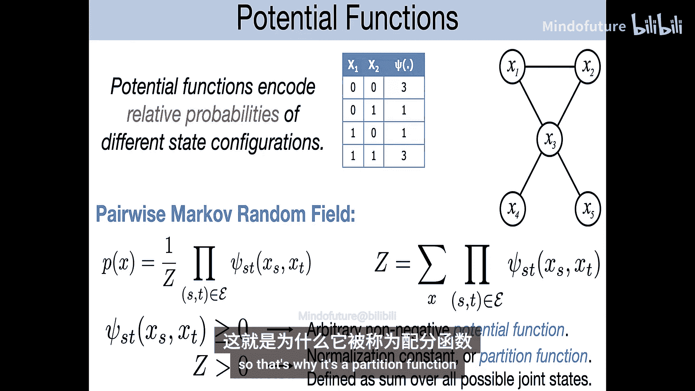

我们称集合 **B** 分离了集合 **A** 和 **C**，如果所有从 **A** 到 **C** 的路径都必须经过 **B**。

一个概率分布 **p(x)** 被称为关于图 **G** 是**马尔可夫的**，当且仅当对于任何被 **B** 分离的 **A** 和 **C**，都有：
```
p(X_A, X_C | X_B) = p(X_A | X_B) * p(X_C | X_B)
```
即，给定 **B**，**A** 和 **C** 条件独立。

一个特例是**局部马尔可夫性质**：对于每个节点，给定其所有邻居节点，该节点与图中所有其他非邻居节点条件独立。

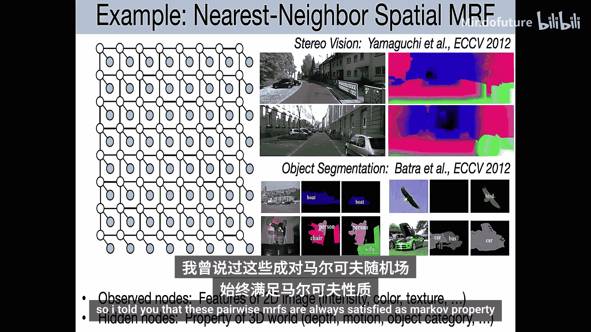

### 成对马尔可夫随机场

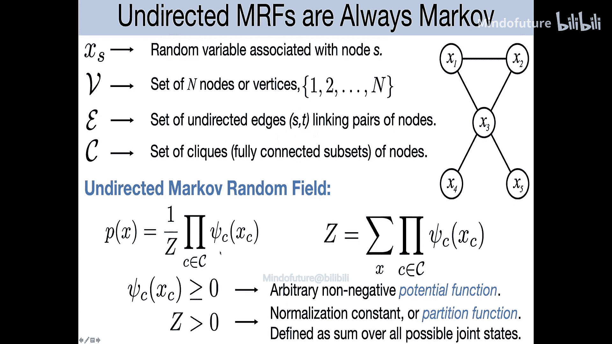

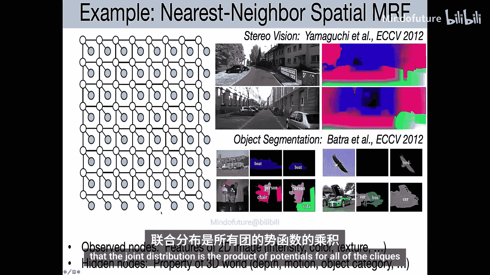

那么，如何构建满足这些马尔可夫性质的分布呢？一个常见的方法是使用**成对马尔可夫随机场**。

给定一个无向图，其对应的成对MRF定义如下：
```
p(x) = (1/Z) * ∏_{(s,t)∈E} ψ_{st}(x_s, x_t)
```
这里，**ψ_{st}(x_s, x_t)** 是定义在边 **(s, t)** 上的**势函数**，它是一个非负函数。**Z** 是归一化常数（或称配分函数），确保所有状态的概率之和为1：
```
Z = ∑_x ∏_{(s,t)∈E} ψ_{st}(x_s, x_t)
```
势函数并不直接表示概率，而是表示变量状态间的“亲和度”或“兼容性”。数值越大，表示该状态组合越可能出现。

### 一般无向MRF与团

成对MRF并非最一般的无向模型。更一般的**无向马尔可夫随机场**基于**团**的概念。

一个团是图中节点的子集，其中每对节点都有边相连。一个极大团是不能被其他任何团真包含的团。

一般的无向MRF将联合分布定义为所有极大团上势函数的乘积：
```
p(x) = (1/Z) * ∏_{c ∈ C} ψ_c(x_c)
```
其中，**C** 是图中所有极大团的集合，**ψ_c** 是定义在团 **c** 上的势函数。

### 示例与应用

在计算机视觉中，无向图模型被广泛用于图像处理任务，如立体视觉（估计深度）和语义分割（标注每个像素的物体类别）。模型通常将图像像素排列成网格，势函数编码了相邻像素倾向于具有相同标签或深度这一空间先验知识。

### 因子分解与马尔可夫性的等价关系

一个重要且深刻的结论是**Hammersley-Clifford定理**。它指出，对于一个严格正的概率分布（即所有状态概率均大于零），其满足关于图 **G** 的全局马尔可夫性质，**当且仅当**它可以被分解为图 **G** 上团势函数乘积的形式（在归一化后）。这建立了图表示的分离性质与代数表示的因子分解形式之间的根本联系。

## 因子图

最后，我们介绍**因子图**，它是一种更精细地表示因子分解结构的工具。

因子图是一种二分图，包含两类节点：
1.  **变量节点**（通常用圆圈表示），对应随机变量。
2.  **因子节点**（通常用方块表示），对应势函数。

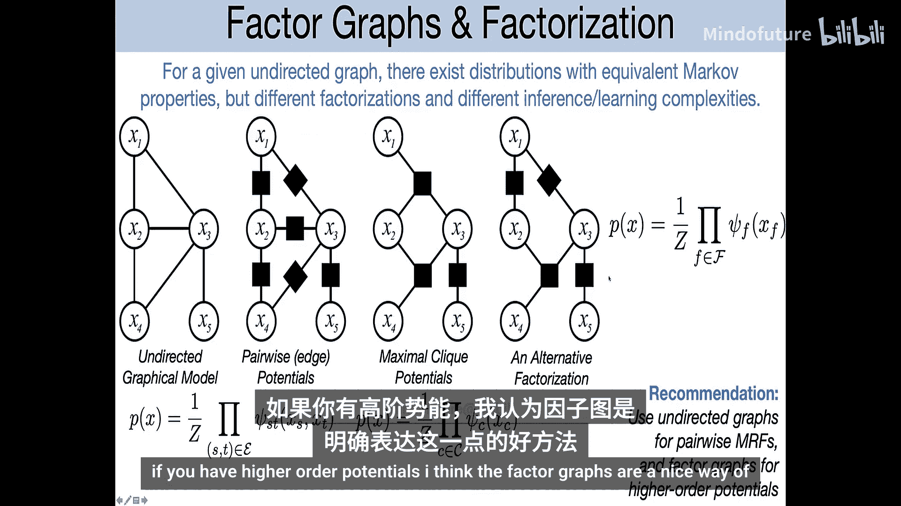

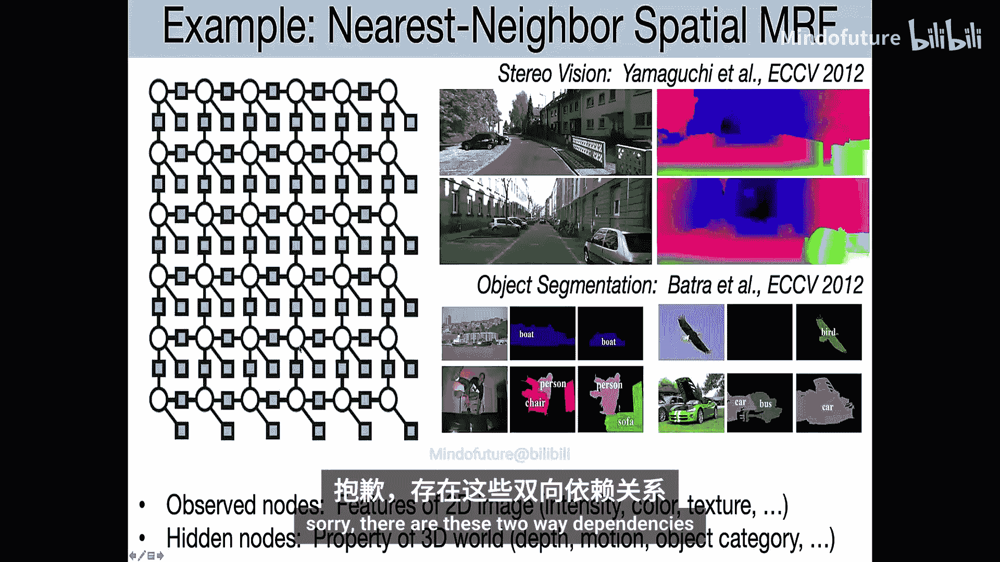

边连接因子节点和该因子所依赖的变量节点。

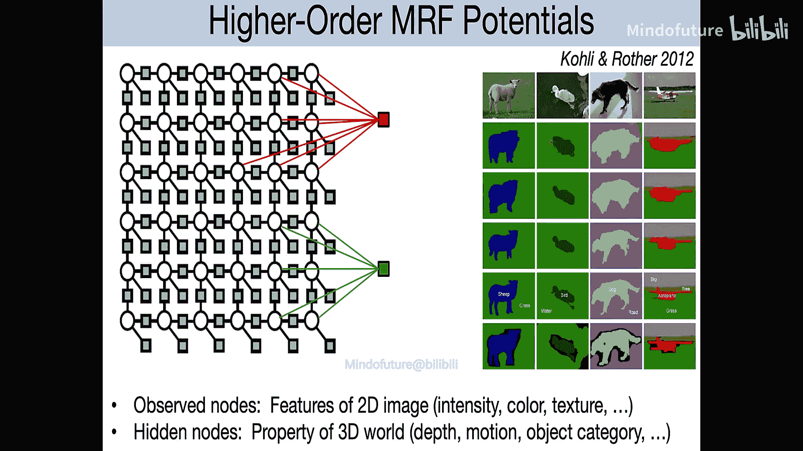

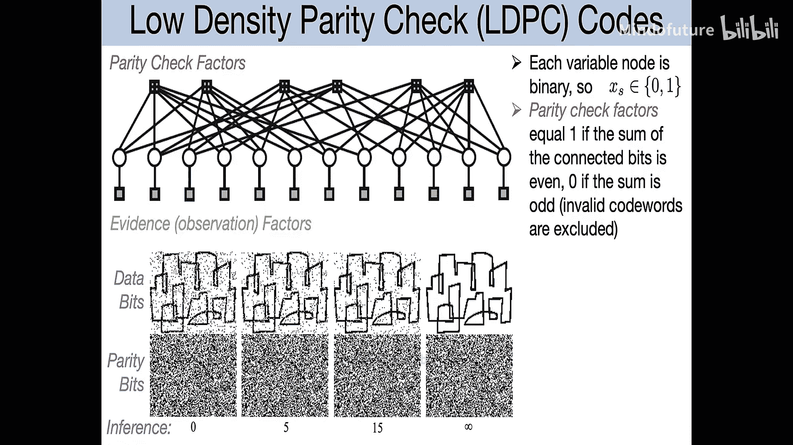

因子图对于明确表示高阶依赖关系特别有用。在标准的无向图中，一个三角形结构可以对应一个三元势函数，也可以对应三个二元势函数的乘积。这两种参数化方式在马尔可夫性上等价，但具有不同的参数数量和表达能力。因子图通过显式画出因子节点，消除了这种歧义。

因子图在纠错编码等领域有天然的应用，其中奇偶校验约束自然地表示为涉及多个变量的因子。

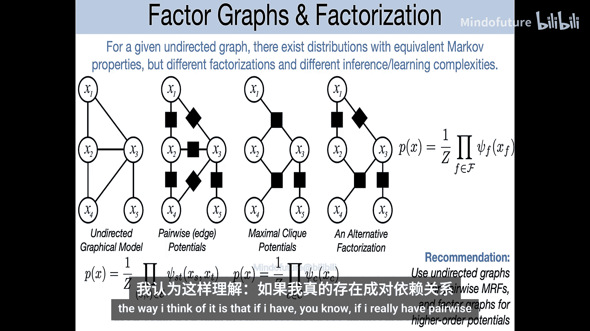

## 总结

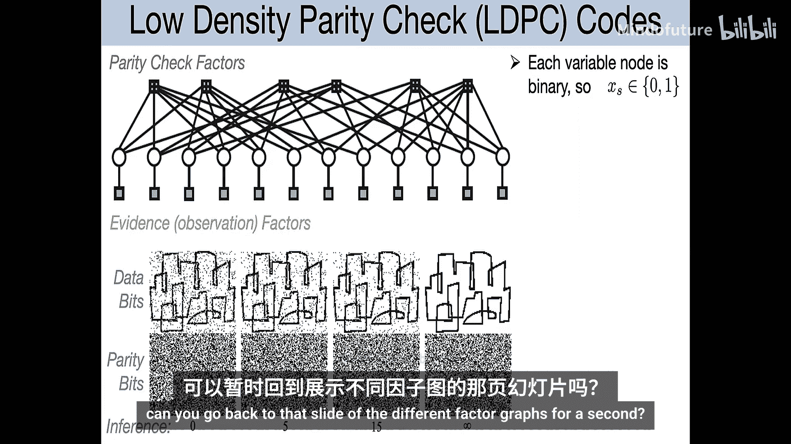

本节课中，我们一起学习了图形模型的两种主要类型：
*   **有向图模型（贝叶斯网络）**：其直观基础是变量间的因果或生成关系。联合分布通过条件概率的链式乘积来因子分解，其中每个变量仅依赖于其父节点。它要求图是有向无环的。
*   **无向图模型（马尔可夫随机场）**：其直观基础是变量间的交互与兼容性。联合分布通过定义在团上的势函数的乘积来因子分解。其核心性质是图分离意味着条件独立性。
*   **因子图**：作为无向模型的一种显式表示，它清晰地展示了分布如何分解为多个因子的乘积，尤其便于表示高阶交互。

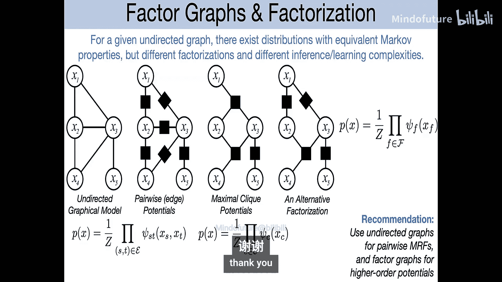

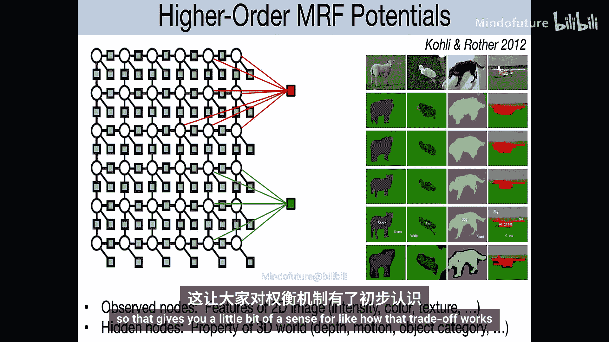

理解这些模型如何表示变量间的依赖关系和独立性，是后续学习如何在它们上进行高效推理（计算边际概率、条件概率）和学习（从数据中估计参数和结构）的基础。不同的表示法在直观性、表达能力和计算便利性上各有优劣，适用于不同的实际问题。