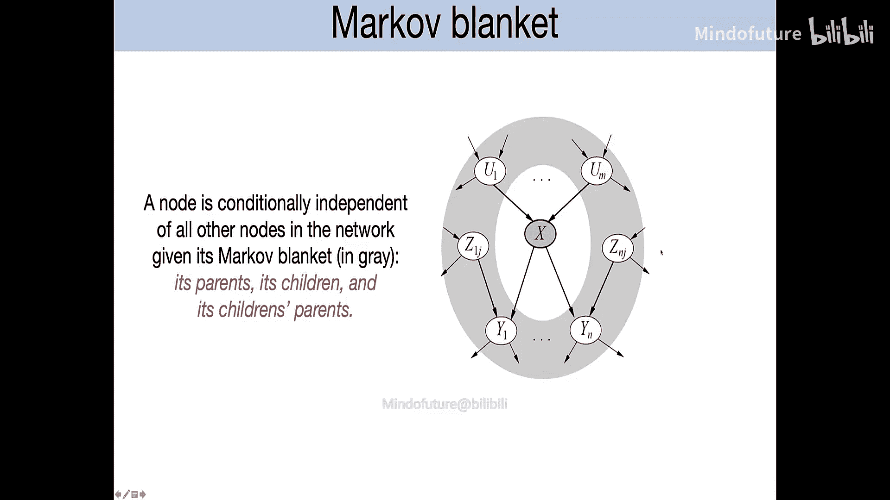
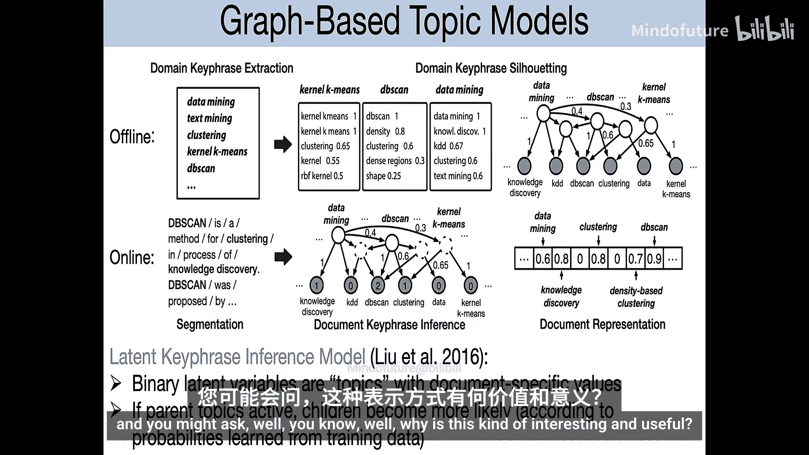
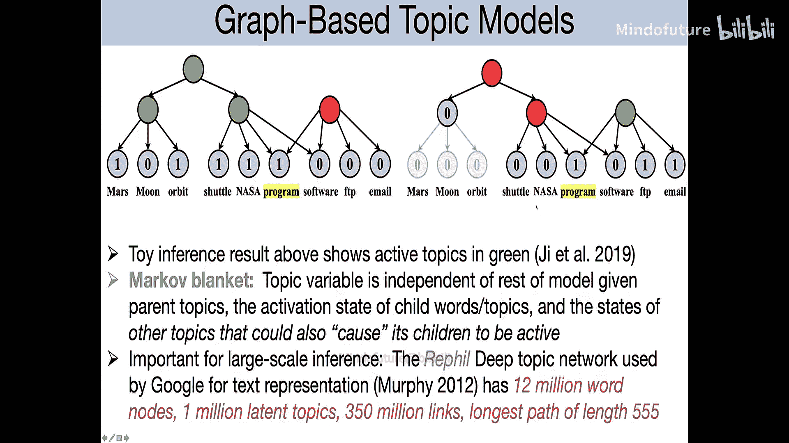
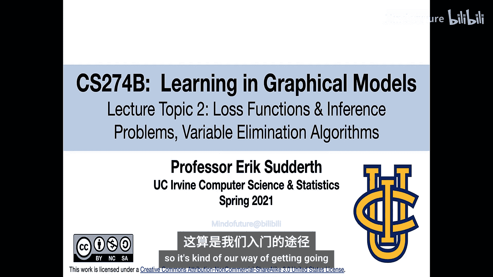
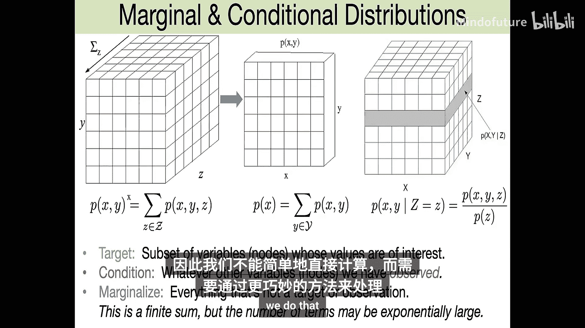
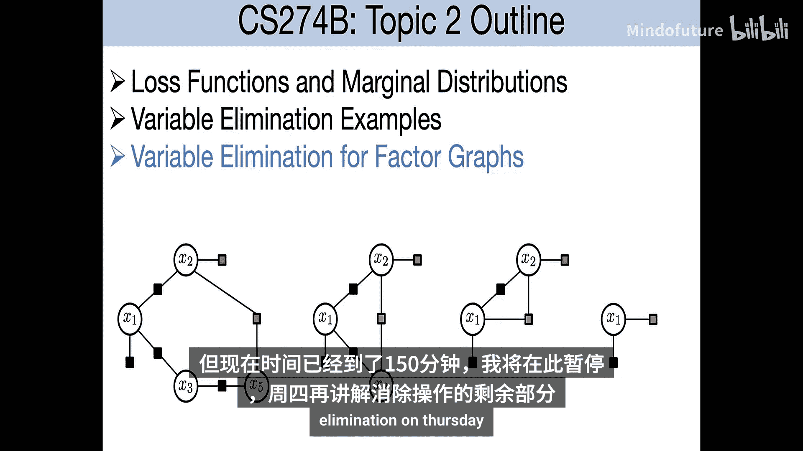

# 003：推理问题与变量消除算法 🧠

在本节课中，我们将完成对各类图形模型的概览，并开始探讨如何在这些模型中高效地进行推理。我们将介绍一种基础的推理算法——变量消除算法。

## 模型间的转换与独立性 🔄

上一节我们介绍了因子图，它是一种更灵活的框架，用于描述概率分布的结构。联合分布是这些势函数的乘积。因子图包含表示变量的圆形节点和表示因子的方形节点，指示每个因子依赖于哪些变量子集。

以下是三种主要图形模型之间的转换：

*   **有向图转因子图**：为每个节点创建一个因子，该因子等于给定其父节点的条件概率分布。这会丢失局部因子是条件分布的信息，且全局归一化常数Z为1。
*   **有向图转无向图（道德化）**：保留所有边但去掉方向，并为所有拥有共同子节点的节点对添加边。形成的无向图称为“道德图”。
*   **无向图转有向图**：选择一个节点顺序，根据无向图结构检查隐含的独立性，并相应地添加有向边。结果对节点顺序敏感，且转换可能丢失信息。

了解这些转换很重要，因为根据应用场景，不同模型各有优势，且有时需要转换以利用特定推理软件。

### 有向图中的独立性

在有向图中，独立性判断比无向图更复杂，涉及“碰撞点”的概念。

*   **碰撞点**：在一条路径中，一个节点有至少两个传入箭头。
*   **D-分离规则**：要判断给定观测集 **C** 时，**X** 和 **Y** 是否条件独立，需检查所有连接 **X** 和 **Y** 的路径。一条路径被“阻塞”如果：
    *   路径上有一个**非碰撞点**节点被观测（在 **C** 中）。
    *   路径上有一个**碰撞点**节点及其后代**未被观测**（不在 **C** 中）。
*   **马尔可夫毯**：在有向图中，一个节点 **X** 的马尔可夫毯是其父节点、子节点以及子节点的其他父节点。给定其马尔可夫毯，**X** 与图中所有其他节点条件独立。

## 推理问题概述 🎯

推理是指在模型参数已知的情况下，根据已观测变量的值，估计未观测（隐藏）变量的值或分布。这与“学习”（从数据中估计模型参数）不同，但学习算法（如EM算法）常以推理作为子步骤。

一个简单的二变量推理例子：给定联合分布 `P(x, y) = P(x) * P(y|x)`。
*   若观测 `x`，则 `P(y|x)` 可直接从模型中获得。
*   若观测 `y`，需计算 `P(x|y)`，这可通过贝叶斯规则完成：`P(x|y) = P(y|x) * P(x) / P(y)`。

在具有多个变量的模型中，目标通常是计算隐藏变量的边际分布。对于离散变量，这涉及对非目标非观测变量求和，但直接计算的项数随变量数指数增长，因此需要更高效的算法。

### 决策理论与推理目标

推理常与决策理论结合。设定观测数据 **Y**，隐藏变量 **X**，行动 **a** 和损失函数 `L(x, a)`。最优行动是最小化期望损失的行动。

两种常见的损失函数及其对应的推理目标：

1.  **汉明损失/二次损失**：损失函数分解为各变量损失之和。最小化期望损失仅需每个变量的**边际分布** `P(x_i | Y)`。
2.  **0-1损失**：仅当预测完全正确时损失为0。这激励了**最大后验估计**，即寻找使后验概率 `P(X | Y)` 最大的 **X** 配置。这等价于最大化势函数乘积（忽略归一化常数Z），通常通过最大化对数势函数的和来实现，也称为**能量最小化**。

## 变量消除算法 ⚙️

变量消除算法是一种通过逐步“消除”（求和或最大化）变量来简化模型，以进行边际推断或MAP估计的基础方法。

### 约束满足问题示例

以图着色问题为例：能否为图中每个节点分配颜色，使得相邻节点颜色不同？这可以建模为无向图模型，其中因子（约束）在配置满足约束时为1，否则为0。此时：
*   MAP估计（最大化乘积）可找到一个可行解（如果存在）。
*   归一化常数 **Z** 则计算了可行解的总数。

### 消除策略

核心思想是选择一个变量消除顺序。对于每个要消除的变量：
1.  收集所有包含该变量的因子。
2.  对这些因子的乘积执行求和（求边际）或最大化（MAP）操作，消除该变量。
3.  生成一个只依赖于该变量邻居的新因子。
4.  将该新因子加入模型，并移除旧因子。

**图形效果**：消除一个节点后，需要在它的所有邻居之间添加边（形成一个团），因为新因子依赖于所有这些邻居变量。

**计算效率**：消除顺序至关重要。消除连接度高的节点会产生涉及大量变量的新因子，计算成本高。优先消除边缘的、连接度低的节点更高效。

**分配律**：算法的效率提升源于求和/最大化操作满足分配律。例如，最大化 `f1(x,y) + f2(x,z)` 相对于 `y` 和 `z`，可以先分别对 `y` 最大化 `f1`，对 `z` 最大化 `f2`，再将结果相加，这比枚举所有 `(y,z)` 对更高效。

---

本节课中，我们一起学习了图形模型间的转换、有向图中的独立性判断、推理问题的定义及其与决策理论的关系，并初步介绍了变量消除算法的基本思想与操作流程。下一节，我们将更详细地探讨变量消除算法在因子图上的具体步骤和复杂度分析。