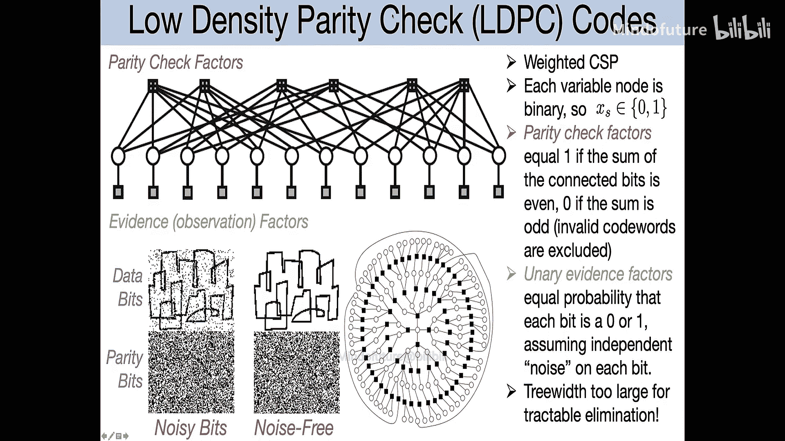
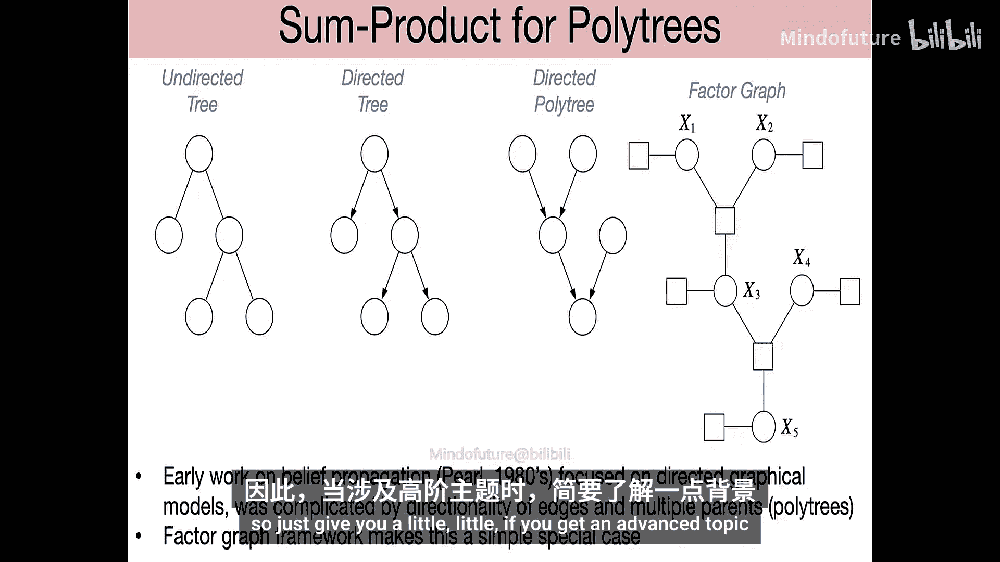

# 004：消息传递算法与信念传播

在本节课中，我们将深入探讨消元算法，并更详细地了解它们在因子图上的工作原理。这些算法不仅是计算我们关心的推理结果的有用工具，也是构建更复杂方法的基础模块。

## 概述

我们将从一个具体的例子出发，解释如何通过利用**分配律**来高效地计算边际分布。核心思想是，通过巧妙地改变求和与乘积的顺序，可以在不改变结果的前提下，显著节省计算量。我们将首先介绍消元算法，然后将其扩展为更高效的**信念传播算法**，该算法能一次性计算出图中所有变量的边际分布。

## 消元算法详解

上一节我们介绍了分配律的基本思想。本节中，我们来看看如何在一个具体的模型上应用消元算法。

### 模型与问题设定

假设我们有一个包含六个离散变量的有向图模型，每个变量有 `K` 个可能的状态。其联合分布根据图结构分解如下：

```
p(x1, x2, x3, x4, x5, x6) = p(x1) * p(x2|x1) * p(x3|x1) * p(x4|x2) * p(x5|x2, x3) * p(x6|x2, x5)
```

我们的推理目标是：在观察到变量 `x4` 和 `x6` 取特定值（记作 `x4_bar` 和 `x6_bar`）后，计算变量 `x1` 的边际分布 `p(x1 | x4_bar, x6_bar)`。这需要我们对未观测变量 `x2`, `x3`, `x5` 进行求和（边际化）。

### 朴素方法的计算代价

如果直接对联合分布进行求和，计算量将非常庞大。对于每个固定的 `x1`，我们需要对 `x2`, `x3`, `x5` 的所有 `K^3` 种组合进行求和。由于 `x1` 本身有 `K` 种可能，并且联合分布中有 `N` 个因子项，总计算复杂度约为 `O(N * K^4)`。当需要边际化的变量很多时，这种指数级增长的计算量是无法承受的。

### 转换为因子图

为了应用消元算法，我们首先将模型转换为因子图。每个条件概率项都成为一个因子。例如，`p(x6|x2, x5)` 成为因子 `φ6(x2, x5, x6)`。

对于观测变量，我们将其“固定”为观测值，从而创建新的、维度更低的因子（或称为“证据势能”）。例如，观测到 `x6 = x6_bar` 后，我们得到一个新的因子 `M6(x2, x5) = φ6(x2, x5, x6_bar)`。这可以看作是变量 `x6` 向其邻居 `x2` 和 `x5` 发送的“消息”。

### 逐步消元过程

消元算法的核心是每次从图中移除（消元）一个未观测变量，并用一个新的因子来概括该变量对其邻居的影响。

以下是消元步骤：

1.  **选择消元顺序**：假设我们首先消元 `x5`。
2.  **识别相关因子**：找出所有与 `x5` 相连的因子，即 `φ5(x2, x3, x5)` 和消息 `M6(x2, x5)`。
3.  **计算新因子**：通过对 `x5` 求和，将这两个因子合并为一个新的因子 `M5(x2, x3)`：
    ```
    M5(x2, x3) = Σ_{x5} [ φ5(x2, x3, x5) * M6(x2, x5) ]
    ```
    这个操作本质上是一个矩阵乘法，计算复杂度为 `O(K^3)`。新因子 `M5` 编码了在 `x5` 被边际化后，`x2` 和 `x3` 之间的关系。
4.  **更新因子图**：从图中移除变量 `x5` 及其相连的因子 `φ5` 和 `M6`，并添加新因子 `M5`。
5.  **迭代消元**：接下来，我们选择消元 `x3`。与 `x3` 相连的因子是 `φ3(x1, x3)` 和 `M5(x2, x3)`。通过对 `x3` 求和得到新因子 `M3(x1, x2)`：
    ```
    M3(x1, x2) = Σ_{x3} [ φ3(x1, x3) * M5(x2, x3) ]
    ```
    同样，计算复杂度为 `O(K^3)`。更新图，移除 `x3`, `φ3`, `M5`，添加 `M3`。
6.  **最终消元**：最后消元 `x2`。与 `x2` 相连的因子是 `φ2(x1, x2)`, `M4(x2)`（来自观测 `x4`）和 `M3(x1, x2)`。求和得到最终消息 `M2(x1)`：
    ```
    M2(x1) = Σ_{x2} [ φ2(x1, x2) * M4(x2) * M3(x1, x2) ]
    ```
    由于这里只涉及两个变量，计算复杂度降为 `O(K^2)`。
7.  **计算目标边际**：现在，图中只剩下变量 `x1` 及其先验因子 `φ1(x1)` 和来自 `x2` 的消息 `M2(x1)`。`x1` 的未归一化边际分布正比于它们的乘积：
    ```
    p~(x1) = φ1(x1) * M2(x1)
    ```
    最后，通过归一化得到真正的边际分布：
    ```
    p(x1 | x4_bar, x6_bar) = p~(x1) / Σ_{x1} p~(x1)
    ```




通过这种分步消元的方法，我们将总计算复杂度从 `O(K^4)` 降低到了 `O(K^3)`。虽然在这个小例子中提升不大，但对于大型图模型，这种节省是指数级的。

### 消元顺序与计算复杂度

消元算法的效率高度依赖于消元顺序。每次消元一个变量时，会生成一个连接其所有邻居的“团”（clique）。该团的大小决定了这一步的计算成本（指数于团的大小）。

*   **树宽**：一个图的**树宽**定义为：在所有可能的消元顺序中，所产生的最大团的大小的最小值减一。树宽衡量了图的“复杂程度”。
    *   树的树宽为1。
    *   单环图的树宽为2。
    *   一个 `n x n` 网格的树宽约为 `n`。
*   **寻找最优顺序**：寻找最小树宽的消元顺序本身是一个NP难问题。但在实践中，我们可以使用启发式方法，例如每次都选择当前图中**度数最小**的节点进行消元，这通常能获得不错的次优顺序。

对于树宽很大的图（如大型网格），精确的消元计算仍然是不可行的，这引出了对**近似推理算法**的需求。

## 信念传播算法

上一节我们介绍了如何通过消元高效计算单个变量的边际。然而，如果我们想计算图中**所有变量**的边际，重复运行消元算法是低效的，因为很多中间计算是共享的。信念传播算法解决了这个问题。

### 从消元到信念传播

考虑一个树结构的因子图（无环）。假设我们想计算所有变量的边际。观察消元过程，我们发现：

*   计算 `x1` 的边际时，需要消息 `M4->2`, `M3->2` 和 `M2->1`。
*   计算 `x2` 的边际时，同样需要 `M4->2` 和 `M3->2`，以及一个新的消息 `M1->2`。
*   消息 `M4->2` 和 `M3->2` 在两次计算中是相同的。

因此，我们可以通过系统地计算图中所有方向上的消息，并复用它们，来一次性获得所有边际。

### 算法原理：在树上传递消息

信念传播算法通过节点之间传递“消息”来工作。在树结构的**成对因子图**（即每个因子只连接两个变量）上，算法最为简洁。

**核心公式**：

1.  **变量到变量的消息**：消息 `M_{j->i}(x_i)` 从变量 `j` 发送到邻居变量 `i`，计算公式为：
    ```
    M_{j->i}(x_i) = Σ_{x_j} [ ψ_{ij}(x_i, x_j) * Π_{k ∈ N(j) \ i} M_{k->j}(x_j) ]
    ```
    其中：
    *   `ψ_{ij}` 是连接变量 `i` 和 `j` 的因子。
    *   `N(j) \ i` 表示变量 `j` 除了 `i` 之外的所有邻居。
    *   `Π` 表示乘积。
    这个公式的含义是：为了告诉 `i` 关于 `j` 的信息，`j` 需要汇总来自其所有其他邻居 (`k`) 的消息，结合它和 `i` 之间的局部关系 (`ψ_{ij}`)，然后对 `j` 的所有可能状态求和。

2.  **计算边际（信念）**：一旦所有消息都计算完毕，变量 `i` 的边际分布（称为信念 `b_i(x_i)`）正比于所有传入消息的乘积：
    ```
    b_i(x_i) ∝ Π_{k ∈ N(i)} M_{k->i}(x_i)
    ```
    然后需要归一化，使得 `Σ_{x_i} b_i(x_i) = 1`。

**计算顺序（调度）**：
由于消息之间存在依赖关系，需要按特定顺序计算。
*   **从叶子开始**：叶子节点（只有一个邻居）可以立即向外发送消息，因为公式中的乘积项为空。
*   **同步或异步更新**：可以像涟漪一样，从所有叶子节点开始，同步地向内传递消息，直到所有消息都被计算一次（对于树，两轮即可：一轮向上到根，一轮向下从根到叶）。也可以随机初始化消息，然后迭代更新直至收敛（在树上保证收敛）。

**计算复杂度**：对于有 `N` 个变量、每个变量有 `K` 个状态的树，计算所有消息的总复杂度为 `O(N * K^2)`，这是关于变量数量**线性**的，远优于朴素方法的指数复杂度。

### 与向前-向后算法的联系

著名的隐马尔可夫模型（HMM）的**向前-向后算法**，正是信念传播在链式树结构（一种特殊的树）上的特例。向前消息（α）和向后消息（β）分别对应信念传播中沿着链的两个方向传递的消息。

### 推广到一般因子树

如果树中的因子不是成对的，而是涉及多个变量（例如三元因子），算法可以推广。此时，因子图中存在两种类型的节点：变量节点和因子节点。消息也分为两种：
*   **变量 -> 因子**的消息：是该变量从其他相邻因子收到的消息的乘积。
*   **因子 -> 变量**的消息：是该因子涉及的所有其他变量传入消息的乘积，乘以因子函数本身，再对其他变量求和。

即使底层无向图有环，只要对应的因子图是无环的（树），信念传播就能给出精确的边际分布。

## 总结

本节课中我们一起学习了两种核心的精确推理算法：

1.  **消元算法**：通过每次边际化一个变量并更新图结构，来高效计算单个查询变量的边际分布。其效率取决于消元顺序，并由图的**树宽**所刻画。
2.  **信念传播算法**：通过在图中的节点间传递消息，能够一次性高效计算出**树结构因子图**上所有变量的精确边际分布。它本质上是消元算法中共享计算的系统化利用。



这两种算法都巧妙地利用了图的局部结构和分配律，将看似指数复杂的计算问题转化为可处理的规模。对于树宽较大的模型，精确计算可能仍然不可行，这为我们在后续课程中学习**近似推理方法**（如循环信念传播）奠定了基础。