# 005：连接树与循环信念传播

## 概述
在本节课中，我们将继续学习信念传播算法。首先，我们将探讨如何在真实的树结构模型上应用该算法，并处理数值稳定性问题。随后，我们将深入探讨如何处理包含循环的图结构模型，介绍两种主要方法：精确的**连接树算法**和近似的**循环信念传播算法**。

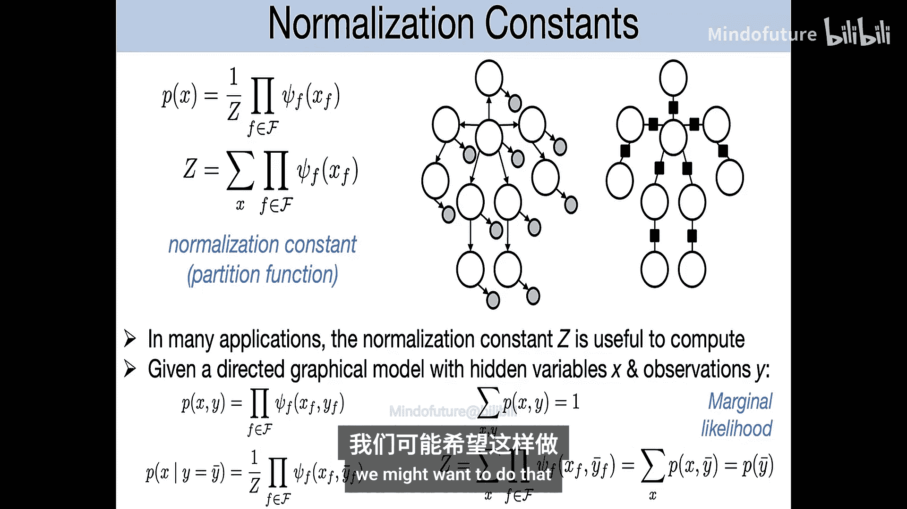

---

## 树结构模型中的细节与归一化

上一节我们介绍了树结构模型上的信念传播算法。本节中，我们来看看算法实现中的一些细节，特别是关于计算归一化常数 `Z` 和避免数值下溢的技巧。

在无向模型中，分布通常表示为势函数乘积除以归一化常数 `Z`：
```
P(X) = (1/Z) * ∏ φ_c(X_c)
```
其中 `Z` 是对所有变量联合配置求和的结果，计算复杂度是指数级的。

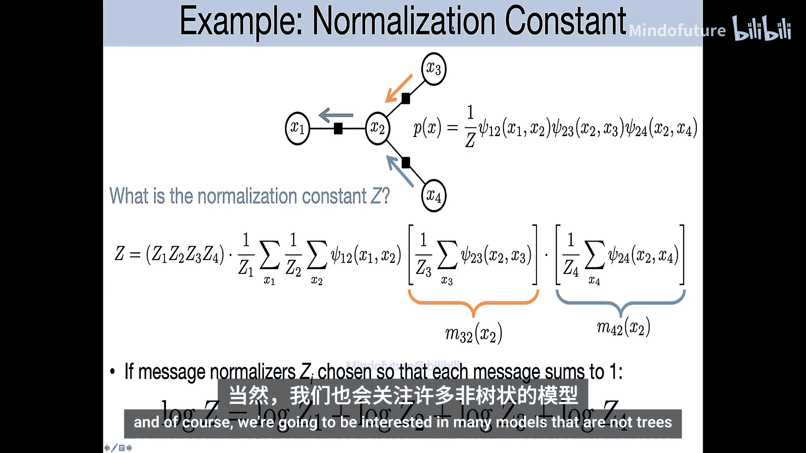

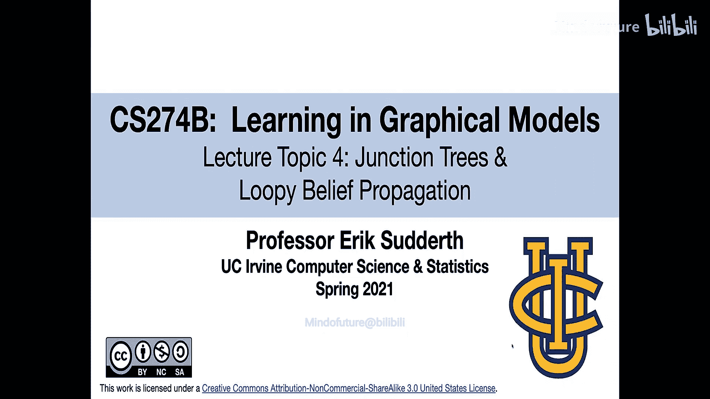

### 归一化常数 `Z` 的意义
`Z` 在许多场景下具有实际意义。例如，在一个包含观测变量 `Y` 和隐变量 `X` 的模型中，给定观测值 `y_bar` 时，条件分布 `P(X | Y=y_bar)` 的归一化常数恰好是观测数据的边际概率 `P(Y=y_bar)`。这个量在模型选择等任务中非常关键。

### 通过和积算法计算 `Z`
在和积算法中，通过归纳论证可以证明，将消息传播到任一节点 `s` 后，对该节点的消息乘积求和，即可得到全局归一化常数 `Z`：
```
Z = ∑_xs [ ∏_{k ∈ N(s)} m_{k->s}(xs) ]
```
其中 `N(s)` 是节点 `s` 的邻居集合。

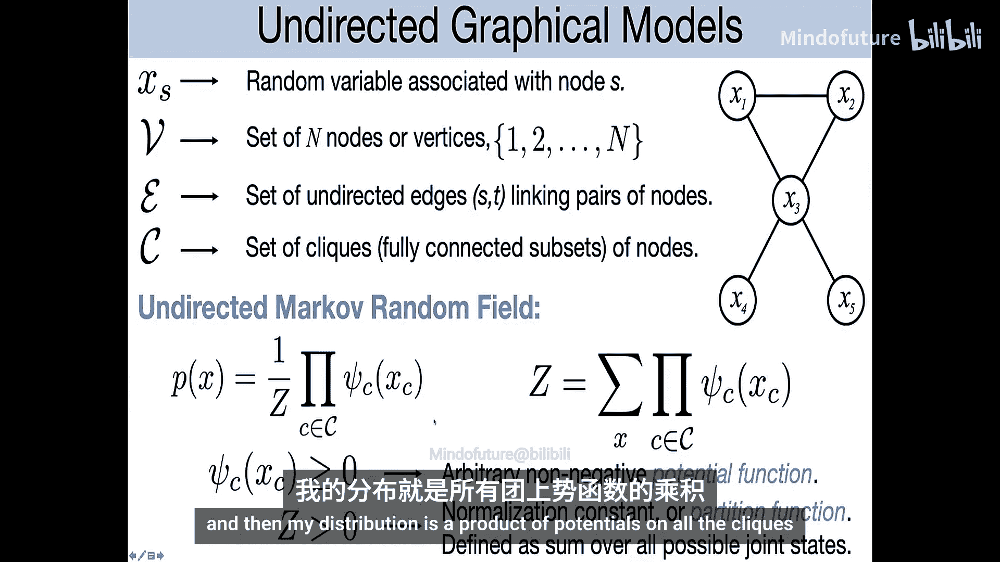

### 数值稳定性问题与解决方案
然而，在实际计算中，如果模型很大，连续乘以许多小于1的概率值会导致数值下溢（结果变为0）。为了解决这个问题，标准的做法是在每次计算消息后，立即对其进行归一化，使其元素之和为1。

假设原始计算的消息为 `m_prime`，归一化后的消息 `m` 为：
```
m = m_prime / sum(m_prime)
```
我们记归一化因子为 `z_local`，即 `z_local = sum(m_prime)`。

### 在归一化后恢复全局 `Z`
尽管每一步都进行了归一化，我们仍然可以恢复全局归一化常数 `Z`。技巧在于，全局 `Z` 等于所有局部归一化因子 `z_local` 的乘积：
```
Z = ∏ z_local
```
在实现中，通常计算其对数值以避免溢出：
```
log Z = ∑ log(z_local)
```
这种方法保证了数值稳定性，同时允许我们在需要时计算 `Z`。

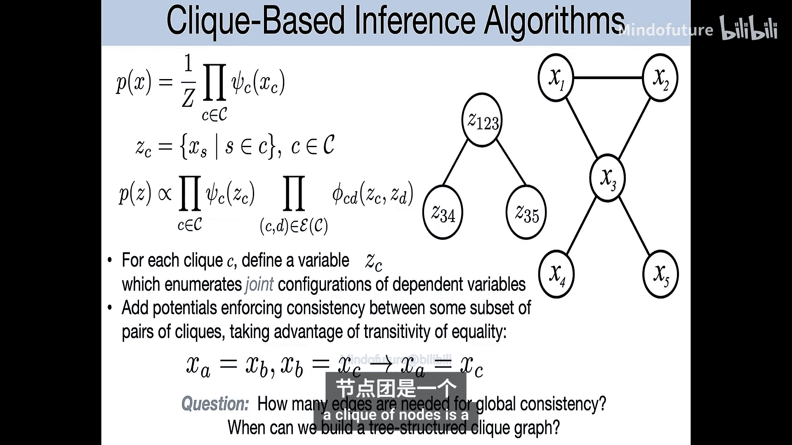

---

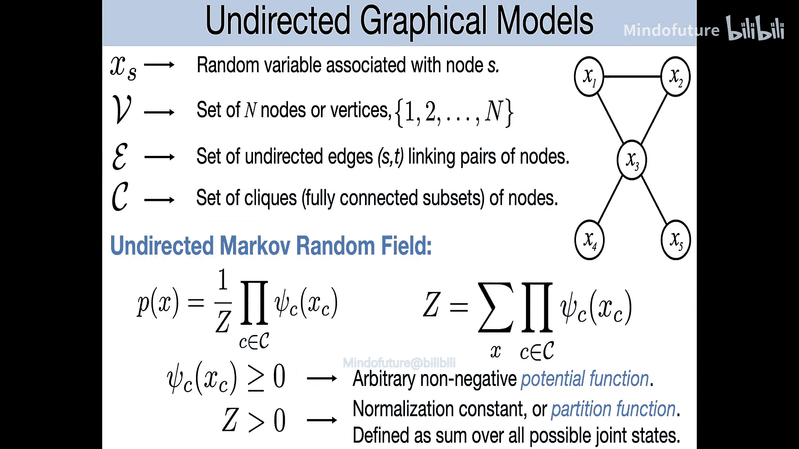

## 处理带循环的图：两种视角

到目前为止，我们方法的局限性在于假设图是树结构的。然而，许多我们感兴趣的模型都包含循环。处理带循环的图主要有两种视角：

1.  **连接树算法**：将带循环的图转换为一个等价的树结构（称为连接树），然后在其上运行树推断算法。这种方法能得到精确的边际分布，但计算代价可能较高，因为转换后的变量域更大。
2.  **循环信念传播**：直接在原带循环的图上运行类似信念传播的消息传递。这种方法速度更快，但得到的是对边际分布的近似。

接下来，我们将首先探讨连接树算法。

---

## 连接树算法

连接树算法的核心思想是将原始图转换为一个特殊的团树，使其满足**连接树性质**，从而在其上运行精确的信念传播。

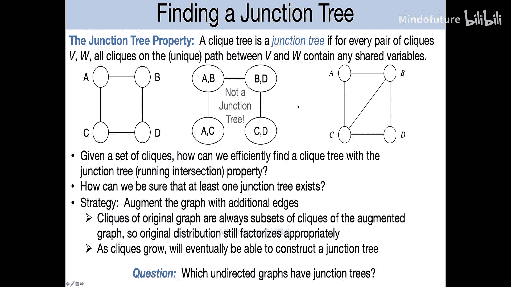

### 从团与因子图出发
考虑一个无向图模型，其分布是定义在团（完全连接的子图）上的势函数的乘积。例如，一个包含团 `{x1, x2, x3}` 和 `{x3, x4}` 的模型。

我们可以为每个团 `C` 定义一个组合变量 `Z_C`，它代表了该团内所有原始变量的联合状态。那么，新分布可以写成这些团势函数的乘积。然而，这引入了一个问题：同一个原始变量（如 `x3`）可能出现在多个团中，而这些副本在采样时可能不一致。

### 添加一致性约束
为了确保所有团中同一变量的副本取值相同，我们需要在每对共享变量的团之间添加**一致性约束势函数**。这个势函数在变量取值一致时为1，否则为0。

### 得到树结构
如果添加约束后的图满足**连接树性质**，即对于任何变量，包含它的所有团在团树中形成一个连通子树，那么这些一致性约束就具备了传递性。这意味着我们只需要在相邻团之间强制执行一致性，就能保证全局一致性。这样就得到了一个树结构，可以在其上运行精确的信念传播。

### 三角化与连接树存在性
并非所有的团树都满足连接树性质。一个关键的理论结果是：一个图的最大团集合能构成连接树，**当且仅当**该图是**三角化的**（或称弦图）。
*   **弦**：图中环路上两个非相邻节点之间的边。
*   **三角化图**：图中所有长度大于等于4的环都至少有一条弦。

如果一个图不是三角化的，我们可以通过添加边（弦）使其三角化，但这会增大团的规模，从而增加计算复杂度。寻找最小化最大团规模的三角化顺序是一个NP难问题，但存在有效的启发式方法。

### 连接树算法步骤
以下是连接树算法的高级步骤：
1.  **三角化**：向原始无向图中添加边，直到其成为三角化图。
2.  **识别最大团**：找出三角化图中的所有最大团。
3.  **构建连接树**：
    *   以最大团为节点。
    *   为每对团计算边的权重，权重为它们共享的变量数（分隔集大小）。
    *   寻找一个**最大权重生成树**。这棵树就是满足连接树性质的连接树。
4.  **在连接树上运行和积算法**：
    *   每个团节点维护一个信念，是其势函数与来自邻居团消息的乘积。
    *   消息传递规则涉及对发送团中不属于分隔集的变量进行求和（边缘化）。
    *   计算成本主要取决于最大团的规模，是指数级的。

连接树算法将推断问题转化为在（可能更大的）团变量树上的精确推断。一旦获得团的边际分布，由于连接树性质，同一个原始变量在不同团中的边际分布是一致的。

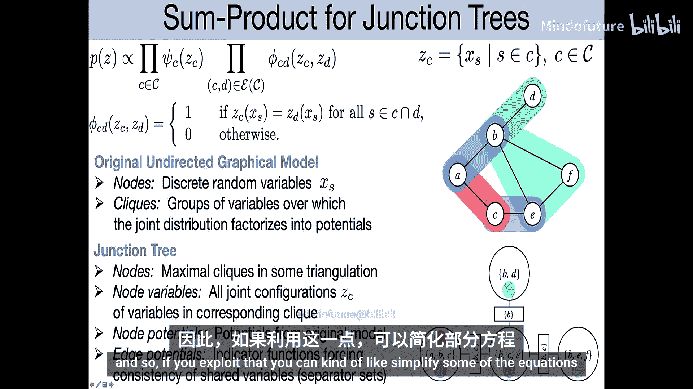

---

## 循环信念传播

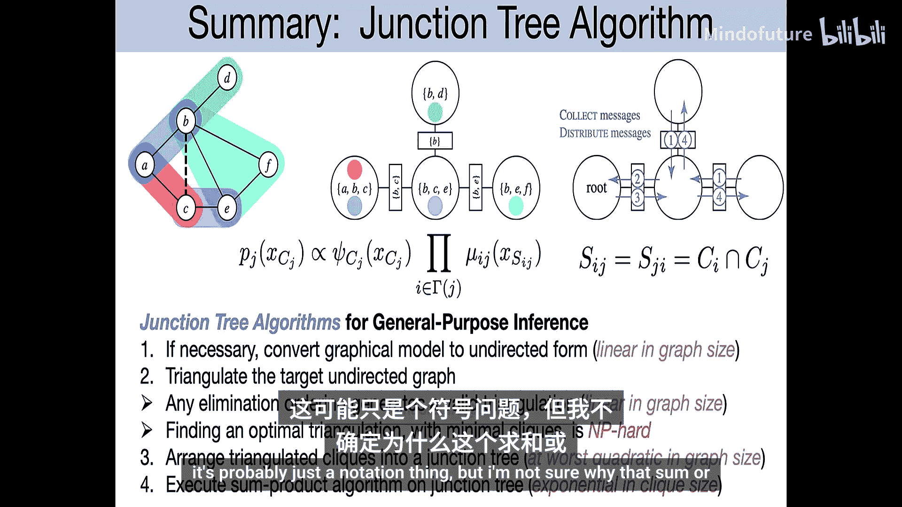

连接树算法虽然精确，但在稠密图上可能计算量过大。循环信念传播提供了一种更轻量级的近似方法。

### 基本思想
循环信念传播直接忽略图的循环结构，将原本为树推导出的和积（信念传播）消息更新规则，反复应用于带循环的图上。
*   每个变量节点根据来自其他邻居的消息计算发送给下一个邻居的消息。
*   每个因子节点也根据传入的消息计算外发的消息。
*   消息在图中循环传递。

由于存在循环，消息更新可能不会像在树上那样经过有限步停止。我们通常迭代执行更新，直到消息收敛到某个固定点，或者达到预设的迭代次数。

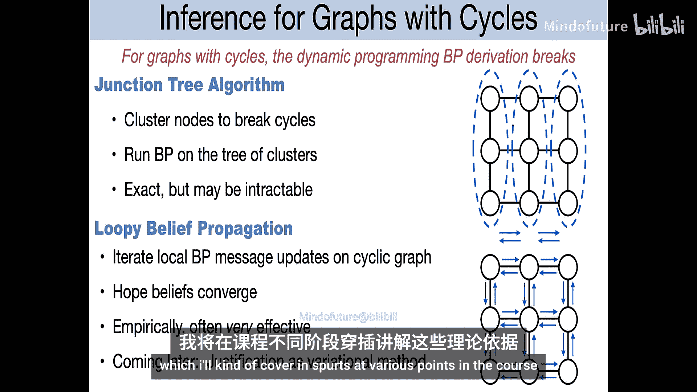

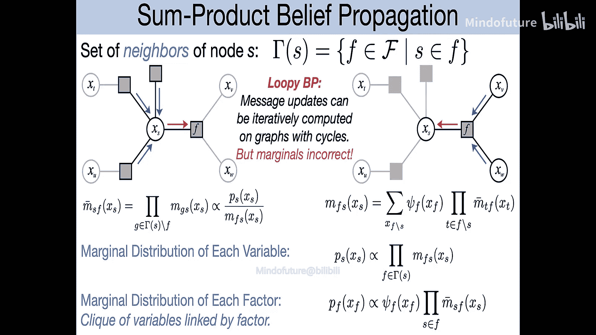

### 效果与影响
尽管缺乏理论保证，循环信念传播在实践中往往表现得出奇得好，能给出非常准确的边际分布近似。它在许多领域取得了巨大成功，最著名的例子是**纠错码译码**。

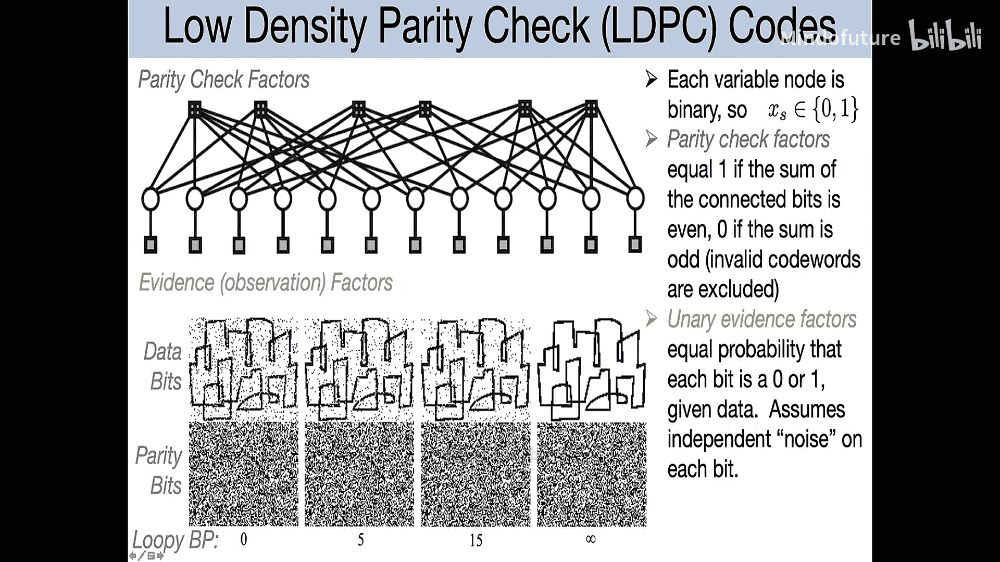

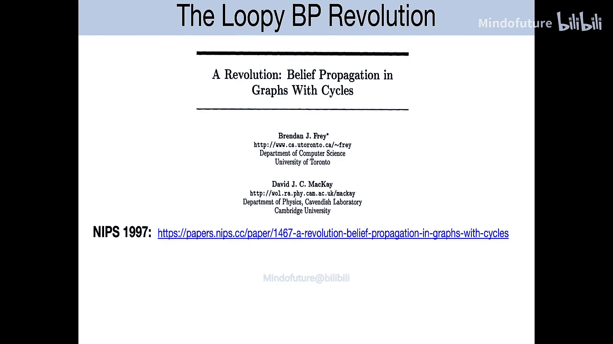

在20世纪90年代，使用基于图形模型的码（如Turbo码、LDPC码）并采用循环信念传播进行译码，其性能远远超过了之前数十年的研究成果，接近香农理论极限，这被认为是编码领域的一场“革命”。

循环信念传播的强大之处在于，它以一种分布式、迭代的方式有效地利用了图中的局部约束信息，即使存在全局循环。

---

## 总结
本节课中我们一起学习了处理带循环图模型的两种核心策略。
1.  **连接树算法**通过三角化图和构建最大权重生成树，将原图转换为一个树结构，从而允许进行精确推断。其计算成本取决于三角化后产生的最大团规模。
2.  **循环信念传播**则是一种近似方法，它直接在图中的节点和因子间迭代传递消息。尽管是近似且收敛性不保证，但在包括现代纠错码在内的许多实际应用中非常有效。

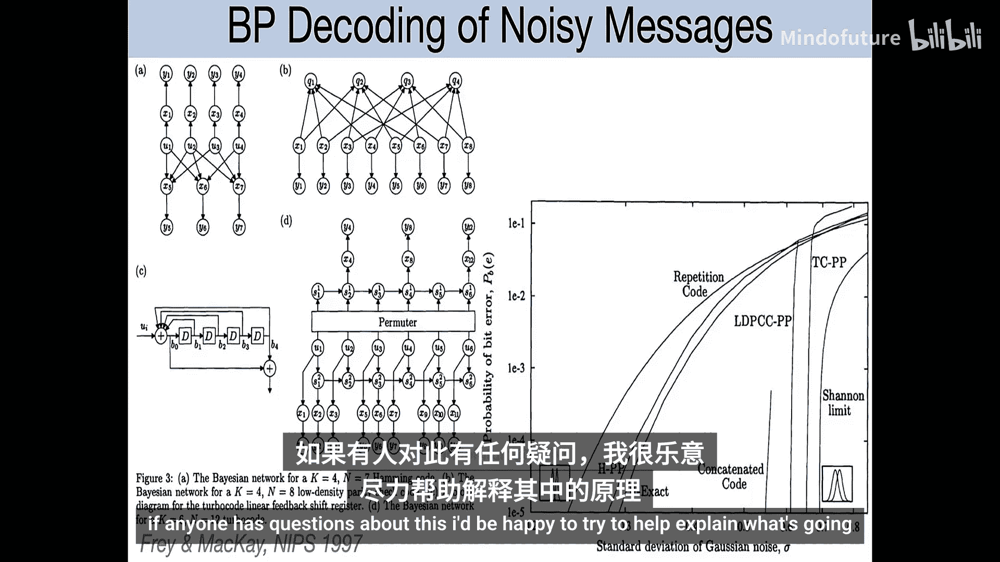

这两种方法构成了概率图模型推断中处理复杂结构的基础工具。