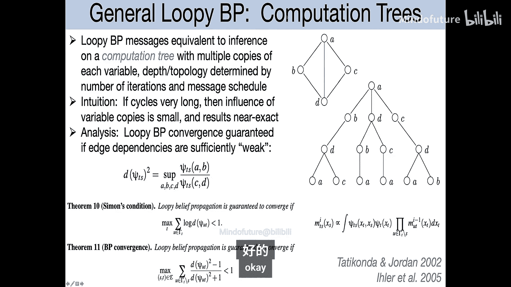
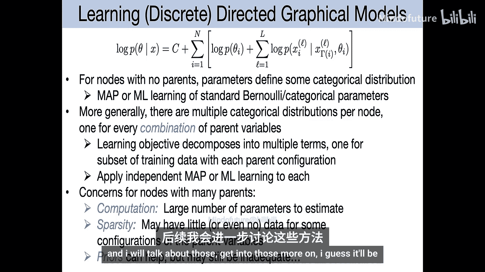

# 006：学习有向图模型

## 概述
在本节课中，我们将继续学习有向图模型的参数估计方法。我们将首先回顾最大似然估计和贝叶斯估计的基本概念，然后探讨如何将这些方法应用于有向图模型，特别是当模型中的节点具有父节点时。我们将学习如何处理参数共享、稀疏数据以及如何利用先验知识进行正则化。

---

## 循环信念传播算法回顾

上一节我们介绍了循环信念传播算法。本节中，我们来看看该算法的一些理论性质和应用实例。

循环信念传播算法是一个简单的想法，其名称来源于在具有环或循环的图上运行标准的信念传播算法。尽管它通常不再给出精确答案，但它是一个具有良好性质的近似算法。

循环信念传播的每一步都是局部的消息更新，仅依赖于图中该节点的邻居。即使图不是树，这种局部消息更新仍然可以进行，但这使得信念传播给出精确边缘分布的推导不再成立。

循环信念传播在某些问题上非常有效。例如，在从消息中去除噪声的应用中，它表现良好。

### 理解循环信念传播何时有效

首先需要注意的是，在一个有向图模型中，如果一个叶节点未被观测，将其边缘化是微不足道的。只需从乘积中删除相应的因子即可。这是因为这些节点没有子节点，其条件分布求和后结果为1。

如果我们将一个有向图模型转换为因子图并运行循环信念传播，即使图中存在环，算法也能自动处理。例如，对于未被观测的叶节点，其发出的消息将是常数，不会影响其他更新，其效果等同于从模型中移除了该节点。

更一般地，如果一个节点及其所有后代都未被观测，那么该节点向其父节点发送的消息将是无信息的常数。这是正确的，因为未被观测的变量不提供任何信息。因此，对于某些有向图模型，循环信念传播实际上可以精确计算先验的边缘分布。

然而，这并不意味着它总是精确的。如果某些节点被观测，循环信念传播通常只能产生可能准确的后验边缘分布近似。

### 应用实例与收敛性

在医疗诊断等模型中，通常有数百种疾病和数千种可能的发现。对于一个病人，通常只观测到部分发现。如果所有发现都未被观测，循环信念传播会返回正确的疾病先验概率。如果只观测到一个发现，循环信念传播也能给出正确的后验，因为边缘化掉未观测发现后，图结构变为树。

然而，当有多个观测发现时，循环信念传播通常不能保证给出精确结果，其结果是近似的。尽管如此，在这类模型中，近似结果通常相当好。

早期研究表明，在具有随机生成条件概率的较小模型上，循环信念传播的估计值与真实边缘概率非常接近，优于使用有限样本的蒙特卡洛方法（如似然加权法）。

然而，循环信念传播并不总是收敛。在某些真实模型实例中，算法可能无法收敛，信念值会进入极限环振荡。这通常与模型中的极端概率（接近0或1）有关。

### 理论基础

对于最简单的非树情况——只有一个环的图，理论分析表明：
*   无论势函数如何，循环信念传播都有唯一的固定点。
*   只要所有势函数严格为正，算法保证收敛。如果势函数中存在零值（即某些状态组合不可能），则可能出现振荡。
*   在此单环图上，循环信念传播的估计不精确，但具有一个有趣的性质：概率较高的状态总是与真实边缘分布匹配。这意味着，如果真实概率高于0.5，循环信念传播的估计值也会高于0.5。
*   更快的收敛速度通常意味着更好的边缘分布近似。

对于具有多个环的更复杂图，可以通过“计算树”的概念来分析循环信念传播。其直觉是，如果图中的环很长，依赖关系在环上传播时会减弱，因此近似效果会更好。

有理论保证，只要边依赖足够弱，即使图中有许多环，循环信念传播也能保证收敛。这里的“依赖强度”与势函数矩阵中最大项与最小项的比值有关。如果这个比值过大（例如存在零值），收敛性可能无法保证。

这些理论解释了为什么在作业中使用循环信念传播进行近似是合理的，因为在许多情况下可以期望近似是准确的。

---

## 参数估计：最大似然与贝叶斯方法

现在，我们将转向一个新的话题：图形模型的参数从何而来？我们将讨论如何从数据中估计模型的参数。

### 最大似然估计回顾

假设我们有 `L` 个独立同分布的观测数据 `x^(1), x^(2), ..., x^(L)`，它们来自某个参数为 `θ` 的未知分布族 `P(x | θ)`。

一个估计量是根据数据猜测参数 `θ` 的函数。最大似然估计是一种直观的参数估计方法，它选择使观测数据出现概率最大的参数。

具体地，似然函数是给定参数下数据的联合概率：`∏_{l=1}^{L} P(x^(l) | θ)`。最大似然估计量 `θ_hat` 是最大化该似然函数的参数值。由于对数函数是单调的，我们通常最大化对数似然函数：`∑_{l=1}^{L} log P(x^(l) | θ)`。

最大似然估计具有一些良好的性质，例如相合性（随着数据量增加，估计值收敛于真实参数）和渐近有效性。

对于许多模型，对数似然函数是参数的光滑连续函数。寻找最大值的一个标准方法是求导并令导数为零。

#### 简单例子：伯努利分布

对于伯努利分布（二元变量），参数 `θ` 表示取值为1的概率。给定数据，对数似然为 `∑_{l} [ x^(l) log θ + (1 - x^(l)) log(1 - θ) ]`。令其关于 `θ` 的导数为零，解得最大似然估计为 `θ_hat = (∑ x^(l)) / L`，即数据中1出现的比例。

#### 简单例子：范畴分布

对于范畴分布（K个类别的分类），参数是一个K维向量 `θ = (θ_1, ..., θ_K)`，满足 `θ_k ≥ 0` 且 `∑ θ_k = 1`。给定数据，令 `n_k` 为类别k出现的次数，则对数似然为 `∑_{k} n_k log θ_k`。这是一个在单纯形上的约束优化问题。

利用拉格朗日乘子法求解，得到最大似然估计为 `θ_k_hat = n_k / L`，即每个类别的经验频率。

当类别数K很大或数据量有限时，某些类别可能从未出现，导致其最大似然估计概率为零。这可能是不可取的，因此需要正则化方法，如贝叶斯估计。

---

### 贝叶斯参数估计

贝叶斯方法在参数估计中引入了先验分布 `P(θ)`，表示在见到数据之前对参数的信念。根据贝叶斯规则，参数的后验分布为：
`P(θ | x) = [P(θ) P(x | θ)] / P(x)`。

后验分布包含了数据和先验的全部信息。有时我们需要一个点估计，两个常用的选择是：
1.  **最大后验估计**：选择后验概率最大的参数：`θ_MAP = argmax_θ P(θ | x)`。
2.  **后验均值估计**：选择后验分布的期望：`θ_Mean = E[θ | x] = ∫ θ P(θ | x) dθ`。
后验均值在最小化均方误差的意义下是最优的。

#### 简单例子：伯努利分布（贝叶斯）

对于伯努利分布，似然函数为 `θ^{#Heads} (1-θ)^{#Tails}`。假设先验为 `θ` 在 [0,1] 上的均匀分布，则后验分布正比于 `θ^{#Heads} (1-θ)^{#Tails}`。这正是**Beta分布**的形式：`P(θ) ∝ θ^{α-1} (1-θ)^{β-1}`。

均匀分布对应 `α=1, β=1` 的Beta分布。更一般地，如果我们使用参数为 `(α, β)` 的Beta分布作为先验，那么后验分布将是另一个Beta分布，参数更新为 `(α + #Heads, β + #Tails)`。这种先验与似然函数共轭的性质称为**共轭性**。

后验均值为 `(α + #Heads) / (α + β + L)`。这可以看作在经验计数上加了“伪计数” `α` 和 `β` 后再归一化。当使用均匀先验 (`α=β=1`) 时，得到“加一平滑”估计量，确保概率估计不会为零或一。

#### 简单例子：范畴分布（贝叶斯）

范畴分布的共轭先验是**狄利克雷分布**：`P(θ) ∝ ∏_{k=1}^{K} θ_k^{α_k - 1}`，其中 `θ` 位于K维单纯形上。狄利克雷分布可以产生均匀、集中或稀疏（偏向单纯形角落）的先验。

给定数据计数 `n_k`，后验分布仍是狄利克雷分布，参数更新为 `(α_1 + n_1, ..., α_K + n_K)`。后验均值为 `θ_k = (α_k + n_k) / (∑_j α_j + L)`。

稀疏先验（`α_k < 1`）在图形模型中很有用，因为它可以捕捉变量与其父节点之间可能存在的关系稀疏性。

---

## 有向图模型的参数估计

现在，我们将上述概念连接到有向图模型的参数估计。

### 模型分解与独立学习

一个有向图模型的联合分布分解为每个节点给定其父节点的条件分布的乘积：`P(x | θ) = ∏_{i=1}^{n} P(x_i | x_{π(i)}, θ_i)`。这里 `θ_i` 是定义节点 `i` 条件分布的参数。

因此，整个模型的（对数）似然函数是每个节点（对数）条件概率的和：`log P(x | θ) = ∑_{i=1}^{n} log P(x_i | x_{π(i)}, θ_i)`。

如果我们进一步假设参数的先验分布也在各节点上分解：`P(θ) = ∏_{i=1}^{n} P(θ_i)`，那么后验分布的对数也是各节点项的和。

**关键点**：由于这种可加性分解，我们可以独立地为图中的每个节点解决参数估计问题（最大似然或贝叶斯）。学习有向图模型的参数，本质上就是学习如何基于其父节点预测每个变量。

### 处理训练数据集

假设我们有 `L` 个独立同分布的训练样本（例如，L个病人，每个病人对应一个图实例）。整个数据集的似然是每个样本似然的乘积。取对数后，我们可以交换求和顺序：
`log P({x^(l)} | θ) = ∑_{i=1}^{n} [ ∑_{l=1}^{L} log P(x_i^(l) | x_{π(i)}^(l), θ_i) ]`。
这再次证实了我们可以为每个节点 `i` 独立地最大化其自己的数据项 `∑_{l} log P(x_i^(l) | x_{π(i)}^(l), θ_i)`。

### 参数共享

在实际应用中，我们可能希望在不同节点或不同时间步共享参数。例如，在隐马尔可夫模型中，状态转移概率 `P(z_t | z_{t-1})` 在所有时间步 `t` 可能是相同的。

这很容易实现：我们为每种类型的条件分布（如“状态转移”、“观测发射”）定义一组参数。然后，将所有属于该类型的节点的数据聚合起来，用于估计这组共享参数。

### 具体实施步骤

1.  **无父节点的节点**：其分布是简单的范畴分布。直接应用前面介绍的伯努利/范畴分布的估计方法。
2.  **有父节点的节点**：需要学习一个**条件概率表**。对于父节点变量的每一种可能取值组合，都需要学习一个独立的范畴分布。
    *   **问题**：如果父节点很多，组合数会呈指数增长，导致需要估计的参数过多，并且数据可能非常稀疏（许多组合没有观测数据）。
    *   **解决方案**：需要更紧凑的参数化方法（例如，逻辑回归、神经网络等），我们将在后续课程中讨论。

---

## 总结
本节课中，我们一起学习了有向图模型的参数估计。我们首先回顾了循环信念传播算法的理论和应用，了解了其近似性质、收敛条件以及在某些情况下的良好表现。接着，我们系统回顾了参数估计的两种基本框架：最大似然估计和贝叶斯估计，并通过伯努利分布和范畴分布的实例加深理解。最后，我们将这些方法应用于有向图模型，展示了如何利用模型的因子分解性质，将全局参数估计问题分解为每个节点独立的局部估计问题，并简要讨论了参数共享和处理父节点众多时面临的挑战。这为我们后续学习更复杂的参数化方法和学习算法奠定了基础。