# 008：学习无向图模型与指数族

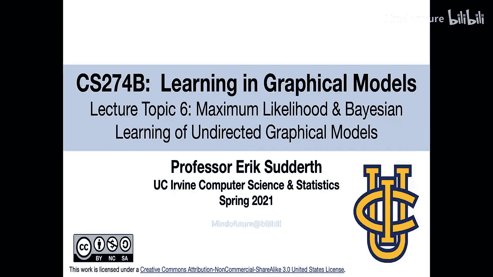

在本节课中，我们将要学习如何从数据中学习无向图模型的参数。我们将看到，无向图模型的学习自然地与统计学和概率机器学习中广泛使用的**指数族**概率分布联系起来。理解这种联系对于高效地学习和推断至关重要。

## 指数族概率分布简介

上一节我们介绍了无向图模型的基本形式。本节中，我们来看看一种强大的概率分布框架——指数族。

一个指数族概率分布可以写成以下形式：

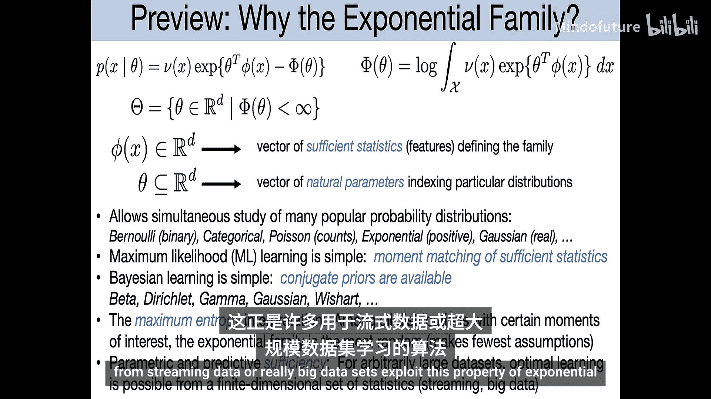

$$
p(x; \theta) = \frac{1}{Z(\theta)} \nu(x) \exp(\theta^T \phi(x))
$$

其中：
*   $\theta$ 是一个 $D$ 维向量，称为**自然参数**。
*   $\phi(x)$ 是一个 $D$ 维向量，称为**充分统计量**或**特征向量**。
*   $\nu(x)$ 是一个与参数无关的**参考测度**，通常为1。
*   $Z(\theta)$ 是**配分函数**，用于确保概率和为1，定义为 $Z(\theta) = \int \nu(x) \exp(\theta^T \phi(x)) dx$。
*   参数 $\theta$ 的取值范围 $\Theta$ 是使得 $Z(\theta)$ 有限的集合。

这个形式的核心是，概率的对数是参数 $\theta$ 和特征 $\phi(x)$ 的线性函数（加上一个对数归一化项）。

### 为什么指数族如此重要？

以下是研究指数族的几个关键原因：

*   **统一框架**：它同时涵盖了众多常见的概率分布，如伯努利、分类、泊松、指数、高斯（正态）、伽马、威沙特、贝塔、狄利克雷分布等。
*   **最大似然估计简单**：对于任何指数族分布，最大似然估计（MLE）的解总是具有相同的形式：**让模型特征的期望值等于数据特征的样本均值**。
*   **共轭先验存在**：指数族分布存在共轭先验，这使得贝叶斯学习和分析变得简单。
*   **最大熵解释**：在满足给定特征期望值的所有分布中，指数族分布是“最随机”或“最无偏”的，即它是最大熵分布。
*   **充分性**：数据可以被压缩为有限维的统计量 $\phi(x)$，而不会丢失用于学习或推断的信息。

## 常见分布的指数族形式

为了更好地理解，让我们看几个具体例子。

### 伯努利分布

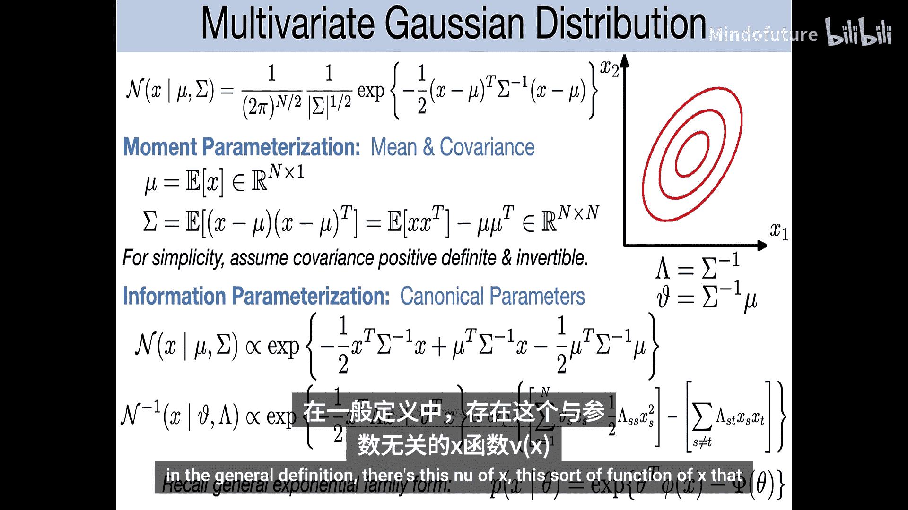

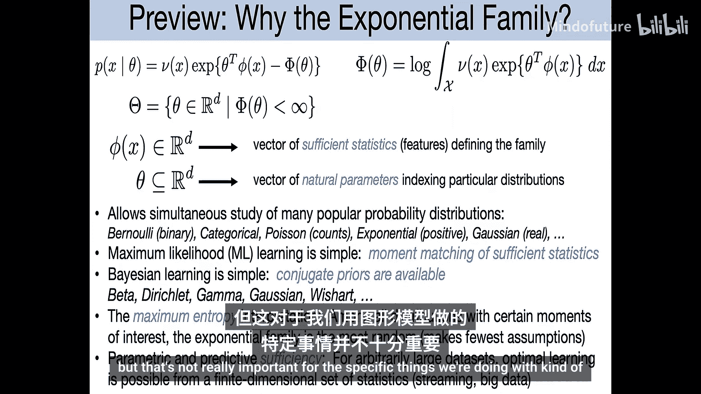

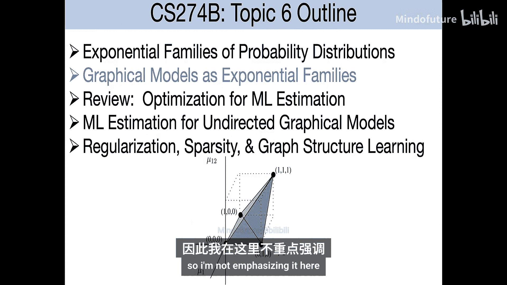

伯努利分布 $p(x; \mu) = \mu^x (1-\mu)^{1-x}$ 可以写成指数族形式。

通过对数变换和代数重组，我们可以得到：
$$
p(x; \theta) = \exp(\theta x - \log(1 + e^\theta))
$$
其中，自然参数 $\theta$ 是**对数几率**：$\theta = \log(\frac{\mu}{1-\mu})$。
对应的特征函数是 $\phi(x) = x$。
从 $\theta$ 恢复 $\mu$ 的函数是**逻辑函数**（sigmoid）：$\mu = \sigma(\theta) = \frac{1}{1+e^{-\theta}}$。

### 分类分布

类似地，分类分布 $p(x=k; \mu) = \mu_k$ 可以写成：
$$
p(x; \theta) = \exp(\sum_{k=1}^{K} \theta_k \mathbb{I}[x=k] - \log(\sum_{j=1}^{K} e^{\theta_j}))
$$
其中，$\theta_k$ 是自然参数，特征是指示函数 $\phi_k(x) = \mathbb{I}[x=k]$。
从 $\theta$ 恢复 $\mu$ 的函数是 **softmax 函数**：$\mu_k = \frac{e^{\theta_k}}{\sum_j e^{\theta_j}}$。

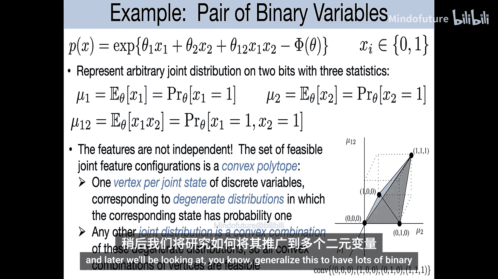

### 高斯分布

多元高斯分布 $p(x; \mu, \Sigma) = \mathcal{N}(x; \mu, \Sigma)$ 也可以写成指数族形式。

更方便的参数化是使用**自然参数**：$\eta = \Sigma^{-1}\mu$ 和 $\Lambda = \Sigma^{-1}$（精度矩阵）。
那么分布可以写成：
$$
p(x; \eta, \Lambda) = \exp\left( \text{Tr}(\Lambda xx^T) + \eta^T x - \frac{1}{2}(\text{Tr}(\Lambda \mu\mu^T) + \log|\Lambda|) \right) \cdot \text{常数}
$$
这里的特征向量 $\phi(x)$ 包含了 $x$ 的各分量、各分量的平方以及各分量之间的乘积项。

## 指数族与无向图模型的联系

现在，我们回到无向图模型，看看它们如何与指数族联系起来。

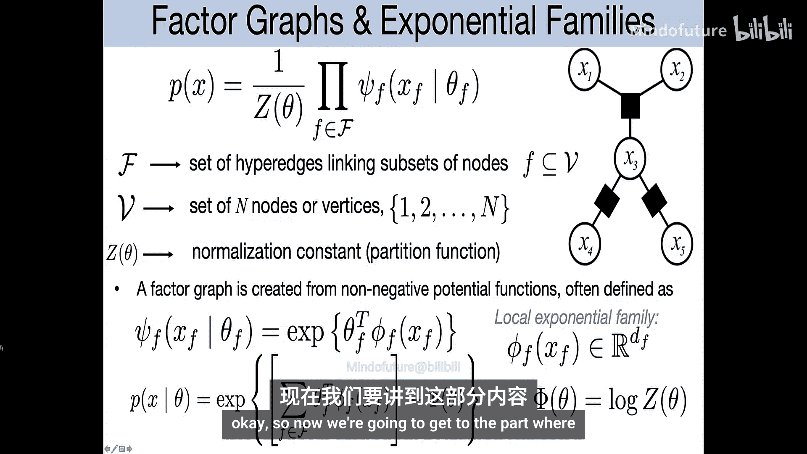

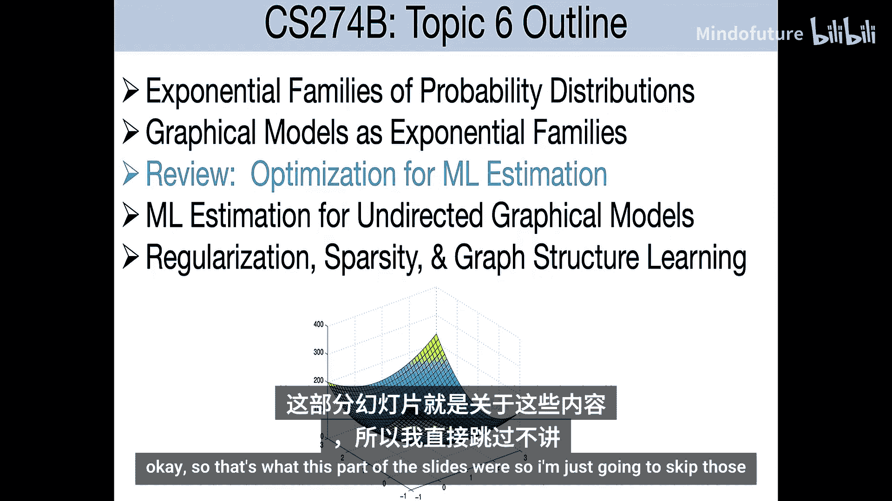

回想一下，一个因子图或无向图模型定义为：
$$
p(x) = \frac{1}{Z} \prod_{c \in C} \psi_c(x_c)
$$
其中 $\psi_c(x_c)$ 是非负的**势函数**。

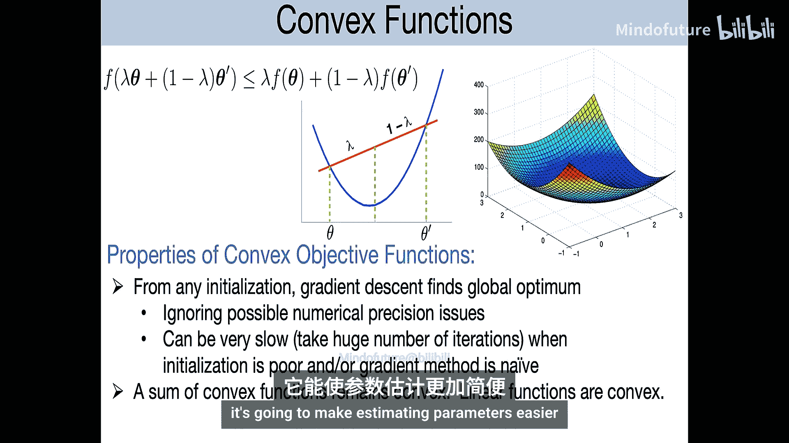

为了从数据中学习模型，我们需要可调的势函数。一个确保非负性的方便参数化方法是：
$$
\psi_c(x_c; \theta_c) = \exp(\theta_c^T \phi_c(x_c))
$$
这里，$\phi_c(x_c)$ 是我们定义的、依赖于因子 $c$ 所关联变量的**特征向量**。$\theta_c$ 是对应的参数向量。

将这种参数化代入整体分布：
$$
p(x; \theta) = \frac{1}{Z(\theta)} \exp\left( \sum_{c \in C} \theta_c^T \phi_c(x_c) \right) = \frac{1}{Z(\theta)} \exp\left( \theta^T \phi(x) \right)
$$
其中，$\theta$ 是所有 $\theta_c$ 拼接成的向量，$\phi(x)$ 是所有 $\phi_c(x_c)$ 拼接成的向量。这正是**指数族**的形式。

因此，**通过将因子参数化为指数形式，整个无向图模型就成为一个指数族分布**。特征 $\phi(x)$ 的选择决定了模型的表达能力，而因子图的结构（哪些变量出现在同一个因子中）则反映了模型所隐含的条件独立性假设。

## 指数族的最大似然学习与凸性

理解了联系之后，我们来看如何学习指数族（即无向图模型）的参数。我们将使用最大似然估计。

对于指数族 $p(x;\theta) = \exp(\theta^T \phi(x) - A(\theta))$（这里 $A(\theta) = \log Z(\theta)$ 称为对数配分函数），其对数似然函数为：
$$
\ell(\theta) = \theta^T \left( \sum_{i=1}^L \phi(x^{(i)}) \right) - L \cdot A(\theta) + \text{常数}
$$
其中 $x^{(1)}, \dots, x^{(L)}$ 是 $L$ 个独立观测数据。

为了最大化似然，我们通常最小化**负对数似然** $-\ell(\theta)$。指数族有一个非常好的性质：

**定理**：对数配分函数 $A(\theta)$ 是凸函数。
**证明**：可以计算 $A(\theta)$ 的梯度和海森矩阵：
*   梯度：$\nabla_\theta A(\theta) = \mathbb{E}_{p(x;\theta)}[\phi(x)]$
*   海森矩阵：$\nabla_\theta^2 A(\theta) = \text{Cov}_{p(x;\theta)}[\phi(x)]$
由于协方差矩阵总是半正定的，所以 $A(\theta)$ 是凸函数。

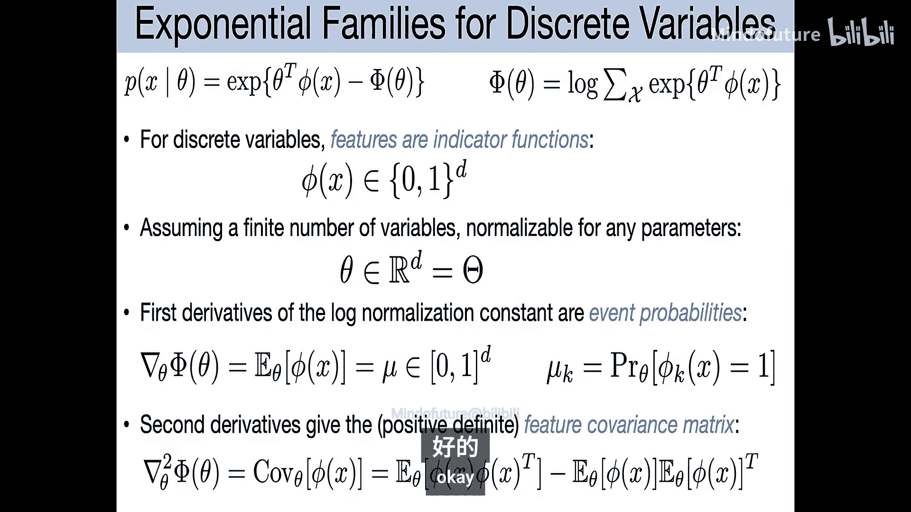

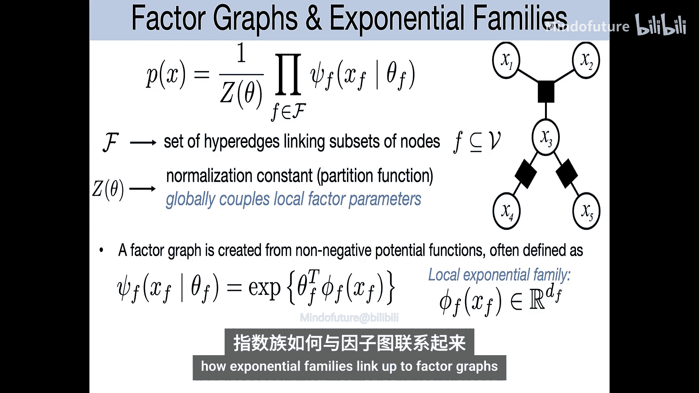

因此，负对数似然 $-\ell(\theta)$ 是一个线性项（凸）减去一个凸函数，整体仍然是凸函数。这意味着**优化问题没有局部最优，只有全局最优**，使用梯度下降等方法可以可靠地找到最优解。

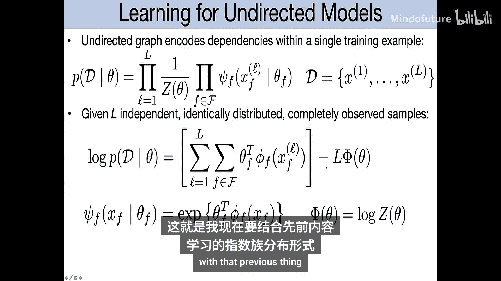

### 最大似然解的条件

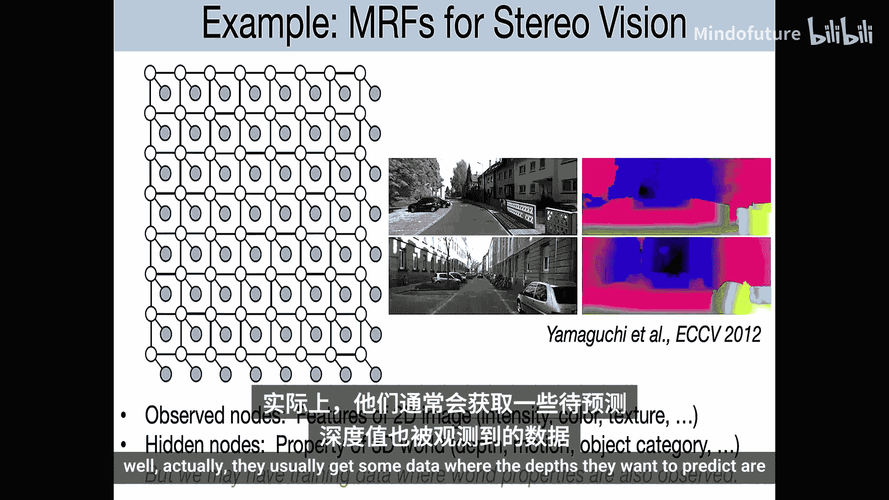

令梯度为零以求最大似然解 $\hat{\theta}_{MLE}$：
$$
\nabla_\theta (-\ell(\theta)) = L \cdot \mathbb{E}_{p(x;\theta)}[\phi(x)] - \sum_{i=1}^L \phi(x^{(i)}) = 0
$$
这导出了著名的**矩匹配**条件：
$$
\mathbb{E}_{p(x;\hat{\theta}_{MLE})}[\phi(x)] = \frac{1}{L} \sum_{i=1}^L \phi(x^{(i)})
$$
**最大似然估计要求模型特征的期望值等于数据特征的样本均值。**

### 学习中的计算

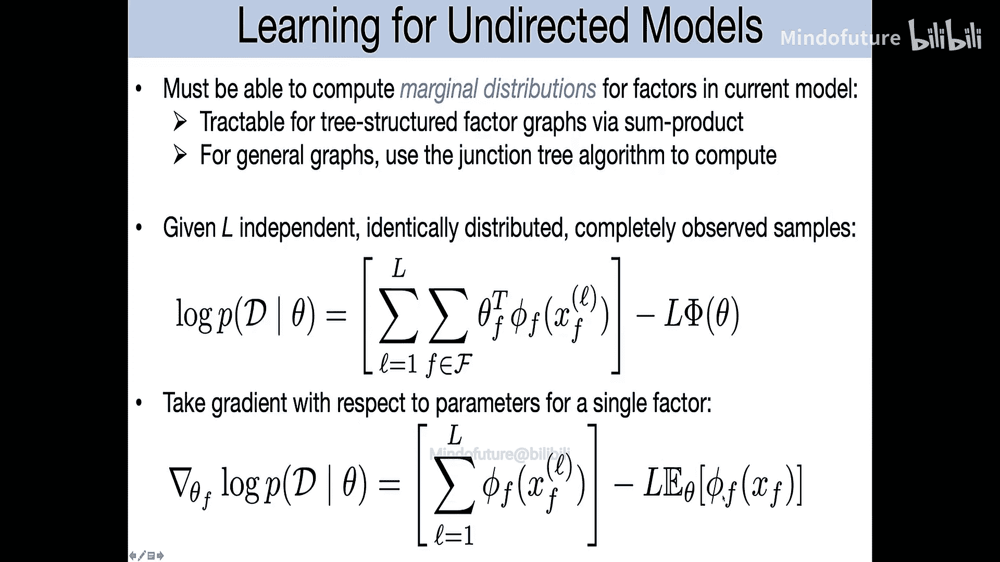

在实际的梯度下降中，每一步都需要计算梯度：
$$
\nabla_\theta (-\ell(\theta)) = \mathbb{E}_{p(x;\theta)}[\phi(x)] - \frac{1}{L} \sum_{i=1}^L \phi(x^{(i)})
$$
计算数据均值 $\frac{1}{L}\sum_i \phi(x^{(i)})$ 是直接的。困难的部分在于计算**模型期望** $\mathbb{E}_{p(x;\theta)}[\phi(x)]$，这通常需要对当前概率分布 $p(x;\theta)$ 进行推断（例如，计算边际概率）。这解释了为什么**推断是学习的基础**。

对于树状结构的图，我们可以使用和积算法高效计算边际和期望。对于带环的图，则需要使用近似推断方法（如循环置信传播、 junction tree 算法等）。

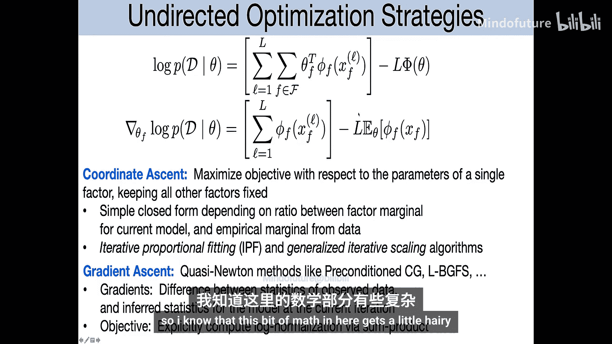

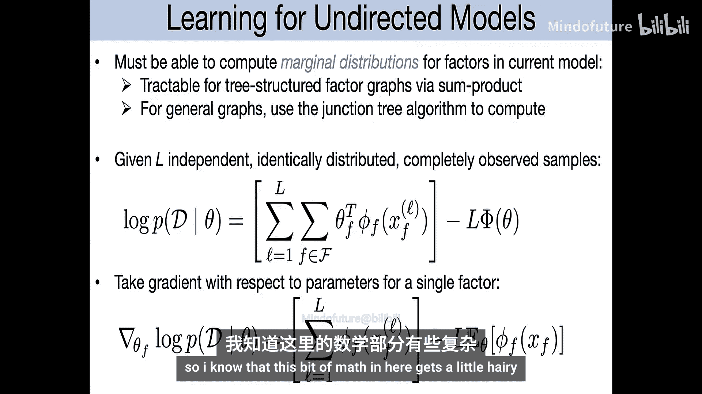

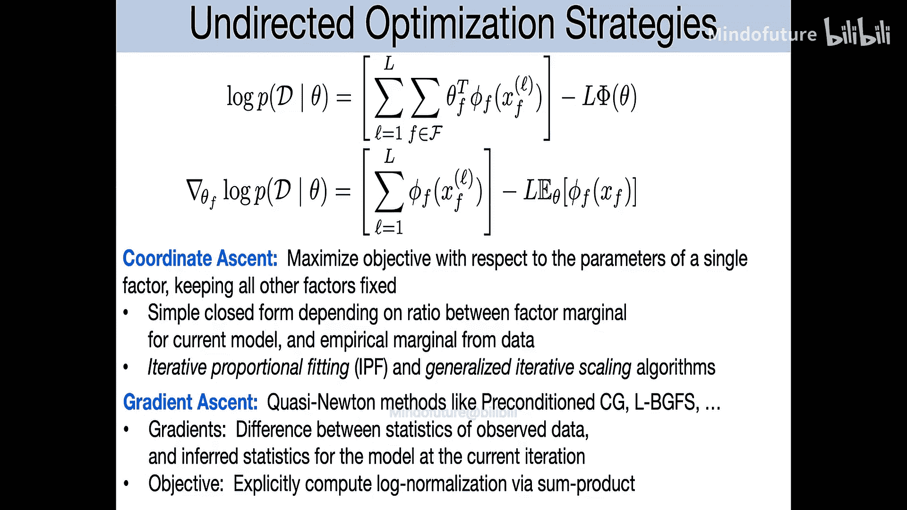

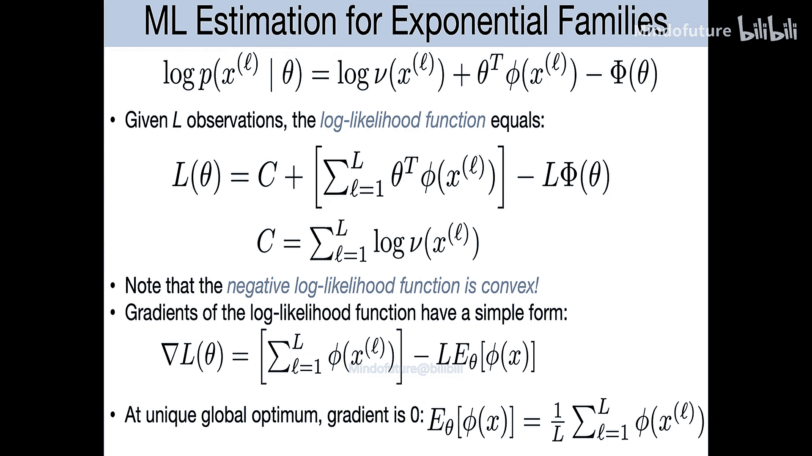

## 正则化与模型选择

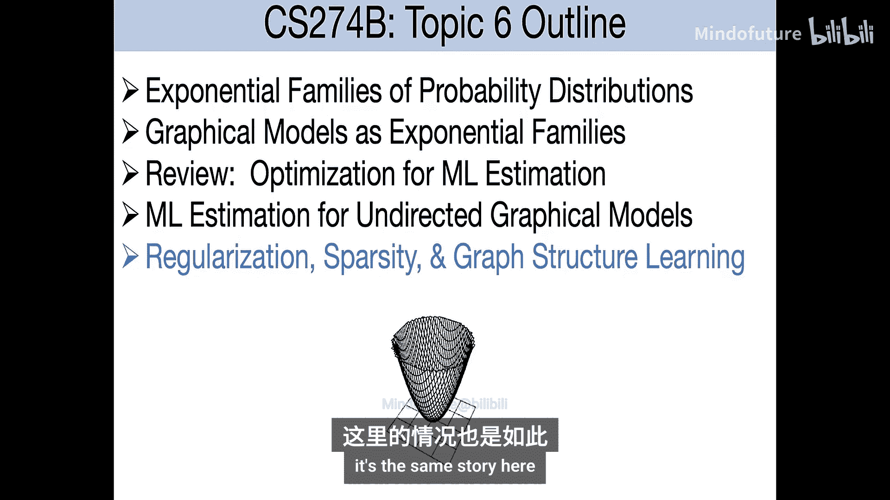

当模型有很多特征（即参数很多）时，容易过拟合。正则化是必要的。

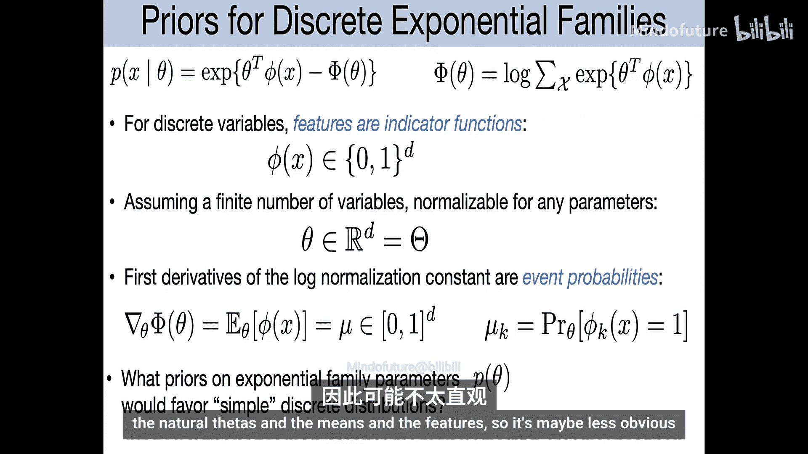

在指数族中，参数 $\theta$ 为零有特殊意义：
*   对于伯努利分布，$\theta=0$ 对应 $\mu=0.5$（最不确定的状态）。
*   对于交互项（如 $\theta_{12}x_1x_2$），$\theta_{12}=0$ 意味着变量 $x_1$ 和 $x_2$ 独立。
*   一般来说，若某个因子对应的参数 $\theta_c=0$，则势函数 $\psi_c = \exp(0)=1$，相当于从模型中移除了该因子。

因此，一个合理的先验是鼓励参数 $\theta$ 接近零，这对应于鼓励更简单、更平滑、更独立的模型。

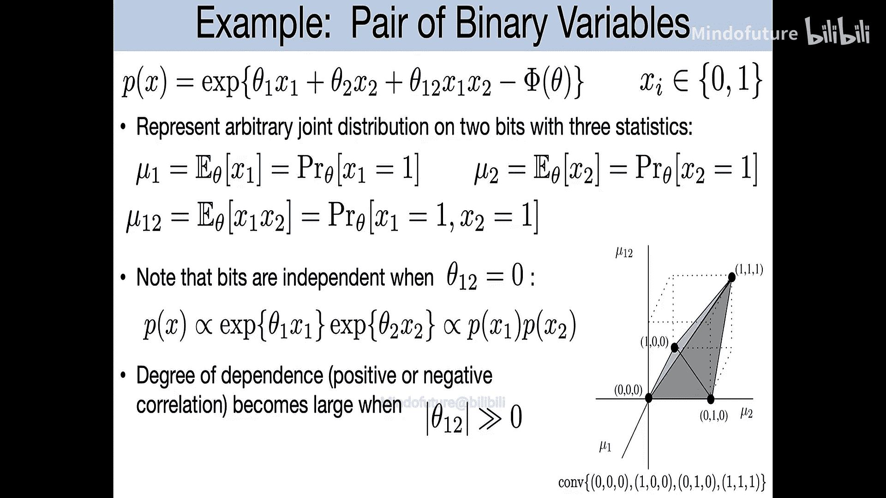

### L2 正则化（高斯先验）

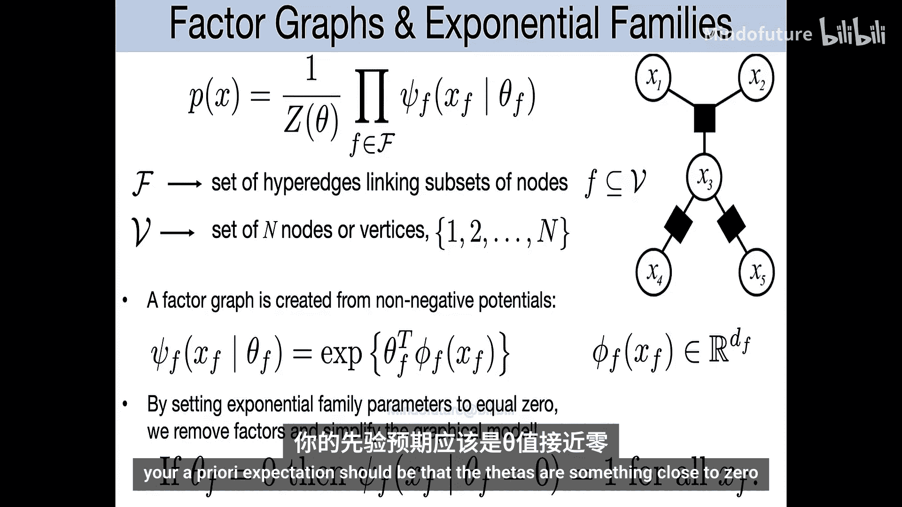

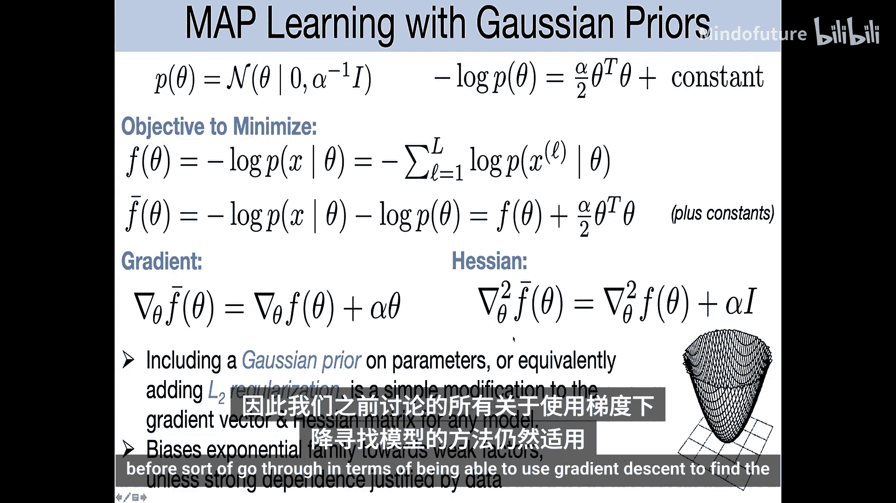

使用零均值高斯先验 $p(\theta) \propto \exp(-\frac{\alpha}{2} \|\theta\|_2^2)$ 等价于在目标函数中添加 L2 惩罚项：
$$
\text{最小化：} -\ell(\theta) + \frac{\lambda}{2} \|\theta\|_2^2
$$
其中 $\lambda$ 是正则化强度。这会使参数向零收缩，但通常不会恰好为零。

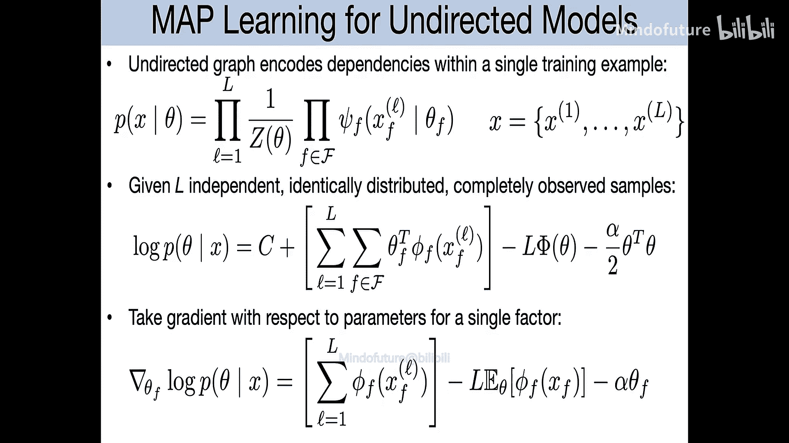

### L1 正则化（拉普拉斯先验）与稀疏性

使用拉普拉斯先验 $p(\theta) \propto \exp(-\alpha \|\theta\|_1)$ 等价于添加 L1 惩罚项：
$$
\text{最小化：} -\ell(\theta) + \lambda \|\theta\|_1
$$
L1 正则化倾向于产生**稀疏解**，即许多参数 $\theta_c$ 恰好为零。这实现了**自动特征选择**或**图结构学习**：零参数对应的特征（或因子）被从模型中剔除，从而学习到了一个更稀疏的图结构。

### 应用示例：词共现图学习

一个经典应用是学习单词在文档中的共现关系。将每个文档表示为一个二元向量，指示100个常见单词是否出现。模型为每个单词对 $(j, k)$ 引入一个特征 $\phi_{jk}(x) = x_j x_k$ 和参数 $\theta_{jk}$，用于捕捉共现关系。

使用 L1 正则化逻辑回归（等价于上述指数族模型）学习参数后，许多 $\theta_{jk}$ 会变为零。非零的 $\theta_{jk}$ 定义了单词之间的“边”，从而形成一个图。这个图可以揭示语义相关的单词群（如体育、宗教、计算机术语等），正参数表示单词倾向于共同出现，负参数表示它们互斥。

## 总结

本节课中我们一起学习了：
1.  **指数族分布**：一种形式为 $p(x;\theta) \propto \exp(\theta^T \phi(x))$ 的强大概率分布框架，涵盖了众多常见分布。
2.  **与无向图模型的联系**：通过将势函数参数化为 $\psi_c(x_c) = \exp(\theta_c^T \phi_c(x_c))$，整个无向图模型成为一个指数族分布。特征定义表达能力，图结构定义条件独立关系。
3.  **凸性与最大似然学习**：指数族的负对数似然是凸函数，保证了全局最优。最大似然解满足“矩匹配”条件：模型特征的期望等于数据特征的样本均值。
4.  **学习算法**：通常使用梯度下降。每一步都需要在当前模型下进行推断以计算特征期望。
5.  **正则化**：为防止过拟合，可以对参数施加先验。L2正则化使参数收缩，L1正则化能产生稀疏解，自动进行特征选择或图结构学习，这是学习图模型结构的一种有效方法。

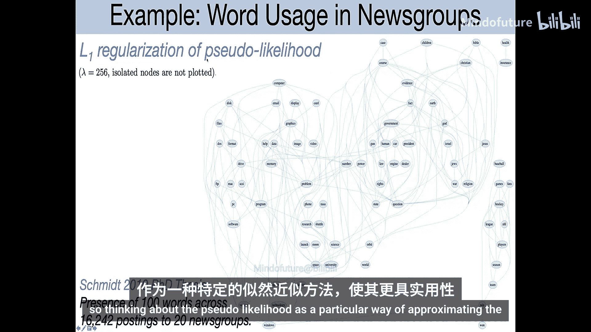

理解指数族为学习和分析无向图模型（以及许多其他概率模型）提供了一个统一而强大的理论基础。