# 009：信息理论与树结构学习

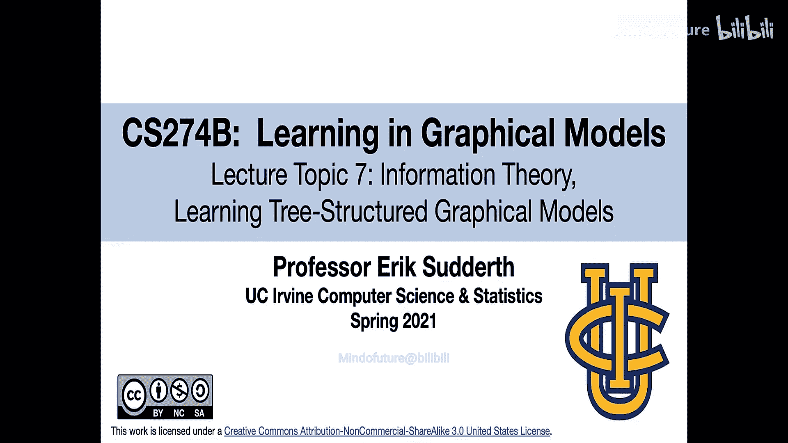

在本节课中，我们将首先介绍信息论的基础知识，这些知识在本课程后续的多个主题中都会出现。之后，我们将探讨如何利用信息论的思想，从数据中学习具有树状结构的图模型。

## 信息论基础

上一节我们概述了课程内容，本节中我们来看看信息论的起点——熵。熵是衡量随机变量随机性的度量，可以理解为不确定性的多少。

对于一个离散随机变量 **X**，其熵的定义如下：

**公式：H(X) = - Σ P(x) log₂ P(x)**

其中，P(x) 是随机变量的概率质量函数。熵的单位是比特。熵具有非负性，即 H(X) ≥ 0。随机变量的熵越大，其平均不确定性就越高，也就越难预测。

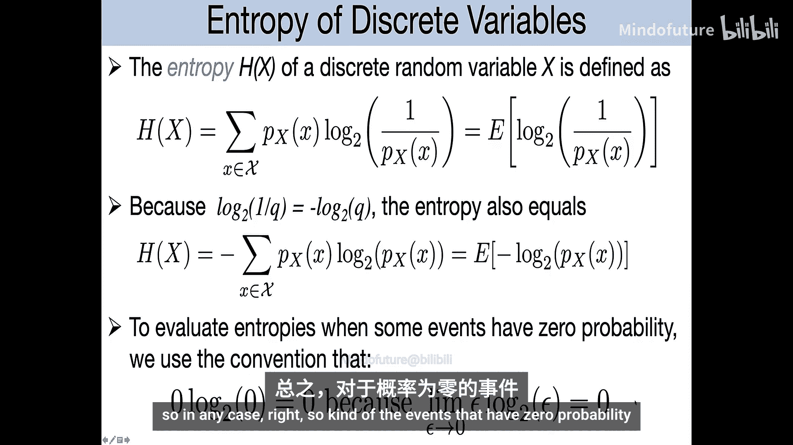

熵也可以等价地写为 **H(X) = E[-log P(x)]**，其中 E 表示期望值。在计算熵时，我们约定 **0 log 0 = 0**。

### 伯努利分布的熵

让我们看一个特例。对于一个参数为 p 的伯努利随机变量（例如抛硬币，正面概率为 p），其熵为：

**公式：H(p) = -p log₂ p - (1-p) log₂ (1-p)**

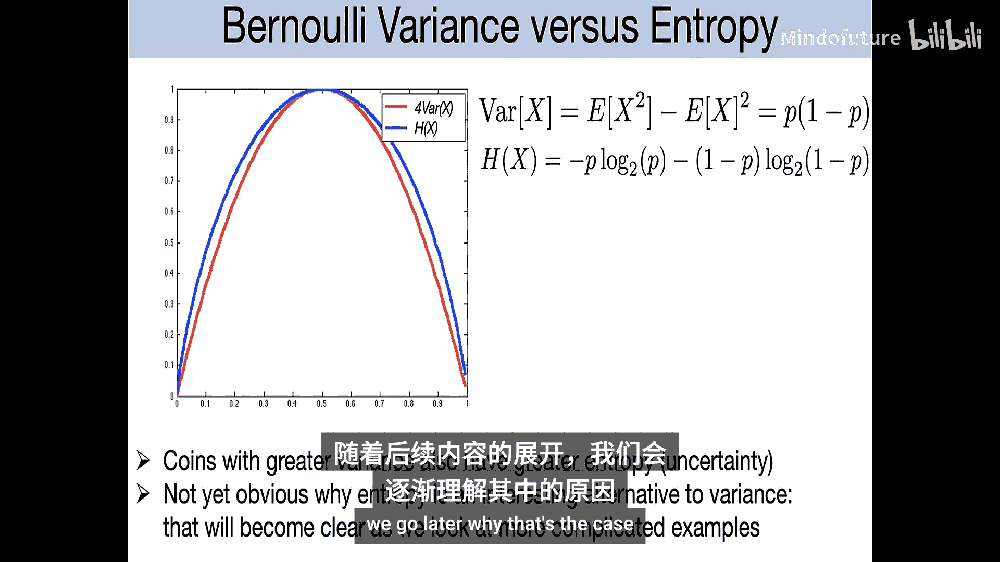

当 p = 0.5 时，熵达到最大值 1 比特，即公平硬币具有最大的随机性。当硬币有偏向性（p 接近 0 或 1）时，熵会减小。当结果完全确定（总是正面或总是反面）时，熵趋近于零。熵函数 H(p) 是关于 p 的凹函数。

### 均匀分布的熵

对于一个在 M 个值上均匀分布的随机变量，其熵为 **log₂ M**。这是具有 M 个结果的离散随机变量所能达到的最大熵。任何非均匀分布（某些结果更可能出现）都会导致熵减小。

### 联合熵与条件熵

我们常常需要讨论多个随机变量。对于两个随机变量 X 和 Y，其联合熵定义为：

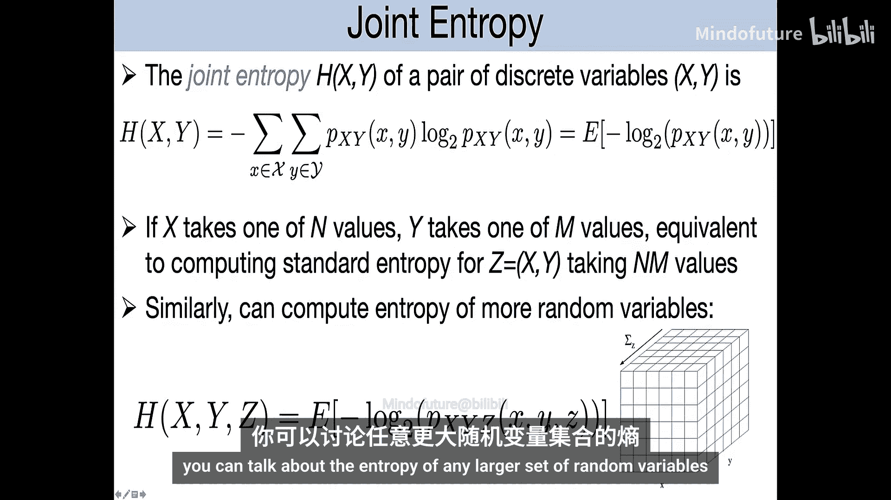

**公式：H(X, Y) = - Σ Σ P(x, y) log₂ P(x, y)**

这可以理解为将 (X, Y) 视为一个组合随机变量后的熵。

观察会影响熵。假设我们观察到 X 的取值，那么在给定 X 的条件下，Y 的条件熵定义为使用条件分布 P(Y|X) 计算的熵。通常，条件熵 H(Y|X) 与边际熵 H(Y) 不同，它可能更大或更小。

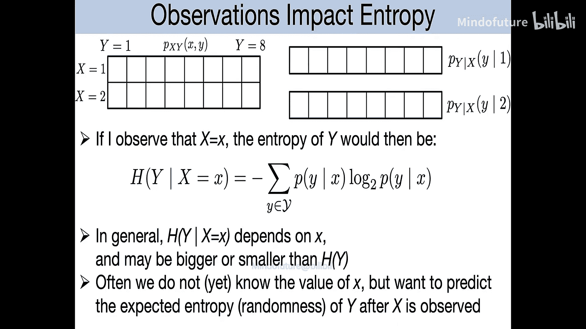

然而，我们常常在尚未观察到 X 时，就想知道在观察到 X 后，Y 的熵的期望减少量。这引出了条件熵的另一个定义：

**公式：H(Y|X) = Σ P(x) H(Y|X=x)**

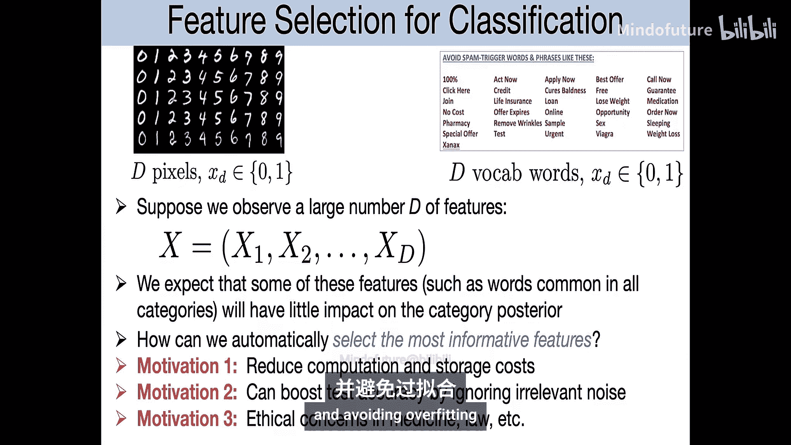

这表示在可能观察到的 X 值上，对条件熵进行加权平均。经过代数变换，这等价于 **H(Y|X) = E[-log P(Y|X)]**，期望是关于 X 和 Y 的联合分布取的。

条件熵的定义使得一个直观的链式法则成立：

**公式：H(X, Y) = H(X) + H(Y|X)**

这表明，两个变量的联合不确定性等于第一个变量的不确定性加上在已知第一个变量后第二个变量的剩余不确定性。由于 H(X) 和 H(Y|X) 都非负，因此增加随机变量只会增加（或保持不变）总的不确定性。

### 互信息

第三个重要概念是互信息，它衡量一个随机变量能提供关于另一个随机变量的信息量。互信息 I(X; Y) 定义为观察 X 后，Y 的熵的期望减少量：

**公式：I(X; Y) = H(Y) - H(Y|X)**

经过推导，互信息也可以表示为：

**公式：I(X; Y) = Σ Σ P(x, y) log₂ [P(x, y) / (P(x)P(y))]**

从这个形式可以看出，互信息关于 X 和 Y 是对称的，即 I(X; Y) = I(Y; X)。它衡量了两个变量之间的相互依赖程度。

互信息具有以下重要性质：
*   当且仅当 X 和 Y 相互独立时，I(X; Y) = 0。
*   只要 X 和 Y 不独立，I(X; Y) > 0。

因此，互信息是衡量两个变量是否独立的一个很好的定量指标。在统计学中，许多检验两个变量独立性的经典方法，本质上都是估计它们之间的互信息。

### 互信息在特征选择中的应用

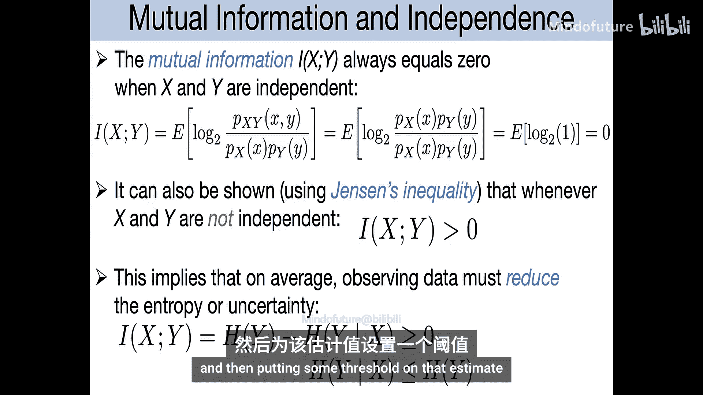

回到机器学习中的特征选择问题。一个经典有效的特征选择方法是计算每个特征 X_d 与类别标签 Y 之间的互信息 I(X_d; Y)。一个好的特征是那些能显著减少类别标签不确定性的特征，即互信息大的特征。

以下是选择高互信息特征的一个理论依据：假设我们使用特征 X_d 以最优方式（例如，根据后验概率预测）预测类别 Y，那么预测错误率的界限与条件熵 H(Y|X_d) 有关。如果给定某个特征后，类别标签的条件熵很小，那么基于该特征的分类器将会很准确。

### 熵与互信息的韦恩图表示

熵、条件熵和互信息之间的关系可以用韦恩图来形象地总结：
*   两个圆圈的面积分别代表 H(X) 和 H(Y)。
*   两个圆圈的并集面积代表联合熵 H(X, Y)。
*   两个圆圈的交集面积代表互信息 I(X; Y)。
*   条件熵 H(X|Y) 是圆圈 X 中不属于交集的部分，H(Y|X) 是圆圈 Y 中不属于交集的部分。

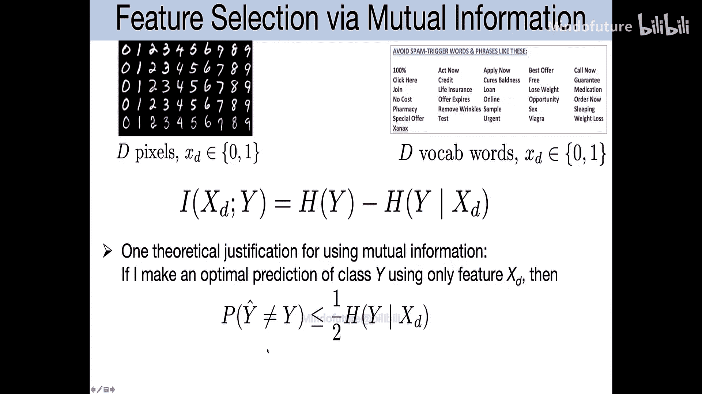

## 从信息论到图模型学习

现在我们将转向图模型的学习，特别是学习图的结构。我们会发现，当开始思考如何学习图模型结构时，互信息等概念会自然地出现在目标函数中。

我们将使用略微不同的记号。现在，我们将熵写为 H(P)，其中 P 是概率分布的参数。此外，我们引入另一个重要概念：相对熵，也称为 KL 散度。

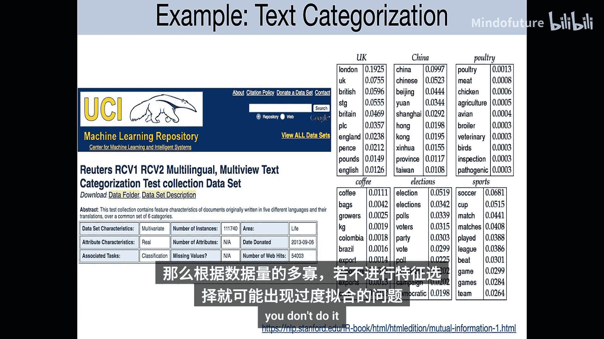

KL 散度衡量两个概率分布 P 和 Q（定义在相同样本空间上）之间的“距离”：

**公式：D_KL(P || Q) = Σ P(x) log₂ [P(x) / Q(x)]**

KL 散度总是非负的，并且当且仅当 P = Q 时为零。但它不是真正的距离，因为它不对称。

有趣的是，互信息可以表示为联合分布 P(X,Y) 与其边际分布乘积 P(X)P(Y) 之间的 KL 散度：

**公式：I(X; Y) = D_KL( P(X,Y) || P(X)P(Y) )**

这与之前基于条件熵的定义是等价的。

## 树结构图模型的学习

上一节我们介绍了信息论的核心概念，本节中我们来看看如何利用这些概念学习树结构的图模型。我们将采用一种与之前 L1 正则化不同的方法：我们约束模型结构必须是一棵树，然后从所有可能的树中找到最优的那一棵。

首先，我们需要了解树结构模型的概率分解方式。

### 树结构模型的分解

对于任何树结构模型，我们总可以通过选择一个节点作为根，将其写成有向分解的形式：

**公式：P(x) = P(x_root) Π_{t≠root} P(x_t | parent(x_t))**

由于树没有环，这总是可行的。通过代数变换，我们可以得到一个与方向无关的规范分解形式：

**公式：P(x) = [Π_s Q_s(x_s)] * [Π_{(s,t)∈E} (Q_{st}(x_s, x_t) / (Q_s(x_s)Q_t(x_t)) )]**

这里，Q_s 是节点 s 的边际分布，Q_{st} 是边 (s, t) 上两个节点的联合边际分布。这个分解可以看作是一种无向的、规范化的参数化方式，其整体归一化常数为 1。

如果我们选择的 Q_s 和 Q_{st} 是自洽的（即 Q_{st} 对其中一个变量求和能得到对应的 Q_s），那么它们就是某个分布 P 的真实边际分布。

### 树结构模型的参数估计

这个规范分解将帮助我们思考如何从数据中估计树结构模型的参数。

假设我们有一个固定的树结构 T，并且有 L 个观测数据。我们定义经验分布：
*   \hat{P}_s(a) = (1/L) Σ_{l=1}^L δ(x_s^{(l)} = a)，即变量 X_s 取值为 a 的经验频率。
*   \hat{P}_{st}(a, b) = (1/L) Σ_{l=1}^L δ(x_s^{(l)} = a, x_t^{(l)} = b)，即变量对 (X_s, X_t) 取值为 (a, b) 的经验频率。

我们的目标是进行最大似然估计。目标函数是数据的平均对数似然。我们可以将树模型的分布视为一个指数族分布，其特征函数包括每个节点的指示函数和每条边上变量对的联合指示函数。

根据指数族分布的性质，最大似然估计会匹配这些特征的经验期望。因此，最优参数可以直接设定为：

**公式：Q_s^* = \hat{P}_s,  Q_{st}^* = \hat{P}_{st}**

也就是说，对于给定的树，最大似然估计就是让每个节点的边际分布和每条边的联合边际分布完全匹配数据的经验分布。

### 最优似然值与互信息

现在，让我们计算在这个最优参数下的对数似然值。将 Q_s^* 和 Q_{st}^* 代入对数似然公式并整理项，我们得到：

**最大对数似然值 = - Σ_s H(\hat{P}_s) + Σ_{(s,t)∈E} I(\hat{P}_{st})**

其中，H(\hat{P}_s) 是基于经验分布计算的变量 X_s 的熵，I(\hat{P}_{st}) 是基于经验分布计算的变量 X_s 和 X_t 之间的互信息。

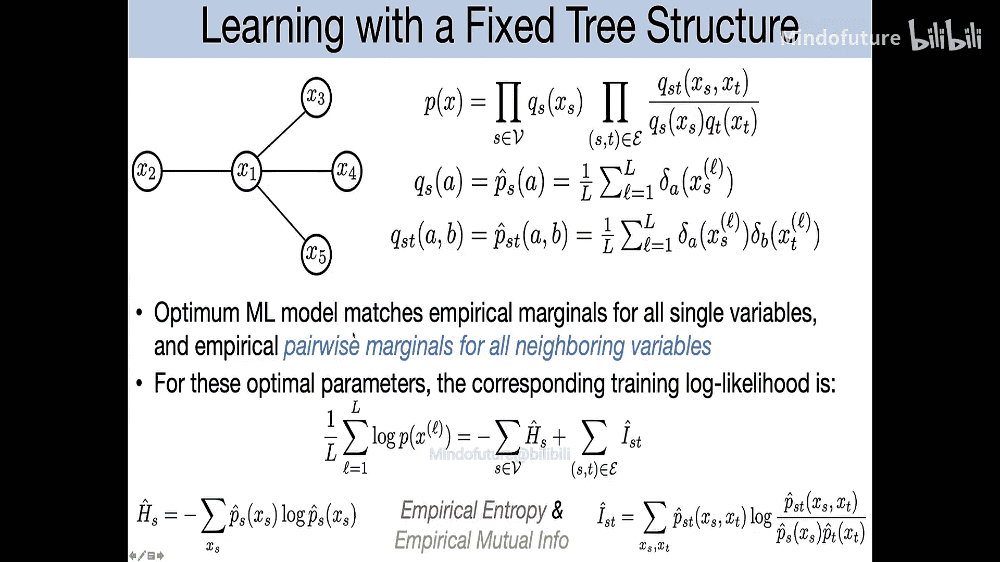

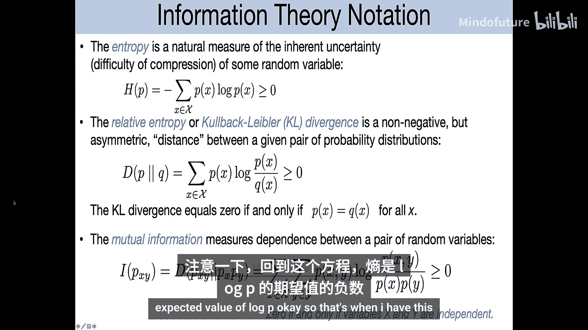

这个结果非常直观：
*   **- Σ_s H(\hat{P}_s)**：所有节点的熵之和的负值。节点的熵越大（数据越随机、越不确定），这部分对似然的贡献就越小（使似然值降低）。
*   **Σ_{(s,t)∈E} I(\hat{P}_{st})**：树中所有边的互信息之和。变量之间的依赖关系（互信息）越强，这部分对似然的贡献就越大（使似然值升高）。

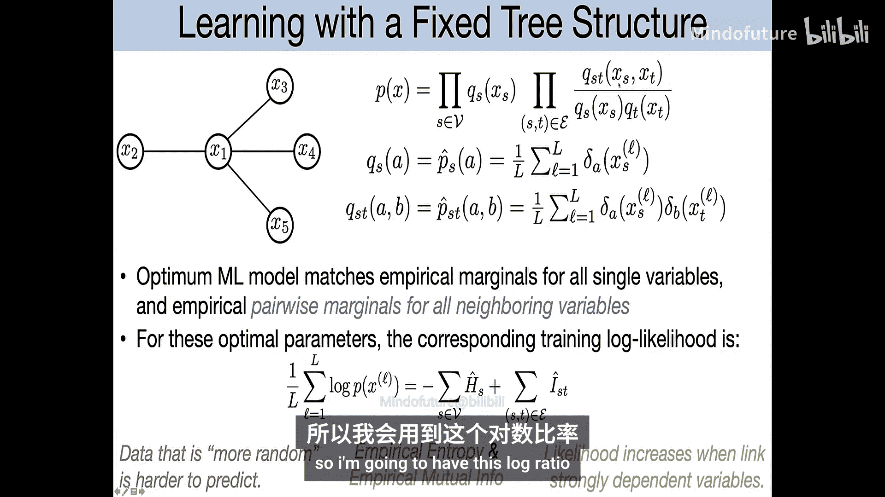

### 最优树结构选择

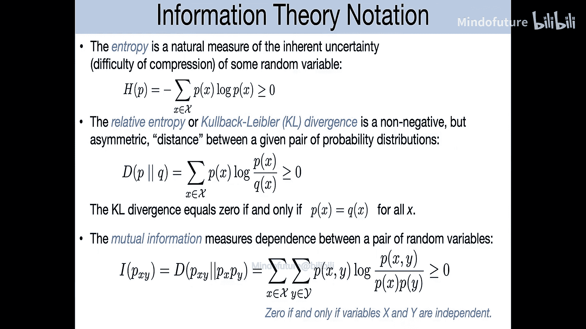

对于任何一棵树，在拟合其最优参数后，我们都能得到上述形式的对数似然值。现在，假设我们固定变量集，想要在所有可能的树结构中优化选择。

注意，公式中的第一项 **- Σ_s H(\hat{P}_s)** 对于所有树都是相同的，因为它只依赖于单个变量的经验分布，与树结构无关。因此，最大化对数似然等价于最大化第二项：

**最大化：Σ_{(s,t)∈E} I(\hat{P}_{st})**

也就是说，我们需要找到一个树结构（包含 n-1 条边），使得它所包含的边的经验互信息之和最大。

这转化为了一个经典的图算法问题：**最大权重生成树**。我们有一个包含 n 个节点的完全图，每条边 (s, t) 的权重就是经验互信息 I(\hat{P}_{st})。我们需要找到一个无环的连通子图（即一棵树），使得其边的权重之和最大。

尽管可能的树的数量极其庞大，但这是一个可以高效求解的问题。可以使用贪心算法（如 Kruskal 算法）来找到最优解：

**算法步骤：**
1.  将所有边按互信息值从大到小排序。
2.  初始化一个空的边集 T（最终存储生成树的边）。
3.  按顺序检查每条边：
    *   如果将该边加入 T 不会形成环，则将其加入 T。
    *   否则，跳过该边。
4.  当 T 中包含 n-1 条边时，算法停止。此时 T 即为最大权重生成树。

这个算法的复杂度与边数大致呈线性关系，因此对于中等规模的问题非常高效。通过这种方法，我们可以快速地为数据集找到最优的树结构图模型。

## 总结

本节课中我们一起学习了信息论的基础知识及其在图模型学习中的应用。

我们首先介绍了熵、联合熵、条件熵和互信息的概念，理解了它们如何量化随机性和变量间的依赖性。我们看到互信息如何自然地应用于特征选择等机器学习任务。

接着，我们将焦点转向树结构图模型的学习。我们推导了树模型的规范分解形式，并展示了在给定树结构下，最大似然估计具有简单的闭式解。更重要的是，我们发现最大化树模型的对数似然，等价于在变量间寻找一个最大权重生成树，其中边的权重就是变量对的经验互信息。这提供了一个高效且优雅的算法来从数据中学习最优的树结构图模型。

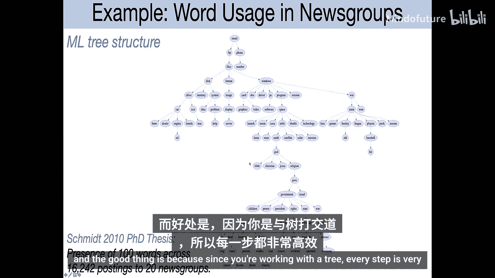

这种方法与之前讨论的带 L1 正则化的方法形成了对比：它通过硬约束（必须是树）来获得稀疏性和可解释性，并利用互信息这一信息论概念直接指导结构学习。