# 010：期望最大化算法

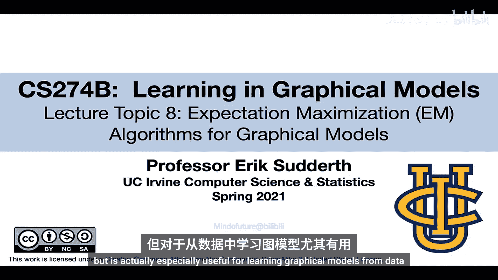

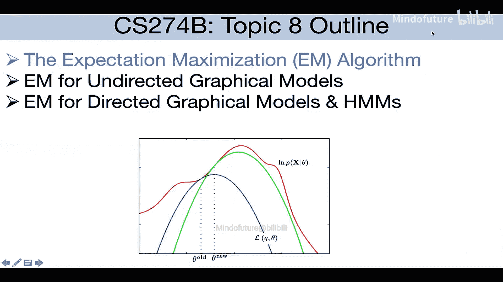

在本节课中，我们将要学习期望最大化算法。这是一种在统计学和机器学习中广泛使用的通用方法，尤其适用于从观测数据不完整的场景中学习图形模型。

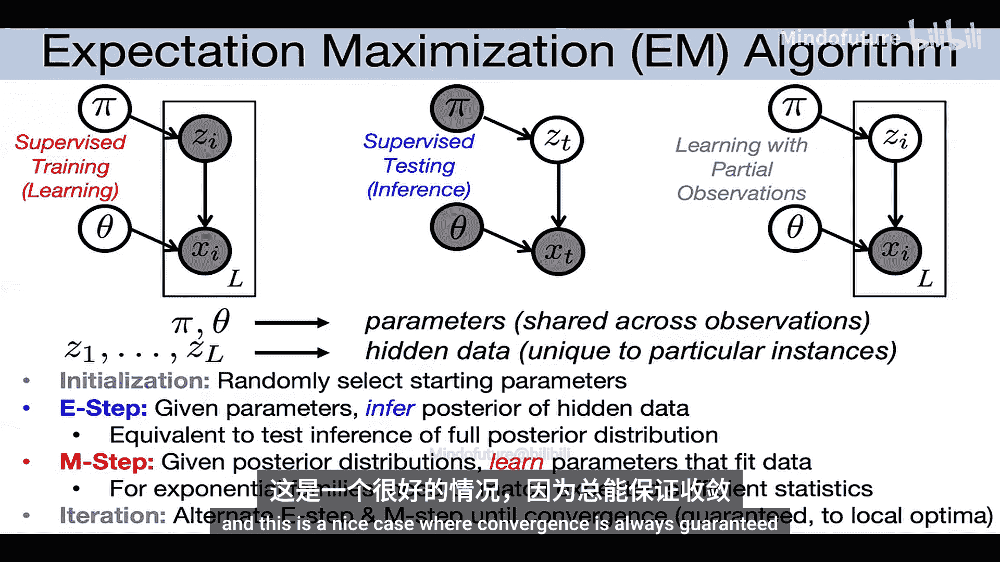

## 算法概述

期望最大化算法用于处理模型参数未知，且训练数据中部分变量缺失的情况。算法通过迭代两个步骤来估计参数：E步（期望步）和M步（最大化步）。

## 预备知识：凸函数与期望

在深入EM算法之前，我们需要了解凸函数与期望运算的一个重要性质。

对于任意凸函数 `f` 和随机变量 `X`，以下不等式成立：
`f(E[X]) ≤ E[f(X)]`
其中 `E[·]` 表示期望值。这意味着函数在期望值处的值，小于或等于函数值的期望。

相反，对于凹函数（如对数函数），不等式方向相反：
`log(E[X]) ≥ E[log(X)]`
这个性质，即詹森不等式，是推导EM算法的关键。

## EM算法推导

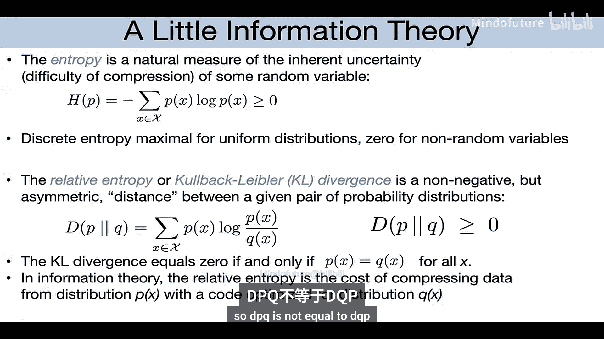

我们的目标是最大化观测数据 `X` 在给定参数 `θ` 下的对数似然 `log P(X|θ)`。问题在于，模型包含未观测到的隐变量 `Z`。

观测数据的似然可以写为对隐变量的边际化：
`P(X|θ) = Σ_Z P(X, Z|θ)`

为了处理这个难以直接优化的求和，我们引入一个辅助分布 `Q(Z)`，并利用詹森不等式构建一个下界：
`log P(X|θ) = log Σ_Z Q(Z) [P(X, Z|θ) / Q(Z)] ≥ Σ_Z Q(Z) log [P(X, Z|θ) / Q(Z)]`

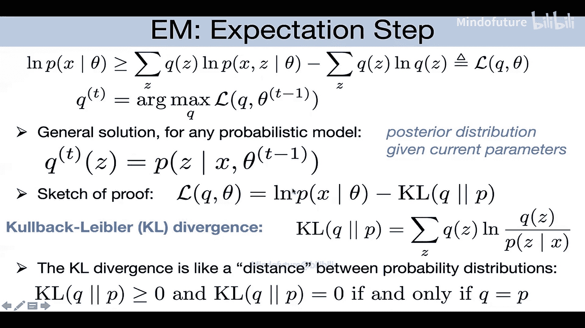

我们将这个下界定义为 `L(θ, Q)`：
`L(θ, Q) = Σ_Z Q(Z) log P(X, Z|θ) - Σ_Z Q(Z) log Q(Z)`
其中，第一项是期望对数似然，第二项是分布 `Q` 的熵 `H(Q)`。

## EM算法步骤

EM算法本质上是关于下界 `L(θ, Q)` 的坐标上升法。

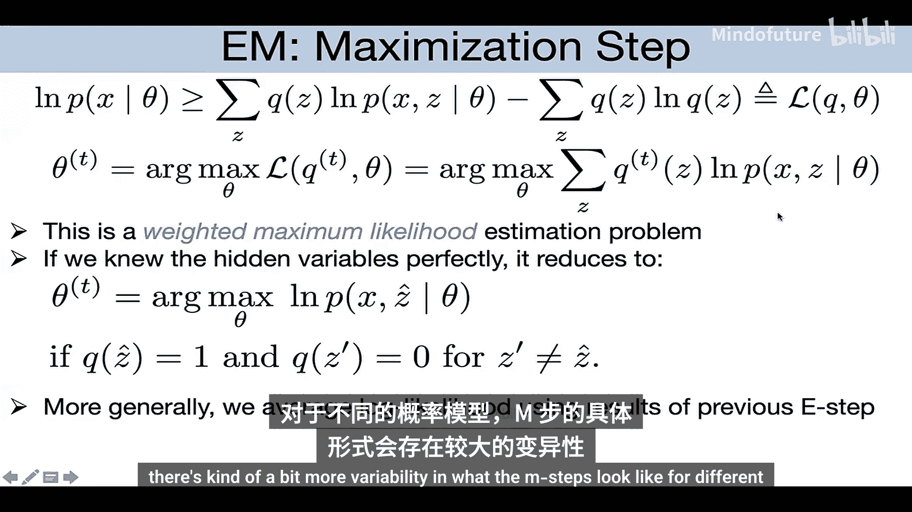

以下是算法的具体步骤：

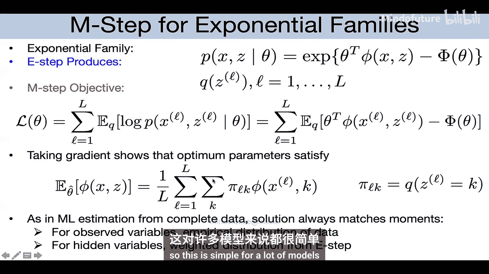

1.  **初始化参数**：随机初始化参数 `θ^(0)`。
2.  **E步（期望步）**：固定参数 `θ`，寻找使下界 `L` 最大的分布 `Q`。可以证明，最优解就是给定当前参数和观测数据时，隐变量的后验分布：
    `Q(Z) = P(Z|X, θ)`
    因此，E步需要计算后验概率 `P(Z|X, θ)`。
3.  **M步（最大化步）**：固定分布 `Q`，寻找使下界 `L` 最大的参数 `θ`。由于熵项 `H(Q)` 与 `θ` 无关，这等价于最大化期望对数似然：
    `θ_new = argmax_θ Σ_Z Q(Z) log P(X, Z|θ)`
4.  **迭代**：交替执行E步和M步，直到参数收敛。

每次迭代都会提升下界 `L`，从而也提升真实对数似然 `log P(X|θ)`，保证算法收敛。

## 应用于指数族分布

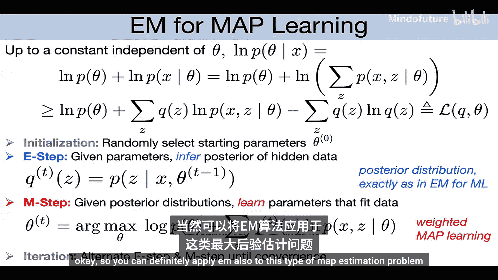

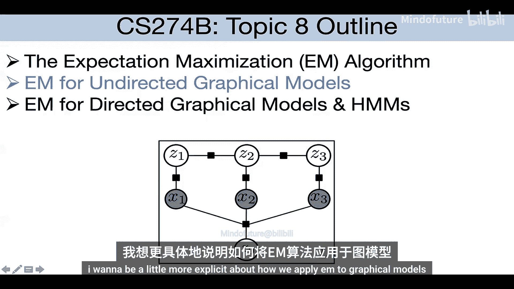

当联合分布 `P(X, Z|θ)` 属于指数族时，M步有简洁的形式。

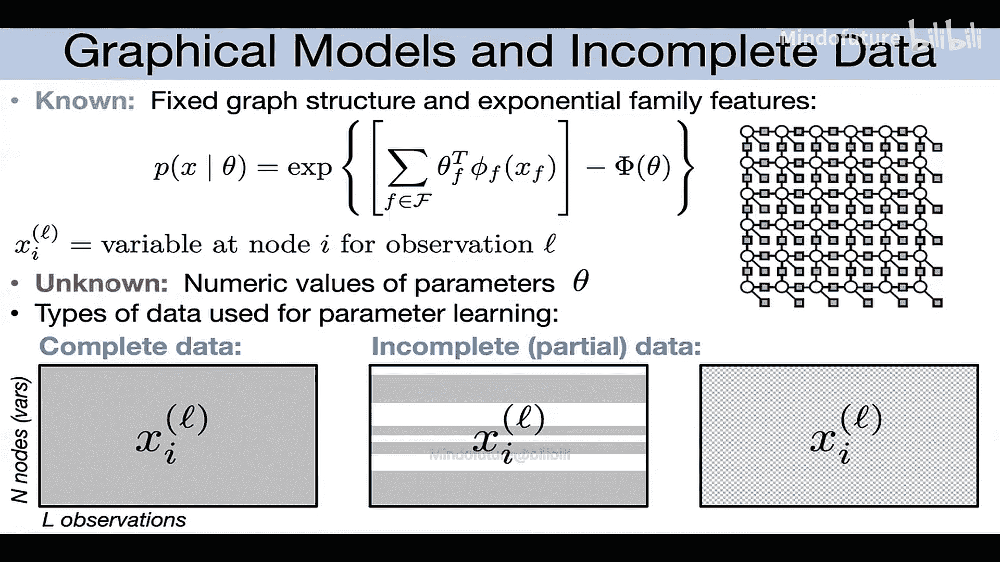

指数族分布的形式为：
`P(X, Z|θ) = exp(θ^T φ(X, Z) - A(θ))`
其中 `φ(X, Z)` 是充分统计量，`A(θ)` 是对数配分函数。

在这种情况下，M步的最大化问题导出的解，是令模型参数的期望充分统计量与基于后验 `Q` 计算的经验期望充分统计量相匹配：
`E_P[φ(X, Z)] = (1/L) Σ_{l=1}^L Σ_Z Q(Z|X_l) φ(X_l, Z)`
这通常可以通过简单的计算完成。

## 应用于图形模型

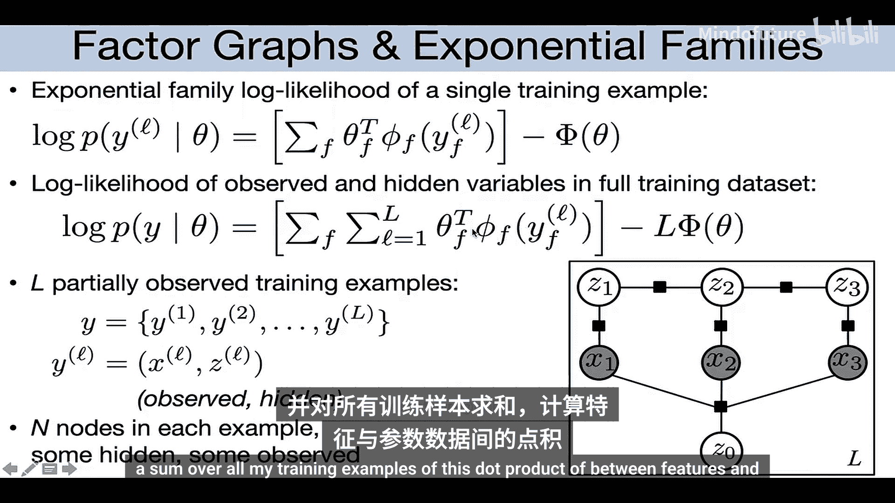

将EM算法应用于具有固定结构的图形模型时，流程非常清晰。

*   **模型设定**：假设我们有一个因子图，每个因子关联一个指数族分布和参数 `θ`。我们有 `L` 个训练样本，每个样本中部分变量 `X` 被观测到，部分变量 `Z` 缺失。
*   **E步**：对于每个训练样本，在给定观测 `X` 和当前参数 `θ` 的条件下，计算所有隐变量 `Z` 的后验分布 `P(Z|X, θ)`。这需要运行推断算法（如信念传播、联结树算法）来获得图中各因子的边际概率。
*   **M步**：利用E步计算得到的后验边际，计算每个因子的期望充分统计量（在所有训练样本上平均）。然后更新参数 `θ`，使模型的期望充分统计量与这些计算值相匹配。

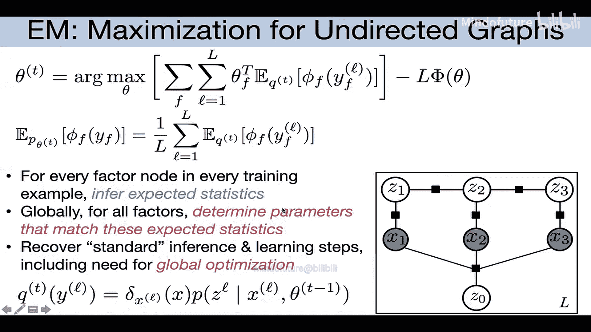

## 应用于隐马尔可夫模型示例

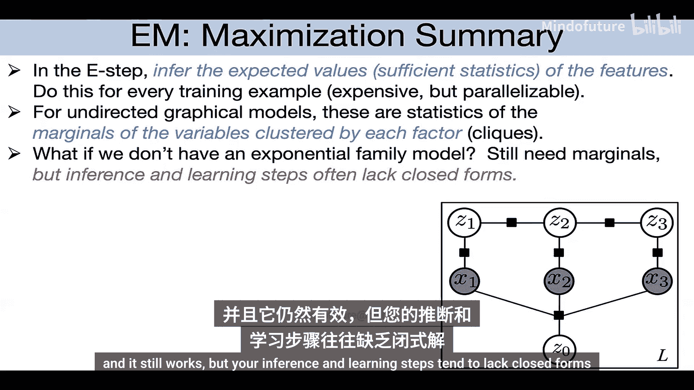

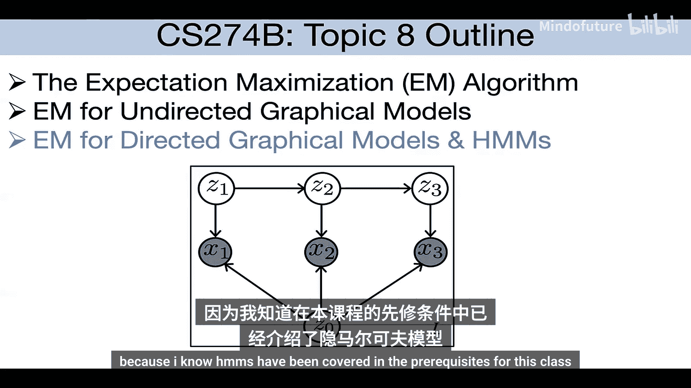

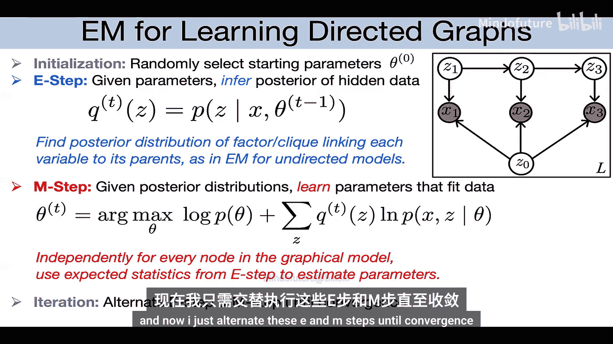

隐马尔可夫模型是EM算法的一个经典应用场景。

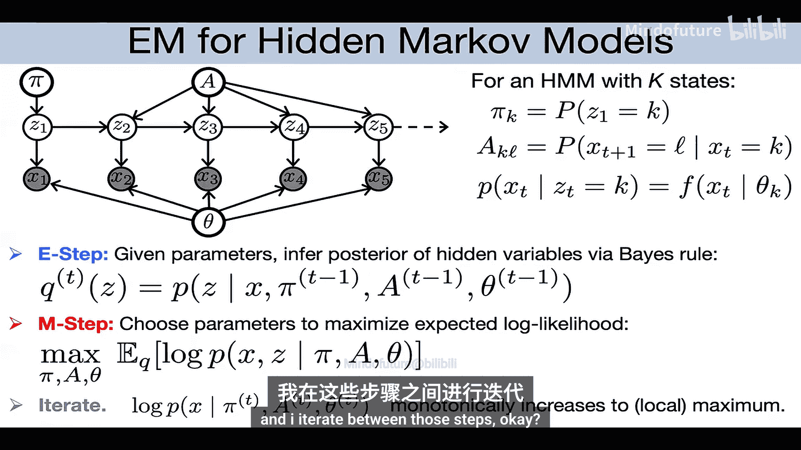

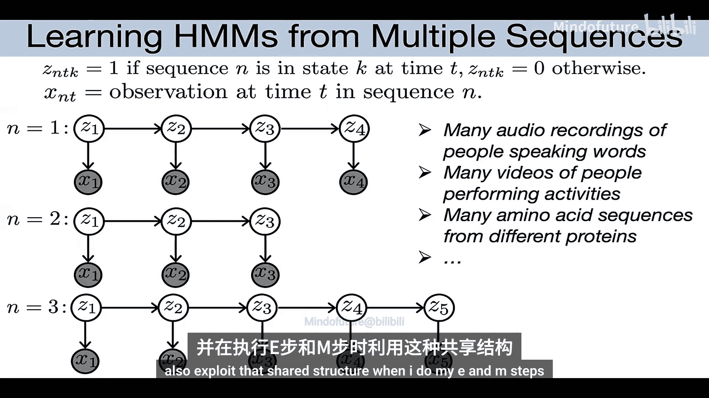

*   **模型参数**：包括初始状态概率 `π`、状态转移概率 `A` 和观测发射概率 `B`。
*   **E步**：在给定观测序列和当前参数下，计算隐状态的后验分布。这需要运行前向-后向算法来获得：
    *   单个时间点状态的边际概率 `P(Z_t|X, θ)`。
    *   相邻时间点状态对的边际概率 `P(Z_t, Z_{t+1}|X, θ)`。
*   **M步**：利用E步得到的边际概率进行参数更新：
    *   `π_k ∝ Σ_{序列} P(Z_1=k | 该序列观测)`。
    *   `A_{k,l} ∝ Σ_{序列} Σ_t P(Z_t=k, Z_{t+1}=l | 该序列观测)`。
    *   `B_{k,o} ∝ Σ_{序列} Σ_{t:观测为o} P(Z_t=k | 该序列观测)`。

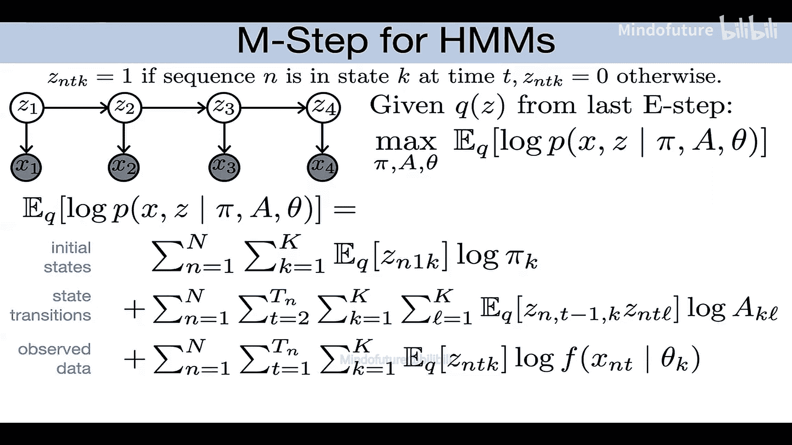

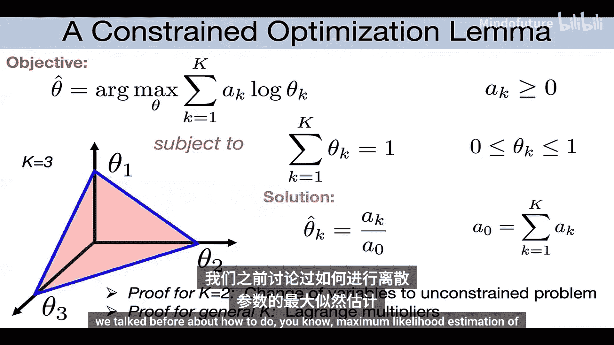

## 扩展到MAP估计

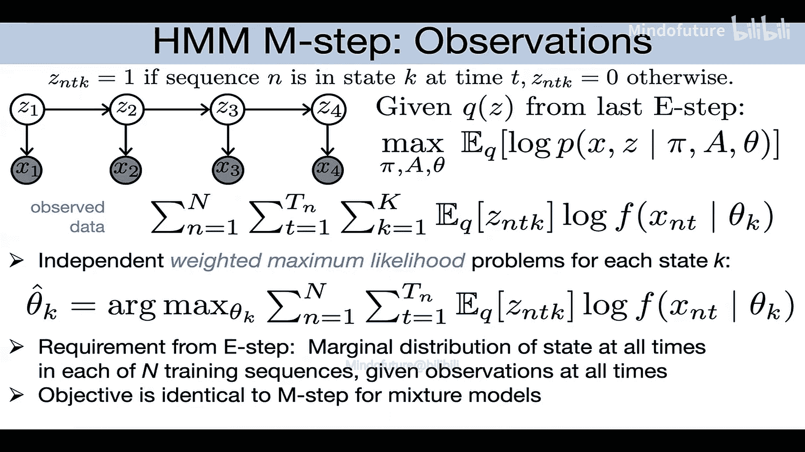

EM算法不仅可以用于最大似然估计，也可用于最大后验概率估计。

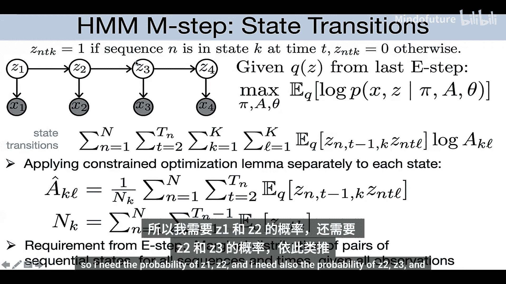

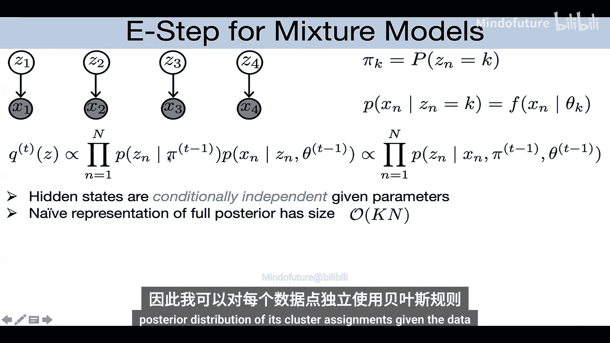

若对参数有先验分布 `P(θ)`，则目标变为最大化对数后验：
`log P(θ|X) ∝ log P(X|θ) + log P(θ)`
我们可以对似然项 `log P(X|θ)` 同样使用之前的E步下界。在M步中，则最大化 **期望对数似然** 加上 **对数先验**：
`θ_new = argmax_θ [ Σ_Z Q(Z) log P(X, Z|θ) + log P(θ) ]`
这允许我们在学习过程中引入如L1、L2等正则化项。

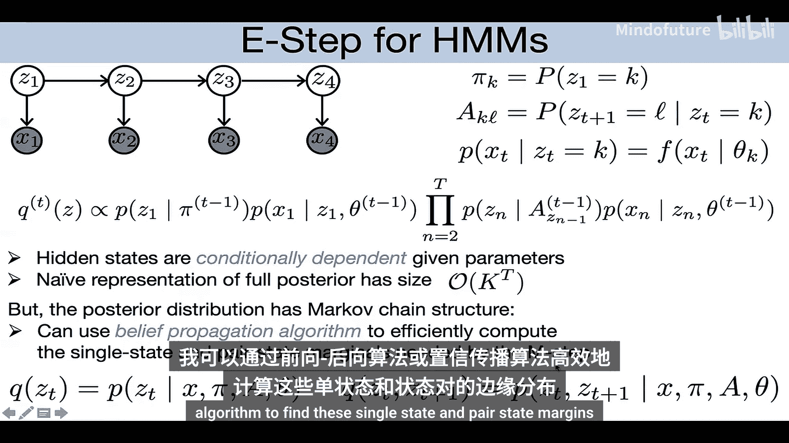

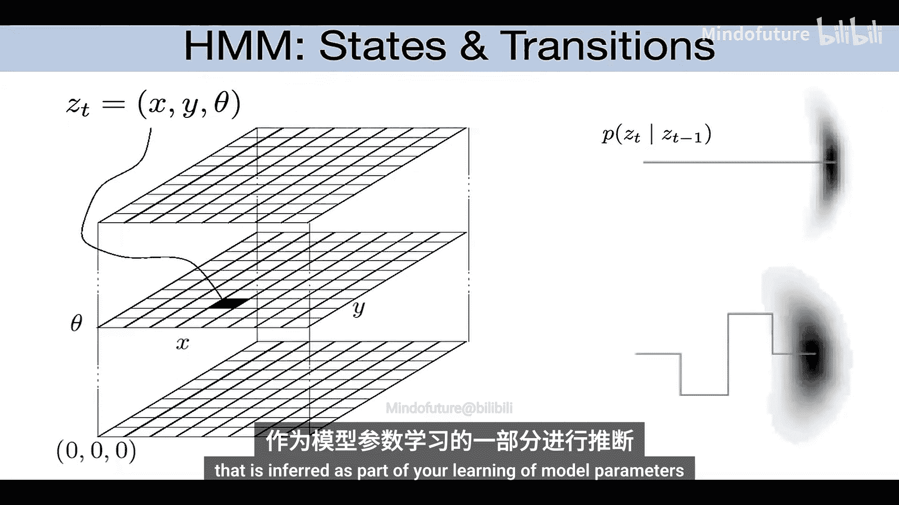

## 总结

本节课中我们一起学习了期望最大化算法。EM算法为解决数据存在缺失变量时的参数学习问题提供了一个强大的框架。其核心思想是通过引入隐变量的分布 `Q`，构建对数似然的一个易于处理的下界，并通过交替执行E步（推断后验）和M步（更新参数）来优化这个下界，从而间接优化真实似然。我们看到了该算法在指数族分布和图形模型中的具体应用形式，并通过隐马尔可夫模型的例子进行了详细说明。EM算法是学习复杂概率模型，特别是包含隐变量模型的基石。