# 011：蒙特卡洛方法入门 🎲

在本节课中，我们将要学习蒙特卡洛方法的基本原理。这是一种通过随机采样来近似计算复杂积分或期望值的强大技术，尤其适用于难以精确求解的图形模型推断问题。

## 概述

上一节我们介绍了各种用于推断隐变量和学习模型参数的确定性算法。本节中，我们将转向近似方法的两大家族之一：采样或模拟方法。当模型无法精确求解时，我们通过模拟未知参数或变量可能的值来进行近似，这就是所谓的蒙特卡洛方法。

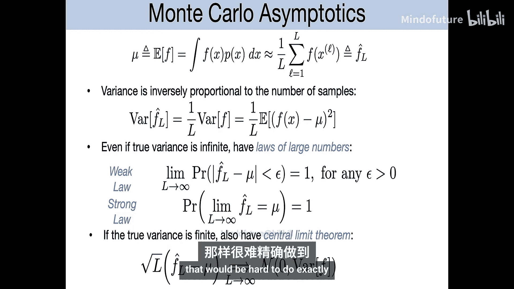

## 蒙特卡洛方法的基本原理

蒙特卡洛方法之所以有效，其背后的高层次思想非常简单，它本质上源于**大数定律**。

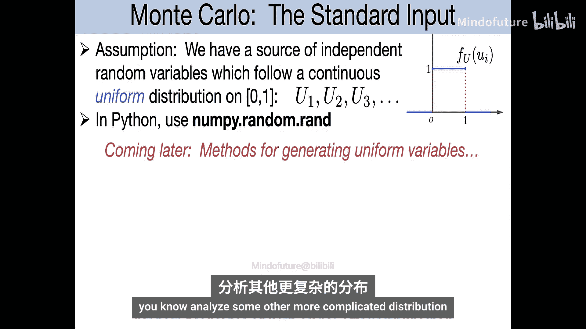

首先，假设我从某个分布 `P(x)` 中获得了 `L` 个样本。我们使用上标 `(l)` 来表示不同的样本。在符号上，我们使用带下标 `l` 的 `δ` 函数来表示一个在该样本点处无限高、无限窄的分布。

蒙特卡洛方法指出，如果我想知道函数 `F(x)` 的期望值，即积分 `∫ F(x) P(x) dx`，而这个积分可能因为 `F` 复杂、`P` 复杂或 `x` 是高维变量而难以计算，那么我总是可以通过从分布 `P` 中抽取 `L` 个样本来近似它。

具体做法是：从 `P` 中抽取样本，在每个样本处评估你的函数 `F`，然后简单地取这些数值的平均值。

这个估计器有一个很好的性质：无论 `L` 多大，它总是**无偏的**。这意味着估计器的期望值等于真实的积分值。当然，由于我们使用样本，这是一个随机变量，所以会围绕真实值有一些波动。

分析其方差也很容易。基本上，估计器的方差等于原始函数 `F` 的方差乘以 `1/L`。因此，随着我获得更多样本，方差会不断减小。

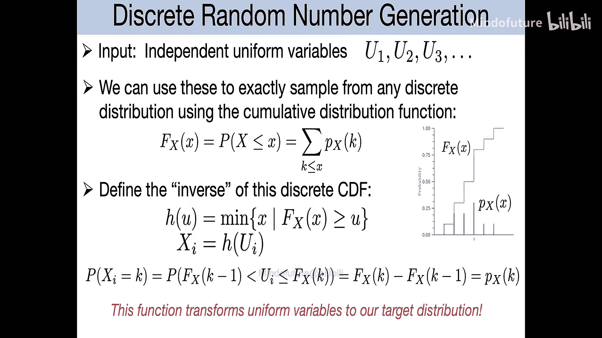

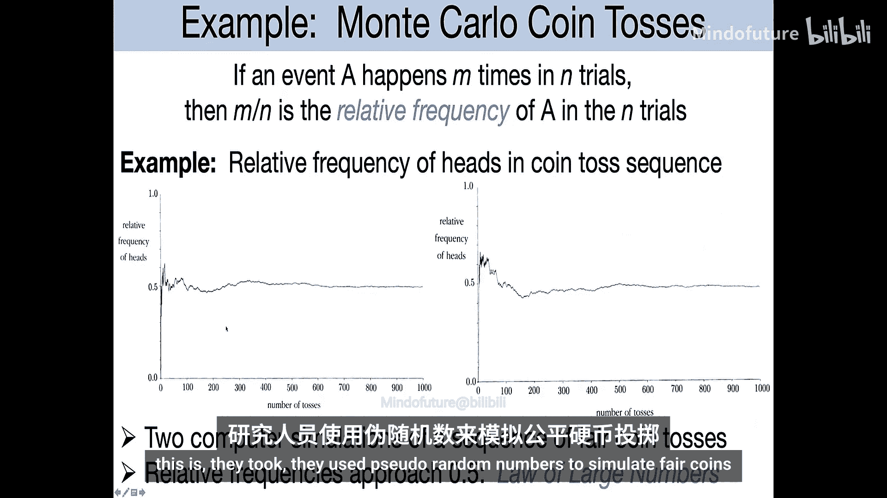

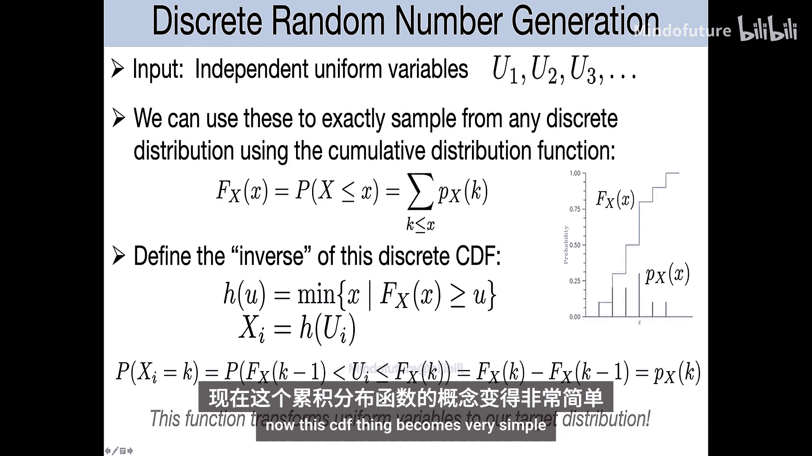

相应地，我们有各种形式的大数定律。随着样本数量 `L` 的增长，我的估计器与真实积分值以概率 `1` 相等。此外，根据中心极限定理（假设真实方差有限），估计误差的分布将趋近于高斯分布。

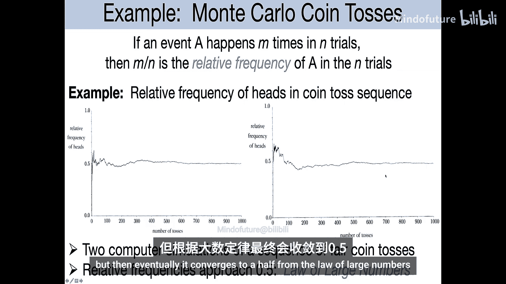

虽然经典上我们常将这种方法用于分析数据集及其计算属性，但我们也可以在计算机中使用模拟来进行难以精确执行的计算。

## 伪随机数生成器

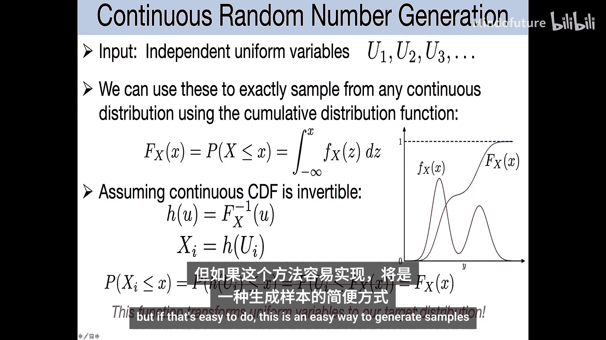

在计算机蒙特卡洛方法中，惯例是假设我们有一个独立的连续均匀分布随机变量源。其概率密度函数在 `0` 到 `1` 之间是均匀的。我们称这些变量为 `u1, u2, u3...`。

蒙特卡洛方法通常假设你能获得这些均匀随机数，然后将它们转换为你真正关心的任何分布的样本。

稍后我会谈谈这些均匀随机数从何而来。基本上，任何进行科学计算、机器学习或统计的软件包都有生成此类数字的功能。它们并非真正的随机数，因为计算机的操作是确定性的，但它们产生的数字流表现得就像来自这个均匀分布的样本，这些被称为**伪随机数**。

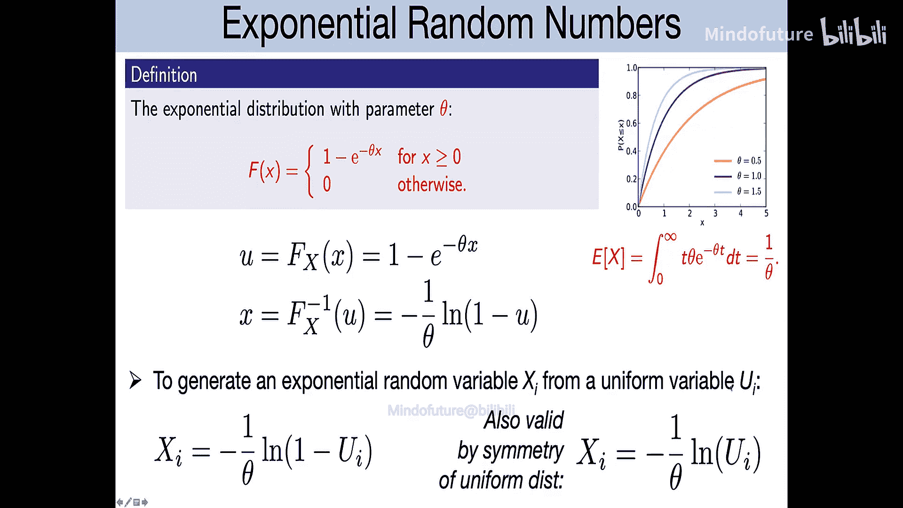

例如，在 Python 的 NumPy 中，就有一个很好的伪随机数生成器。现在，我们假设你有一个黑盒，可以给你来自这个均匀分布的样本，然后你想用它们来分析其他更复杂的分布。

## 从离散分布中采样

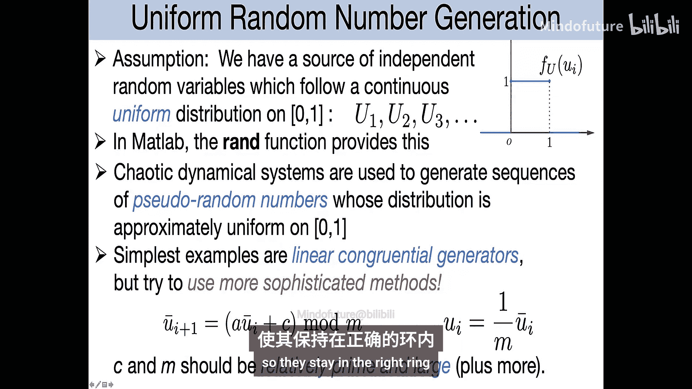

首先，假设我有一个离散分布需要采样。例如，我有一个在六个点上具有正概率的概率质量函数 `P(x)`。

除了概率质量函数，分布的另一种表示是**累积分布函数**。根据定义，CDF 是 `x` 小于等于某个值的概率。对于离散分布，CDF 呈阶梯状，在每个具有正概率的值处跳跃。这个函数从 `0` 开始，最终增加到 `1`。

现在，这个函数不是可逆的，因为它在某些区间是常数，在某些点跳跃。但存在一种类似逆函数的东西，我们称之为逆 CDF 函数 `H(u)`。它将 `0` 到 `1` 之间的数字映射回 `x` 的值。具体做法是：对于给定的 `u`，找到使得 CDF 首次大于或等于 `u` 的最小 `x` 值。

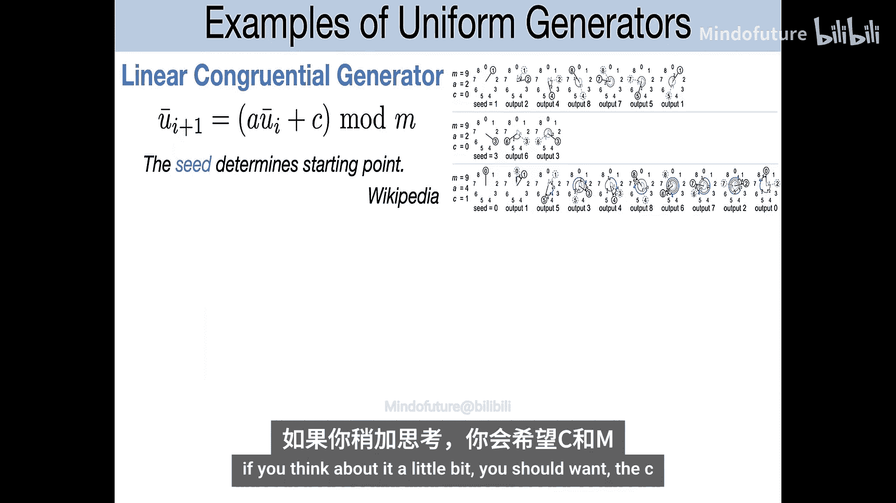

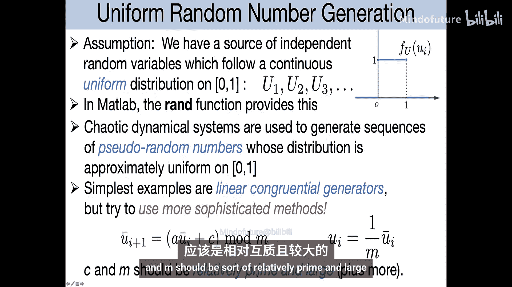

有趣的是，如果我采样一个在 `0` 到 `1` 之间均匀分布的数字 `U`，并通过这个函数 `H` 进行转换，那么生成的随机变量 `X = H(U)` 的分布恰好就是原来的 `P(x)`。

你可以这样验证：`X` 等于某个值 `k` 的概率，就是 `U` 落在 `F(k-1)` 和 `F(k)` 之间的概率，而这正好等于原始概率质量函数在 `k` 处的值。

因此，你可以立即将均匀分布的样本转换为任何你想要的离散分布的样本。直观地看，对于概率大的 `x` 值，CDF 的阶梯跳跃幅度大，因此你的均匀随机数落入该区间的概率也高；反之亦然。

## 从连续分布中采样

现在，如果我想从一个连续分布中采样呢？

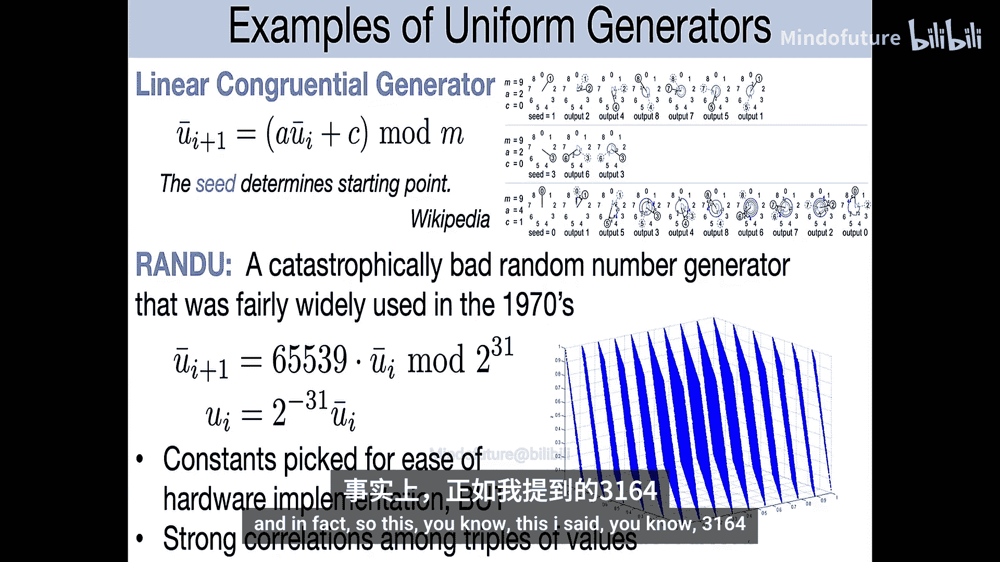

如果我有一个连续分布，你仍然可以定义 CDF，并且它是一个单调递增的函数。如果我的分布是连续的，那么 CDF 将是可逆的。让我定义 `H` 为这个 CDF 的逆函数，它将 `0` 到 `1` 之间的数字映射回我分布的支撑集。

假设我取一个均匀数 `U` 并通过这个逆 CDF。鉴于我刚才展示的内容，你可能不会惊讶地发现，这实际上会给我一个来自我想要的连续分布的样本。

证明如下：我以这种方式生成的 `X` 小于某个值 `x` 的概率，就是 `H(U)` 小于 `x` 的概率。由于 `H` 是可逆的，这等价于 `U` 小于 `H^{-1}(x)` 的概率，而 `H^{-1}` 就是 CDF。一个在 `0` 到 `1` 之间均匀分布的数小于某个值 `c` 的概率就是 `c` 本身。因此，我们得到了正确的概率。

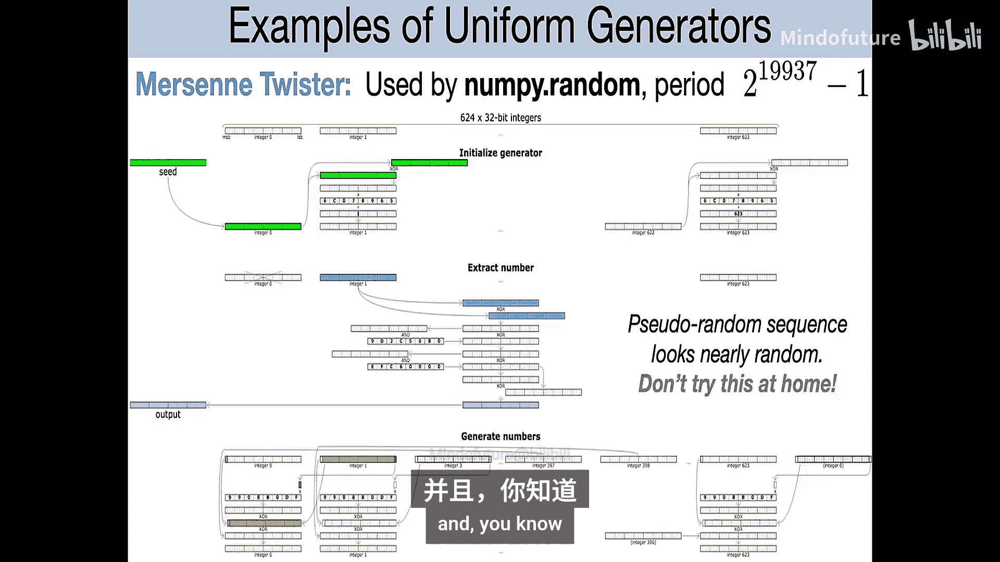

这是一种将均匀变量转换为你想要的任何连续分布的简单方法，前提是你能轻松计算这个逆 CDF。有些分布的逆 CDF 可能很复杂，难以处理，但如果容易计算，这就是一种简单的采样方法。

## 伪随机数生成器的实现

我们假设有一个独立的连续均匀随机变量源，但这是一个提到 MATLAB 的旧幻灯片，不过 Python 也有类似功能。

生成这些数字的方法是使用一个混沌的动力系统。随机数生成器有一个内部状态，每次生成一个数字时，你都会改变那个状态。所谓“混沌”，是指改变状态的函数不是一个“好”函数，而是一个输入微小变化会导致输出巨大变化的非常不稳定的函数。

你可以想象，如果我有确定性的但高度混沌和不稳定的东西，那么对我来说，它可能看起来几乎是随机的。这就是这些随机数生成器的工作原理。

最简单的随机数生成器实际上只使用线性函数。这些不是最好的生成器，但它们可以是有效的。其思想是：`U_bar` 是一个大整数（如 32 位或 64 位整数），`M` 是这个整数能取的最大值（如 2^64）。我通过将整数除以 `M` 来获得 `0` 到 `1` 之间的数字，而整数本身通过取模 `M` 的线性函数来演化。

让我用图片给你举个例子。你有一个种子，即你的起始整数。假设 `M=9`，我的生成器状态是 `0` 到 `8` 之间的整数。假设我设 `a=2`, `c=0`。生成器的工作方式是：你乘以 `2`，如果结果超过 `9`，就取除以 `9` 的余数。从 `1` 开始，跳到 `2`，到 `4`，到 `8`。`2*8=16`，模 `9` 余 `7`，所以到 `7`。`2*7=14`，模 `9` 余 `5`。`2*5=10`，模 `9` 余 `1`。我又回到了起点。我遍历了六个整数的循环，并没有得到所有九个整数。如果我以 `3` 开始，则跳到 `6`，`2*6=12` 模 `9` 余 `3`，我就在 `3` 和 `6` 之间振荡。所以这不是一个好的生成器。

另一方面，如果我设 `a=4`, `c=1`，那么你会遍历 `0` 到 `8` 之间所有可能的整数，并且以一种看似随机的方式遍历它们。现在的想法是，你将做类似的事情，只不过不是圆圈上有九个点，而是有像 `2^64` 这样多的点。

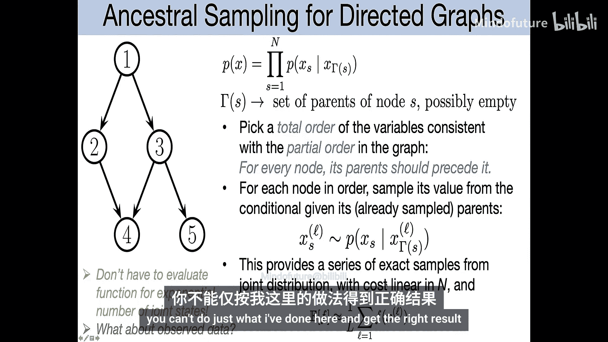

设计这类生成器有很多工作，这实际上更像是一个数学问题，涉及数论等专门主题。如果你仔细想想，你会希望 `M` 是互质且较大的，你不希望有公因数。

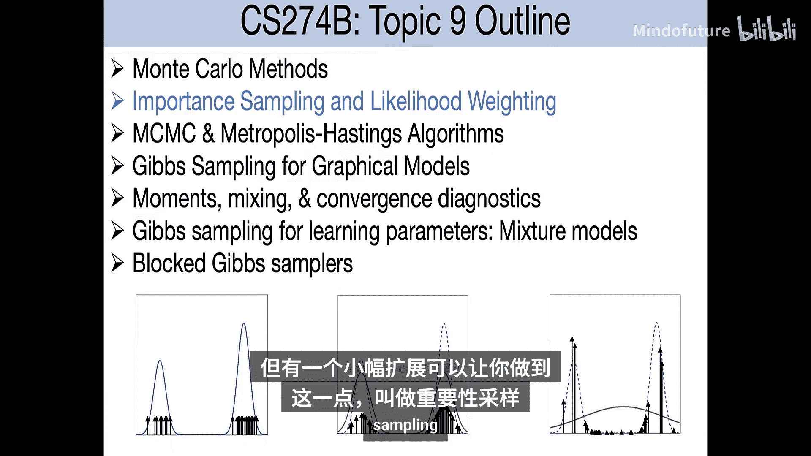

这真的很重要。例如，在 20 世纪 70 年代，有一个名为 RANDU 的随机数生成器，它是这个想法的一个简单版本。他们使用的函数是乘以 65,539。他们选择这个数字是因为它几乎是 2 的幂，在当时的计算机上乘法运算很快。然而，如果你取生成序列的三元组并在三维空间中绘制它们，它们基本上精确地位于这些平面上，存在强烈的相关性。实际上，有数百篇科学论文的结果因此变得无效。

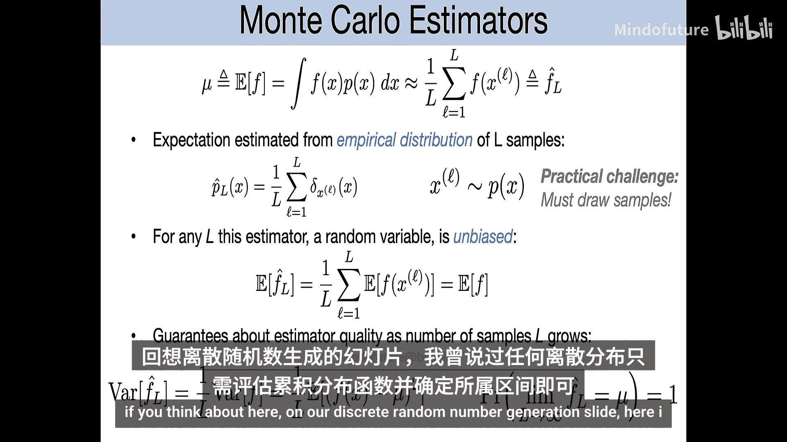

所以，这真的很重要。你不应该尝试实现自己的伪随机数生成器。有些人毕生致力于完善这些细节，这非常棘手，很容易出错。有基准测试来检验生成器是否能通过随机性测试。好的生成器（如 Python、MATLAB、R 等内置的生成器）基本上与真正的随机数无法区分，或者从实际计算的角度看无法区分。

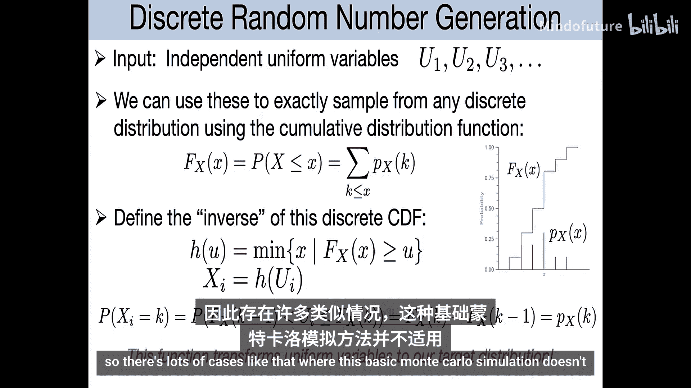

## 重要性采样

现在，让我将其与图形模型联系起来。我们将讨论一系列蒙特卡洛方法，从非常简单的方法到更高级的方法。

其中最简单的方法是**有向图形模型的模拟**。

假设我有一个有向图形模型。从它的分解方式，我知道节点 1 的边缘分布，但如果我想知道节点 4 的边缘分布，这并不直接可及。我可以使用联结树算法来获得节点 4 的精确边缘分布，但对于更复杂的模型，计算成本可能很高。

另一种方法是：首先，我选择图中变量的一个顺序，这个顺序要与偏序一致，即对于每个节点，其父节点都排在它之前。然后，我按照这个顺序遍历并模拟节点。例如，从模拟节点 1 开始，然后根据已知的 `x1` 模拟 `x2` 的分布，接着模拟 `x3`，依此类推。这样，用几个均匀随机数，我就可以模拟这个模型中的所有变量，从而得到联合分布的一个样本。

如果我想知道节点 4 取某个特定值的概率，我可以重复这个过程很多次（例如 10,000 次），绘制联合配置的样本，然后计算节点 4 取该值的次数除以总次数。这将给我一个无偏估计，并且随着样本数量的增加，它会越来越接近真实值。

蒙特卡洛方法与精确推断方法（如联结树算法）有不同的权衡。联结树算法总是给出零误差（或接近零）的答案，但可能非常慢，甚至完全无法处理，具体取决于图结构。而蒙特卡洛方法，你可以通过选择样本数量来决定愿意花费多少计算时间。权衡在于你得不到精确答案，得到的是真实值加上由于有限次模拟带来的噪声。

另一个优点是，我可以计算不仅仅是关于单个节点的函数的期望值，还可以计算复杂函数的期望值。只要我能够模拟并在任何变量值上评估我的函数，就可以使用蒙特卡洛方法。函数不需要可微或具有良好性质。

但是，如果图中有环怎么办？对于有向图模型，它必须是无环的，所以不能有有向环。我描述的这种祖先采样方法不能直接应用于无向马尔可夫随机场或因子图。这是利用了有向图模型分解特性的方法。对于无向模型，我们后面会讨论一些更高级的方法。

更常见的是，我们关心给定数据的后验分布。如果某些节点被观测到，我如何修改这个过程来考虑这一点？仅仅按照上述过程模拟无法得到正确的结果。有一个称为**重要性采样**的扩展方法可以处理这个问题。

## 重要性采样的原理

重要性采样是一种处理难以直接从目标分布 `P(x)` 中采样的通用方法。

其思想如下：我有一个目标分布 `P(x)`，我想计算关于它的期望。`P(x)` 可以写成未归一化的 `P*(x)` 乘以一个归一化常数 `Z_P`。我可能不知道这个归一化常数。假设从 `P` 中采样是困难的。

我将构建另一个分布 `Q(x)`，称为**提议分布**。`Q` 也可以写成未归一化的 `Q*(x)` 除以一个归一化常数 `Z_Q`。唯一严格的要求是，`Q(x)` 必须在 `P(x)` 为正的任何地方都有正概率。除此之外，`Q` 可以是任意的。一个好的 `Q` 应该是与 `P` 相似但更容易处理的分布。

现在，我的积分，`F(x)` 的期望值，可以写成 `F(x)` 乘以一个权重函数 `W(x) = P(x)/Q(x)`，再乘以 `Q(x)`。这样，积分值没有改变。现在，这可以看作是关于分布 `Q` 的 `F(x)W(x)` 的期望值。

因此，我可以从 `Q` 中采样，在每个样本处评估 `F` 乘以 `W`，然后平均这些值，得到一个蒙特卡洛估计。

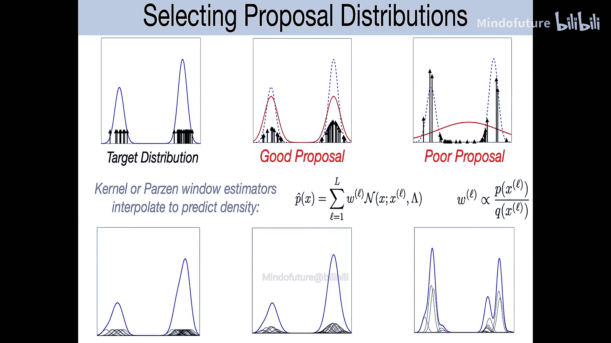

最广泛使用的重要性采样版本做了一些更巧妙的事情来处理我们不知道归一化常数的事实。它使用未归一化密度的比率 `W*(x) = P*(x)/Q*(x)`。我抽取一堆来自 `Q` 的样本，评估每个样本的 `W*`，得到正数权重，然后将这些权重归一化使其和为 1。接着，我取函数值的加权平均。

在基本的蒙特卡洛方法中，你抽取样本并取未加权的均值。在这里，我做的是加权平均。权重基本上根据 `P` 与 `Q` 的比率来调整。如果在某个 `x` 处 `P/Q > 1`，说明提议分布在该处概率过低，采样不足，因此该点会获得较大的权重。反之，如果 `P/Q < 1`，说明提议分布在该处概率过高，采样过多，因此该点会获得较小的权重。这样，你就校正了采样偏差。

这个估计器是渐近无偏的。实际上存在偏差，因为忽略了归一化常数，但随着样本数量的增加，偏差会减小到零。

你可能会问，什么是最好的提议分布 `Q`？直觉上，你可能认为设置 `Q = P` 是最好的。但事实上，你可以做得更好。为了最小化估计器的方差，最好的 `Q` 是取 `P(x)` 乘以 `|F(x)|`，然后重新归一化。这意味着，如果你的目标是评估某个特定函数 `F(x)` 的期望值，那么在 `F(x)` 幅度大的区域放置更多样本，可以获得更快的收敛速度。

这在**稀有事件模拟**中很有用。例如，在计算机系统中，你想估计系统失败的概率，但失败可能非常罕见（如十亿分之一）。如果直接从真实分布采样，你需要海量样本才能观察到几次失败。使用重要性采样，你可以设计一个偏向的提议分布 `Q`，使失败更常见，然后通过重要性权重来校正偏差，从而更有效地估计稀有事件的概率。

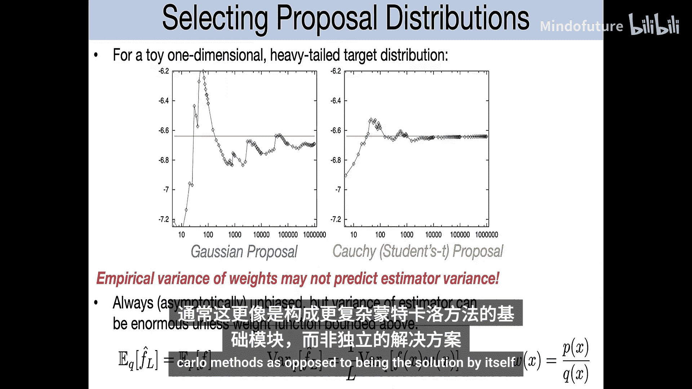

## 重要性采样在有向图模型后验推断中的应用

现在，让我们看看如何将重要性采样应用于有向图模型的后验推断。

假设我有一个有向模型，并且我观测到了一些变量（例如 `x2` 和 `x5`），我想知道其他变量（隐变量）的后验分布。

和之前一样，我选择一个变量的顺序，使得每个节点的父节点都排在它之前。现在，观测变量的值是固定的。我按照顺序，只对隐变量根据其父节点进行采样。

例如，我从先验中模拟 `x1`，然后根据 `x1` 模拟 `x3`，接着根据 `x3` 的样本和观测到的 `x2` 值模拟 `x4`。这个过程部分地考虑了我的观测（例如模拟 `x4` 时考虑了 `x2`），但没有完全考虑所有观测的影响（例如 `x2` 本应影响 `x1` 的后验，`x5` 也会影响其他变量）。

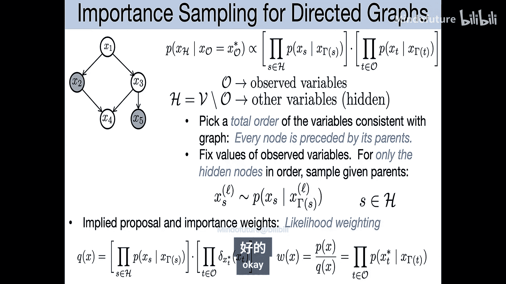

这样生成的样本来自一个提议分布 `Q`，它并不是真正的后验分布。然后，我计算重要性权重。有趣的是，在权重计算中，隐变量的条件概率项会抵消掉，最终权重简化为所有观测节点在其父节点条件下的概率的乘积。

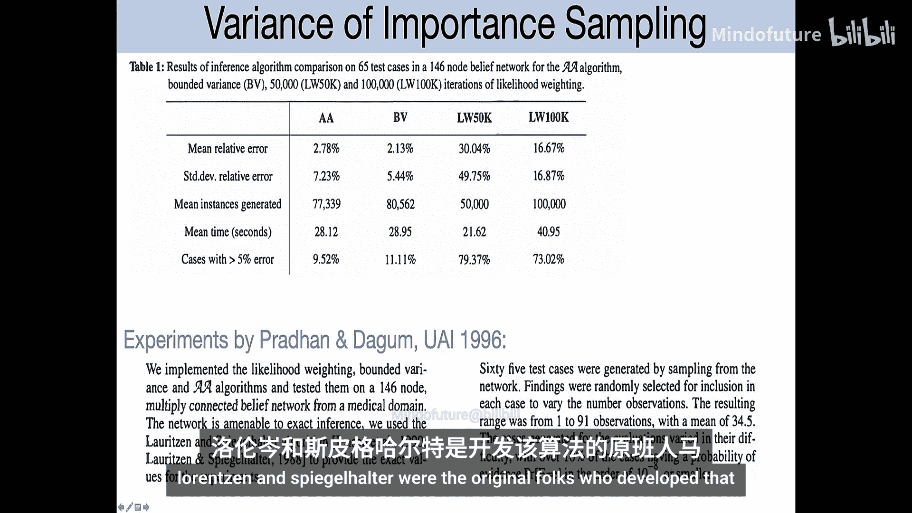

因此，这种方法被称为**似然加权**。权重就是给定父节点下观测数据的似然。

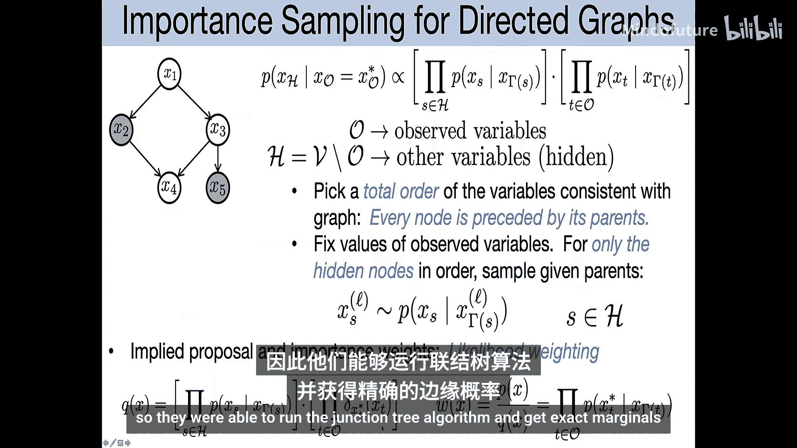

## 似然加权的效果与局限

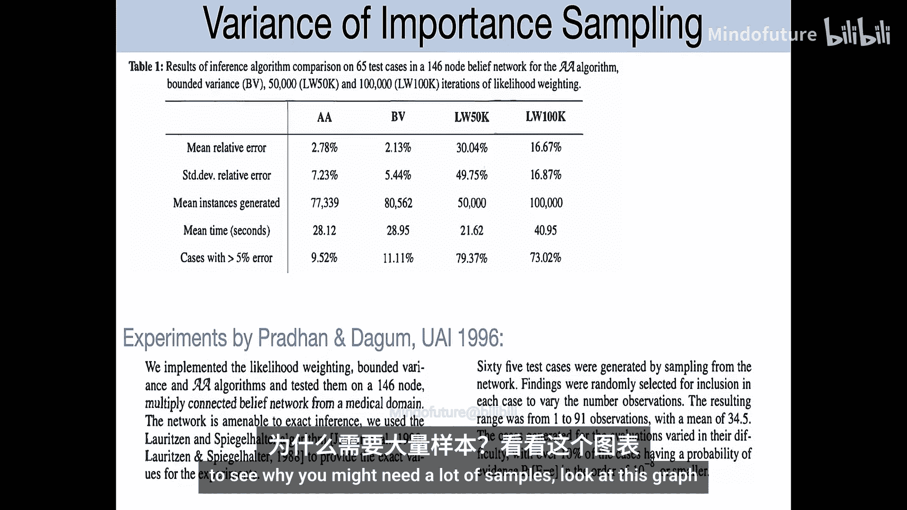

这个方法很简单，是这类模型最早的方法之一，可以追溯到 20 世纪 80 年代。

然而，它的效果可能并不理想。在一项 1996 年的研究中，一个包含 146 个节点的医疗诊断网络被用作测试。研究者能够运行联结树算法获得精确边缘分布作为基准。他们比较了似然加权方法在 50,000 和 100,000 个样本下的误差。结果显示，即使使用 100,000 个样本，仍有约 16% 的相对误差。虽然随着样本增加误差在下降，但对于一个不算巨大的模型来说，100,000 个样本已经很多，且误差仍然显著。

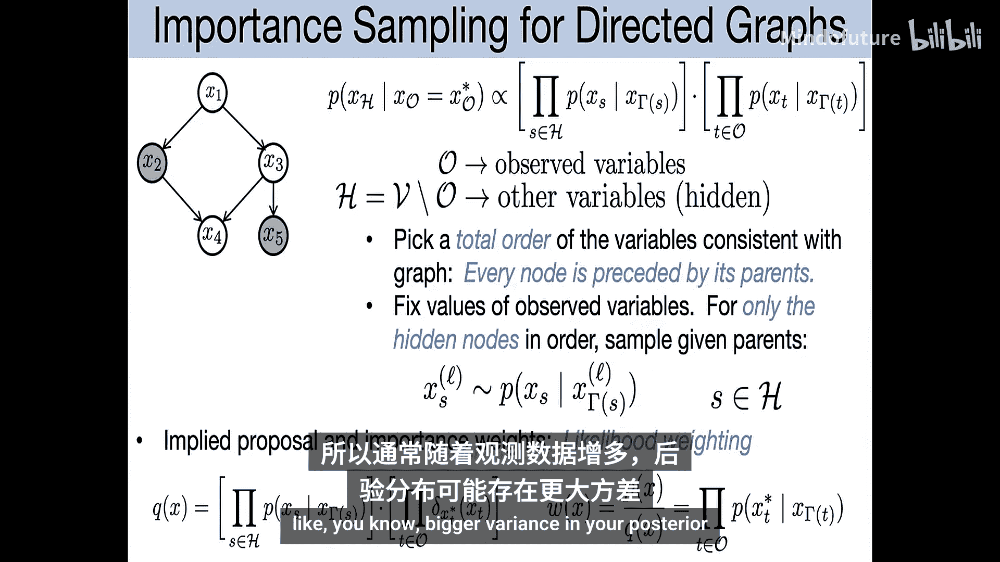

为什么需要这么多样本？考虑一个情景：假设 `x1` 代表一种罕见疾病，先验概率极低（如万分之一）。但给定某个检测结果 `x5` 后，后验概率变得非常高。当从先验中模拟 `x1` 时，你几乎总是得到“健康”的样本。这些样本在后续计算中权重会非常低（因为观测数据与“健康”假设不符）。只有极少数从先验中抽到“患病”且与数据一致的样本才会获得高权重。因此，如果后验与先验差异很大，或者观测数据非常多、信息量很大，这种方法就会效率低下，需要大量样本才能捕捉到后验的高概率区域。

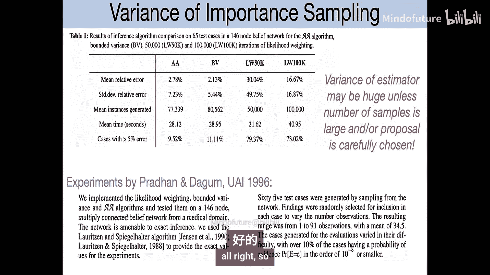

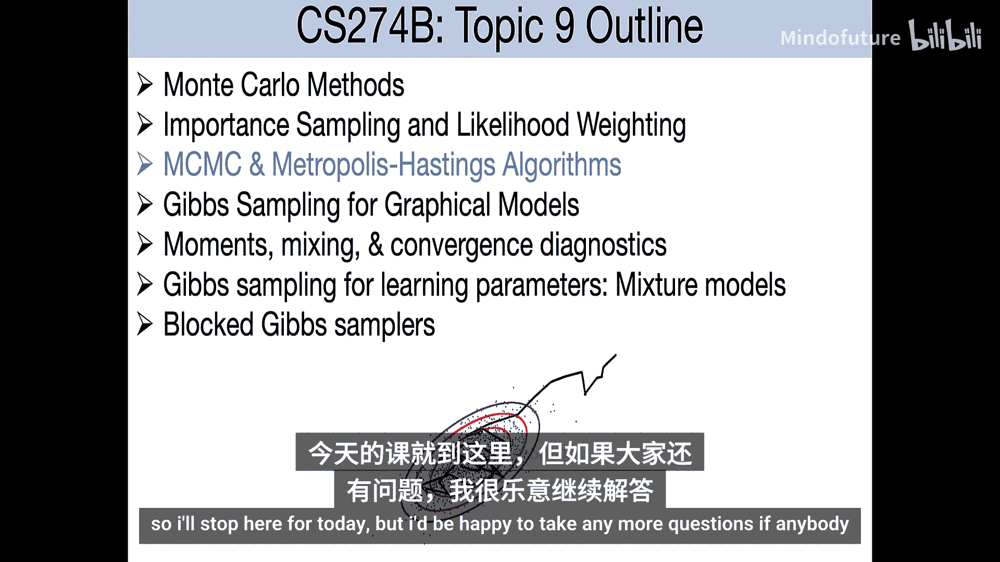

此外，权重是所有观测节点概率的乘积。随着观测节点增多，权重的方差可能会变得非常大，导致估计不稳定。

因此，虽然似然加权实现简单，但计算负担可能很高。后续我们将学习更高级的方法（如马尔可夫链蒙特卡洛），它们能更好地处理变量间的依赖关系，从而更有效地进行采样。

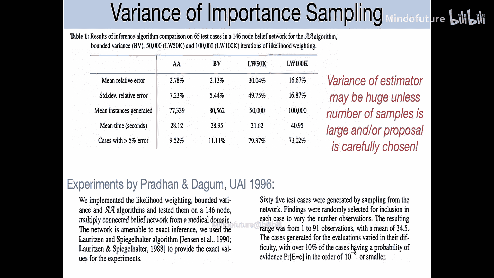

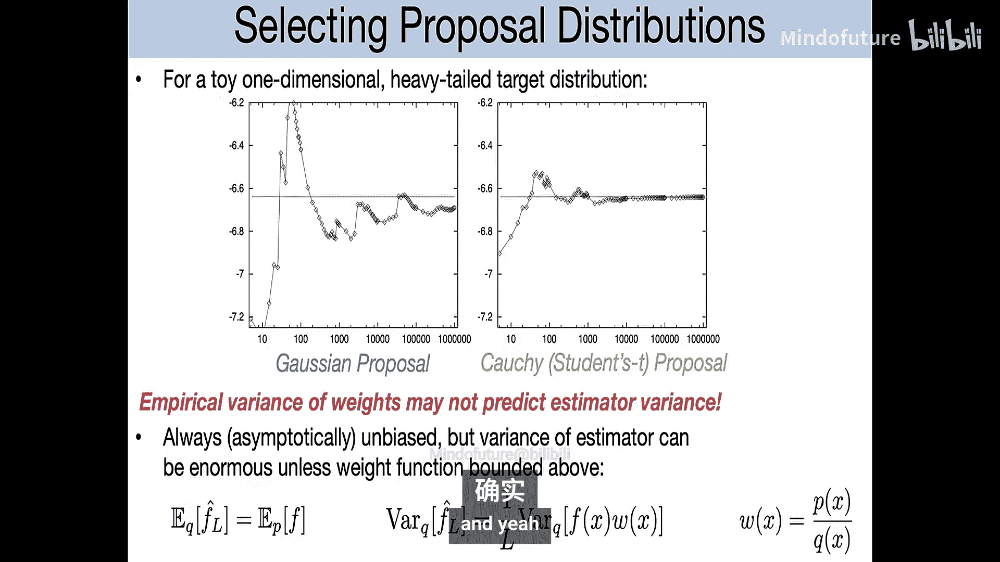

## 总结

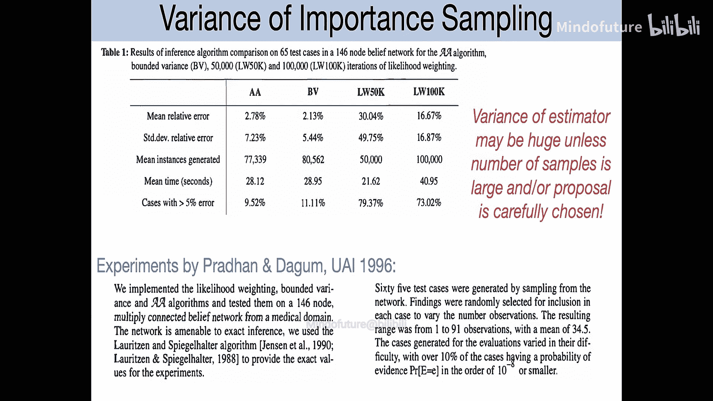

本节课中，我们一起学习了蒙特卡洛方法的基础。我们从大数定律和基本采样原理出发，介绍了如何利用均匀随机数生成其他分布的样本。接着，我们探讨了重要性采样的核心思想，它通过从一个易于采样的提议分布中抽取样本，并用重要性权重进行校正，来近似难以直接采样的目标分布的期望。最后，我们看到了重要性采样（特别是似然加权）在图形模型后验推断中的应用及其局限性。蒙特卡洛方法为我们提供了一种强大的近似工具，尤其适用于高维、复杂的模型推断问题。下一讲，我们将深入探讨马尔可夫链蒙特卡洛方法。