# 012：MCMC方法之Metropolis-Hastings 🎲

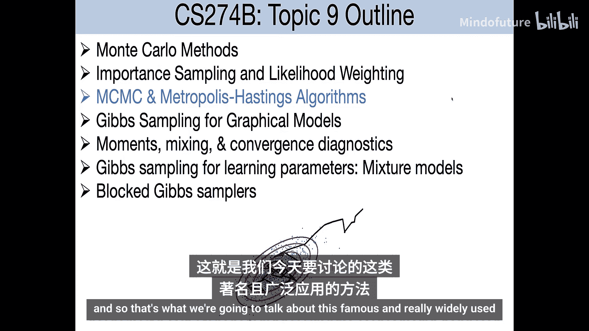

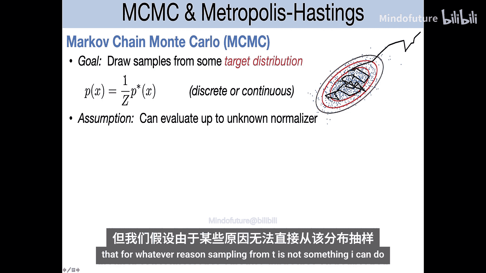

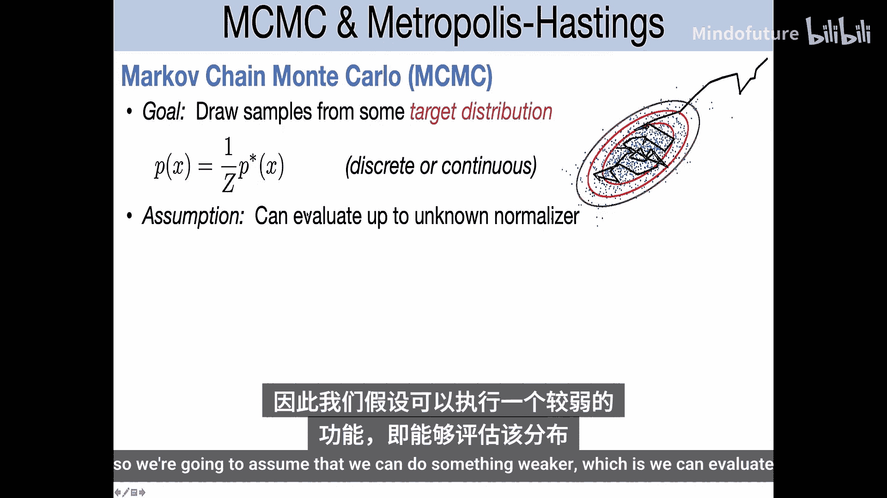

在本节课中，我们将要学习一种强大的蒙特卡洛方法——马尔可夫链蒙特卡洛（MCMC）。我们将重点介绍其中最著名且应用最广泛的Metropolis-Hastings算法。当面对高维复杂模型时，基本的采样方法往往不切实际，而MCMC方法则提供了一种有效的解决方案。

## 目标与基本设定

上一节我们介绍了蒙特卡洛方法的基本思想。本节中，我们来看看当直接采样变得困难时，如何通过构建一个马尔可夫链来从目标分布中采样。

我们的目标是：从一个目标分布 **P(x)** 中采样。这个分布可以是离散的或连续的。我们假设由于某些原因，无法直接从 **P(x)** 中采样。

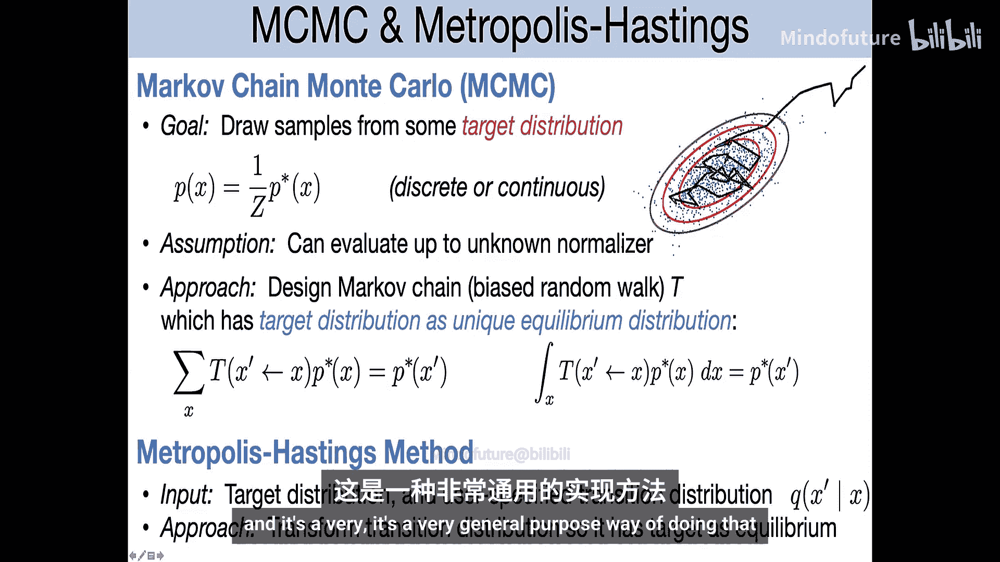

但我们能做一件更弱的事情：**评估**这个分布。也就是说，给定任何一个具体的 **x**，我们可以计算出它的（未归一化的）概率值 **P\*(x)**。本课程中讨论的所有模型都满足这个条件。

## MCMC的核心思想

MCMC方法的核心是：**设计一个马尔可夫链，使其平稳分布恰好是我们关心的目标分布 P(x)**。

如果我们能模拟这个马尔可夫链足够长的时间，那么链的状态最终就会成为来自 **P(x)** 的样本。这基于马尔可夫链的一个基本性质：在特定条件下，链会收敛到一个唯一的平稳分布。

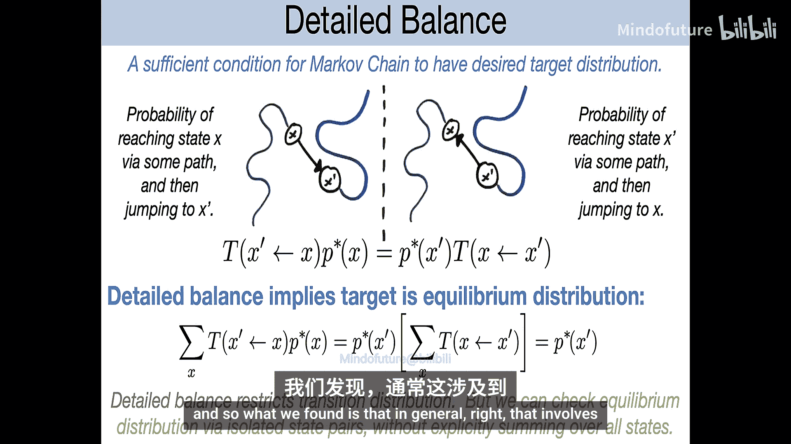

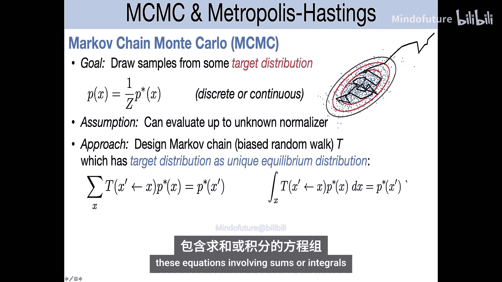

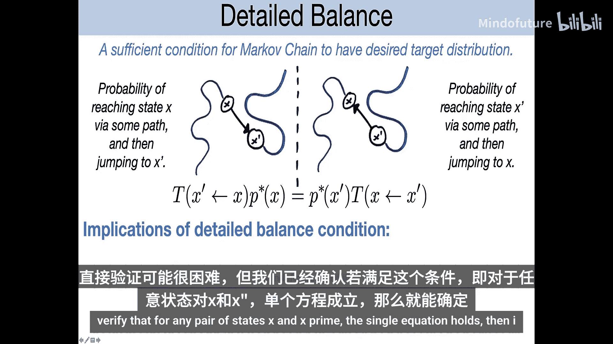

对于一个离散状态的马尔可夫链，平稳分布需满足以下方程：
**∑_x P(x) T(x'|x) = P(x')**
其中 **T(x'|x)** 是从状态 **x** 转移到 **x'** 的概率。对于连续状态，方程变为积分形式。

满足此平稳分布的马尔可夫链有很多。我们的目标是找到一个“好”的链：它能快速收敛到平稳分布，并且每一步的模拟计算成本低廉。

## 细致平衡条件

在分析马尔可夫链时，一个关键概念是“细致平衡”。它比平稳分布的条件更强，也更易于验证。

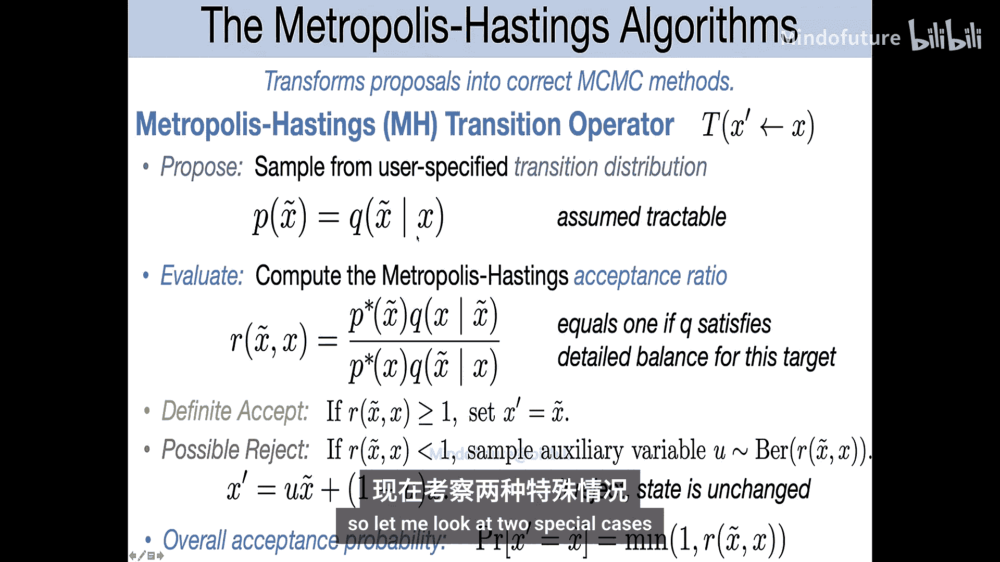

细致平衡条件定义为：对于所有状态对 **(x, x')**，满足
**P(x) T(x'|x) = P(x') T(x|x')**

这个条件的直观理解是：从 **x** 跳到 **x'** 的“流量”，必须等于从 **x'** 跳回 **x** 的“流量”。如果 **P(x') > P(x)**，那么从 **x** 跳到 **x'** 的概率应该更高，这样才能在平衡时更多地停留在高概率状态。

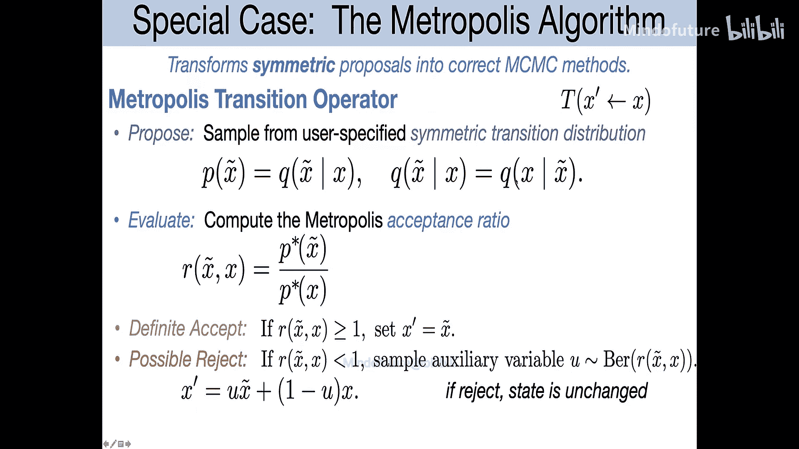

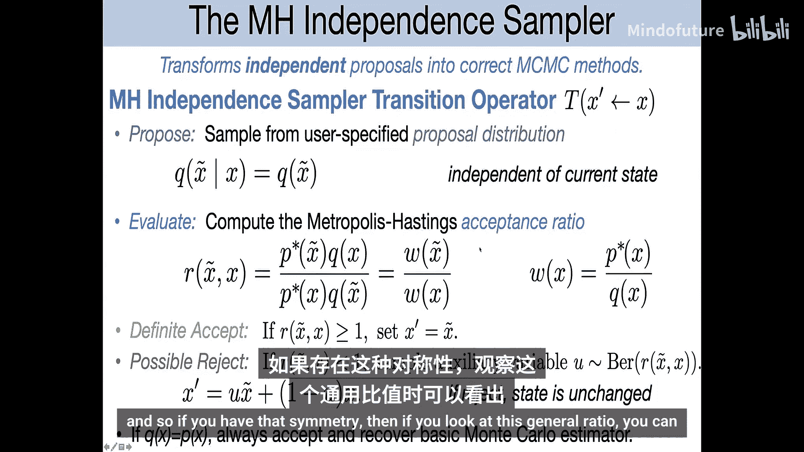

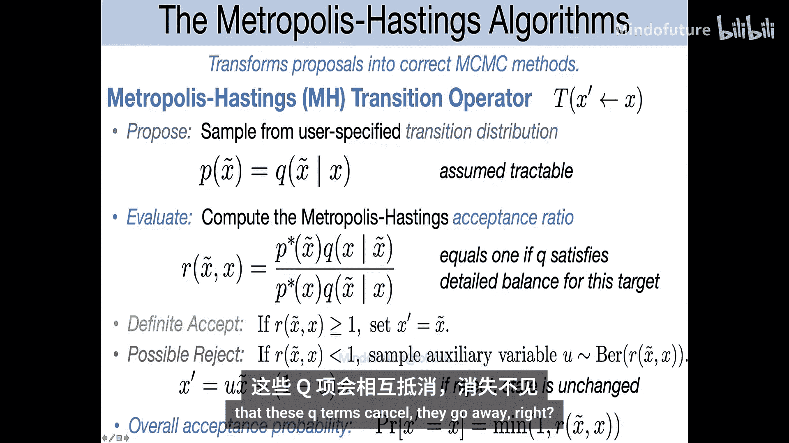

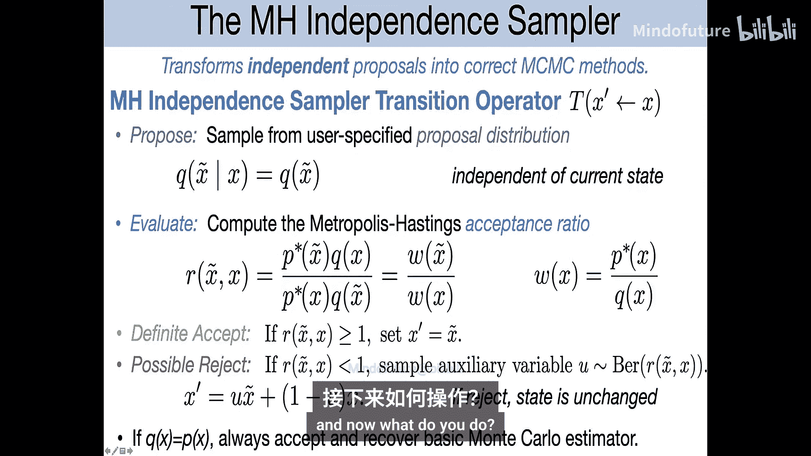

一个重要的结论是：**如果细致平衡条件成立，那么 P(x) 一定是该马尔可夫链的平稳分布**。虽然存在不满足细致平衡但仍有正确平稳分布的链，但它们更难分析和构造。因此，实践中广泛使用的方法通常都满足细致平衡。

## Metropolis-Hastings 算法 🛠️

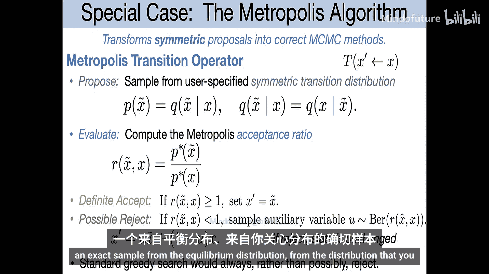

现在，我们来看如何构造这样一个链。Metropolis-Hastings算法提供了一个通用框架。

用户需要提供两样东西：
1.  目标分布 **P(x)**（可以未归一化）。
2.  一个“提议分布” **Q(x'|x)**。给定当前状态 **x**，它能提出一个候选新状态 **x'**。我们假设可以从 **Q** 中采样，也能计算其概率值。

算法步骤如下：

1.  从提议分布 **Q(x̃|x)** 中采样一个候选状态 **x̃**。
2.  计算“接受率” **r**：
    **r = min( 1, [P(x̃) Q(x|x̃)] / [P(x) Q(x̃|x)] )**
3.  以概率 **r** 接受这个提议：采样一个伯努利变量，若为1（成功），则令新状态 **x' = x̃**；若为0（失败），则拒绝提议，令 **x' = x**（链保持原状态）。

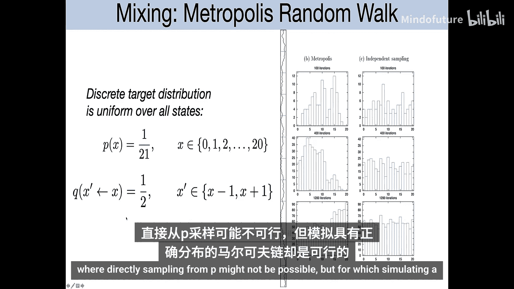

**接受率 r 的含义**：如果分子（新状态的概率与反向提议概率的乘积）大于分母（旧状态的概率与正向提议概率的乘积），则 **r=1**，总是接受。否则，以概率 **r** 接受。这确保了链更倾向于移动到高概率区域，但有时也会“冒险”进入低概率区，从而能探索整个分布。

### 特例分析

以下是两种重要的特例：

1.  **独立采样提议**：当 **Q(x'|x) = Q(x')**，即提议与当前状态无关时。此时接受率简化为：
    **r = min( 1, [P(x̃)/Q(x̃)] / [P(x)/Q(x)] )**
    这正好是重要性采样中权重 **w(x)=P(x)/Q(x)** 的比值。算法会倾向于接受那些在 **P** 下概率高、在 **Q** 下概率低的样本。

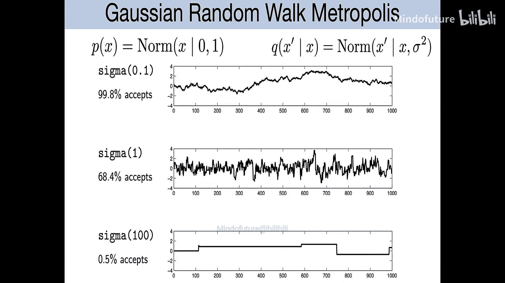

2.  **Metropolis算法（对称提议）**：当提议分布对称，即 **Q(x'|x) = Q(x|x')** 时。此时 **Q** 项抵消，接受率简化为：
    **r = min( 1, P(x̃)/P(x) )**
    这很像一种带随机性的“贪心搜索”：如果新状态概率更高，总是接受；如果新状态概率更低，则以新旧概率之比为概率接受。通过有时接受向低概率状态的移动，链最终能采样到整个目标分布，而不仅仅是困在某个峰值。

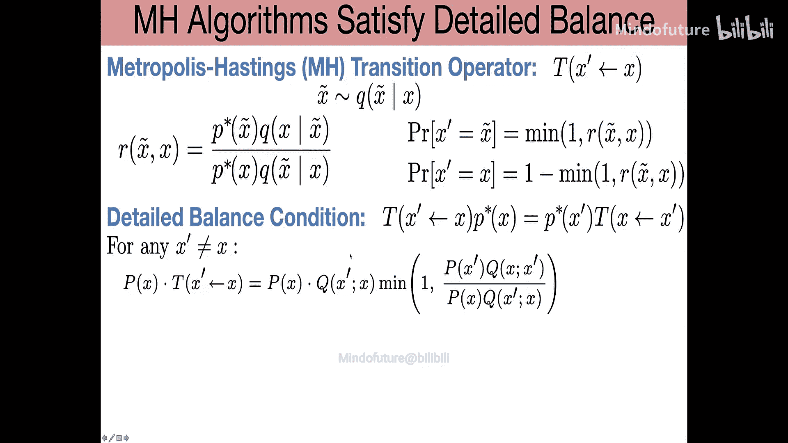

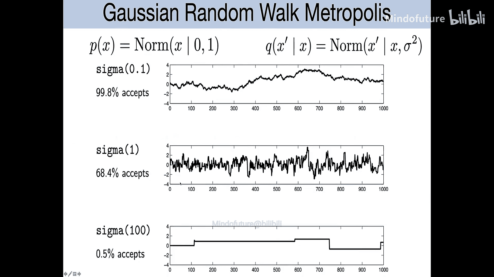

## 简单示例与调参

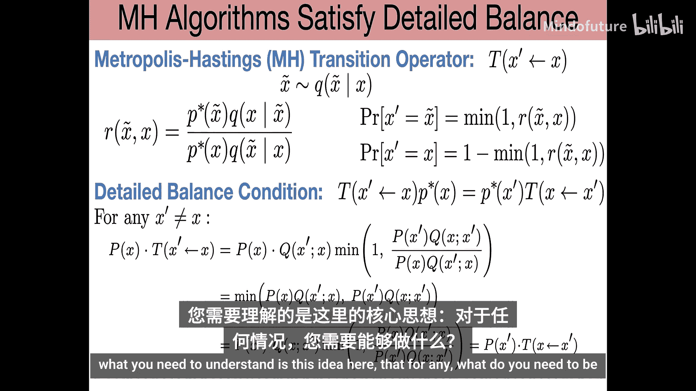

让我们通过简单例子理解算法的行为。

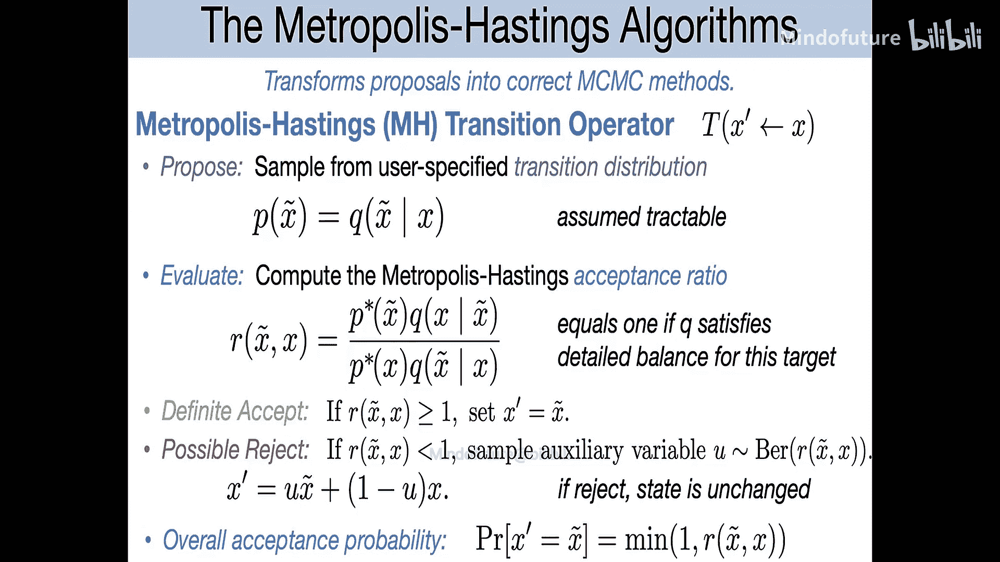

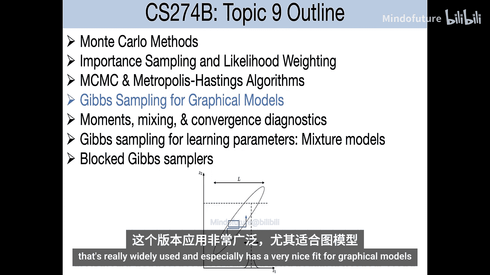

*   **离散均匀分布**：目标是在整数{0,...,20}上的均匀分布。使用一个简单提议：以0.5概率加1，0.5概率减1（在边界处调整）。模拟显示，由于链的状态是相关的（随机游走），它需要比独立采样更多步骤才能让直方图接近均匀。从状态1游走到状态20需要很多步，这体现了“混合速度”的概念。

*   **连续高斯分布**：目标是标准正态分布 N(0,1)。使用“随机游走Metropolis”提议：**Q(x'|x) = N(x'|x, σ²)**，即给当前值加高斯噪声。
    *   **σ=1（适中）**：接受率约68%，链能较好地探索空间。
    *   **σ=100（过大）**：提议步长巨大，绝大多数候选点落在目标分布的低概率区，因此几乎总是被拒绝，链长时间停滞，效率极低。
    *   **σ=0.1（过小）**：接受率超过99%，但每一步移动极小，链像爬行一样缓慢探索空间，从2移动到-2需要极长时间。

**核心权衡**：我们希望每一步能做出较大的状态改变以快速探索空间，但又不能大到导致提议总被拒绝。因此，提议分布的尺度（如σ）需要仔细调整。

## Gibbs采样：图形模型的利器 🔗

对于具有多变量的图形模型，一种特别流行且强大的MCMC方法是Gibbs采样。它可以看作是Metropolis-Hastings的一个特例，并且能自动利用模型的结构。

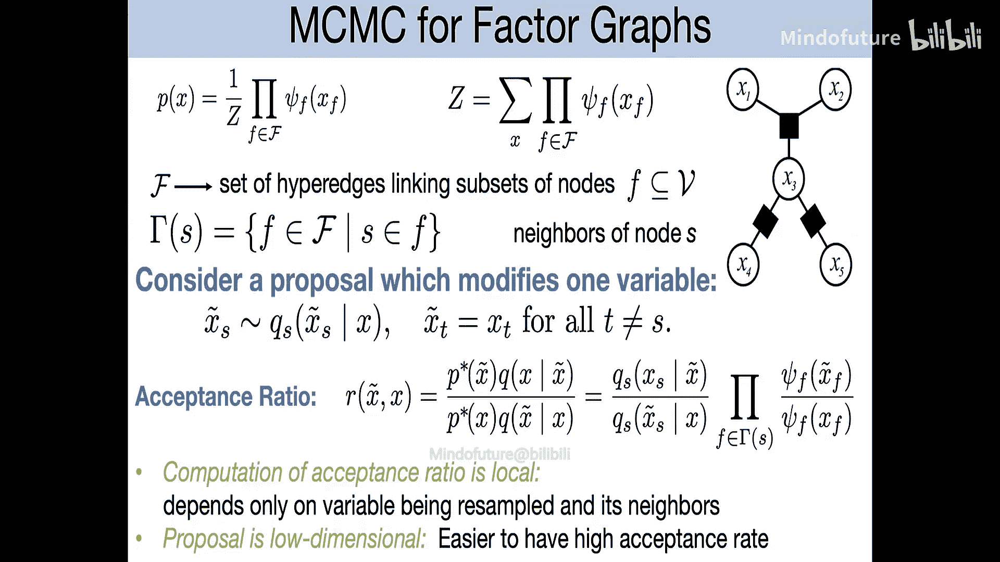

基本思想是：**每次只更新一个变量，依据该变量在给定所有其他变量当前值下的条件分布进行采样**。

### 算法流程

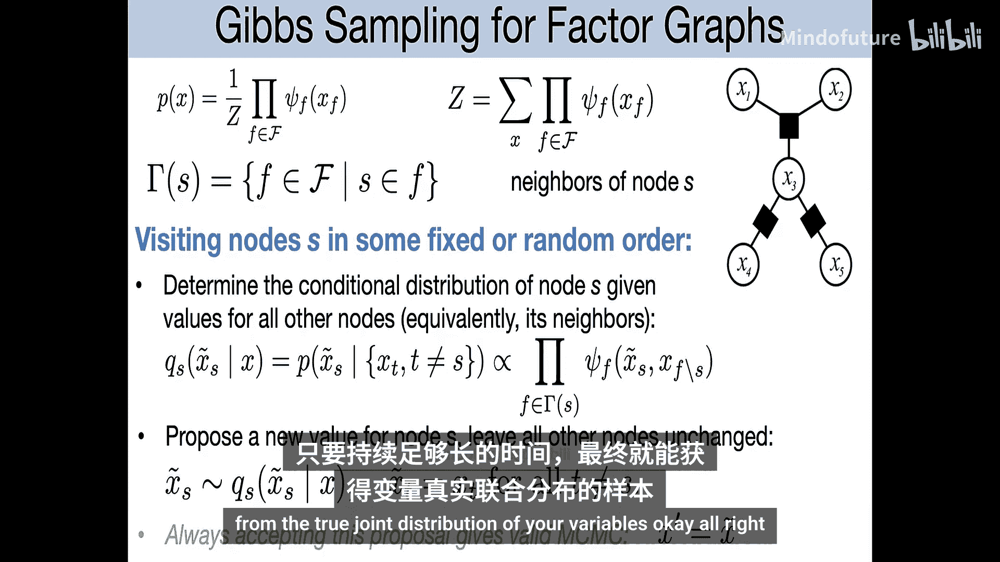

1.  按某种顺序（固定或随机）遍历所有变量。
2.  对于当前要更新的变量 **X_s**，计算其**条件分布 P(X_s | X_{\s})**，即给定所有其他变量值时 **X_s** 的分布。
3.  从这个条件分布中采样一个新值 **x_s̃**。
4.  用新值替换旧值，其他变量保持不变，然后处理下一个变量。

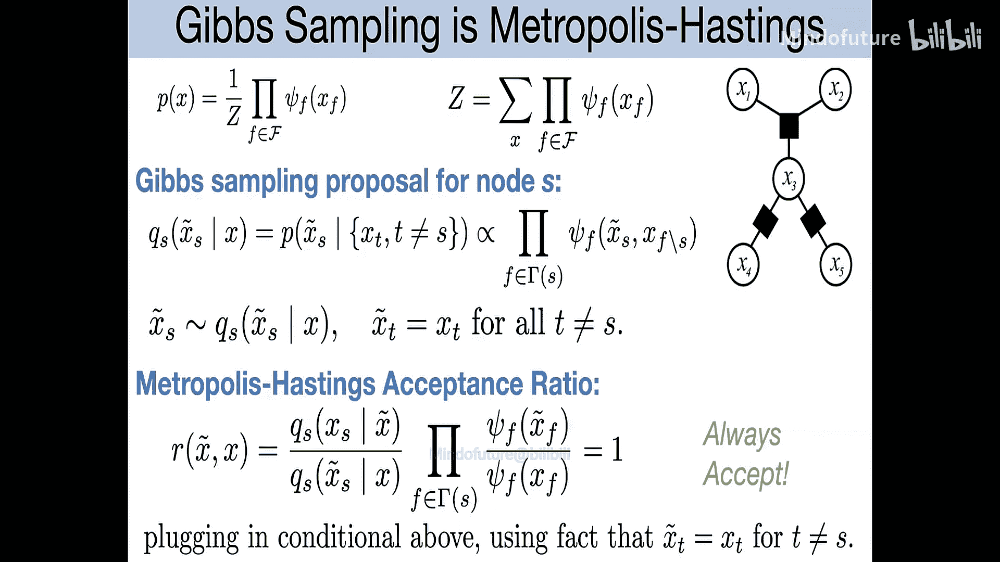

在图形模型中，根据马尔可夫性质，**一个变量的条件分布只依赖于其邻居节点**。因此，计算条件分布时，只需聚合与 **X_s** 相连的因子即可，无需计算整个联合分布，效率很高。

### 为何它是Metropolis-Hastings的特例？

如果我们把Gibbs采样中的“从条件分布采样”看作是一个特殊的提议分布 **Q**，那么计算Metropolis-Hastings的接受率 **r** 时，会发现分子和分母完全相等，**r 恒等于 1**。这意味着在Gibbs采样中，**我们总是接受提议的新值，无需额外的接受-拒绝步骤**。

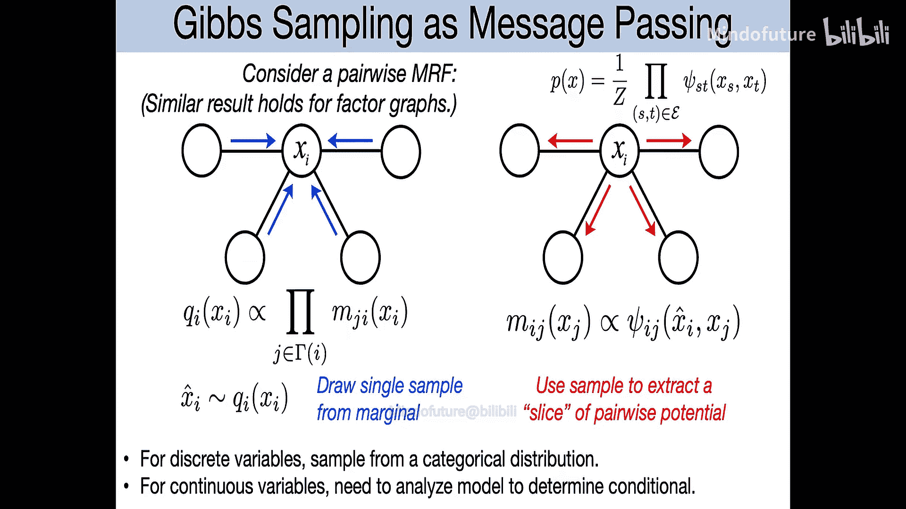

### 优势与自动化

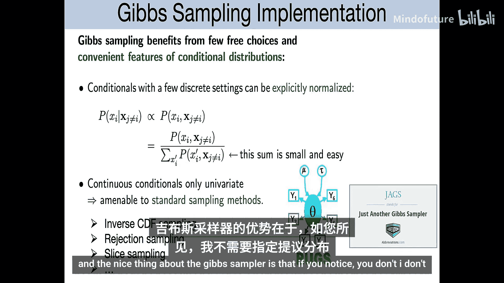

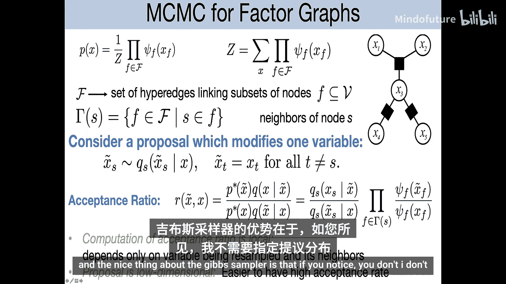

Gibbs采样的巨大优势在于其**自动化**程度高。用户只需指定模型（即联合分布），算法就能自动推导出每个变量的条件分布并进行采样。因此，出现了许多概率编程语言（如BUGS, JAGS）和软件包，它们允许用户用高级语言描述模型，然后自动执行Gibbs采样进行推断。这在统计学、社会科学、生态学等领域的应用中非常流行。

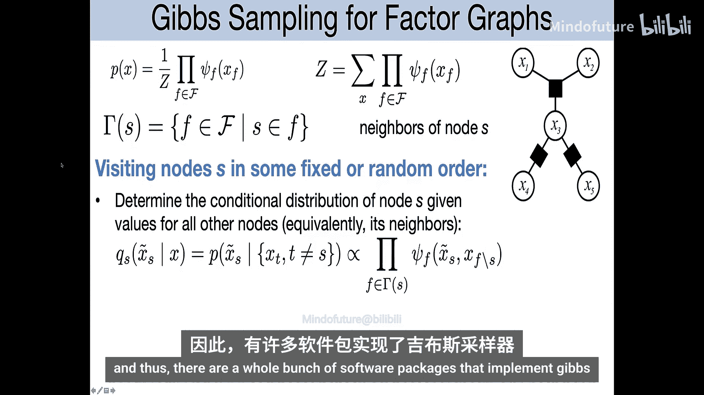

需要注意的是，虽然理论上保证链在无限长时间后收敛到正确分布，但实际中我们只能运行有限步。对于某些复杂模型，“混合时间”（链接近平稳分布所需的步数）可能非常长，这是所有MCMC方法共有的挑战。

---

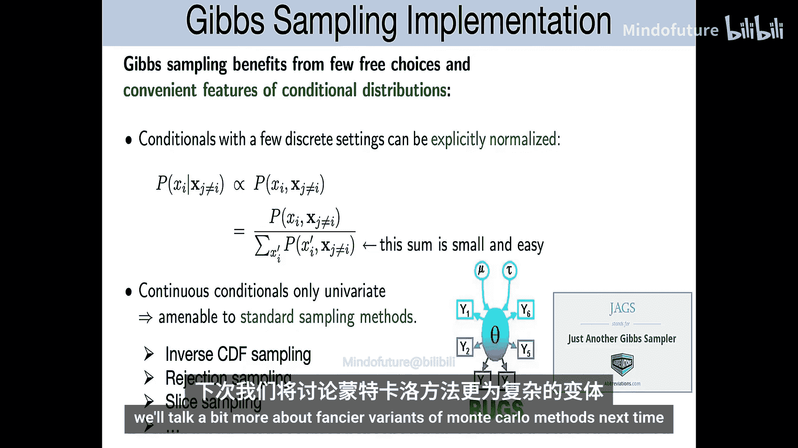

本节课中我们一起学习了MCMC方法的核心——Metropolis-Hastings算法。我们理解了如何通过设计一个满足细致平衡条件的马尔可夫链，来从难以直接采样的复杂分布中获取样本。我们还探讨了其重要特例：对称提议的Metropolis算法和特别适用于图形模型的Gibbs采样。Gibbs采样通过每次更新一个变量并利用局部条件分布，实现了高效且易于自动化的推断，成为实践中极其重要的工具。