# 013：MCMC方法 - 吉布斯采样器

在本节课中，我们将继续讨论蒙特卡洛方法，特别是吉布斯采样器。这是一种在图形模型中广泛应用的采样方法。我们将探讨其工作原理、实际应用中的问题、如何评估其收敛性，以及如何将其用于模型参数的学习，例如在混合模型中。我们还将介绍一种称为“块吉布斯采样”的改进方法，它可以加速马尔可夫链的混合过程。

## 吉布斯采样器的工作原理

上一节我们介绍了蒙特卡洛方法的基本思想。本节中，我们来看看吉布斯采样器这一具体方法。对于图形模型而言，吉布斯采样器是一种典型的蒙特卡洛方法。

其工作流程非常简单：
1.  以某种随机顺序遍历模型中的所有节点。
2.  对于每个节点，计算其在给定模型中所有其他节点情况下的条件分布。根据马尔可夫结构，这等价于给定其邻居节点时的条件分布。
3.  计算出该分布后，从中采样一个新的值来更新该节点。

这个过程可以理解为，通过逐个移动单个变量，使样本在状态空间中逐渐向高概率区域移动。重复此过程多次后，最终得到的样本将服从目标后验分布。

吉布斯采样器之所以正确，是因为：假设我们已经有了一个来自联合分布的样本。如果我们取出其中一个变量，根据给定其他所有变量的条件分布重新采样并更新它，那么更新后的样本仍然来自我们关心的同一个联合分布。这就是吉布斯采样器有效的原因。

## 实际应用中的问题

现在我们已经了解了这个方法，接下来看看在实际使用中会遇到的一些问题。

以下是使用吉布斯采样器时常见的几个问题：

*   **样本相关性**：马尔可夫链的连续步骤之间不是独立的，它们存在相关性。因此，在计算期望时，是否需要丢弃一些迭代以使样本更独立？这个过程称为“稀释”链。
*   **初始化和老化期**：如果初始化是任意的，显然初始样本并非来自目标分布。只进行少量迭代后，样本通常也不是有效的。因此，需要运行足够多的步骤，使链“游走”到真正的样本区域。这个初始阶段有时被称为“老化期”。

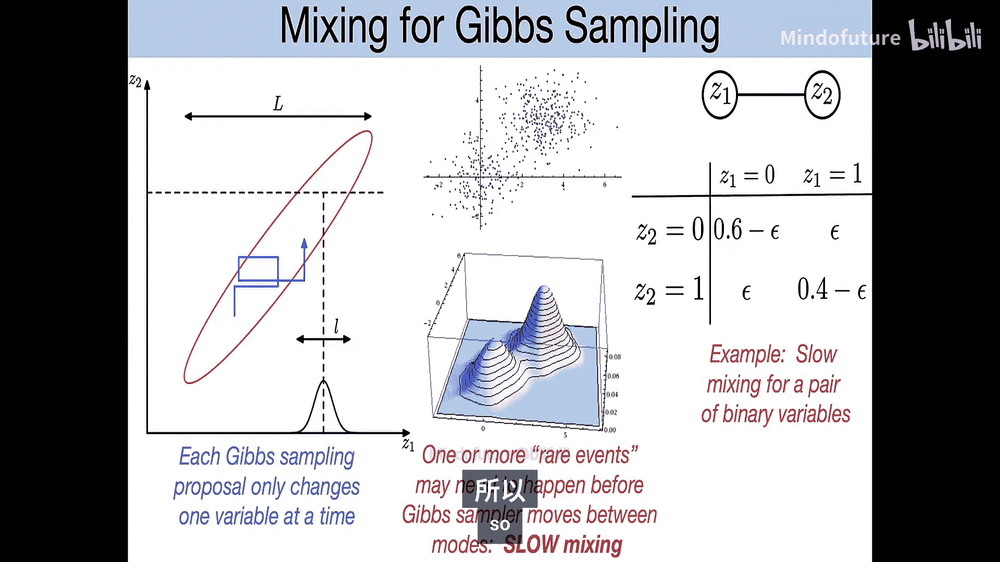

对于这些问题，没有绝对严格的答案。通常的做法是：
1.  丢弃初始的一系列样本点（即老化期），因为链需要时间从低概率区域游走到高概率区域。
2.  之后，可以选择对样本进行二次采样（例如每10个样本取一个），但这并非统计上的必需。即使使用所有相关样本计算蒙特卡洛平均值，只要样本数量足够大，根据大数定律的某些版本，它仍然会收敛到正确的均值。进行二次采样的一个可能原因是，如果要评估的函数计算成本很高，稀释可以减少函数评估次数，从而节省计算资源。

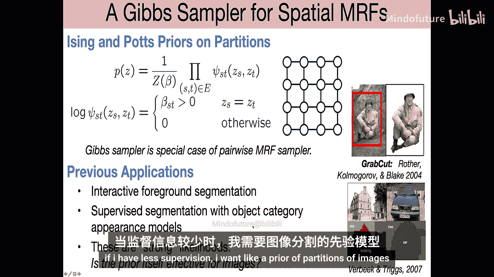

总之，通常的做法是丢弃初始的一组样本，然后使用之后的大量样本来近似我们关心的任何量。

## 评估收敛性的方法

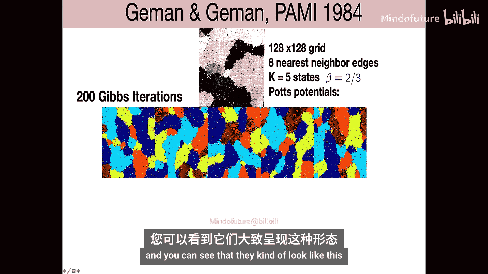

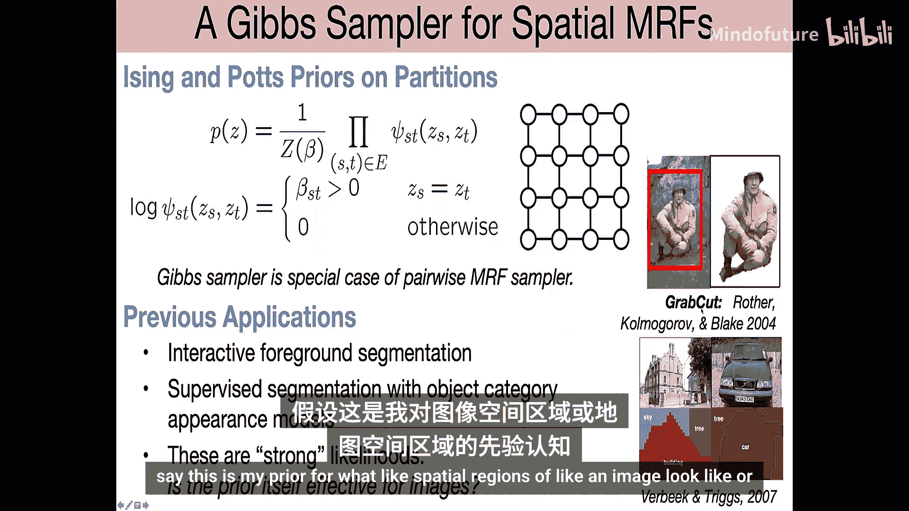

不幸的是，尽管从原理上我们知道，只要马尔可夫链运行足够长的时间，最终就能得到来自正确分布的样本，但很难判断对于特定模型、特定迭代次数和特定初始化，我们是否已经运行了足够长的时间以获得良好的样本。

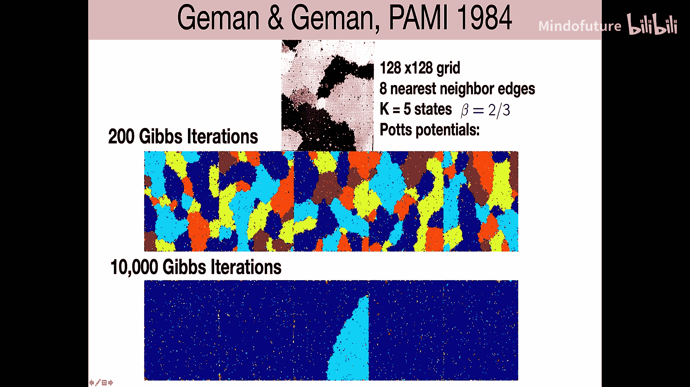

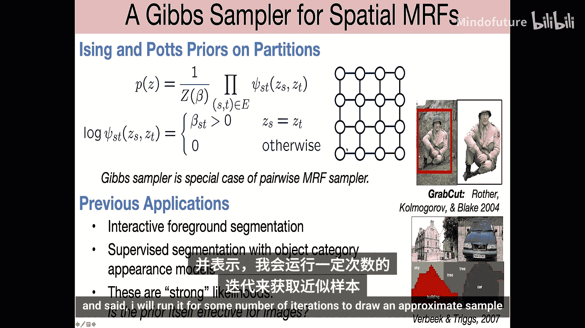

因此，通常需要手动检查输出来评估情况。以下是两种常用的评估方法：

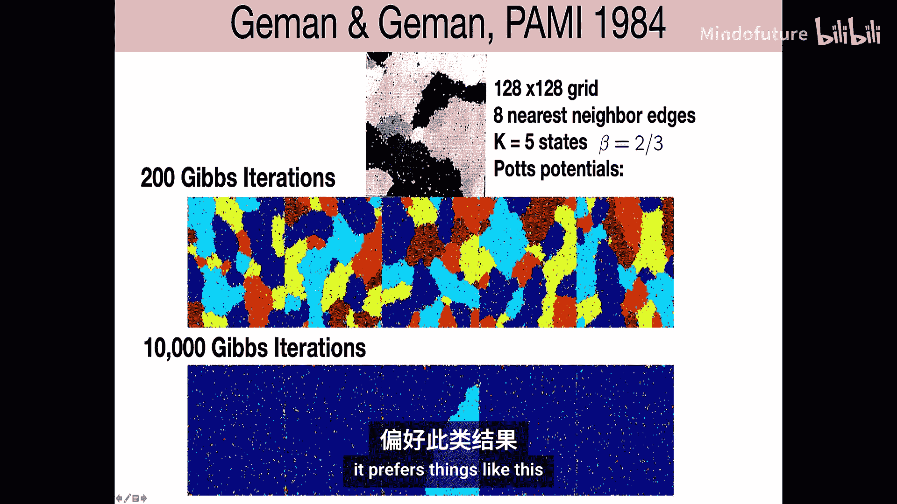

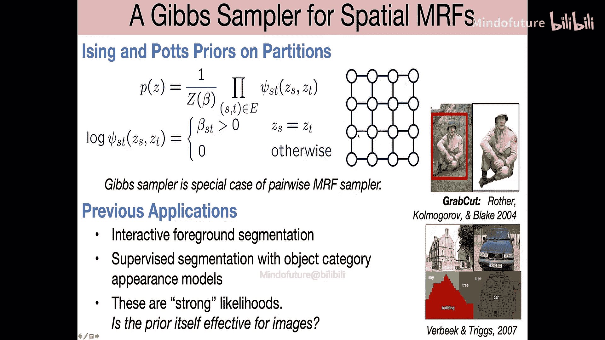

*   **迹线图**：绘制模型中某个重要统计量（如关键变量的值）随时间变化的曲线，观察其是否似乎已经收敛。例如，在迹线图中，如果曲线在迭代后期趋于稳定在一个范围内，则可能表明链已收敛。
*   **自相关图**：计算马尔可夫链在不同滞后步长（如2、10、50、100步）下的自相关性，并观察其衰减到零的速度。自相关性快速衰减通常意味着链混合得较快。

然而，这两种图都有局限性。自相关性大肯定意味着有问题；自相关性衰减到零可能意味着混合迅速，但也可能意味着链被困在某个模态中，无法到达其他模态。迹线图显示单次运行的情况，但无法保证链是否探索了分布的所有重要区域。

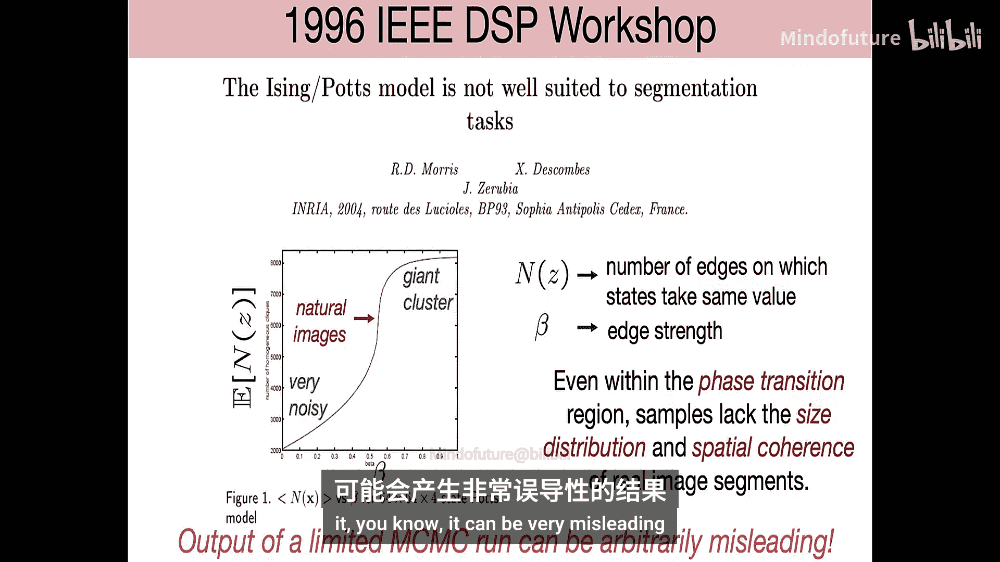

一种更好的诊断方法是运行多个不同初始化的链，并检查它们是否收敛到一致的结果。如果所有链都给出相似的统计量，则更有把握认为链已收敛。

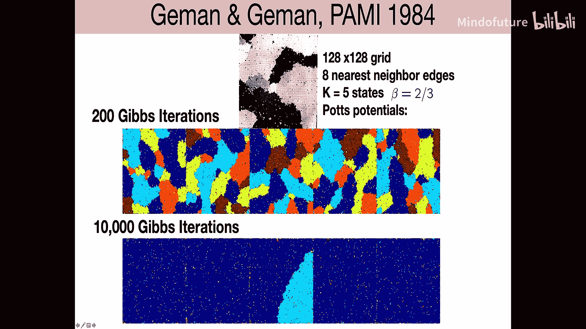

## 吉布斯采样器的局限性：慢混合

吉布斯采样器有一个特性，即每次只改变一个变量。这可能导致“慢混合”问题。

考虑一个简单的例子：一个包含两个变量的图形模型。吉布斯采样的每一步只能水平或垂直移动，无法沿对角线移动。如果目标分布（如一个正相关的多元高斯分布）在某个方向上被拉长，那么要从分布的一个角落移动到另一个角落，吉布斯采样器必须通过许多小的、锯齿状的步骤才能完成。随着分布被拉伸得越来越厉害，来回移动所需的时间会越来越长。

在高维空间中，这个问题会更加严重。即使是最简单的模型也可能出现慢混合。例如，考虑两个二元变量，其联合分布使得两个变量通常相同（如00和11状态的概率很高，01和10状态的概率ε很小）。如果当前状态是00，要跳转到11状态，必须经过概率很低的01或10状态。随着ε变小，在两个主要状态间跳转的频率会越来越慢。

同样，对于具有多个分离模态的分布（如双峰高斯混合分布），吉布斯采样器也很难在不同模态之间移动。这就是所谓的“慢混合”问题，意味着马尔可夫链需要非常长的时间才能充分探索整个状态空间。

虽然存在一些更高级的MCMC方法试图解决这个问题，但它们通常针对特定类别的模型，而非通用。

## 一个警示性的例子：空间马尔可夫随机场

让我们看一个实际例子，说明有限次数的MCMC运行可能产生误导。空间马尔可夫随机场是一种广泛使用的空间数据模型。其简单的形式为相邻像素分配相同标签时给予奖励（即势函数值更高），这符合图像中物体区域通常具有空间连续性的直觉。

在1984年一篇引入吉布斯采样器的著名论文中，作者使用该模型作为图像分割的先验。他们在128x128的网格上运行吉布斯采样器200次迭代（每次迭代对每个变量重采样一次），并将结果展示为来自该分布的样本，样本显示出空间相干的斑块。

然而，后续分析表明，如果运行更长时间（例如10,000次迭代），样本会逐渐合并成少数几个巨大区域，甚至最终变成一个主导区域加上少量噪声。这表明200次迭代远未达到平衡分布，早期结果具有误导性。

该模型本质上是一个指数族模型，其行为类似于统计物理中的伊辛模型，存在相变。在参数空间的某个临界点附近，模型会从噪声状态突然转变为单一团块状态，而无法稳定在产生理想空间分割的中间状态。因此，这个模型虽然直观，但对于实际的空间建模可能存在根本性缺陷。

这个故事的启示是：首先，对于伊辛/波茨模型等空间模型，需要警惕其性质；其次，有限次数的MCMC运行结果可能具有很大的误导性。由于早期计算能力限制，运行长时间链不可行，但如今我们能够进行更长时间的分析，不过对于更复杂的模型，我们可能仍处于类似的境地。

## 计算资源分配建议

考虑到慢混合问题，在进行MCMC时，应如何分配计算资源？通常有以下几种策略：
1.  进行单次长时间运行的马尔可夫链。
2.  进行大量随机初始化，每个运行较短时间。
3.  折中方案：进行少量初始化，每个运行中等长度时间。

通常，最佳实践方案类似于第二种。**始终建议进行多次初始化**，因为这有助于发现是否存在未被访问的多模态。对于每次初始化，通常需要运行数千次迭代。如果只运行100次迭代，结果可能不可信。

## 使用吉布斯采样器进行参数学习

以上我们讨论了在已知模型概率的情况下使用MCMC进行采样。但吉布斯采样器也可用于学习模型参数，特别是在贝叶斯框架下，将参数视为随机变量，然后从其后验分布中采样。

为了使讨论具体化，我们以混合模型为例。混合模型的图模型表示包含观测数据点 `X`、每个数据点所属簇的隐变量 `Z`、簇权重 `π` 以及每个簇的参数 `θ_k`（例如高斯分布的均值和协方差）。

在贝叶斯方法中，我们为 `π` 和 `θ` 设置先验分布：
*   `π` 通常采用狄利克雷先验，它是类别分布参数的共轭先验。
*   对于高斯簇的未知均值和方差，我们也可以设置共轭先验。对于未知均值（方差已知），共轭先验是高斯分布。对于未知方差（或更常用的精度，即方差的倒数），共轭先验是伽马分布（单变量）或威沙特分布（多变量，用于精度矩阵）。当均值和协方差均未知时，其联合共轭先验是正态逆威沙特分布。

吉布斯采样器用于混合模型时，需要依次采样所有未知变量：`Z`、`π` 和 `θ`。其步骤与EM算法有相似之处，但也有关键区别：

1.  **采样 Z（类似于E步）**：固定 `π` 和 `θ`，每个数据点 `i` 属于簇 `k` 的后验概率为：
    `P(Z_i = k | X_i, π, θ) ∝ π_k * P(X_i | θ_k)`
    与EM算法计算“责任”相同，但吉布斯采样器是根据这个概率分布进行**采样**，为每个数据点随机分配一个簇标签，而不是保留软分配。

2.  **采样 π**：给定 `Z` 和 `X`，`π` 的后验分布是狄利克雷分布，其参数依赖于每个簇的样本计数。我们从该后验中采样一个新的 `π`。

3.  **采样 θ**：给定 `Z` 和 `X`，每个簇的参数 `θ_k` 是条件独立的。对于分配给簇 `k` 的数据子集 `X_k`，我们基于该数据和先验，从 `θ_k` 的后验分布（如正态逆威沙特分布）中采样新的均值和协方差。

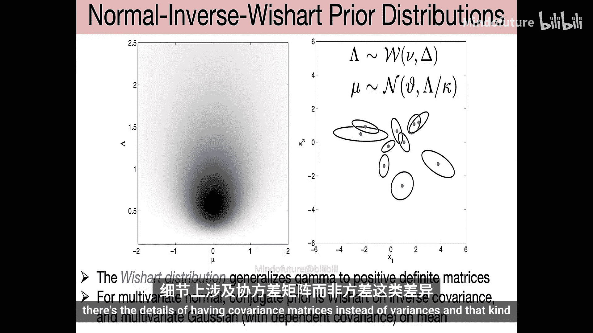

这个过程不断迭代。与EM算法相比，吉布斯采样器在“E步”进行采样而非计算期望，在“M步”从参数的后验分布采样而非最大化似然。这避免了EM可能陷入局部最优的问题，因为MCMC链最终可以跳出局部模式，但代价是收敛可能更慢，且需要处理采样带来的不确定性。

## 加速混合：块吉布斯采样

最后，我们介绍一种旨在加速混合的策略：块吉布斯采样。

基本思想是，与其每次只采样一个变量，不如将一组变量作为一个“块”一起采样。如果能够从这些变量的联合条件分布中高效采样，那么链的混合速度可能会大大加快。

一个典型的例子是在树结构图模型中。对于树，我们可以利用信念传播算法高效地计算根节点的边际分布，采样根节点，然后根据条件独立性递归地采样其他节点，从而**精确地**从整个树的联合分布中采样一个样本。

将这一思想应用于MCMC，例如在隐马尔可夫模型中：
*   **基本吉布斯采样器**：逐个采样每个时刻的隐状态 `Z_t`，给定其前后状态和观测。
*   **块吉布斯采样器**：利用前向-后向算法计算整个隐状态序列 `Z_{1:T}` 的条件分布，然后通过前向计算、后向采样的方式一次性采样整个序列。

两种方法定义的马尔可夫链具有相同的平稳分布，但块采样器的混合速度通常快得多。实验表明，对于HMM参数学习，块采样器可能在10-20次迭代内接近收敛，而基本吉布斯采样器可能需要上千次迭代仍远离收敛。

对于带环的复杂图模型，虽然无法对整个图进行精确块采样，但可以识别其中的树状子图或可处理子结构，并对这些子块进行联合采样。这仍然可以比逐个变量采样更快地收敛。许多高级MCMC方法都采用了这种“分块”思想。

## 总结

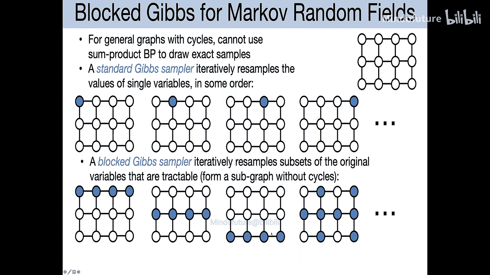

本节课中，我们一起深入探讨了吉布斯采样器这一重要的MCMC方法。我们学习了它的工作原理，分析了其在实际中遇到的样本相关性、初始化、慢混合等问题，并介绍了迹线图和自相关图等收敛性诊断工具。通过空间马尔可夫随机场的例子，我们看到了MCMC运行不充分可能带来的误导。我们还探讨了如何将吉布斯采样器应用于贝叶斯参数学习，例如在混合模型中，通过交替采样隐变量和模型参数来从后验分布中获取样本。最后，我们介绍了块吉布斯采样的概念，它通过联合采样一组变量来显著加速马尔可夫链的混合过程，是提高MCMC效率的重要策略。理解这些内容和挑战，对于在实践中有效应用MCMC方法至关重要。