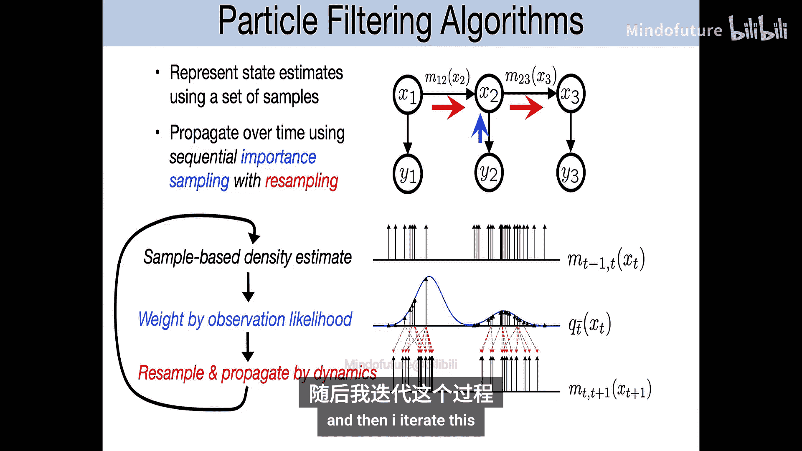
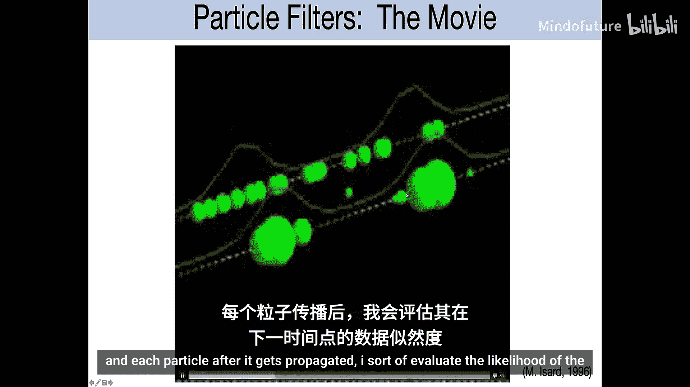
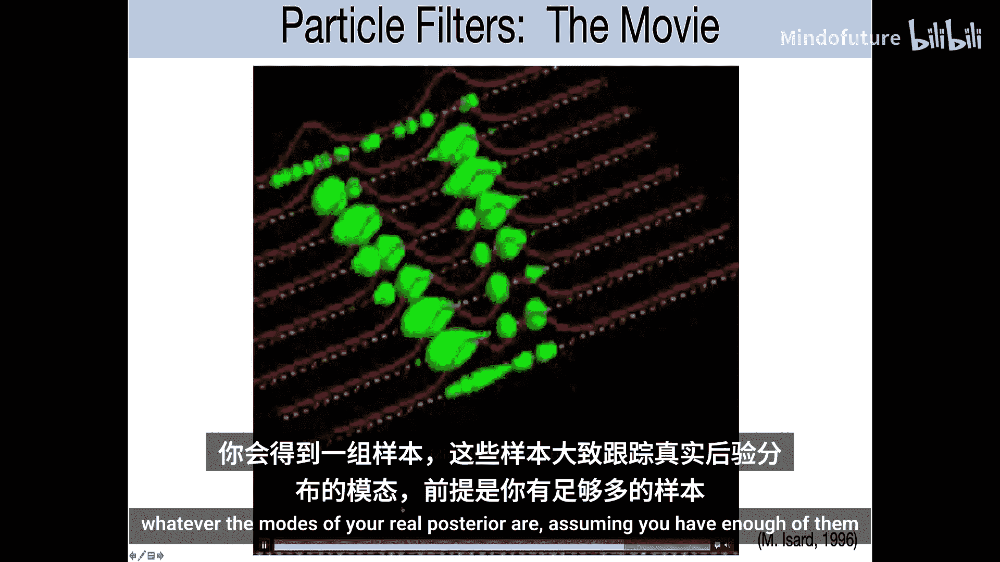
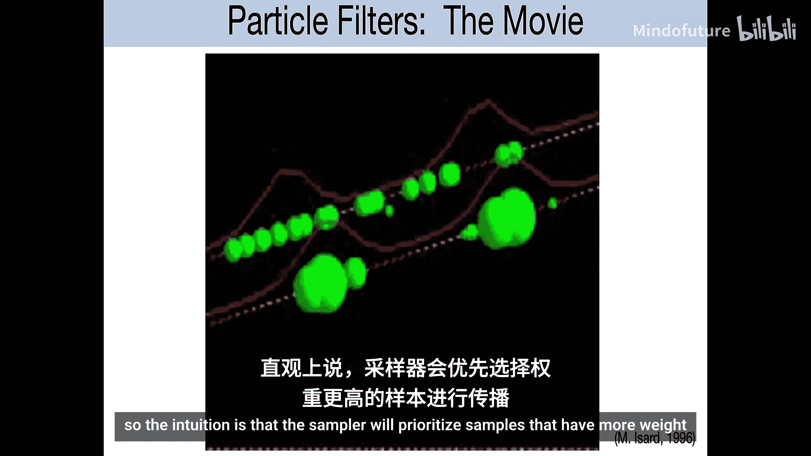
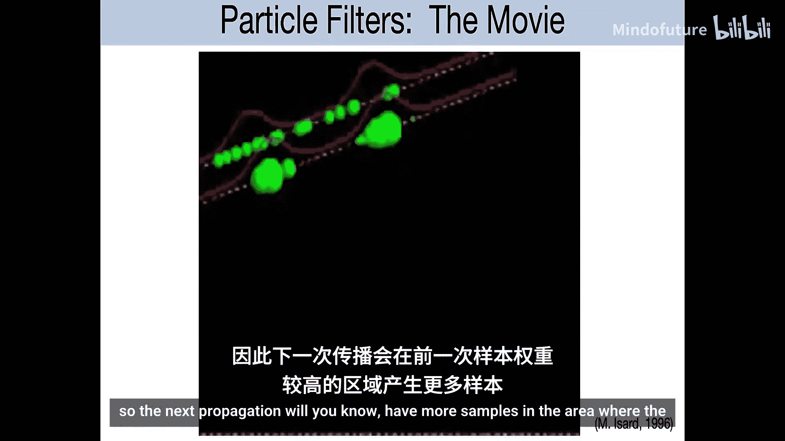
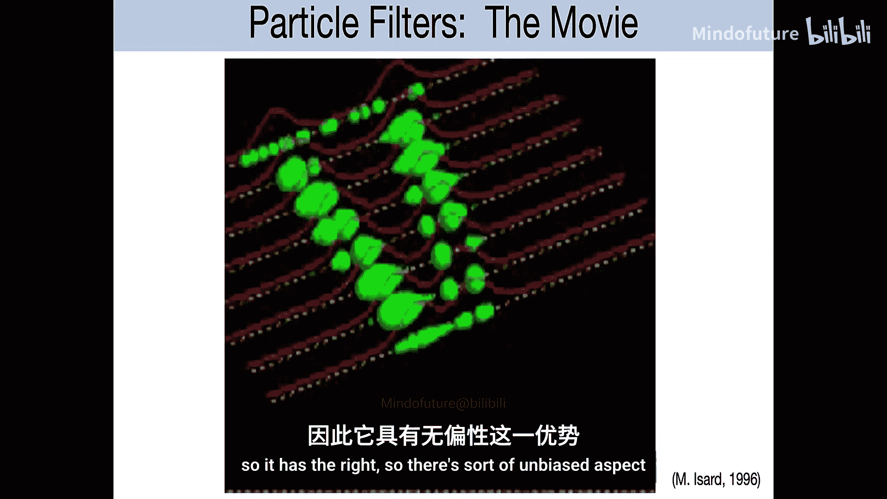

# 014：卡尔曼滤波与粒子滤波

在本节课中，我们将学习如何处理包含连续变量的模型。我们将从变量为高斯分布、可以进行闭式求解的模型开始，包括著名的卡尔曼滤波。接着，我们将探讨更复杂的非高斯模型，其中需要借助蒙特卡洛方法进行近似，这将引出一个称为粒子滤波的方法。

## 高斯变量与线性高斯模型

上一节我们提到了连续变量推断的挑战。本节中，我们来看看当变量服从高斯分布时，我们可以利用其良好的数学性质进行闭式求解。

首先，我们回顾一些关于高斯变量的基本概念。如果 **x** 是一个 D 维的随机向量，其协方差矩阵 **Σ** 是一个 D×D 的矩阵，其中第 (i, j) 项是变量 i 和变量 j 之间的协方差。该矩阵总是半正定的。

多元高斯分布是单变量高斯分布向多维的推广。它由均值向量 **μ** 和协方差矩阵 **Σ** 参数化。协方差矩阵的非对角线项建模了不同维度之间的相关性。

一个经典的线性高斯模型是线性回归的生成式模型。它假设存在一个未知的潜在变量 **z**，服从先验分布 **z ~ N(μ_z, Σ_z)**。观测值 **x** 是 **z** 的线性函数加上高斯噪声：**x ~ N(Az + b, Ψ)**。在这个模型中，**x** 的边缘分布和 **z** 的后验分布 **P(z|x)** 也都是高斯分布，其均值和协方差可以通过公式计算。

*   **后验协方差公式**：**Σ_{z|x} = (Σ_z^{-1} + A^T Ψ^{-1} A)^{-1}**
*   **后验均值公式**：**μ_{z|x} = Σ_{z|x} (Σ_z^{-1} μ_z + A^T Ψ^{-1} (x - b))**

直观上，后验协方差的逆（精度矩阵）是先验精度与观测精度之和，意味着获得观测数据后不确定性会降低。后验均值是先验均值和观测数据的加权组合。

## 从降维到时序模型

上一节我们介绍了用于静态数据的线性高斯模型。本节中，我们来看看如何将这些思想扩展到具有时序或序列结构的数据上。

主成分分析（PCA）和因子分析是经典的降维方法，其背后正是上述线性高斯生成模型。它们假设高维数据 **x** 由一个低维潜在变量 **z** 通过线性变换加噪声生成：**x = Wz + μ + ε**。

如果我们希望为具有时序依赖性的数据做类似的降维，就需要引入状态空间模型，特别是线性高斯状态空间模型。其图模型与隐马尔可夫模型（HMM）相同，但状态变量 **z_t** 是连续的。

*   **状态转移方程**：**z_{t+1} = A z_t + w_t**, 其中 **w_t ~ N(0, Q)**
*   **观测方程**：**x_t = C z_t + v_t**, 其中 **v_t ~ N(0, R)**

由于所有变量都是高斯的线性函数加高斯噪声，整个序列的联合分布是一个巨大的多元高斯分布。因此，给定任何观测序列，状态的后验分布也一定是高斯的。我们的目标就是高效地计算这些后验分布的均值和协方差。

## 卡尔曼滤波：线性高斯时序推断

面对时序模型，直接计算大规模协方差矩阵的逆运算量巨大。我们需要高效的递归算法，这就是卡尔曼滤波。

卡尔曼滤波是一种在线算法，用于递归地计算当前状态 **z_t** 给定截至当前所有观测 **x_{1:t}** 的后验分布 **P(z_t | x_{1:t})**。它分为两个步骤：

**1. 预测步**
根据上一时刻的后验，预测当前时刻的先验分布。
*   **先验均值**：**μ_{t|t-1} = A μ_{t-1|t-1}**
*   **先验协方差**：**Σ_{t|t-1} = A Σ_{t-1|t-1} A^T + Q**

**2. 更新步**
结合当前时刻的新观测，更新先验分布，得到后验分布。
*   **卡尔曼增益**：**K_t = Σ_{t|t-1} C^T (C Σ_{t|t-1} C^T + R)^{-1}**
*   **后验均值**：**μ_{t|t} = μ_{t|t-1} + K_t (x_t - C μ_{t|t-1})**
*   **后验协方差**：**Σ_{t|t} = (I - K_t C) Σ_{t|t-1}**

卡尔曼增益 **K** 决定了新观测值对状态估计的修正程度。该算法计算复杂度与状态维度的立方成正比，但随时间线性增长，因此被广泛应用于导航、控制等领域。

除了在线滤波，还有**平滑**问题，即计算状态给定全部过去和未来观测的后验 **P(z_t | x_{1:T})**。这可以通过前向（卡尔曼滤波）和后向的信息传递相结合来实现，其思想与离散变量模型中的和积算法一致。

## 非线性非高斯模型的挑战

上一节我们学习了处理线性高斯模型的精确方法。然而，现实中的模型往往包含非线性动力学或非高斯噪声。

例如：
*   **状态转移**：**z_{t+1} = f(z_t) + w_t**
*   **观测方程**：**x_t = h(z_t) + v_t**
其中 **f(·)** 和 **h(·)** 是非线性函数，噪声分布也可能非高斯。

在这种情况下，后验分布不再是高斯分布，卡尔曼滤波的闭式更新公式不再适用。我们需要新的近似推断方法。

## 粒子滤波：序贯蒙特卡洛方法

为了解决非线性非高斯模型的推断问题，我们引入粒子滤波，也称为序贯蒙特卡洛方法。

其核心思想是用一组带权重的样本（称为“粒子”）来近似表示后验分布，而不是用解析形式（如均值和方差）。每个粒子代表状态空间中的一个可能取值。

基本的序贯重要性采样效率很低，因为在长序列中，采样整个轨迹的权重方差会极大。粒子滤波通过引入**重采样**步骤解决了这个问题。

以下是粒子滤波的一个迭代步骤：

1.  **重要性采样（传播）**：从上一时刻的粒子集 **{z_{t-1}^{(i)}}** 出发，根据状态转移模型 **P(z_t | z_{t-1})** 采样得到新的粒子 **{z_t^{(i)}}**。
2.  **计算权重**：根据当前观测 **x_t**，计算每个新粒子的权重 **w_t^{(i)} ∝ P(x_t | z_t^{(i)})**。权重反映了该粒子与当前观测的匹配程度。
3.  **重采样**：根据权重 **{w_t^{(i)}}** 对粒子集进行重采样。高权重的粒子更可能被多次选中，低权重的粒子更可能被淘汰。这得到了一个新的、未加权的粒子集 **{z_t^{(j)}}**，它们近似表示当前的后验分布 **P(z_t | x_{1:t})**。

通过不断重复“预测-加权-重采样”的循环，粒子集能够动态地聚焦在状态空间的高概率区域，从而有效地跟踪状态。

以下是该过程的伪代码示意：
```python
# 初始化粒子
particles = sample_from_prior()
for t in range(1, T+1):
    # 1. 预测：根据动力学传播粒子
    predicted_particles = [dynamics_model.sample(p) for p in particles]
    # 2. 更新：根据观测计算权重
    weights = [observation_likelihood(x_t, p) for p in predicted_particles]
    weights = normalize(weights)
    # 3. 重采样
    indices = resample(weights)
    particles = [predicted_particles[i] for i in indices]
    # 此时，particles 近似表示 P(z_t | x_{1:t})
```

## 总结



本节课中我们一起学习了针对连续变量状态空间模型的两种核心推断方法。









我们首先回顾了高斯分布的性质以及线性高斯模型，并从中推导出了经典的**卡尔曼滤波**算法。该算法通过预测和更新两个步骤，能够在线、高效地计算线性高斯模型中状态的后验均值和协方差。

接着，我们探讨了当模型包含非线性或非高斯成分时面临的挑战。为此，我们引入了**粒子滤波**方法。该方法使用一组粒子来近似表示后验分布，通过序贯的重要性采样和重采样步骤，使粒子集能够聚焦于状态空间的高概率区域，从而处理更复杂的模型。



这两种方法构成了时序数据中状态估计的基础，在机器人学、导航、信号处理、金融等众多领域有着广泛的应用。