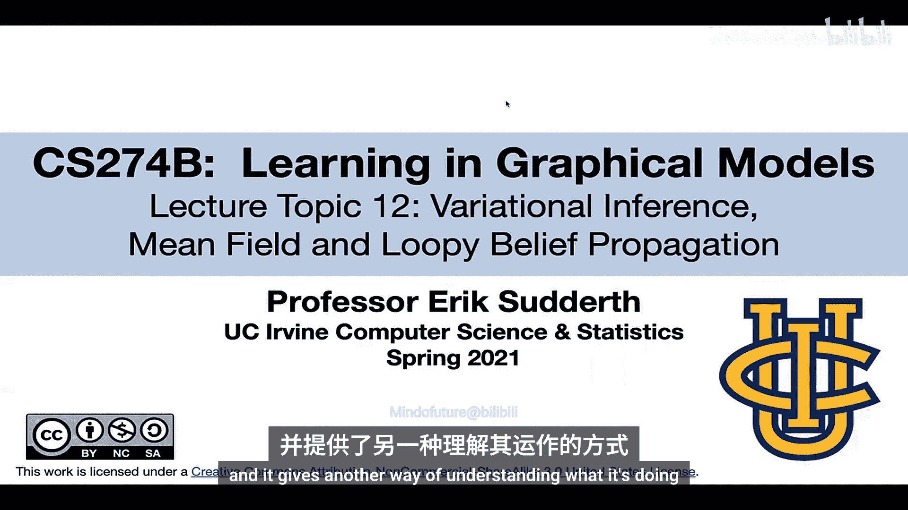
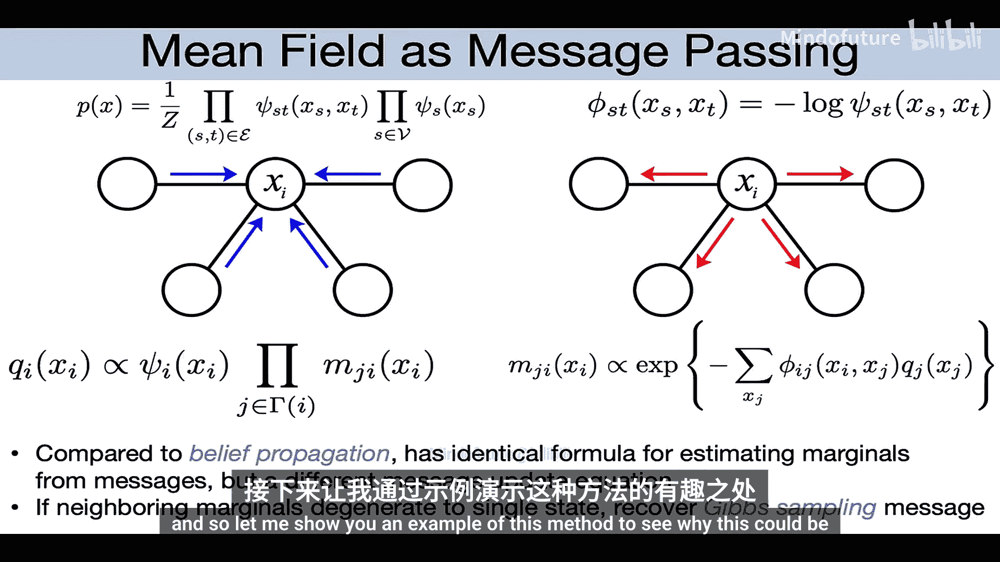
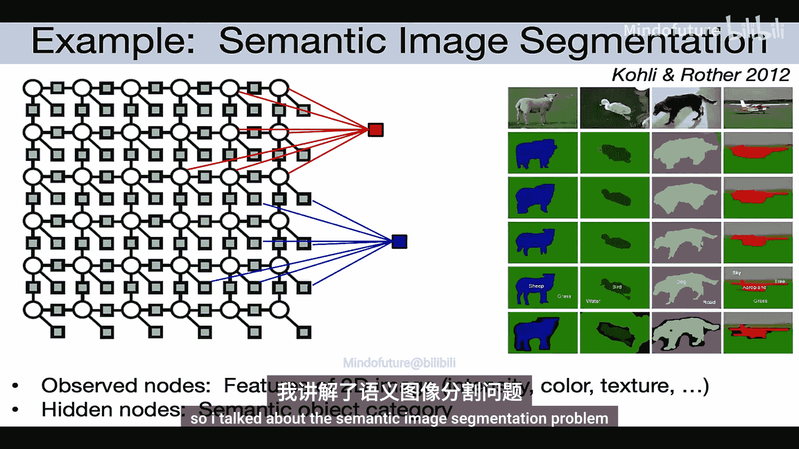
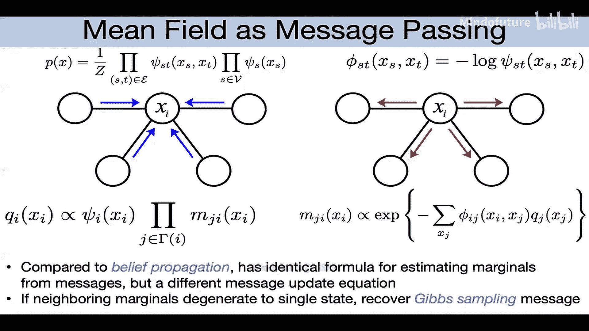
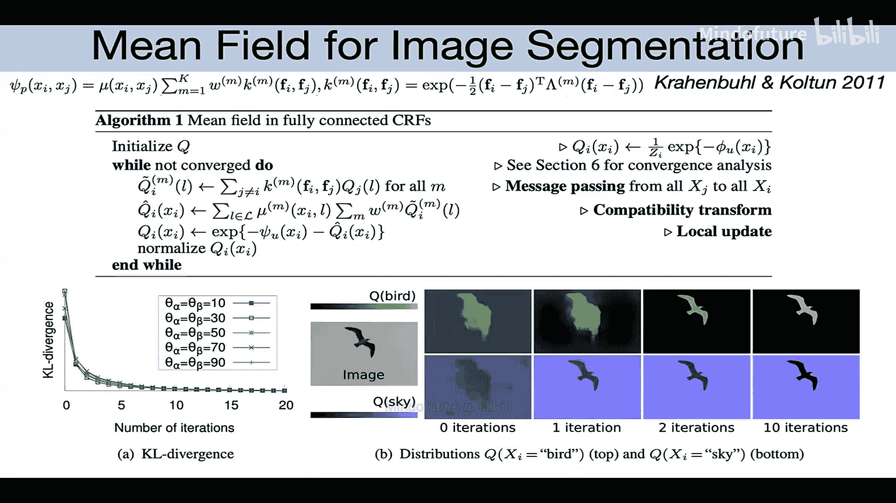
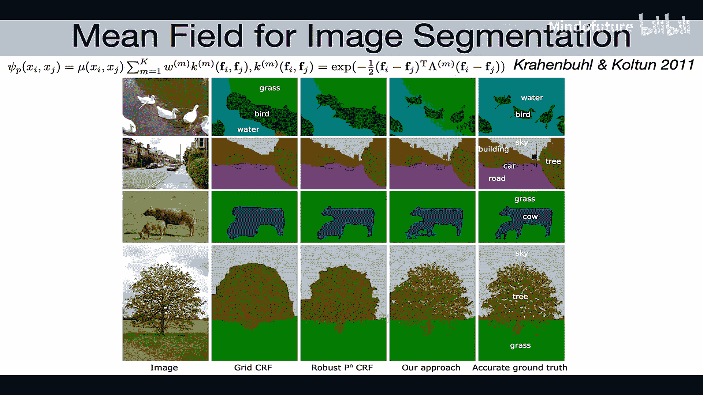
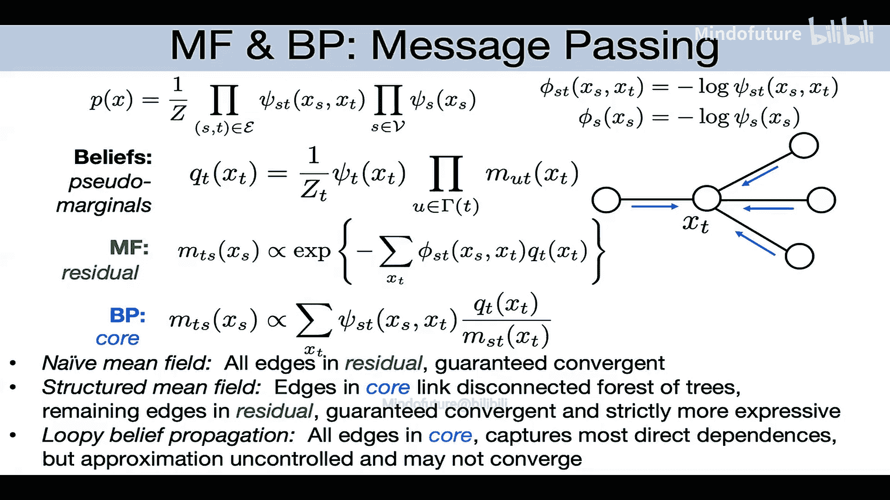

# 016：平均场变分方法 🧠

在本节课中，我们将从蒙特卡洛方法转向讨论另一类基于优化的近似推断方法，即变分推断方法。我们将首先聚焦于其中最广泛使用且易于理解的方法——平均场方法。

## 概述 📋

我们将从信息论的基本概念回顾开始，然后介绍变分推断的核心思想：通过在一个易于处理的分布族中寻找一个近似分布，来最小化其与真实后验分布之间的某种“距离”（通常是KL散度）。我们将详细推导朴素平均场方法，并通过一个图像分割的实际案例展示其强大性能。最后，我们将简要探讨如何超越朴素平均场，引入结构化平均场方法。

## 信息论概念回顾 🔄

上一节我们提到了变分推断，本节我们首先回顾几个关键的信息论概念，它们是理解后续推导的基础。

*   **熵**：衡量分布的不确定性。对于离散变量X的概率分布P(x)，其熵定义为：
    `H(P) = -∑_x P(x) log P(x)`
    确定性分布的熵为0；越接近均匀分布，熵值越高。

*   **KL散度**：衡量两个分布P和Q之间的差异。它不是对称的，且总是非负，当且仅当P=Q时为零。
    `D_KL(P || Q) = ∑_x P(x) log (P(x) / Q(x))`

*   **互信息**：KL散度的一个特例，衡量两个变量之间的依赖性，是联合分布与边缘分布乘积之间的KL散度。当变量独立时，互信息为零。

## 变分推断的核心思想 💡

我们已经回顾了信息论的基础，现在来看看变分推断的通用框架。其核心思想是选择一个易于处理的近似分布族Q，然后优化Q使其尽可能接近真实的后验分布P。

以下是变分推断的一般步骤：

1.  **选择近似分布族Q**：这个族应该易于计算。一个最简单的例子是假设所有变量相互独立的**完全因子化**分布。
2.  **定义距离度量**：需要一个具体的指标来衡量P和Q的差异。通常使用**KL散度**，虽然它不对称，但能导出简洁的算法。
3.  **优化以最小化距离**：将Q参数化，然后调整参数，使选定的KL散度最小化。

关于为何使用KL散度，一个直观的解释来自信息论和压缩领域：如果我们用近似分布Q而非真实分布P来编码数据，所浪费的平均比特数正好是`D_KL(P || Q)`。因此，最小化这个散度意味着减少因使用错误模型而造成的效率损失。

## 两种KL散度方向 🔀

上一节我们介绍了变分推断的通用框架，本节中我们来看看KL散度方向选择带来的不同路径。

如果我们假设Q是一个完全因子化的分布，并尝试最小化 `D_KL(P || Q)`，经过代数推导，可以将其分解为几项。其中关键的一项是各变量真实边缘分布与近似边缘分布之间的KL散度之和。显然，最优解是令Q的每个边缘分布都精确匹配P的真实边缘分布。

然而，这并没有提供计算这些真实边缘分布的有效算法，因此这条路径对于构建实用算法来说是条“死胡同”。

## 平均场方法与证据下界 🎯

既然最小化 `D_KL(P || Q)` 不直接导向算法，我们转向另一个方向：最小化 `D_KL(Q || P)`。这就是**平均场方法**。

这种选择有很好的动机。考虑我们通常关心的场景：在有观测数据y的情况下，近似隐藏变量x的后验分布 `P(x|y)`。我们关心数据的边际似然 `P(y)`。利用琴生不等式，我们可以为对数似然建立一个**证据下界**：
`log P(y) ≥ E_{Q(x)}[log P(x, y)] - E_{Q(x)}[log Q(x)]`
这个下界的右边恰好等于 `-D_KL(Q || P) + log P(y)`。因此，**最小化 `D_KL(Q || P)` 等价于最大化对数边际似然的这个下界**。即使Q不能完全匹配P，我们也能得到一个可计算的下界。

## 能量与自由能 ⚡

为了深入理解平均场，我们引入统计物理中的概念。可以将概率分布写为：
`P(x) = (1/Z) exp(-E(x))`
其中 `E(x)` 称为**能量**，`Z` 是归一化常数（配分函数）。能量越高，状态概率越低。

现在，KL散度 `D_KL(Q || P)` 可以展开为：
`D_KL(Q || P) = E_{Q(x)}[E(x)] - H(Q) + log Z`
其中 `H(Q)` 是Q的熵。我们定义：
*   **平均能量**：`E_{Q(x)}[E(x)]`
*   **（负）熵**：`-H(Q)`
*   **自由能**：`平均能量 - 熵 = E_{Q(x)}[E(x)] - H(Q)`

由于 `log Z` 是常数，**最小化 `D_KL(Q || P)` 等价于最小化自由能**。最小化平均能量本身会得到一个集中在最低能量状态（MAP估计）的确定性分布；最大化熵会得到一个均匀分布。而最小化自由能（即平均能量减去熵）则能平衡两者，最终恢复出我们关心的真实分布P。如果Q是一个受限的、易于处理的分布族，那么优化得到的Q就能给出真实边缘分布的近似。

## 朴素平均场算法推导 🧮

有了自由能最小化的目标，我们现在为具体的模型推导算法。我们假设真实分布P是一个**成对马尔可夫随机场**，所有变量是离散的。我们选择**完全因子化**的分布作为近似族Q，这种方法称为**朴素平均场**。

我们用参数 `μ_{s,k}` 表示在分布Q中，变量 `x_s` 取值为 `k` 的概率。我们需要在约束（每个节点的概率和为1）下，最小化自由能 `F(μ) = 平均能量 - 熵`。

*   **熵项**：由于变量独立，联合熵等于各变量熵之和。
    `H(Q) = -∑_s ∑_k μ_{s,k} log μ_{s,k}`
*   **平均能量项**：由于P是成对MRF，其能量是节点和边上的势函数（的负对数）之和。计算其在Q下的期望，利用了Q的因子化性质。
    `E_{Q}[E(x)] = ∑_s ∑_k μ_{s,k} * φ_s(k) + ∑_{(s,t)∈E} ∑_j ∑_k μ_{s,j} μ_{t,k} * φ_{st}(j, k)`

使用拉格朗日乘子法处理概率和为1的约束，然后对参数 `μ_{s,k}` 求导并令导数为零。经过推导（过程略），我们可以得到**坐标下降更新公式**。对于每个节点s，固定其邻居的当前估计 `μ_{t}`，更新其自身的分布：
`μ_{s,k} ∝ exp( -φ_s(k) - ∑_{t∈N(s)} ∑_{j} μ_{t,j} * φ_{st}(k, j) )`
然后进行归一化，使得 `∑_k μ_{s,k} = 1`。

这个公式非常直观：节点s取值为k的“概率”正比于其自身的“能量” `φ_s(k)` 加上其所有邻居的“平均能量”贡献（用邻居的当前边缘分布 `μ_{t}` 加权平均），然后取负指数。

## 平均场作为消息传递 📨

上一节我们得到了坐标更新公式，本节我们将其表述为一种消息传递算法，这有助于理解其与其它算法（如置信传播）的联系。

朴素平均场的更新可以写成类似置信传播的消息传递形式：
*   **置信（近似边缘）**：`b_s(k) = μ_{s,k} ∝ exp(-φ_s(k)) * ∏_{t∈N(s)} m_{t→s}(k)`
*   **消息更新**：`m_{t→s}(k) ∝ exp( -∑_j μ_{t,j} * φ_{st}(k, j) )`

与置信传播相比，消息计算方式不同：平均场是在**对数能量域** (`φ`) 进行加权平均，然后取指数；而置信传播是直接在**概率域**对势函数进行加权平均。此外，平均场的更新是**坐标下降**，每一步都保证自由能下降，因此算法**总是收敛**（可能到局部最优）。而置信传播在带环图上可能不收敛。

## 案例研究：语义图像分割 🖼️

理论需要实践检验。平均场方法在计算机视觉的语义图像分割任务中取得了巨大成功。

在一个前沿工作中，研究者使用了一个全连接的成对MRF模型（每对像素之间都有边）。在这种极度稠密的图上，精确推断是不可能的。吉布斯采样可以得到高质量的分割结果，但处理一张图像需要**36小时**。

应用朴素平均场变分推断后，得到了**视觉上非常相似**的高质量结果，而每张图像的处理时间仅需**0.2秒**，速度提升了数个数量级。尽管近似分布Q假设所有像素独立，但通过迭代的消息更新，模型有效地传播了全局上下文信息，纠正了仅基于局部特征分类的错误。

这个案例表明，即使是最简单的因子化假设，结合有效的优化，也能在复杂模型上实现强大而高效的近似推断。

## 超越朴素平均场：结构化平均场 🏗️

朴素平均场假设所有变量独立，这有时限制太大。我们可以通过**结构化平均场**来引入一些依赖关系。

其核心思想是：不再用完全因子化的Q，而是用一个**推断可处理的子图结构**（例如，一组不相交的树或链）来定义Q。我们将原始图的边分为两类：
1.  **核心边**：包含在子图结构中的边，在Q中精确建模其依赖关系。
2.  **残差边**：不在子图结构中的边，在Q中假设其端点变量独立（即用平均场方式处理）。

例如，在一个网格中，我们可以只保留垂直边作为核心边（形成一系列链），而将水平边作为残差边。

推导结构化平均场的自由能表达式会更复杂，因为它需要参数化树结构分布的联合概率并计算其熵（涉及互信息项）。最终，优化过程会导出一个**混合消息传递算法**：
*   对于**核心边**，使用**置信传播风格**的消息更新。
*   对于**残差边**，使用**平均场风格**的消息更新。

这种方法比朴素平均场更灵活，能给出更紧的证据下界和通常更准确的边缘估计，同时如果核心边构成一个森林，算法依然能保证收敛。

## 总结 🎓

本节课我们一起学习了变分推断，特别是平均场方法。

*   我们从信息论基础和变分推断的通用框架出发，理解了通过优化来近似复杂分布的核心思想。
*   我们深入探讨了**平均场方法**，它通过最小化 `D_KL(Q || P)` 来最大化证据下界，其目标函数可以解释为最小化**自由能**（平均能量 - 熵）。
*   我们为成对MRF模型推导了**朴素平均场**的具体算法，它是一种坐标下降法，也可以视为一种保证收敛的消息传递算法。
*   通过**语义图像分割**的案例，我们看到了平均场方法如何将处理全连接图的时间从数十小时缩短到零点几秒，展示了其强大的实用价值。
*   最后，我们简要介绍了**结构化平均场**，它通过在图的一部分保留精确结构来提升近似能力，其算法是平均场与置信传播更新的混合体。

变分推断为我们提供了一类强大、灵活且通常高效的确定性近似推断工具，是处理复杂概率模型中不可解推断问题的重要武器。