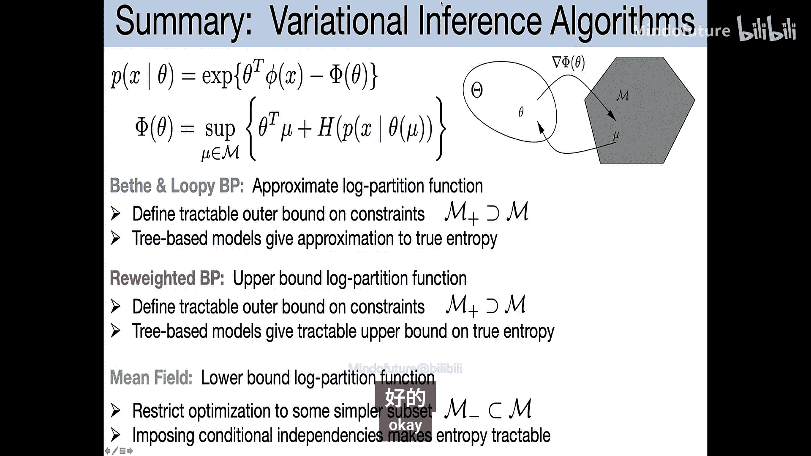
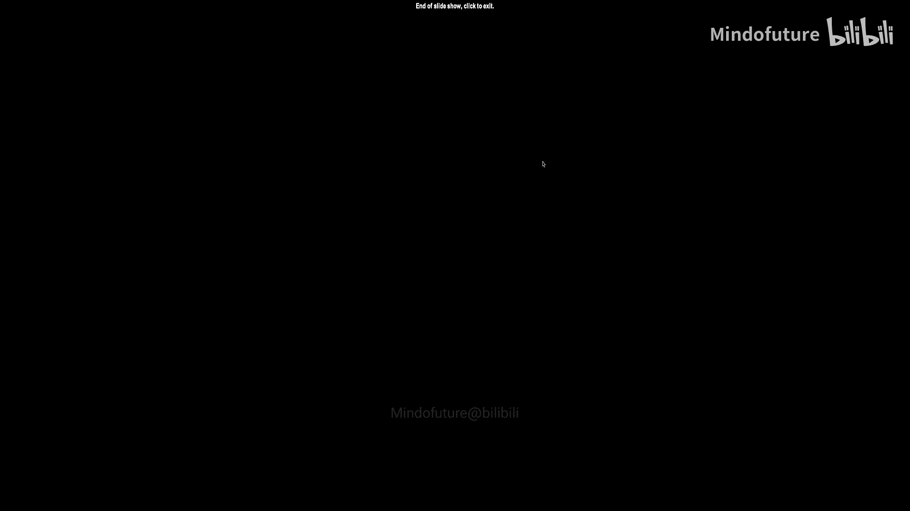
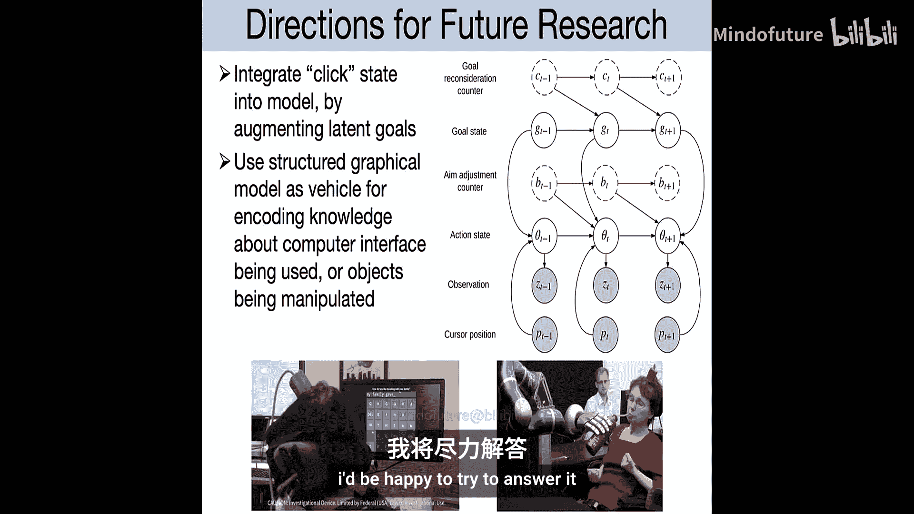

# 017：贝特变分方法与循环信念传播

在本节课中，我们将学习循环信念传播的理论基础，了解其与变分推断的联系，并探讨其在脑机接口中的一个具体应用。

## 理论部分：变分推断与信念传播的几何视角

上一节我们介绍了变分推断的基本思想。本节中，我们来看看如何从几何角度理解平均场和信念传播方法。

### 边际多面体与局部一致性

首先，我们从一个简单的二元变量模型开始。假设有两个二元变量 \(x_1\) 和 \(x_2\)，其联合分布可以用指数族模型表示：
\[
p(x) \propto \exp(\theta_1 x_1 + \theta_2 x_2 + \theta_{12} x_1 x_2)
\]
其中，\(\theta_1, \theta_2, \theta_{12}\) 是参数。这个模型定义了四个可能状态的概率。

我们可以用特征期望值 \(\mu_1 = \mathbb{E}[x_1]\)， \(\mu_2 = \mathbb{E}[x_2]\)， \(\mu_{12} = \mathbb{E}[x_1 x_2]\) 来描述这个分布。然而，这些期望值 \(\mu\) 不能独立指定，它们必须位于一个被称为**边际多面体**的凸区域内。这个区域由所有可能的联合分布产生的期望值向量构成。

更一般地，对于任何指数族模型，边际多面体 \(\mathcal{M}(G)\) 是所有可能的期望值向量 \(\mu\) 的集合，使得存在一个分布 \(p\)，其期望特征向量等于 \(\mu\)。这个多面体是凸的，但其顶点数量随变量数呈指数增长，直接处理非常困难。

### 平均场方法的几何特性

平均场方法通过假设变量间独立或依赖关系更简单（例如，移除原图中的一些边）来近似复杂分布。这等价于在指数族模型中强制某些参数（如边参数 \(\theta_{ij}\)）为零。

因此，平均场所能表示的分布集合是原边际多面体 \(\mathcal{M}(G)\) 的一个**非凸子集**。虽然它包含了所有顶点（即确定性分布），但由于其非凸性，优化平均场目标函数时可能会遇到**局部最优解**。

以下是一个简单的例子，展示了即使在两个变量的模型中，平均场目标函数也可能存在多个局部最优解：
*   考虑两个取值为 \(\{-1, +1\}\) 的变量，其分布为 \(p(x) \propto \exp(\theta x_1 x_2)\)。
*   平均场假设变量独立，即 \(q(x) = q_1(x_1)q_2(x_2)\)。
*   在此假设下，目标函数（变分下界）在参数空间（例如固定 \(\mu_1 = \mu_2\) 的切片上）可能呈现非凸形状，存在多个固定点。

这种非凸性意味着，在实际应用中运行平均场算法时，不同的初始化可能导致收敛到不同的（次优）解。一个实用的解决方法是尝试多种不同的初始化。

### 循环信念传播的几何近似

循环信念传播做出了不同的近似。它并不要求分布属于严格的边际多面体 \(\mathcal{M}(G)\)，而是放宽要求，只满足**局部一致性约束** \(\mathcal{L}(G)\)。

以下是局部一致性约束的定义：
*   对于每个节点和每条边，其边际分布是有效的概率分布（非负且和为1）。
*   对于每条边 \((s, t)\)，其联合边际分布 \(q_{st}(x_s, x_t)\) 在边缘化掉一个变量后，必须与对应节点的边际分布 \(q_s(x_s)\) 和 \(q_t(x_t)\) 一致。

显然，任何真实分布都必须满足这些约束，因此 \(\mathcal{M}(G) \subseteq \mathcal{L}(G)\)。对于树状图，两者相等；但对于带环的图，\(\mathcal{L}(G)\) 是一个更宽松的**凸**外近似。例如，三个变量构成环时，可以构造出满足所有两两局部一致性、但无法由任何三维联合分布产生的“边际”集合。

循环信念传播的第二个近似是关于熵的。它使用**贝特近似**来估计分布的熵：
\[
H_{Bethe}(q) = \sum_{s \in V} H(q_s) - \sum_{(s,t) \in E} I(q_{st})
\]
其中 \(H\) 是熵，\(I\) 是互信息。这个公式在树状图上精确成立，但在带环图上只是一个近似，有时甚至可能得出负熵（这是不可能的）。

尽管存在这些近似，对于稀疏图，循环信念传播通常能给出非常准确的边际估计，其性能往往优于容易陷入局部最优的平均场方法。

### 加权信念传播与凸上界

为了改进循环信念传播，我们可以寻求一个具有更好理论性质的近似。一个想法是使用**树状分布**的熵来构造原分布熵的**凸上界**。

具体做法如下：
1.  从原图中选择一棵生成树（即包含所有节点的树状子图）。
2.  考虑一个分布，其在该树上的边际与原分布相同。
3.  由于树状分布是在更少约束下最大熵的结果，其熵不小于原分布的熵。
4.  因此，任何树状分布的熵都是原分布熵的一个上界。

我们可以进一步考虑一个**生成树的分布**（即一组树及其对应的概率）。取这些树熵的加权平均，我们得到一个更紧的凸上界。这个上界对应的优化问题是凸的，具有唯一最优解。

令人惊讶的是，优化这个上界对应的算法，可以通过对标准信念传播算法进行微小修改得到，即**加权信念传播**或**分数信念传播**。其消息更新规则为：
\[
m_{t \to s}^{(new)}(x_s) \propto \sum_{x_t} \psi_{st}(x_s, x_t) \psi_t(x_t) \prod_{u \in \mathcal{N}(t) \setminus s} [m_{u \to t}(x_t)]^{\rho_{ut}}
\]
其中 \(\rho_{st}\) 是边 \((s,t)\) 在所选树分布中出现的期望频率（介于0和1之间）。

这种加权信念传播具有以下性质：
*   当所有权重 \(\rho_{st} = 1\) 时，它退化为标准循环信念传播。
*   当权重 \(\rho_{st} \to \infty\) 时，在极限下它等价于平均场方法。
*   当权重 \(\rho_{st}\) 取自某个树分布时，它优化一个凸上界，通常具有更好的收敛性和稳定性。

## 应用部分：脑机接口中的轨迹解码

现在，让我们转换视角，看一个循环信念传播在脑机接口中的具体应用。

### 背景与任务

脑机接口旨在让瘫痪患者通过思维控制外部设备，如电脑光标。系统通过植入运动皮层的电极阵列读取神经元活动，并实时解码用户的运动意图。

一个常见的实验任务是“中心-外目标”任务：屏幕上出现一个目标，用户需要控制光标移动到目标上并停留片刻。这模拟了使用光标进行点击的基本操作。

### 传统方法：卡尔曼滤波器

长期以来，state-of-the-art的解码器是卡尔曼滤波器。其模型如下：
*   **状态**：用户期望的运动方向，表示为一个二维向量 \(d_t\)。
*   **动力学模型**：假设运动方向随机游走，\(d_{t+1} = d_t + \epsilon_t\)。
*   **观测模型**：假设第 \(i\) 个电极的神经活动（如放电功率）\(z_t^i\) 服从高斯分布，其均值是状态 \(d_t\) 的线性函数。

卡尔曼滤波器利用该线性高斯模型进行高效的递归状态估计。其观测模型的线性假设源于神经科学的发现：许多运动皮层神经元具有“方向调谐”特性，即其平均放电率随运动方向近似呈余弦变化。

### 改进模型：多尺度半马尔可夫模型

传统卡尔曼滤波器模型存在局限：
1.  **观测非线性**：神经活动与运动方向的关系可能比简单的余弦函数更复杂。
2.  **目标信息缺失**：用户意图是到达目标，而不仅仅是当前运动方向。由于解码噪声，光标路径会弯曲，导致所需运动方向不断变化。如果能直接推断目标，可能获得更平滑、鲁棒的控制。

因此，我们提出了一个更丰富的**多尺度半马尔可夫模型**：
*   **状态变量**：
    *   \(G_t\)：离散化的目标位置（屏幕上的一个网格点），变化缓慢。
    *   \(\theta_t\)：当前光标指向目标所需的角度，变化较快。
    *   \(P_t\)：光标当前位置（已知）。
    *   \(C_t, B_t\)：计数器，用于模拟在目标和角度状态停留的非几何分布时长（半马尔可夫特性）。
*   **依赖关系**：
    *   给定目标 \(G_t\) 和光标位置 \(P_t\)，可以计算理想角度。
    *   实际运动意图角度 \(\theta_t\) 围绕该理想角度波动（用冯·米塞斯分布建模）。
    *   神经观测 \(Z_t\) 依赖于角度 \(\theta_t\)（可能通过更灵活的非线性基函数建模）。

该模型通过图结构明确表示了目标、角度和观测之间的多尺度时间关系。

### 推理算法：博伊斯-查普曼近似与循环信念传播

上述模型是一个复杂的动态贝叶斯网络。为了进行实时在线推理，我们采用了**博伊斯-查普曼近似**，这本质上是循环信念传播在时序模型上的一个特定应用。

推理步骤的核心思想是：
1.  在时间步 \(t\)，假设来自过去的信息关于目标 \(G\) 和角度 \(\theta\) 是近似独立的。
2.  将当前时间片 \(t\) 的所有变量（\(G_t, \theta_t, P_t, C_t, B_t, Z_t\)）视为一个静态贝叶斯网络。
3.  在这个静态网络上运行**联结树算法**（一种精确推理算法），计算当前时间片变量的边际分布。由于模型结构经过精心设计，这个计算可以高效完成。
4.  将计算出的边际信息向前传递到下一个时间步。

这个过程可以解释为在时间轴展开的模型上进行循环信念传播，其中消息在时间步内和时间步之间传递。对于这类动态模型，甚至可以理论分析这种近似误差的界限。

### 结果与优势

实验表明，与传统的卡尔曼滤波器相比，这种基于更丰富图模型和近似推理的方法能够：
*   产生更**平滑、更直接**的光标运动轨迹。
*   为用户提供更轻松、更直观的控制体验。
*   得益于图模型的模块化特性，易于扩展（例如，集成点击意图、语言模型等）。

## 总结

本节课中我们一起学习了：
1.  **变分推断的几何视角**：理解了边际多面体、局部一致性约束，以及平均场（非凸下界）和循环信念传播（基于凸外近似的近似）的几何特性。
2.  **加权信念传播**：作为一种改进，它通过树分布的凸组合提供熵的上界，从而得到一个具有唯一解且更稳定的凸优化问题，并通过修改消息权重来实现。
3.  **脑机接口应用**：看到了如何将图模型和近似推理（特别是循环信念传播的思想）应用于神经解码问题。通过构建一个包含目标、角度等多状态变量的动态图模型，并利用高效的在线近似推理，实现了比传统卡尔曼滤波器更优的光标控制性能。

这些内容展示了图模型理论如何指导算法设计，以及复杂的近似推理方法如何解决具有挑战性的实际问题。