# 018：贝叶斯非参数简介 🧠

在本节课中，我们将学习一个与图形模型交叉的高级主题——贝叶斯非参数方法。这些方法旨在解决许多包含隐变量的模型（如具有隐状态的马尔可夫模型、具有隐簇的混合模型或具有隐社区的关系模型）中的一个核心问题：如何选择隐变量的数量（例如，社区的数量）？我们将看到，贝叶斯非参数方法通过构建能够自动确定数据合适复杂度、并能随着数据量增长而优雅扩展的模型，来巧妙地解决这个问题。

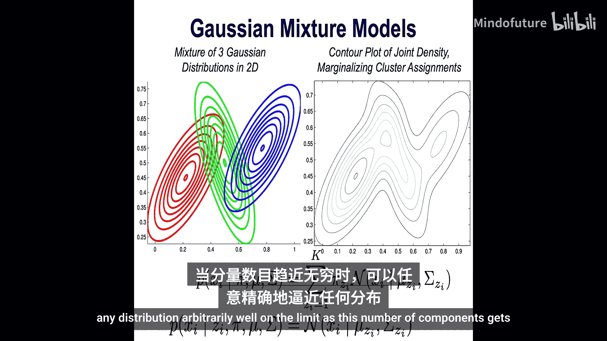

---

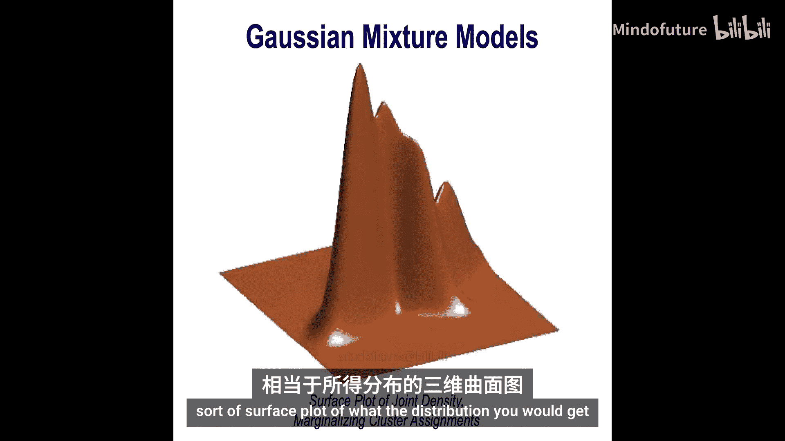

## 回顾：参数化混合模型 🔄

在深入贝叶斯非参数之前，我们先回顾一下已经学过的参数化模型，特别是有限混合模型，以建立清晰的符号体系。

想象我们想用高斯混合模型拟合数据。在经典的混合模型中，我们假设有 K 个已知且恒定的簇。每个簇 k 有其均值 μ_k 和协方差矩阵 Σ_k，以及出现的频率 π_k。给定这些参数，数据的边际似然是高斯分布的混合：

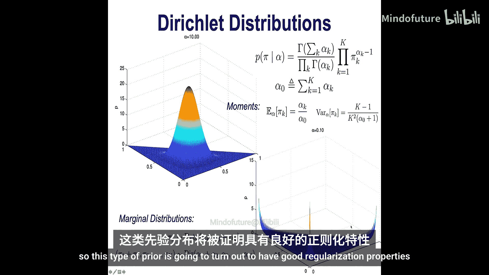

`p(x) = Σ_{k=1}^{K} π_k * N(x | μ_k, Σ_k)`

如果组件数量 K 足够大，理论上可以任意好地逼近任何分布。

有时我们不仅对估计密度感兴趣，还想进行聚类。在生成模型中，每个数据点都来自某个高斯分布。如果我们不知道真实的簇分配，就需要根据数据推断这些分配。根据贝叶斯规则，在已知模型参数的情况下，数据点 i 属于簇 k 的后验概率为：

`p(z_i = k | x_i, θ) ∝ π_k * N(x_i | μ_k, Σ_k)`

这只是一个简单的归一化过程。

---

## 正则化与狄利克雷先验 🛡️

当我们考虑簇数量 K 变得非常大甚至无限时，正则化变得至关重要。在贝叶斯非参数的世界里，正则化是通过设置先验分布来实现的，这些先验即使在世界存在大量潜在簇的情况下，也能控制其特性，防止过拟合并保证对新数据的良好泛化。

狄利克雷过程是有限狄利克雷分布的推广。狄利克雷分布是定义在单纯形（即和为1的非负向量）上的分布，常用作离散概率分布的贝叶斯先验。其概率密度函数为：

`p(π | α) ∝ Π_{k=1}^{K} π_k^{α_k - 1}`

其中 α_k 是分布的参数。我们可以将其参数化为一个均值向量，而 α 参数之和控制着方差。特别地，方差与这些概率之和成反比。

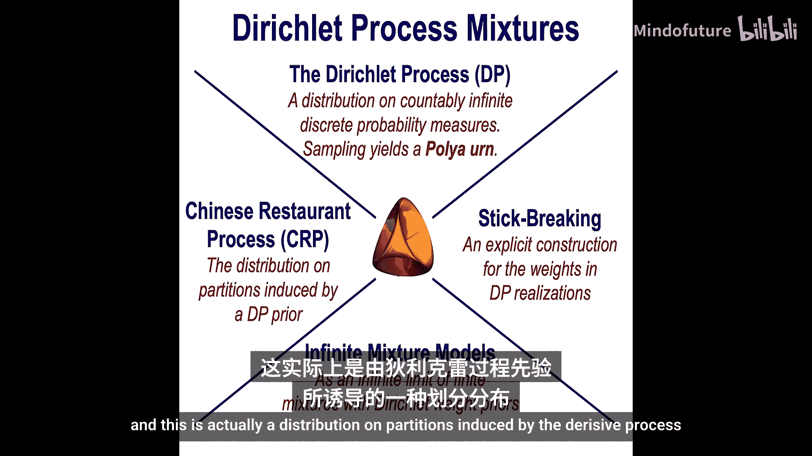

当所有 α_k 很小时（例如都小于1），狄利克雷分布会倾向于产生稀疏的向量，即大部分概率质量集中在少数几个分量上，而其他分量概率很低。这种“偏好稀疏性”的特性，在簇数量很大时是一个很好的先验，因为它鼓励模型认为除非数据强烈支持，否则只有少数簇是高概率的。

---

## 应用于有限混合模型 🧩

我们可以将对称狄利克雷先验应用于有限混合模型的混合权重 π。通常我们将其参数化为 `Dir(α/K, ..., α/K)`，其中 α 是一个总的质量参数，被均匀地分给 K 个分量。当 K 增大时，每个 α/K 会变小，从而得到一个偏好稀疏性的先验。

完整的生成式图形模型如下：
1.  从 `Dir(α/K, ..., α/K)` 中抽取混合权重 π。
2.  对于每个簇 k，从基分布 H（例如正态逆Wishart分布）中抽取其参数 θ_k。
3.  对于每个数据点 i：
    *   从分类分布 `Cat(π)` 中抽取簇分配 z_i。
    *   从分布 `F(θ_{z_i})`（例如高斯分布）中抽取观测值 x_i。

---

## 混合模型的另一种视角：离散测度 🎯

上一节我们回顾了标准的混合模型表示法。本节中，我们来看一种不同的、看似奇怪但能引向有趣方向的思考方式。

我们可以将混合模型表示为一个离散概率测度 G：

`G = Σ_{k=1}^{K} π_k * δ_{θ_k}`

其中 δ_{θ_k} 是在点 θ_k 处的点质量（或狄拉克δ函数）。这可以看作是一个在参数 θ 空间上的离散分布：每个“尖峰”的位置 θ_k 代表一个簇的参数，其高度 π_k 代表该簇的概率。

在这个视角下，生成模型变为：
1.  从先验分布中抽取这个离散测度 G（它依赖于超参数 α 和 H）。
2.  对于每个数据点 i：
    *   从 G 中抽取一个参数 θ̄_i。由于 G 是离散的，这等价于以概率 π_k 选中 θ_k 并复制它。
    *   从以 θ̄_i 为参数分布 `F(θ̄_i)` 中抽取观测值 x_i。

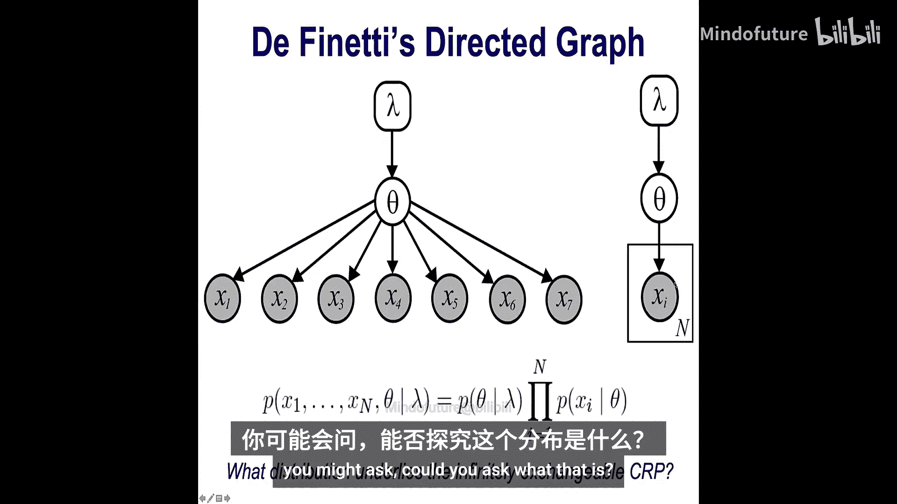

这种表示法虽然目前看起来多此一举，但稍后我们会看到它的妙用。

---

## 从分配到分区 🤝

混合模型诱导了数据点的一种分区（partition）。当我们从混合模型中抽样簇分配时，我们得到的是将 N 个数据点分配到 K 个标签的众多方式之一（共有 K^N 种）。然而，在聚类问题中，簇的标签是任意的、没有实际意义的。真正重要的是数据点如何被分组到一起，即分区。

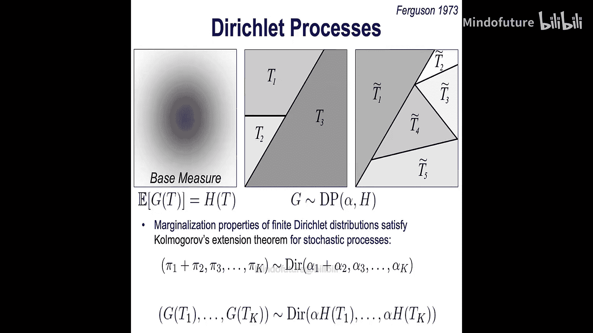

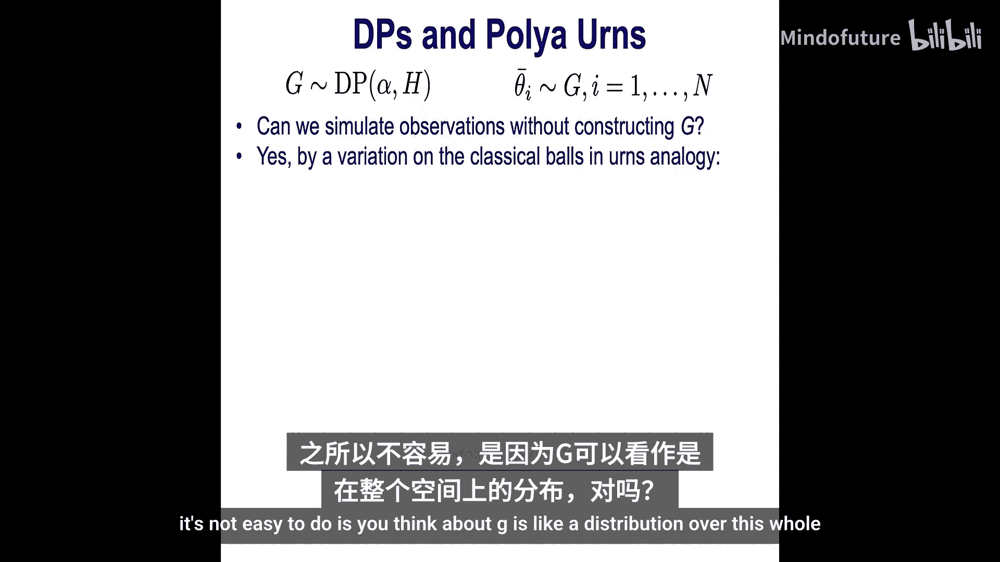

对于 N 个数据点，可能的分配方式数量远大于可能的分区方式数量。例如，3个点有5种分区方式，但若用3个标签来表示，则有27种分配方式。随着数据量增大，这种差异会急剧扩大。

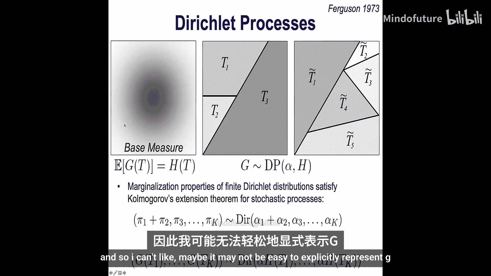

因此，一个高效的、对标签置换不变的模型应该直接对分区进行建模和推理，而不是对标签分配。这不仅能提升计算效率，也符合我们对隐变量模型的要求：先验和推理过程应对簇的重标记保持不变。

---

## 狄利克雷过程混合模型 ♾️

现在，我们引入核心的贝叶斯非参数模型——狄利克雷过程混合模型。它是有限混合模型在簇数量 K 趋于无穷时的极限，并保持了良好的数学性质。

狄利克雷过程 `DP(α, H)` 是一个随机概率测度 G 上的分布。它具有一个关键性质：对测度所在空间的任何有限划分，该随机测度赋予各划分块的概率向量服从一个有限维的狄利克雷分布。

狄利克雷过程混合模型的生成过程如下：
1.  从 `DP(α, H)` 中抽取随机测度 G。
2.  对于每个数据点 i：
    *   从 G 中抽取参数 θ̄_i。
    *   从 `F(θ̄_i)` 中抽取观测值 x_i。

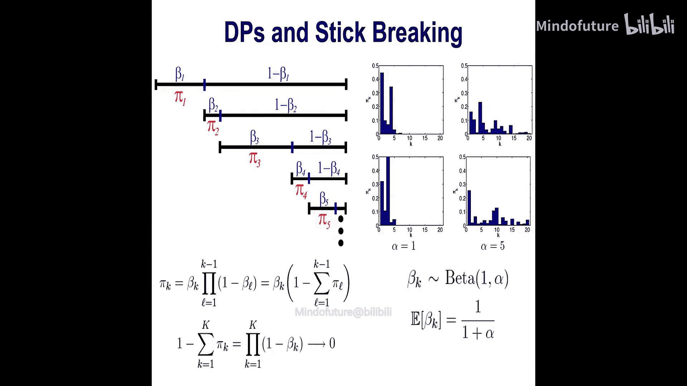

这等价于一个无限混合模型：`p(x) = Σ_{k=1}^{∞} π_k * F(x | θ_k)`，其中权重 {π_k} 和参数 {θ_k} 来自某个特定的先验过程。

---

## 狄利克雷过程的三种等价构造 🔨

狄利克雷过程可以通过三种等价但视角不同的方式来理解和构造，每种都揭示了其不同方面的特性。

### 1. 折棍构造 (Stick-Breaking Construction)
这是一种显式生成无限权重序列 {π_k} 的方法。想象一根长度为1的“棍子”，它代表总的概率质量。
*   第一步：从 `Beta(1, α)` 分布中抽取一个比例 V_1。折断棍子的前 V_1 部分作为 π_1。
*   第二步：对剩余的长度为 `1 - π_1` 的棍子，从 `Beta(1, α)` 中抽取比例 V_2。折断 `V_2 * (1 - π_1)` 作为 π_2。
*   重复此过程，得到 π_3, π_4, ...。
可以证明，这样得到的序列满足 Σ π_k = 1 (几乎必然)。这个过程产生的权重在平均意义上是递减的，这有利于计算。

### 2. 中国餐馆过程 (Chinese Restaurant Process, CRP)
这是一种直接生成数据点分区（或等价地，生成其隐变量分配序列 {z_i}）的方法，它边缘化了权重 π。想象一个有无穷多张桌子的餐馆，顾客（数据点）依次进入。
*   第一位顾客坐在一张新桌子。
*   第 (N+1) 位顾客：
    *   以概率 `n_k / (α + N)` 坐在已有 n_k 位顾客的第 k 张桌子。
    *   以概率 `α / (α + N)` 坐在一张全新的桌子。
这个过程产生的顾客座位分布（即分区）是**可交换的**——其概率不依赖于顾客进入的顺序。参数 α 控制着新桌子被创建的概率，α 越大，越容易形成新簇。

### 3. 波利亚瓮模型 (Pólya Urn Scheme)
这是一种从狄利克雷过程后验预测分布中抽样的方法。设想一个瓮，最初装有来自基分布 H 的“颜色”（即参数）。
*   抽取第一个样本：从瓮中取出一粒沙子，记下其颜色 θ_1，然后将其放回，并额外加入一粒相同颜色的沙子。
*   抽取第 (N+1) 个样本：瓮中现有 N 粒沙子（来自之前的抽取和添加）。以概率 `N / (α + N)` 从现有沙子中均匀抽取一粒，记下其颜色 θ_{N+1}，然后放回并添加一粒同色沙子。以概率 `α / (α + N)` 从基分布 H 中抽取一个新颜色 θ_{new}，记下它，并向瓮中加入一粒该颜色的沙子。
这个过程同样体现了“富者愈富”的特性，并等价于中国餐馆过程。

这三种视角是相互联系的：折棍构造生成了权重 π，基于 π 进行独立抽样得到分配 z，而边缘化 π 后 z 的分布就是中国餐馆过程。波利亚瓮则描述了在给定已有观测下，预测新观测的机制。

---

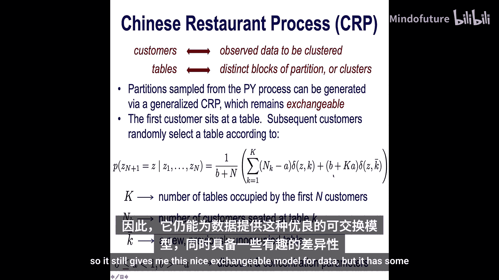

## 从理论到数据：模型的行为与扩展 📈

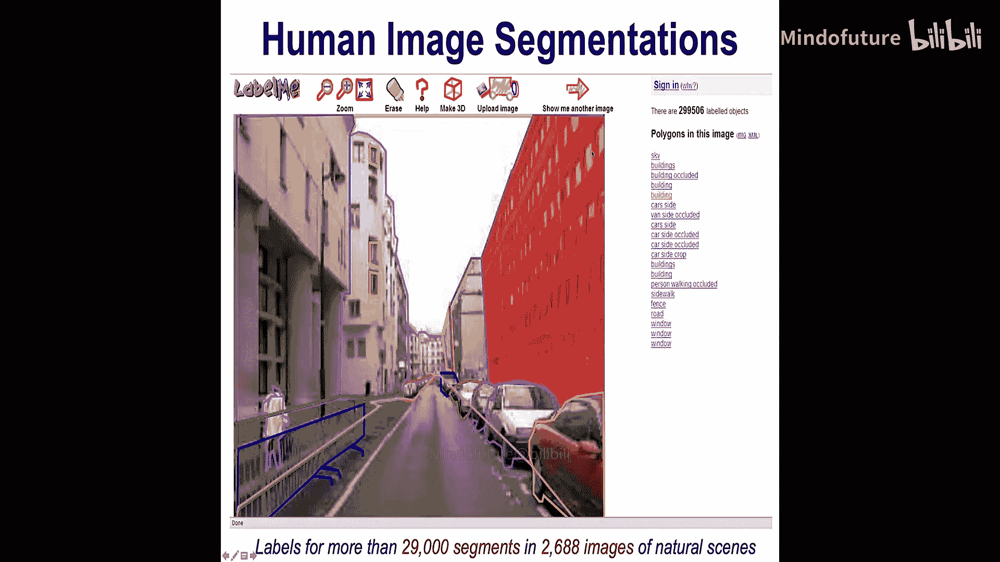

现在，让我们看看狄利克雷过程混合模型在实际数据生成中表现如何。当我们从这样的无限混合模型中抽样时，尽管理论上存在无限多个簇，但在有限的 N 个数据点中，我们只会观察到有限个簇。观察到的簇数量 K_N 是一个随机变量，其期望值随着 N 的增长而增长。对于狄利克雷过程，期望簇数量以 `O(α log N)` 的速度增长，这是一种对数级的缓慢增长。

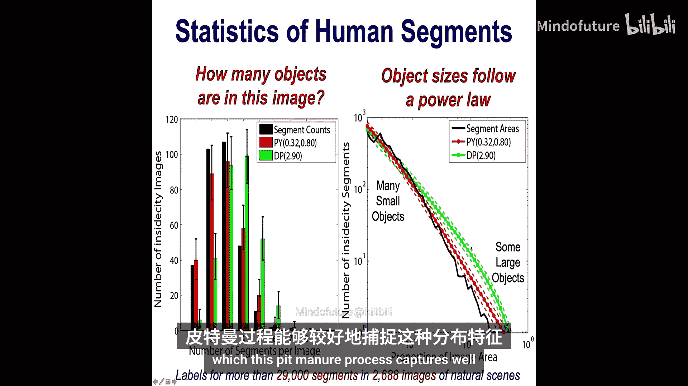

然而，在许多实际领域（如自然语言处理、计算机视觉、社交网络），我们观察到簇的规模分布往往遵循**幂律分布**（即存在许多小簇和少数大簇），且新簇的发现速度比对数增长更快。标准的狄利克雷过程（对应于折棍构造中 `Beta(1, α)`）无法很好地捕捉这种特性。

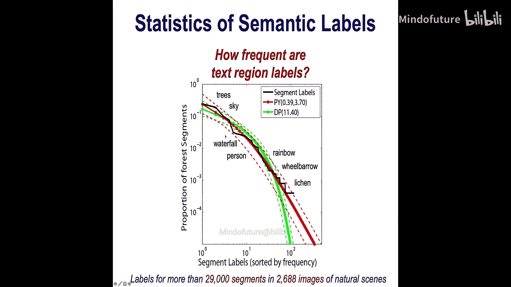

为了克服这一限制，我们可以使用**皮特曼-约尔过程**。它是狄利克雷过程的推广，在折棍构造中使用更一般的 `Beta(1-a, b + k*a)` 分布，其中 `0 ≤ a < 1`，`b > -a`。对应的中国餐馆过程规则变为：顾客以概率 `(n_k - a) / (b + N)` 加入已有桌子，以概率 `(b + K*a) / (b + N)` 开设新桌。

皮特曼-约尔过程能产生幂律性质：
*   期望簇数量以 `O(N^a)` 的多项式速度增长。
*   簇规模的衰减遵循幂律（齐普夫定律），而非指数衰减。
这使得它在对文本词汇、图像中物体类别、社交网络社区等具有重尾分布特性的数据进行建模时，表现出更符合经验的归纳偏差，从而成为许多应用（如语言模型平滑）的理论基础。

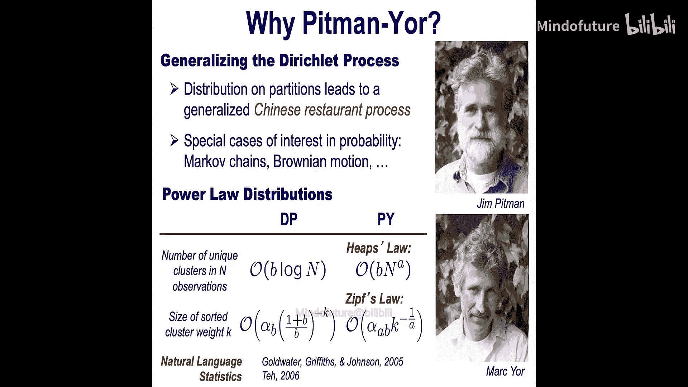

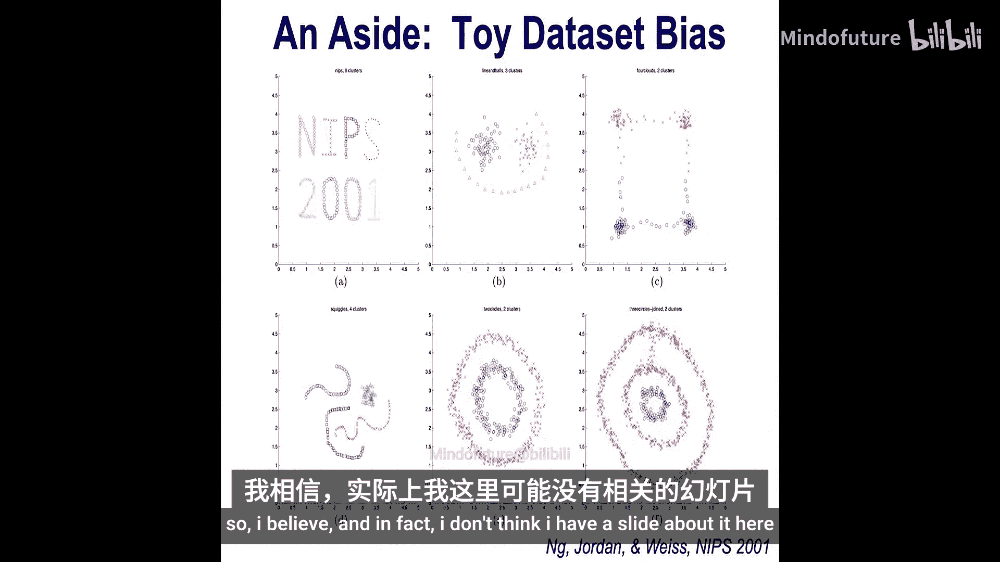

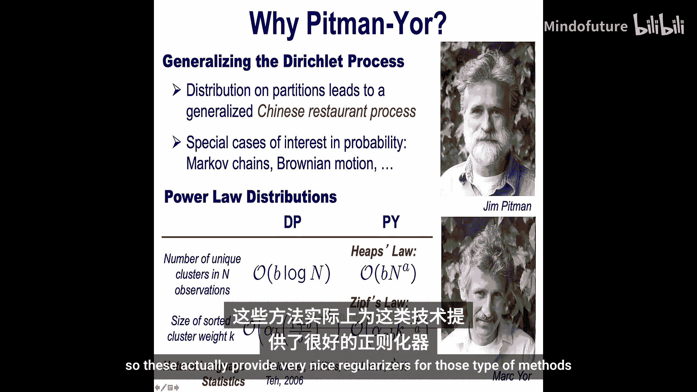

---

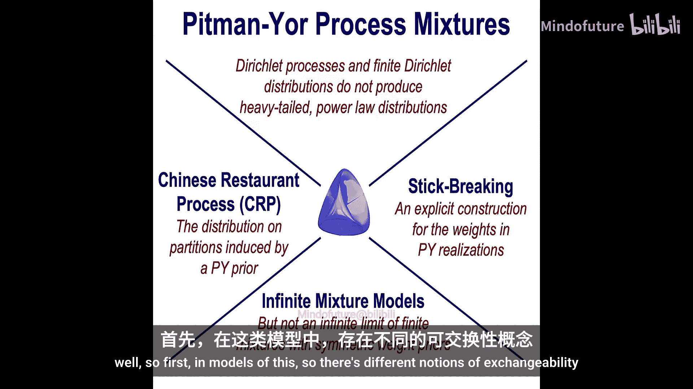

## 总结 🎓

本节课我们一起学习了贝叶斯非参数方法的核心思想，特别是狄利克雷过程及其混合模型。我们从回顾有限混合模型及其正则化需求开始，引入了狄利克雷先验。然后，我们探讨了混合模型的离散测度表示法，并指出了直接对数据分区建模的重要性。

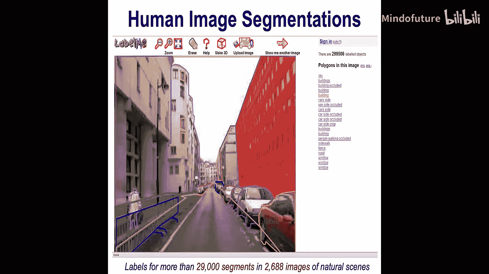

接着，我们深入介绍了狄利克雷过程混合模型，并阐述了理解它的三种等价视角：
1.  **折棍构造**：一种显式生成无限权重序列的实用方法。
2.  **中国餐馆过程**：一种直接生成可交换分区、便于推导推理算法的分布。
3.  **波利亚瓮模型**：一种描述后验预测分布的抽样方案。

最后，我们探讨了标准狄利克雷过程在捕捉现实世界幂律分布方面的局限性，并介绍了其扩展——皮特曼-约尔过程，该过程通过引入额外的参数，能够更好地建模具有重尾特性的数据。

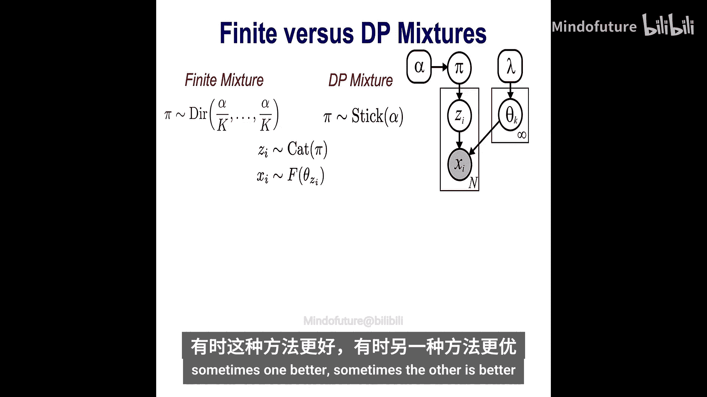

在下一讲中，我们将基于这些理论框架，探讨如何为狄利克雷过程混合模型和皮特曼-约尔过程混合模型设计有效的推断（如MCMC和变分方法）和学习算法，并将其应用于更复杂的模型。