# 019：随机和记忆变分推理

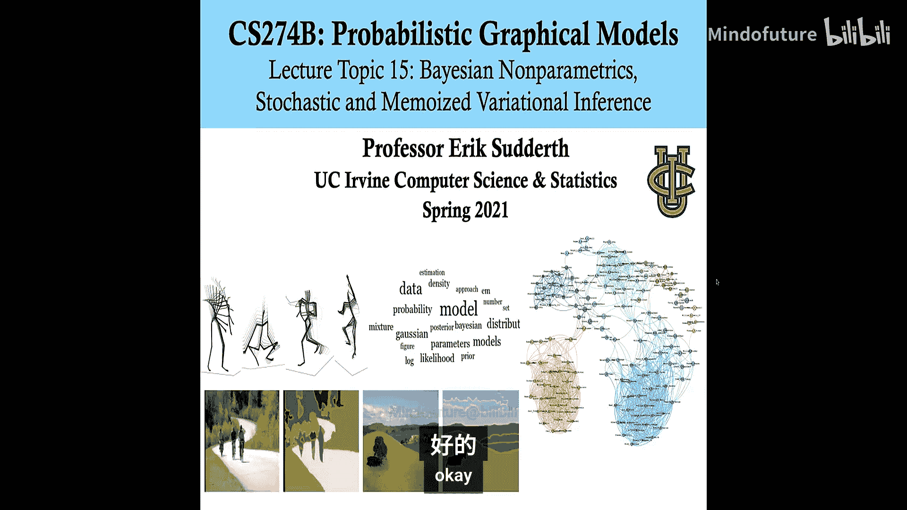

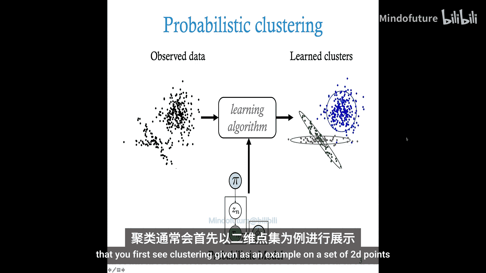

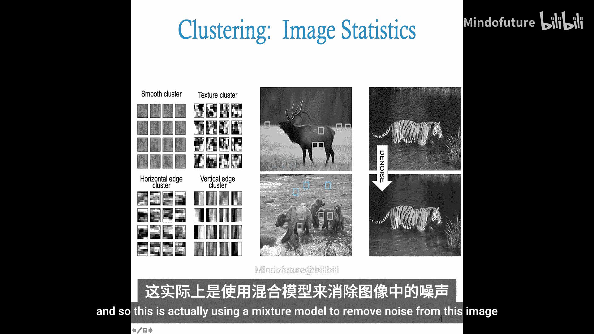

## 概述

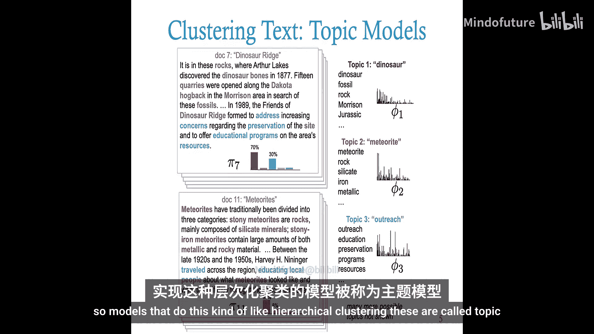

在本节课中，我们将继续探讨贝叶斯非参数建模的思想。上一讲侧重于理论层面，描述了这些分布的工作原理。今天，我们将从一个更高的视角，探讨这些思想如何与图形模型进行多种方式的结合，而不是深入某个具体应用的细节。我们将聚焦于变分推理方法，并借此机会讨论该领域一些更有趣的高级主题。

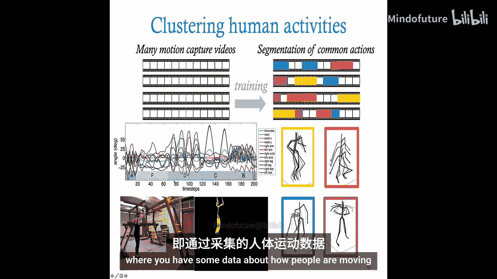

## 贝叶斯非参数模型的应用场景

上一节我们介绍了贝叶斯非参数模型的基本概念，本节中我们来看看它们在实际问题中的应用场景。这些非参数方法很多被用于更灵活的聚类任务。其核心思想是：给定数据和算法，目标是发现数据中的簇结构。然而，许多实际应用场景比最初在二维点集上看到的简单聚类示例要复杂得多。

以下是几个应用示例：

*   **自然图像块建模**：事实证明，如果为每个混合成分（如协方差矩阵）提供足够丰富的参数化，混合模型可以很好地建模自然图像小块的统计特性。你可以从数百万个图像块中学习一个混合模型，得到的簇可能包含平滑区域、纹理区域、不同类型的边缘等。这种模型可用于图像恢复，例如去除噪声或模糊。
*   **主题模型**：主题模型用于处理文本数据。与简单地将整个文档聚为一类不同，主题模型认为一个文档可能涉及多个主题。模型会尝试在文档内将谈论相同主题的词语分组，并在不同文档间匹配这些主题。
*   **时序数据建模**：隐马尔可夫模型这类时序模型也可以看作一种聚类。学习HMM后，可以将所有被分配到同一状态的时间点视为一个簇，这为具有时序动态的数据提供了一种聚类方式，例如用于分析人体运动数据以发现活动模式。
*   **关系数据聚类**：在社交网络或其他交互数据中，可以对人或实体进行聚类，以解释他们之间的交互，这被称为社区发现。这正是作业中看到的模型，而非参数方法可以帮助我们构建此类模型的更灵活版本。
*   **图像分割**：对于空间数据或图像，可以将来自世界中同一对象的像素位置分组在一起，这本质上也是一种考虑空间依赖性的聚类。

图形模型提供的灵活性，使我们能够通过调整图的其他部分，将这些非参数思想应用于多种不同形式的聚类任务。

## 模型选择与局部最优问题

在介绍了应用场景后，我们需要面对一个实践中的重大问题：只要模型包含训练数据中未观察到的隐变量，其学习和推理算法通常就容易陷入局部最优（除了少数特殊情况）。例如，在拟合高斯混合模型时，使用EM算法可能会因为初始化不同而收敛到次优解，例如错误地合并或分割了本应独立的簇。

我们希望推理算法是**可靠的**（这里指即使目标函数非凸，算法也能以高概率获得良好解）。此外，我们还需要考虑**可扩展性**。许多简单的MCMC方法（如吉布斯采样）按顺序更新变量，难以直接并行化。而我们将要讨论的变分推理的某些变体则可以支持并行化，这对于利用计算集群处理大规模数据集至关重要。

最后，我们将引入非参数思想，以实现**模型复杂度的自适应**。

## 从有限混合模型到非参数视角

首先，回顾一下混合模型的符号。设 `x` 为观测数据，`z` 为表示数据点来自哪个簇的离散隐变量，`π` 是各簇的概率向量（和为1），`φ` 是每个簇的参数（例如高斯分布的均值和协方差）。对于每个数据点，我们从 `π` 中选取一个簇，然后从该簇对应的分布中采样观测值。

指数族分布的一个优点是，我们可以将似然函数替换为任何指数族分布（如高斯分布、伯努利分布、多项分布等），而今天讨论的所有方法依然适用。

问题的关键在于**模型选择**：对于一个数据集，我们通常不知道正确的簇数量 `K`。如果我们尝试用不同 `K` 值的混合模型去拟合，可能会得到许多不同的局部最优解。在低维数据中，我们或许能通过目视选择，但在高维复杂数据中，我们需要更严谨的自动化方法。

贝叶斯非参数模型提供了一个视角：它假设世界中存在一个**无限**的潜在簇集合。这个假设是合理的，因为它认为随着我们收集更多数据，总会不断发现新的类别。虽然潜在簇的数量是无限的，但在一个有限的包含 `n` 个数据点的数据集中，我们观察到的不同簇的数量不会超过 `n`。推理过程会估计在给定数据下，我们实际“看到”了多少个不同的簇。这样，模型复杂度可以随着数据量的增加而自然增长。

## 狄利克雷过程与棒棒糖构造

为了实现无限混合，我们使用**狄利克雷过程**等先验，其构造可以通过**棒棒糖过程**来理解。想象一根长度为1的“概率棒”，我们依次随机折断一部分作为第一个簇的概率 `π1`，剩余部分继续折断得到 `π2`，依此类推。数学上，折断的比例 `V_k` 服从特定的贝塔分布。

狄利克雷过程先验下，数据中观测到的簇数量期望约为 `O(log n)`。还有其他先验如**皮特曼-约尔过程**，能产生簇数量按多项式增长（`O(n^σ)`，`0<σ<1`）的行为。不同先验适用于不同场景。

## 推理挑战与变分推断

现在，我们关注推理问题。在图形模型中，我们观测到数据 `x`，但不知道隐变量 `z`、簇概率 `π` 和簇参数 `φ`。

一种简单的方法是寻求所有未知量的**点估计**（如最大似然估计），这可以通过一种广义的K-means算法实现：初始化参数，然后交替地（1）为每个数据点分配最可能的簇（E步），（2）根据当前分配重新估计 `π` 和 `φ`（M步）。然而，这种方法存在严重问题：随着簇数量 `K` 增加，似然度总会单调上升（因为更多参数的模型总能拟合得更好），导致模型选择失败。即使引入 `π` 和 `φ` 的先验做最大后验估计，通常也不足以解决此问题。对于非参数模型，若进行点估计，似然度可能趋于无穷（例如将每个点都分到自己的簇）。

因此，我们需要更严格的方法来控制复杂度。解决方案是进行**贝叶斯推理**，计算所有未知量的后验分布 `p(z, π, φ | x)`。由于精确后验难以计算，我们需要近似方法。

## 平均场变分推断及其局限

我们可以应用**平均场变分推断**。最简单的平均场假设所有变量独立。对于无限混合模型，这带来一个难题：每个数据点的分配变量 `z_n` 是一个支持集为无限（可能来自簇1,2,3,...直至无穷）的分类分布，无法显式表示。

一种解决方案是**截断**：我们设定一个簇数量的上界 `K_max`，只考虑前 `K_max` 个簇，并将剩余的概率质量归入最后一个簇。截断并非选择确切的簇数量，而是设定一个上限，并有一些理论保证这种近似的质量。

经过截断，我们使用因子化的变分分布族 `q(z, π, φ)` 来近似真实后验，并最小化其与真实后验的KL散度 `KL(q||p)`。这等价于最大化数据边际似然 `p(x)` 的一个**证据下界**。这个下界具有模型选择的能力：当簇数量增加到超过数据真实结构所需时，下界反而可能下降。其直觉是：虽然一个具有许多重叠簇的复杂模型对数据的拟合似然可能略高，但从先验中采样出如此多簇恰好重叠在一起的概率是非常低的，因此其边际似然（综合考虑先验和似然）反而更低。

优化这个下界可以通过迭代更新变分参数来实现，类似于EM算法。然而，这种方法同样会陷入**局部最优**。不同的初始化可能导致不同的聚类结果，例如出现簇的不当合并或分裂。随着模型和数据规模增大，局部最优问题会更加严重。

## 改进策略：动态簇操作与随机优化

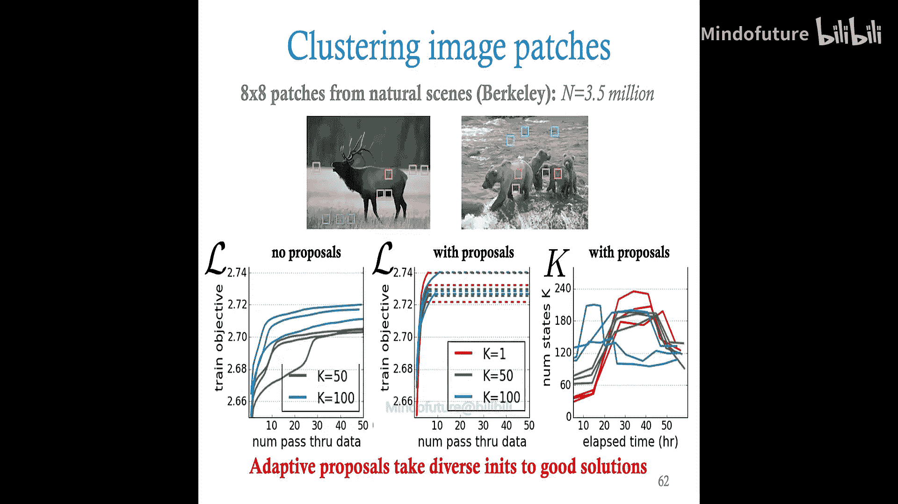

因此，我们需要更好的方法来自适应模型复杂度。一类方法的核心思想是：在算法运行过程中**动态地创建和删除簇**。算法可以从单个簇开始，然后根据需要在数据空间的不同部分分裂簇，或者合并看似冗余的簇。变分下界的模型选择能力可以指导这种“生灭过程”的决策。

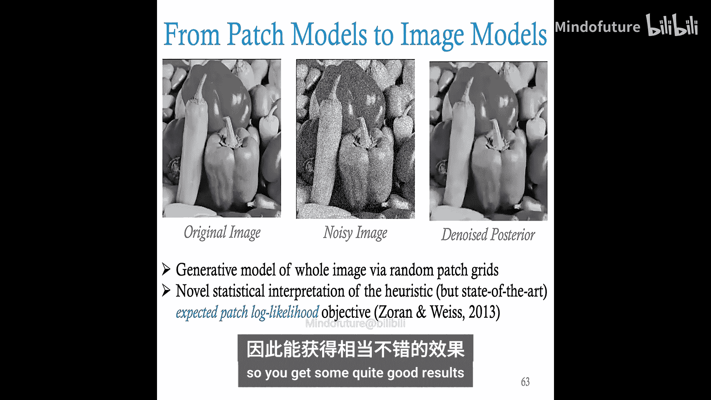

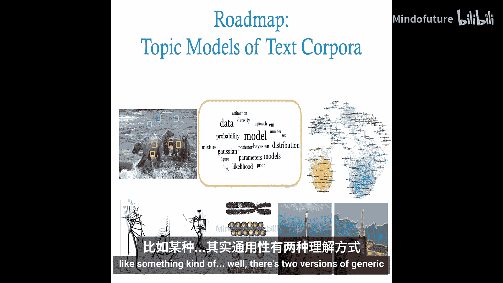

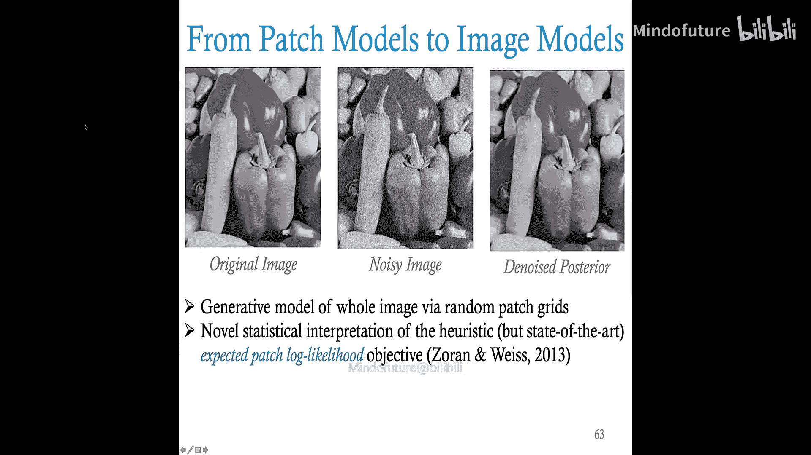

接下来，我们看看如何实现可扩展的优化。在大规模数据集上，每次迭代遍历所有数据点计算梯度或统计量代价很高。我们可以借鉴深度学习中的**随机优化**思想，将其应用于变分推断，即**随机变分推断**。其做法是：在每次迭代中，随机抽取一个数据子集（小批量），仅基于该子集计算变分更新，从而得到全局参数更新方向的一个无偏但带噪声的估计。通过适当降低学习率，算法可以收敛到全数据目标的一个局部最优解。

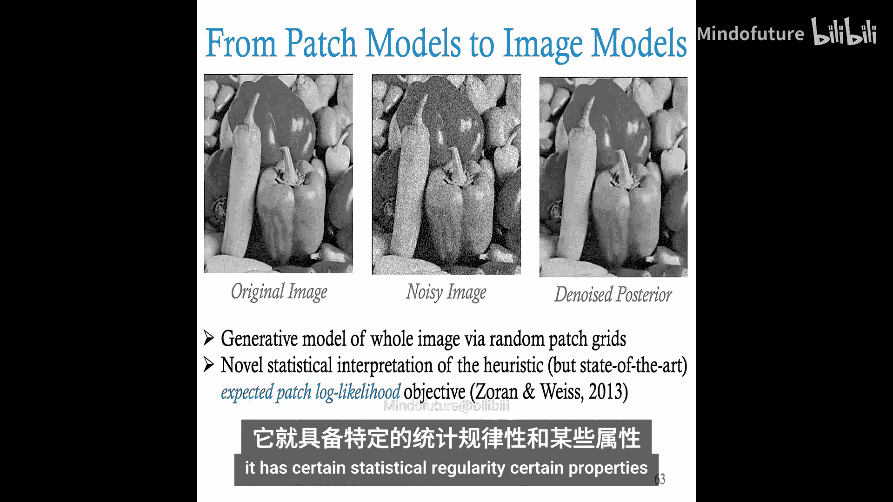

一个相关的有用技巧是**记忆化**：我们将数据集分成多个批次，并缓存每个批次上一次计算得到的充分统计量。当重新分析某个批次并更新其统计量后，我们可以通过“旧全局和 - 旧批次统计 + 新批次统计”的方式快速更新全局统计量，而无需重新扫描整个数据集，这实现了常数时间的全局更新。

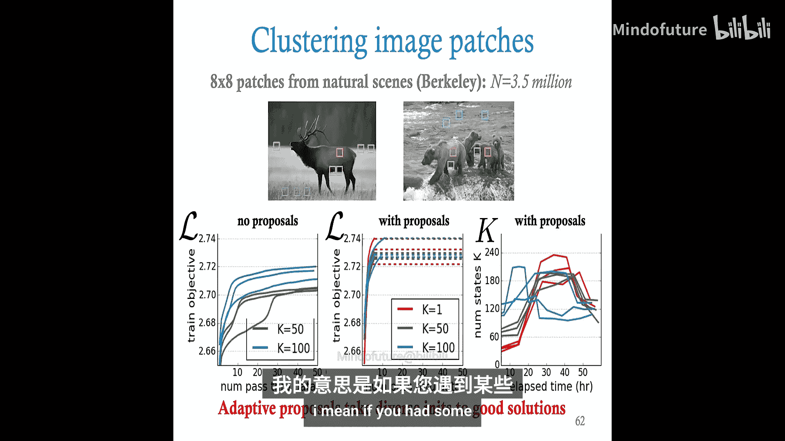

结合记忆化和随机优化，我们可以高效地实现动态簇操作。例如，要评估合并两个簇是否有利，我们可以快速计算合并后新簇的变分参数（将两个簇的分配概率相加），然后计算变分下界是否提高，从而决定接受或拒绝此次合并。类似地，也可以进行簇的分裂操作。从单一簇初始化开始，算法通过一系列生灭操作，能够可靠地收敛到正确的簇数量，对初始化不敏感。

## 应用实例：图像去噪与主题建模

这些方法可以应用于大规模实际问题。例如，在自然图像块建模中，我们可以使用具有全协方差矩阵的高斯混合模型来聚类数百万个8x8图像块。学习到的模型可以作为先验，用于图像去噪任务（通过贝叶斯规则，结合噪声似然和图像块先验），并能取得很好的效果。

另一个重要应用是**主题建模**。层次狄利克雷过程主题模型允许每个文档包含多个主题，并能够从大规模文本语料库（如数百万篇新闻文章）中自动学习主题数量。在模型训练过程中，算法可以动态合并语义相似或冗余的主题，这不仅提高了计算效率，也增强了模型的可解释性。

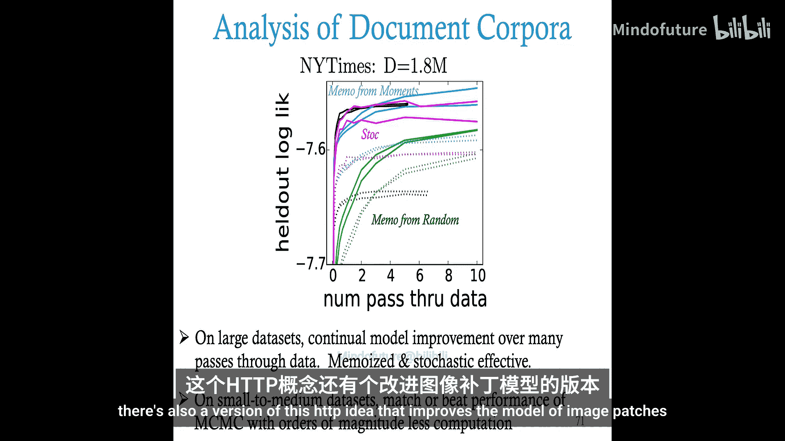

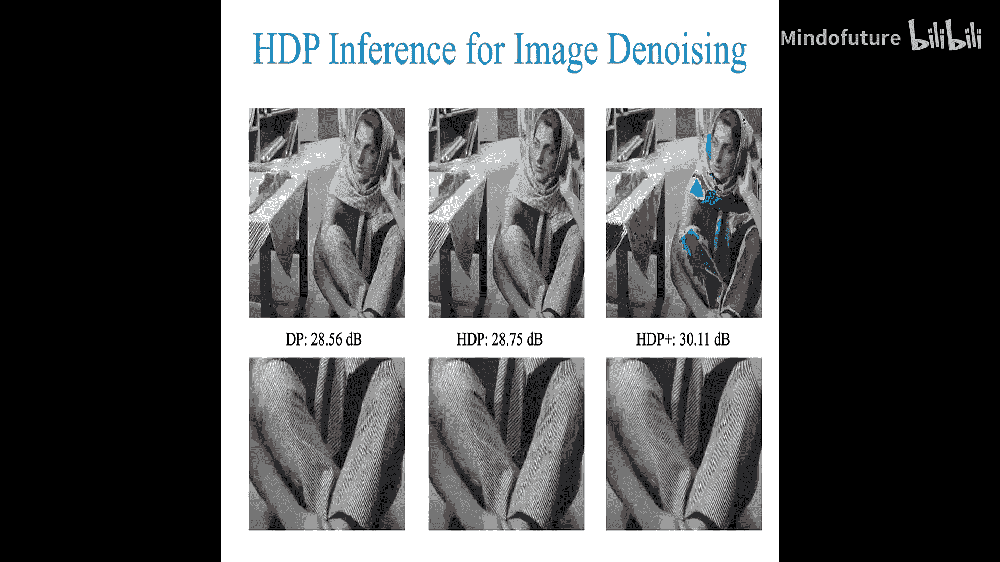

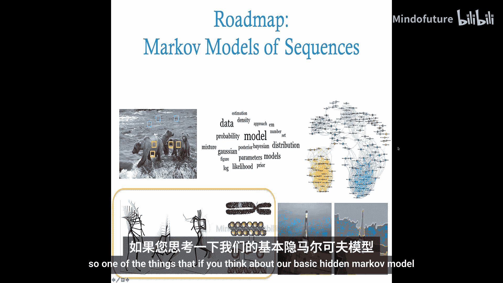

## 扩展到隐马尔可夫模型：HDP-HMM

我们可以将非参数思想扩展到隐马尔可夫模型，得到**HDP-HMM**。在标准HMM中，我们需要预先指定状态数量。而HDP-HMM允许状态空间是无限的，状态转移矩阵是无限维的。通过狄利克雷过程先验的规则化作用，模型倾向于重用一些“流行”的状态，避免过拟合（如每个时间点都进入一个新状态且永不返回）。

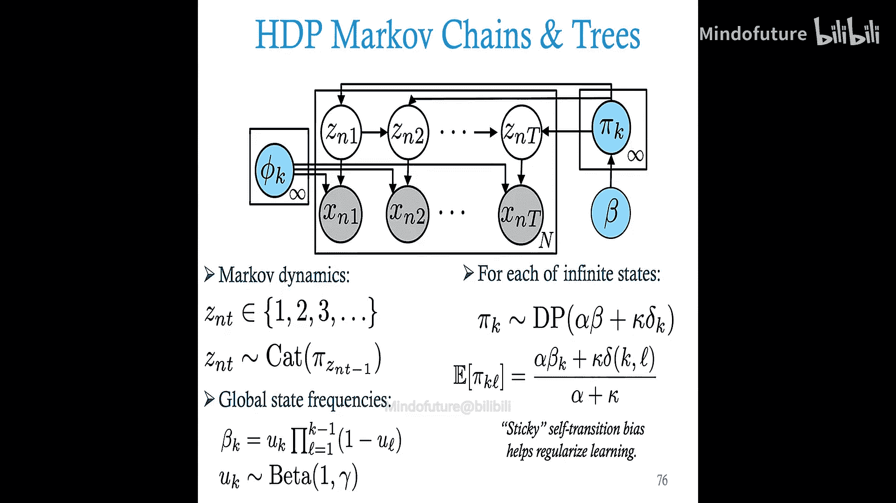

HDP-HMM的一个应用是**说话人日志**：从会议录音中判断有多少个不同的说话人以及每个人何时发言。传统的基于吉布斯采样的推理方法计算成本极高（可能需要数天）。而使用变分推断方法，可以将推理时间缩短数个数量级，达到近乎实时的处理速度，使其更具实用价值。

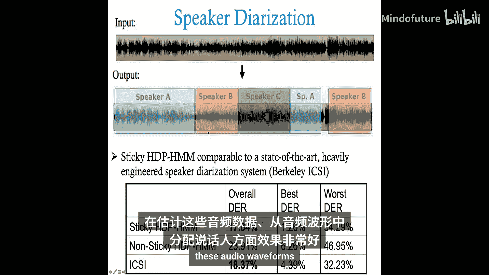

HDP-HMM还可用于其他时序数据，如从运动捕捉数据中无监督地发现不同的活动模式（如行走、运球、芭蕾跳跃等），或用于生物信息学中的染色质分割任务，从长达数百万个“观测”的基因组数据中自动学习功能状态的数量。

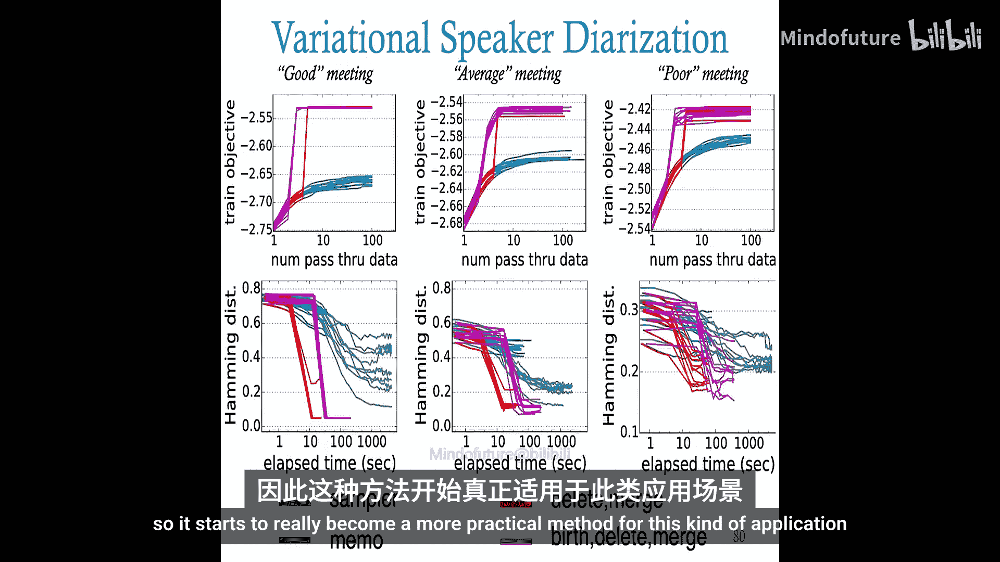

## 并行化与社区发现

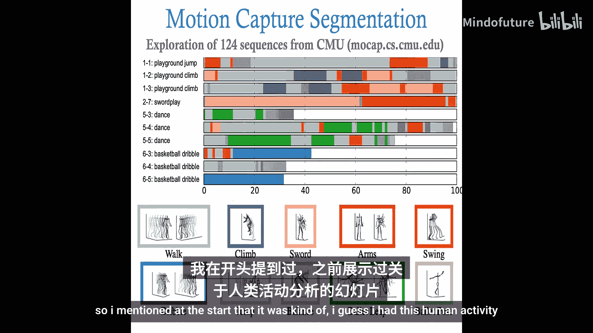

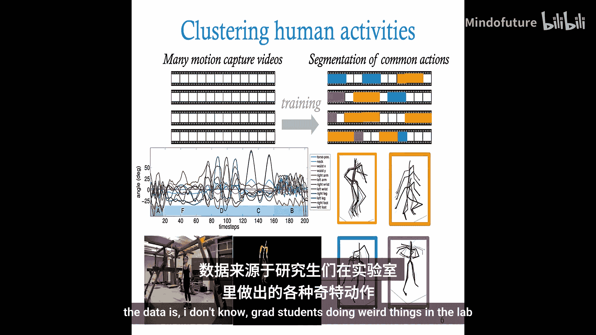

变分推断方法天然支持并行化。例如，在处理多个独立序列或数据批次时，对每个批次的分析可以分配到不同的CPU或GPU核心上并行执行，从而显著加速大规模数据分析。

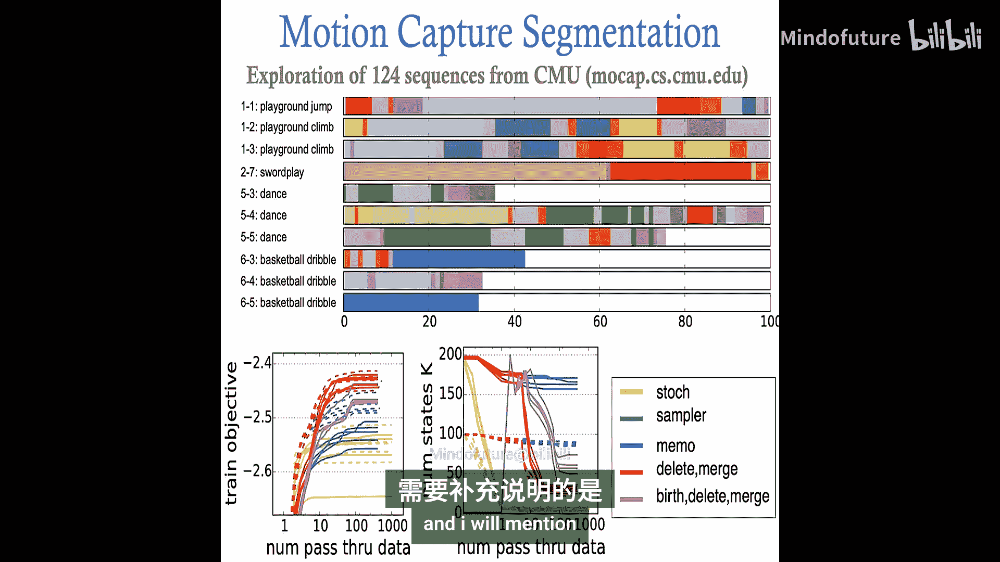

最后，这些思想也可以应用于**社区发现模型**。与作业中的模型类似，我们可以构建非参数版本，从大规模社交网络（如数万个节点的网络）中自动学习社区的数量。学习到的社区结构不仅更具可解释性，还能提高链接预测等任务的准确性。

## 总结

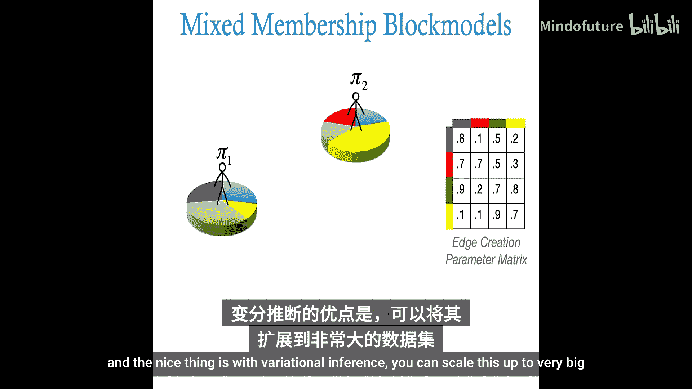

本节课中，我们一起学习了如何将贝叶斯非参数思想与图形模型结合，以解决模型选择、局部最优和可扩展性等挑战。我们重点探讨了基于变分推断的方法，包括：
1.  使用截断和平均场近似处理无限混合模型。
2.  利用证据下界进行模型选择。
3.  通过随机变分推断和记忆化技术实现大规模数据的高效推理。
4.  引入动态簇生灭操作以避免局部最优。
5.  将这些技术应用于图像建模、主题发现、时序分析（HDP-HMM）和社区发现等多个领域，展示了其灵活性和强大能力。

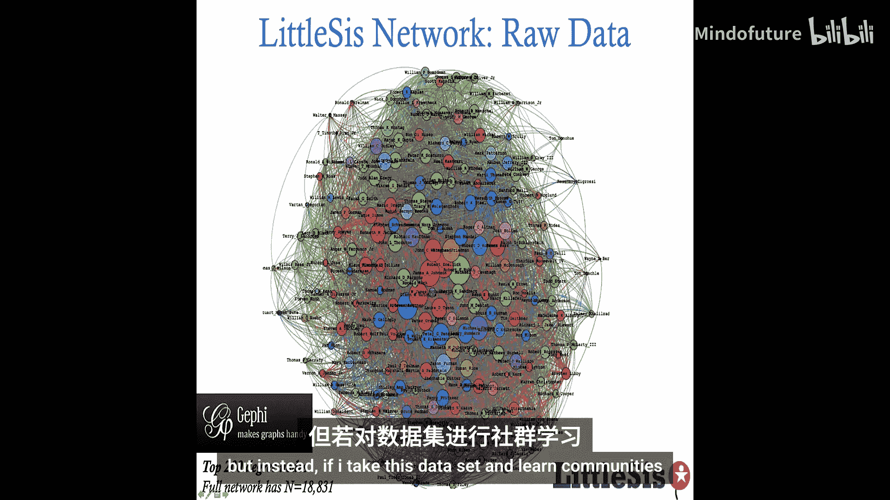

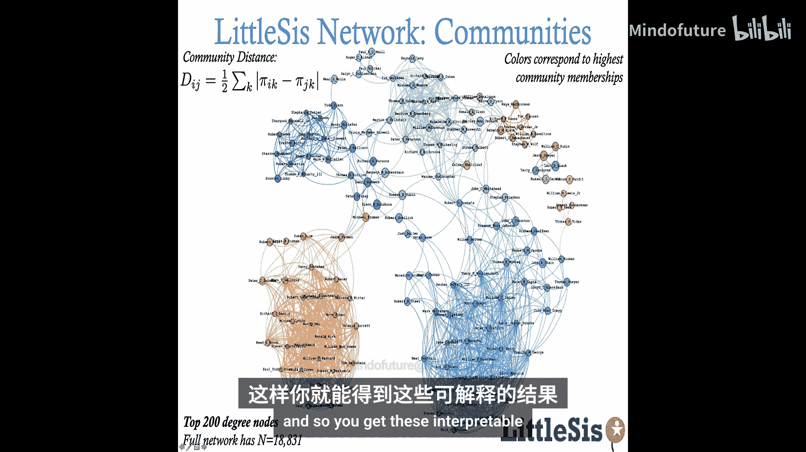

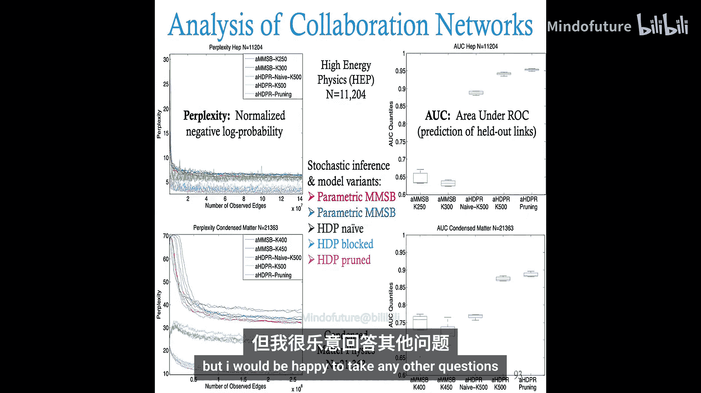

通过变分推断框架，我们能够在保持模型解释力和理论保证的同时，实现高效、可靠且可扩展的推理，从而处理复杂的现实世界数据。