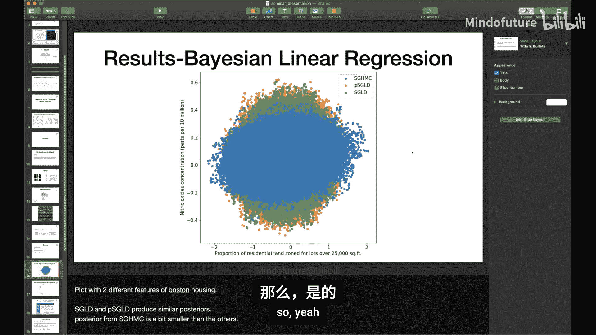
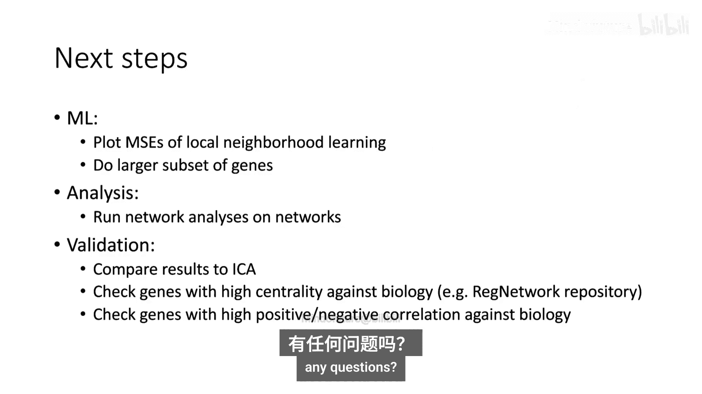
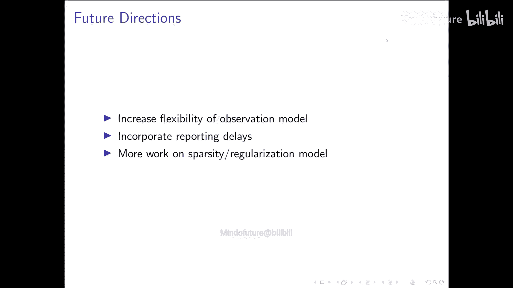
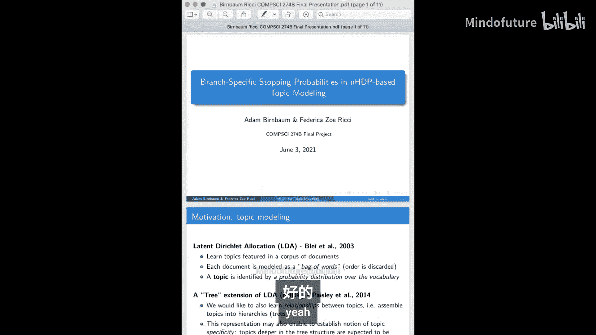
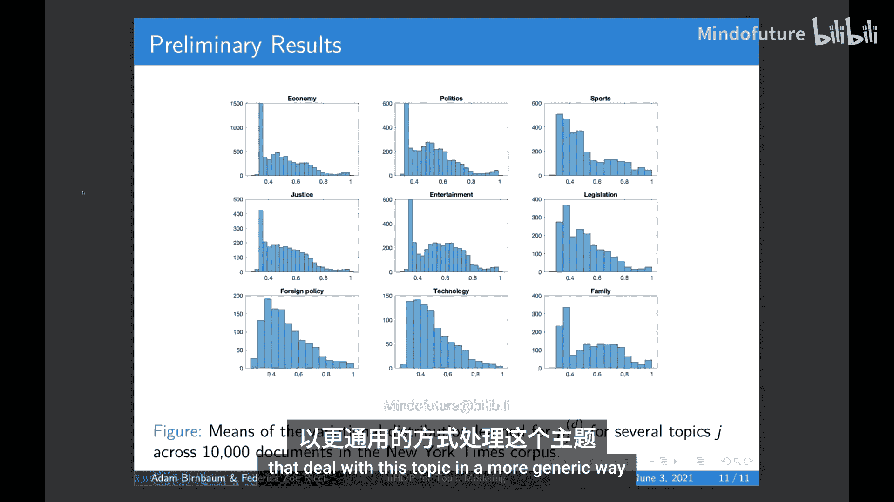
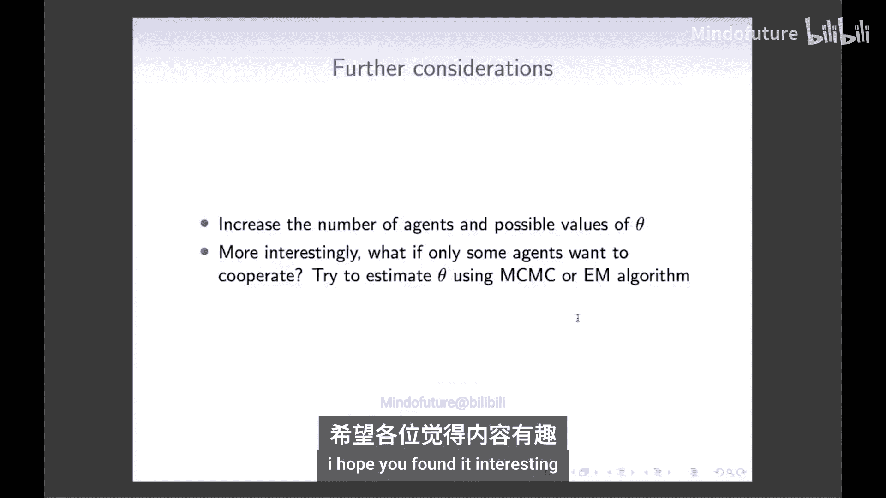
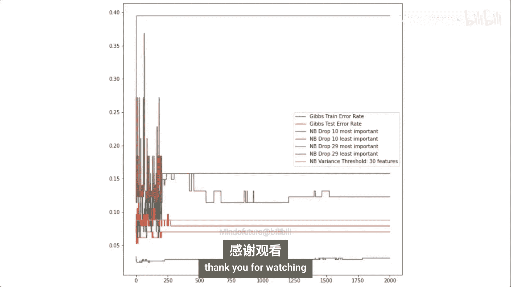

#  020：课程项目合集

在本节课中，我们将学习加州大学CS274b课程中多个学生项目的研究内容。这些项目涵盖了从神经科学、传染病学到计算机图形学等多个领域，展示了概率图模型在不同学科中的广泛应用。我们将逐一介绍每个项目的核心目标、方法、结果与未来方向。

---

## 项目1：基于小鼠神经记录数据学习神经元连接

### 概述
本项目旨在利用概率图模型，分析小鼠在不同行为条件下（特别是受到电击前后）的神经元活动数据，以揭示神经元之间的功能连接。

### 数据与方法
数据来源于微型显微镜记录的小鼠神经元活动。研究人员将小鼠置于实验箱中，在记录过程中施加电击，并观察电击前后神经元活动的变化。

首先，使用传统方法（如动态时间规整聚类算法）对神经元时间序列数据进行初步分析，识别出在电击后表现出高度同步放电的神经元簇。

然而，传统方法在深入分析连接关系方面存在局限。因此，本项目采用了一个**半参数贝叶斯模型**来检测神经元之间的连接。该模型的核心是描述神经元放电率的函数，其关键参数 **β** 代表了神经元之间的连接强度（正值表示兴奋性连接，负值表示抑制性连接）。

为了学习模型参数，研究人员使用了马尔可夫链蒙特卡洛方法，并针对不同变量采用了特定的采样策略（如切片采样和球形哈密顿蒙特卡洛）。

### 结果与讨论
初步结果显示，在电击后的实验条件下，神经元网络中出现了新的连接，并且抑制性连接似乎有所增加。然而，参数 **β** 的分布大多集中在零附近，且MCMC算法的收敛性不佳，表明模型性能有待提升。

### 未来方向
未来的改进方向包括：合并多次电击试验的数据以增加统计效力；对数据进行预处理以针对更活跃的神经元；调整时间窗口和分箱大小；以及将神经元空间位置信息纳入模型，因为生物学上距离较远的神经元相互作用的可能性较低。

### 总结
本节我们介绍了如何利用半参数贝叶斯图模型分析小鼠神经元活动。虽然初步结果显示了电击后连接模式的变化，但模型的收敛性和性能仍需进一步优化。

---

## 项目2：贝叶斯神经网络中SGMCMC方法的比较

### 概述
本项目比较了三种不同的随机梯度马尔可夫链蒙特卡洛方法在贝叶斯神经网络推理中的性能。

### 背景与方法
在贝叶斯推理中，计算后验概率通常涉及难以处理的高维积分。随机梯度MCMC方法通过使用数据子集（小批量）和梯度信息，提供了可扩展的近似解决方案。

本项目比较了以下三种方法：
1.  **随机梯度朗之万动力学（SGLD）**
2.  **预条件SGLD（PSGLD）**：引入预条件矩阵以应对参数曲率差异。
3.  **随机梯度哈密顿蒙特卡洛（SGHMC）**：引入动量项以提高混合效率。

研究在贝叶斯神经网络上评估这些方法，使用了波士顿房价（回归）和MNIST/Fashion-MNIST（分类）数据集。

### 结果与评估
评估指标包括预测精度、积分自相关时间、有效样本量和校准误差。
*   在贝叶斯线性回归中，三种方法得到的后验分布相似。
*   在MNIST分类任务中，SGHMC达到了更高的精度，SGLD收敛速度比PSGLD快。
*   在更具挑战性的Fashion-MNIST任务中，使用预条件器的PSGLD在较大模型上表现出更快的收敛速度和更大的有效样本量。

### 总结
本节我们比较了三种SGMCMC方法。结果表明，在复杂任务中，引入预条件器或动量项的改进方法（PSGLD, SGHMC）通常能提供更好的收敛性能和不确定性估计。

---

## 项目3：利用社会经济数据构建美国移民模式的图表示

### 概述
本项目旨在构建一个关系图模型，以理解美国各州之间移民流动与社会经济因素之间的关系，从而模拟政策变化对移民模式的影响。

### 数据与模型构建
项目团队整合了长达15年的州际移民数据，以及薪资、失业率、GDP、犯罪率和地理坐标等社会经济指标。他们将移民流量归一化为离开某州的总体人数比例。

模型采用了一个**集体图模型**的框架，将州际移民流量（Δ_ij）建模为以Beta分布，其参数由发送州和接收州的元数据（X_i, X_j）通过线性变换决定。模型使用PyTorch实现，并通过梯度下降最大化似然函数进行学习。

### 结果与发现
学习得到的模型揭示了移民网络的结构：
*   人口流动主要集中在加利福尼亚、德克萨斯和佛罗里达等高人口州。
*   美国东北部及北部各州在模型中的连接度较低，表明这些地区的人口对 socioeconomic 变化的反应可能更不敏感，流动性较低。
*   模型并非简单的人口偏好，例如人口最少的怀俄明州在图中也表现出一定的连接活性。

### 未来方向
未来工作包括：解释模型系数在社会经济理论中的含义；进行更精细的特征工程；以及探索数据中的潜在社区结构，对行为相似的州进行聚类。

### 总结
本节我们介绍了一个利用关系图模型分析州际移民的模式。该模型成功识别了主要移民流向和地区差异，为政策模拟提供了基础。

---

## 项目4：从数据中学习图模型结构

### 概述
本项目探索了三种不同的算法，从未标记的普查收入数据中学习特征之间的图模型结构，以进行特征选择和关系推断。

### 方法比较
研究比较了三种学习方法：
1.  **基于L1正则化的逻辑回归（作业2方法）**：将特征转换为二进制后，使用L1正则化逻辑回归学习马尔可夫随机场，通过环传播进行推理。该方法快速，得到了稀疏图，在收入预测上达到了81%的准确率（基线为76%）。
2.  **贪婪条件熵最小化方法**：通过贪婪地添加邻居节点来最小化每个节点的条件熵。该方法能得到较高的准确率，但产生的边较多，导致推理成本上升。
3.  **节点回归方法**：为混合（离散和连续）图模型建模，将联合概率分解为条件分布（高斯分布和多项分布）的乘积，并对每个节点进行L1正则化回归。该方法学习到的图具有可解释性（例如，教育年限与教育程度强相关），准确率达到84%，但计算速度较慢。

### 结果与观察
*   贪婪方法和节点回归方法在预测精度上优于基础的L1正则化方法。
*   节点回归方法虽然速度慢，但能得到更稀疏、更易解释的图结构。
*   所有方法学习到的图在预测性能上均优于完全连接的图，说明特征选择的有效性。

### 总结
本节我们比较了三种学习图结构的方法。结果表明，节点回归方法在精度和可解释性之间取得了较好的平衡，而贪婪方法在需要快速得到结果时也是一个可行的选择。

---

## 项目5：学习基因调控网络的结构

### 概述
本项目旨在从单细胞RNA测序数据中学习基因调控网络的无向骨架结构，并识别共表达基因模块。

### 方法：局部泊松图模型
由于基因表达数据是计数数据，研究者选择了泊松分布。然而，直接定义联合泊松MRF会导致只能建模负依赖关系。因此，项目采用了**局部泊松图模型**，即只指定每个节点给定其邻居的条件分布为泊松分布。这样既能建模正负依赖关系，又保留了局部马尔可夫性质。

参数学习通过针对每个节点的L1正则化泊松回归完成。模型选择则采用了一种基于一致性的方法：多次对数据子集拟合模型，并选择使得不同子集模型对边存在与否的 disagreement 概率较低的正则化参数 λ。

### 初步结果与下一步
初步结果显示，学习到的网络边根据λ值的不同而稀疏程度不同，并且边可区分为正相关（蓝色）和负相关（红色）。节点之间的依赖关系并不总是对称的（θ_ij ≠ θ_ji），随着λ增大，非对称性的标准误也会增大。

下一步工作包括：分析不同λ下的基因邻域结构；对更大的基因集进行网络分析；将结果与ICA方法进行比较；并根据已知生物学知识进行验证。

### 总结
本节我们介绍了一种用于基因表达计数数据的局部泊松图模型。该方法能够学习基因间的非对称依赖关系，为理解基因调控网络提供了新的工具。

---

## 项目6：基于递归隐变量模型的ECG数据生成

### 概述
本项目结合变分自编码器与循环神经网络，构建了一个用于心电图数据生成和建模的递归隐变量图模型。

### 背景与方法
心电图是反映心脏电活动的时间序列数据。本项目使用Pan-Tompkins算法对心跳进行分割。

模型采用**递归变分自编码器**，其中观测变量x代表心跳信号，z是隐变量，h是RNN的隐藏状态。在每个时间步，编码器都依赖于前一个时间步的RNN状态（h_{t-1}），从而捕捉时间序列的时序结构。

训练目标是最大化随时间步变化的变分下界。训练完成后，模型可以从隐变量中采样，生成逼真的心跳信号，包括正常心跳和房颤等异常心跳。

### 总结
本节我们介绍了一个用于ECG数据生成的递归隐变量模型。该模型成功学习了心跳信号的时序结构，并能生成不同类别的合成心跳，在心电信号建模和合成数据生成方面具有潜力。

---

## 项目7：网络上的池化检测策略

### 概述
本项目研究了在传染病检测中，如何利用图模型和最优传输理论来优化池化检测策略，以提高检测效率并重建个体的病毒载量。

### 背景
池化检测将多个样本混合进行检测，可以大幅减少检测次数，尤其在感染率较低时效率更高。本项目关注非自适应池化策略，即所有检测同时进行。

### 模型与优化
池化过程可以用矩阵A表示，观测结果y = A * x + noise，其中x是稀疏的个体病毒载量向量。目标是从y和A中重建x。

研究者提出了两种思路：
1.  **信息论公式**：最大化观测y关于x的信息。但由于需要知道x的协方差且问题规模大，难以直接求解。
2.  **最优传输公式**：将病毒载量x和观测y视为两个分布，并寻找它们之间的最优耦合矩阵Q。这可以通过添加熵正则项的Sinkhorn算法高效求解。优化后的耦合矩阵Q可以转化为更高效的池化矩阵A，使得每次检测包含的样本更少，从而提高检测准确性。

### 因子图与解码
为了高效解码，项目借鉴了低密度奇偶校验码的思想，使用稀疏因子图来表示池化问题，将边的数量从O(N²)降低到约O(N log N)。并计划使用混合高斯先验和置信传播算法来重建近似稀疏的病毒载量向量x。

### 总结
本节我们介绍了如何利用最优传输理论和稀疏因子图来优化池化检测策略。该方法有望在保持高精度的同时，显著降低大规模检测所需的成本。

---

## 项目8：图模型在传染病动力学中的应用

### 概述
本项目将图模型应用于传染病动力学，旨在从观察到的病例数时间序列中，推断有效再生数Rt，并模拟疾病传播。

### 模型构建
传统的分支过程模型将当前发病率I_t与有效再生数R_t通过加权历史发病率联系起来：I_t = R_t * Σ (w_s * I_{t-s})。

本项目对此进行了两处改进：
1.  **添加观测模型**：考虑到报告病例数（C_t）只是真实发病率（I_t）的一部分，模型将报告病例数建模为真实发病率和已知检测数量（T_t）的函数。
2.  **图模型表示**：构建了一个三层图模型：观测病例层 -> 真实发病率层 -> 有效再生数层。R_t 本身也通过平滑先验在时间上相关联。

模型使用Stan和哈密顿蒙特卡洛进行实现。

### 结果
将新模型与忽略检测数量的旧模型在加州橙县COVID-19数据上进行比较，新模型表现出：
*   更平滑的后验估计曲线。
*   更紧致的95%置信区间。
*   在预测未来14天病例时，不确定性显著降低。
*   在均方误差和区间宽度等数值指标上均优于旧模型，仅在区间覆盖率上略有 trade-off。

### 未来方向
未来工作包括：增加观测模型的灵活性；纳入报告延迟；以及尝试在发病率之间施加稀疏性以简化模型。

### 总结
本节我们介绍了一个结合了观测噪声的传染病图模型。该模型能提供更准确、更不确定性的有效再生数和病例预测，对传染病监测和政策制定具有参考价值。

---

## 项目9：大都会光传输

### 概述
本项目将大都会-黑斯廷斯这一MCMC算法应用于计算机图形学中的全局光照渲染问题，实现了大都会光传输算法，并与传统方法进行了比较。

### 背景
渲染方程通过积分计算场景中光线的传播。蒙特卡洛积分是常用方法，双向路径追踪通过从光源和相机分别发射子路径并连接，能有效处理复杂光照。

### 大都会光传输
MLT算法在双向路径追踪的基础上，引入**大都会-黑斯廷斯采样**：
1.  首先，用双向路径追踪生成一组初始路径，并估计一个归一化因子。
2.  然后，通过“路径突变”生成新的路径候选，并根据接受概率决定是否接受该新路径作为样本。

路径突变旨在找到与当前路径相近但贡献值可能不同的新路径，从而更高效地探索高贡献值的路径空间。

### 结果
在类似水波纹、长隧道等复杂光路场景中，MLT在相同时间内产生的图像噪声远少于传统路径追踪和双向路径追踪。然而，在简单场景中，由于样本相关性和“燃烧期”问题，MLT可能表现不佳。

### 总结
本节我们介绍了大都会光传输算法。该算法通过MCMC方法智能探索光线路径空间，在处理复杂全局光照效果时能显著提升渲染效率和质量。

---

## 项目10：社交网络上的社区检测

### 概述
本项目利用混合成员随机块模型，在大型同性恋社交网络Hornet的数据上，进行重叠社区检测。

### 模型：MMSB
混合成员随机块模型允许每个节点属于多个社区。每个节点i有一个社区成员分布向量θ_i。节点i和j之间产生连接的概率，取决于它们各自从自己的成员分布中抽样的社区指示符，以及该社区内部的连接密度β_k。

模型使用随机变分推断进行学习，并采用了多种采样策略（随机节点对采样、随机节点采样、链接采样）来提高在稀疏大图上的计算效率。

### 结果
*   **链接采样**效果最好，收敛快，最适合稀疏网络。它检测出了76个重叠社区。
*   **批处理推理**效果接近链接采样，但每次迭代时间更长。
*   通过K-means对用户的地理位置和语言等协变量进行聚类，得到了8个社区，验证了地理和语言因素对社区形成的影响。
*   网络连接高度集中，少数用户拥有大量连接。

### 总结
本节我们介绍了如何使用MMSB模型在稀疏社交网络上进行重叠社区检测。链接采样策略在该场景下表现最优，并且协变量分析证实了地理和语言是社区形成的重要驱动因素。

---

## 项目11：基于MIF形变配准与迭代图割的无监督器官分割

### 概述
本项目结合形变配准与迭代图割算法，实现了一种无需人工标注的医学图像（CT/MRI）器官分割方法。

### 方法
流程分为两步：
1.  **形变配准**：将带有器官掩模的图谱图像配准到目标图像上，得到一个初始的、可能不准确的分割预测。这被建模为一个马尔可夫随机场标记问题，并通过在最小生成树上进行动态规划求解。
2.  **迭代图割**：以上一步的预测作为初始种子点，迭代地运行图割算法来细化分割结果。在每次迭代中，从当前预测的高置信度区域选择新的种子点，用于下一次图割。当预测不再变化时停止。

### 结果
在肝脏、脾脏和肾脏的CT图像分割任务上，该方法与监督式U-Net进行了比较：
*   在Dice分数上，U-Net仍占优。
*   在95%豪斯多夫距离上，本方法优于U-Net，因为配准引入了更强的形状先验。
*   与单纯形变配准的结果相比，迭代图割能显著改善分割精度，成功修正了配准错误。
*   该方法严重依赖于初始配准的质量，如果初始掩模完全错误，则难以恢复。

### 总结
本节我们介绍了一种无监督的医学图像分割框架。它通过结合形变配准的全局形状约束和图割的局部边界优化，在缺乏标注数据的情况下取得了有竞争力的结果。

---

## 项目12：具有分支特定停止概率的嵌套分层狄利克雷过程主题模型

### 概述
本项目对嵌套分层狄利克雷过程主题模型进行了简化，引入了分支特定的停止概率，以探索文档处理不同宏观主题时所用术语的泛化与具体程度。

### 模型改进
在原始NHDP模型中，每个主题节点都有一个停止概率，决定一个词是在当前节点生成还是继续向子树深处游走。

本项目将其简化为**分支特定的停止概率**。即，每个宏观主题（树的主分支）共享一个停止概率p_j。当词的主题属于分支j时，它游走的深度由一个以p_j为参数的几何分布决定。p_j高意味着文档倾向于用该分支的泛化术语，p_j低则意味着使用更具体的术语。

模型使用随机平均场变分推断进行学习。

### 初步结果
在《纽约时报》文章数据集上的初步实验显示：
*   模型学习到的主题层次中，高层主题用词更泛化，深层子主题用词更具体。
*   不同文档、不同宏观主题的停止概率存在异质性。例如，“体育”和“科技”主题倾向于使用具体术语（p_j小），而“娱乐”和“家庭”主题则既有具体也有泛化讨论。

### 总结
本节我们介绍了一个改进的NHDP主题模型。通过引入分支特定的停止概率，模型能够量化文档对不同主题讨论的深入程度，增强了主题层次的可解释性。

---

## 项目13：将生成对抗网络与有向图模型结合用于EEG建模

### 概述
本项目提出了一种新框架，将生成对抗网络的强大生成能力与概率图模型的结构化先验知识相结合，用于脑电图信号的生成和建模。

### 方法
框架包含生成器G（隐变量z -> 脑电信号x）和推理器E（脑电信号x -> 隐变量z）。为了刻画隐变量的复杂结构，引入了**高斯混合模型**作为先验。

训练采用**期望传播算法**作为一种确定性的变分推理方法，通过最小化生成模型P和推理模型Q之间的散度来学习参数。散度估计通过多个针对不同因子（对应GMM的不同组件）的判别器来完成。

推理时，则使用MCMC方法（如辅助变量采样）在给定观测数据的情况下对隐变量进行采样。

### 结果
在由神经质量模型生成的EEG数据上，将本方法（Graphical-GAN）与原始GAN进行比较：
*   Graphical-GAN生成的信号在频域（功率谱）和时域（均值、标准差）上与真实数据匹配得更好。
*   瓦瑟斯坦距离测量也表明，Graphical-GAN生成的数据分布更接近真实分布。

### 总结
本节我们介绍了一个结合GAN与图模型的混合框架。该框架成功地将结构先验注入到EEG生成模型中，产生了更逼真、统计特性更匹配的合成脑电信号。

---

## 项目14：基于图模型的模型化多智能体强化学习

### 概述
本项目探讨了如何将图模型（特别是变分推理）融入模型化多智能体强化学习，以提高在合作型马尔可夫博弈中的样本效率。

### 背景
模型化RL通过学习和利用环境转移模型（参数θ）进行规划，比无模型RL更样本高效。在单智能体环境中，使用高斯过程等模型并配合变分推理学习θ已取得成功。

### 扩展到多智能体
本项目将这一思路扩展到多智能体场景，如“社交距离博弈”。在该博弈中，智能体希望聚集以获得效用，但聚集人数超过阈值（由θ定义）会导致状态变差（如触发社交隔离）。

### 实验与结果
在实验中，比较了两种方法：
1.  **无模型策略梯度**：直接学习策略。
2.  **模型化方法**：先使用少量轨迹通过推理估计θ，然后用此信息初始化或指导策略。

结果显示，模型化方法能显著加快收敛速度，所有实验在25次迭代内收敛，而无模型方法有些需要更长时间。

### 未来方向
未来可考虑更复杂的θ先验、更多智能体，以及在只能观察到部分智能体行动（数据缺失）的情况下进行推理。

### 总结
本节我们介绍了如何利用图模型和变分推理为多智能体强化学习引入环境模型学习。初步结果表明，该方法能有效提升在合作型博弈中的学习效率。

---

## 项目15：用于特征选择的混合模型

### 概述
本项目设计了一个特殊的混合模型，在完成分类任务的同时，自动进行特征选择，并评估各特征的信息量。

### 模型设计
模型在朴素贝叶斯分类器的基础上进行了扩展：
*   对于每个特征，引入一个二元“特征开关”变量S。
*   如果S=1，则该特征观测值来自与类别标签相关的分布（簇0或簇1）。
*   如果S=0，则该特征观测值来自一个**均匀分布**（第3个簇），代表该特征与标签无关，是“无关信息”。
*   每个特征开关S有一个参数α，称为信息权重，服从Beta先验。α越大，表示该特征越具有判别信息。

### 结果
在威斯康星乳腺癌数据集上：
*   模型成功识别出信息量高（α接近0.99）和信息量低（α接近0.41）的特征。
*   丢弃10个最不重要的特征，模型准确率与使用全部30个特征时相近。
*   丢弃10个最重要的特征，错误率翻倍。
*   仅使用最重要的1个特征，其准确率甚至高于使用20个最不重要特征的模型。

### 总结
本节我们介绍了一个内嵌特征选择机制的混合模型。该模型不仅能进行预测，还能通过信息权重α量化每个特征的重要性，为高维数据下的特征选择和模型解释提供了有效工具。

---

## 课程总结
在本节课中，我们一起学习了CS274b课程中涵盖广泛领域的15个学生项目。这些项目生动地展示了概率图模型作为一种强大的建模工具，如何被应用于神经科学、计算生物学、传染病学、社会学、计算机图形学、自然语言处理等多个前沿交叉学科。从推断神经元连接、模拟疾病传播、优化群体检测，到生成医学信号、渲染复杂光影、检测社交社区，每个项目都体现了将图模型理论与具体实际问题相结合，并通过创新方法解决挑战的过程。希望这些案例能为大家在自己的研究或应用中运用图模型带来启发。