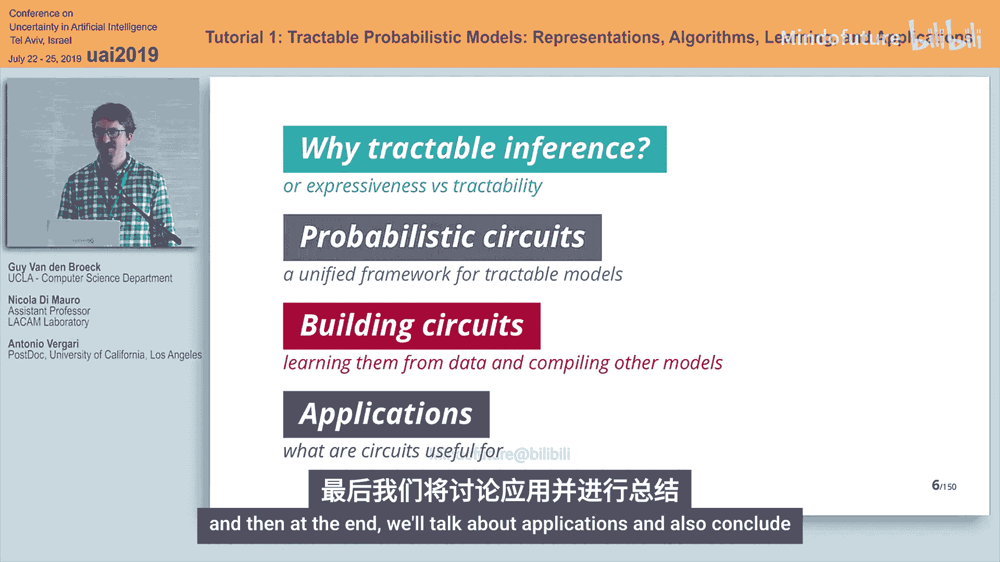
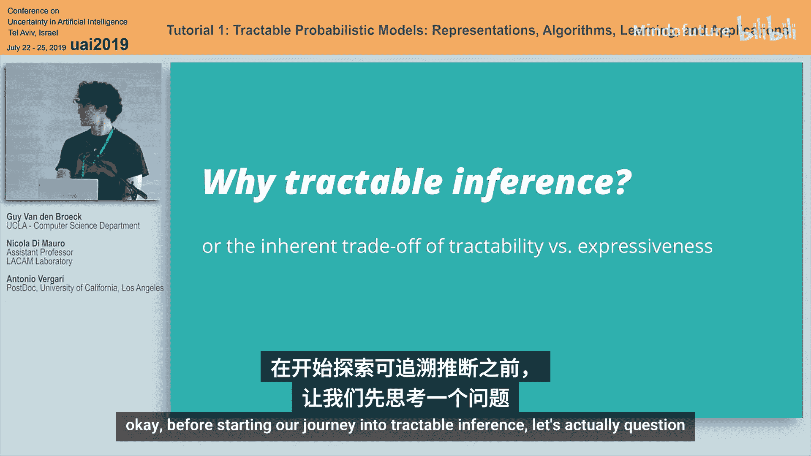
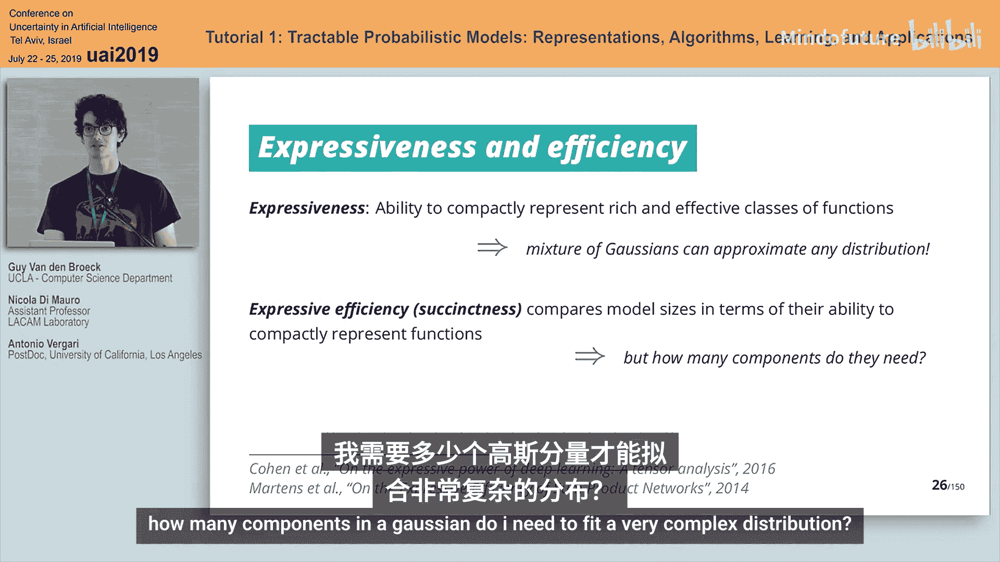
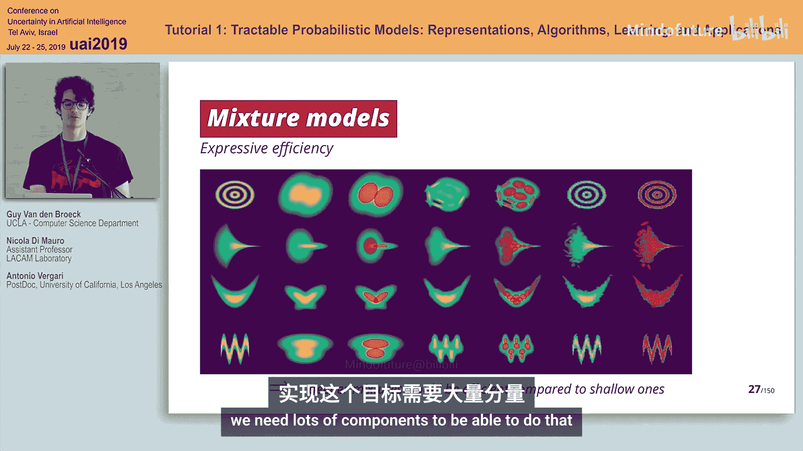
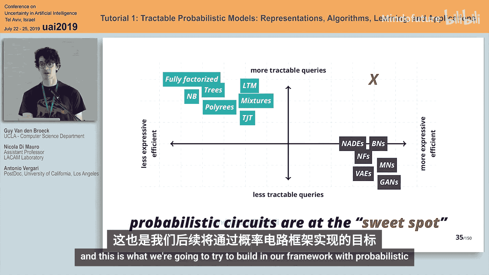
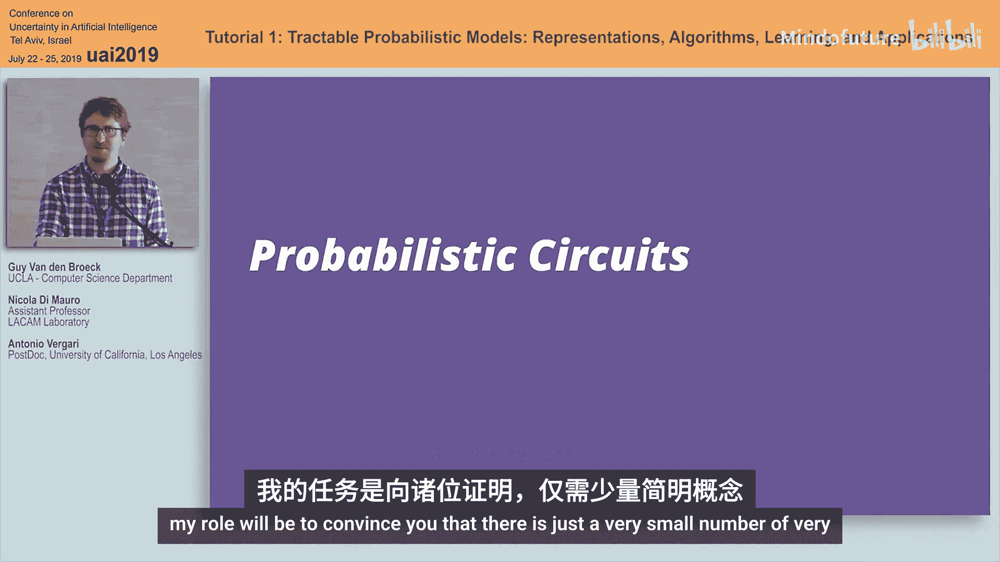
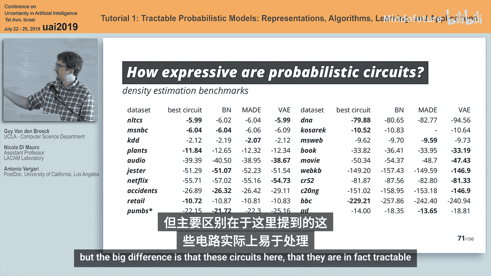
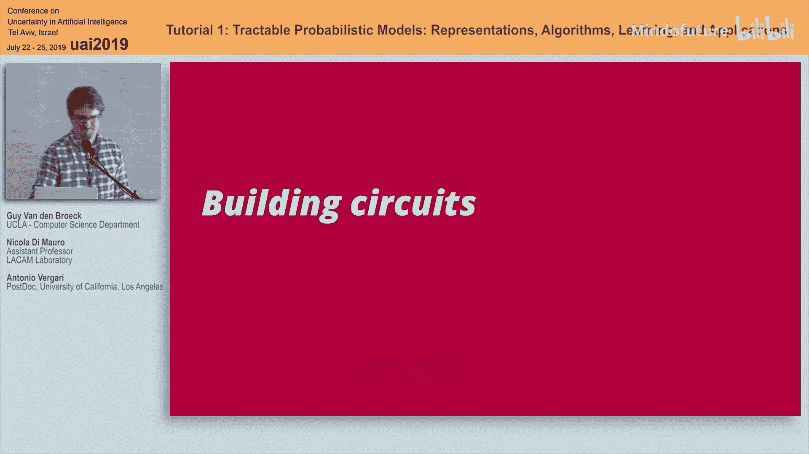
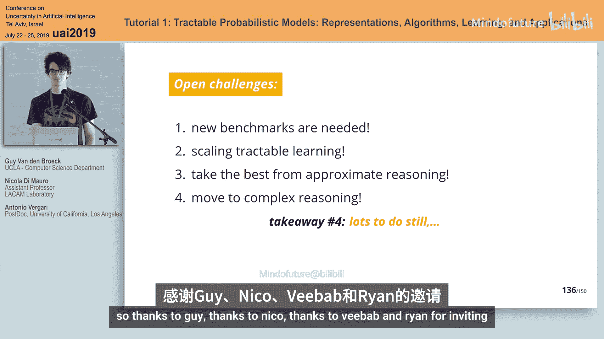

#  021：可处理的概率模型

在本教程中，我们将学习可处理的概率模型。这是一个在不确定性人工智能领域非常丰富的方向。随着该领域的发展，出现了大量首字母缩略词，构成了AI模型的一锅“字母汤”。今天的目标之一就是理清这锅“字母汤”。我们将简要介绍所有这些你可能听说过的AI表示模型。其中一些模型实际上源于传统的逻辑AI，如BDD，它们与可处理的概率模型密切相关，我们稍后会讨论。但现在，我们将专注于那些真正表示概率分布的模型。

在这些模型中，有经典的**概率图模型**和其他类型的表示，不幸的是，它们通常是难以处理的。因此，本教程的大部分内容将围绕如何构建**可处理的概率模型**展开，我们稍后会深入探讨。

在所有可处理模型中，问题是：如果你想要可处理性，需要付出什么代价？我们将讨论这些模型的表达能力，以及你是否需要做出妥协。这就是高层次上的收获：让我们理解整个研究领域。

以下是本教程的大纲。我们将首先阐述为什么需要可处理推理，以及表达能力和可处理性之间的权衡。然后，我们将尝试为**可处理电路**引入一种通用语言，它将涵盖许多现有的形式化方法，并尝试建立一个抽象的通用框架来讨论这些问题。

一旦我们了解了这种表示方法，我们将讨论如何从数据中获取它，或者如何从你喜欢的其他类型模型编译得到它。最后，我们将讨论应用并进行总结。

## 第一部分：为什么需要可处理推理

在开始我们的可处理推理之旅之前，让我们先问一个问题：为什么一开始就需要概率推理和概率模型？

假设你是一个决策者，负责管理特拉维夫的交通。你可能会问自己：今天是星期一，并且Elatha街发生交通堵塞的概率是多少？或者，你只是一个计划自己每周行程的上班族，你可能想知道哪一天最有可能在上班路线上遇到交通堵塞。这些都是我们可以用自然语言表述的基本问题，它们就是**查询**。

那么如何回答这些问题呢？假设你现在有数据。你会怎么做？当然，你会拟合一个预测模型，比如一个带有神经网络的分类器。你观察问题并试图预测答案。不，因为你无法提前知道所有可能的问题，你还需要答案，而你永远不会观察到所有情况。相反，我们要做的是拟合一个我们世界的**概率模型**。

这个模型是 `M`，我们将查询这个模型。这个模型就像一个黑盒。我们向模型提出一个问题，这些答案就是我们进行**概率推理**的方式。我认为我们UAI社区对此都有共识。

让我们更深入地看看这类问题。对于第一个问题：“今天是星期一，并且Elatha街发生交通堵塞的概率是多少？”我们如何回答？让我们稍微形式化一下。

假设我们有一组随机变量 `X`，我们有时间、星期几，以及一组布尔变量，指示每条街道是否发生交通堵塞。回答这个查询基本上是计算根据我们的模型，今天是星期一且Elatha街的布尔变量为真的概率。我们忽略了所有其他变量。所以，基本上，我们是在计算**边缘概率**。我们边缘化了所有其他变量。

对于第二个查询，我们需要做更复杂的事情。在同一个形式化例子中，我们实际上要做的是计算 `argmax`，即根据我们的模型 `M`，星期几是特定的一天，并且我们有这个逻辑约束，使得所有可能的路径都通向我们的上班路线。这肯定更复杂，涉及边缘概率、进行MAP预测（我们稍后会看到MAP的含义），以及进行一些逻辑推理。

到目前为止，我们看到的是两个不同的查询，它们属于不同的查询族。既然我们现在知道我们真的想做概率推理，让我们尝试更正式一点，看看什么是可处理推理，这些查询是什么，它们与模型有什么关系。

这里有一个简单的定义。我们可以说，一个概率模型族 `M` 对于一类查询 `Q` 是**可处理的**，当且仅当，无论我选择哪个 `M` 和哪个来自该族的查询 `Q`，我都能在多项式时间内（相对于查询大小和模型大小）精确计算该查询的结果。

在实践中，这个多项式时间通常是线性的，这很好。但有一个注意事项。我们还需要确保模型的大小和查询的大小相对于输入大小也是多项式的。也就是说，我的模型类和查询类是紧凑的表示。总而言之，我们真的希望能够在多项式时间内回答这些查询。

那么精确推理呢？我们真的需要近似推理吗？问题是，当我们一开始就可以精确计算时，为什么还要近似呢？当然，正如Guy所说，这是有代价的，我们稍后会看到是什么代价。同样要记住，有时近似也不便宜，它们也是难以处理的，而且大多数时候它们也没有保证。Rina会有一个非常好的演讲，讨论如何在近似推理过程中获得保证，但通常它们没有保证。无论我们如何链接近似，如果我们没有保证，就像蒙着眼睛飞行，我们不知道要去哪里。这是坚持精确推理的一个强烈动机。

这是接下来15分钟我要讲的内容。我将介绍一系列这类查询，同时回顾一系列模型族，我们将探究它们是否可处理，表达能力如何，我们在权衡什么。之后，我们将引入**概率电路**作为一种语法来生成可处理模型。

让我们从可能想提出的一个非常基本的概率查询开始。这类问题是：“今天是星期一，时间是中午，并且只有El街发生交通堵塞的概率是多少？”显然，我们需要实例化所有变量。所以，基本上是：今天是星期一，时间是12点，对于我们所有的布尔变量，它们都有一个值。除了El街的那个，其他都是0。这是**完全证据**。这看起来可能是一个非常琐碎的查询，我们可能一开始并不真想问这个。但如果我们在学习和推理中真的做概率推理，我们已经看到很多次了，每当我们做最大似然学习时，因为我们只是想最大化数据的似然，而数据通常是完整的。

所以这是我们的第一类查询，最简单的。我们将使用哪种概率模型？当然，我们会使用生成对抗网络，它们非常流行。嗯，不完全是。首先，生成对抗网络甚至没有显式的似然，这就是为什么你真的需要对抗训练。所以人们会说，是的，但我可以通过采样来计算这些完全证据概率，采样很多次。但你需要很多样本。而且，如果你在做对抗学习，你迟早会遇到模式崩溃。所以你可能看不到很多好的配置，你的估计会有很大偏差。

所以我们排除生成对抗网络。既然我们不使用生成对抗网络，如今，我们必须使用变分自编码器。变分自编码器现在有显式的似然，所以我们可以计算这些完全证据。这很酷。所以我们将使用变分自编码器。嗯，不完全是，因为在这种情况下，我们确实有显式的似然，但我们实际上无法精确计算它。所以这是难以处理的，因为变分自编码器是一个具有无限且不可数个分量的混合模型。所以对于变分自编码器，没有可处理的完全证据查询，优化它也是有问题的。所以让我们排除它们。让我们回到一个更通用的模型族，变分自编码器属于这个族：**概率图模型**。

PGM在UAI社区很受欢迎，因为它们提供了模型和如何在其上进行推理之间非常清晰和明确的分离。你知道节点代表随机变量，边定义了它们之间的依赖或独立关系。你有一系列推理算法作为黑盒运行。所以我们真的想使用PGM，但我们知道有一些注意事项。所以让我们回顾一下概率图模型，看看它们是否可处理。

它们有多种形式，但通常我们可以说它们是无向的或有向的。无向的如马尔可夫网络，马尔可夫网络是非归一化概率分布的因子分解。这些因子我们可能可以计算完全证据，但问题是我们还需要计算配分函数来归一化它。这是难以处理的。这与变分自编码器的难以处理性类似。我们基本上需要对指数级数量的值进行求和或积分。所以马尔可夫网络对于这种非常基本的概率推理来说并不好。

让我们转向有向模型，如贝叶斯网络。贝叶斯网络仍然是因子化模型，但现在它们是归一化的，我们不需要计算配分函数，我们可以在与变量数量成线性关系的时间内计算完全证据。所以它们很好。让我们暂时坚持使用贝叶斯网络。

让我们转向我们想要回答的下一类查询。我们刚刚看到了这类查询：**边缘查询**。基本上，当我问类似“今天是星期一并且Elatha街发生交通堵塞的概率是多少”时，我没有考虑时间，也没有考虑所有其他街道的布尔变量，我边缘化了它们。所以，一般来说，我必须对所有剩余变量进行积分，或者如果它们是离散的，就对它们求和。这些就是边缘概率。假设我可以以一种有吸引力的方式计算边缘概率，那么我也可以做**条件查询**。条件查询例如：“给定今天是星期一，那么……”自然语言略有不同。这将归结为计算我的查询变量和证据变量的联合概率分布与一个边缘概率的比率。这就是为什么如果你能做边缘概率，你也可以做条件查询。

让我们回到我们的模型类。我们说过，哦，很酷，我们可以使用贝叶斯网络来回答条件查询。嗯，不完全是，因为边缘查询本身是困难的。要精确计算它们，我们遇到了麻烦，因为这是一个#P完全问题，即使是近似，如果我们真的想要保证，也是难以处理的。这是由于概率图模型的通用算法会查看模型的结构和称为**树宽**的属性。非正式地说，这就像我们可以定义我们的模型与树的相似程度。稍微更正式地说，它是我们模型任何可能的树分解的最小宽度。我们不需要深入细节，但你可以这样想：模型的结构越复杂，所有PGM的黑盒推理算法在计算边缘概率时基本上都会遇到困难。

但如果我们通过观察复杂性理论中人们的工作意识到，在最坏情况下，对于边缘和条件查询，我们可以用与变量数量成线性关系的时间来计算查询，但这是树宽的指数级。所以一个自然的问题是：如果我们把树宽固定在一个我们可以管理的值，比如一个小的常数值，那么推理就只与变量数量成线性关系了。这很酷。这正是大量研究的主题：通过限制PGM的树宽。所以我们可以通过只有一个父节点来拥有树，从而限制树宽；或者我们可以有多个父节点，但要求节点之间只有一条路径；我们也可以限制连接树中一个团中出现的随机变量的数量，这样我们就有了一个细的连接树。现在假设你限制了你的树宽，那么你基本上可以计算边缘概率和条件概率。所以很多有界树宽的PGM对我们来说很有吸引力。

让我们深入了解其中一个模型。让我们深入了解**树**，因为它们非常流行，在社区中被大量使用。树就是像贝叶斯网络一样，其中任何节点只有一个父节点。它们仍然是这种因子分解。这类树很酷的部分是，我们可以在与输入大小成线性关系的时间内计算证据、边缘概率和条件概率。此外，我们还可以通过Chow-Liu算法从数据中精确学习。我们将在学习部分大量利用这一点。

所以我们可以有树，但我们现在要问你：好吧，我们知道我们限制了树宽，我们失去了一些东西，对吧？我们到底失去了什么？我们失去了表达所有可能概率分布的能力。所以，假设你的数据、你的真实分布不是一棵树，而是一个完整的贝叶斯网络。如果你限制自己用Chow-Liu算法学习一棵树，你永远得不到那个真实分布。你会失去一些东西。所以这是我们可能愿意付出的代价。但在某个时刻，我们可能也想利用其他技巧来增加我们的表达能力，以尝试表示更复杂的分布。我们怎么做呢？一种方法是使用**混合模型**。

混合模型是另一种流行的、老式但非常酷的增加模型表达能力的方法。看看这个两个高斯的混合。每个高斯都是单峰的，但把它们混合在一起，我们也可以建模双峰分布。所以我们得到了更具表达力的东西。我们可以增加这种表达能力，并且仍然可以在分量数量上线性地计算证据、边缘概率和条件概率。这很酷。这是一个有用的工具，我们稍后会大量使用。

但另一个我们可能想问的问题是：我们失去了什么？仅仅通过增加混合模型的分量数量，我们真的能表示任何东西吗？在回答这个问题之前，让我们先做另一个观察。混合模型编码了一个**隐变量**，它基本上告诉你从混合中选择哪个分量。这是混合模型的一个非常强的属性，稍后Andy会讲到。但它也将是效率低下的来源之一。

回到我们的问题：混合模型有那么强的表达能力吗？嗯，众所周知，高斯混合模型渐近地能够以任意精度表示任何分布，但那是渐近的，意味着我们需要很多分量。而在实践中，渐近地我们都死了。所以这可能不是最好的做法。所以让我们换个定义，从表达效率（有时在谈论贝叶斯网络或电路时也称为简洁性）的角度来看。

基本上，我们想看看我们的分布的大小是否与其表达能力相关。这归结为问一个问题：我需要多少个高斯分量来拟合一个非常复杂的分布？这就像一幅漫画，让你感受一下。

在左边，你有一些简单的二维分布，它们有点花哨，比如同心环、正弦曲线、漏斗和香蕉分布。我不是说你会在现实生活中找到它们，但你可能想在这些分布上拟合你的分布。所以你限制自己使用高斯混合模型。你需要多少个高斯分量才能很好地拟合这些分布？在每一列中，我都在增加分量的数量，并且我用这些红色的椭圆突出显示了哪些高斯分量满足该二维空间的区域。仅仅使用两个分量，拟合效果很差。我需要10个分量，拟合仍然很差。我需要100个分量才能得到类似的东西。所以我们可能会说：渐近地，我们可以表达任何分布，但它的表达效率并不高。我们需要很多分量才能做到这一点。

所以现在，假设我们坚持使用混合模型，这是更简单模型的混合，也许是树的混合。这是我们目前拥有的最好的模型。让我们转向我们可能想要计算的下一个查询类：**MAP（最大后验）**，在社区中有时也称为MPE（最可能解释或证据）。这类查询的一个例子是回答这个问题：星期一上午9点，哪条道路的组合最有可能堵塞？要做到这一点，我们必须进行条件化，但我们也必须计算这个 `argmax`，遍历所有可能的指示变量。

那么我们能用一个混合模型做到这一点吗？这是通用的形式化，但对于混合模型，我们必须认识到我们必须处理混合模型隐式编码的隐变量。如果我们必须处理隐变量，每当我们必须在其中计算最大化问题时，我们还必须先解决一个求和问题。不幸的是，我们不能交换它们。正如我们稍后将更详细地看到的，每当我们有隐变量时，我们就无法精确计算最大后验查询。所以我们必须摆脱混合模型，或者得到更好的东西。

你可能认为MAP是一个复杂的查询，但对于隐变量的情况，它基本上就像先边缘化然后计算MAP解。作为一个查询，它会是这样的：问你自己，在上午9点，哪条道路的组合最有可能堵塞，边缘化所有可能的日子。这是一个更通用的查询类，不幸的是，它非常困难。计算它是NP^PP完全的。更糟糕的是，即使对于树，它也是NP难的。甚至更糟的是，即使对于朴素贝叶斯分类器，它也是NP难的。

所以看起来我们只剩下基本的概率查询，我们想回答，但我们没有有趣的模型来回答它们。但在陷入这种悲伤之前，我真的想推动你，说如果我们真的想做概率推理，我们想做比这些玩具查询、婴儿查询更多的事情。所以我们想回答一些更高级的问题。

一个例子来自我们最初看到的一个：计算边缘概率、执行MAP推理，并涉及某种形式的逻辑推理。我们可以有不同的东西，比如涉及组间比较。例如：“看到Java比Marina发生更多交通堵塞的概率是多少？”我们需要计数，还需要比较不同的实例集。从自然语言的角度来看，这并不复杂，作为一个决策者，你会想问这个问题并得到答案。但对于我们的模型来说，这相当复杂。稍后我们会看到，给定一些结构属性，你将能够解决这类高级查询。

所以现在，我们陷入了这种悲伤。是的，后面还有更多更复杂的查询。但有一个模型来拯救我们了：**完全因子化模型**。如果我们假设一切都是独立的，那就超级简单，我们可以非常容易地回答所有这类查询。为什么？因为我们可以并行解决所有这类问题。这是一种分而治之的策略，我们稍后会通过打好我们的牌来利用它。

这就是到目前为止的故事。我们有一系列查询族，我们看到了一系列模型。让我们试着用一幅漫画来总结一下。让我们画一些坐标轴。在水平X轴上，让我们放置表达能力较弱或表达效率较低的模型在左边，表达能力较强或表达效率较高的模型在右边。在垂直Y轴上，让我们尝试放置对于某些查询族更可处理的模型在顶部，对于某些查询族更不可处理的模型在底部。这并不完全合理，这只是可处理性与表达能力之间关系的一种艺术印象。但基本上，在Y轴上越高，模型能计算的查询族类别就越大。

这里的底线是，我们有一系列表达能力很强的模型，但它们并不真正可处理。我们有马尔可夫网络、贝叶斯网络，当然还有GAN和VAE。我们还有更花哨的贝叶斯网络版本，如NADE、MADE和自回归模型。另一方面，我们看到一些可处理的模型，但它们的表达能力不强。这些是所有有界树宽的PGM和其他PGM，以及混合模型。它们可以做些事情，有一定的表达能力，但表达效率不高。所以我们可以把它们放在那里。所以如果我们必须选择一个模型或设计我们自己的框架，我们实际上希望在这里，这是我们瞄准的最佳点。这就是我们稍后将在概率电路框架中尝试构建的东西。

## 第二部分：概率电路：可处理模型的构建模块

好了，现在你已经确信一切都非常困难和难以处理，我的角色将是说服你，只有少数非常简单的想法可以使一切变得非常可处理。所以换一个视角。

无论我们接下来15分钟做什么，我将尝试介绍可处理模型的基本构建模块。我们将构建一个看起来像计算图的东西，一个**电路**，一个**概率电路**，它将为我们完成大部分工作。然后我们将尝试分析这些概率电路对于哪些查询是可处理的，以及我们需要它们具有哪些属性才能回答Antonio提到的所有这些非常复杂的问题。之后，我们将再次深入这锅“字母汤”，并解释所有可处理的概率模型如何基本上都是同一个东西，它们都是这个基本思想的不同变体。

最简单的可处理概率模型是什么？Antonio提到，如果一切都是因子化的，如果你只需要看一个随机变量，那么事情就很容易。所以这是这些概率电路的**基础情况**：它们是**单变量分布**。所以我们有一个随机变量 `x`，我们为 `x` 插入某个值，它可以是高斯分布的值或伯努利分布的值，然后输出该状态的概率或概率密度。

这很容易，因为我们可以计算证据的概率，这只是评估一个高斯分布。我们也可以边缘化，我们可以很容易地积分这些一维分布。我们还可以计算这些分布的众数，因为它们非常简单。这将是基础情况。通常它甚至更简单，所以当我们处理离散数据时，这些基础情况只会说某个变量具有100%的概率，比如天气晴朗是100%的概率，还会有另一个基础情况说天气下雨是100%的概率。所以我们甚至只会看这些极端的单变量分布，它们只将所有概率分配给一个值。

这就是它的工作原理：你输入温度值，输出概率密度。

好吧，让我们尝试更有野心一点。单变量分布没那么令人兴奋，那么我们如何组合它们呢？组合一堆分布最简单的方法是将它们视为独立的随机变量，这就是你在这里看到的。我们有三个随机变量，我们假设它们完全独立，完全因子化。现在我们可以将这三个变量的联合分布定义为各个概率的乘积。这个节点用这个乘积节点表示。例如，如果你有一个具有对角协方差矩阵的多元高斯分布，你基本上就是在做这个。

你只是将这些独立的高斯分布相乘。如何评估这样一个小的概率电路？这里你有你的单变量分布。它们说你观察到的所有变量都有一定的概率，例如0.8、0.5、0.9。现在它们同时处于这些状态的概率就是这三者的乘积，例如0.36。我不会告诉你任何火箭科学，这一切都只是非常基本的概率，但它将累积成非常强大的东西。

这些是因子化。不幸的是，如果我们只做因子化，那么我们真的没有太多的表达能力，因为一切总是必须相互独立。解决这个问题的方法是，将混合模型的另一个想法应用到这些概率电路中。我们要做的是构建这些基本的计算单元，我们取两个分布（这里的两条蓝线），只是用加权平均将它们组合成一个分布。

这就是它作为概率电路的样子。我们在这里有一些更简单的分布，它们可能是变量 `x` 上的两个不同的高斯分布，我们将取它们的加权和来得到 `x` 上的新分布，这个新分布现在可以是多峰的。所以我们在某种程度上获得了表达能力。

再次，我们评估这些东西的方式是，我们得到这些分量的概率，混合的概率就是两者的加权和。

所以这些确实是构成概率电路的所有基本构建模块。我们有单变量分布，我们有分布的混合，我们还有分布的乘积，然后我们可以用混合来组合它们。我们可以为很多很多层做这个。我们可以创建一个**深度可处理模型**，我们也可以重用一些计算。这是一个有向无环图。它所做的只是使用求和与乘积来组合所有这些单变量分布。仅此而已，没有更多了。

那么这些概率电路是什么？嗯，作为一个参加UAI的人，你可能会想把它们称为概率图模型。它们肯定是概率的，也是图模型。但它们确实有一种非常不同的风格。在标准模型中，节点是随机变量，边是它们之间的依赖关系。然后你有一系列推理算法，以许多不同的方式获取这种声明性表示并为你计算概率。在这些概率电路中，情况有点不同。节点实际上是计算单元，边给出了执行顺序。所以你有一个前向传播，通常还有一个后向传播。因此，你的图模型的结构在某种意义上已经告诉了你如何计算东西。这就是关键的区别因素。这就是为什么它们更像计算图，更像神经网络。

这种表示有什么好处？如果你有一个通用的有向无环图，你可以做的是重用一堆计算。你可以计算一次小的概率电路，然后在你的更大电路中的许多其他地方重用它。这意味着你可以**分摊推理**。你可以共享某些参数，可以共享大量结构。这确实是它与概率图模型的不同之处，也是为什么这些东西可以非常高效，而概率图模型却不行。

它们有这些清晰的操作语义。通过只看如何计算，你可以立即知道计算需要多少成本。你只需要看需要做多少次求和与乘积。它们是可微的，你可以做基于梯度的优化。稍后当我们从数据中学习这些电路时，我们会讨论这一点。

关于它们真正好的是，你现在可以查看电路的附加属性，以判断你是否能高效地回答某些查询。

嗯，实际上比那要困难一点。到目前为止，我假装你可以像在神经网络中一样任意嵌套求和与乘积。但你需要确保一些额外的东西，有一些基本的结构约束，你需要这些约束才能可处理。所以我将快速解释这些。我们需要从电路中得到什么？在构建它时，我们需要如何小心，以便我们能够高效地回答问题？

现在，从某种意义上说，最重要的属性可以追溯到20年前，那就是**可分解性**属性。这实际上是概率分布中独立性的思想，应用于这些概率电路。它的思想是，每当你乘以一堆分布时，你有这个乘法节点，所有的子节点必须谈论不同的随机变量集合。例如，这里我们谈论 `x1`、`x2` 和 `x3`。这些都是不同的分布。所以你可以说，哦，我们假设这三个分布是独立的乘积。这里我们有一个不可分解的电路，因为我们用一个变量 `x1` 上的分布乘以另一个变量 `x1` 上的分布。当然，说 `x1` 独立于 `x1` 并直接相乘是没有意义的。所以这是不允许的。

然后我们需要确保的第二个属性称为**平滑性**，在部分文献中有时也称为**完备性**。这个属性是说，每当你有一个两个分布的混合时，比如这里，我们有一个 `X1` 上的分布和另一个 `X1` 上的分布的混合，那么这些分布必须覆盖相同的随机变量。如果你想一想，这是有道理的，对吧？我不能创建一个关于天气和星期几的混合模型，因为混合模型总是需要混合两个具有完全相同随机变量的分布。否则，在某种程度上，这里你没有考虑星期几，而那里你没有考虑天气。所以这没有意义。因此，我们要求平滑性属性：只混合具有相同随机变量的分布。如果你的电路没有平滑性，没问题，你总是可以通过在这里和那里添加一堆节点来使事情变得平滑。

好了，这些是我们总是需要的基本属性。现在突然间，事情变得可处理了。突然间，我们可以做可处理的边缘概率。我们可以对随机变量求和，我们可以做条件概率，因为我们可以做边缘概率。这大致上是如何工作的。

如果我有一个分布是两个分布的乘积，意味着我有这个可分解性属性，并且我需要边缘化，意味着我需要积分掉 `X` 和 `Y`。那么，`P(X, Y)` 变成 `P(X)` 乘以 `P(Y)` 的乘积。所以现在我真的可以分别积分 `P(X)` 和 `P(Y)`。再次强调，这里没有火箭科学。这只是独立性的一个非常基本的属性。现在，好的是，因为我们有这个计算图，我们真的可以在整个电路的每一个乘积节点上做这个操作，以简化我们的边缘化任务。

顺便说一下，随时可以提问，那里有麦克风。我看到人们更困惑了。随时可以打断。

边缘化通过可分解性。这告诉你在有乘积节点时该怎么做。如果有求和节点呢？如果你有一个求和节点，那么我们有这个平滑性属性，它说我们真的有一堆其他分布的加权和，这个混合模型。现在，如果我需要从这个分布中积分掉一些变量，那么我可以把它重写为从这些不同分量的加权和中积分掉这些变量。然后我可以改变积分和求和的顺序，我可以在每个分量中分别积分。这是另一个技巧，它允许我接受这个边缘化任务，并从我的电路的根开始，一直推到电路的叶子。通过用可分解性分解，并将这些积分推入求和。

最后，你得到的是一个只谈论单个随机变量的积分问题，而这总是容易的。然后我们就完成了，对吧？现在我们有了一个用于电路边缘化的递归算法。有道理吗？

这大致上是如何工作的。这里我们进行边缘化。这里我们有一个变量 `x1`。所以 `x1` 是我们想要从分布中边缘化掉的变量之一。这已经告诉我们，这里的这个节点将只是1，因为如果我们从一个只谈论 `x` 的分布中积分掉 `x`，概率将是1，这是一个归一化的分布。在这里，我们有另一个数字。这是 `X2` 的值。所以 `X2` 不是我们边缘化的变量。`X2` 有一个状态。例如，`X2` 设为真。现在这是这个特定状态的概率。你可以为你的分布中的每一个单变量叶子节点做这个：要么积分掉它，它变成1；要么用你观察到的证据的概率替换它。然后你剩下的就是你需要做求和与乘积。现在，如果你做求和与乘积，你得到的是你插入叶子的状态的概率将是49%。这是一个前向传播，与你的电路大小成线性关系，它计算边缘化任务。有了两个这样的前向传播，你就可以做条件化任务。

所以现在我们有了一个相当强大的可处理模型，可以解决边缘化这种最简单的查询。但我们想做更多。如果我们想做更多，那么我们需要一些额外的属性。其中一个额外的属性称为**确定性**。这又是一个非常基本的属性，在部分文献中有时也称为**选择性**。

其思想是，每当你取一个混合时，不是任意混合，你只允许这些求和节点混合两个支持集不相交的分布。这是什么意思？这里我们有两个分布的混合，我构造电路时使得这里 `x1` 上的分布只在 `X1` 的值小于 `θ` 时具有非零概率。假设这是一个截断高斯分布。这里我有另一个分布，它说 `X1` 只在大于 `θ` 时具有非零概率，另一个截断高斯分布。现在我知道，在这两个分布之间，如果我插入 `x1` 的任何值，那么最多其中一个会有大于0的概率。因为，再次强调，它们的支持集是不相交的。这就是我们要求每个求和节点、每个混合都具有的属性：两个分布永远不会在任何可能世界中同时具有任何概率质量。

这是一个没有确定性的例子。这里我们有两个分布的混合，它们只是两个变量 `x1` 和 `x2` 上任意高斯分布的乘积。但现在如果我插入 `x1` 和 `x2` 的值，那么这两个分布都可能有一些非零的密度。我的混合可能会将这两个密度求和成另一个值。如果你想要确定性，这是不允许的。

为什么我们关心确定性？嗯，确定性允许我们高效地计算MAP推理。MAP是Antonio谈到的那个灾难性的查询，没有什么是可处理的。有了这个属性，你可以高效地计算。大致的工作原理是，对于这些可分解的乘积，如果你想找到MAP状态，即最可能的世界状态，那么，与其找到同时谈论 `x` 和 `y` 变量的状态，你可以先取 `x` 变量，你乘积的第一部分，最大化那些，然后分别最大化 `y` 变量的状态，因为 `x` 和 `y` 变量是分离的，我们这里有一个可分解的乘积。所以，每当我们有这种因子分解时，我们并不需要联合优化整个联合分布，我们可以分解，我们可以分别优化两个分布的状态。这使事情变得容易得多。

然后对于求和节点，我们需要确定性。确实，确定性将是允许我们解决这个MAP问题的严格条件。这大致是如何工作的。再次，我需要找到这些变量的一个状态，以最大化这个分布中的概率。现在的问题是我们有一个混合。所以现在我们正在最大化我的混合的这些加权分量的和。一般来说，这是困难的。然而，由于确定性，我们知道对于任何世界，对于任何我们可能找到的解，这些变量的任何状态，实际上只有一个分量具有非零概率。这意味着什么？如果在我们的解中，只有一个分量具有非零概率，那么将所有分量的概率相加就没有意义，因为你只是将一个数字与一堆零相加。这允许我们基本上在所有分量上取最大值，而不是求和。现在我们在取最大值，事情变得容易了。我们再次将问题推入电路，并将其分解成更小的部分。然后当我们到达叶子时，我们有一个容易的问题。

关于训练，因为现在你需要训练来确保确定性，对吧？有额外的参数吗？当学习这个时……哦，是的，你可以用那里的麦克风。问题是是否有额外的参数数据。我没有在这里看到数据出现，但这里的权重是添加到我们分布中的唯一参数。但每当我们有一个混合时，我们需要权衡两个混合分量。这是存在的，无论你有一个确定性还是非确定性电路，那个加权混合总是存在的。所以这些参数，你将不得不学习。所以Nico将谈论如何训练这些参数。

我不确定这是否回答了你的问题。

我们可以做可处理的MAP。它的工作方式是我们取那些求和节点。由于我刚才告诉你的确定性，你可以取求和节点并把它们变成最大值。你只关心最大化。现在你向叶子插入你当前观察的概率。例如，今天是星期一。然后对于所有其他叶子，你只需将它们设置为其分布的众数。例如，这里 `X1` 可能有一些众数。这个 `X1` 也是同一个随机变量上的分布。它可能有另一个众数，但我们将所有东西实例化为其众数，因为我们试图找到最可能的世界。然后剩下要做的只是乘法和取最大值，我们在输出端得到最可能世界的概率。

如果你不关心概率，而是真的想知道那个世界是什么，那也很容易。你必须做一个向下传递，你必须弄清楚，嗯，这里的最大值真的选择了这个数字而不是那个数字，因为它发现在混合中，这个混合分量没有那个那么高的概率状态。所以它选择了这个数字。你递归地做这个。现在你可以解码所有构成你的MAP查询解的单变量分布的状态。

如果你没有确定性，而文献中人们使用的许多表示实际上是非确定性的，你该怎么办？你有这些隐变量，它们混合在两个支持集可能重叠的分布之间，对吧？现在的问题是，这个最大化问题，你需要对这个告诉你选择哪个混合分量的隐变量求和，这变得难以处理。那么人们在实践中做什么呢？他们仍然假装这个求和是一个最大化。他们将隐变量添加到分布中，现在他们也开始最大化隐变量的状态。所以这是你可以做的事情，当你无法得到精确值时，它通常是MAP的一个有用的近似。所以你经常会看到在实践中这样做。

让我们添加更多属性。现在我们有了可分解性、平滑性和确定性。下一个属性称为**结构可分解性**。结构可分解性将是一个非常惊人的属性，因为我很快会给你看一张幻灯片，上面有大约15个不同的查询，仅仅因为这个属性，它们突然变得可处理了。

这个属性是什么？一般来说，每当我们有这些乘积时，这些乘积必须是可分解的，但它们不一定总是以相同的方式分解。意思是它们可以以任何方式分割变量集合。它们可以以任何方式划分变量集合，只要没有重叠，但不同的乘积可能选择以不同的方式这样做。现在，结构可分解性是说，每当你在这里的第一层有乘积节点时，它总是必须创建一个因子分解，一个 `x1` 上的分布与一个 `x3` 上的联合分布之间的乘法，或者一个 `x1` 和 `x2` 上的联合分布之间的乘法。所以所有这些节点，它们都必须走 `X1` 然后其余部分，`X1` 和其余部分，你不能以其他方式做事。类似地，在第二层，每当你具有可分解性时，它总是必须恰好以这种方式。这是底层，所以没有其他方法。但这是一般原则。

这是一个结构可分解电路。这是一个非结构可分解的电路。原因是这里的这个节点确实同意它必须将 `X3` 从其余部分中分离出来。它在这里就是这么做的。它有一个 `x3` 上的分布和其余部分。然而，这个乘积节点仍然是可分解的，但它分割方式不同。它分割出 `X2` 与 `x3` 和 `X1`。所以这不是结构可分解的。

由于我没有两个小时的时间深入探讨的原因，如果你有这个属性，你可以构建许多非常优雅的递归算法，这些算法推理你的电路的结构。这些东西表现得非常好。你能做的是所有这些事情。如果你有一个概率电路，它是可分解的、确定性的，并且进一步是结构可分解的，你可以高效地计算该分布、该概率电路的**熵**。你可以问一大堆Antonio提到的困难查询。你可以问：特拉维夫恰好有25条道路堵塞的概率是多少？奇数条道路堵塞的概率是多少？一个区比另一个区有更多道路堵塞的概率是多少？所有这些类型的查询，它们极其困难，变得可处理了。这对于任何 `v3`，对于你选择做这种结构可分解的任何方式都成立。

现在，如果你选择正确的分解方式，如果你强制执行 `v3` 的样子，那么你可以做更多。你可以计算概率电路中任何逻辑事件的概率。你可以在二次时间内将两个概率电路相乘。你可以计算两个具有相同 `v3` 的概率电路之间的Kullback-Leibler散度。所有这些事情，对于UAI人来说，应该听起来像疯狂地难以处理，但你可以用这些可处理概率模型精确地完成所有这些。

还有更多关于各种查询的论文，我不会深入，关于决策制定、主动感知、关于如何决定修剪哪些特征、关于分布上的特征选择、关于如何计算分类器相对于分布的预期预测、关于如何做甚至边缘MAP。这只是告诉你，好的属性给你好的可处理行为。

## 第三部分：与其他表示的联系

好了，接下来的10分钟。你可以再次醒来了。我们有了可处理模型的语言，我们想非常快速地描述它们如何与你以前可能见过的其他类型的表示相关联。例如，逻辑电路，例如，SDD、算术电路等等，以及它们如何与我们之前讨论的这些低树宽概率图模型相关联。

这里的目标是说服你，它们都只是这个简单语言的不同句法变体，具有这些简单的属性。之后，我们将讨论如何从数据中获取这些电路，这将是Nico演示的部分。

到目前为止，我告诉你的一切并不真正取决于你处理的是概率。我只是在做求和与乘积。这意味着我可以在不同的半环中以不同的方式做求和与乘积。这本质上就是如果你把这些电路变成逻辑电路会发生的事情。所以你要做的是，取这些求和，把它们变成析取，取这些乘积，把它们变成合取。现在你有了用于逻辑问题的可处理语言，而不是概率问题。

这些东西已经存在了几十年。这里有一堆。有所谓的结构可分解否定范式电路。这些在逻辑推理中非常流行。有OBDD，甚至更老的二元决策图。大约10年前，这篇论文可能是整个计算机科学中被引用最多的论文。所以这确实是许多形式化方法、验证、计算机科学中逻辑推理的主力。Sentential决策图是另一种最近加入的类型。

所以这些真的和这些概率电路一样，只是它们没有概率。它们具有所有相同的可分解性、确定性、平滑性属性。事实上，这就是可处理概率模型的起源故事：这些逻辑表示，我们只是在上面撒一些概率，现在我们得到了一个可处理的概率模型。

根据你再次获得可处理性的属性。例如，如果你有一个可分解的逻辑句子，那么我可以在线性时间内解决SAT问题。而通常，SAT解决是NP完全的。所以我可以做另一个关于逻辑推理的演示，在那里我告诉你完全相同的故事，只是不同类型的查询。

这如何连接？嗯，人们从逻辑电路到概率电路的方式是通过**加权模型计数**的概念。加权模型计数已经被UAI社区使用了大约20年，用于概率推理。事实上，我认为在最近所有的UAI推理竞赛中，这种方法基本上赢了一半的比赛，我认为Fi求解器赢了另一半。所以一般想法是，你取你的概率模型，以某种方式将其编码到逻辑中，你将其编码到逻辑中的方式是，你取它的所有参数，条件概率表中的所有数字，你为它们引入一个新变量，这是一个逻辑变量。那个逻辑变量将以某种方式作为一个占位符，表示这个参数适用于一个特定的可能世界，它将被乘入可能世界的概率。

然后加权模型计数就是说生成所有可能的世界。这有点像求和，求和。这就像边缘化。而这个乘积在这里是查看所有变量，在某种意义上，查看你的逻辑公式中必须为真的所有变量，意味着这些是你需要相乘以获得可能世界概率的所有参数。

再次，这是很多手 waving，因为我没有时间。但这个公式允许你在逻辑推理和概率推理之间架起桥梁。所以一般框架是，你取你的贝叶斯网络，比如说，把它变成这个加权模型计数问题，它有一个逻辑部分和一堆与这些参数相关的数字。你将其编译成一个可处理电路。一旦你有了这个可处理电路，你评估它，在线性时间内，你得到边缘化任务的概率。根据你如何做，你甚至可能解决MAP问题。

现在，这里的重要收获是，如果你采用这个流程进行概率推理，它实际上等同于构建一个概率电路。对于喜欢逻辑符号的人来说，它更友好，但除此之外，它完全是同一个东西。你需要做的就是从一种转换到另一种，取你的逻辑电路，例如这个。现在你用求和替换你的或，用乘积替换你的与。然后你取所有这些参数，把它们撒在你的图的边上。你得到了完全相同的概率分布。

所以这是如何连接逻辑和概率电路的一分钟版本。不幸的是，我无法深入更多细节。

另一个联系是什么？我们之前讨论过具有低树宽、非常稀疏因此可处理的那些可处理模型。嗯，事实证明，这些可处理模型有一个非常简单、高效的转换，可以转换成具有所有正确属性的概率电路。

让我试着快速说服你这一点。