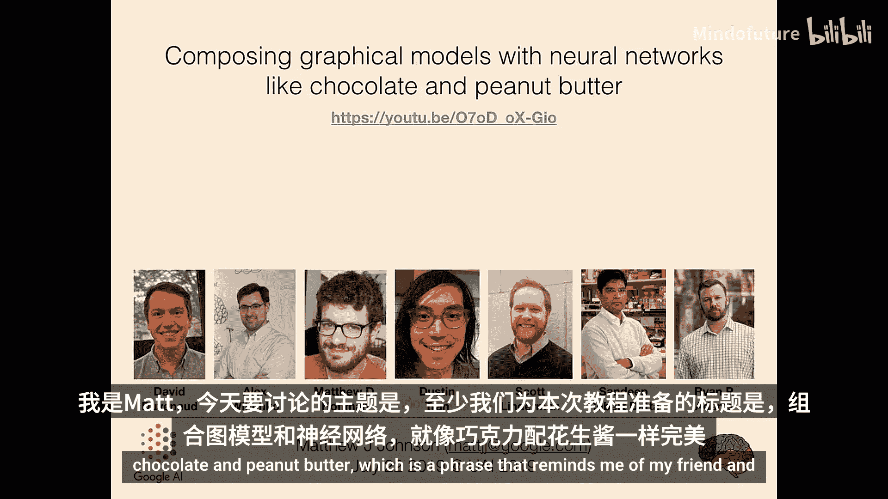
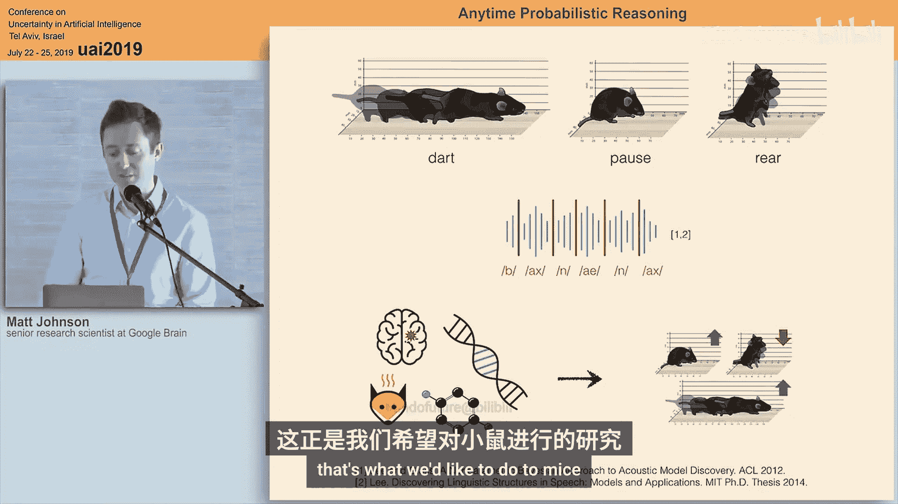
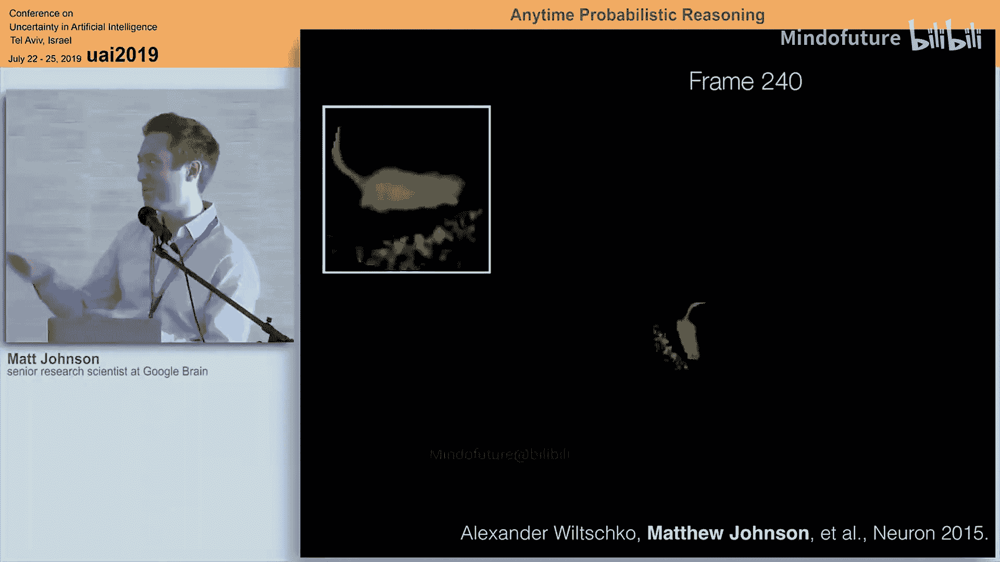
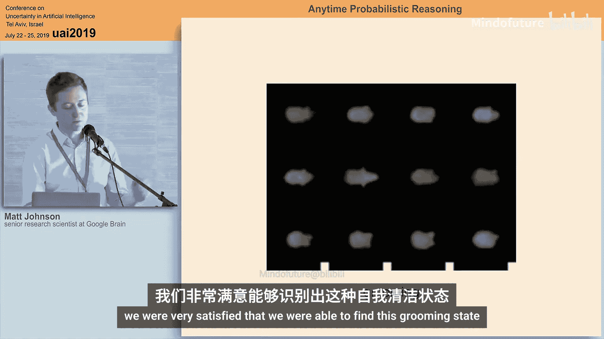
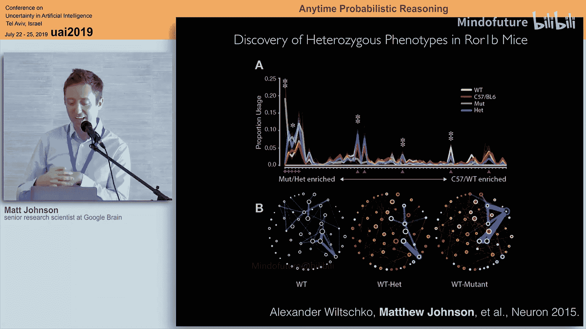
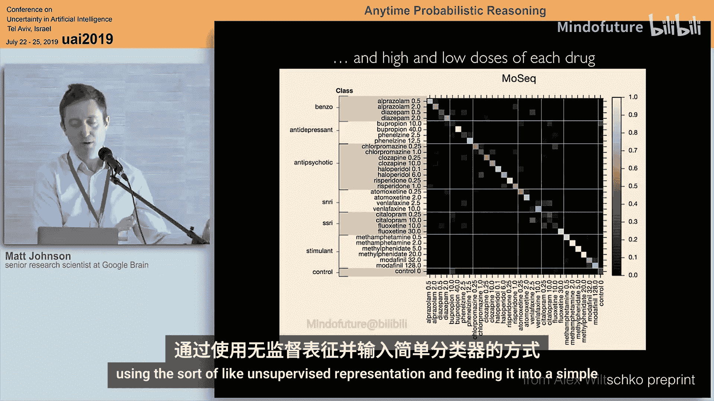
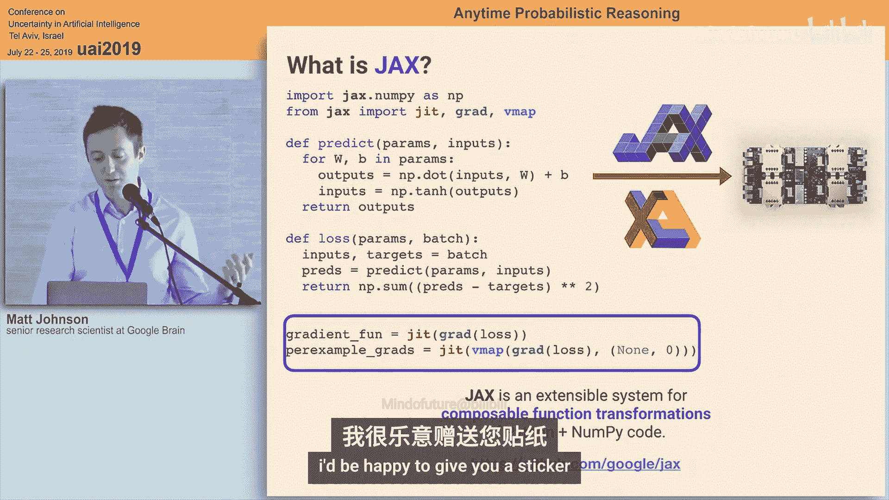

#  022：用神经网络组合图模型



## 概述

在本教程中，我们将探讨如何将概率图模型与深度神经网络相结合。我们将从图模型和指数族的基础知识开始，然后讨论如何利用自动微分技术，构建能够处理复杂数据（如视频）的复合模型。最后，我们将看到这种结合如何应用于实际问题，例如从小鼠行为视频中自动发现行为单元。

---

## 动机：为什么结合图模型与神经网络？





上一节我们介绍了教程的主题。本节中我们来看看为什么需要将概率图模型与深度神经网络结合起来。

概率图模型擅长以规定的方式组织和约束信息，便于我们编码先验知识和不确定性。然而，其严格的假设常常导致模型与复杂数据（如图像）不匹配。

另一方面，深度神经网络极其灵活，能够建模图像等高维复杂数据。但其内部表示通常是难以解释的“黑箱”，我们很难为其注入结构化的先验知识。

这两种方法的优缺点似乎是互补的。因此，将它们结合起来，就像巧克力和花生酱一样，可能创造出更强大的工具。例如，在无监督学习中，我们希望学习一个数据变换，使得变换后的特征空间能够被简单的图模型（如高斯混合模型）很好地拟合。

---

## 图模型基础

上一节我们讨论了结合的动机。本节中我们来回顾一下概率图模型的基础知识。

图模型的核心思想是使用图（一种组合对象）来描述随机变量集合中的概率结构。这主要通过两种方式实现：
1.  **条件独立性语义**：图描述了随机变量之间的条件独立关系。
2.  **密度分解**：图描述了联合概率密度的代数分解结构。

### 无向图模型

一个无向图 `G` 由顶点集 `V` 和边集 `E` 组成，其中边是无序的顶点对。

**条件独立性**：我们说一组随机变量 `X` 在无向图 `G` 上是马尔可夫的，如果对于任意三个互不相交的顶点子集 `A`, `B`, `C`，当 `C` 分离了 `A` 和 `B`（即移除 `C` 后 `A` 和 `B` 之间没有路径相连），则有 `X_A` 独立于 `X_B` 给定 `X_C`。

**密度分解**：我们说一组随机变量的密度在无向图 `G` 上分解，如果其概率密度可以写成仅依赖于图中团（完全连接的子图）上变量的因子的乘积。例如，对于一个链式图 `X1 - X2 - X3`，其密度可分解为：
`p(x) ∝ ψ_12(x1, x2) * ψ_23(x2, x3)`

### 有向图模型

一个有向图同样由顶点集和边集组成，但边是有序的顶点对。

**条件独立性（D-分离）**：D-分离的规则与无向分离类似，但有一个关键例外：对于“碰撞”结构 `X1 -> X2 <- X3`，当不观测 `X2` 时，`X1` 和 `X3` 是独立的；但当观测 `X2` 时，`X1` 和 `X3` 可能变得相关。

**密度分解**：有向图模型的密度可以自然地分解为每个节点给定其父节点的条件概率的乘积：
`p(x) = ∏_v p(x_v | x_{pa(v)})`
这使其非常适合于生成式建模和 ancestral sampling。

### 条件随机场

条件随机场是一种特殊的图模型，其中势函数依赖于外部观测数据。这提供了一种将神经网络与图模型结合的早期方式：使用神经网络根据输入数据生成图模型的势函数。

---

## 指数族分布

上一节我们介绍了图模型的基本语义。本节中我们来看看与图模型紧密相关的数学工具——指数族分布。

一个指数族分布由以下要素定义：

1.  **充分统计量函数**：`T(x): X -> R^m`，这是一个将样本映射到有限维实向量的函数。
2.  **自然参数**：`η ∈ R^m`。
3.  **对数配分函数**：`A(η) = log ∫ exp(η^T T(x)) dx`，用于确保密度归一化。
4.  **概率密度**：`p(x; η) = exp(η^T T(x) - A(η))`

指数族有许多优良性质：
*   `A(η)` 是凸函数。
*   对数配分函数的梯度给出充分统计量的期望：`∇A(η) = E_{p(x;η)}[T(x)]`。
*   高阶导数给出累积量。
*   两个指数族成员之间的KL散度可以简洁地用 `A(η)` 表示。

**与图模型的联系**：许多图模型（如隐马尔可夫模型）都属于指数族。例如，一个二值链式HMM的联合分布可以写成指数族形式，其充分统计量为 `T(x) = [x1, x2, x3, x1x2, x2x3]`，自然参数矩阵具有三对角稀疏模式，对应链式图结构。

**关键观点**：如果我们能高效计算某个指数族的对数配分函数 `A(η)`，那么通过自动微分，我们可以免费获得该分布的期望统计量等各种量。这为构建算法库提供了强大基础。

---

## 组合与自动微分

上一节我们看到了指数族的威力。本节中我们来看看如何组合简单的、可处理的指数族来构建更复杂的模型，并利用自动微分实现通用算法。

### 组合模型

考虑一个切换线性动态系统作为例子：
1.  一个离散的隐马尔可夫链表示行为状态（如“奔跑”、“停顿”）。
2.  每个状态对应一个线性动态系统，用于在低维潜空间产生轨迹。
3.  最终，通过一个神经网络解码器将潜变量映射到观测图像。

这种组合模型的联合密度通常具有**多元线性多项式**的形式：
`log p(x) ∝ G(T1(x1), T2(x2), ...) = ∑_β θ_β ∏_{i in β} T_i(x_i)`
其中每个 `T_i` 对应一个可处理指数族的充分统计量。

### 通用算法

一旦模型被表述为上述形式，我们可以推导出通用的推理算法：

**吉布斯采样**：要采样变量块 `X_m` 给定其他块，其条件分布正比于 `exp(η_m^T T_m(x_m))`，其中自然参数 `η_m = ∇_{T_m} G(...)`。这可以通过对 `G` 函数自动微分得到。因此，只要我们为每个基本指数族提供了采样器，就能实现通用的块吉布斯采样。

**结构化平均场变分推断**：我们使用一个因子化的变分分布 `q(x) = ∏_m q_m(x_m)`，其中每个 `q_m` 属于一个可处理的指数族。优化变分下界可以通过坐标上升进行。更新第 `m` 个因子的自然参数同样涉及计算 `∇_{T_m} G(...)`，然后利用基本指数族的对数配分函数 `A_m` 的导数来计算矩。

以下是实现结构化平均场扫描的伪代码思路：
```python
def meanfield_sweep(G, A_list, eta_list):
    # eta_list: 当前变分自然参数
    # 1. 将自然参数转换为矩参数（通过微分A）
    mu_list = [grad(A)(eta) for A, eta in zip(A_list, eta_list)]
    # 2. 对每个因子m进行更新
    for m in range(M):
        # 计算新的自然参数
        eta_m_new = grad_Tm(G)(mu_list) # G对第m个统计量的梯度
        # 计算新的矩参数
        mu_list[m] = grad(A_list[m])(eta_m_new)
    # 3. 将更新后的矩参数转换回自然参数（可选）
    return mu_list
```

**核心优势**：通过将模型表示为多元线性多项式 `G`，并依赖自动微分，我们可以为一大类组合模型生成通用的采样和变分推理算法，而无需为每个新模型重新推导。

---

## 与神经网络的结合：结构化变分自编码器

上一节我们讨论了组合模型的通用算法。本节中我们来看看当解码器是复杂的神经网络时，如何将这些思想应用于实际。

### 挑战

当观测模型是简单的线性高斯模型时，我们可以使用高效的随机变分推断，利用自然梯度进行快速学习。然而，当解码器是神经网络时，观测似然 `p(y|x)` 变得复杂，导致：
1.  变分下界无法精确计算，只能通过蒙特卡洛估计。
2.  无法解析地得到局部变分因子的最优解。
3.  难以应用SVI和自然梯度。

### 解决方案：摊销推断与结构化先验

变分自编码器的核心思想是引入一个**识别网络（推理网络）**，将观测数据 `y` 直接映射到潜变量 `z` 的变分参数，从而摊销推理成本。

我们的工作（结构化VAE）旨在**最大限度地保留图模型的结构化推理优势**。关键思想是：神经网络只需要学习处理模型中“困难”的部分——即由复杂解码器产生的、难以处理的似然项。对于模型中已有的、可处理的图模型部分（如潜变量之间的马尔可夫链、线性动态关系），我们仍然使用精确或高效的近似推理算法。

具体来说：
1.  **识别网络**：输入观测序列 `y`，输出一组“证据势” `φ(y)`，这些势函数用于近似复杂的真实似然 `p(y|x)`，但形式简单（如高斯势）。
2.  **结构化推理**：将识别网络输出的势函数注入到原始的图模型（如SLDS）中。现在，我们面对的是一个势函数已知的、熟悉的图模型。
3.  **高效算法**：在这个增强的图模型上，运行之前讨论的高效推理算法（如基于消息传递的平滑算法）来计算潜变量的后验近似。
4.  **联合训练**：同时优化生成模型（解码器、图模型参数）和识别网络的参数，以最大化变分下界。

这种方法结合了双方的优势：
*   **神经网络**：提供了处理高维复杂观测（如图像）的灵活性。
*   **图模型**：在潜变量空间提供了可解释的结构、先验和高效推理。

### 应用示例：小鼠行为分析

回到最初的问题：从小鼠深度视频中自动发现行为单元。
1.  **模型**：使用一个切换线性动态系统作为潜变量模型，描述离散行为状态和连续的姿态动态。使用神经网络解码器从潜变量生成视频帧。
2.  **推理**：使用结构化VAE框架。识别网络观看视频片段，为每一帧输出关于潜状态的证据势。然后，在SLDS图模型上进行快速推理，得到行为状态序列和连续姿态的平滑轨迹。
3.  **结果**：模型成功地从无标注视频中发现了诸如“ rearing”（站立探索）、“grooming”（理毛）、“darting”（疾跑）等可解释的行为单元。科学家可以利用这些发现的状态进行进一步分析，例如研究光遗传学刺激或药物如何影响行为转换统计。

---

## 总结



在本教程中，我们一起学习了：
1.  **动机**：概率图模型与深度神经网络在可解释性、灵活性和推理能力上优势互补，它们的结合具有巨大潜力。
2.  **基础**：回顾了有向/无向图模型的条件独立性和因子分解语义，以及指数族分布的定义与性质。
3.  **核心机制**：展示了如何通过组合可处理的指数族来构建复杂模型，并利用多元线性多项式 `G` 和自动微分，实现通用的吉布斯采样和结构化变分推理算法。
4.  **实际结合**：介绍了结构化变分自编码器的框架，它通过识别网络处理复杂观测，同时在潜空间保留并利用图模型的结构进行高效推理。
5.  **应用**：以小鼠行为分析为例，展示了这种结合如何从原始视频中自动发现有意义、可解释的行为结构。







希望本教程能让您看到，将图模型的严谨结构与神经网络的强大表示能力相结合，不仅可行，而且能催生解决复杂实际问题的新方法。这个领域仍然充满机遇，等待大家去探索和构建更强大的工具与模型。