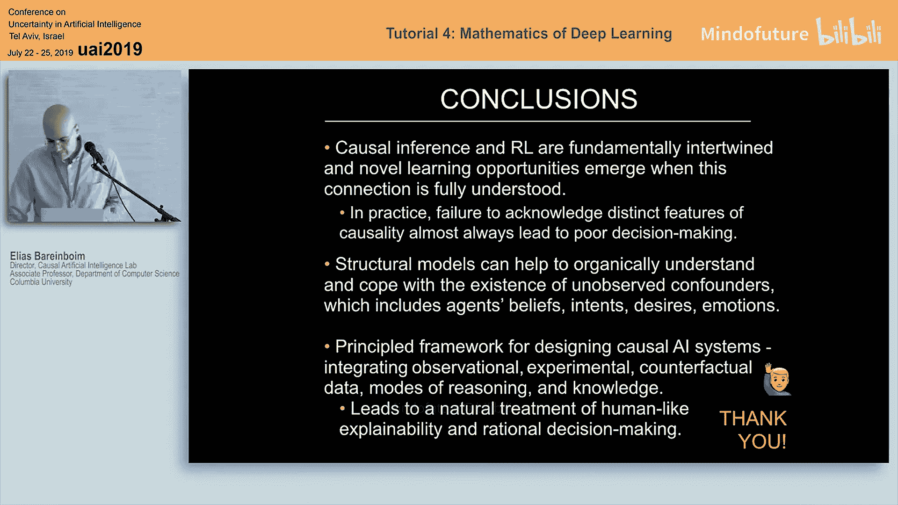

#  023：走向因果强化学习 👨‍🏫

## 概述
在本节课中，我们将探讨因果推断与强化学习之间的深刻联系。我们将看到，将因果推理的视角引入强化学习，不仅能帮助我们更深刻地理解智能体与环境的交互，还能揭示出传统方法所忽视的新挑战与机遇。我们将从基础概念出发，逐步构建一个整合的“因果强化学习”框架。

---

## 第一部分：强化学习与因果推断简介 📚

上一节我们概述了课程目标，本节中我们来看看强化学习和因果推断各自的核心思想。

### 强化学习（RL）的视角
强化学习是一种目标导向的学习范式，智能体通过与外部环境交互来最大化其获得的累积数值奖励信号。其核心在于**适应性学习**：智能体根据不断演化的特征集和自身行动历史来调整其行为。

一个简化的RL模型可以描述如下：
*   **环境** 由参数 `θ` 描述。
*   **智能体** 观察某个状态或上下文。
*   智能体基于其策略选择一个**行动** `a` 作用于环境。
*   环境返回一个**奖励** `r` 作为反馈。
*   智能体的目标是学习一个策略，以最大化其获得的**期望奖励**。

### 因果推断的视角
因果推断采用一种**基于过程**的方法来建模世界。其核心是**结构因果模型**，它将现实分解为一系列底层因果机制。

例如，考虑研究药物（`X`）对头痛（`Y`）的影响，同时考虑年龄（`Z`）因素。我们可以用两个方程描述这个过程：
*   `X = f_X(Z, U_X)`：服药决策是年龄和其他未观测因素 `U_X` 的函数。
*   `Y = f_Y(X, Z, U_Y)`：头痛结果是服药、年龄和其他未观测因素 `U_Y` 的函数。

其中，函数 `f_X` 和 `f_Y` 代表了底层的因果机制。我们通常不知道这些函数的具体形式（非参数化），但我们可以用**因果图**来编码变量间的依赖关系：如果变量 `A` 是变量 `B` 的因果机制（函数 `f_B`）的输入，则在因果图中就有一条从 `A` 指向 `B` 的箭头。

在因果推断中，我们关心的是**干预**的效果，而非单纯的关联。干预操作（记为 `do(X=x)`）意味着我们“用手”将变量 `X` 固定为某个值 `x`，从而打破其原有的因果机制。这会产生一个与观测分布 `P(Y|X)` 不同的**干预分布** `P(Y | do(X=x))`，后者才真正反映了 `X` 对 `Y` 的因果效应。

### 因果层级
结构因果模型诱导出一个三层级的推理阶梯：
1.  **关联层**：处理“看到”什么的问题，例如 `P(Y|X)`。传统的机器学习（分类、回归）主要在此层面操作。
2.  **干预层**：处理“行动”或“干预”的效果，例如 `P(Y | do(X))`。这是强化学习能够触及的层面。
3.  **反事实层**：处理“想象”与反思，例如“假如我当时做了不同的选择，结果会怎样？”。这涉及更复杂的反事实推理 `P(Y_X | X', Y')`。

拥有一个结构因果模型意味着可以在所有三个层面进行推理。

---

## 第二部分：通过因果透镜看学习 🔍

上一节我们分别介绍了RL和因果推断，本节中我们来看看如何将它们统一在一个框架下审视学习问题。

### 决策制定的统一目标
无论是因果推断还是强化学习，在决策制定中的核心目标都是学习一个策略 `π`，该策略产生一系列行动 `X_1, X_2, ..., X_n`，以最大化某个期望结果 `Y`（例如奖励），即最大化 `E_π[Y | do(X)]`。

根据数据来源和学习方式的不同，我们可以区分三种主要的学习模式：

以下是三种主要的学习模式：
1.  **在线学习**：智能体自己进行实验（干预），输入是实验数据对 `(do(X_i), Y_i)`，目标是学习干预分布 `P(Y | do(X))`。其**优点**是对未观测混杂因子稳健；**缺点**是实验可能成本高昂或不可行。
2.  **离策略学习**：智能体从其他智能体的行动中学习，输入是其他智能体在策略 `π` 下产生的数据 `(do(X_i), Y_i)`，目标是评估新策略 `π'` 下的效果。其**优点**是无需自行实验；**缺点**是严重依赖两个关键假设（A1：干预变量相同；A2：上下文/环境相同）。
3.  **无干预学习**：智能体仅被动观察其他智能体的行为，输入是观测数据 `(X_i, Y_i)`（无 `do` 运算符），目标仍然是推断干预效果 `P(Y | do(X))`。其**优点**是仅需观测数据；**缺点**是严重依赖对底层因果图 `G` 的了解，且在许多情况下因果效应可能不可识别。

### 传统范式的局限
到2014年左右，上述框架似乎为理解因果与RL的关系提供了一个清晰的图谱。但一个关键问题是：这些策略总是有效吗？将因果推断和强化学习分开研究，我们是否遗漏了什么？

答案是否定的。现实世界常常违反这些理想化的假设（例如存在未观测混杂因子、行动空间不匹配、上下文不同等），导致传统方法失效甚至产生有害结果。这引出了对更通用、更整合框架的需求。

---

## 第三部分：挑战与机遇 🚀

上一节我们指出了传统方法的局限，本节中我们将探讨因果强化学习面临的新挑战与机遇，这主要体现为四类新兴任务。

### 任务一：广义策略学习
现实中的学习场景往往是上述三种模式的混合，且理想假设常被违反。广义策略学习旨在**整合不同学习模式**，利用各自的优点，缓解各自的缺点。

**案例：从有偏的观测数据中学习**
假设我们想评估一种新药的效果。我们拥有大量来自医生的观测数据 `P(X, Y)`，但由于未观测的混杂因素（如社会经济状况），医生开药的方式存在系统性偏差，导致 `P(Y|X)` 高估了药效。如果我们将这些有偏数据直接作为先验用于在线学习（如汤普森采样），智能体可能会被误导，其表现甚至可能比完全不用这些数据、从头开始学习还要差。

**解决方案**：
1.  **边界分析**：不天真地假设 `P(Y|X) = P(Y|do(X))`，而是利用因果图结构，从观测数据中推导出 `P(Y|do(X))` 可能取值的**边界**。
2.  **边界感知的采样**：在在线学习过程中，利用这些边界来约束或拒绝不合理的样本，从而更安全、更高效地利用观测数据。这种方法可以证明比完全忽略观测数据收敛得更快。

### 任务二：何时与何处干预
传统RL通常预先固定要干预的变量，并假设干预总是有益的。但有时**不干预**、让系统自然演化可能是最优的。即使决定干预，选择哪个变量作为干预目标也至关重要。

**案例：选择干预目标**
假设我们想优化结果变量 `Y`，系统中有两个可操纵变量：`Z`（较远因）和 `X`（较近因）。直觉上，干预更接近 `Y` 的 `X` 可能控制力更强。但通过构造一个简单的因果模型（如 `Z = U, X = Z XOR U, Y = X XOR U`），我们可以发现，干预 `Z` 有时能达到比干预 `X` 更高的 `Y` 值。这挑战了“越近越好”的直觉。

**核心问题**：给定一个因果图，如何系统地确定**干预哪个（或哪组）变量**，以及**在什么条件下**进行干预，才能最优化目标？

### 任务三：反事实决策制定
传统RL智能体基于干预分布 `P(Y|do(X))`（群体层面）做决策，而不反思自身行为的原因。这可能导致其在特定环境下被利用而无法察觉。

**案例：贪婪赌场**
赌场通过研究顾客心理（如醉酒程度 `D`、机器闪烁 `B`），设置了一个“陷阱”：当顾客遵循其自然倾向（醉汉选闪烁机器，清醒者选安静机器）时， payout 很低（15%）；但当随机分配机器时，平均 payout 符合法规（30%）。一个传统的RL智能体（使用汤普森采样等）在赌场中学习，最终只能达到15%的胜率，因为它学习的是 `P(Y|do(X))`，而两种机器的这个值相同。

**解决方案：反事实准则**
智能体需要具备**反事实推理**能力。在决策时，它不应只问“如果我做 `X`，期望结果如何？”，而应问“**鉴于我当前正倾向于做 `X0**，如果我违背这个倾向去做 `X1`，结果会更好吗？”。这对应的是反事实量 `E[Y_{X=1} | X=0]`（处理对处理者的效应）。通过将这种反事实思考纳入决策准则，智能体可以识别并避免上述陷阱，最终收敛到更优的策略。

### 任务四：稳健性与可迁移性
智能体在一个环境中学习到的因果知识，如何能**迁移到另一个不同但相关的环境**中，从而最小化在新环境中的实验成本？这涉及到利用不同环境间共享的**结构不变性**。

---

## 总结 🎯

本节课中我们一起学习了因果推断与强化学习的深度融合。
*   我们首先回顾了强化学习的目标导向本质和因果推断的结构化世界观。
*   接着，我们通过“因果层级”和“学习模式”的框架，将两者统一起来，并指出了传统分离研究方式的局限。
*   最后，我们深入探讨了因果强化学习带来的四大挑战与机遇：**广义策略学习**（整合多种数据模式）、**何时与何处干预**（超越固定行动空间）、**反事实决策制定**（赋予智能体自我反思能力）以及**稳健可迁移性**（跨环境共享因果知识）。

核心结论是：因果推断与强化学习本质上是交织在一起的。充分认识并整合两者的独特优势，不仅能避免实践中因忽视因果结构而导致的决策失败，还能为设计具有可解释性、理性且适应性强的人工智能系统提供一个 principled 的框架。这条道路刚刚开启，充满机遇，需要大家的共同努力。