#  024：深度学习理论概述

在本教程中，我们将探讨深度学习背后的理论发展。我们将了解为什么神经网络能取得如此卓越的成果，并深入研究几个核心理论概念，包括泛化误差、对抗攻击的鲁棒性，以及如何利用神经网络解决优化问题。

## 第1.1节：引言与动机

大家好，我是Ra Jureus，是Viv大学的一名高级讲师，领导一个专注于深度学习和信号处理的研究小组。今天，我将为大家简要介绍深度学习领域近期的理论发展。

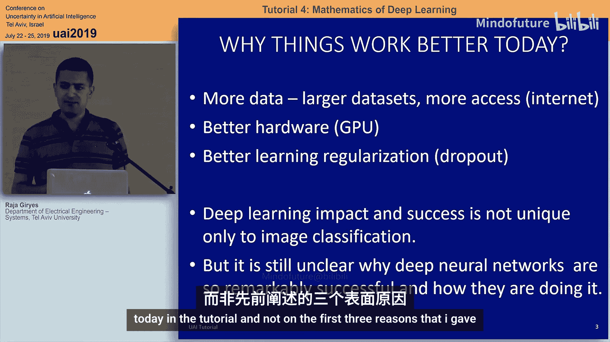

我知道这个领域的研究成果浩如烟海，我的介绍可能无法涵盖所有工作。如果遗漏了您的研究，请勿介意。我将尽力提供一个全面的概述，但正如大家所知，深度学习领域发展迅速，难以追踪所有进展。

众所周知，深度学习在过去七年产生了巨大影响。例如，在ImageNet数据集上，错误率从25%降至5%以下。在语音识别领域，2000年前有所发展，2010年前后进入平台期，而深度学习的引入带来了巨大改进。如今，越来越多的领域正享受着深度学习带来的实证进展。

一个核心问题是，为什么神经网络能取得如此好的效果？神经网络并非新事物，我们在60年代有感知机，90年代有与今天非常相似的神经网络。许多人给出了三个主要原因来解释其成功：我们拥有更多数据、更强的硬件以及更好的正则化技术（如批归一化、Dropout等）。

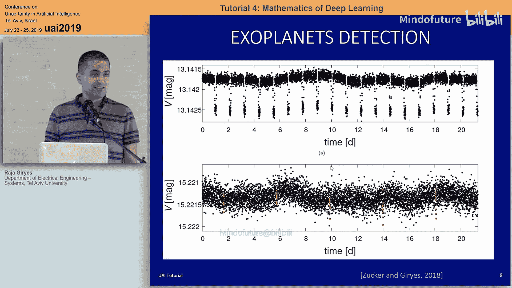

然而，这三个原因只解释了为什么神经网络在今天而非90年代取得成功，但并未回答为什么是神经网络，而不是其他同样受益于大数据、强计算和更好正则化的技术，在众多基准测试中取得了最佳结果。我认为，回答“为什么是神经网络”这个问题更为重要，这也是本教程将重点探讨的内容。

## 第1.2节：深度学习的实证成功案例

神经网络在许多应用领域取得了突破性成果。以下是我们研究小组的一些工作实例，以提供一些实践背景。

*   **图像去噪**：我们设计了一种方法，将分类器与去噪器结合。首先将图像输入分类器确定类别，然后使用为该类别设计的特定去噪器进行处理。这种方法能很好地恢复图像细节，且无需使用生成对抗网络即可获得优异效果。
*   **单镜头3D成像**：我们设计了一种可附加在镜头上的面罩，使得仅用单个镜头即可获取3D信息。有趣的是，我们使用神经网络同时设计了重建网络和光学元件本身。
*   **光场成像**：传统光场成像需要多个镜头或时间调制。我们通过添加一个编码不同角度的掩模，并利用网络自动学习这个掩模，从而从编码测量中重建所有视角和深度信息。
*   **系外行星探测**：我们与Childuker教授合作，利用深度学习探测系外行星。通过分析恒星亮度的周期性微弱下降，神经网络可以帮助探测遥远行星。
*   **手机图像信号处理器替代**：我们设计了一个端到端的神经网络，以替代手机中复杂的图像信号处理管线，并在视觉质量等方面取得了更好效果。
*   **不规则数据上的深度学习**：我们研究了如何将神经网络应用于非网格数据。例如，在部分形状对齐任务中，我们训练网络将部分扫描的飞机模型与完整模板进行匹配。另一项工作中，我们训练网络在网格上进行简化，根据任务（如检测手柄或颈部）保留相关结构。

以上只是我们小组的部分工作，全球许多研究小组都在利用神经网络取得出色的成果。一个共同点是，神经网络的结果通常远优于传统方法。例如，在网格分类和形状对齐任务中，神经网络的准确率显著高于传统技术。

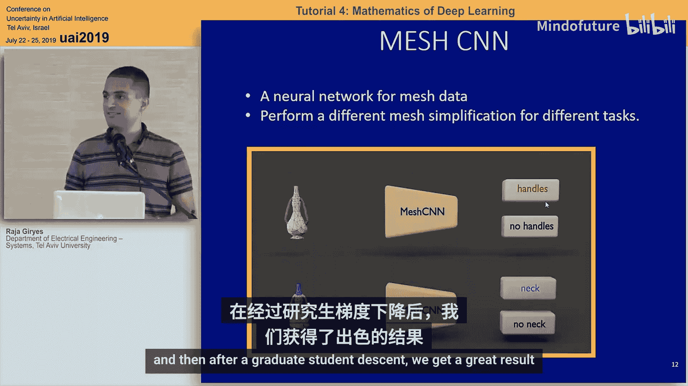

然而，作为研究者，令人失望的一点是，我们虽然取得了好结果，并有一些直觉和经验法则，但并不真正理解其深层原理。我们通常通过堆叠层、添加跳跃连接、调整归一化或学习率等方式进行试错，最终由研究生通过大量实验获得好结果。问题是，我们能否找到更系统的方法来设计网络？理解深度学习背后的理论至关重要。

## 第1.3节：神经网络架构搜索与理论需求

一些人可能认为我们不需要理论，因为现在有了神经架构搜索。例如，我们与阿里巴巴合作的一项工作表明，计算机可以自动学习最佳的网络结构，而无需人工设计。这确实能快速设计出比人工设计错误率更低的网络。

尽管深度学习的实证发展非常迅速，但我认为理解其根本原理仍然重要。作为研究者，以更基础的方式设计系统、理解其内在机制是必要的。例如，在自动驾驶等安全关键领域，我们需要信任并理解神经网络的行为。

神经网络的基本组件非常简单：线性操作后接非线性激活函数。我们不断堆叠这种简单结构，使用卷积、循环连接或跳跃连接等变体，并使用ReLU、Sigmoid等简单非线性函数或池化操作。然而，正是这种简单的结构组合，产生了我们尚不完全理解的强大能力。

在剩余时间里，我将尝试介绍深度学习现有理论的一个样本。首先概述一些现有成果，然后重点介绍我们小组的两项工作。

## 第1.4节：深度学习的核心理论问题

关于神经网络，我们可以提出许多问题：

*   **网络结构的特殊性**：深度神经网络结构有何特别之处？
*   **网络能力**：深度神经网络的表达能力如何？是否存在其无法解决的问题？
*   **所需训练样本量**：训练一个网络需要多少样本？这在工业界尤为重要，因为数据标注成本高昂。
*   **激活函数的作用**：为什么ReLU比其他函数更常用？我们是否不知道如何使用其他函数？
*   **数据在层间的变化**：数据在通过各层时发生了什么？我们能否利用中间层的信息？
*   **网络深度的作用**：我们知道更深通常更好，但原因是什么？
*   **池化的作用**：池化操作扮演什么角色？

回答这些问题对网络设计、数据标注和架构选择具有重要意义。

我们有一篇名为《深度学习数学》的综述论文，虽然已有一年半历史，但它对神经网络的主要理论和问题进行了很好的概述。如果您感兴趣，可以在arXiv上找到它。

## 第1.5节：现有理论成果样本

以下是一些重要的现有理论成果：

*   **通用近似定理**：表明神经网络可以近似任何可测的Borel函数。这意味着理论上可以用神经网络逼近任何函数。但该定理没有说明网络需要多大、参数多少以及如何训练。
*   **深度效率**：研究表明，与浅层网络相比，深层网络在参数数量上更高效。近似深层网络所需的浅层网络参数可能呈指数级增长。
*   **泛化误差**：许多工作研究了神经网络的泛化误差。早期结果（如Barron的界）表明，近似误差与函数平滑度和神经元数量有关，而泛化误差与神经元数量除以训练样本数有关。然而，现代过参数化网络的表现对这些理论提出了挑战。
*   **局部最小值与深度**：一些工作研究了局部最小值与网络深度的关系。
*   **信息瓶颈**：研究了神经网络与信息论中信息瓶颈的联系。
*   **不变性与任务**：研究了表示的不变性与神经网络旨在解决的任务之间的关系。
*   **散射变换**：Brunna和Mala研究了散射变换，它类似于神经网络，是卷积与小波变换的级联。研究表明，更深的级联能产生更复杂和不变的特征，这为我们理解普通神经网络提供了思路。

还有许多其他工作研究了神经网络的最小化、全局最优性等。例如，一些近期工作表明，过参数化神经网络能达到全局最小值，但这并不意味着良好的泛化，因为可能发生过拟合。

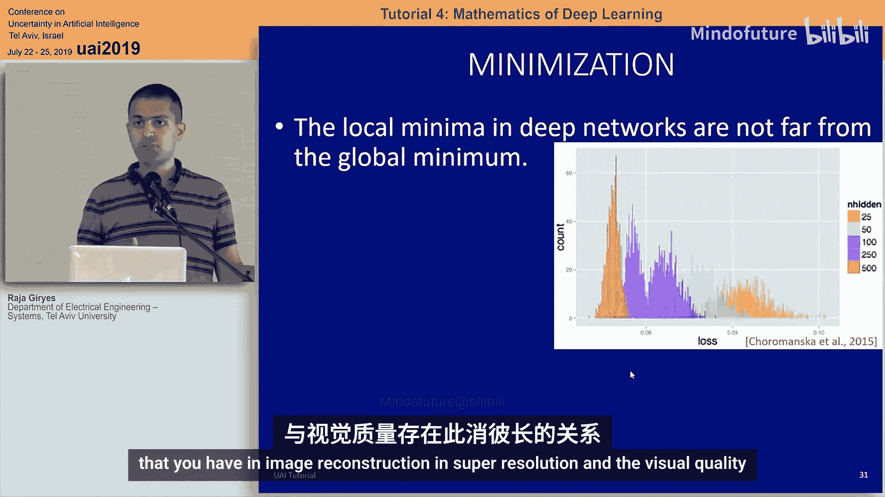

我们小组在神经网络理论方面也有一些成果。例如，我们研究了深度神经网络分类如何受数据角度的影响，以及泛化误差与不变性之间的关系。如果时间允许，我还会介绍关于“学习型ISTA”的工作，即如何用神经网络解决优化问题。

## 第1.6节：泛化误差深入探讨

现在，我将更深入地探讨泛化误差。为此，我推荐一篇我们与UCL的Miguel Rodriguez合写的关于深度学习泛化误差的综述论文。这篇论文总结了该领域的最新进展，并在文末列出了一些我们认为有趣的开放性问题。

为了理解神经网络为何表现良好，我使用以下示意图。考虑一个两类分类问题，有蓝色和红色数据点。神经网络通常在线性操作和非线性激活后，在末端使用Softmax或Sigmoid等线性分类器。在两类情况下，这相当于在特征空间中使用一个超平面进行分离。

有趣的是，这个特征空间中的线性分离平面对应于输入空间中的非线性分离曲线。因此，可以将神经网络的过程理解为：将数据转换到一个线性可分的特征空间，然后应用线性分类器。

与传统机器学习相比，第一部分对应于手工设计的特征，第二部分对应于应用SVM等分类器。传统方法的缺点在于两部分是分开设计的，可能导致最终解决方案不是全局最优。而神经网络的优势在于以端到端的方式同时设计两部分，尽管优化是非凸的，但针对整个问题的次优解可能优于两个分别最优但组合后非最优的子问题解。

我认为这是神经网络强大的原因之一。

## 第1.7节：泛化误差的形式化定义与重要性

在监督分类中，我们有一个带标签的训练集，目标是最小化训练集上的误差。但我们真正感兴趣的是在未见过的测试集上的误差。测试误差（期望风险）与训练误差（经验风险）之间的差异称为泛化误差。

仅仅减少泛化误差是不够的，因为随机分类器的泛化误差可能为零，但性能很差。同样，仅将训练误差降至零（如使用最近邻分类器）也可能导致泛化能力差。因此，我们需要同时最小化训练误差和泛化误差，以使测试误差尽可能小。

我希望这能说服您泛化误差的重要性。许多研究关注泛化误差，并开发了许多正则化技术来减少它。

## 第1.8节：泛化误差的理论界限与挑战

许多理论结果给出了神经网络泛化误差的界限。例如，Shaftz和Ben David的界表明，泛化误差与参数数量的平方根乘以log(L)/L成正比。这意味着更多的训练样本会降低泛化误差，但更多的参数会增加误差。然而，现代过参数化网络泛化良好，这与该理论相悖。

另一个基于Rademacher复杂度的界表明，泛化误差与权重Frobenius范数的乘积有关，但包含一个2的深度次方的因子。对于100层的ResNet，这个界会变得极大，不切实际。

Goictel等人改进了这个界，使其与网络深度无关，而依赖于权重的谱范数和Frobenius范数。然而，这些基于复杂度度量的界通常对数据不敏感。

Zhang等人的开创性工作表明，相同的网络架构在真实数据上泛化良好，但在随机标签数据上会过拟合。这意味着泛化必须考虑数据的结构。忽略数据结构的泛化界遗漏了重要信息。

Iha Bo等人表明，在真实数据上训练后，网络权重通常非常冗余。可以对网络进行剪枝，剪枝后的参数数量更少，此时依赖于参数数量的泛化界再次变得合理。而在随机数据上训练的网络则难以剪枝。

其他工作表明，随机梯度下降本身作为一种正则化器，可以提高泛化能力。Brukuus等人证明，在某些假设下，两层神经网络能收敛到全局最小值并泛化良好，这连接了优化和泛化。Daniel Sori等人表明，使用Softmax损失可以增大网络间隔，而大间隔有助于泛化。

## 第1.9节：我们的泛化误差界与雅可比正则化

在我们的工作中，我们研究了泛化误差与网络输入间隔之间的关系。我们证明，泛化误差的界与数据覆盖数除以某个因子有关。覆盖数是指覆盖某个集合所需半径为γ的球的数量。集合越复杂，所需覆盖数越大；球半径γ越大，所需覆盖数越小。

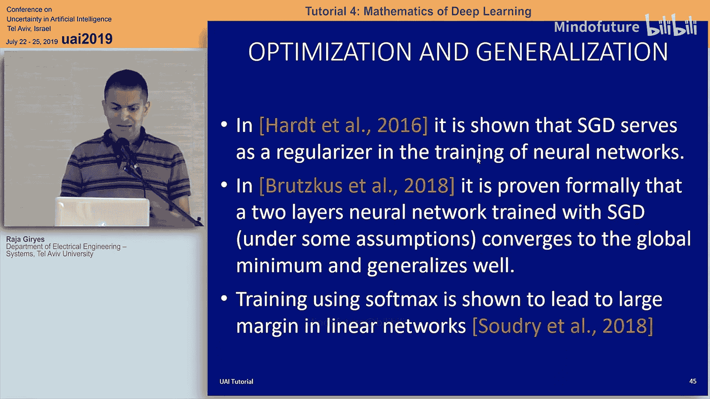

这里的参数γ就是网络的输入间隔。输入间隔越大，泛化误差越小。然而，计算网络的输入间隔是一个NP难问题。幸运的是，我们可以为其推导一个下界。

我们推导的下界将输入间隔与输出间隔联系起来：输入间隔 ≥ 输出间隔 / 网络雅可比矩阵的谱范数 ≥ 输出间隔 / 权重的谱范数乘积，再乘以与权重Frobenius范数相关的项。

在泛化误差界中，我们希望输入间隔尽可能大。由于无法直接控制输入间隔，我们转而尝试增大其下界。下界中的输出间隔可以通过标准训练（如使用SVM的合页损失或Softmax损失）来最大化。因此，为了增加正则化效果，我们需要减小分母。

在最弱的下界中，分母是权重Frobenius范数的乘积。减小Frobenius范数正是L2正则化（权重衰减）所做的。但有趣的是，我们发现一个更好的下界与网络的雅可比矩阵有关。

我们的界表明，与其减少权重的Frobenius范数，不如在训练网络时减少网络的雅可比矩阵，因为雅可比矩阵能为输入间隔提供更紧的近似。

我们通过实验验证了这一想法，比较了权重衰减和我们的新方法——雅可比正则化。在多个数据集（如MNIST、CIFAR、ImageNet）上的实验表明，使用雅可比正则化总能获得比权重衰减更好的结果。这一理论结果与实证观察相符。

我认为，作为研究社区，我们应该致力于发展更多能提供实用工具的理论成果。这个结果表明，提高泛化误差的一种方法是增大间隔。显然，雅可比正则化不是唯一方法。Google的Sam Bengio小组最近发表了一篇论文，提出了其他增大网络间隔的技术，也能改善训练。

## 第1.10节：不变性与泛化误差

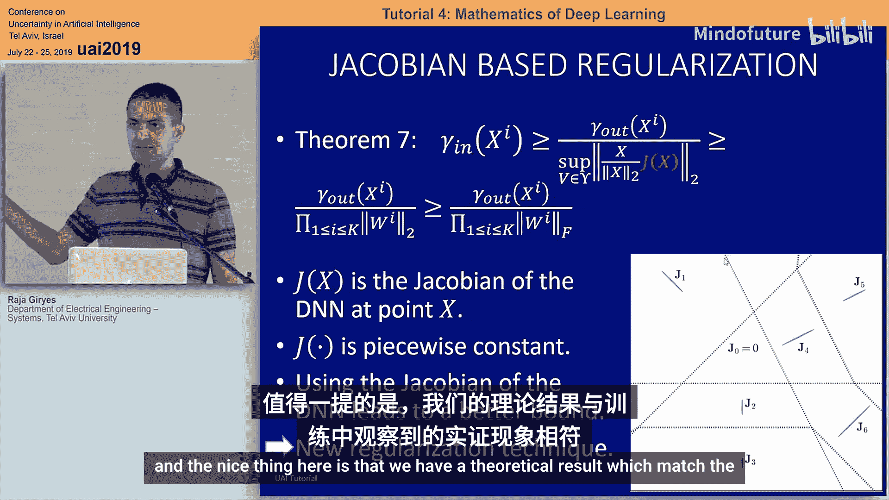

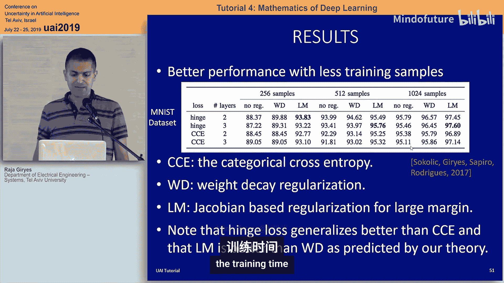

在后续工作中，我们研究了数据不变性与网络不变性之间的关系。我们提出了一个问题：如果数据对于给定任务的某些变换具有不变性（例如，猫的分类对猫在图像中的位置不变），那么设计一个对这些变换具有固有不变性的分类器是否会改善泛化？

我们证明，如果一个分类器在构造上对T种变换具有不变性，那么其泛化误差将比另一个不具备这种不变性的分类器好√T倍。这意味着，如果我们对数据有先验信息，可以设计出固有不变的分类器，从而改善结果。

如今，许多人使用数据增强来帮助分类器学习不变性。但我们的理论和实验表明，如果使分类器固有不变，可以进一步改善结果。例如，使用不变滑动窗口、在特征层面强制不变性，或使用部分Transformer等方法，都能显著提高性能。

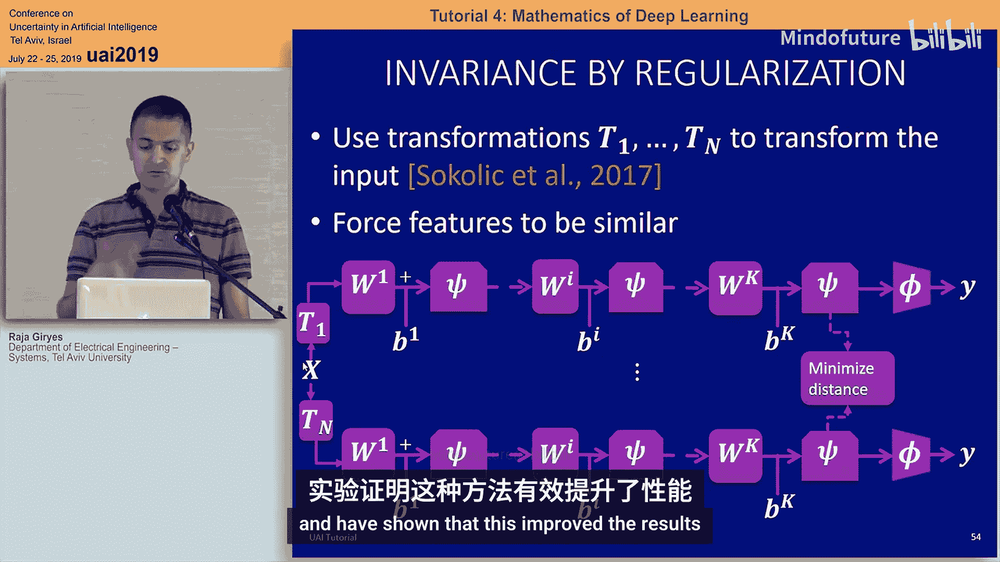

## 第1.11节：对抗攻击的鲁棒性

接下来，我将讨论神经网络对对抗攻击的鲁棒性。对抗样本是指对输入进行微小扰动（人眼难以察觉），导致神经网络做出错误分类的现象。例如，改变气球图像的少量像素，网络可能将其分类为红酒。

这种现象在各类神经网络中普遍存在，并且具有可迁移性：欺骗一个网络的扰动往往也能欺骗其他网络。甚至可以在不了解网络结构的情况下进行黑盒攻击。还有毒化攻击，通过改变训练数据中的少量标签来影响整个训练过程。

理解对抗攻击至关重要，因为在未来，如果自动驾驶汽车等系统被对抗样本欺骗，可能导致严重后果。

## 第1.12节：对抗攻击的解释与防御方法

对于对抗攻击存在多种解释。有人认为对抗样本就像实数中的有理数，无法完全避免。其他工作表明，正曲率的决策边界更容易受到通用扰动的影响。

防御方法旨在提高网络的鲁棒性或检测攻击是否发生。我将重点讨论提高鲁棒性的方法。

有许多攻击方法试图欺骗网络，如快速梯度符号法、雅可比显著图、DeepFool或Carlini-Wagner攻击。大多数攻击试图以最小的输入变化（在L2、L1或稀疏像素上）来改变网络输出。

防御方法包括对抗训练（使用真实样本和对抗样本一起训练）、蒸馏（ surprisingly有效）、输入梯度正则化等。我们将介绍雅可比正则化，这种方法与我们之前提到的泛化误差工作相关。

## 第1.13节：雅可比正则化用于鲁棒性

我们采用的方法是正则化网络雅可比矩阵的Frobenius范数。我们将此作为后处理步骤应用于已训练的网络，以减少计算开销并允许使用预训练网络。

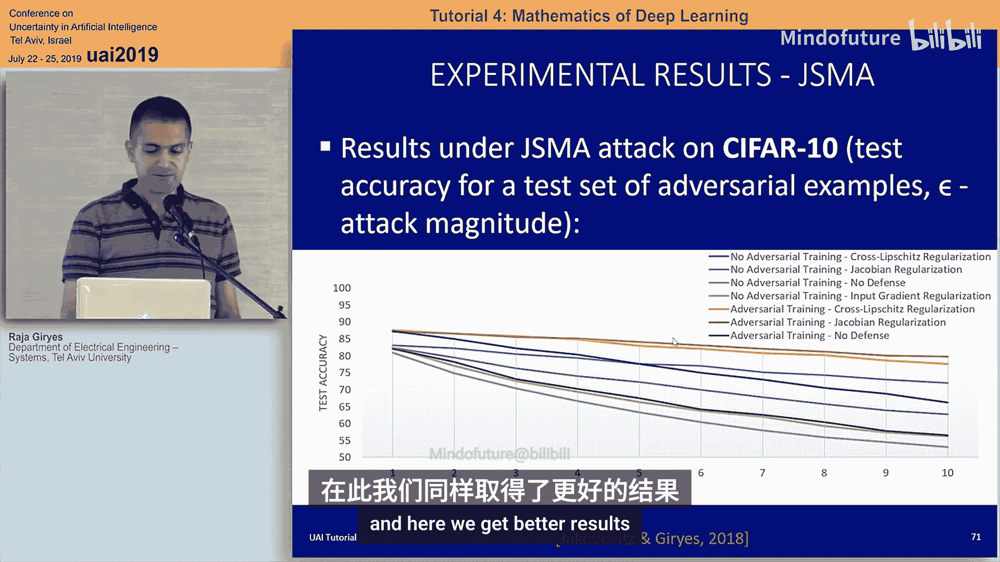

这种方法有效的原理是，我们分析了一种流行的攻击方法——DeepFool。DeepFool试图最大化网络输出对于扰动样本与原始样本之间的距离，同时最小化输入层面的扰动距离。我们证明，这个比率的上界与网络各输出雅可比矩阵之和有关，进而受网络雅可比矩阵Frobenius范数的约束。

因此，如果减少雅可比矩阵的范数，就能降低攻击成功的概率。我们通过实验验证了这一技术，并与对抗训练、输入梯度正则化等方法进行了比较。结果表明，在大多数情况下，雅可比正则化能取得更好的效果。

同样，更好的理论理解帮助我们开发了更好的防御技术。虽然这不是今天最好的技术，但在计算复杂度相似的方法中，我们获得了更好的结果。

我们还证明了攻击所需距离的上界与网络雅可比矩阵的倒数有关，因此减少雅可比范数会增加攻击所需距离。此外，网络决策边界的高曲率与对抗攻击的脆弱性相关，而曲率的一个近似正是雅可比矩阵的转置乘以雅可比矩阵。因此，减少雅可比Frobenius范数（即雅可比矩阵的迹）也能降低曲率，从而提高鲁棒性。

## 第1.14节：使用神经网络解决优化问题

最后，我将讨论如何使用深度神经网络解决优化问题，并加速某些逆问题的求解。这对于嵌入式系统或小型系统尤为重要。

我将从一些通用的数学公式开始，然后讨论如何使用迭代方法求解，最后展示这些迭代方法与神经网络的关系。

考虑一个测量模型：**x = Az + noise**，其中z是未知变量，A是测量矩阵。例如，z可以是图像，A可以是下采样操作，x是低分辨率图像。目标是从x中恢复高分辨率图像z。

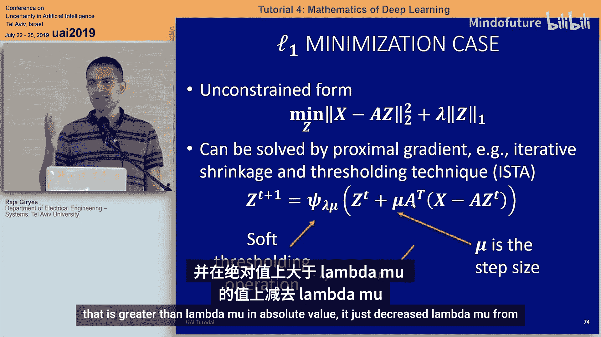

在经典技术中，标准恢复方法通常具有以下形式：最小化 **||x - Az||₂²**，并使得z属于某个子空间，或者无约束形式：最小化 **||x - Az||₂² + λf(z)**，其中f(z)是正则化项。

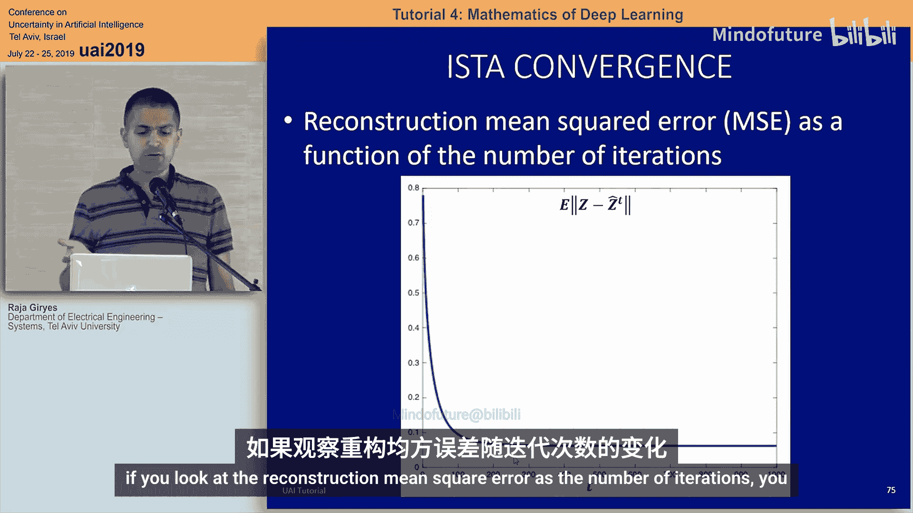

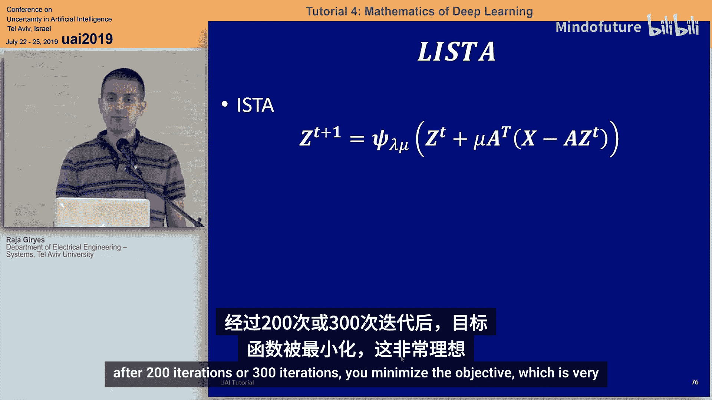

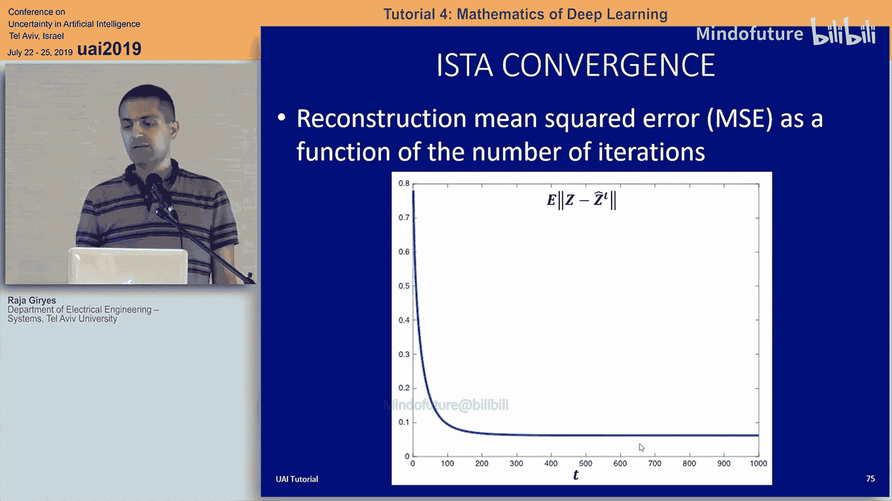

一种流行的惩罚函数是L1范数，与稀疏性和压缩感知相关。求解该最小化问题的流行技术是近端梯度法，也称为迭代收缩阈值算法。

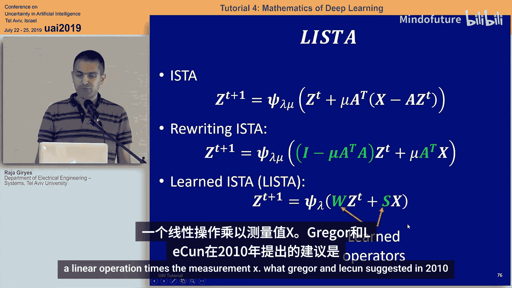

ISTA的更新步骤为：**z_{t+1} = S_{λμ}(z_t - μAᵀ(Az_t - x))**，其中S是软阈值算子。这相当于一个梯度步长后接一个简单的逐点操作（类似于ReLU）。该算法需要很多次迭代才能收敛。

为了实时或更快地获得解，人们提出了许多加速技术，如FISTA。在本教程中，我将重点介绍深度学习的解决方案。

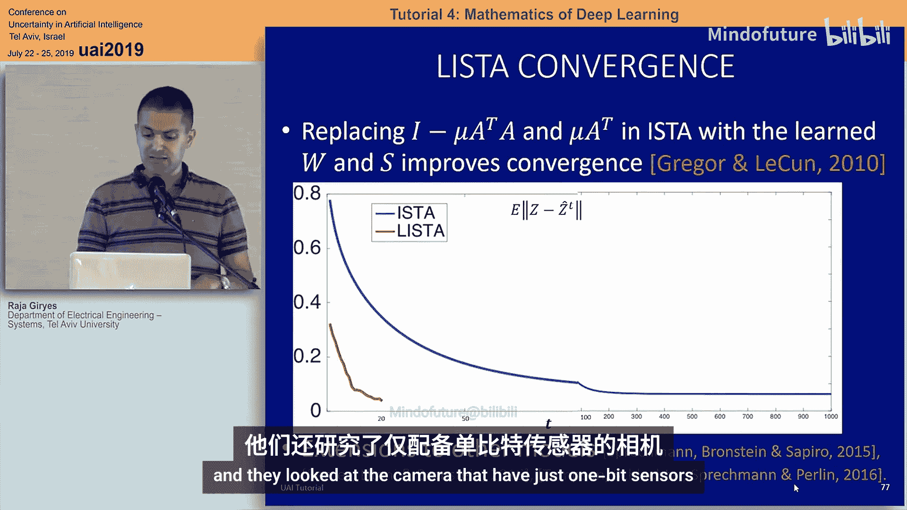

## 第1.15节：从ISTA到学习型ISTA

我们可以将ISTA重写为：**z_{t+1} = S_{λ}(W₁z_t + W₂x)**。Gregor和LeCun在2010年提出，可以用两个可学习的矩阵替换这里的线性操作。他们通过“展开”ISTA迭代来学习这些矩阵：运行ISTA 1000次迭代，获得输入-输出对，然后训练这个展开结构的参数。这样，我们就得到了一个神经网络。

神奇的是，当在新的样本上运行这个学习到的网络（LISTA）时，仅用20层就能达到与ISTA数百次迭代相近的误差，而20层LISTA的计算复杂度仅相当于20次ISTA迭代。这似乎令人惊讶，而且这种方法不仅适用于L1模型，几乎可以用于任何模型。

问题是，为什么这能奏效？我们可以将LISTA视为一个神经网络，其中包含线性操作、类似ReLU的软阈值非线性以及反馈（类似于循环神经网络）。为了理解其工作原理，我们将其与另一种结构进行比较。

## 第1.16节：理论解释：不精确近端梯度下降

我们提出了对LISTA的解释。我们比较了ISTA和投影梯度下降。PGD算法在每次迭代中应用线性操作和投影。Oymak等人为PGD算法提供了理论，表明其收敛速度与一个参数ρ有关，而ρ与集合C_f的高斯平均宽度相关。如果数据复杂（高斯平均宽度大），则收敛慢；如果数据简单（高斯平均宽度小），则收敛快。

我们的思路是：为了使收敛更快，可以使用一个具有更小高斯平均宽度的集合进行投影。但原始信号所在的集合可能很复杂，投影操作本身也很复杂。因此，我们可以使用对该集合的近似投影，这会引入误差ε。

这样，我们就有了一个权衡：使用更简单的投影（更快收敛）但会引入近似误差。最终误差界包含收敛项和误差项ε。理论上，我们可以使用这种不精确PGD算法。

这个理论可以解释为什么神经网络能获得加速：网络可以学习这种不精确的投影。在最初几次迭代中，我们可以容忍较大的不精确性以获得快速收敛；当接近解时，可以减少不精确性以消除误差。

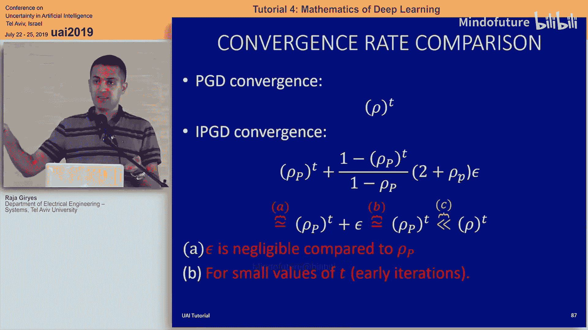

我们在树状结构稀疏模型上测试了这种算法。使用精确的树投影PGD收敛快但投影复杂；使用仅投影到叶子节点的不精确PGD收敛快但误差大；使用更多层级的不精确PGD收敛快且误差较小；而使用变化层级的不精确PGD（开始时用简单投影，随后增加复杂度）能实现快速收敛和低误差。

我们认为，这种机制可以解释为什么神经网络能获得加速：它可以学习这种不精确的投影。如果你只想在5次迭代内得到解，你并不关心是否添加了一些不精确性，只要它能带来更快的收敛。因此，我们在投影的不精确性和由于投影集合带来的收敛速度之间存在权衡。

我们还将这种学习到的IPGD应用于超分辨率等问题，取得了更好的重建结果和更快的收敛速度。这种理解还引导我们提出了LISTA混合模型，使用多个投影以实现更快的收敛。

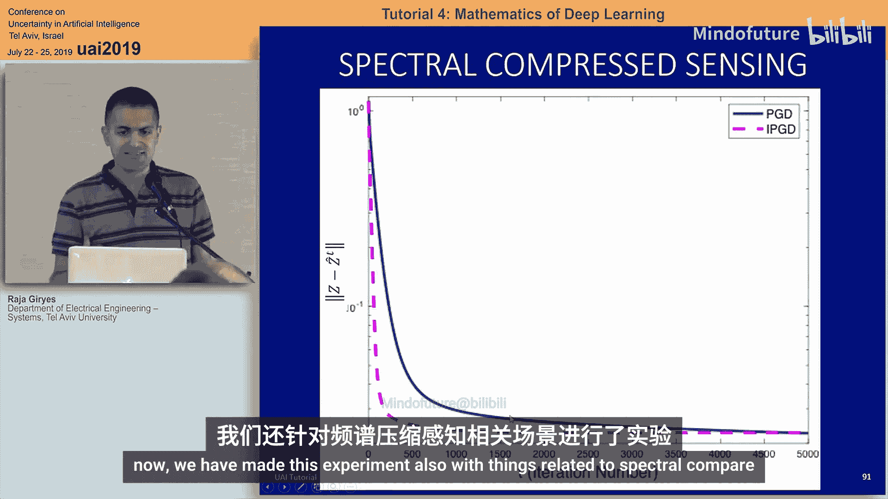

还有其他工作为LISTA的有效性提供了解释。例如，Bruna等人认为学习可能源于对A的更好的预条件处理；Sinai等人展示了与限制等距性质的关系；我们的工作则考虑了更一般的情况。

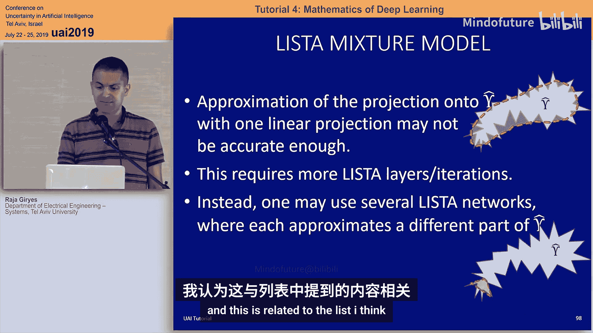

## 第1.17节：总结

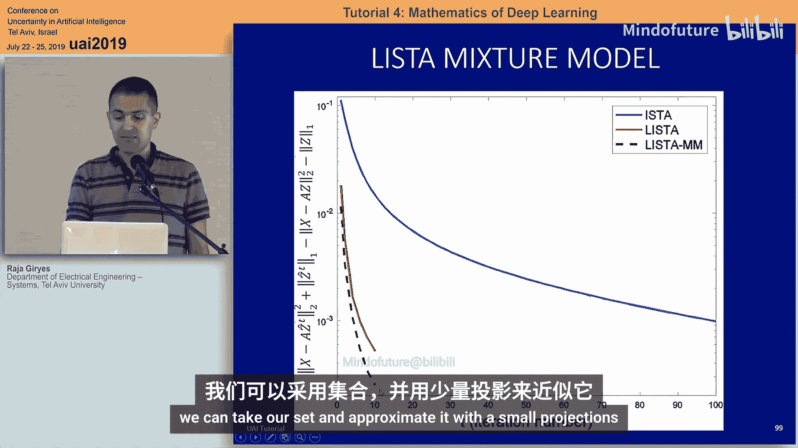

本教程的主要要点是：

1.  深度神经网络取得了巨大成功。
2.  我们迫切需要更好地理解其成功背后的原因。
3.  理论成果不应仅停留在理论层面，更好的理论理解可以帮助我们开发新的实用工具。
    *   在泛化误差方面，我们利用理论界推导了新的基于雅可比的正则化技术，提高了网络输入间隔并获得了更好结果。
    *   在理解神经网络如何解决优化问题方面，理论为我们提供了设计新网络结构以获得更快收敛速度的工具。
    *   在对抗攻击鲁棒性方面，理论理解帮助我们设计了新的正则化技术以改善鲁棒性。

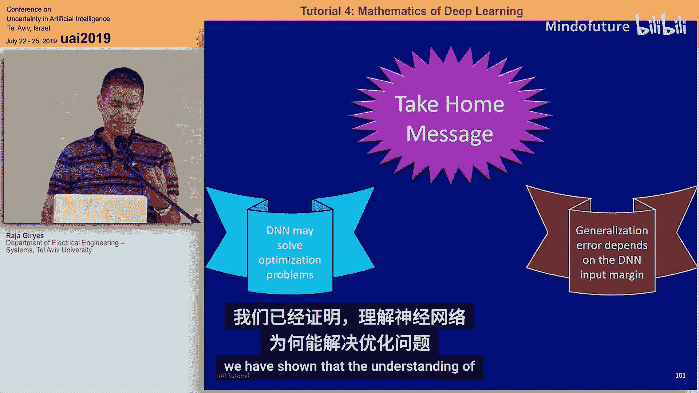

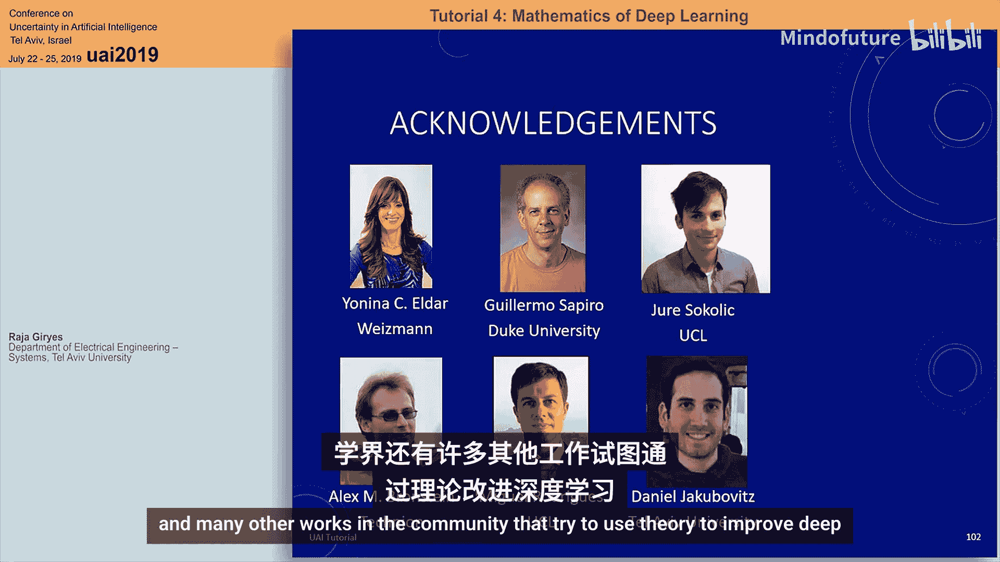

总之，本教程展示了理论如何指导实践，并强调了在深度学习领域进行理论探索的重要性。