#  002：MDP基础、模仿学习与价值函数 🧠

在本节课中，我们将学习强化学习的基础，特别是马尔可夫决策过程（MDP）的数学框架。我们不会试图覆盖现代深度强化学习的全部内容，而是专注于与大型语言模型强化学习及测试时扩展直接相关的部分。在背景知识上，我们假设您对神经网络和反向传播有一定了解，但不要求您事先熟悉强化学习。

## MDP基础

强化学习考虑的是在马尔可夫决策过程中的序贯决策。强化学习与监督学习（如图像分类）的关键区别在于序贯决策方面。例如，在监督学习中，模型查看一张图片并判断其包含的是狗还是猫，这是一个单一决策。而在强化学习中，智能体需要在一段时间内做出多个决策以实现某个目标，例如下棋或控制自动驾驶车辆。

智能体行动的环境被称为马尔可夫决策过程，简称MDP。MDP中有一个时间概念，它可以是字面意义上的时间（如秒），但通常对应于一系列序贯决策的步骤，例如棋类游戏中的回合数。为了简化，并考虑到大型语言模型强化学习的目的，我们将时间视为离散变量，从0开始，到终止时间T结束。

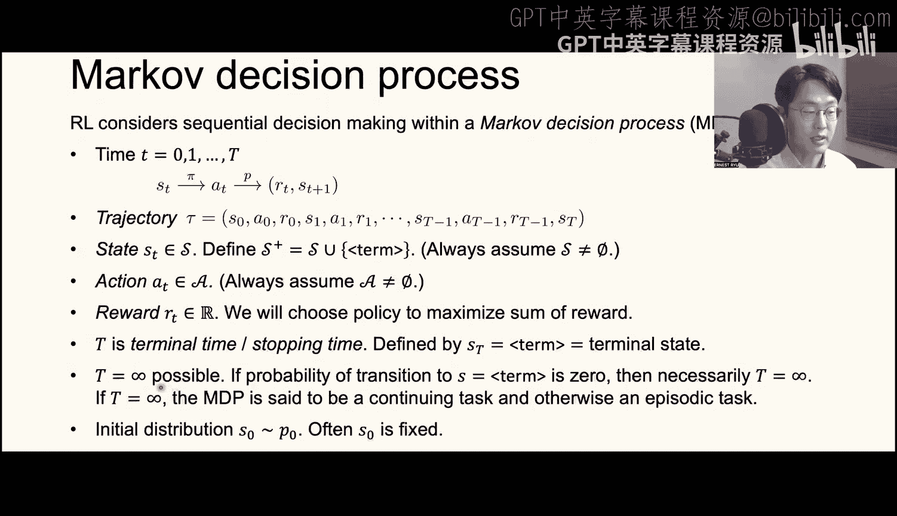

### MDP的动态过程

在MDP中，动态过程如下：在时间t，系统处于状态S_t。策略π（代表智能体的行为）会查看当前状态并选择一个动作A_t。给定状态和动作，环境会根据一个转移概率P产生一个奖励R_t和下一个状态S_{t+1}。

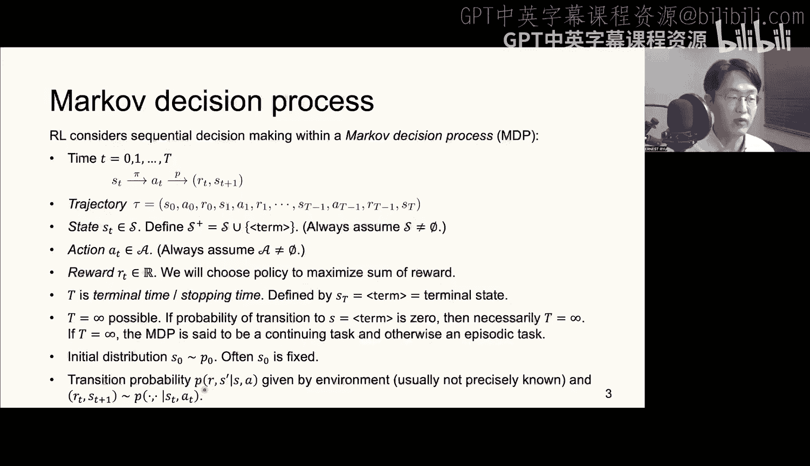

整个MDP的动态过程或智能体在其中的行动轨迹记为τ。它从初始状态S_0开始，智能体采取动作a_0，获得奖励r_0，并根据环境转移到状态S_1。然后策略再次根据S_1选择动作a_1，获得奖励r_1，如此继续，直到在状态S_T终止。

状态存在于一个状态集合S中。我们定义非终止状态集合与终止状态的并集为S^+。为了非退化性，我们总是假设MDP的状态集合非空。同样，动作集合A也假设为非空。在时间t，智能体收集的奖励R_t是一个实数（标量），我们假设它是有限的（非正/负无穷）。在MDP中，我们选择一个策略来最大化奖励之和，具体目标稍后解释。奖励定义了MDP中的目标。

大写T表示终止时间或停止时间。轨迹或片段从状态0开始，智能体在环境中行动，环境决定状态如何演化，并在时间T结束，定义为S_T等于终止状态。有些MDP可能没有终止状态，此时终止时间T为无穷大。如果转移到终止状态的概率为0，则终止时间必然为正无穷。当终止时间为正无穷时，MDP被称为持续性任务；当终止时间有限时，任务被称为片段性任务。

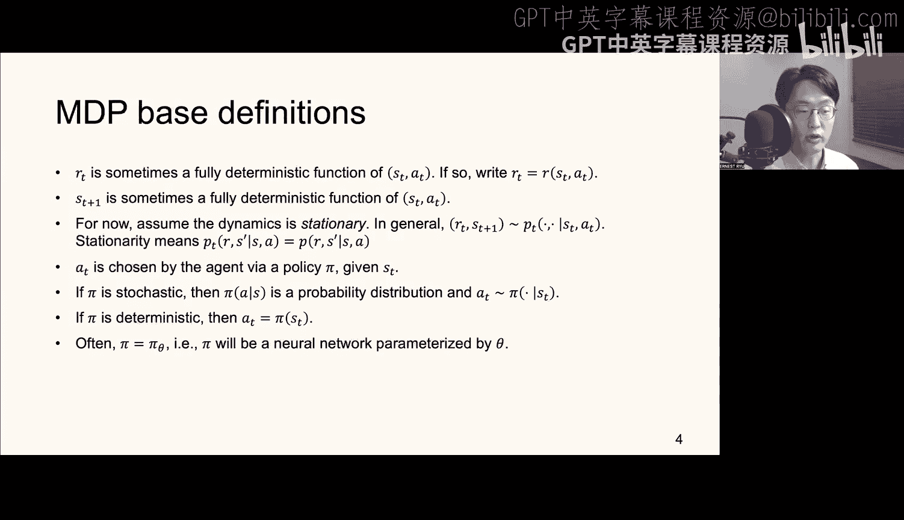

初始状态S_0假设是从初始分布P_0中采样的。通常，初始状态是固定的（例如，每次启动视频游戏都从同一状态开始），此时分布P_0对应于一个确定性的随机变量。

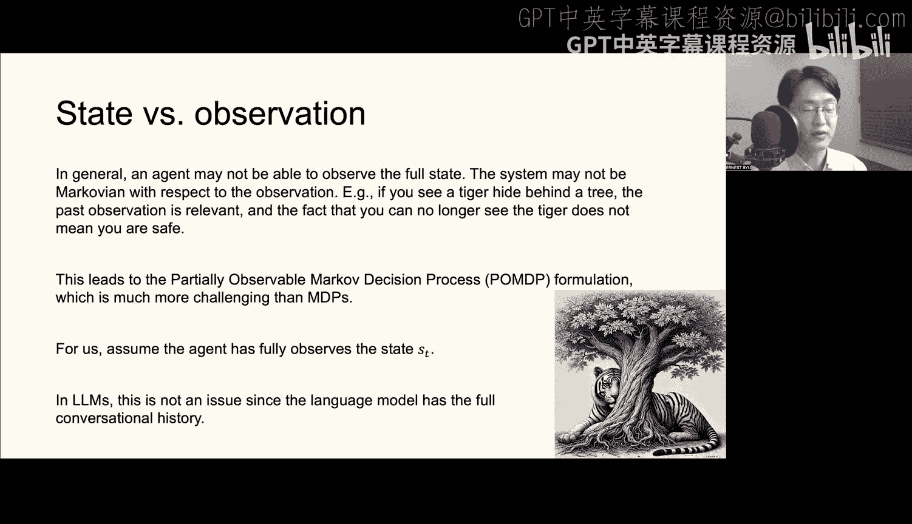

### 转移概率与策略

给定当前状态S，智能体选择一个动作。给定当前状态和采取的动作，转移过程由环境（MDP的马尔可夫部分）而非智能体控制，这被称为转移概率。给定当前状态和动作，我们收集一个奖励（可以是随机变量），并转移到后续状态S‘。

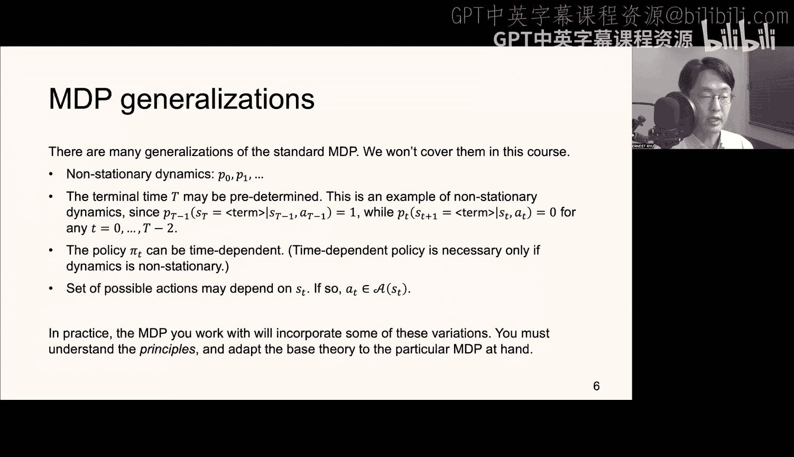

这个转移概率通常不为智能体精确所知。智能体必须通过与环境的交互来学习它。转移概率控制着从状态-动作对(S_t, A_t)到智能体收集的下一个奖励R_t和后续状态S_{t+1}的转移。

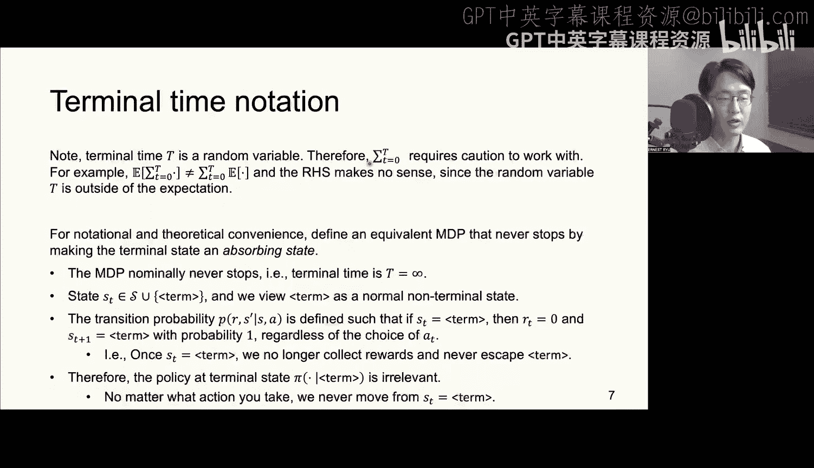

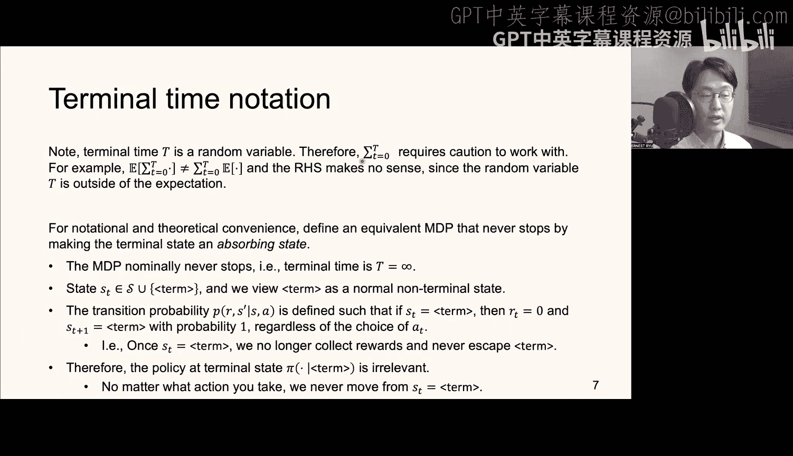

有时，奖励是当前状态和动作的确定性函数，我们写作R_t = f(S_t, A_t)。有时，后续状态是当前状态和动作的完全确定性函数；有时，它是一个随机变量。为了我们的目的，我们假设动态是平稳的。通常，MDP的规则（如视频游戏规则）可能随着步骤进展而变化（非平稳动态），此时转移概率记为P_t。但当动态平稳时，转移概率记为P，不依赖于时间t。

动作A由智能体通过策略π选择。智能体观察当前状态S_t并选择动作A_t。策略π可以是随机的，也可以是确定性的。如果策略π是随机的，则π(a|s)定义了一个概率分布。如果策略是确定性的，则动作A_t = π(S_t)。通常，策略由神经网络参数化，我们写作π = π_θ。

### 完全可观测性假设

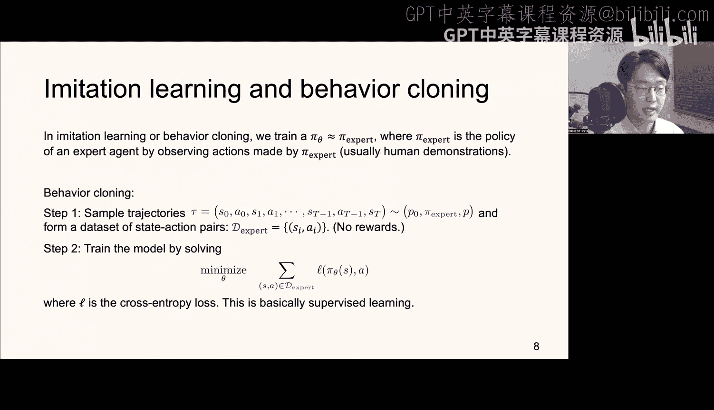

通常，智能体可能无法观察到完整状态，系统对于观测可能不是马尔可夫的。这被称为部分可观测马尔可夫决策过程（POMDP），它比MDP更具挑战性。但在本课程中，我们将假设智能体能够完全观测当前状态S，即智能体的观测与使系统成为马尔可夫的完整状态之间没有区别。这是因为在大型语言模型的强化学习中，语言模型能够观测到完整的对话历史，而完整的对话历史本身就是完整状态。

### MDP的泛化

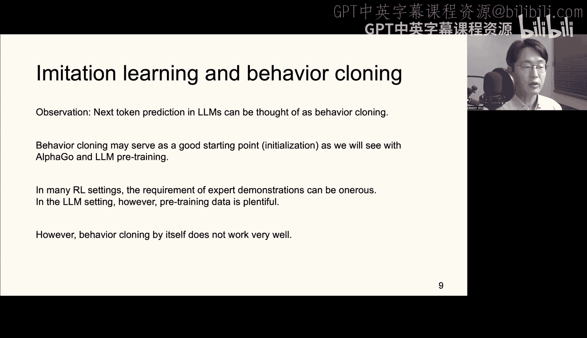

MDP有许多进一步的泛化，我们不会在本课程中全部覆盖。例如，非平稳动态、预定终止时间、时间依赖策略、依赖于当前状态的可能动作集合等。在实践中，MDP通常不会具有我们考虑的这种最简单的纯结构。但从这些讲座中，我希望您能理解核心原理，一旦有了这种理解，您就可以将基础理论适应于手头的特定MDP。

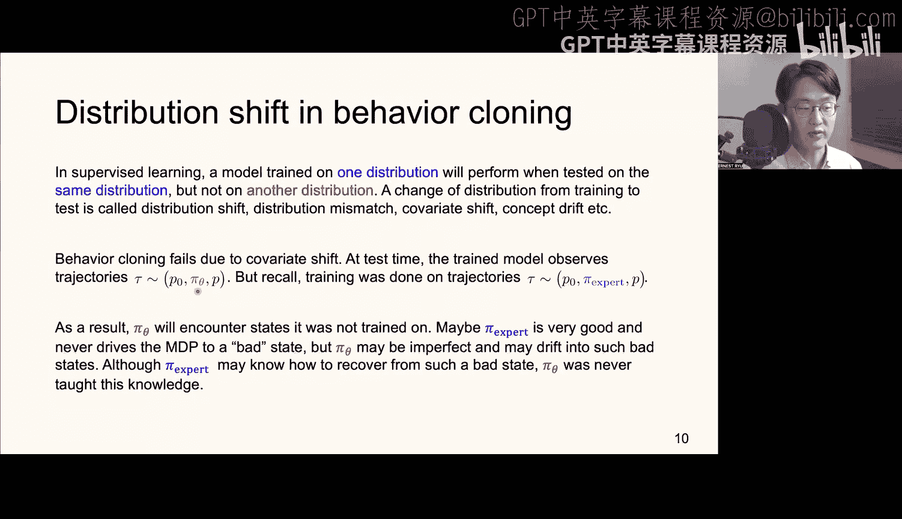

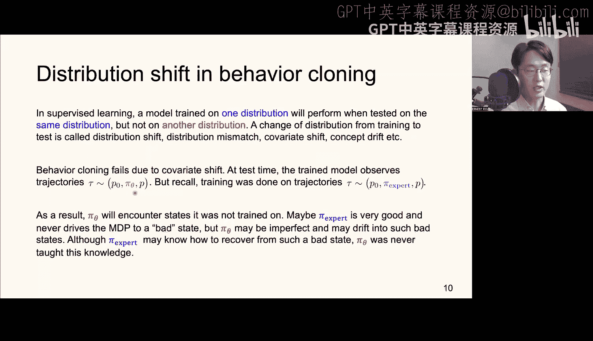

## 终止时间与吸收状态

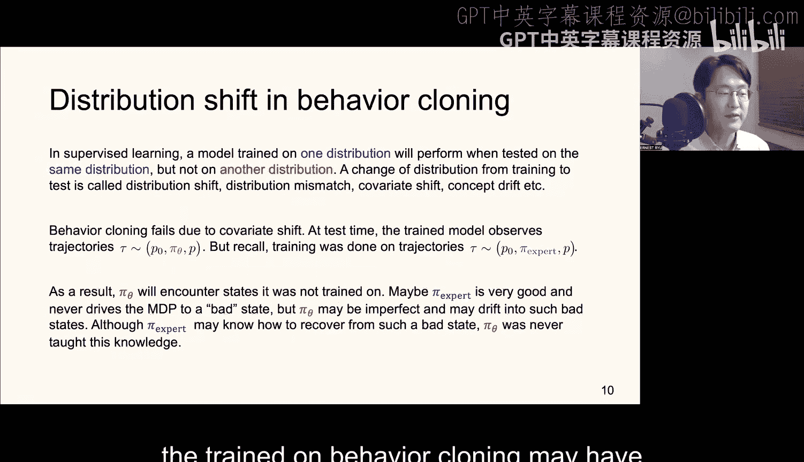

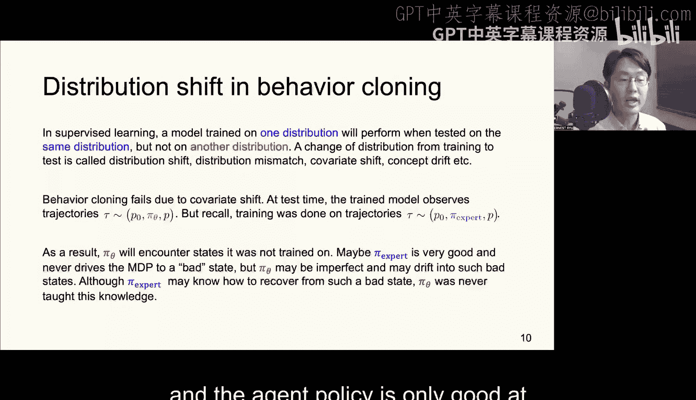

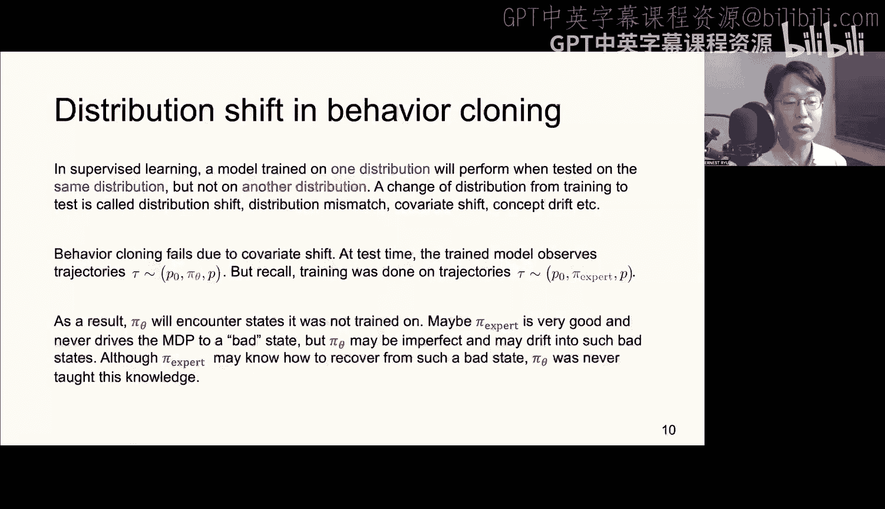

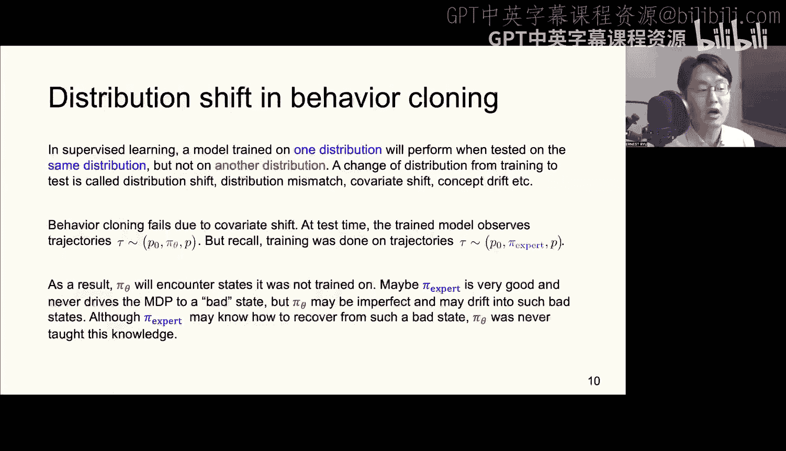

终止时间T是一个随机变量。由于T是随机变量，从当前时间到终止时间的求和需要谨慎处理。例如，我们不能随意交换期望和求和运算的顺序，因为求和上限T是随机的。

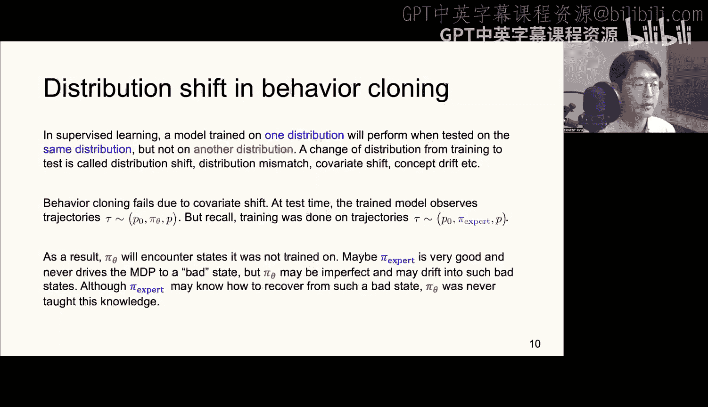

为了简化符号和理论讨论，我们将定义一个等效的、永不停止的MDP，方法是将终止状态变为吸收状态。在这个等效的MDP中，终止时间T等于正无穷。现在，T不再是随机的，我们可以交换期望和求和。具体做法是：一旦处于终止状态，无论采取什么动作，你都不会再收集到任何奖励，并且会永远停留在终止状态。根据这个定义，在终止状态的策略变得无关紧要。

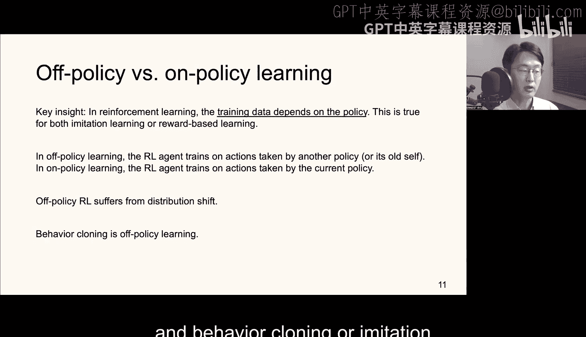

## 模仿学习

智能体如何在MDP中学习行动？让我们从模仿学习（或行为克隆）的想法开始。我们训练一个由神经网络参数化的策略π_θ，使其模仿一个专家策略π_expert。专家策略通常来自人类演示，智能体学习模仿它。

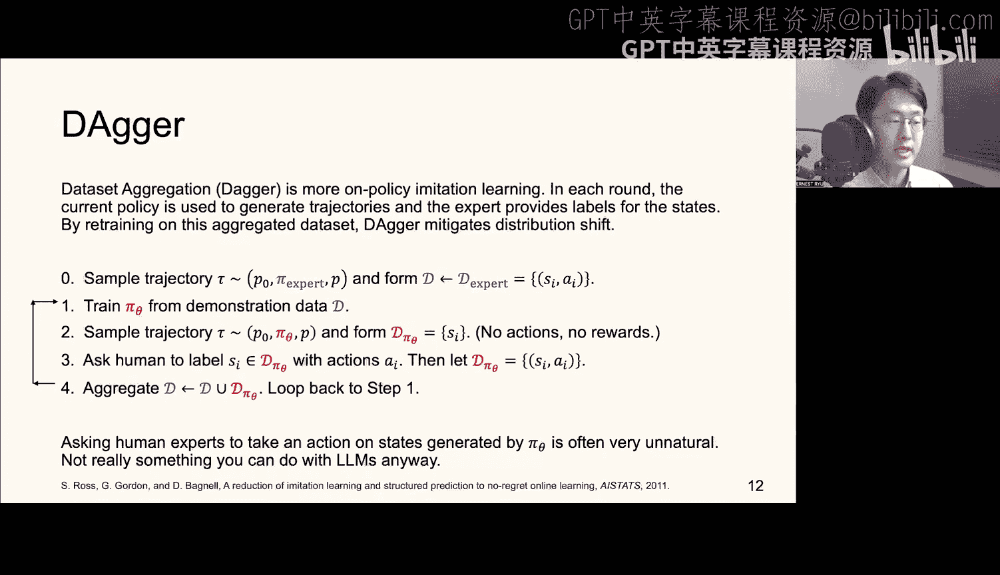

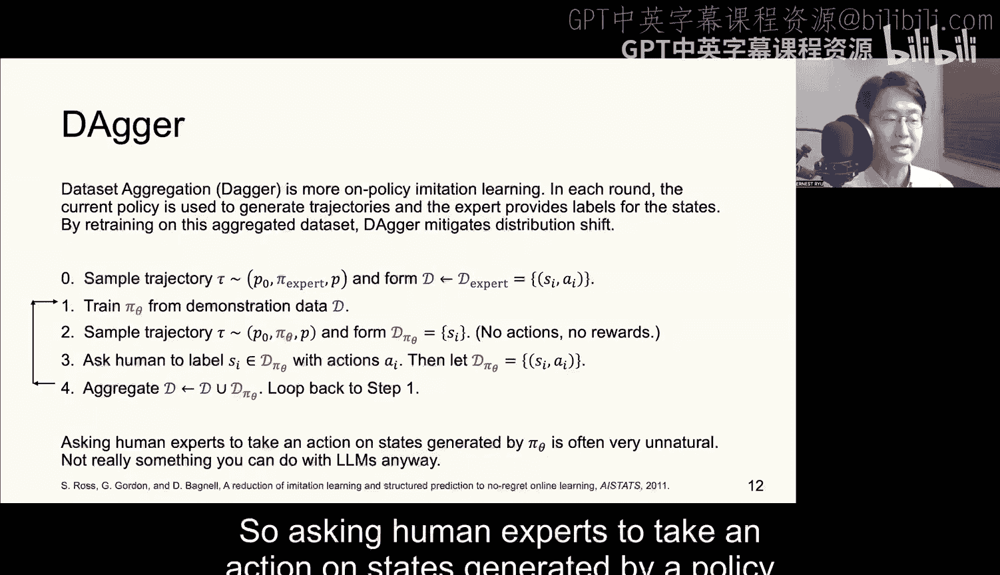

以下是粗略步骤：
1.  使用初始分布P_0、专家策略π_expert和MDP转移概率P，采样从状态S_0开始到终止状态S_T结束的轨迹。
2.  形成一个状态-动作对的数据集。给定当前状态，专家智能体选择了动作A_i，这就是我们想要模仿的。注意，在这个过程中没有奖励的概念。
3.  通过解决最小化问题来训练模型，例如使用交叉熵损失L，训练策略π_θ在给定当前状态S时，模仿专家智能体采取的动作。

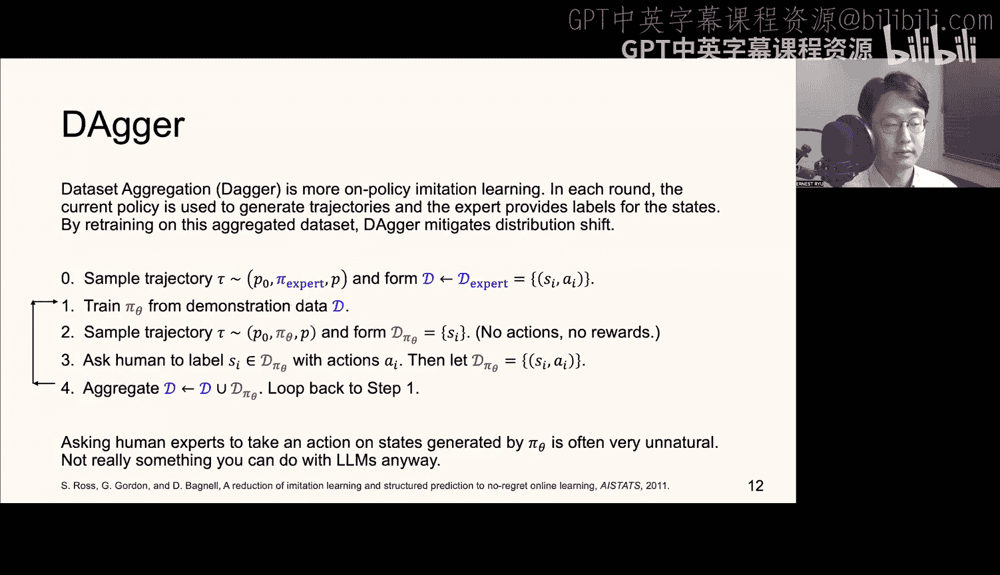

这本质上是监督学习，而不是纯粹的强化学习，因为在学习过程中没有奖励的概念。这个想法很简单：如果有一个做出良好决策的智能体，我们就训练神经网络策略去模仿它。

### 模仿学习与大型语言模型

在大型语言模型中，大语言模型的预训练是通过下一个词预测来完成的。这可以被视为行为克隆的一个实例。在训练大语言模型时，您向模型展示大量文本，然后要求模型预测这段文本之后的下一个词或标记。这些数据来自互联网上人类实际书写的文本。因此，大语言模型的下一个词预测可以被视为行为克隆，这是一个简单但相关的观察。

行为克隆可以作为一个良好的起点或初始化方法，例如在AlphaGo和大语言模型预训练中。也就是说，行为克隆非常有用。

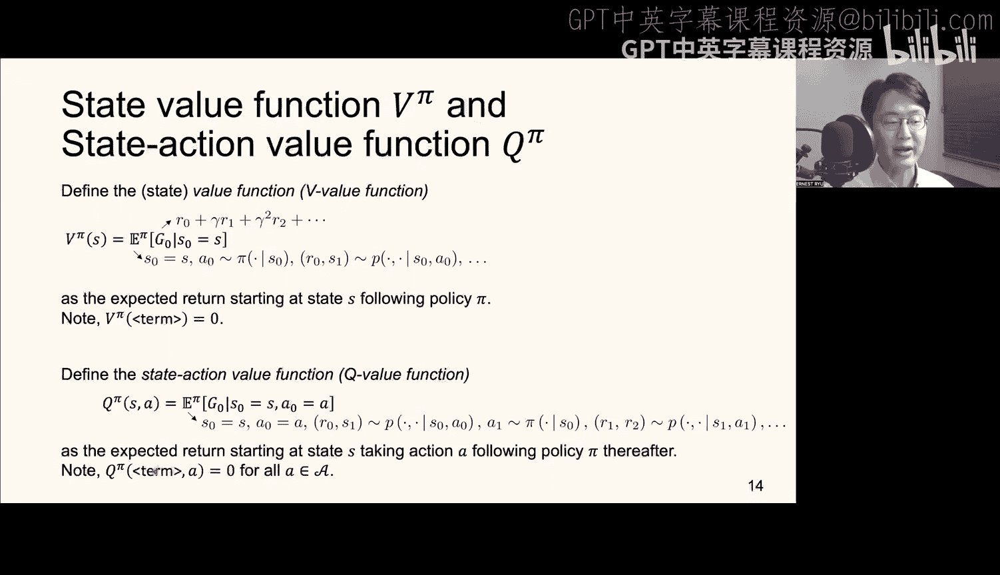

### 行为克隆的局限性

然而，在许多强化学习设置中，获取专家演示的要求可能非常昂贵。但在大语言模型设置中，预训练数据非常丰富，因为它只是由人类书写的文本组成。因此，当拥有丰富的专家演示数据时，行为克隆/模仿学习非常好。

但是，纯粹的行为克隆本身在以下意义上效果不佳：在监督学习中，众所周知，如果在一个分布上训练模型并在同一分布上测试，它会表现良好；但如果改变测试分布，性能就会下降。在纯粹的行为克隆中，智能体只在专家演示上训练，这往往会由于协变量偏移而失败。

为什么在仅接受行为克隆训练的智能体中会发生协变量偏移？在测试时，部署的、经过行为克隆训练的模型将观察由该分布给出的轨迹，其中当前智能体正在采取行动，这决定了智能体访问的状态序列。但这不是智能体训练时所处的分布。智能体是在专家采取行动、访问的状态由专家策略的行动决定的分布上训练的。

因此，仅接受行为克隆训练的策略将遇到它未曾训练过的状态。专家策略可能非常好，它从不会将MDP驱动到坏状态，但经过训练的行为克隆策略必然不完美。它可能会漂移到这些坏状态。专家人类可能知道如何从稍微坏的状态中恢复，但行为克隆策略可能从未遇到过这种场景，因此它不知道该怎么办。

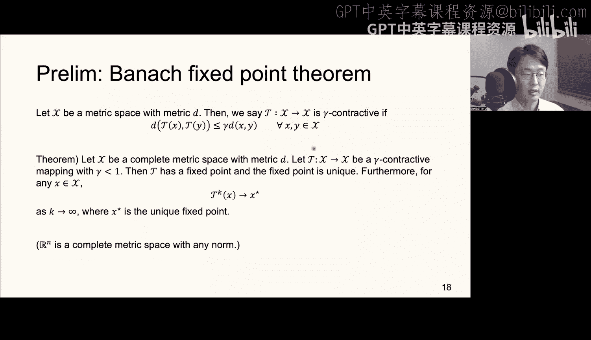

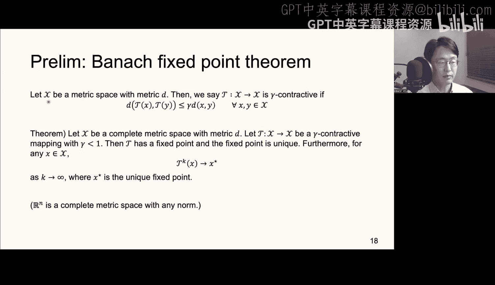

认识到分布偏移问题导致了强化学习中的一个关键见解：在强化学习中，训练数据取决于生成训练数据的策略。这与监督学习不同。这导致了离策略学习与在策略学习的区别。在离策略学习中，强化学习智能体在由另一个策略（可能是完全独立的专家策略，也可能是其旧版本生成的数据）采取的行动上进行训练。在在策略学习中，强化学习智能体在由当前策略自身采取的行动上进行训练。离策略强化学习受到分布偏移问题的影响，而行为克隆或模仿学习肯定是离策略学习。

## DAgger算法

DAgger（数据聚合）算法是一种更接近在策略的模仿学习。在每一轮中，使用当前策略生成轨迹，专家为这些状态提供标签。通过在这些聚合数据上重新训练，DAgger减轻了分布偏移。

算法步骤如下：
1.  从专家策略中采样轨迹，形成状态-动作对数据集。
2.  从演示数据中训练一个策略。
3.  让训练好的策略采取行动，基于此采样轨迹，并收集该轨迹导致的状态。
4.  请人类专家用正确的动作为各个状态添加标签。当前策略π_θ生成状态，它也会生成一系列动作，但我们假设这些动作不好。我们请人类专家用动作为这些状态添加注释，然后将其作为我们的数据。
5.  聚合数据：将专家在先前数据上的动作与专家在新状态上的动作结合起来。
6.  回到步骤1并重复此过程。

有时DAgger效果很好，但有时这有点不自然。要求人类专家在一个他们并未采取行动的策略生成的状态上采取行动，通常非常不自然。无论如何，这在大语言模型设置中是无法实现的。DAgger类算法在大语言模型中的表现方式可能是：给定一段文本的部分完成，然后询问另一个人，当前文本之后应该是什么词。这是一种不自然的写作方式。

尽管如此，DAgger背后的想法非常有趣，即我们希望使模仿学习尽可能接近在策略，这一概念在我们讨论基于人类反馈的强化学习和专家迭代时会再次变得相关。

## 纯强化学习与价值函数

现在我们已经介绍了模仿学习，让我们继续讨论纯强化学习。在经典的强化学习和MDP设置中，我们有一个目标。MDP的目标是最大化期望折扣回报。

具体来说，我们希望解决的优化问题是这种形式：max_π E^π[G_0]，其中G_0是累积折扣回报。累积折扣回报是所有奖励的总和：R_0 + γR_1 + γ^2 R_2 + ... + γ^{T-1} R_{T-1}。这里γ被称为折扣因子，设置在0到1之间。如果折扣因子小于1，则意味着我们更倾向于尽早获得奖励。当终止时间为无穷大（持续性任务）且奖励有界时，我们通常选择γ小于1以确保回报是有限的。

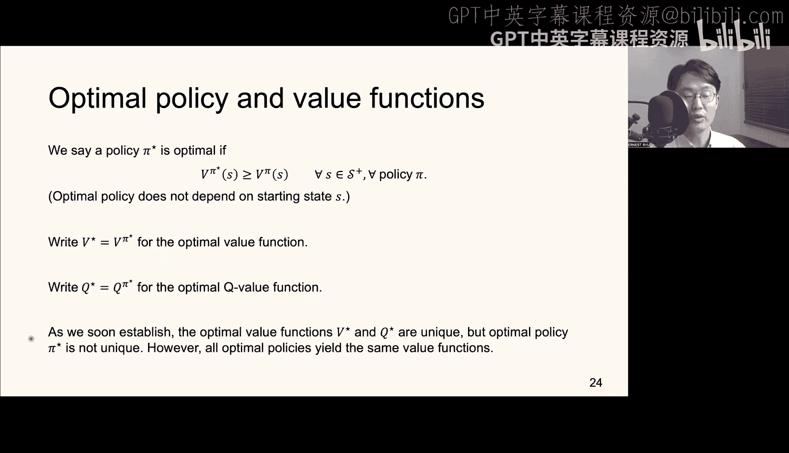

想象初始状态从分布p_0中采样，我们根据策略π行动，然后生成一个有限或无限的轨迹，我们得到一个累积折扣回报作为随机结果。期望E^π表示在所有动作上的期望，其中我们根据策略π采取动作，并根据转移概率P进行转移。我们想要最大化期望累积折扣回报。

接下来，我们定义价值函数（或状态价值函数），也称为V值函数，记作V^π。V^π是一个以当前状态S为输入的函数。对于V^π，我们取G_0的期望，当我们根据策略π行动时，但我们假设在时间0从状态S开始。根据这个定义，终止状态的价值函数定义为0。

我们还定义状态-动作价值函数，也称为Q值函数，记作Q^π。定义基本相同：我们取关于π的累积折扣回报的期望，但这里我们从状态S开始，并且最初承诺采取动作A。初始动作a_0不是根据π采样的，我们选择动作a作为初始动作a_0，然后后续动作将从策略π中采样。同样，根据定义，在终止状态，无论动作如何，Q值函数都定义为0。

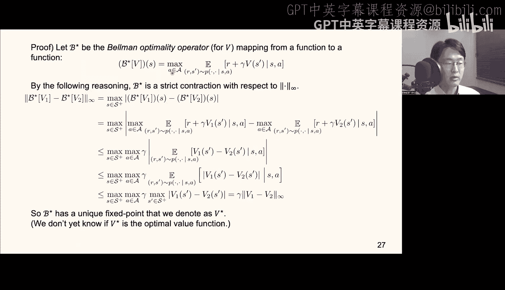

V值函数和Q值函数是强化学习中的基本量。

### 价值函数的基本性质

根据定义，如果我们让初始动作a_0从策略π中采样，那么Q值函数就变成了V值函数：V^π(s) = E_{a∼π(·|s)}[Q^π(s, a)]。

由于MDP的平稳性，从时间t开始、以状态S_t为条件的G_t的期望，与从时间0开始、以状态S_0为条件的G_0的期望是相同的。所以无论从何时开始，期望都不受影响。对于Q值函数也是如此。

接下来是价值函数V^π的一步转移性质：V^π(s) = E_{a∼π(·|s), (r,s‘)∼P(·|s,a)}[r + γ V^π(s‘)]。这个性质可以通过条件期望的塔性质和马尔可夫性来证明。

类似地，Q值函数的一步转移性质为：Q^π(s, a) = E_{(r,s‘)∼P(·|s,a)}[r + γ E_{a‘∼π(·|s‘)}[Q^π(s‘, a‘)]]。

### 贝尔曼方程与巴拿赫不动点定理

接下来，我们将展示贝尔曼方程的一个关键性质，这将需要使用巴拿赫不动点定理。

设X是一个具有度量d的度量空间。我们说一个算子T是γ收缩的，如果对于所有x, y ∈ X，有 d(T(x), T(y)) ≤ γ d(x, y)。在我们的应用中，X将是具有L∞范数（最大范数）的n维空间。

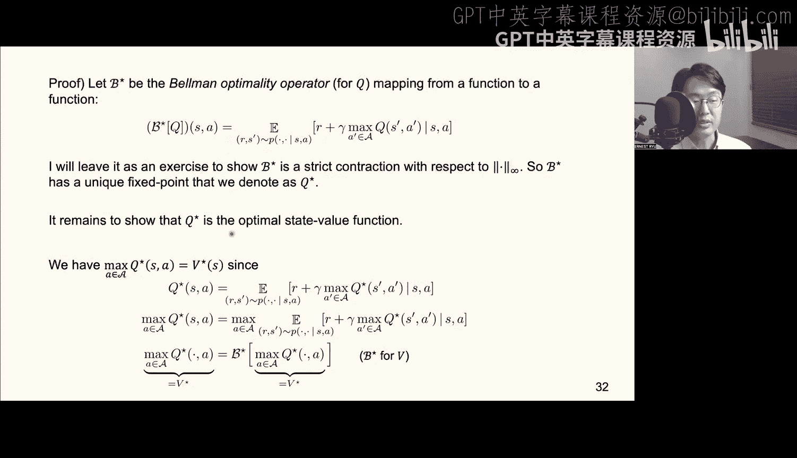

巴拿赫不动点定理：设X是一个具有度量d的完备度量空间。设算子T是γ收缩的，且γ严格小于1。那么算子T有一个唯一的不动点。此外，如果我们取任意点并重复应用算子T，当应用次数k趋于无穷时，它将收敛到该不动点。

巴拿赫不动点定理有两种用途：一是证明某个算子的不动点存在；二是将其用作算法，即我们直接按照定理所述应用算法，重复应用不动点算子，从而在计算上收敛到我们期望的不动点，这将引出价值迭代算法。

### 价值函数的贝尔曼方程

**定理**：设π是一个策略。假设折扣因子γ在0和1之间（严格小于1）。假设状态空间是有限的。还假设奖励几乎处处有界。那么，关于π的价值函数V^π存在，并且满足这个贝尔曼方程：V^π(s) = E_{a∼π(·|s), (r,s‘)∼P(·|s,a)}[r + γ V^π(s‘)]。反之，如果一个函数满足贝尔曼方程，那么该函数就等于价值函数。

**证明概要**：价值函数的良好定义性（即期望有限）源于奖励有界且γ<1。定义贝尔曼算子B^π，它将一个函数映射到另一个函数：B^π(V)(s) = E_{a∼π(·|s), (r,s‘)∼P(·|s,a)}[r + γ V(s‘)]。根据一步转移性质，价值函数V^π是贝尔曼算子B^π的不动点。接下来需要证明V^π是唯一的不动点。定义L∞范数 ||V||_∞ = max_s |V(s)|。可以证明贝尔曼算子B^π是关于L∞范数的γ收缩算子。然后根据巴拿赫不动点定理，B^π有唯一的不动点，因此V^π是唯一的不动点。

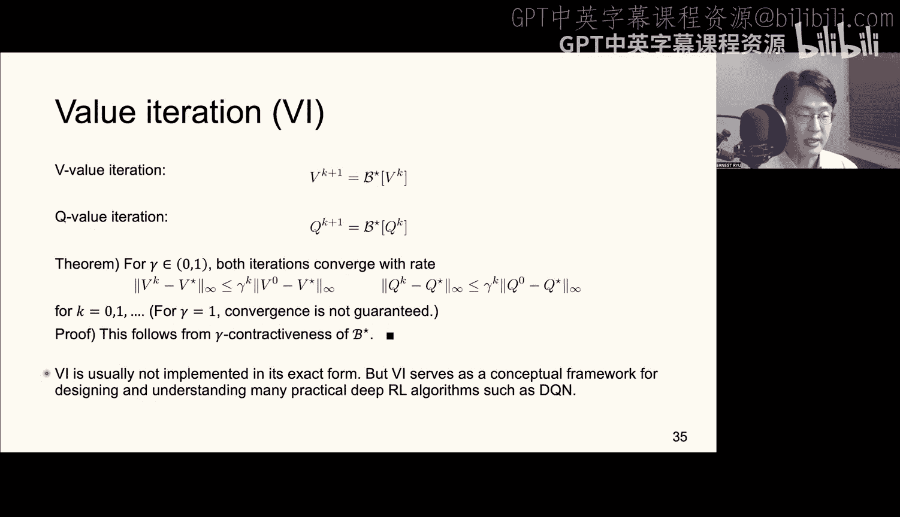

类似地，我们有Q值函数的贝尔曼方程定理，其证明思路基本相同。

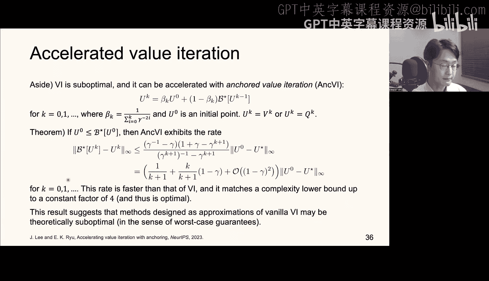

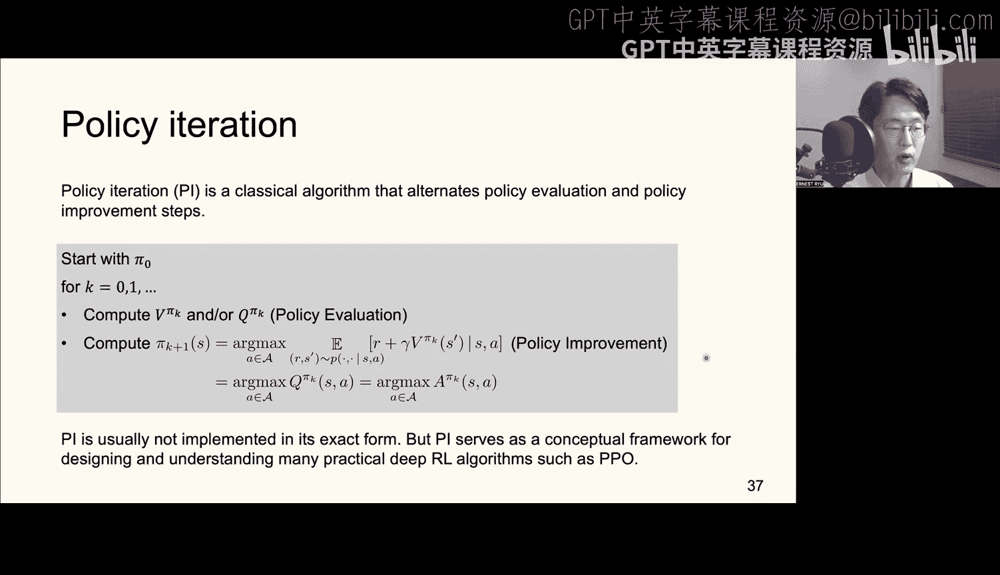

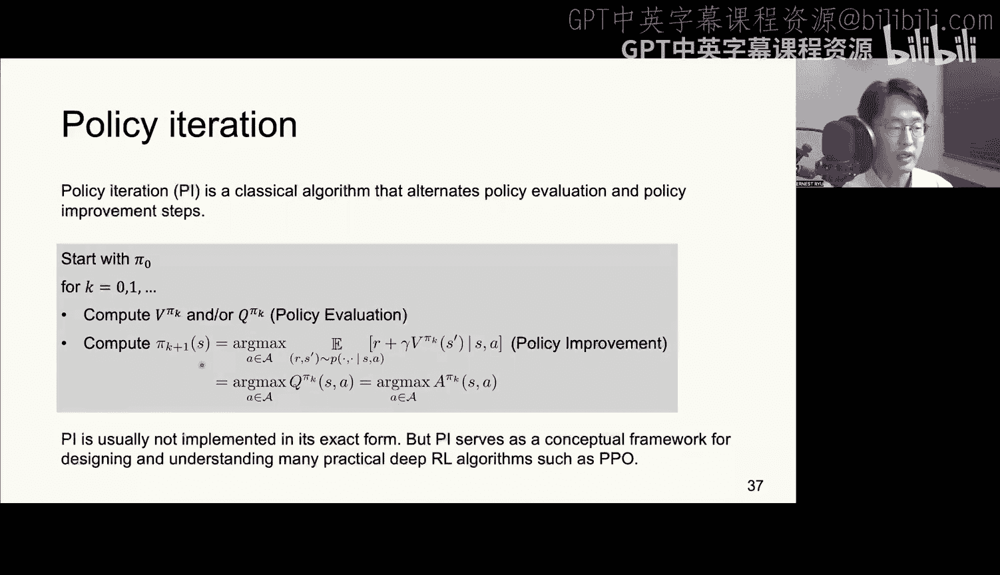

## 最优策略与贝尔曼最优性方程

我们称一个策略π*是最优的，如果它的价值函数V^{π*}在所有状态上支配（即大于等于）任何其他策略π的价值函数V^π。一旦我们有了最优价值函数V^{π*}，我们简写为V*，并记Q*为关于策略π*的最优Q值函数。最优价值函数V*和Q*是唯一的，但最优策略π*可能不唯一。

### 贝尔曼最优性方程（V值函数）

**定理**：假设折扣因子γ严格小于1，状态和动作集合有限，奖励有界。那么最优价值函数V*存在，并且满足这个贝尔曼最优性方程：V*(s) = max_{a ∈ A} E_{(r,s‘)∼P(·|s,a)}[r + γ V*(s‘)]。反之，如果一个函数满足贝尔曼最优性方程，那么它就是最优价值函数。最后，如果我们知道了最优价值函数，那么通过取期望（即最优Q值函数）并对其关于动作a求最大值，就可以得到一个最优确定性策略：π*(s) = argmax_a E_{(r,s‘)∼P(·|s,a)}[r + γ V*(s‘)]。

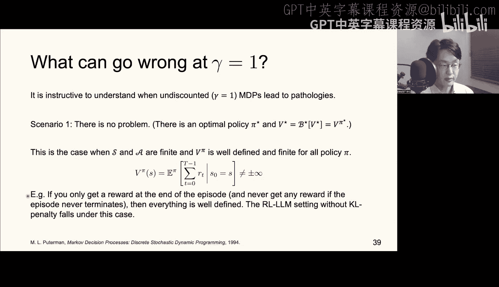

**证明概要**：定义贝尔曼最优性算子B*：B*(V)(s) = max_{a ∈ A} E_{(r,s‘)∼P(·|s,a)}[r + γ V(s‘)]。可以证明B*是关于L∞范数的γ收缩算子。根据巴拿赫不动点定理，B*有唯一的不动点，记作V*。然后定义策略π*(s) = argmax_a E_{(r,s‘)∼P(·|s,a)}[r + γ V*(s‘)]。接着证明V* = V^{π*}，即V*确实是策略π*的价值函数。最后证明π*确实是最优策略，即对于任何其他策略π，有V^π ≤ V^{π*} = V*。

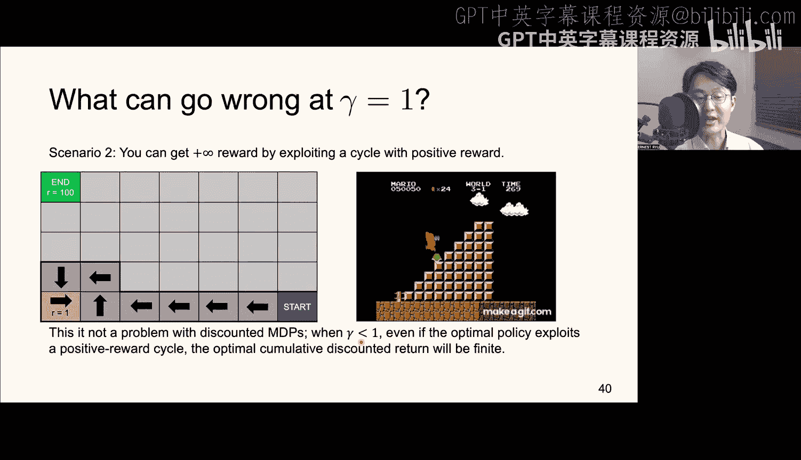

### 贝尔曼最优性方程（Q值函数）

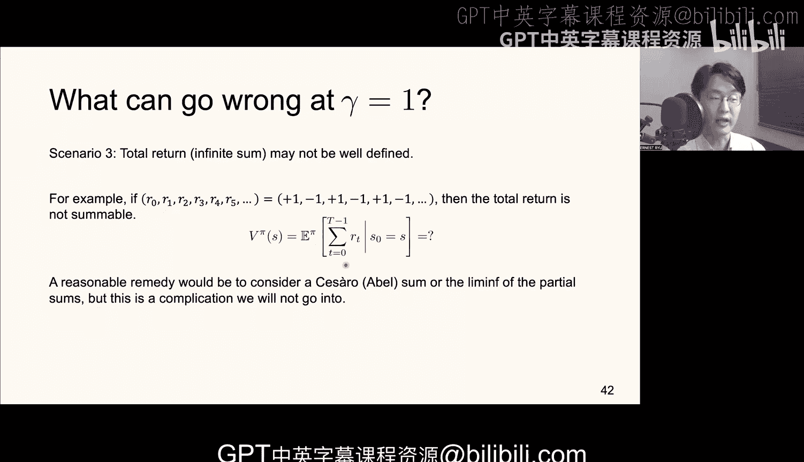

**定理**：假设同上。那么最优状态-动作价值函数Q*存在，并且满足这个贝尔曼最优性方程：Q*(s, a) = E_{(r,s‘)∼P(·|s,a)}[r + γ max_{a‘ ∈ A} Q*(s‘, a‘)]。反之，如果一个函数满足这个贝尔曼最优性方程，那么它就是最优Q值函数。最后，如果我们取最优Q值函数并取其关于动作的argmax，那就定义了一个最优确定性策略：