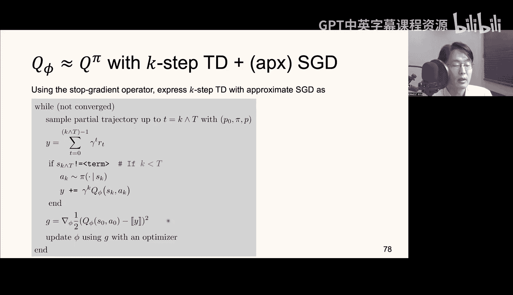

#  003：深度策略评估 🧠


在本节课中，我们将学习如何评估一个给定的策略，这是理解后续策略优化的基础。我们将介绍两种核心方法：蒙特卡洛方法和时序差分学习，并学习如何使用神经网络来近似价值函数。

---

## 概述

强化学习的目标是找到一个好的策略。但在学习如何优化策略之前，我们首先需要理解如何评估一个给定的策略。这个过程被称为**策略评估**。我们将学习如何计算或近似一个策略的价值函数，这是衡量策略好坏的关键指标。本节将重点介绍两种深度策略评估方法：基于完整轨迹的蒙特卡洛方法和基于单步更新的时序差分学习。

---

## 策略评估与策略优化

首先，让我们明确策略评估与策略优化的区别。

强化学习的最终目标是找到一个好的策略，最好是**最优策略**。但在这些课程中，我们将从研究如何评估一个给定的策略 π 开始。也就是说，如果我指定了一个策略 π，我们如何从理论上衡量它的好坏？有哪些计算手段可以近似这个评估？这个过程就叫做**策略评估**。

我们之后会继续讨论如何优化和改进策略 π，这被称为**策略优化**、策略改进或控制，这才是强化学习的主要目标。然而，为了循序渐进地学习，先理解策略评估再学习策略优化是有益的，因为策略优化通常将策略评估作为其子程序。因此，我们应该先理解这个更简单的子程序。

---

## 蒙特卡洛策略评估

第一种策略评估方法很简单，叫做**蒙特卡洛方法**。

我们首先考虑近似给定策略 π 的价值函数 V^π。我们使用蒙特卡洛近似来实现这一点。具体做法是，我们简单地执行 N 次**轨迹滚动**。

以下是具体步骤：
1.  模拟 N 条独立的轨迹。
2.  对于所有轨迹，计算其累积折扣回报。
3.  对这 N 条独立轨迹的回报取经验平均值。

**公式**：
`V^π(s) ≈ (1/N) * Σ_{i=1}^{N} G_i`，其中 `G_i` 是第 i 条轨迹从状态 s 开始的累积折扣回报。

这种方法之所以有效，是因为等式右边是价值函数的**无偏估计**。如果数量 N 足够大，根据大数定律，这应该是一个足够好的近似。

然而，这个近似依赖于初始状态 S。如果我们从一个不同的初始状态开始，就会得到不同的奖励序列。因此，如果状态空间 S 的规模很小，我们可以为所有状态单独进行这种近似，从而将 V^π 近似为 S 的函数。

但是，当状态空间 S 很大甚至是无限时，为每个独立的状态单独近似价值函数在计算上是不可行的。在这种情况下，我们必须用一个神经网络来近似价值函数 V^π，我们将其表示为 V_φ。V_φ 是一个以 φ 为参数的神经网络。

我们需要通过优化参数 φ 来拟合这个神经网络。具体做法是解决以下最小化问题：

**公式**：
`min_φ L(φ) = E_{s~p0} [ (V^π(s) - V_φ(s))^2 ]`

其中，p0 是初始状态分布。我们称 V_φ 为**价值网络**，因为它是一个旨在近似价值函数的神经网络。

这个损失函数最初有点问题，因为它需要访问未知的量 V^π。我们无法直接获得 V^π。那么该怎么办呢？让我们先计算 L 的梯度。

**公式**：
`∇_φ L(φ) = E_{s~p0} [ 2 * (V_φ(s) - V^π(s)) * ∇_φ V_φ(s) ]`

然后，我们根据定义写出 V^π。V^π 是在初始状态 s0 = s 的条件下，遵循策略 π 所获得的累积折扣回报的期望。我们可以将 V_φ(s) 移入期望内部，因为在这个期望中，s 甚至不是随机变量。然后，我们可以利用塔性质将这两个期望合并为一个单一的期望。

最终，我们得到一个可计算的量 G，它作为损失函数 L 的**随机梯度**。G 是可计算的，因为它需要访问神经网络的梯度（我们可以通过反向传播获得），并且我们可以使用当前策略 π 通过蒙特卡洛模拟来估计它。

以下是使用价值网络 V_φ 进行策略评估的算法步骤：
1.  当未收敛时，重复以下步骤：
2.  使用当前策略 π 采样一条轨迹。
3.  使用该轨迹计算累积折扣回报 G。
4.  形成随机梯度 `G = 2 * (V_φ(s0) - G) * ∇_φ V_φ(s0)`。
5.  使用随机梯度 G 通过优化器（如 SGD、Adam）更新神经网络参数 φ。

蒙特卡洛策略评估的一个问题是，我们需要模拟完整的轨迹才能形成这个随机梯度，这似乎效率不高。我们真的需要模拟整个轨迹吗？

---

## 时序差分学习

时序差分学习试图弥补这种低效性。

在时序差分学习中，我们利用**单步转移**的性质。我们认识到 V^π 满足贝尔曼方程：

**公式**：
`V^π(s) = E_{a~π(·|s), s‘~P(·|s,a)} [ r(s, a) + γ * V^π(s‘) ]`

我们如何近似这个期望呢？我们将对这个单步转移进行蒙特卡洛近似。我们从状态 s0 开始，采取一个动作，获得一个奖励，并转移到状态 s1。我们独立地进行 N 次这样的单步转移，然后形成经验平均值。根据大数定律，如果 N 足够大，这个求和应该能很好地近似真实的期望。

但这个方法有一个问题：为了执行这个公式，我们必须**精确地知道**在状态 s1 的价值函数 V^π。而进行策略评估的整个前提就是我们不知道 V^π。因此，这里需要使用未知量 V^π 是有点问题的。

尽管如此，我们继续推进。我们像之前一样定义损失函数，并计算其梯度。经过类似的推导（利用塔性质和马尔可夫性），我们最终会得到一个随机梯度，但它仍然依赖于真实的价值函数 V^π。

如果我们想象执行这种拟合，即使用时序差分学习进行策略评估，那么我们会这样做：在状态 s0，我们采样动作 a0，采样转移，并形成这个量作为随机梯度，然后将其传递给像 Adam 或 SGD 这样的优化器。

但这个实现的问题在于，由于它依赖于真实的 V^π，所以并不可行。

因此，一个近似的 SGD 实现简单地用我们的价值网络 V_φ 替换 V_π。现在，这个 G 不再是损失函数梯度的无偏估计（当我们使用 V^π 时，它是无偏的）。但这是一种人们经常使用的启发式方法，在许多情况下效果很好。

更准确地说，实现应该如下所示：
1.  在状态 s0，采样动作 a0，转移到状态 s1。
2.  有两种情况：
    *   转移到**非终止状态**：目标值 `y = r0 + γ * V_φ(s1)`
    *   转移到**终止状态**：目标值 `y = r0` （因为终止状态的价值为 0）
3.  形成有偏的随机梯度 `G = 2 * (V_φ(s0) - y) * ∇_φ V_φ(s0)`。
4.  将这个有偏的随机梯度 G 传递给优化器以进行价值网络拟合。

在 PyTorch 中，我们使用**梯度截断**操作符来实现这一点。这确保了在计算梯度时，我们将目标值 `y` 视为常数，从而得到我们想要的有偏随机梯度。

**代码示例（概念）**：
```python
# s0: 当前状态， r0: 即时奖励， s1: 下一个状态， done: 是否终止
value_s0 = value_network(s0)
with torch.no_grad():  # 梯度截断
    target = r0 + (1 - done) * gamma * value_network(s1)
loss = F.mse_loss(value_s0, target)
loss.backward()
optimizer.step()
```

这种方法被称为**半梯度方法**，因为它类似于梯度方法，但进行了一个小的修改（用近似值替换真实值）。虽然理论上不如真正的梯度方法严谨，但实践表明，半梯度 TD 方法通常比更理论化的替代方法（如梯度 TD）表现更好。

---

## K步时序差分学习

我们可以将时序差分学习进一步推广，进行 **K 步时序差分学习**，这介于需要完整轨迹的蒙特卡洛方法（可视为无限步 TD）和单步 TD 之间。

利用 K 步转移性质，价值函数可以表示为：

**公式**：
`V^π(s) = E [ Σ_{t=0}^{min(K,T)-1} γ^t * r_t + γ^K * V^π(s_K) ]`

其中，期望是在遵循策略 π 的 K 步轨迹上进行的。如果 episode 在 K 步之前终止，则求和到终止步为止。

为了拟合价值网络，我们采用与单步 TD 类似的流程。我们考虑相同的平方差损失，计算其梯度，并进行类似的分析，最终得到一个随机梯度。

理想化的 K 步 TD SGD 拟合算法如下：
1.  采样一条长达 K 步的部分轨迹。
2.  形成随机梯度，其中我们求和前 K 个奖励，并转移到状态 s_K，然后将其代入价值函数 V^π。

同样，如果我们无法访问 V^π，这就不可行。因此，我们使用近似版本，用价值网络 V_φ 替换 V^π 的使用。这再次导致了一个有偏的随机梯度，但在实践中往往效果很好。

这同样可以使用梯度截断操作符简洁地表达。

---

## 方法对比与总结

现在我们已经有了两种策略评估方法：蒙特卡洛和时序差分（单步或 K 步）。让我们做一个比较。

两者的目标都是执行策略评估，即训练一个近似真实价值函数的**价值网络**。主要区别在于：
*   **蒙特卡洛评估**：通过等待 episode 终止来更新价值网络 V_φ。它使用从开始到结束的完整回报，是无偏的，但方差可能较高，且必须等待 episode 结束。
*   **时序差分评估**：无需等待 episode 终止即可更新 V_φ。如果 episode 尚未终止，TD 会进行**自举**，使用价值网络在下一个状态（或 K 步后的状态）的估计值。它是有偏的（因为使用了网络自身的估计），但通常方差更低，且数据效率更高。

在训练初期，V_φ 是一个随机初始化的神经网络，其值完全不准确。此时使用 TD 自举可能会导致不稳定性。然而，后期当 V_φ 变得准确时，等待 episode 完全终止可能变得低效。因此，这里存在一个权衡。根据经验，选择中间值（例如 K=5）的 K 步 TD 通常是一个很好的折衷方案。

---

## 扩展到Q函数评估

我们讨论了关于 V 价值函数的策略评估，但我们也可以对 **Q 函数**执行策略评估。

这基本上遵循相同的原则。你可以为 Q 函数执行蒙特卡洛策略评估，其形式与 V 函数情况基本相同，只是梯度计算需要稍微不同的条件（因为 Q 函数还依赖于动作）。同样，我们也可以为 Q 函数使用时序差分学习，包括单步和 K 步版本。所有的考虑因素——无偏梯度与有偏近似、自举、半梯度方法——都与 V 值函数的情况非常相似。

因此，Q 函数和 V 函数评估之间的差异是微小的，核心思想和方法论是一致的。

---

## 总结

在本节课中，我们一起学习了深度策略评估的核心方法。我们首先明确了策略评估是策略优化的基础。接着，我们深入探讨了：
1.  **蒙特卡洛方法**：通过采样完整轨迹并计算平均回报来无偏地估计价值函数，适合状态空间小或需要无偏估计的场景，但可能存在高方差和低效的问题。
2.  **时序差分学习**：利用贝尔曼方程和自举思想，通过单步或 K 步转移来更新价值网络，提高了数据效率并降低了方差，但引入了估计偏差。
3.  **价值网络拟合**：我们学习了如何定义损失函数，推导随机梯度（无论是无偏的还是有偏的），并使用随机梯度下降来训练神经网络以近似真实的价值函数。
4.  **实践实现**：我们特别介绍了在 PyTorch 中使用梯度截断操作符来实现 TD 学习中的关键步骤。



理解这些评估方法是至关重要的，因为它们为后续学习如何改进和优化策略（即策略优化）奠定了坚实的基础。