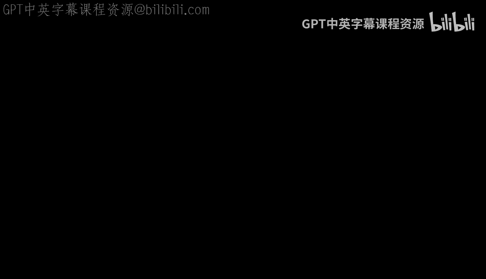
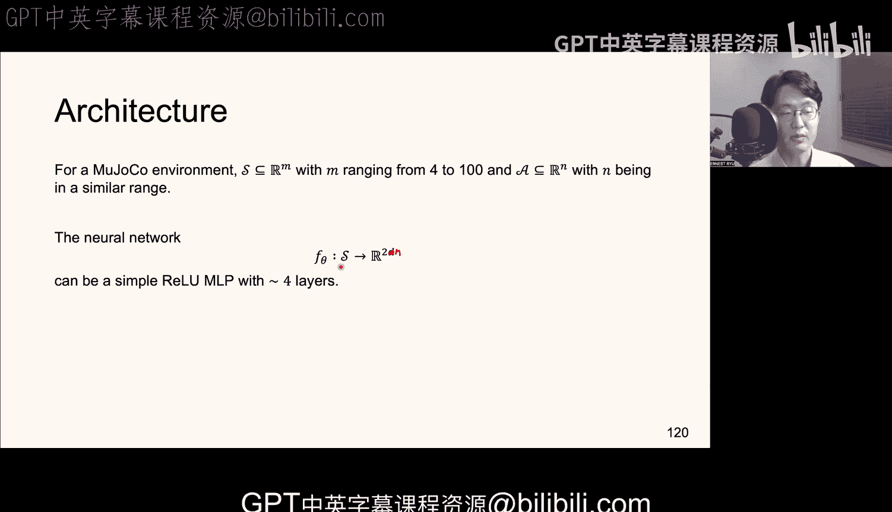

#  004：深度策略梯度方法 (A3C) 🧠



在本节课中，我们将学习深度策略梯度方法，这类方法通过优化策略本身来提升智能体的表现。我们将重点介绍A3C（异步优势演员-评论家）算法及其核心思想，并解释如何将其应用于离散和连续动作空间。

## 概述

上一节我们讨论了策略评估，即如何近似给定策略的价值函数。本节中，我们来看看策略优化，其目标是直接找到能最大化期望累积回报的策略。我们将从策略梯度定理的基本形式出发，逐步引入降低方差、提升算法稳定性的技巧，最终推导出实用的A2C/A3C算法框架。

## 策略优化目标

策略优化的核心是求解一个最大化问题。我们希望通过调整神经网络参数 θ 来最大化目标函数 J(θ)。该函数定义为参数化策略 π_θ 下价值函数的期望：

**J(θ) = E_{s_0 ~ p_0} [ v_{π_θ}(s_0) ]**

其中，π_θ 是我们的策略，由一个参数为 θ 的神经网络表示。初始状态 s_0 从分布 p_0 中采样，我们的目标是最大化从初始状态开始、遵循策略 π_θ 所能获得的期望累积折现回报。

为了简化分析，我们假设在有限时间内以概率1终止。用 τ 表示完整的轨迹（从开始到终止的状态、动作、奖励序列）。目标函数可以重写为：

**J(θ) = E_{τ ~ (p_0, π_θ, P)} [ G_0 ]**

这里，G_0 是从时间0开始的累积折现回报，是轨迹 τ 的函数。轨迹 τ 的概率分布 P_θ(τ) 是初始分布、转移概率和策略概率的乘积。

## 策略梯度定理与方差缩减

我们的目标是计算目标函数 J(θ) 关于参数 θ 的梯度。应用对数导数技巧（log derivative trick），我们可以得到梯度的表达式：

**∇_θ J(θ) = E_{τ ~ π_θ} [ G_0 · ∇_θ log P_θ(τ) ]**

其中，**g = G_0 · ∇_θ log P_θ(τ)** 是梯度的一个无偏估计量。然而，这个估计量的方差通常非常大，直接使用会导致训练不稳定。因此，我们需要一系列技巧来降低方差。

以下是降低方差的三个核心技巧：

### 技巧一：移除过去奖励

在梯度估计中，当前时间步 t 的动作不会影响过去已发生的奖励。因此，在计算梯度时，可以移除当前时间步之前的所有奖励，这不会引入偏差，但能有效降低方差。经过推导，梯度估计可简化为：

**∇_θ J(θ) = E [ Σ_{t=0}^{∞} γ^t · G_t · ∇_θ log π_θ(a_t | s_t) ]**

其中，G_t 是从时间 t 开始的累积折现回报。

### 技巧二：引入状态相关的基线

我们可以从梯度估计中减去一个只依赖于状态 s_t（而不依赖于动作 a_t）的函数 B(s_t)，这被称为基线。只要基线不依赖于动作，它就不会改变梯度估计的期望值（即仍是无偏的），但通过精心选择基线，可以进一步降低方差。梯度估计变为：

**∇_θ J(θ) = E [ Σ_{t=0}^{∞} γ^t · (G_t - B(s_t)) · ∇_θ log π_θ(a_t | s_t) ]**

### 技巧三：使用优势函数与Rao-Blackwell化

最有效的方差缩减方法是使用**优势函数（Advantage Function）**。优势函数 A(s, a) 定义为动作价值函数 Q(s, a) 与状态价值函数 V(s) 之差：

**A(s, a) = Q_{π_θ}(s, a) - V_{π_θ}(s)**

它衡量了在状态 s 下采取特定动作 a 相对于遵循当前策略的平均表现有多好。如果 A(s, a) > 0，说明动作 a 优于平均；如果 A(s, a) < 0，则劣于平均。

根据Rao-Blackwell定理，使用条件期望 Q_{π_θ}(s, a) 代替原始的回报 G_t 能获得方差更小的估计量。同时，根据最小方差条件估计器引理，最优的基线函数正是状态价值函数 V(s)。因此，我们使用优势函数 A(s, a) 来构建梯度估计：

**∇_θ J(θ) = E [ Σ_{t=0}^{∞} γ^t · A_{π_θ}(s_t, a_t) · ∇_θ log π_θ(a_t | s_t) ]**

这个形式非常直观：如果优势函数为正（好动作），梯度更新会使该动作的概率增加；如果为负（坏动作），梯度更新会使该动作的概率降低。

## 从理论到实践：A2C/A3C算法

在实际中，我们无法获得真实的 Q_{π_θ} 和 V_{π_θ}。因此，我们需要用神经网络来近似它们。

*   **演员（Actor）**： 策略网络 π_θ，参数为 θ，负责选择动作。
*   **评论家（Critic）**： 价值网络 V_φ，参数为 φ，负责评估状态的好坏，用于计算优势函数估计。

我们使用 k-步时序差分（TD）来估计优势函数：

**Â_t = (Σ_{i=0}^{k-1} γ^i r_{t+i}) + γ^k V_φ(s_{t+k}) - V_φ(s_t)**

这个估计量混合了前 k 步的真实奖励和 k 步后的价值网络估计，在偏差和方差之间取得了良好的平衡。

基于此，我们得到了 **A2C（优势演员-评论家）** 算法。其核心步骤如下：

1.  使用策略网络 π_θ 与环境交互，采样一段轨迹（或几个步骤）。
2.  使用价值网络 V_φ 和采集到的奖励，计算每个时间步的优势估计 Â_t。
3.  计算策略梯度：**∇_θ J ≈ Σ_t Â_t · ∇_θ log π_θ(a_t | s_t)**，并更新策略网络参数 θ（梯度上升）。
4.  计算价值网络的损失，例如均方误差：**L(φ) = Σ_t (V_φ(s_t) - Target_t)^2**，其中 Target_t 可以是 Â_t + V_φ(s_t) 或其他目标，并更新价值网络参数 φ（梯度下降）。

**A3C（异步优势演员-评论家）** 是 A2C 的并行化版本，多个工作者（worker）并行地在环境的不同副本中采集经验，并异步地更新共享的全局网络参数，从而大大提升了数据采集和训练效率。

## 应用于不同动作空间

### 离散动作空间（如Atari游戏）

*   **策略网络架构**： 输入为状态（如图像帧），输出层是一个Softmax层，产生所有可能动作的概率分布。
    ```python
    # 伪代码示例：离散动作策略网络前向传播
    action_probs = softmax(neural_net(state))
    action = sample_from_distribution(action_probs) # 采样动作
    log_prob = log(action_probs[selected_action]) # 计算所选动作的对数概率
    ```
*   **采样**： 根据网络输出的概率分布随机采样一个动作。
*   **计算对数概率**： 在计算梯度时，只需提取所选动作对应的概率，然后计算其对数。

### 连续动作空间（如MuJoCo机器人控制）

*   **策略网络架构**： 输入为状态，输出为动作分布的参数。例如，对于每个动作维度，输出一个均值 μ 和一个用于控制方差的参数 τ。
    ```python
    # 伪代码示例：连续动作策略网络前向传播
    mu, tau = neural_net(state) # 网络输出均值和方差参数
    sigma = exp(tau) # 确保标准差为正
    z = sample_gaussian(mu, sigma) # 从高斯分布采样
    action = tanh(z) # 使用tanh将动作限制在[-1, 1]范围内
    ```
*   **采样**： 根据网络输出的分布参数（如高斯分布）采样一个连续值，通常还会经过一个变换（如tanh）以符合动作空间边界。
*   **计算对数概率**： 需要考虑采样过程中所有的变换（如tanh），使用变量变换公式来计算最终动作的对数概率密度。

## 算法稳定化技巧

### Gamma 技巧

在理论推导中，策略梯度公式包含 γ^t 项。但在实践中，为了降低方差、稳定训练，常常在计算优势估计时使用一个折扣因子 γ，而在策略梯度项中忽略 γ^t。这个用于优势估计的 γ 被称为“人工折扣因子”，它虽然引入了轻微偏差，但能显著提升算法稳定性。

### 非均匀采样与高效更新

理论上，最纯粹的无偏随机梯度下降要求从轨迹中均匀采样单个时间步进行更新。但这效率低下。实践中，我们更常使用：
1.  **批量更新**： 采集整条轨迹，计算所有时间步的梯度之和后进行更新（类似批量梯度下降）。
2.  **在线/逐步更新**： 每与环境交互一步或几步（k步）就立即计算梯度并更新网络（类似随机梯度下降或小批量梯度下降）。A2C/A3C通常采用这种方式，它虽然不是严格无偏的，但更新频率高，实践效果很好。

## 总结



本节课中我们一起学习了深度策略梯度方法的核心。我们从策略优化目标出发，推导了策略梯度定理，并深入探讨了通过**引入优势函数**和**价值网络作为基线**来降低方差的关键技术。我们最终得到了实用的 **A2C/A3C算法框架**，它包含一个负责决策的演员网络和一个负责评估的评论家网络。我们还分析了如何将此框架应用于**离散**和**连续**动作空间，并介绍了一些重要的工程实践技巧，如 **Gamma 技巧**，这些技巧对于算法的稳定训练至关重要。策略梯度方法为直接优化策略提供了一套强大而灵活的工具，是深度强化学习中的基石算法之一。