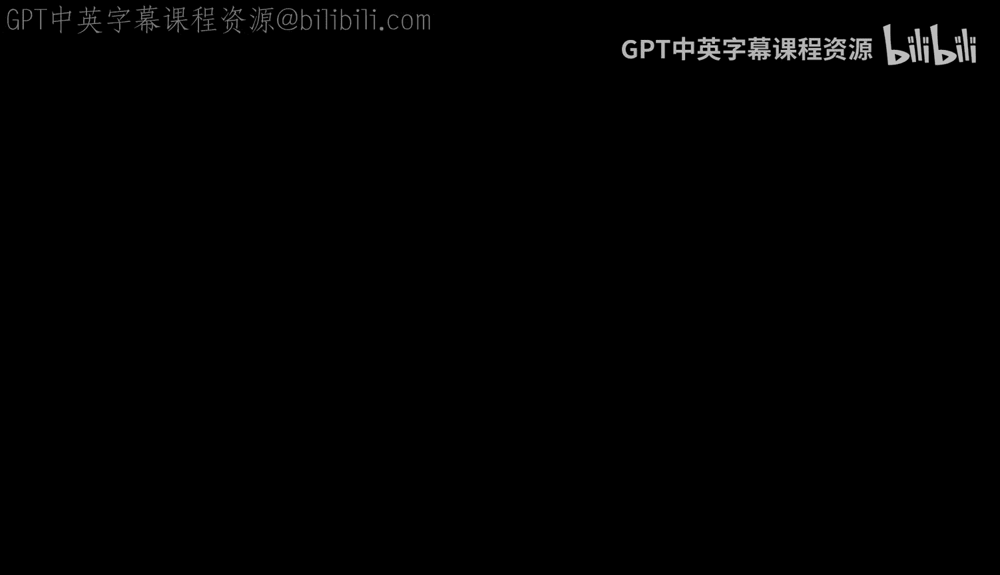
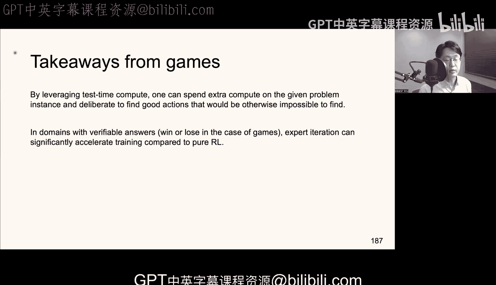

#  006：AlphaGo、测试时计算与专家迭代 🎮



在本节中，我们将探讨AlphaGo、测试时计算与专家迭代。虽然大语言模型的强化学习并未直接使用这些思想，但它们之间存在着紧密且重要的概念联系。

## 从双人零和博弈开始

上一节我们介绍了强化学习的基础概念。本节中，我们来看看一个特殊的场景：双人零和博弈。在这种博弈中，两名玩家相互竞争，一方的收益恰好是另一方的损失。例如，一方获胜，则另一方失败。

在**同步行动博弈**中，双方同时做出决策，例如“石头剪刀布”游戏。而在**序贯行动博弈**（或称回合制游戏）中，双方轮流行动，例如国际象棋和围棋。

我们可以将序贯行动博弈视为一种特殊的同步行动博弈：在游戏开始时，双方各自提供一个策略 **π₁** 和 **π₂**。在现实比赛中，玩家的大脑就是他们的策略，这些策略可以制定计划、适应对手的行动，并在必要时做出随机化决策。

## 极小极大优化

在标准强化学习中，我们求解的是最大化问题，目标是最大化期望累积折扣回报。然而，在涉及对抗性训练的双人零和博弈中，问题被表述为**极小极大优化**。

**公式**：
```
min_{θ₂} max_{θ₁} R(θ₁, θ₂)
```
其中，玩家1（参数θ₁）希望最大化奖励R，而玩家2（参数θ₂）希望最小化玩家1的奖励（即最大化自己的奖励）。

如果配置 **(θ₁*, θ₂*)** 是一个纳什均衡，那么它就是该极小极大问题的一个解。这意味着，任何玩家单方面偏离此配置都不会带来收益。

## 一个简单例子：石头剪刀布

以下是石头剪刀布游戏的收益矩阵示例：
*   玩家1的策略是概率分布 **[P₁(石头), P₁(剪刀), P₁(布)]**。
*   玩家2的策略是概率分布 **[P₂(石头), P₂(剪刀), P₂(布)]**。
*   收益规则：石头胜剪刀，剪刀胜布，布胜石头，相同则为平局。

在深度学习中，我们可以用参数化的softmax分布来表示这些策略。该游戏的纳什均衡是双方都以 **1/3** 的等概率选择每个动作。

## 求解极小极大优化：挑战与算法

在深度学习中，我们通常使用一阶方法（如SGD、Adam）进行优化。然而，极小极大优化的收敛性并非理所当然，其训练过程比单纯的极小化或极大化问题更加不稳定。

**代码**：一个简单的算法是**同步梯度上升/下降法**：
```
# 同时更新两个玩家
θ₁ = θ₁ + α * ∇_{θ₁} R(θ₁, θ₂)  # 玩家1：梯度上升
θ₂ = θ₂ - α * ∇_{θ₂} R(θ₁, θ₂)  # 玩家2：梯度下降
```
但即使在石头剪刀布这样的简单例子中，该算法也可能导致策略振荡且幅度不断增大，无法收敛到纳什均衡。

为了解决不稳定的循环动力学问题，可以采用以下方法：
1.  **额外梯度法**：玩家先计算一个“前瞻”步骤的梯度，然后基于该梯度进行实际更新。
2.  **锚定/权重衰减**：在更新中引入向零点（或某个锚点）收缩的项，可以稳定训练动态。

## 对称博弈与自我对弈

国际象棋和围棋等游戏具有**反对称收益**特性。当收益函数具有这种对称性时，纳什均衡出现在双方策略相同且收益为零的点。此时，两个玩家的梯度在相同输入下具有关联性。

这意味着，我们可以只训练一个策略网络，让这个智能体与**自身**进行对抗。这极大地简化了问题，也是AlphaGo等算法的核心思想之一。

## AlphaGo 训练流程

AlphaGo结合了学习与搜索，实现了超越人类的围棋水平。其训练主要分为几个阶段：

**第一阶段：监督学习（模仿学习）**
*   使用卷积神经网络（CNN）初始化策略网络 **π_θ**。
*   网络输入是棋盘状态 **s**，输出是下一步动作的概率分布。
*   利用人类高手对弈记录的数据集 **(s, a_expert)** 进行训练，最小化交叉熵损失，让网络预测专家的走法。

**第二阶段：强化学习（自我对弈）**
*   以上一阶段训练的策略网络作为起点。
*   让当前策略与其**较早版本**进行对弈（使用延迟机制以稳定训练）。
*   由于是反对称博弈，使用策略梯度方法更新网络参数，目标是最大化获胜概率 **z**（+1为胜，-1为负）。
*   经过RL训练的策略网络，能击败纯模仿学习策略，但尚不足以战胜顶尖人类选手。

**第三阶段：价值网络训练**
*   训练一个价值网络 **V_φ(s)**，用于评估棋盘状态的优劣。
*   通过自我对弈收集数据 **(s, z)**，其中 **z** 是从状态 **s** 出发的最终胜负结果。
*   使用蒙特卡洛策略评估方法，通过随机梯度下降来拟合价值函数。
*   由于围棋动态是确定性的，状态-动作值函数 **Q(s, a)** 与 **V(s‘)** 包含的信息等价（需注意玩家交替导致的符号变化）。

**第四阶段：快速走子策略**
*   训练一个轻量级、快速的策略网络，用于后续的蒙特卡洛树搜索中的快速模拟（ rollout）。
*   该策略计算极快（微秒级），虽棋力不强，但懂基本规则。

## 蒙特卡洛树搜索：测试时计算的核心

纯神经网络策略在有限算力下无法达到顶尖水平，因此需要引入**搜索**。人类棋手也会在行动前进行“深思”，这类似于**系统二**思维。

**MCTS原则**：
1.  **逐步构建搜索树**：在给定的计算预算内，有选择地扩展树的宽度和深度。
2.  **控制搜索宽度**：只考虑“好”的动作，这些动作由策略网络的高概率动作、高Q值动作以及尚未充分探索的动作共同决定。
3.  **评估叶节点**：当搜索达到一定深度（如30步）的叶节点状态 **s̃** 时，通过两种方式评估：
    *   使用**价值网络** **V_φ(s̃)** 直接评估。
    *   使用**快速走子策略**从 **s̃** 开始模拟对局直到终局，以胜负结果 **z** 作为评估。
    *   结合以上两种评估。

基于叶节点的评估，通过回溯更新搜索树中路径上动作的统计值。最终，在根节点处选择统计值最好的动作作为当前步的决策。**MCTS的关键在于：为未来多步进行规划，但只立即执行一步**。

## 从AlphaGo到AlphaGo Zero：专家迭代

AlphaGo Zero是AlphaGo的改进版，其主要进步包括：
*   **无需人类数据**：完全从随机初始化开始，通过自我对弈学习。
*   **更优网络架构**：使用带残差连接和批归一化的更深网络，并共享策略头与价值头的底层特征。
*   **整合搜索到训练中**：采用**专家迭代**算法。

**专家迭代流程**：
1.  基于当前神经网络（提供策略先验和价值评估），运行**蒙特卡洛树搜索**。MCTS产生的策略比原始神经网络策略更强。
2.  使用这个**更强的MCTS策略**进行自我对弈，生成对弈数据，包括状态 **s** 和MCTS推荐的动作 **a_MCTS**，以及最终胜负 **z**。
3.  用这些数据同时改进神经网络：
    *   用 **(s, a_MCTS)** 数据训练**策略网络**，使其模仿MCTS的走法（监督学习）。
    *   用 **(s, z)** 数据训练**价值网络**，使其更准确预测胜负。
4.  改进后的神经网络会使得下一次MCTS更强大，如此循环迭代。

**核心洞察**：通过让神经网络模仿一个由“搜索”增强的、更强大的“专家策略”，可以比纯强化学习更高效地提升性能。

## 测试时计算的威力与启示

在围棋和扑克等领域，**测试时计算**（即在对弈时进行大量搜索）被证明是达到超高水平的关键。

*   **性能差距**：纯神经网络要达到与结合搜索的智能体相同的水平，可能需要**成千上万倍**的训练计算量。
*   **数学原因**：训练一个策略需要应对所有可能的游戏状态。而测试时搜索只需针对**当前具体的局面**，解决一个更小的、相关的子问题，因此效率极高。
*   **通用启示**：在答案可验证的领域（如游戏有明确胜负），结合测试时计算的**专家迭代**方法，能显著加速训练并达到仅靠训练难以企及的性能高峰。

## 本章总结 🎯

在本节课中，我们一起学习了：
1.  **双人零和博弈与极小极大优化**的基本框架及其训练稳定性挑战。
2.  **AlphaGo** 如何结合模仿学习、强化学习、价值网络和蒙特卡洛树搜索，攻克了围棋这一复杂领域。
3.  **AlphaGo Zero** 的**专家迭代**范式，如何通过让神经网络模仿搜索增强的策略，实现更高效、更强大的从零开始学习。
4.  **测试时计算**的核心思想及其重要性：在推理时投入额外计算资源进行搜索或规划，能够解决训练阶段难以完全覆盖的复杂问题，是实现超越性性能的关键技术之一。



这些在游戏AI中发展起来的思想，为后续研究大语言模型中的推理、规划和强化学习提供了重要的概念基础。