#  009：Transformer II（现代Transformer更新与GPT）

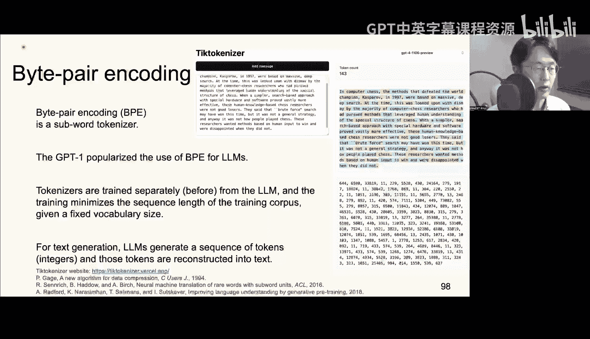

在本节课中，我们将学习现代Transformer架构的关键更新，包括字节对编码（BPE）分词器、RMSNorm、门控前馈网络、旋转位置编码（RoPE）、KV缓存、多查询注意力以及文本生成中的各种采样策略。这些改进共同构成了当今主流大语言模型（如GPT系列）的核心技术基础。

## 字节对编码（BPE）分词器

上一节我们介绍了Transformer的基本架构，本节中我们来看看模型如何处理文本输入。Transformer模型并不直接处理原始文本，而是先将文本转换为一系列称为“令牌”的整数。这个过程由分词器完成，其中字节对编码是一种广泛使用的子词分词方法。

BPE分词器是一种经过训练的分词器，其训练目标是在给定固定词汇表大小的前提下，最小化训练语料库的序列长度。它能够将常见单词编码为单个令牌，同时将罕见单词或专有名词分解为多个子词令牌。

以下是BPE分词器工作方式的一个示例：


右侧截图来自一个交互式分词器网站，展示了GPT-4分词器如何处理一段文本。彩色高亮显示了文本如何被分割成不同的片段，每个片段被单独转换为一个令牌。

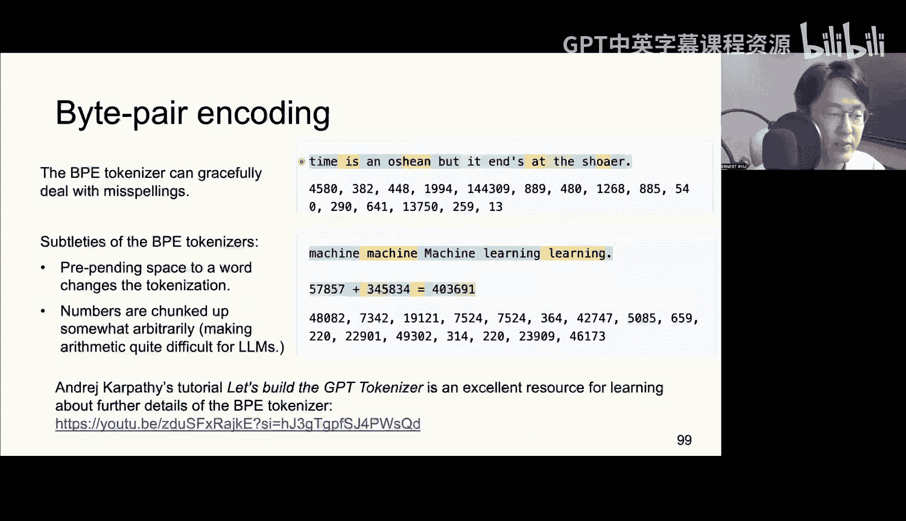

例如：
*   “in”被转换为令牌编号644。
*   “ computer”（注意前面的空格）被转换为令牌编号6500。
*   专有名词“Kasparov”被分解为三个子词令牌：“Kas”、“par”和“ov”。

BPE分词器能够优雅地处理拼写错误。即使单词拼写错误，它也能将其分词为一个令牌序列，尽管这个序列与正确拼写时的序列不同。如果语言模型在训练数据中见过足够多的拼写错误，它就能学会理解这些错误。

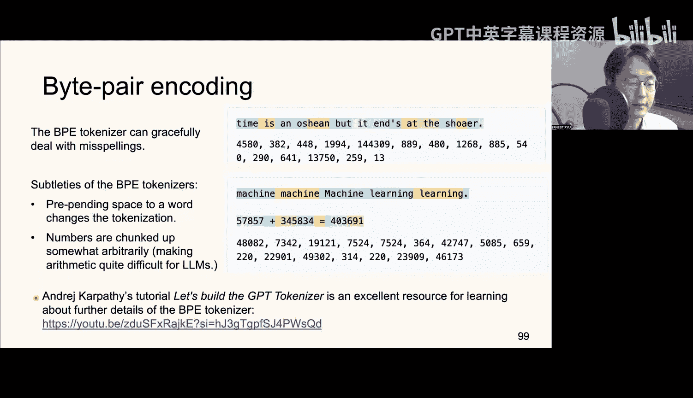

关于BPE分词器的一些细节：
*   在单词前添加空格会改变其分词结果。例如，“machine”、“ machine”和“ Machine”可能对应不同的令牌。
*   数字的分割方式可能有些随意，这种特性部分导致了LLM在进行基本算术运算时遇到困难。

分词是一个复杂且精细的主题。机器学习科学家Andrej Karpathy发布的视频教程《让我们构建GPT分词器》是深入了解这一主题的绝佳资源。

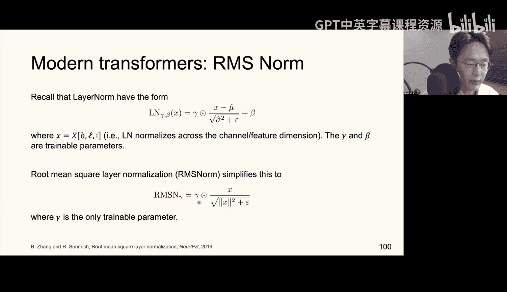

## 现代Transformer架构更新

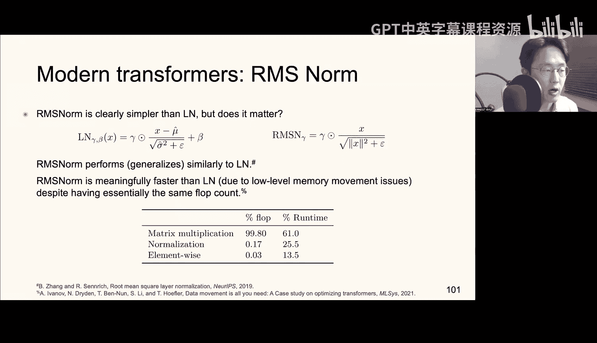

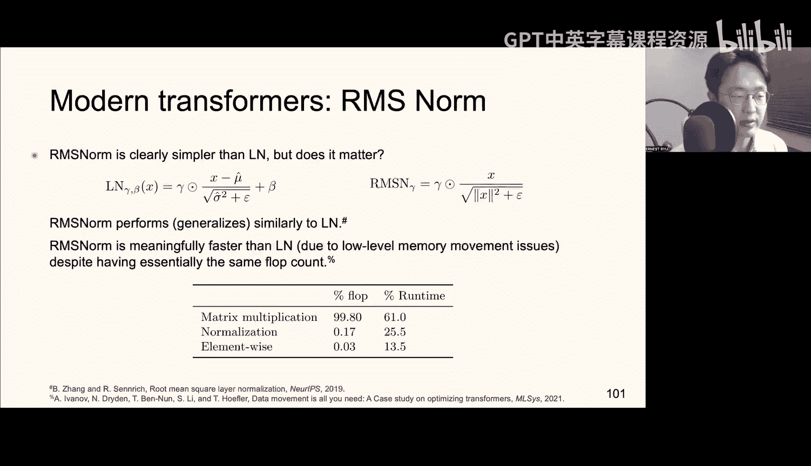

原始的Transformer架构自2017年提出以来保持了惊人的稳定性。只有少数修改被提出并被证实是有效的。让我们来看看这些现代更新。

### RMSNorm（均方根层归一化）

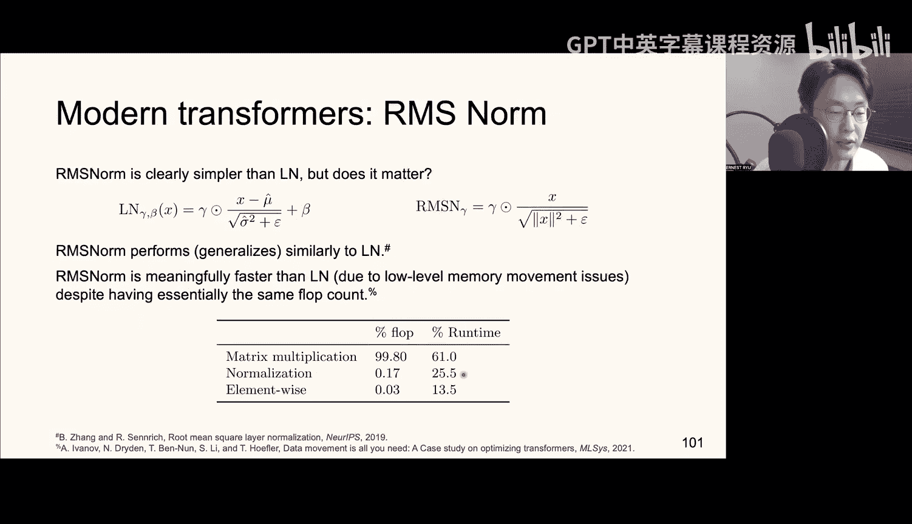

回忆一下，标准的层归一化操作形式如下，它包含减去均值并除以标准差的操作。

```python
# 层归一化 (LayerNorm)
normalized_output = (x - mean(x)) / std(x)
```

RMSNorm是层归一化的一种简化形式，全称是均方根层归一化。其形式如下：

```python
# RMSNorm
normalized_output = x / sqrt(mean(x^2))
```

在RMSNorm中，我们不再减去均值，并且不是除以标准差，而是除以向量x的范数。对于可训练参数，RMSNorm保留了缩放参数gamma，但移除了偏置项。

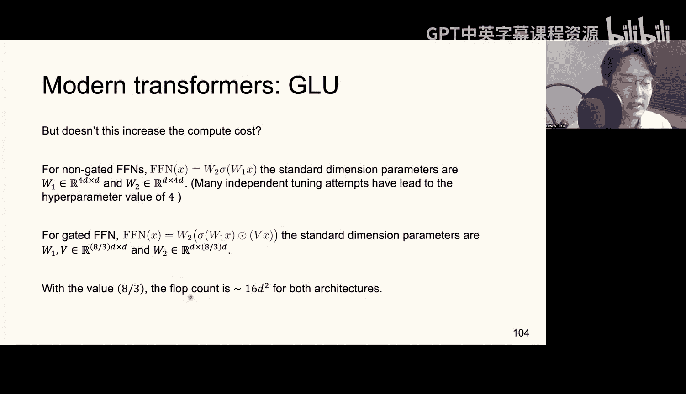

与层归一化相比，RMSNorm在性能上表现相似，但速度明显更快。这种速度差异并非源于浮点运算次数的不同，而是由于GPU架构中高速缓存内存与较慢的高带宽内存之间的底层内存移动问题。归一化层虽然只占总浮点运算的很小一部分（约0.17%），但由于内存问题，却可能占据总运行时间的相当大比例（约25.5%）。RMSNorm的效率提升可以显著减少这部分运行时间。

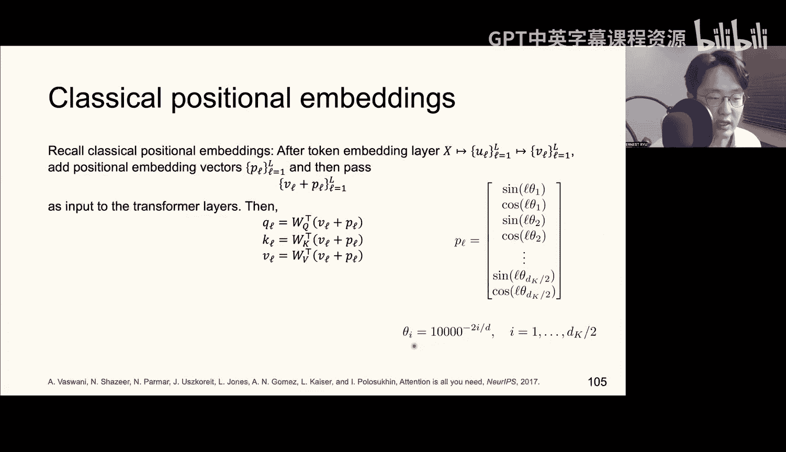

### 无偏置项与门控前馈网络

实际上，不仅是RMSNorm，大多数现代Transformer都完全避免了使用偏置项。
*   令牌嵌入层和输出投影层被设计为没有偏置。
*   用于生成Q、K、V向量的注意力线性层也不使用偏置项。
*   原始Transformer在前馈网络层使用了偏置，但现代实现通常也不使用。

现代Transformer还采用了门控线性单元来改进前馈网络层。一个非门控的FFN通常具有以下形式（无偏置项）：

```
FFN(x) = W2 * σ(W1 * x)
```

而一个GLU门控FFN具有以下形式：

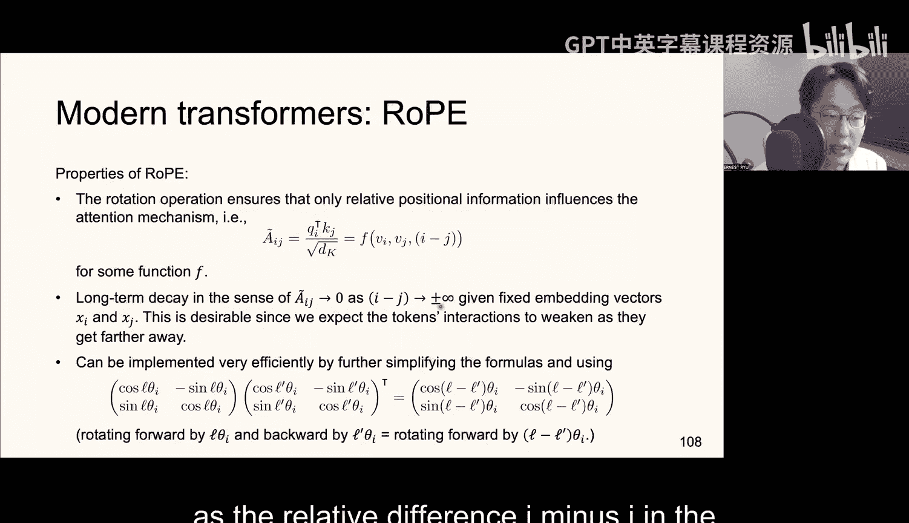

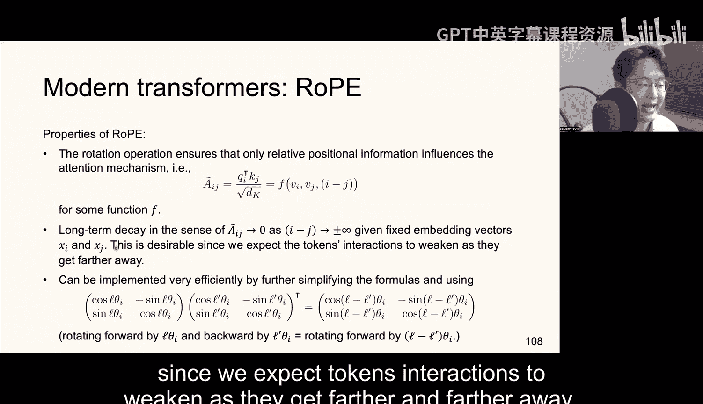

```
GLU_FFN(x) = W2 * (σ(W1 * x) ⊙ (V * x))
```

其中`⊙`表示逐元素乘法。
*   如果σ是ReLU激活函数，则称为ReGLU。
*   如果σ是GELU激活函数，则称为GeGLU。
*   如果σ是Sigmoid激活函数，则称为Sigmoid-GLU。

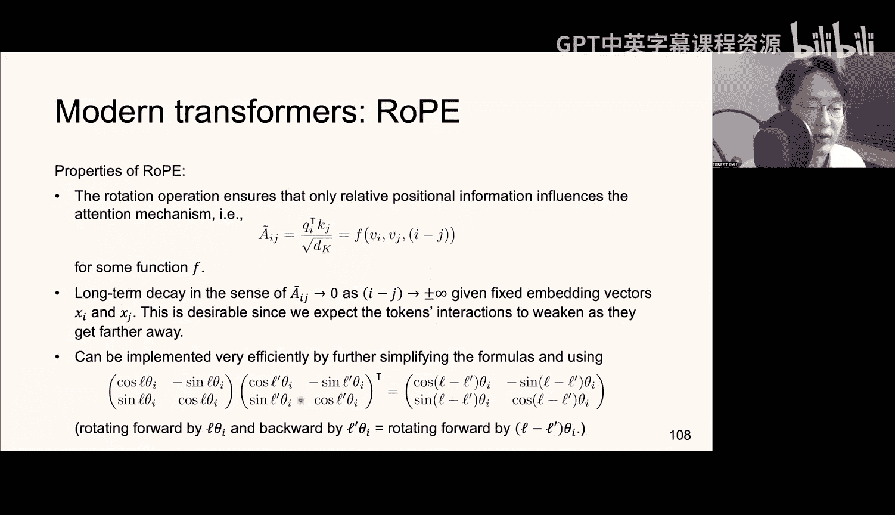

研究表明，GeGLU和Sigmoid-GLU的性能略优于非门控FFN。为了公平比较，在计算成本大致相同的情况下（通过调整矩阵维度实现），门控FFN往往表现更好。

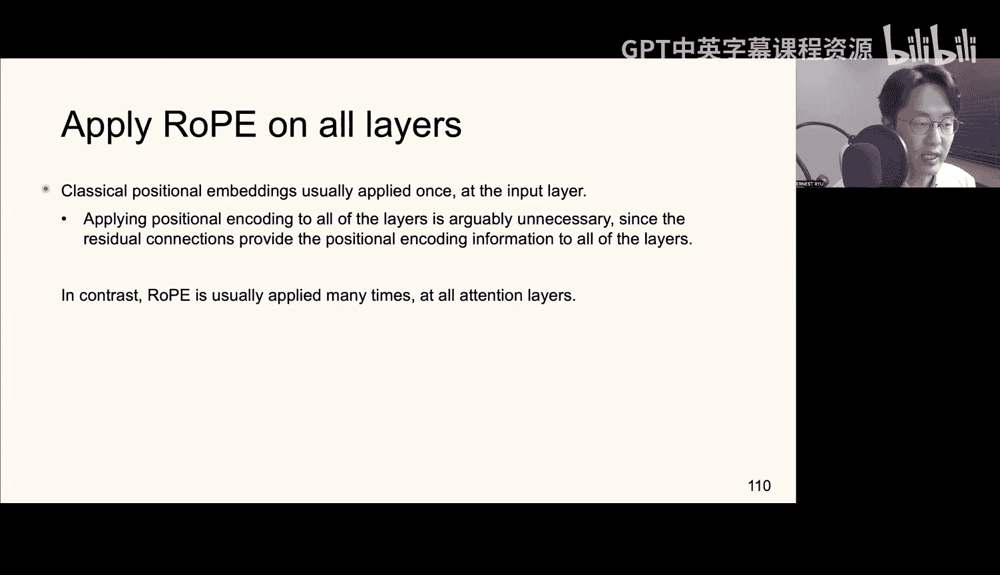

### 旋转位置编码

许多现代Transformer已经放弃了经典的 sinusoidal 位置嵌入，转而使用这种更新的RoPE嵌入。RoPE是旋转位置嵌入的缩写。

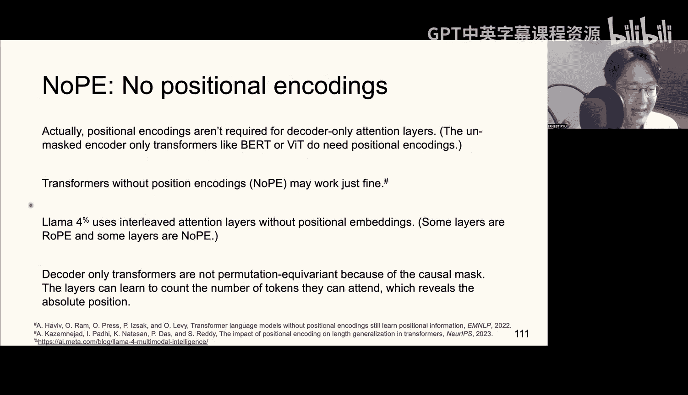

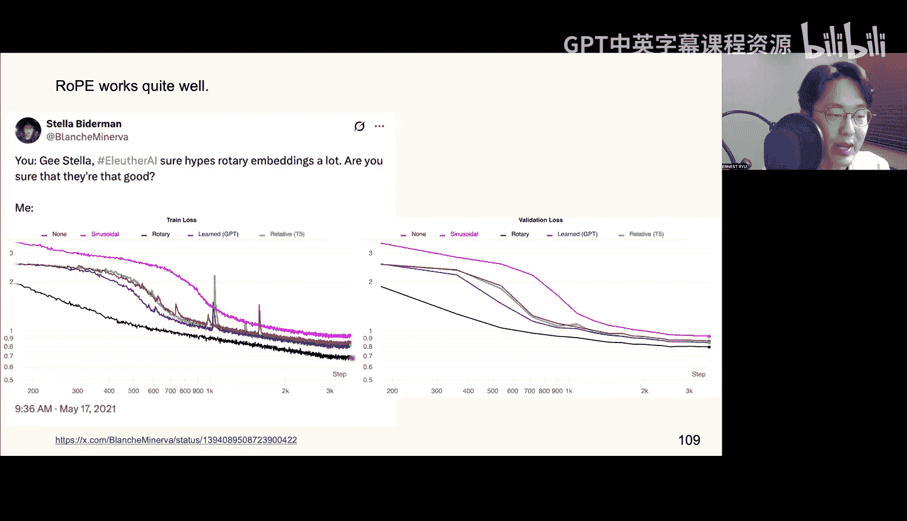

经典的位置嵌入机制是在令牌嵌入向量V上直接添加位置向量P。RoPE则不同，它作用于注意力机制中的查询向量Q和键向量K。具体来说，它将维度为D的Q和K向量重新解释为D/2个复数，然后让这些复数乘以一系列复数指数（进行旋转）。旋转的角度频率与经典正弦嵌入中使用的频率相同。

经过旋转操作后的Q和K向量被送入注意力函数进行计算。RoPE确保只有相对位置信息影响注意力机制，并且具有长期衰减的特性，即当两个令牌的位置差趋于无穷时，它们之间的注意力分数会趋于0，这符合我们的直觉。RoPE的实现可以非常高效，并且在实际应用中效果很好。需要注意的是，RoPE通常应用于所有注意力层，而经典的位置嵌入只添加在模型开头一次。

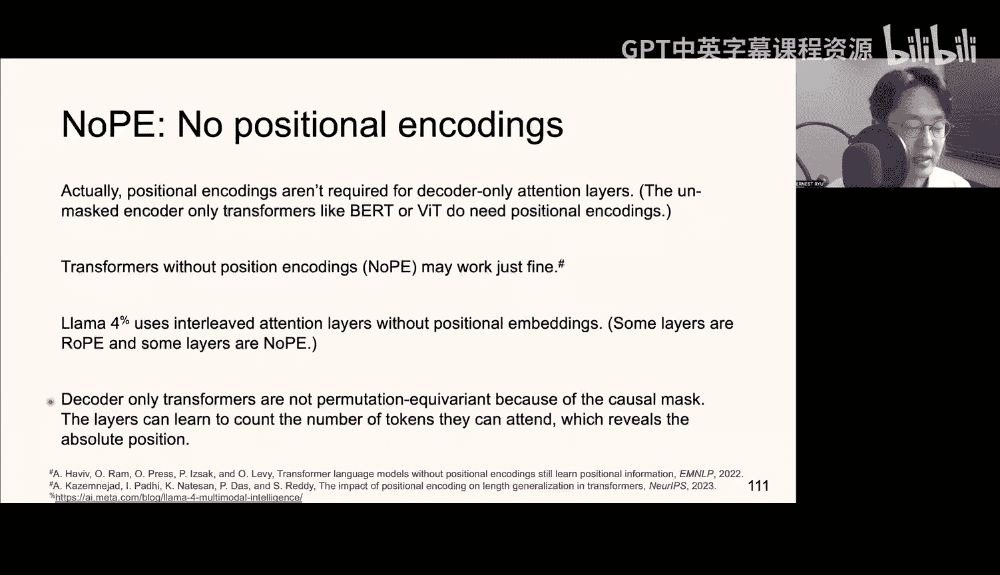

### 需要位置编码吗？

一个有趣的问题是：位置编码是否必需？事实证明，对于仅解码器的Transformer（带有因果掩码），位置编码并不是严格必需的。因为因果掩码的存在使得模型不再是排列等变的，注意力层可以通过计算其能关注到的令牌数量来推断出绝对位置。因此，显式的位置编码对于掩码注意力层来说并非必要。不过，使用RoPE作为显式的位置编码机制仍然是有帮助的，即使不是严格必需。

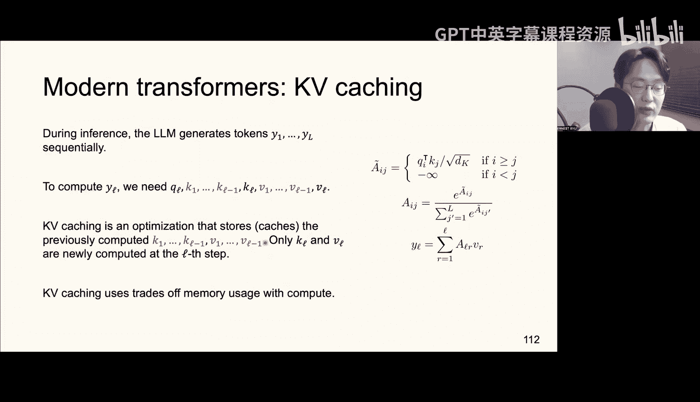

## 推理优化技术

### KV缓存

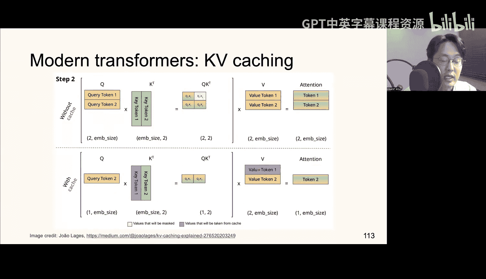

KV缓存是一种现代Transformer用来提高推理效率的技术。在推理过程中，语言模型按顺序生成令牌y1, y2, ..., yL。为了计算第L个令牌，我们只需要当前的查询向量，但需要所有之前的键向量和值向量。

KV缓存通过存储（缓存）之前计算好的键和值向量来优化这一过程。这样，在每一步只需要计算当前的键和值向量。这是一种用内存使用换取计算量的机制：存储之前的向量需要内存，但避免了重新计算它们，从而减少了计算量。


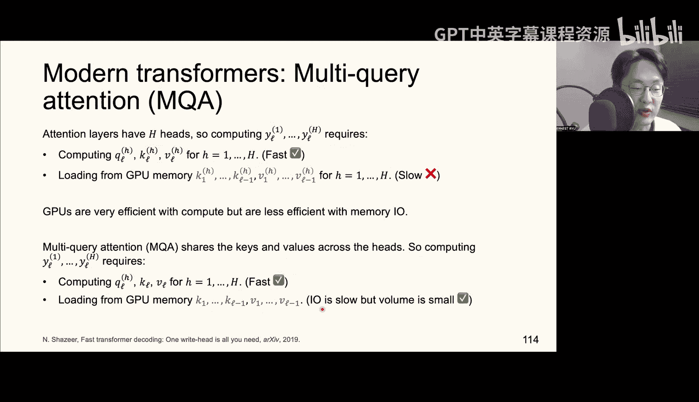

上图展示了有无KV缓存的区别（图片来自Joshua Loong的Medium文章）。顶部是没有缓存的情况，每次生成新令牌都需要重新计算所有之前的K和V向量。底部是使用KV缓存的情况，紫色的键值向量被缓存和重用，无需重新计算。

### 多查询注意力与分组查询注意力

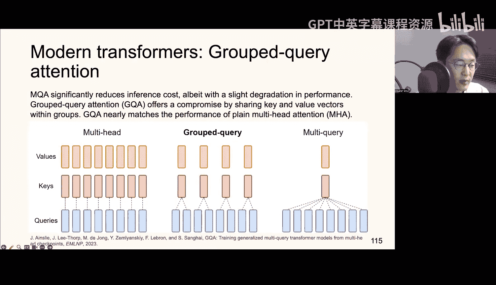

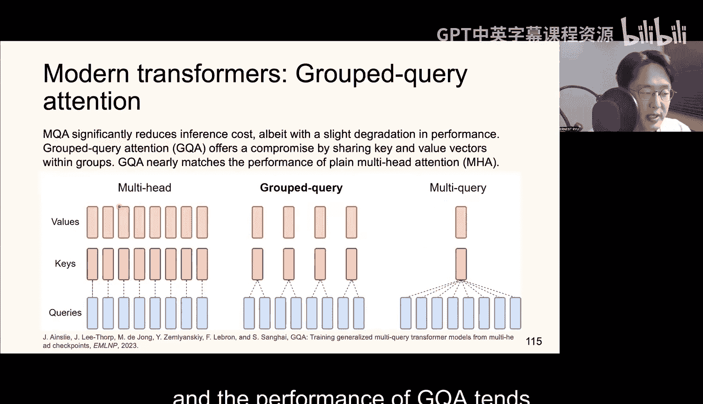

即使使用KV缓存，在标准的多头注意力中，每个头都有独立的K和V向量，在推理时都需要从GPU的慢速内存中加载，这仍然存在效率瓶颈。GPU擅长计算，但在内存I/O方面效率较低。

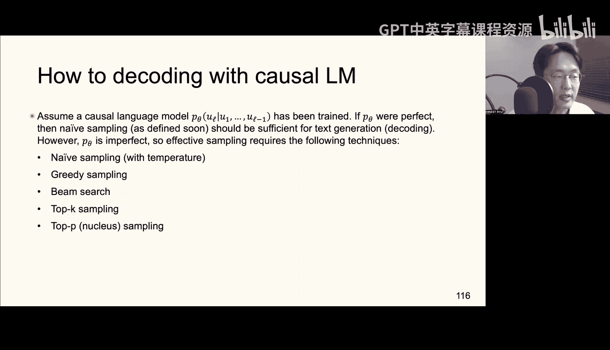

多查询注意力试图通过在所有头之间共享键和值向量来更好地利用GPU的计算效率，同时避免内存I/O瓶颈。这样，需要从内存中加载的K和V向量体积就减少了H倍（H为头数），从而显著降低了推理成本，尽管可能会带来轻微的性能下降。

分组查询注意力是一种折中方案。它将头分成若干组，组内的查询共享键和值向量。GQA的性能几乎与普通的多头注意力相匹配，同时效率更高。


上图展示了MHA、MQA和GQA的区别。在MQA中，所有查询共享同一套K和V。在GQA中，查询被分组，组内共享K和V。

## 文本生成与采样策略

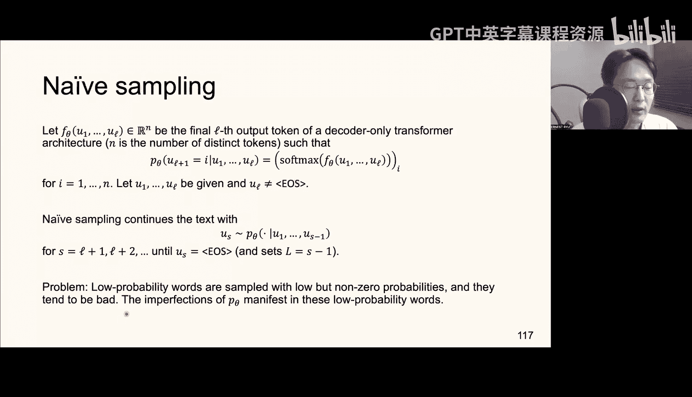

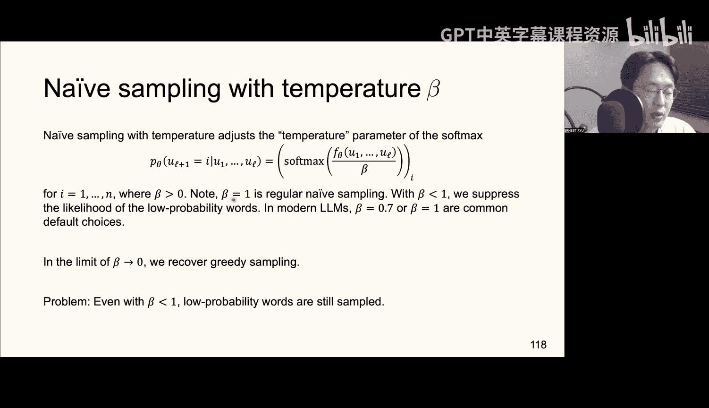

现在，假设一个因果语言模型Pθ已经训练完成。我们需要知道如何使用它来生成文本，这个过程也称为解码。

如果语言模型是完美的，那么朴素的采样方法就足以生成好的文本。然而，训练好的语言模型并不完美。因此，有效的采样需要以下技术：带温度的朴素采样、贪婪采样、束搜索、Top-K和Top-P采样。

### 基础采样方法

设fθ为仅解码器Transformer的最终输出，它给出了下一个令牌的预测向量。我们将其通过softmax函数，得到下一个令牌的概率分布。

**朴素采样**：给定文本（令牌序列u1到uS-1），下一个令牌uS根据这个概率分布进行随机采样。问题在于，低概率词仍有被采样的可能，而这些词往往质量较差。

**带温度的采样**：通过一个温度参数β来调整softmax的“尖锐”程度。具体做法是将Transformer的输出fθ除以β，然后再做softmax。
*   当β=1时，就是常规的朴素采样。
*   当β<1时，会放大fθ的幅度，从而抑制低概率词的可能性。
*   当β→0时，就变成了贪婪采样。
在现代大语言模型中，β=0.7或β=1是常见的默认选择。β=1（高温）会导致更多样化的生成，但也可能选择糟糕的续写；β=0.7（低温）则生成更保守、更安全的文本。

**贪婪采样**：直接选择概率最高的词作为下一个令牌。但贪婪采样存在两个问题：
1.  它不能保证生成整体概率最高的令牌序列。
2.  概率最高的文本并不总是最好的续写。

理论上，要生成整体概率最高的序列，需要进行精确的最大后验解码，但这需要搜索所有可能的序列，是一个计算上不可行的问题（NP难）。

贪婪采样之所以不等于最优序列，是因为它每一步只选择当前最可能的词，而没有考虑这个选择对后续步骤的全局影响。有时，早期选择一个稍次优的词，可能会开启一条整体更优的生成路径。

### 束搜索

束搜索是一种折中的、可操作的启发式方法，用于近似精确MAP解码，它产生的序列比贪婪搜索具有更高的似然度。其思想是：我们不完全贪婪，但保持一定的贪婪性。

在解码的每一步，我们跟踪K个最有可能的部分生成序列（K称为束宽，通常为5或10）。在每一步，我们从这K个序列扩展出新的候选序列，然后只保留其中总对数概率最高的K个序列，如此反复，直到生成结束。当束宽K=1时，束搜索就退化为贪婪搜索。

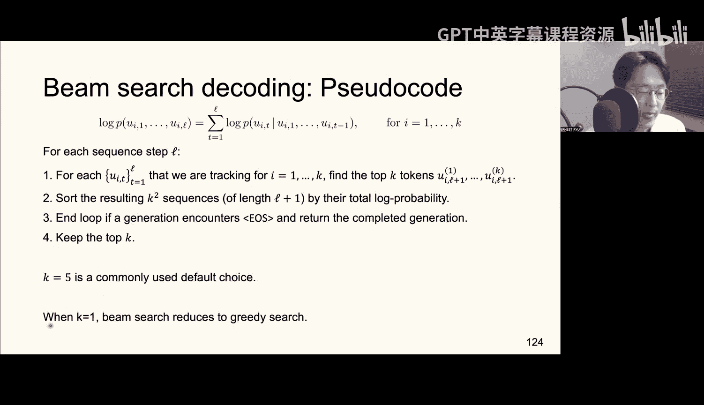

### 现代采样策略

然而，研究发现，人类书写的高质量文本并不总是由高概率的下一个词组成。束搜索会避免任何出人意料的词，导致生成的文本重复且无趣。有趣且有用的文本应包含一些无法从上下文中完全推断出的信息。

因此，束搜索已不再用于主流LLM的文本生成。随着模型变得更好，低概率词的质量也在提高，刻意避免它们的必要性就降低了。

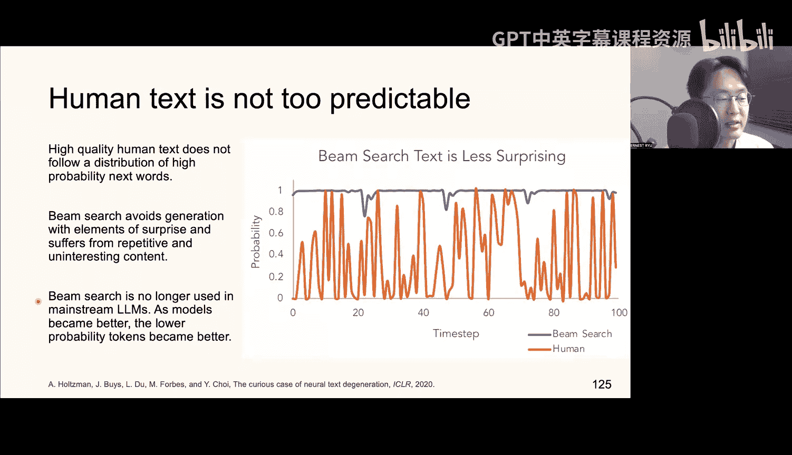

现代大语言模型主要使用以下采样方法的组合：

**Top-K采样**：只从概率最高的K个词中进行采样，并使用温度参数β调整其概率分布。采样前，对这K个词的原始分数进行softmax，使其概率之和为1。K≈50是一个常见的默认值。K=∞意味着不使用Top-K。

**Top-P采样（核采样）**：从一个最小的高概率词集合中进行采样，使得这些词的累计概率超过阈值P。例如，P=0.9意味着从前N个最可能的词中采样，使得这N个词的概率之和刚好超过0.9。P≈0.9是一个常见的默认值。P=1.0意味着不使用Top-P。

最后，大多数现代LLM通过结合温度参数β、Top-K和Top-P这三种机制来执行采样。具体如何组合这三种机制因模型而异，但核心思想是利用它们来平衡生成的多样性、流畅性和创造性。

---

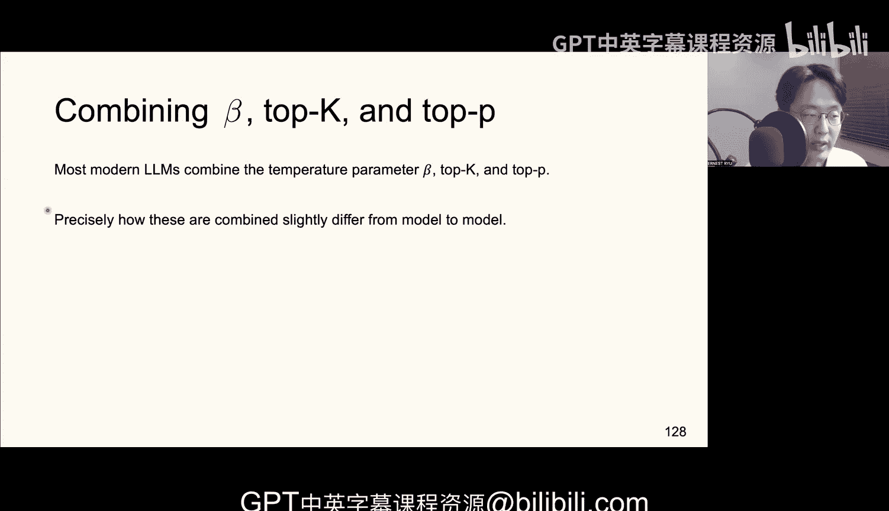

本节课中我们一起学习了现代Transformer架构的关键改进和文本生成策略。我们了解了BPE分词器如何将文本转换为模型可处理的令牌，认识了RMSNorm、无偏置设计、门控FFN和RoPE等架构更新如何提升模型的效率和性能。我们还探讨了KV缓存、MQA/GQA等推理优化技术。最后，我们深入分析了从贪婪采样、束搜索到现代主流的Top-K、Top-P采样等多种文本生成策略的原理与优劣，理解了如何通过温度、Top-K、Top-P等参数来控制生成文本的质量与多样性。这些知识是理解和使用当今大语言模型的基础。