# 1：模式识别与机器学习导论 🎯

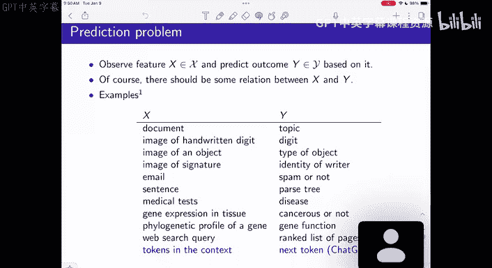

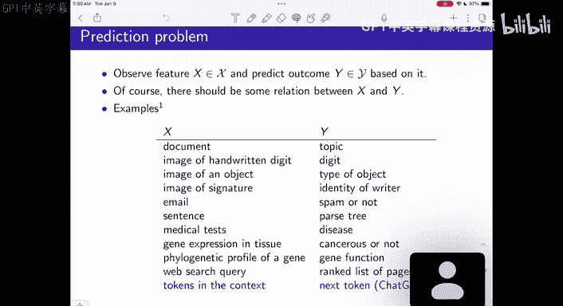

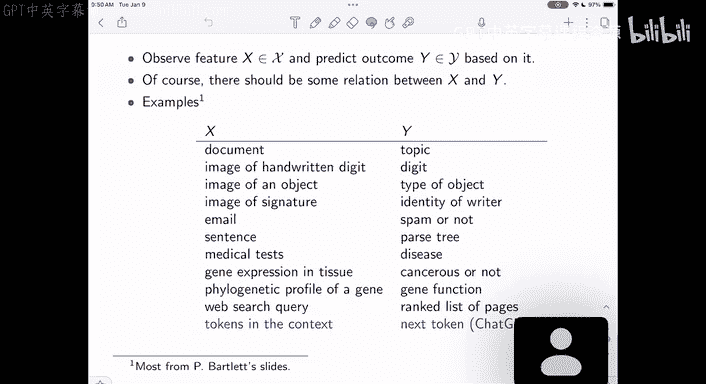


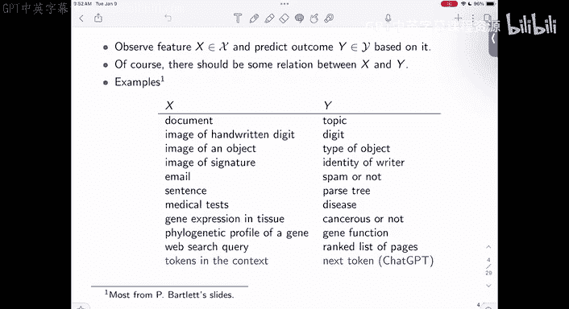

在本节课中，我们将要学习模式识别与机器学习的基本概念。我们将从一个简单的例子出发，探讨如何利用数据中的特征来预测结果，并理解最优分类器的构建原理。


## 概述

模式识别与机器学习的核心任务是根据输入数据（特征）来预测输出结果（目标）。例如，给定一张图片，判断它是猫还是狗；或者根据一封邮件的内容，判断它是否为垃圾邮件。本节课我们将从一个非常简单的二元分类问题开始，逐步引入核心概念。

## 从简单例子开始：泰坦尼克号生存预测

假设我们有一个关于泰坦尼克号乘客的数据表。每一行代表一个人，包含诸如乘客等级、年龄、性别以及是否幸存等信息。我们的目标是预测一个人是否幸存。

在这个例子中，我们将**幸存状态**作为我们的预测目标 `Y`，它取值为0（未幸存）或1（幸存）。我们首先只使用一个非常简单的特征：**性别** `X`，它取值为“女性”（F）或“男性”（M）。

我们的数据可以看作是从一个未知的联合分布 `P` 中独立同分布地抽取的样本。`X` 和 `Y` 都是随机变量。

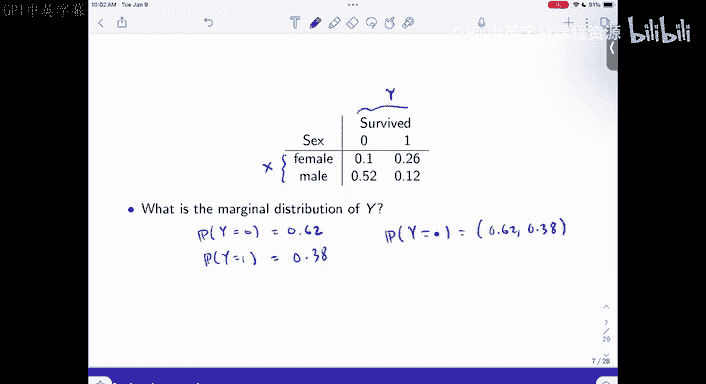

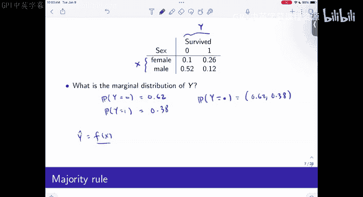

## 最简单的分类器：多数规则


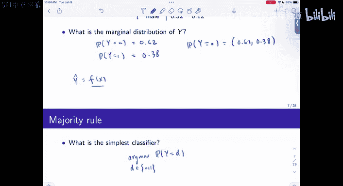


如果我们完全忽略特征 `X`，只根据 `Y` 的分布来预测，最简单的分类器就是**多数规则**。它总是输出出现概率更高的那个类别。


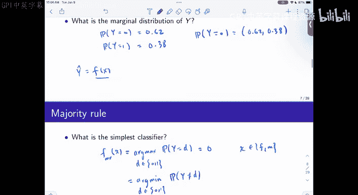


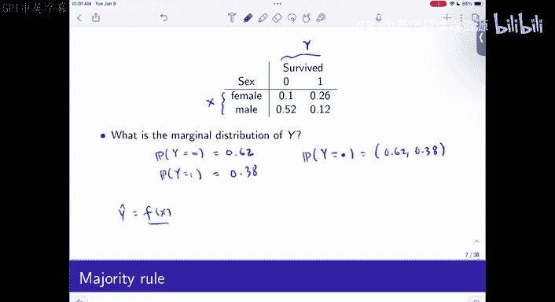

具体来说，分类器 `F_majority` 是一个常数函数：
```
F_majority(x) = argmax_{d ∈ {0,1}} P(Y = d)
```
在我们的数据中，`P(Y=0)=0.62`，`P(Y=1)=0.38`。因此，多数规则分类器总是预测 `Y=0`（未幸存）。这个分类器的**误分类率**（预测错误的概率）就是 `P(Y=1) = 0.38`。

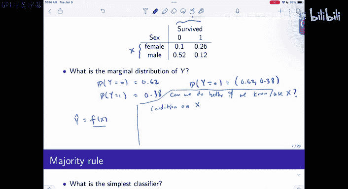

上一节我们介绍了不依赖任何特征的最简单分类器。本节中我们来看看如何利用特征 `X` 来构建更好的分类器。

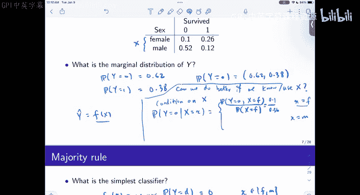

## 利用特征：条件概率与贝叶斯分类器

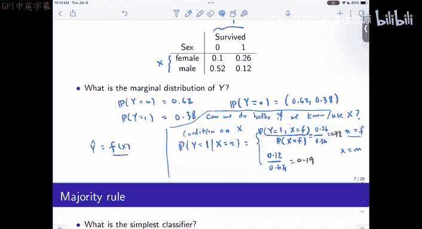


当我们观察到特征 `X` 的具体取值（例如，性别为女性）时，预测 `Y` 的更合理方式是基于**条件概率**。我们不再看 `Y` 的整体分布，而是看**在给定 `X` 的条件下，`Y` 的分布**。


对于给定的 `X = x`，最优的预测是选择条件概率更大的那个类别：
```
F_bayes(x) = argmax_{d ∈ {0,1}} P(Y = d | X = x)
```
这个分类器被称为**贝叶斯分类器**。


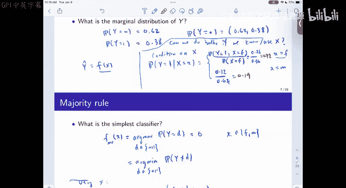

以下是计算条件概率的步骤：
1.  从联合分布表中，我们可以计算出所需的边际概率和条件概率。
2.  例如，`P(Y=1 | X=F) = P(Y=1, X=F) / P(X=F) = 0.26 / 0.36 ≈ 0.72`。
3.  类似地，`P(Y=1 | X=M) = 0.12 / 0.64 ≈ 0.19`。


因此，贝叶斯分类器的决策规则是：
*   如果 `X = F`（女性），则预测 `Y=1`（幸存），因为 `P(Y=1|X=F) > P(Y=0|X=F)`。
*   如果 `X = M`（男性），则预测 `Y=0`（未幸存），因为 `P(Y=0|X=M) > P(Y=1|X=M)`。


## 评估分类器性能：误分类率


为了比较分类器的好坏，我们需要一个评估标准。一个常用的标准是**误分类率**，即分类器做出错误预测的概率。


对于一个分类器 `F(x)`，其误分类率 `R(F)` 定义为：
```
R(F) = P( Y ≠ F(X) )
```
我们可以通过两种方式计算 `R(F)`：

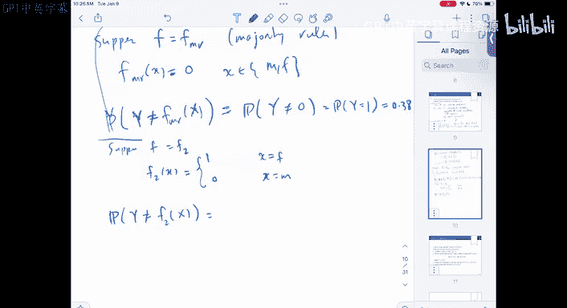

**方法一：直接根据联合分布计算**
误分类事件是以下两个互斥事件的并集：
1.  `X = F` 且 `Y = 0` （对女性预测了幸存，但她实际未幸存）
2.  `X = M` 且 `Y = 1` （对男性预测了未幸存，但他实际幸存）
因此，`R(F_bayes) = P(X=F, Y=0) + P(X=M, Y=1) = 0.10 + 0.12 = 0.22`。


**方法二：利用全概率公式计算**
通过条件概率计算：
```
R(F) = P(Y ≠ F(X) | X=F) * P(X=F) + P(Y ≠ F(X) | X=M) * P(X=M)
```
对于贝叶斯分类器：
*   当 `X=F` 时，我们预测 `Y=1`，所以错误发生在 `Y=0` 时，即 `P(Y=0|X=F)=0.28`。
*   当 `X=M` 时，我们预测 `Y=0`，所以错误发生在 `Y=1` 时，即 `P(Y=1|X=M)=0.19`。
因此，`R(F_bayes) = 0.28*0.36 + 0.19*0.64 ≈ 0.22`。

可以看到，贝叶斯分类器的误分类率（0.22）远低于多数规则分类器的误分类率（0.38）。利用特征 `X` 显著提升了预测性能。

## 最优性证明：贝叶斯分类器是最优的


为什么贝叶斯分类器 `F_bayes` 是最优的？我们可以从最小化误分类率的角度来理解。


对于任意一个分类器 `F(x)`，其误分类率可以写为：
```
R(F) = E_X [ P( Y ≠ F(X) | X ) ]
```
其中 `E_X` 表示对 `X` 的分布求期望。由于 `P(X)` 是固定的，要最小化 `R(F)`，就需要对每一个可能的 `X = x`，最小化条件误分类概率 `P( Y ≠ F(x) | X=x )`。


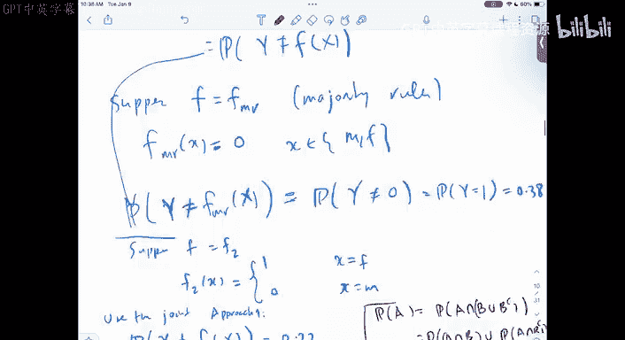


对于给定的 `x`，`F(x)` 只能取 0 或 1。因此：
*   如果设置 `F(x) = 1`，则条件误分类概率为 `P(Y=0 | X=x)`。
*   如果设置 `F(x) = 0`，则条件误分类概率为 `P(Y=1 | X=x)`。

显然，为了最小化错误概率，我们应该选择条件概率更大的那个类别作为预测结果，即：
```
F*(x) = argmax_{d ∈ {0,1}} P(Y = d | X = x)
```
这正是贝叶斯分类器的定义。因此，贝叶斯分类器在所有可能的分类器中，实现了最小的可能误分类率。这个最小的误分类率被称为**贝叶斯错误率**，它反映了数据本身固有的、无法消除的不确定性。


在我们的例子中，0.22 就是使用性别特征 `X` 时的贝叶斯错误率，任何分类器都无法取得比这更低的错误率。


## 总结


本节课中我们一起学习了模式识别与机器学习的基础：
1.  **问题定义**：我们引入了从特征 `X` 预测目标 `Y` 的监督学习框架。
2.  **简单基准**：我们首先构建了不依赖特征的多数规则分类器，并计算了其误分类率作为性能基准。
3.  **利用特征**：我们引入了条件概率的概念，并构建了利用特征 `X` 的贝叶斯分类器 `F_bayes(x) = argmax_d P(Y=d|X=x)`。
4.  **性能评估**：我们学习了使用误分类率 `R(F) = P(Y ≠ F(X))` 来量化分类器的性能，并计算比较了两种分类器的误分类率。
5.  **最优性**：我们证明了贝叶斯分类器在最小化误分类率的意义下是最优的，其错误率（贝叶斯错误率）是理论下限。


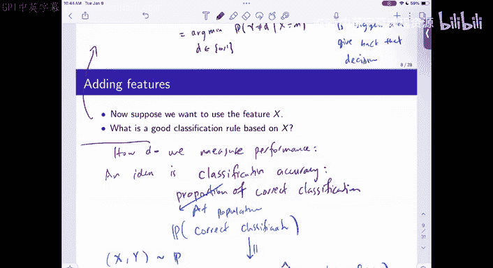

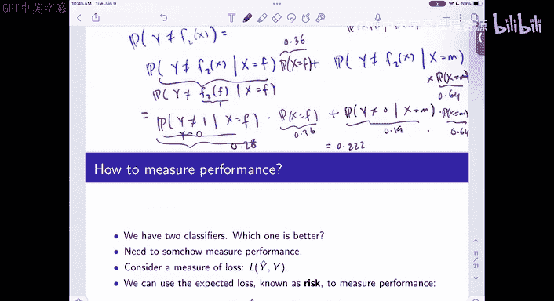

这个简单的二元分类例子揭示了机器学习的一个核心思想：通过利用相关特征和条件概率，我们可以构建比简单猜测更智能、更准确的预测模型。在接下来的课程中，我们将把这个框架扩展到更复杂的特征和更一般的场景。