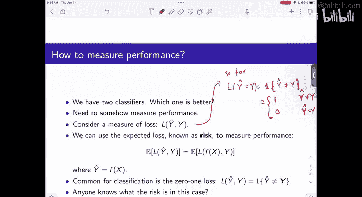

#  2：模式识别与机器学习导论 - 第二讲 🧠

在本节课中，我们将学习模式识别与机器学习的基本概念，特别是如何构建一个简单的分类器。我们将从概率框架出发，探讨最优分类器的定义，并学习如何在实际数据中应用这些理论。

---

## 概述

上一节我们介绍了模式识别的基本问题。本节中，我们将深入探讨如何利用概率框架构建一个分类器，并学习如何评估其性能。

## 概率框架与最优分类器

我们首先将问题建模为概率问题。设特征为随机变量 **X**，目标（响应）为随机变量 **Y**。它们之间的关系由一个联合分布 **P(X, Y)** 描述。在二元分类问题中，**Y** 的取值为 0 或 1。

最简单的分类器是忽略所有特征的“多数规则”分类器。它总是预测出现概率更高的类别。例如，如果 **P(Y=1) < 0.5**，则总是预测 **Y=0**。

然而，当我们引入特征 **X** 后，最优决策应基于条件概率 **P(Y | X)**。对于给定的特征值 **x**，我们选择使条件概率 **P(Y=d | X=x)** 最大的决策 **d**。这被称为贝叶斯最优分类器，其决策规则为：

**f*(x) = argmax_{d ∈ {0,1}} P(Y=d | X=x)**

这个规则等价于最小化错误分类概率 **P(Y ≠ f(X))**。

## 损失函数与风险

为了更一般地衡量分类器的性能，我们引入损失函数 **L(Y, Ŷ)**。它量化了真实标签 **Y** 与预测标签 **Ŷ** 之间的“代价”。

我们之前使用的衡量标准（错误率）对应于 **0-1 损失**：

**L_{0-1}(Y, Ŷ) = I(Y ≠ Ŷ)**

其中 **I(·)** 是指示函数。该损失的期望值 **E[L(Y, Ŷ)]** 就是错误分类概率。

更一般地，我们可以定义非对称的代价。例如，在疾病诊断中，将健康人误诊为患病（假阳性）和将患者误诊为健康（假阴性）的代价可能不同。这被称为**代价敏感学习**。

在一般损失函数下，最优分类器变为最小化条件风险：

**f*(x) = argmin_{d} E[L(Y, d) | X=x]**

对于 0-1 损失，这简化为之前的最大后验概率规则。

## 从数据中学习：经验估计

在实际中，我们并不知道真实的概率分布 **P(X, Y)**，我们只有从该分布中独立同分布采样得到的训练数据 **{(X_i, Y_i)}_{i=1}^n**。

最直接的方法是使用经验分布（即样本比例）来估计联合概率。对于离散特征，条件概率 **P(Y=1 | X=x)** 的估计为：

**\hat{η}(x) = \hat{P}(Y=1 | X=x) = (∑_{i=1}^n I(X_i = x, Y_i = 1)) / (∑_{i=1}^n I(X_i = x))**

这相当于在特征 **X=x** 的样本子集中，计算 **Y=1** 的比例。

得到估计的回归函数 **\hat{η}(x)** 后，我们的“插件”分类器规则为：

**\hat{f}(x) = I(\hat{η}(x) > 1/2)**

## 决策树与局部平均

上述估计方法可以直观地用**决策树**表示。从根节点（使用多数规则）开始，根据特征 **X** 的不同取值进行分支，在每个叶节点上计算 **Y** 的条件概率估计并做出决策。

经验条件概率估计公式可以重写为加权平均的形式：

**\hat{η}(x) = ∑_{i=1}^n w_i(x) Y_i**

其中权重 **w_i(x) = I(X_i = x) / (∑_{j=1}^n I(X_j = x))**。这揭示了其本质：**对于给定的 x，我们只对具有相同特征值的训练样本的 Y 进行平均**。

这为后续推广奠定了基础。当特征是连续值时，我们无法找到完全相同的 **X_i**，但可以平均“相似”或“邻近”的样本点，这引出了 **k-近邻** 等局部平均方法。

## 性能评估与过拟合

构建分类器后，我们需要评估其性能。一个自然的想法是使用**训练误差**来估计真实风险：

**\hat{R}_{train}(f) = (1/n) ∑_{i=1}^n I(Y_i ≠ f(X_i))**

然而，这里存在一个关键问题：我们用来评估的分类器 **f** 本身正是基于这同一批训练数据学习得到的。这会导致对真实泛化误差的**低估**，这种现象与**过拟合**密切相关。

如果我们使用的模型复杂度过高（例如，可供选择的分类函数过多），它可能会“记住”训练数据中的噪声，使得训练误差非常小，但在未见过的数据上表现糟糕。这就是为什么我们需要使用独立的**测试集**或交叉验证来更可靠地评估性能。

---

## 总结

本节课中我们一起学习了：
1.  在概率框架下，基于条件概率 **P(Y|X)** 的贝叶斯最优分类器。
2.  使用 0-1 损失和更一般的损失函数来衡量分类器性能。
3.  如何利用训练数据，通过经验估计（计算比例）来近似最优分类器，得到“插件”估计。
4.  决策树是表示这种基于条件概率决策的直观方式。
5.  经验估计可以视为局部加权平均，为处理连续特征提供了思路。
6.  评估分类器性能时，需要注意训练误差的局限性以及过拟合的风险。

这些概念构成了监督学习，特别是分类问题的基础。下一讲我们将继续深入，探讨更复杂的模型和评估方法。