#  3：模式识别与机器学习导论 - 第3讲 🧠


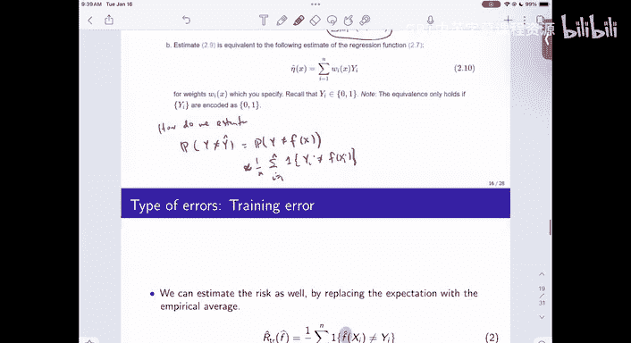


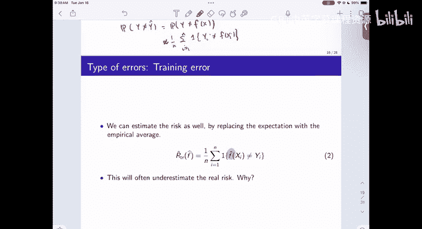

在本节课中，我们将学习如何评估分类器的性能，理解训练误差与真实风险之间的差异，并探讨通过引入更多特征来改进分类器的方法。我们还将讨论过拟合问题及其解决方案。


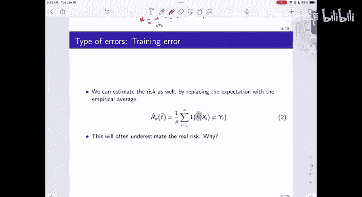

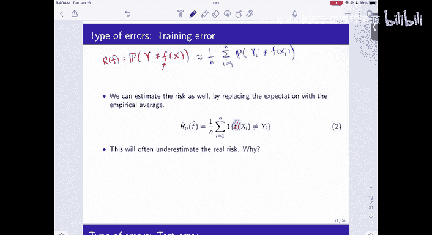

---

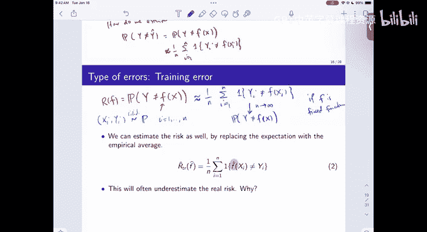

## 回归函数的近似

上一节我们介绍了分类器的基本概念。本节中我们来看看，分类器可以被视为对回归函数的一种近似。回归函数是给定特征 **X** 时，目标变量 **Y** 的条件概率：**P(Y=1 | X=x)**。

分类器通过一种称为“局部平均”的形式来近似这个函数。对于任何一个新的数据点 **x**，我们为训练集中的每个数据点 **i** 分配一个权重 **w_i(x)**。这个权重衡量了新点 **x** 与训练点 **x_i** 的相似性。

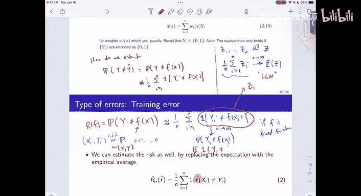

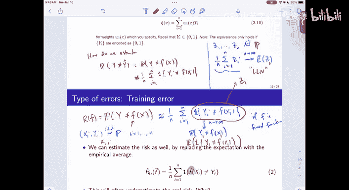

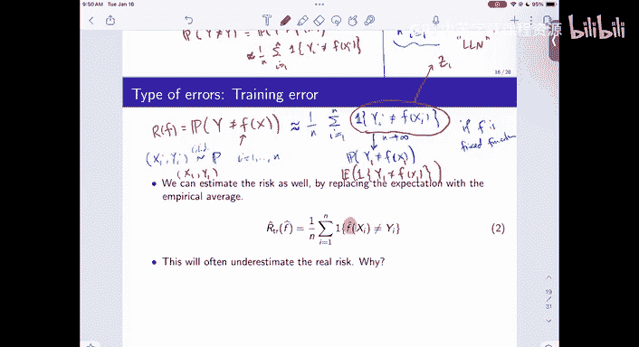


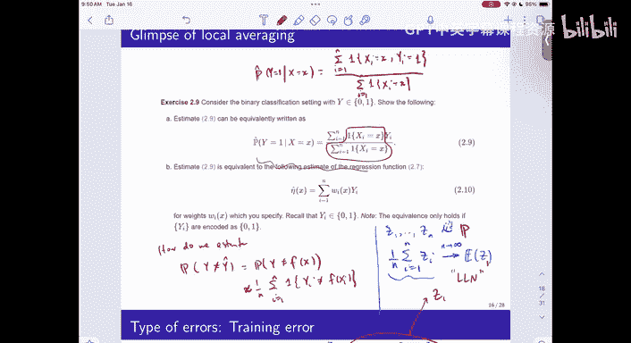


在特征为离散变量的简单情况下，权重可以定义为：如果 **x** 与 **x_i** 完全匹配，则 **w_i(x) = 1**，否则为 **0**。然后，我们对所有匹配的训练点的 **y_i** 值进行平均，得到预测值。


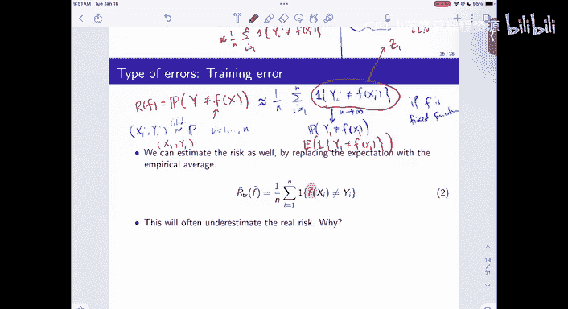

**公式表示：**
```
f_hat(x) = (1 / N_match) * Σ_{i: x_i = x} y_i
```
其中，**N_match** 是训练集中特征与 **x** 匹配的样本数量。

这种方法可以推广到更复杂的权重函数，从而衍生出一大类估计器。

---

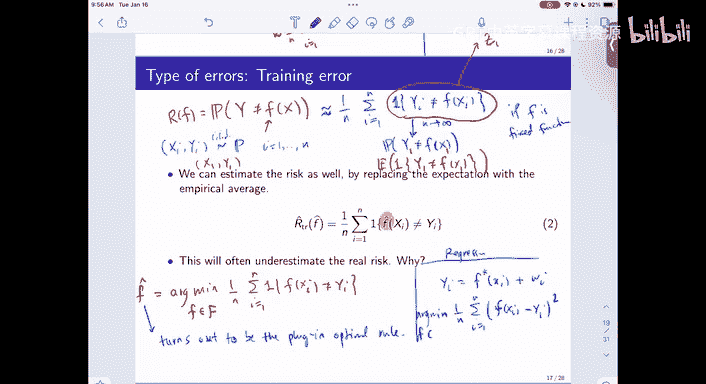

## 性能评估与风险

我们之前讨论了使用风险或错误概率来评估分类器的性能。如果我们知道真实的联合分布 **P(X, Y)**，我们可以直接计算真实风险 **R(f) = P(Y ≠ f(X))**。

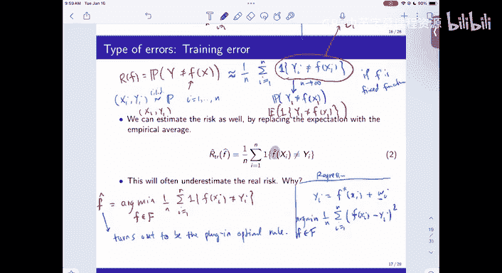

然而，在实际问题中，我们并不知道真实分布，只有一组训练数据 **D_n = {(x_1, y_1), ..., (x_n, y_n)}**。那么，如何在这种情况下评估风险呢？


一个最直接的想法是用经验风险（即训练误差）来近似真实风险。经验风险是模型在训练集上的平均错误率。

**公式表示：**
```
R_emp(f) = (1/n) * Σ_{i=1}^{n} I(y_i ≠ f(x_i))
```
其中，**I(·)** 是指示函数，当条件为真时取值为1，否则为0。


根据**大数定律**，对于一个**固定的**函数 **f**，当样本量 **n** 趋于无穷大时，经验风险 **R_emp(f)** 会收敛到其期望值，即真实风险 **R(f)**。这是因为训练样本是独立同分布的。


---


## 训练误差的问题与过拟合


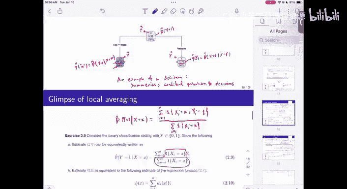


虽然对于固定函数，经验风险是真实风险的良好估计，但在实际建模中，我们并非固定一个函数，而是从一组函数（称为假设空间 **F**）中**选择**一个使得训练误差最小的函数 **f_hat**。


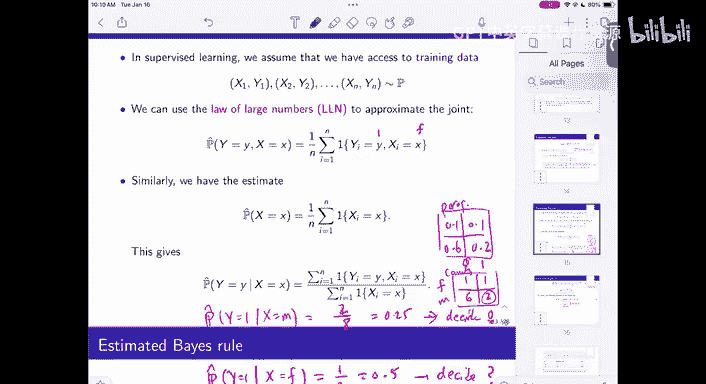


**公式表示：**
```
f_hat = argmin_{f ∈ F} R_emp(f)
```

这里就出现了问题：**f_hat** 本身依赖于训练数据 **D_n**。当我们用同样的数据来计算 **R_emp(f_hat)** 时，各项损失项 **I(y_i ≠ f_hat(x_i))** 不再是独立的（因为 **f_hat** 依赖于所有数据点）。因此，大数定律的条件不再满足。

结果是，最小化训练误差得到的 **f_hat**，其训练误差通常会**低估**真实的泛化误差。这种现象称为**过拟合**：模型过于复杂，以至于“记住”了训练数据中的噪声和特定细节，导致在新数据上表现不佳。

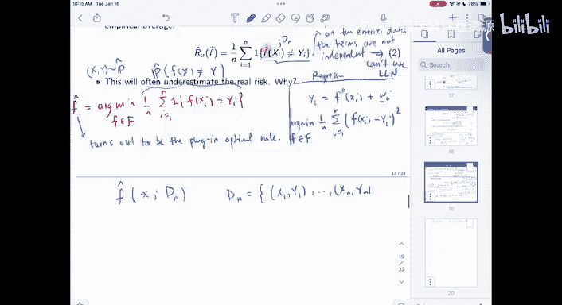

---

## 解决方案：训练-测试集划分

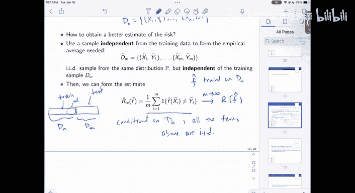

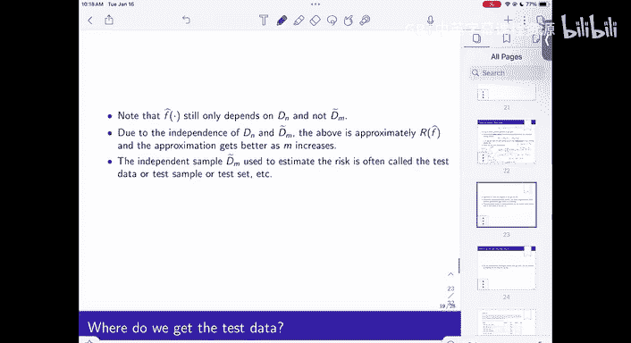


为了获得对真实风险的无偏且一致的估计，我们需要使用模型在训练过程中未曾见过的数据。标准的做法是将可用数据划分为两部分：


1.  **训练集**：用于构建模型 **f_hat**。
2.  **测试集**：用于评估 **f_hat** 的性能。


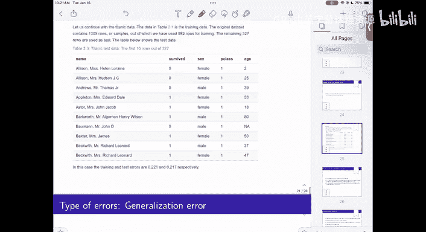

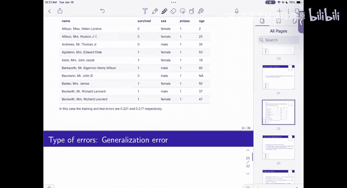

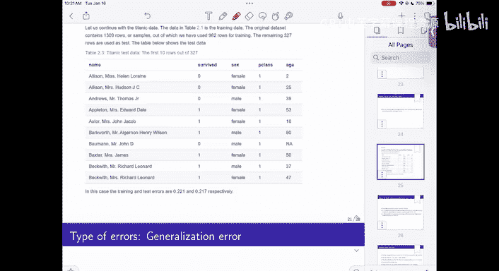

**操作步骤：**
假设我们有一个包含 **N** 个样本的数据集。
*   随机将其分为两部分，例如 70% 作为训练集（大小 **n**），30% 作为测试集（大小 **m**）。
*   仅使用训练集数据来训练模型，得到 **f_hat**。
*   在测试集上计算错误率，作为泛化误差的估计。


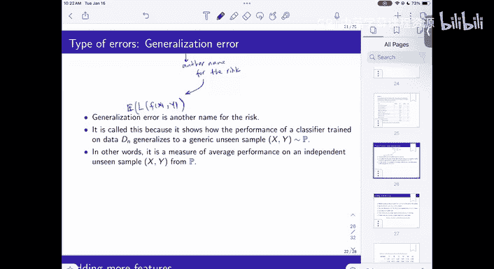


**公式表示（测试误差）：**
```
R_test(f_hat) = (1/m) * Σ_{j=1}^{m} I(y_j_tilde ≠ f_hat(x_j_tilde))
```
其中，**(x_j_tilde, y_j_tilde)** 来自测试集。

在给定训练集的条件下，测试集中的样本是独立于训练过程的。因此，测试误差的各项是独立同分布的，其期望值等于真实风险 **R(f_hat)**，并且随着测试集大小 **m** 的增加而收敛。这为我们提供了一个可靠的性能评估指标。


在实践中，有时会进一步划分出**验证集**，用于在训练过程中调整模型超参数，最终再用完全独立的测试集进行最终评估，形成“训练-验证-测试”的三步流程，以避免信息泄露。

---

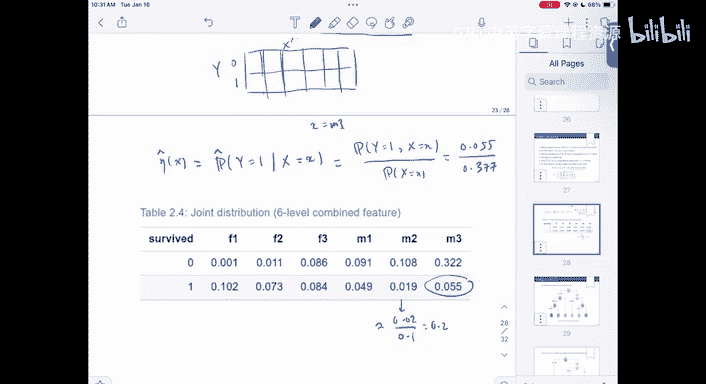


## 引入更多特征


现在，让我们回到泰坦尼克号的例子，尝试通过添加更多特征来改进分类器。假设除了性别（`Sex`）之外，我们还考虑乘客等级（`Pclass`）。

现在，特征 **X** 是一个二维向量：**X = (Sex, Pclass)**。虽然有两个维度，但由于两者都是分类变量，我们可以将它们组合成一个新的复合分类变量。例如：
*   (Female, 1)
*   (Female, 2)
*   (Female, 3)
*   (Male, 1)
*   (Male, 2)
*   (Male, 3)

这样，我们又将问题简化回了处理单个分类变量的情形。我们可以像之前一样，计算这个新特征每个取值下的经验条件概率 **P_hat(Y=1 | X)**。

以下是构建分类器的步骤：


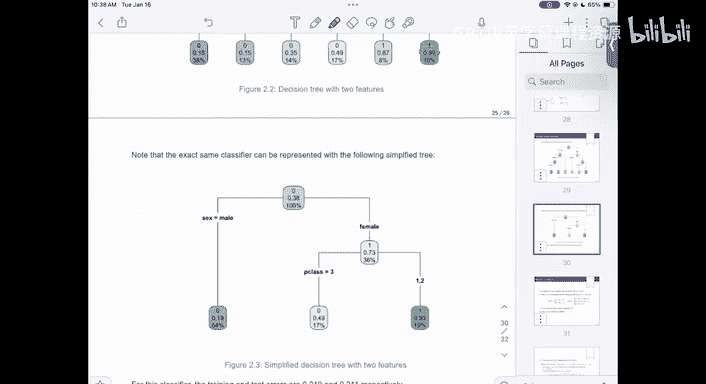

1.  **构建联合频率表**：基于训练数据，统计每个 (新特征, 生存结果) 组合出现的次数。
2.  **计算条件概率**：对于新特征的每个取值 **x**，计算生存的条件概率估计：
    ```
    P_hat(Y=1 | X=x) = Count(Y=1, X=x) / Count(X=x)
    ```
3.  **应用决策规则**：如果 **P_hat(Y=1 | X=x) > 0.5**，则预测生存（1），否则预测死亡（0）。

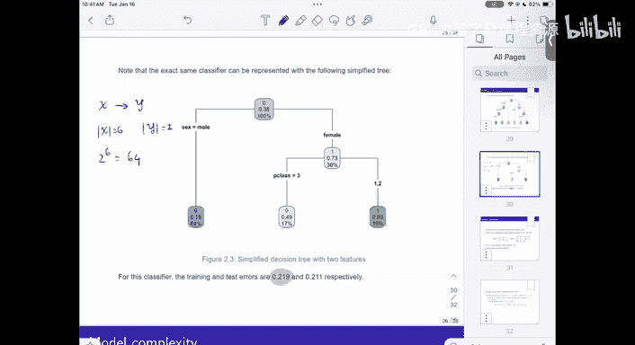


这种方法得到的决策规则，可以用一个决策树来直观表示：首先根据性别分支，然后在男性分支下，再根据乘客等级进行细分。

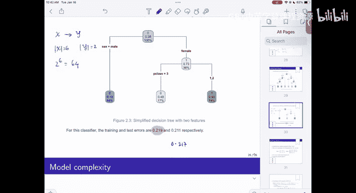


通过引入额外特征，我们的假设空间变大了（从4个函数增加到2^6=64个函数）。在这个例子中，新模型的测试误差（0.211）略低于仅使用性别特征的模型（0.217）。然而，这种微小的改进是否具有统计显著性，可以通过假设检验（例如，比较两个伯努利分布比例）来评估。初步来看，由于数据量有限，这种差异可能并不显著。

---


## 总结

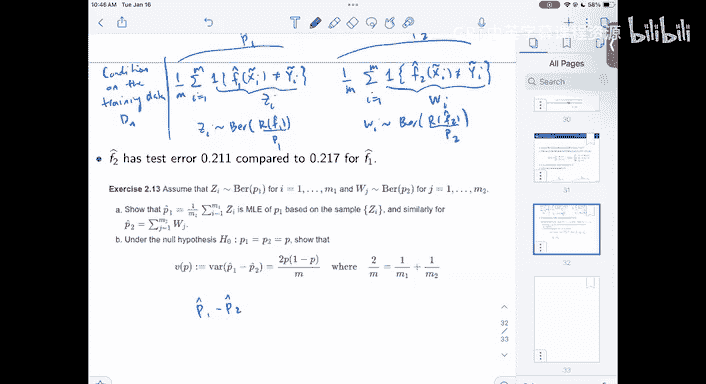


本节课中我们一起学习了：
1.  分类器是对回归函数（条件概率）的近似。
2.  使用经验风险（训练误差）评估固定函数是合理的，但对于通过最小化训练误差得到的数据依赖型函数，训练误差会低估真实风险，导致过拟合。
3.  解决过拟合评估问题的核心方法是**训练-测试集划分**，使用独立的测试集来获得对泛化误差的无偏估计。
4.  可以通过引入更多特征来构建更复杂的模型，但这会扩大假设空间，需要谨慎评估其带来的收益是否显著，并始终使用独立的测试集进行性能验证。