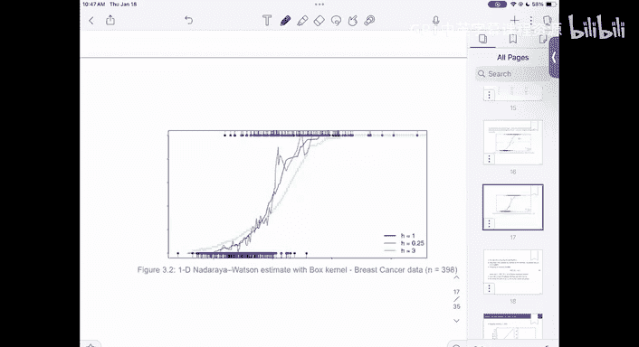

# 4：模式识别与机器学习导论

## 概述 📚
在本节课中，我们将要学习如何将分类器从离散特征空间扩展到连续特征空间。我们将探讨当特征变量是连续值时，之前基于精确匹配的“插件估计”方法为何会失效，并引入“核方法”这一核心概念来构建有效的非参数估计器。我们还将讨论模型选择中的统计显著性检验，以及估计误差中的偏差-方差权衡问题。

---

## 从离散到连续：问题的出现 🔄
上一节我们介绍了在离散特征情况下，如何通过经验联合分布来估计最优分类规则。具体方法是计算条件概率 **P(Y=1|X=x)**，并应用贝叶斯规则（即当该概率超过0.5时判为1）。

然而，当特征 **X** 是一个连续的随机变量（例如，**X ∈ ℝᴰ**）时，我们遇到了一个根本性问题。在连续空间中，从训练集中精确观察到任何一个特定 **x** 值的概率几乎为零。这意味着，如果我们沿用之前的估计公式：

**η̂(x) = (Σᵢ I(Xᵢ = x) Yᵢ) / (Σᵢ I(Xᵢ = x))**

分母 **Σᵢ I(Xᵢ = x)** 在几乎所有新数据点 **x** 上都会是0，导致估计值未定义或变得毫无意义（例如，仅在训练数据点上精确插值，而在其他点上随机猜测）。

---

## 解决方案：引入核与相似性度量 💡
为了解决上述问题，我们需要修改估计方法。核心思想是：不再要求特征 **Xᵢ** 与待预测点 **x** 完全相等，而是允许它们“近似”或“相似”。

我们可以用一个衡量相似性的函数 **K**（称为核函数）来替换原来的指示函数 **I(Xᵢ = x)**。这样，估计器变为：

**η̂(x) = (Σᵢ K((Xᵢ - x)/h) Yᵢ) / (Σᵢ K((Xᵢ - x)/h))**

其中：
*   **K(·)** 是核函数，通常满足 **K(u) ≥ 0** 且关于0对称，值越大表示越相似。
*   **h** 是一个称为“带宽”的正参数，它控制着相似性的范围。**h** 越大，考虑的点越多，估计越平滑；**h** 越小，估计越依赖局部点，可能更波动。

以下是几种常见的核函数：
*   **方框核**：**K(u) = I(||u|| ≤ 1)**
*   **高斯核**：**K(u) = exp(-||u||² / 2)**
*   **Epanechnikov核**：**K(u) = (1 - ||u||²) I(||u|| ≤ 1)**

这种估计器被称为 **Nadaraya-Watson 核回归估计器**。通过选择合适的核和带宽，我们可以在连续特征空间中得到一个光滑且合理的条件概率估计，进而用于分类。

---

## 模型比较与统计显著性检验 📊
在比较两个分类器（例如，一个简单模型和一个复杂模型）的性能时，我们不能仅仅比较它们在测试集上的错误率点估计值。由于测试错误率本身是基于有限样本的估计，存在随机波动，我们需要进行统计显著性检验。

假设我们有两个分类器，在大小为 **M** 的测试集上得到的错误率估计分别为 **p̂₁** 和 **p̂₂**。我们想知道 **p̂₁** 是否显著小于 **p̂₂**。

一种方法是构建 **p̂₁ - p̂₂** 的置信区间，或进行假设检验。在原假设 **H₀: p₁ = p₂**（即两个分类器真实错误率相同）下，可以构造检验统计量：

**Z = (p̂₁ - p̂₂) / SE(p̂₁ - p̂₂)**

其中，**SE(p̂₁ - p̂₂)** 是差值的标准误的估计值。在大样本下，**Z** 近似服从标准正态分布。如果 **|Z|** 超过临界值（例如1.96对应5%显著性水平），我们就有证据拒绝原假设，认为两个分类器性能有显著差异。

需要注意的是，如果两个错误率是使用**同一个**测试集计算的，则 **p̂₁** 和 **p̂₂** 并非独立，计算标准误时需要考虑到它们的协方差，这会使检验变得更复杂。一个更稳妥的做法是将测试集划分为不相交的两部分，分别评估两个分类器。

---

## 核密度估计简介 📈
核方法不仅可用于回归和分类，还可直接用于估计连续随机变量的概率密度函数（PDF），这称为**核密度估计**。

给定样本 **{X₁, ..., Xₙ}**，其核密度估计为：

**f̂(x) = (1/n) Σᵢ (1/h) K((Xᵢ - x)/h)**

这里的 **(1/h)** 项是为了保证估计出的 **f̂(x)** 在整个空间上的积分等于1，使其成为一个合法的概率密度函数。核密度估计是非参数统计中的核心工具，它不对数据分布做具体形式（如正态分布）的假设。

---

## 偏差-方差权衡 ⚖️
核估计器的性能严重依赖于带宽 **h** 的选择：
*   **h 过大**：估计过于平滑，可能无法捕捉数据的真实结构，导致**高偏差**。
*   **h 过小**：估计过于依赖个别数据点，对训练数据的随机波动非常敏感，导致**高方差**。

这就是机器学习中著名的**偏差-方差权衡**。我们的目标是选择一个 **h**，使得估计器的均方误差（MSE = 偏差² + 方差）最小。在实际应用中，常使用交叉验证等方法来自动选择带宽。

---

## 总结 🎯
本节课中我们一起学习了：
1.  将分类器扩展到连续特征空间的关键障碍，即精确匹配失效。
2.  引入**核函数**和**带宽**的概念，通过**Nadaraya-Watson估计器**来构建基于相似性的非参数回归与分类器。
3.  在比较模型性能时，如何进行简单的统计显著性检验，以避免被样本随机性误导。
4.  核方法在**密度估计**中的应用。
5.  核估计中**带宽选择**的重要性，以及其背后所体现的**偏差-方差权衡**原理。

这些概念为我们处理现实世界中复杂的、连续的数据奠定了坚实的基础。下一节课，我们将深入探讨如何量化这些估计器的性能，并形式化地理解偏差和方差。