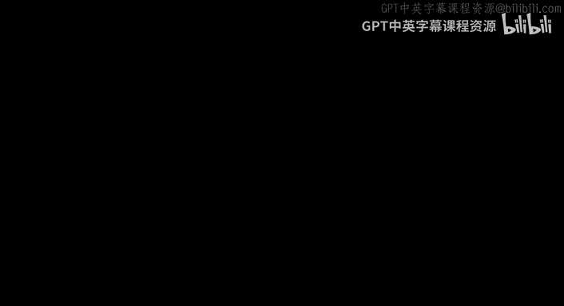
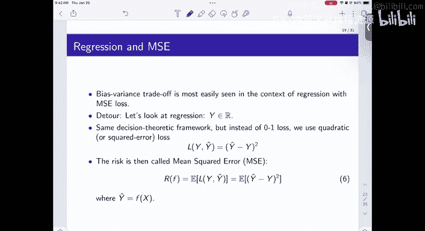
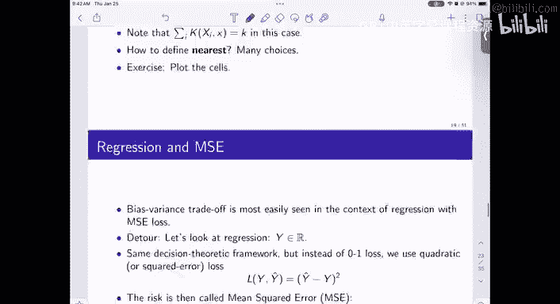
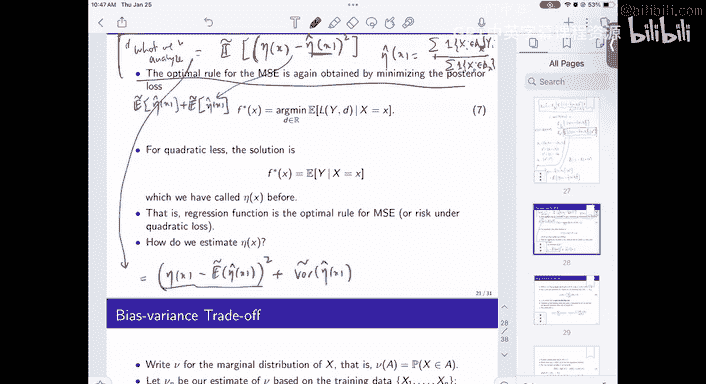

# 6：模式识别与机器学习导论 - 线性判别函数与感知器算法 🧠

在本节课中，我们将学习模式识别中的一种基本方法——线性判别函数。我们将从几何角度理解其概念，并深入探讨一个经典的学习算法：感知器算法。通过本课，你将掌握如何利用线性决策边界对数据进行分类。

---

## 概述 📋

上一节我们讨论了基于概率的分类方法。本节我们将转向一种更直接的几何方法：线性判别函数。这种方法的核心思想是寻找一个线性超平面，将不同类别的数据点分开。我们将首先理解线性判别函数的定义和几何意义，然后学习如何通过感知器算法来找到这个超平面。

---

## 线性判别函数

线性判别函数是一种用于二元分类的简单而强大的工具。对于一个输入特征向量 **x**，其判别函数形式如下：

**g(x) = wᵀx + w₀**

其中：
*   **w** 是权重向量（Weight Vector）。
*   **w₀** 是偏置项（Bias）。

决策规则非常简单：
*   如果 **g(x) > 0**，则将 **x** 判定为类别 **C₁**。
*   如果 **g(x) < 0**，则将 **x** 判定为类别 **C₂**。
*   方程 **g(x) = 0** 定义了一个决策超平面。

### 几何解释

从几何角度看，权重向量 **w** 决定了决策超平面的方向。具体来说：
*   **w** 是决策超平面的法向量。
*   偏置项 **w₀** 决定了超平面到原点的距离。
*   判别函数的值 **g(x)** 正比于点 **x** 到决策超平面的有符号距离。

---

## 感知器算法

理解了线性判别函数后，一个关键问题是如何从数据中学习到合适的参数 **w** 和 **w₀**。感知器算法是解决这个问题的经典在线学习算法。

感知器算法遵循一个简单的误差修正规则。其核心思想是：如果当前样本被错误分类，就调整决策超平面的位置来修正这个错误。

以下是感知器算法的步骤：

1.  **初始化**：将权重向量 **w** 和偏置 **w₀** 初始化为小随机数或零。
2.  **迭代**：对于训练集中的每个样本 **(xᵢ, yᵢ)**，其中 **yᵢ ∈ {+1, -1}** 是类别标签：
    *   计算当前预测：**ŷ = sign(wᵀxᵢ + w₀)**。
    *   如果预测错误（即 **ŷ ≠ yᵢ**），则更新参数：
        *   **w ← w + η * yᵢ * xᵢ**
        *   **w₀ ← w₀ + η * yᵢ**
        *   （其中 **η** 是学习率，一个小的正数）。
3.  **终止**：重复步骤2，直到所有样本都被正确分类或达到预设的最大迭代次数。

### 算法收敛性

感知器算法有一个重要的理论保证：如果训练数据是**线性可分**的，那么感知器算法保证在有限步内收敛到一个解（即能完美分开所有数据的超平面）。这个结论被称为感知器收敛定理。

---

## 总结 🎯

本节课我们一起学习了模式识别中的线性判别函数方法。
*   我们首先定义了线性判别函数 **g(x) = wᵀx + w₀**，并理解了其作为决策超平面的几何意义。
*   接着，我们介绍了用于学习判别函数参数的感知器算法。该算法通过不断修正分类错误来更新权重，并且在数据线性可分的情况下保证收敛。

线性判别函数和感知器算法是神经网络和支持向量机等更复杂模型的基础。理解它们的工作原理，为我们后续学习更高级的模式识别技术奠定了坚实的基础。