# 9：分类器性能评估与线性回归基础 📊

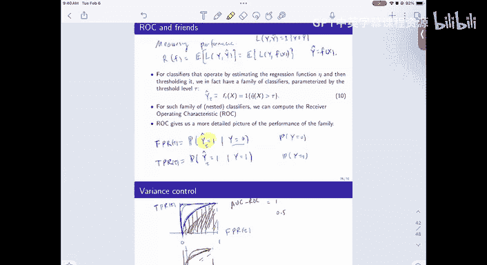

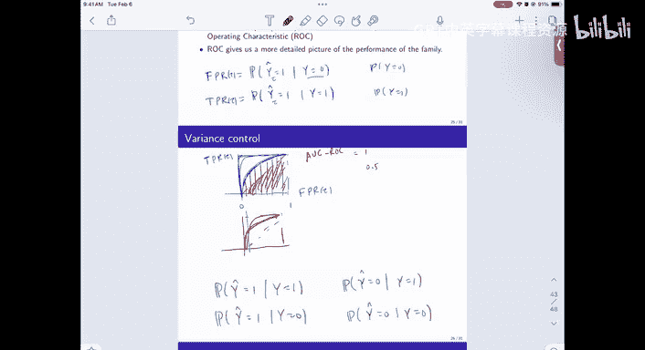

在本节课中，我们将学习两种评估分类器性能的方法：ROC曲线和精确率-召回率曲线。随后，我们将从局部平均方法过渡到参数化模型，并介绍经验风险最小化的通用框架，最后聚焦于线性回归这一具体模型。

## 第一部分：分类器性能评估指标

上一节我们讨论了分类错误率。本节中，我们来看看另一种评估分类器性能的视角，它不依赖于类别分布，能提供更稳健的评估。

### ROC曲线与相关概念

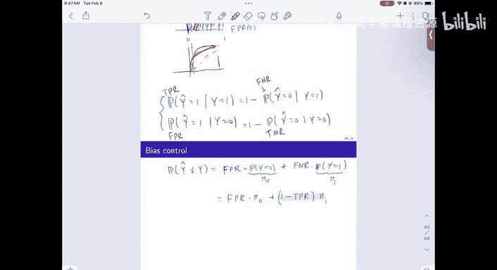

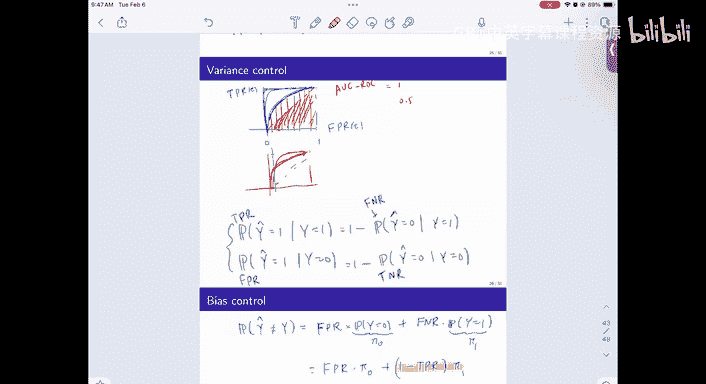

ROC曲线通过两个条件概率来评估分类器性能：真正例率和假正例率。对于一个由阈值参数化的分类器族，我们可以得到一条曲线。

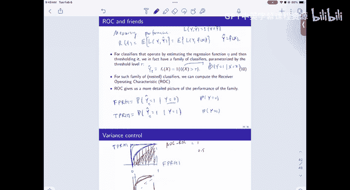

以下是定义真正例率和假正例率的公式：

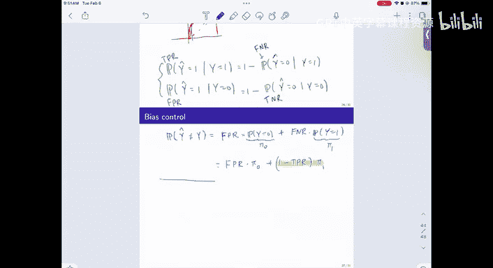

*   **真正例率**：`P(ŷ = 1 | y = 1)`
*   **假正例率**：`P(ŷ = 1 | y = 0)`

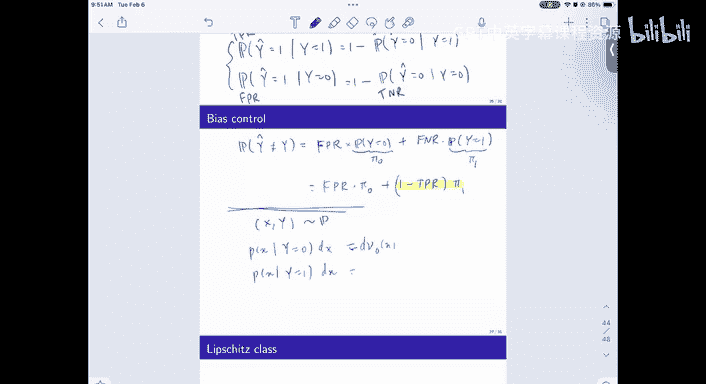

这两个概率分别衡量了分类器在正类样本上的“检出能力”和在负类样本上的“误报水平”。

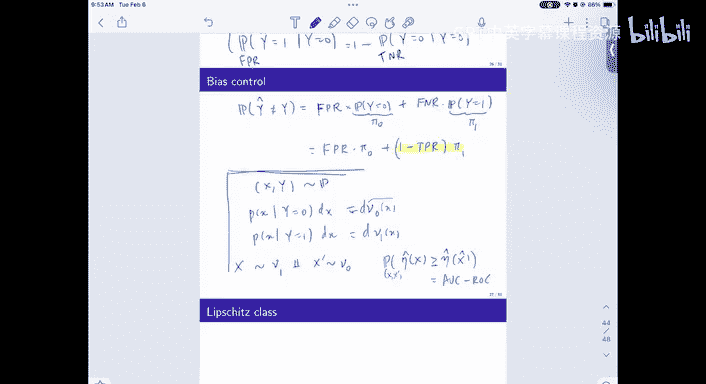

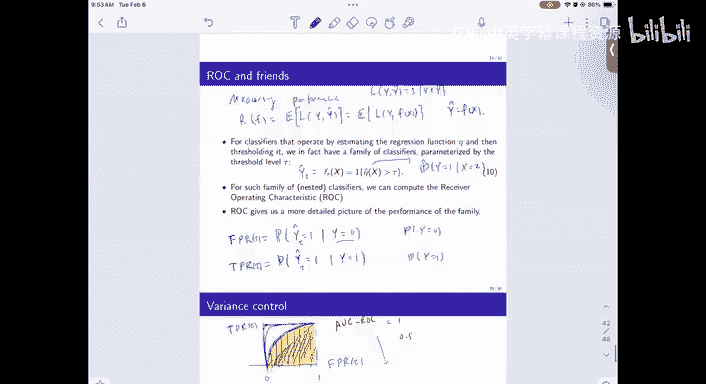

基于这两个基本概率，我们可以推导出其他相关指标：

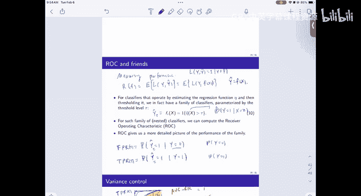

*   **真负例率**：`P(ŷ = 0 | y = 0) = 1 - 假正例率`
*   **假负例率**：`P(ŷ = 0 | y = 1) = 1 - 真正例率`

分类错误率可以用这些条件概率和类先验概率表示：
`P(ŷ ≠ y) = 假正例率 * P(y=0) + 假负例率 * P(y=1)`

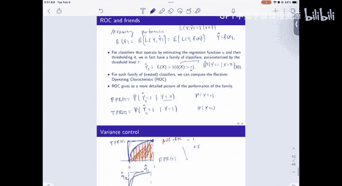

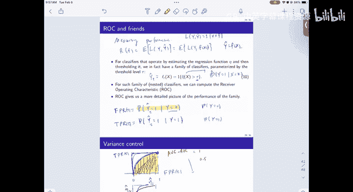

当某一类别的先验概率非常小时，分类错误率可能无法有效反映模型对稀有类别的识别能力。ROC曲线通过分离条件概率，提供了更稳健的性能视图。

对于一个通过阈值 τ 决策的分类器（例如，当估计概率 `η̂(x) > τ` 时预测为正类），随着 τ 从 1 变化到 0，假正例率和真正例率会形成一条从 (0,0) 到 (1,1) 的曲线，即ROC曲线。

**ROC曲线下的面积**是一个常用的汇总指标：
*   完美分类器的AUC为 1。
*   随机分类器的AUC为 0.5。
*   实际分类器的AUC介于 0.5 和 1 之间，越接近 1 越好。

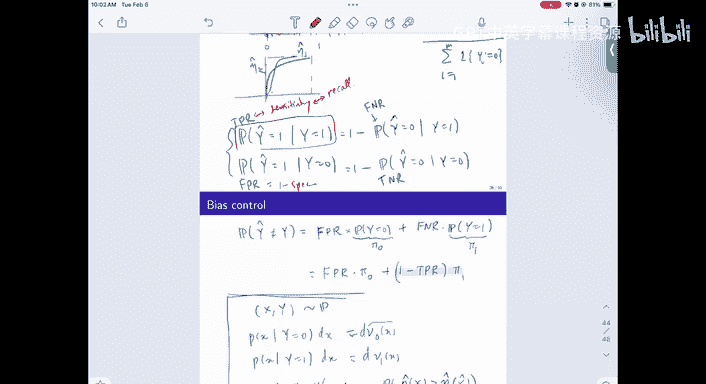

AUC有一个直观的概率解释：它等于从正类分布中随机抽取一个样本的得分，高于从负类分布中随机抽取一个样本得分的概率。即：
`AUC = P(η̂(X⁺) > η̂(X⁻))`
其中 `X⁺ ~ P₁`, `X⁻ ~ P₀`。

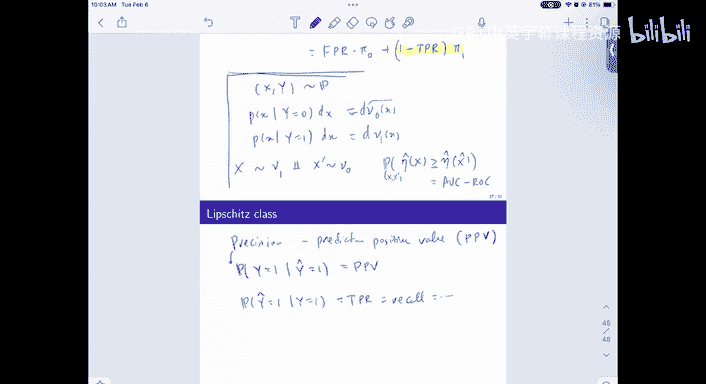

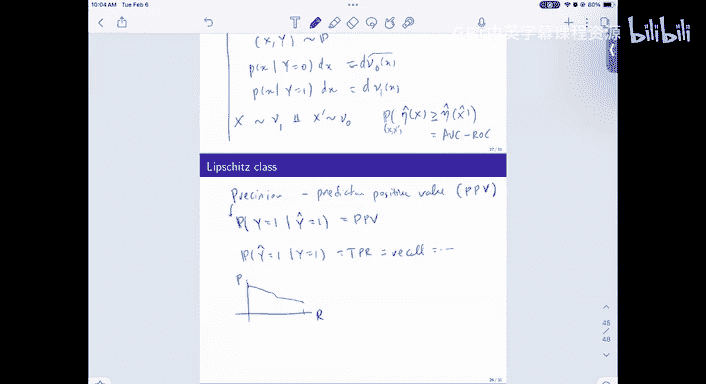

需要注意的是，不同的ROC曲线可能拥有相同的AUC值，但形状不同。此时，需要根据对假正例率的容忍度来选择更合适的分类器。

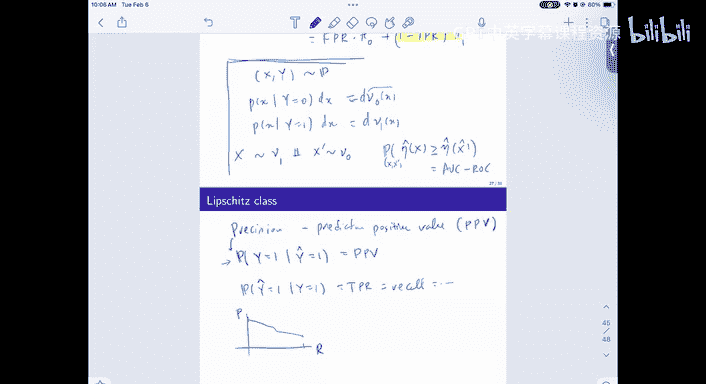

在实践中，我们使用测试集来估计这些概率。对于给定的阈值 τ，假正例率的估计为：
`假正例率 ≈ (∑ I(ŷ_i=1 且 y_i=0)) / (∑ I(y_i=0))`
通过遍历所有可能的唯一得分值作为阈值，我们可以计算出ROC曲线上的点。

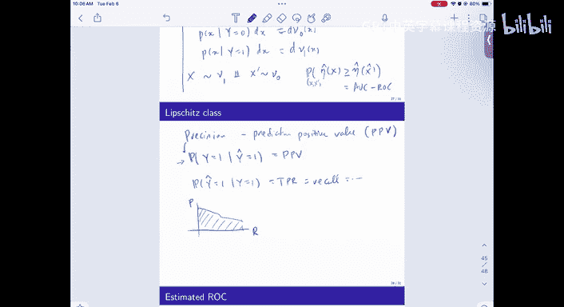

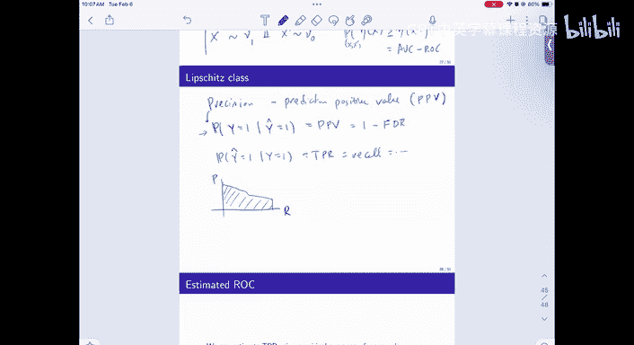

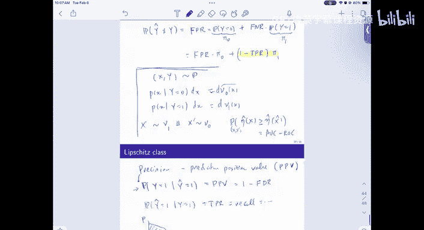

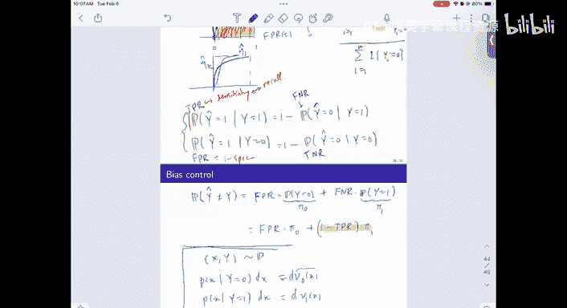

### 精确率-召回率曲线

除了ROC曲线，另一种常用的评估工具是精确率-召回率曲线。

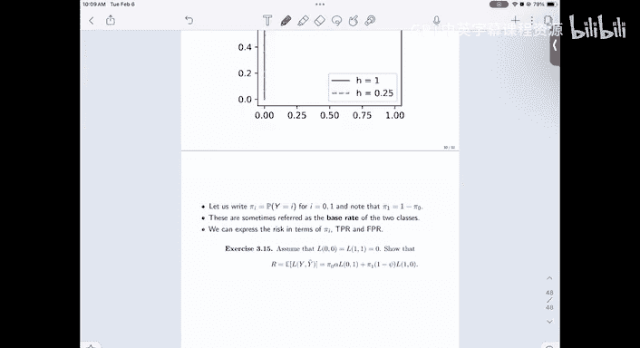

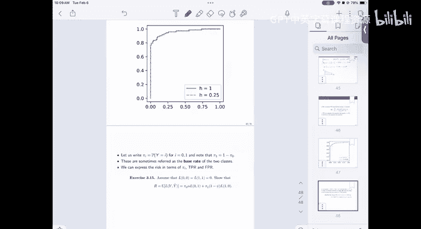

以下是相关定义：

*   **召回率**：与真正例率相同，`P(ŷ = 1 | y = 1)`。
*   **精确率**：`P(y = 1 | ŷ = 1)`，即所有被预测为正类的样本中，真实为正类的比例。

精确率-召回率曲线通过变化阈值，绘制召回率与精确率的关系图。这条曲线在类别不平衡的场景下特别有用，因为它关注的是被模型“发现”的正类样本的质量（精确率）。

精确率可以通过贝叶斯定理用真正例率、假正例率和类先验计算得出。与ROC曲线不同，PR曲线直接包含了类先验信息。

**假发现率**是精确率的互补概念：`FDR = 1 - 精确率 = P(y=0 | ŷ=1)`。

## 第二部分：从非参数方法到参数模型

上一节我们介绍了评估分类器性能的多种方法。本节中，我们来看看如何通过引入模型假设来克服高维数据下局部平均方法（如划分回归）的方差问题。

### 经验风险最小化框架

局部平均方法在维度增加时，方差会急剧增大，导致收敛速度变慢。一种缓解思路是假设真实的回归函数或决策边界来自一个较小的函数类（例如线性函数）。这就是**参数化模型**的思路。

其通用框架称为**经验风险最小化**：
1.  我们不再在所有可能的函数中最小化真实风险，而是限制在一个特定的函数类 `F` 中。
2.  用训练集上的经验平均（训练误差）来近似真实风险。
3.  在这个函数类 `F` 中，寻找最小化经验风险的函数。

对于二分类问题（0-1损失）或回归问题（平方损失），ERM的通用形式为：
`f̂ = argmin_{f∈F} (1/n) Σ L(y_i, f(x_i))`

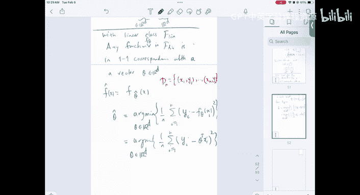

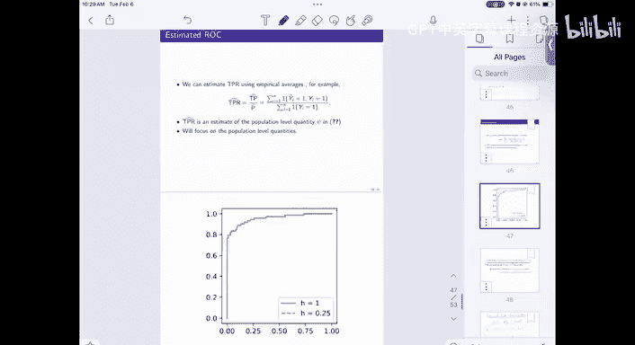

通过限制函数类 `F`，我们可以避免在0-1损失下产生的平凡插值解（即完美拟合所有训练点但泛化能力差）。

### 线性回归模型

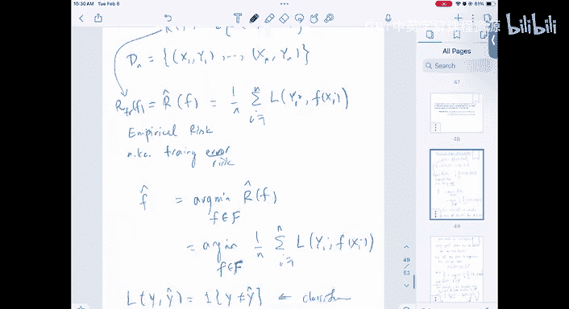

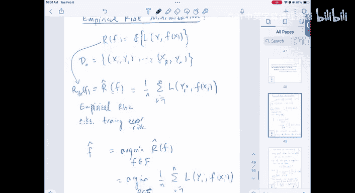

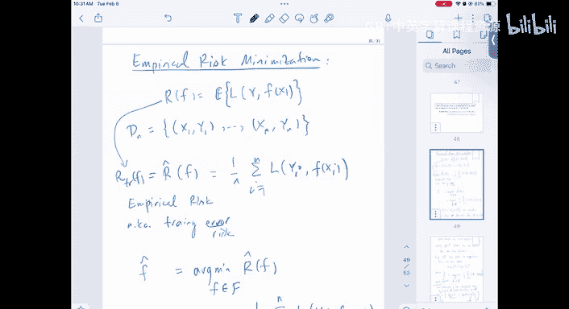

最简单的参数函数类之一是**线性函数类**。我们假设回归函数是输入特征的线性组合。

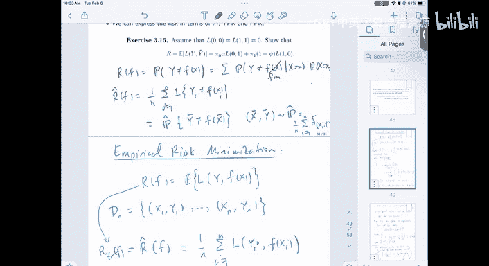

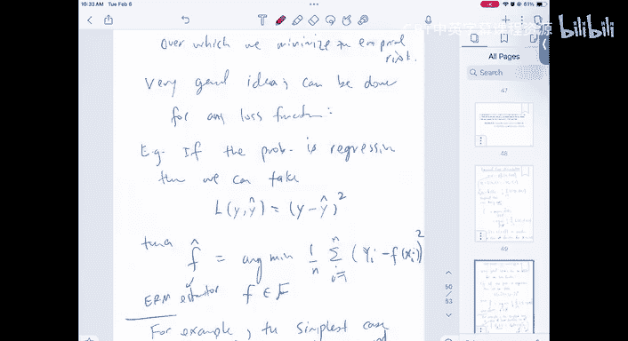

对于回归问题，使用平方损失，经验风险最小化就变成了经典的**线性回归**问题：
`θ̂ = argmin_{θ∈R^d} (1/n) Σ (y_i - θᵀx_i)²`

为了简化，我们暂时忽略了截距项。截距可以通过在特征向量 `x` 中添加一个恒为1的维度来并入参数 `θ`。

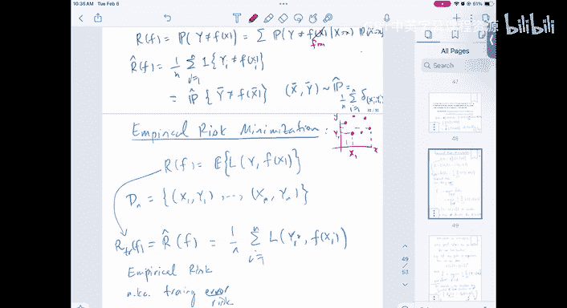

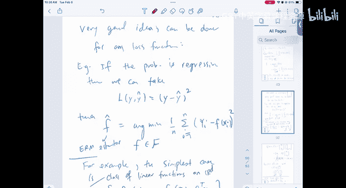

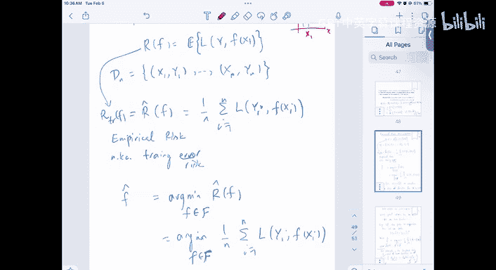

我们可以使用矩阵记号来更简洁地表示这个问题。令设计矩阵 `X` 的每一行是一个样本的特征向量，`y` 是响应向量。则损失函数可写为：
`L(θ) = (1/n) ||y - Xθ||²`

通过对 `θ` 求梯度并令其为零，我们得到**正规方程**：
`XᵀXθ = Xᵀy`

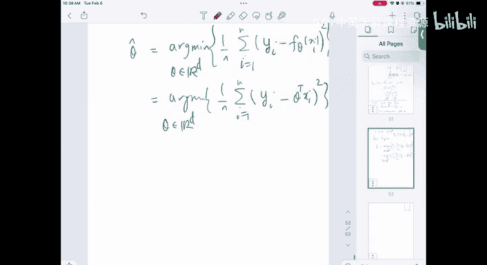

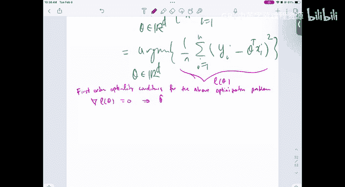

假设 `XᵀX` 是可逆的，则线性回归的解析解为：
`θ̂ = (XᵀX)⁻¹Xᵀy`

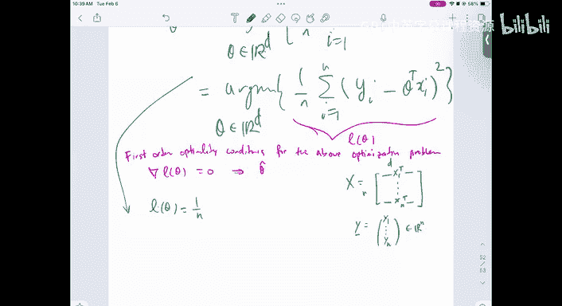

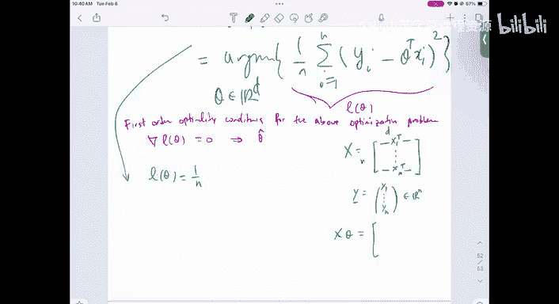

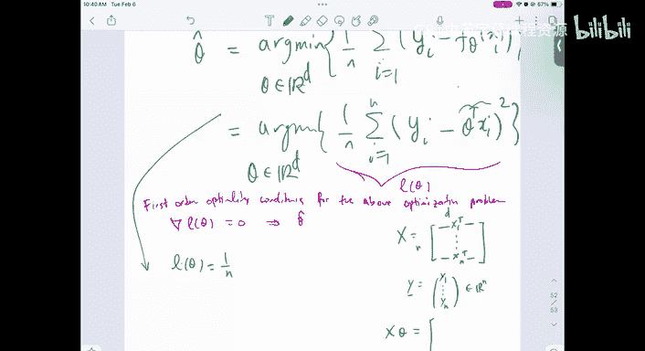

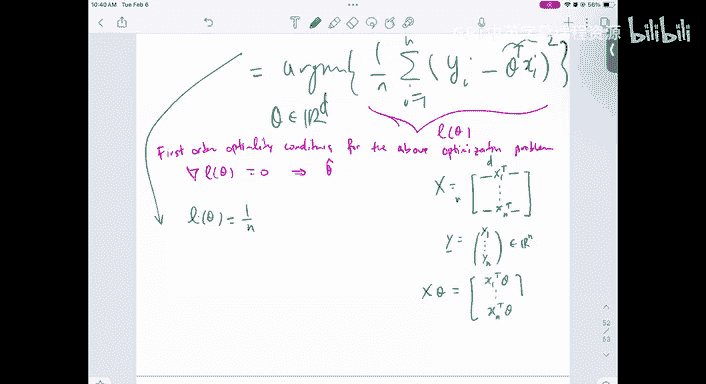

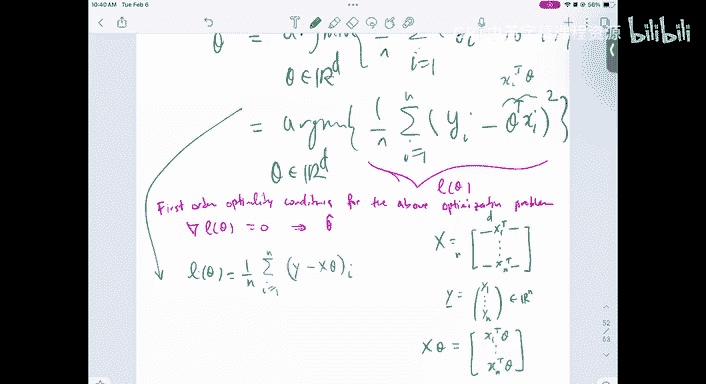

最终得到的回归函数估计为：
`η̂(x) = f̂(x) = θ̂ᵀx`

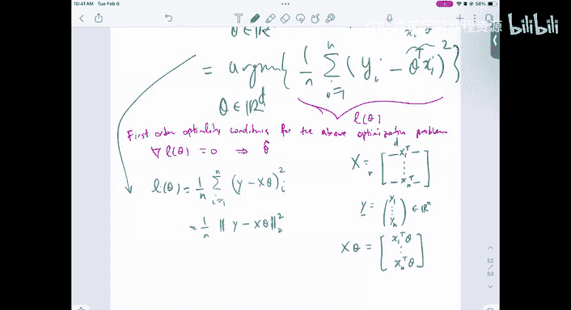

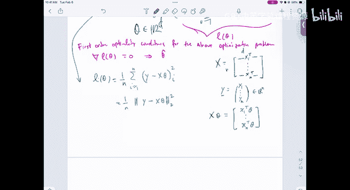

需要记住的是，线性回归估计是在假设真实回归函数为线性的前提下，对最优回归函数（条件期望）的近似。如果该假设成立，线性回归会是一个很好的估计器；如果不成立，则可能引入较大的偏差。

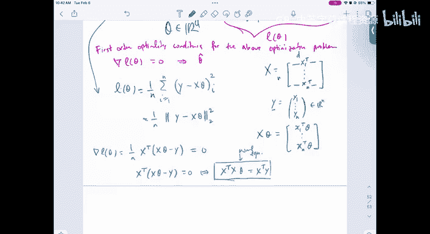

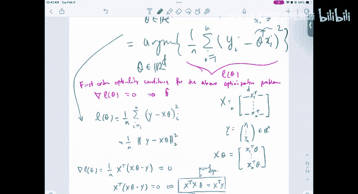

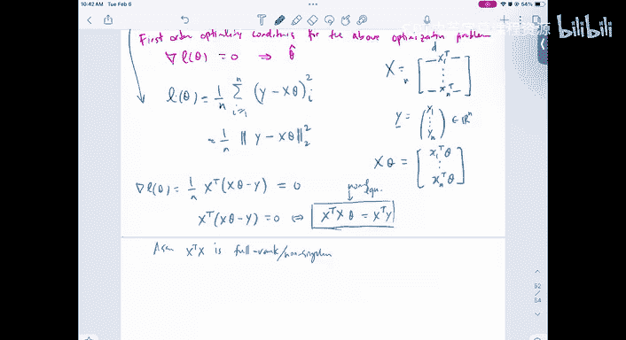

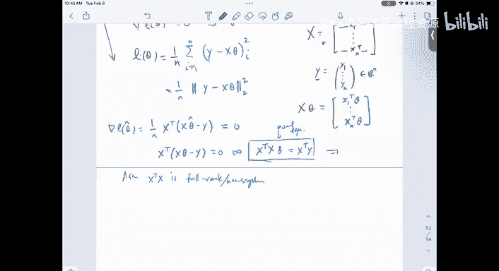

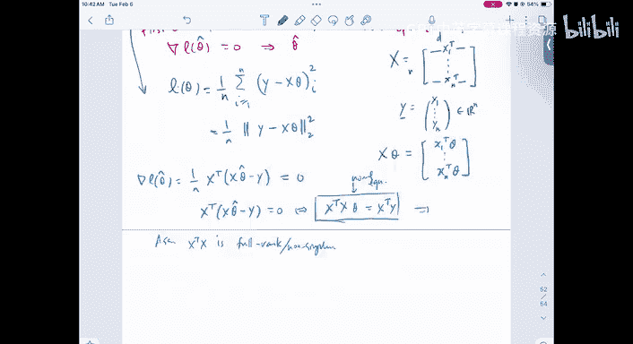

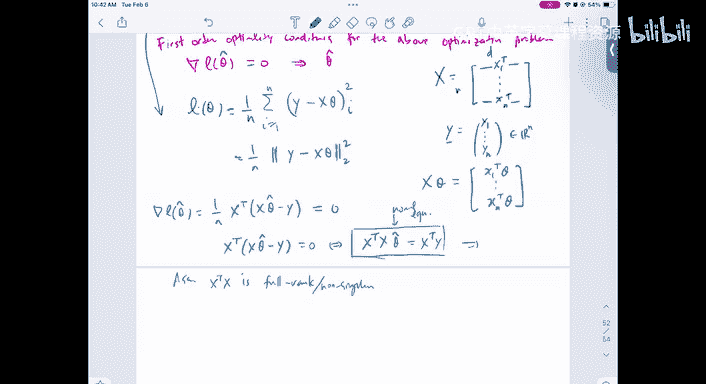

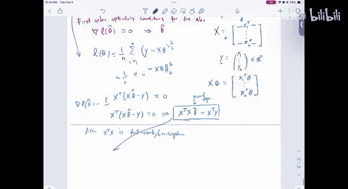

## 总结

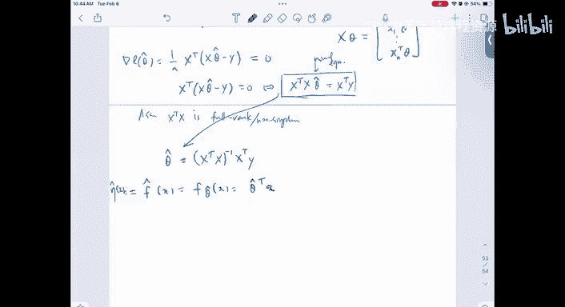

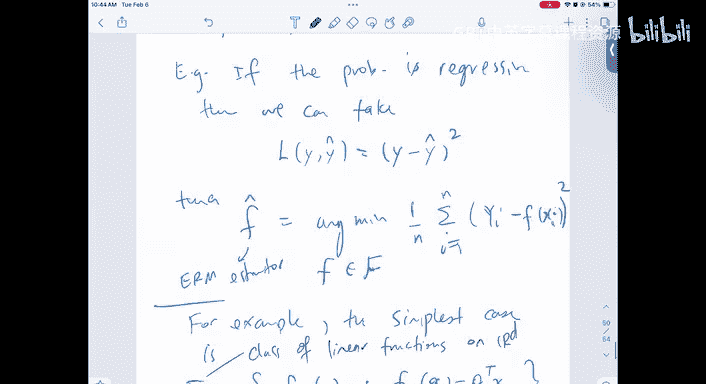

本节课中我们一起学习了：
1.  **分类器性能的深入评估**：了解了ROC曲线及其面积AUC，它们通过真正例率和假正例率评估分类器，对类别不平衡更稳健。同时介绍了精确率-召回率曲线及其在关注“发现”质量时的应用。
2.  **经验风险最小化框架**：为了克服高维非参数方法的“维数灾难”，我们引入了通过限制函数类来进行参数化建模的思想。
3.  **线性回归基础**：作为ERM框架下最简单的例子，我们推导了线性回归的优化目标、正规方程及其解析解。

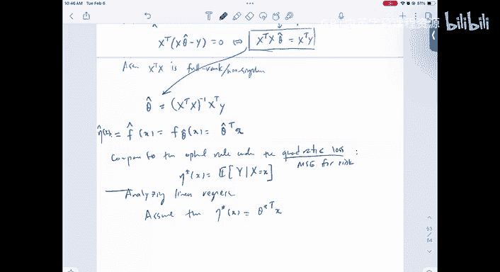

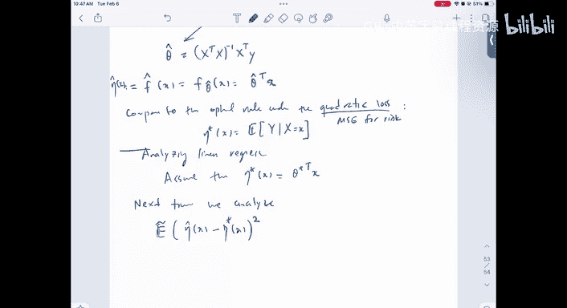

下一节课，我们将对线性回归估计器进行理论分析，考察其偏差和方差。