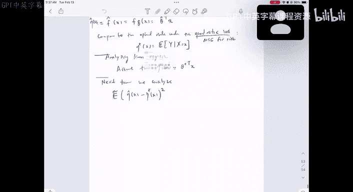
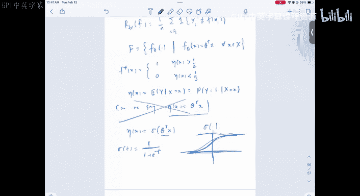

# 10：梯度下降与逻辑回归入门 🧠

在本节课中，我们将学习梯度下降这一优化方法，并探讨如何将其应用于分类问题，特别是逻辑回归模型。我们将从回顾线性回归的分析开始，逐步引入更通用的优化思想。

## 回顾线性回归的误差分析

上一节我们分析了线性回归模型，并得到了其风险的一个上界。在线性回归模型中，我们假设回归函数是线性的，并且给定X时Y的条件方差为常数σ²。

在这些假设下，我们推导出均方误差的期望近似为：
`MSE ≈ σ² / n * xᵀ Σ⁻¹ x`
其中，Σ是特征X的协方差矩阵。

对于一个简单的例子，假设Σ是单位矩阵，且每个特征分量xᵢ ∈ [-1, 1]，那么误差上界约为σ² * D / n。这里D是特征维度。

相比之下，如果我们使用之前讨论过的分区估计器，其误差上界的形式为σ² / n^(2/(2+D))。当维度D很大时，这个收敛速率（n的幂次）会变得非常慢。这说明，如果我们对模型有正确的线性假设，线性回归可以学得更快；而如果我们不做任何假设，使用非参数方法虽然更稳健，但需要付出收敛速度变慢的代价。

## 从经验风险最小化到优化问题

我们之前的工作流程是：定义风险（期望损失），然后用经验风险（训练集上的平均损失）来近似它。接着，我们将函数类F限制在某个特定集合（如线性函数）中，从而得到一个优化问题。

对于回归问题，使用平方损失，我们得到了一个关于参数θ的凸优化问题：
`min_θ (1/n) Σ (yᵢ - xᵢᵀθ)²`
幸运的是，这个问题有解析解（正规方程）。然而，对于许多更复杂的模型，我们可能无法得到闭式解。

## 梯度下降法：一种通用的优化方法 🏔️

那么，如何求解没有解析解的优化问题呢？一个通用且强大的数值方法是**梯度下降法**。

其核心思想是：从一个初始参数估计θ₀开始，迭代地朝函数下降最快的方向移动一小步。这个方向就是**负梯度方向**。

**算法步骤**如下：
1.  初始化参数 θ⁽ᵗ⁾（t=0）。
2.  计算当前点损失函数 L(θ) 的梯度：∇L(θ⁽ᵗ⁾)。
3.  沿负梯度方向更新参数：`θ⁽ᵗ⁺¹⁾ = θ⁽ᵗ⁾ - η * ∇L(θ⁽ᵗ⁾)`。
4.  重复步骤2和3，直到收敛（梯度接近零）。

**参数说明**：
*   `θ`：模型参数。
*   `η`：学习率（步长），是一个需要手动设置的正数。
*   `∇L(θ)`：损失函数在θ处的梯度。

**直观理解**：梯度指向函数值增长最快的方向。因此，向相反方向移动会使函数值减小。通过不断重复这个过程，我们最终会（在凸函数的情况下）到达一个局部最小值点，该点的梯度为零。

**在线性回归中的应用**：线性回归的损失函数梯度为 `∇L(θ) = (2/n) Xᵀ(Xθ - y)`。应用梯度下降更新规则，就变成了：
`θ⁽ᵗ⁺¹⁾ = θ⁽ᵗ⁾ - η * (2/n) Xᵀ(Xθ⁽ᵗ⁾ - y)`
即使不直接求解正规方程，我们也可以通过迭代来逼近最优解。现代计算框架（如PyTorch、TensorFlow）可以自动计算复杂函数的梯度，使得这种方法非常强大和方便。

## 从回归到分类：逻辑回归的引入 🔄

现在，我们想将类似的线性建模思想应用到分类问题中。在二分类中，理想的预测函数 f*(x) 是后验概率 P(Y=1|X=x)。我们同样希望用线性函数来近似它。

但直接使用线性函数 `f_θ(x) = θᵀx` 会遇到两个问题：
1.  **输出范围问题**：线性函数的输出是任意实数，而概率值必须在 [0, 1] 区间内。
2.  **模型合理性**：概率与特征之间的关系不一定是线性的。

**解决方案**是引入一个**连接函数**，将线性组合的结果映射到 [0, 1] 区间。最常用的函数是 **Sigmoid 函数**（或称逻辑函数）：
`σ(z) = 1 / (1 + e^{-z})`
其中 `z = θᵀx`。

于是，我们的模型变为：
`P(Y=1|X=x) ≈ f_θ(x) = σ(θᵀx) = 1 / (1 + e^{-θᵀx})`
这个模型被称为 **逻辑回归**。它本质上是用一个线性决策边界（`θᵀx = 0`）来对概率进行建模，再通过Sigmoid函数将其转化为合法的概率值。

## 总结

本节课我们一起学习了以下核心内容：
1.  **回顾与对比**：回顾了线性回归的误差上界，并与非参数方法对比，说明了参数化模型在假设正确时的高效性。
2.  **优化基础**：介绍了**梯度下降法**这一解决复杂优化问题的通用迭代算法。其核心是沿着损失函数的负梯度方向更新参数。
3.  **模型扩展**：为了解决分类问题中线性模型的局限性，我们引入了**逻辑回归**模型。它通过**Sigmoid函数**将线性组合的输出映射为概率，巧妙地将线性思想应用于分类任务。

通过梯度下降，我们可以求解逻辑回归的优化问题（尽管没有像线性回归那样的解析解），这为我们处理更广泛的机器学习模型提供了强大的工具。在接下来的课程中，我们将深入探讨逻辑回归的损失函数及其优化细节。