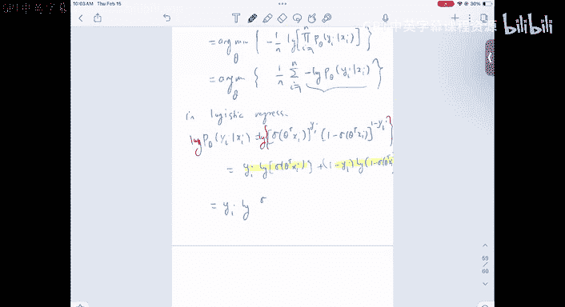
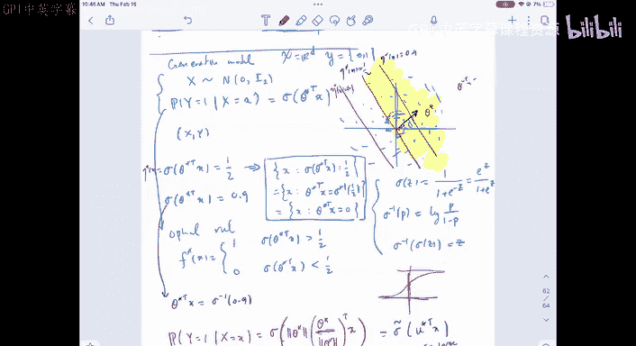

#  11：逻辑回归与最大似然估计 🧠

在本节课中，我们将学习如何将风险最小化或经验风险最小化（ERM）的思想应用于分类问题。我们将重点介绍逻辑回归模型，并展示如何通过最大似然估计（MLE）来推导其损失函数。

---

## 从分类问题到参数化模型

上一节我们讨论了分类问题中的风险最小化思想。然而，直接应用存在一些困难。首先，分类问题中常用的损失函数（如0-1损失）不平滑。其次，我们寻找的函数（分类器）是离散的。

因此，我们希望找到一个参数化模型，例如线性模型，来简化问题。我们的思路是，对回归函数 `η(x)` 进行建模。

我们最初考虑将其建模为线性函数 `θᵀx`，但线性函数的输出范围是整个实数轴 `R`，而我们需要将其映射到 `[0, 1]` 区间以表示概率。

一个简单的解决方案是应用一个将 `R` 映射到 `(0, 1)` 的函数。我们从 `x` 的某个线性函数出发，然后应用一个映射函数 `σ`。`σ` 可以是任何将 `R` 映射到 `(0,1)` 的函数，一个常见的选择是 **Sigmoid 函数**。

选择 Sigmoid 函数是因为它在数学上易于处理。

因此，如果我们将回归函数 `η(x)` 建模为 `σ(θᵀx)`，那么我们实际上是在建模条件概率：
`P(Y = 1 | X = x) = σ(θᵀx)`
这就是给定 `X` 时 `Y` 的条件概率模型。

---

## 通过条件概率指定联合分布

另一种思考方式是回到最初的问题。我们有一个来自未知分布的 `(X, Y)`，并获得从中独立同分布抽取的训练数据。我们的目标是弄清楚这个未知分布。

正如我们所看到的，我们可以通过 `X` 的边缘分布和给定 `X` 时 `Y` 的条件分布来描述这个联合分布。在分类问题中，通常足以指定 `P(Y = 1 | X = x)`。

为什么只指定这个就足够了？因为它完全指定了 `Y` 的演化。`P(Y = 0 | X = x)` 自然就是 `1 - P(Y = 1 | X = x)`。对于二分类问题，这足以指定整个条件分布。对于多分类问题，则需要指定更多参数。

我们的方法是使用参数族（例如 Sigmoid 函数）来指定这个条件概率 `P(Y = 1 | X = x)`，这等价于指定回归函数 `η`。

---

## 连接回经验风险最小化

现在，我们如何将其与经验风险最小化联系起来？我们希望将模型拟合到训练数据，并得到一个类似 ERM 的形式：
`min_θ (1/n) Σ_{i=1}^n L(y_i, η_θ(x_i))`
其中 `L` 是某个损失函数，`η_θ` 是我们的模型。

问题在于，如何得到一个好的损失函数 `L`？

---

## 最大似然估计方法

假设我们有一个训练集 `{(x₁, y₁), ..., (x_n, y_n)}`。根据我们的模型，我们知道：
`P(Y_i = 1 | X_i = x_i) = σ(θᵀx_i)`

给定这个参数模型，估计参数 `θ` 的一个通用且严谨的方法是 **最大似然估计**。

我们指定给定 `X` 时 `Y` 的条件概率质量函数。由于在给定 `X` 的条件下 `Y_i` 是独立的，联合条件概率可以分解为乘积形式。

为了紧凑地表示伯努利分布的 PMF，我们可以使用公式：
`P(Y=y) = p^y * (1-p)^{1-y}`，其中 `y ∈ {0, 1}`。

将我们的模型 `p = σ(θᵀx_i)` 代入，对于单个数据点，其概率为：
`P(Y_i=y_i | X_i=x_i) = [σ(θᵀx_i)]^{y_i} * [1 - σ(θᵀx_i)]^{1-y_i}`

因此，整个数据集的似然函数（视为参数 `θ` 的函数）为：
`L_n(θ) = Π_{i=1}^n [σ(θᵀx_i)]^{y_i} * [1 - σ(θᵀx_i)]^{1-y_i}`

最大似然估计是寻找使这个似然函数最大化的参数 `θ`。

---

## 推导损失函数

最大化似然函数等价于最大化其对数似然，也等价于最小化负对数似然。

对似然函数取对数并乘以 `-1/n`，我们得到：
`-(1/n) log L_n(θ) = -(1/n) Σ_{i=1}^n [ y_i log(σ(θᵀx_i)) + (1-y_i) log(1 - σ(θᵀx_i)) ]`

这正是经验风险最小化的形式！其中，每个数据点的损失函数是：
`L(y, p) = -[y log(p) + (1-y) log(1-p)]`
这个函数被称为 **二元交叉熵损失**。

因此，逻辑回归的 ERM 问题可以写为：
`min_θ (1/n) Σ_{i=1}^n L_BCE( y_i, σ(θᵀx_i) )`

这与线性回归的 ERM 形式非常相似。在线性回归中，我们有二次损失 `(y_i - θᵀx_i)²`。在逻辑回归中，我们只是将损失函数换成了交叉熵损失。

---

## 简化损失函数形式

利用 Sigmoid 函数的性质，我们可以进一步简化交叉熵损失。

Sigmoid 函数定义为：`σ(z) = 1 / (1 + e^{-z})`
其反函数（logit 函数）为：`σ^{-1}(p) = log( p / (1-p) )`

将 `p = σ(z)` 代入交叉熵损失并进行代数运算，可以得到一个简化形式：
`L(y, z) = log(1 + e^{z}) - y*z`
其中 `z = θᵀx`。这个损失函数直接度量了真实标签 `y` 和对数几率 `z` 之间的差异。

因此，逻辑回归也可以被视为直接对对数几率 `θᵀx` 进行建模，并最小化损失 `log(1 + e^{θᵀx_i}) - y_i*(θᵀx_i)`。

---

## 优化与模型几何

一旦我们得到了这个优化问题，就可以通过梯度下降等方法求解。可以证明，这个损失函数关于参数 `θ` 是凸的，因此通常可以收敛到全局最小值。

从几何角度看，逻辑回归模型定义了线性的决策边界。决策边界是满足 `P(Y=1|X=x) = 0.5` 的点集，即：
`σ(θᵀx) = 0.5 => θᵀx = 0`
这是一个通过原点的超平面。参数 `θ` 的方向垂直于这个决策边界。

参数 `θ` 的范数 `||θ||` 控制了决策的“锐利”程度或问题的内在噪声水平：
*   `||θ||` 大：Sigmoid 曲线很陡峭，从概率 0 到 1 转变很快，分类置信度高，噪声小。
*   `||θ||` 小：Sigmoid 曲线平缓，概率变化慢，分类不确定性高，噪声大。

因此，逻辑回归模型本身已经内置了噪声机制，由参数 `θ` 的幅度控制。

---

## 总结

本节课中，我们一起学习了：
1.  **逻辑回归模型**：通过对数几率函数将线性预测 `θᵀx` 映射到概率 `σ(θᵀx)`，用于建模 `P(Y=1|X=x)`。
2.  **最大似然估计**：为参数模型推导损失函数提供了一个通用且严谨的框架。对于逻辑回归，MLE 自然地导出了 **二元交叉熵损失**。
3.  **经验风险最小化形式**：逻辑回归的训练目标是最小化平均交叉熵损失，这与线性回归的最小化均方误差形式相似。
4.  **模型特性**：逻辑回归产生线性的决策边界 (`θᵀx = 0`)。参数 `θ` 的方向决定边界朝向，其范数控制分类的置信度或问题的噪声水平。

通过最大似然估计，我们为分类问题找到了一个平滑、可优化的损失函数，从而能够使用梯度下降等算法有效地训练模型。