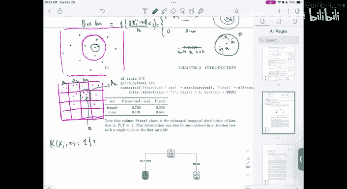
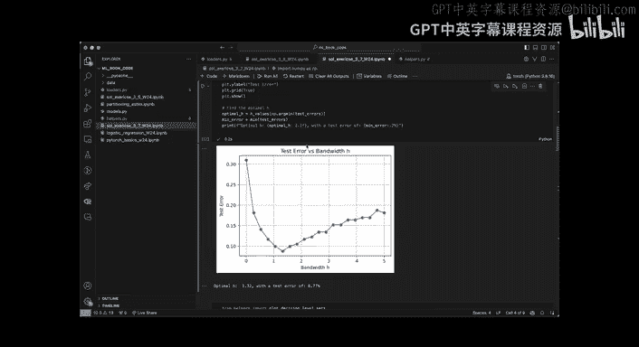
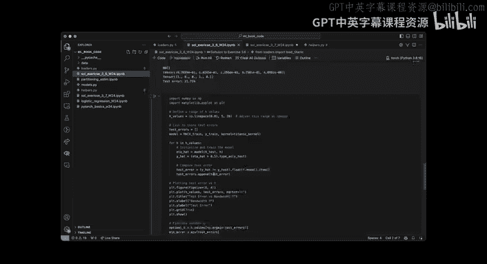
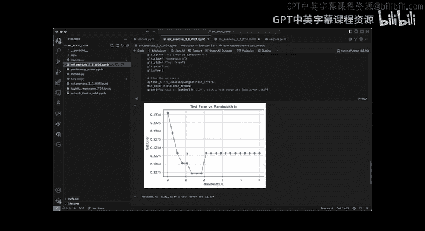

# 12：模式识别与机器学习导论


在本节课中，我们将要学习模式识别与机器学习中的核心概念，包括最优分类器、风险最小化框架、损失函数以及从理论到实践的估计方法。我们将从简单的二元分类问题入手，逐步扩展到更一般的情况。

---

### 概述：从预测问题到最优分类器 🎯

我们从一个预测问题开始，目标是预测一个输出变量 \( Y \)。我们首先关注一个非常简单的案例：当 \( Y \) 是二元变量（例如0或1）时，这就是一个分类问题。我们还研究了当特征 \( X \) 也是离散的情况。

通过分析，我们讨论了如何找到最优分类器。最优分类器是一个函数 \( f(X) \)，它将输入空间 \( X \) 映射到输出空间 \( Y \)，并预测出最可能的 \( Y \)。

为了衡量分类器的性能，我们引入了损失函数 \( L(Y, \hat{Y}) \)，它度量了预测值 \( \hat{Y} \) 与真实值 \( Y \) 之间的差异。与分类器相关联的风险 \( R(f) \) 是这个损失函数的期望值。

一个具体的损失函数是0-1损失：\( L(Y, \hat{Y}) = \mathbb{I}(Y \neq \hat{Y}) \)。在这种情况下，风险就等于误分类的概率 \( P(Y \neq f(X)) \)。

那么，什么是最优分类器呢？我们通过以 \( X \) 为条件对风险进行分解来寻找答案。最优规则被称为贝叶斯决策规则。然而，这一切都基于一个假设：我们知道 \( X \) 和 \( Y \) 的联合分布。在现实中，我们并不知道这个分布，因此需要从训练数据中对其进行估计。

---

### 风险最小化：一般框架 📊

上一节我们介绍了在已知联合分布下的最优分类器。本节中我们来看看更一般的风险最小化框架。

风险的一般形式是期望损失：\( R(f) = \mathbb{E}[L(Y, f(X))] \)。通过以 \( X \) 为条件，我们可以将风险分解为：
\[
R(f) = \mathbb{E}_X \left[ \mathbb{E}[L(Y, f(X)) | X = x] \right]
\]
其中，\( \mathbb{E}_X \) 是关于 \( X \) 边际分布的期望。我们无法控制 \( X \) 的分布，但可以针对每个具体的 \( x \) 最小化条件期望 \( \mathbb{E}[L(Y, d) | X = x] \)，其中 \( d \) 是我们的决策（在分类中是预测的类别，在回归中是预测的实数值）。

因此，最优决策规则 \( f^*(x) \) 就是在给定 \( X = x \) 时，最小化条件期望损失的那个决策 \( d \)：
\[
f^*(x) = \arg\min_{d \in \mathcal{Y}} \mathbb{E}[L(Y, d) | X = x]
\]

对于0-1损失，这个规则简化为选择后验概率最大的类别：
\[
f^*(x) = \mathbb{I}(\eta(x) \geq 1/2)，\quad 其中 \ \eta(x) = P(Y=1|X=x)
\]

对于平方损失 \( L(Y, \hat{Y}) = (Y - \hat{Y})^2 \)（即回归问题），最优规则是条件期望，也称为回归函数：
\[
f^*(x) = \mathbb{E}[Y | X = x]
\]

我们可以通过展开平方项并求导来证明这一点。设 \( g(d) = \mathbb{E}[(Y - d)^2 | X=x] \)。展开得：
\[
g(d) = \mathbb{E}[Y^2 | X=x] - 2d\mathbb{E}[Y | X=x] + d^2
\]
这是一个关于 \( d \) 的二次函数，其最小值在导数等于零处取得：
\[
\frac{\partial g(d)}{\partial d} = -2\mathbb{E}[Y | X=x] + 2d = 0 \quad \Rightarrow \quad d^* = \mathbb{E}[Y | X=x]
\]
这证明了在均方误差意义下，给定 \( X \) 时对 \( Y \) 的最佳预测就是其条件期望。

---

### 从理论到实践：参数估计与核方法 ⚙️

上一节我们讨论了已知分布时的最优理论解。本节中我们来看看当分布未知时，如何从数据中进行估计。

在离散特征的情况下，我们可以使用简单的计数来估计联合概率分布。例如，概率 \( P(Y=1|X=x) \) 的估计量为：
\[
\hat{P}(Y=1|X=x) = \frac{\sum_{i=1}^{n} \mathbb{I}(Y_i = 1 \text{ 且 } X_i = x)}{\sum_{i=1}^{n} \mathbb{I}(X_i = x)}
\]
这可以重写为加权平均的形式：\( \sum_{i=1}^{n} w_i(x) Y_i \)，其中权重 \( w_i(x) \) 与指示函数 \( \mathbb{I}(X_i = x) \) 成正比。

这个思想可以推广到连续特征或更一般的情况。我们不再要求 \( X_i \) 严格等于 \( x \)，而是引入一个核函数 \( K(x, X_i) \) 来衡量 \( x \) 和 \( X_i \) 之间的相似度。核函数在 \( X_i \) 接近 \( x \) 时值较大，远离时值较小。

于是，我们的估计量变为局部加权平均：
\[
\hat{f}(x) = \frac{\sum_{i=1}^{n} K\left(\frac{x - X_i}{h}\right) Y_i}{\sum_{i=1}^{n} K\left(\frac{x - X_i}{h}\right)}
\]
其中 \( h \) 是一个带宽参数，控制着“局部”的范围。这种方法称为核平滑或Nadaraya-Watson估计。

常见的核函数包括：
*   **高斯核**：\( K(u) = \exp(-u^2/2) \)，产生平滑的权重衰减。
*   **箱式核**：\( K(u) = \mathbb{I}(\|u\| \leq 1) \)，在指定邻域内赋予均匀权重。
*   **K近邻**：本质上也是一种核方法，权重只分配给距离 \( x \) 最近的 \( K \) 个点。



---

### 代码实践：实现核回归分类器 💻

理论需要实践来巩固。以下是如何使用PyTorch实现一个Nadaraya-Watson核分类器的简要示例。核心思想是将上述公式转化为矩阵运算，以提高效率。

```python
import torch
import torch.nn as nn

class NadarayaWatson(nn.Module):
    def __init__(self, X_train, y_train, kernel, bandwidth=1.0):
        super().__init__()
        self.X_train = X_train
        self.y_train = y_train.float() # 确保类型一致
        self.kernel = kernel
        self.bandwidth = bandwidth

    def forward(self, X):
        # 计算核矩阵：X (m个测试样本) 和 self.X_train (n个训练样本) 之间的相似度
        # 结果 K 的形状为 (m, n)
        pairwise_dist = torch.cdist(X, self.X_train) / self.bandwidth
        K = self.kernel(pairwise_dist) # 例如高斯核：torch.exp(-pairwise_dist**2 / 2)

        # 计算加权平均：分子是 K * y_train，分母是 K 每行的和
        numerator = torch.mm(K, self.y_train.view(-1, 1)) # (m, n) @ (n, 1) -> (m, 1)
        denominator = torch.sum(K, dim=1, keepdim=True)   # (m, 1)

        # 预测值是条件概率估计
        y_hat = numerator / denominator # (m, 1)
        return y_hat.squeeze() # 返回 (m,)

# 示例：高斯核函数
def gaussian_kernel(distances):
    return torch.exp(-distances**2 / 2)

# 假设我们有训练数据 X_train, y_train 和测试数据 X_test
model = NadarayaWatson(X_train, y_train, kernel=gaussian_kernel, bandwidth=0.5)
predictions = model(X_test)
# 对于分类，可以将预测概率与阈值（如0.5）比较得到类别
class_predictions = (predictions > 0.5).int()
```

在这个实现中：
1.  `__init__` 方法存储训练数据和核函数配置。
2.  `forward` 方法是核心：
    *   使用 `torch.cdist` 高效计算所有测试点与所有训练点之间的距离。
    *   通过核函数将距离转换为相似度权重。
    *   通过矩阵乘法 `torch.mm` 快速计算加权和。
    *   最后通过逐元素除法得到预测值。
3.  通过调整 `bandwidth` 参数，我们可以控制模型的平滑程度。较小的带宽使模型更关注局部数据点，可能产生更复杂（也可能更过拟合）的决策边界；较大的带宽则考虑更广的范围，使模型更平滑。

我们可以用这个模型在数据集（如乳腺癌数据集）上测试不同带宽对测试误差的影响，并绘制误差曲线来寻找最佳带宽。

---

### 总结与回顾 🏁

本节课中我们一起学习了模式识别与机器学习的核心基础。

1.  **最优决策理论**：我们从预测问题出发，定义了损失函数和风险。在已知数据联合分布的前提下，通过条件风险最小化，我们推导出了最优分类器（贝叶斯分类器）和最优回归器（条件期望）。
2.  **风险最小化框架**：我们建立了一个通用的框架 \( f^*(x) = \arg\min_d \mathbb{E}[L(Y,d)|X=x] \)。这个框架统一了分类（0-1损失）和回归（平方损失）问题。
3.  **从理论到估计**：由于真实分布未知，我们需要从数据中学习。对于离散数据，可以使用简单的频率估计。对于连续数据，我们引入了**核方法**和**局部加权平均**的思想，通过核函数度量相似性，从而对条件概率或回归函数进行非参数估计。
4.  **实践实现**：我们看到了如何将Nadaraya-Watson估计器实现为一个高效的、基于矩阵运算的PyTorch模块，并讨论了带宽参数的选择对模型性能的影响。







理解从总体最优解到基于数据的估计这一过程，是掌握机器学习的关键。核方法为我们提供了一种强大而灵活的非参数建模工具，是连接经典统计与现代机器学习的重要桥梁。