#  13：逻辑回归模型与梯度下降优化 🧠

在本节课中，我们将学习逻辑回归模型的基本原理、如何从该模型生成数据，以及如何使用梯度下降及其变体（如带动量的梯度下降）来拟合模型。我们还将通过代码示例来直观地理解这些概念。

## 模型概述与贝叶斯最优决策

上一节我们介绍了回归函数的一般形式。本节中，我们来看看一个具体的参数化模型。其核心思想是假设回归函数具有特定的参数形式。

在二分类问题中，我们可以将最优的贝叶斯规则设定为一个阈值决策。具体来说，当 `P(Y=1|X=x) > 0.5` 时，我们预测为类别1，否则预测为类别0。在逻辑回归模型中，这个概率由sigmoid函数给出：

**公式：** `P(Y=1|X=x) = σ(θ^T x) = 1 / (1 + exp(-θ^T x))`

因此，决策边界就是使得 `θ^T x = 0` 的所有点 `x` 构成的超平面。这个超平面的方向由参数向量 `θ` 决定。当我们沿着与 `θ` 平行的方向移动时，预测的概率值会增大。

## 数据生成与模型噪声

要从上述模型生成数据，不仅需要指定参数形式，还需要一个关于 `X` 的模型。通常，我们假设 `X` 服从多元高斯分布。

数据点并非都远离决策边界。许多点靠近边界，它们的标签具有不确定性。例如，一个在边界上的点 `x`，其 `θ^T x = 0`，则 `σ(0) = 0.5`。这意味着在生成标签时，有50%的概率为1，50%的概率为0。这种不确定性是模型固有的噪声，代表了真实标签与贝叶斯最优预测之间的差异，也构成了问题的基本误差极限。

信号噪声比（SNR）的大小会影响决策边界的“清晰度”。SNR较大时，sigmoid函数变化陡峭，两类数据点分离较好；SNR较小时，sigmoid函数变化平缓，数据点混合程度高，分类更困难。

## 模型拟合：极大似然估计与损失函数

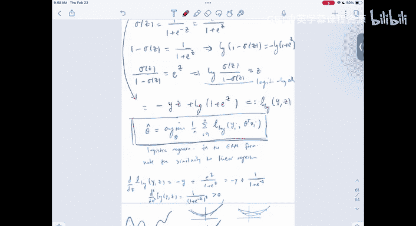

为了拟合逻辑回归模型，我们采用极大似然估计（MLE）框架。在独立同分布的假设下，数据的似然函数是每个数据点伯努利概率的乘积。

取负对数后，最大化似然等价于最小化以下经验风险（也称为对数损失或二元交叉熵损失）：

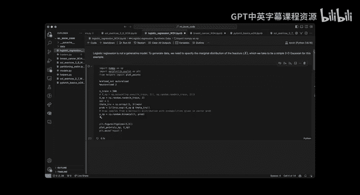

**公式：** `L(θ) = - (1/N) Σ [y_i log(σ(θ^T x_i)) + (1 - y_i) log(1 - σ(θ^T x_i))]`

我们可以将模型看作两部分：一个线性层 `z = θ^T x`，后接一个非线性的sigmoid激活函数 `σ(z)`。在优化时，通常将sigmoid函数合并到损失函数中，直接对线性输出 `z` 计算损失。

## 梯度下降优化算法

最小化上述损失函数需要使用优化算法。最基础的方法是梯度下降。

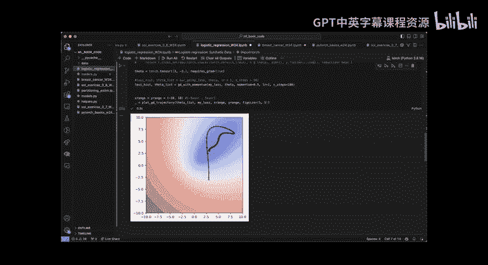

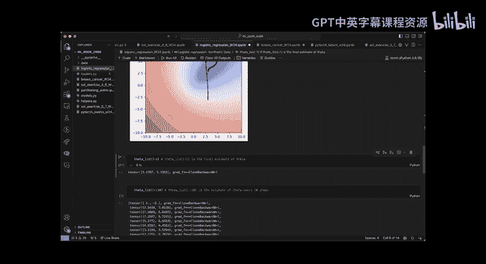

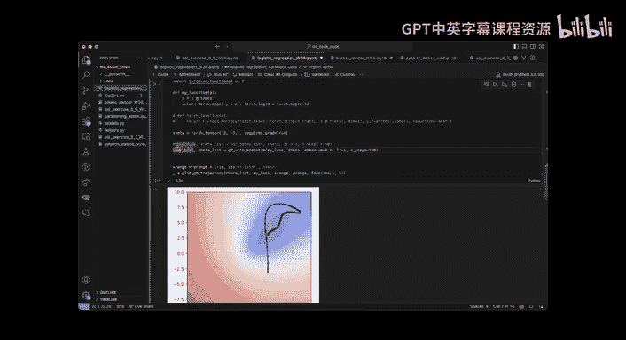

以下是梯度下降算法的基本步骤：
1.  初始化参数 `θ`。
2.  计算当前参数下的损失 `L(θ)`。
3.  计算损失关于参数的梯度 `∇L(θ)`。
4.  沿负梯度方向更新参数：`θ = θ - η * ∇L(θ)`，其中 `η` 是学习率。
5.  重复步骤2-4，直到收敛。

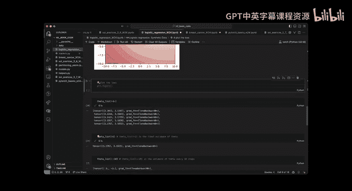

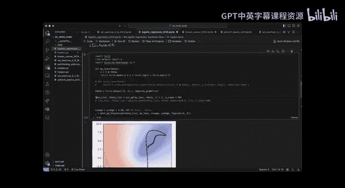

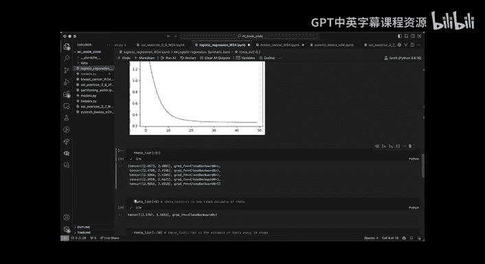

在代码实现中，我们需要：
*   注意张量的克隆以避免引用问题。
*   在每次反向传播后，将参数的梯度属性清零，防止梯度累积。

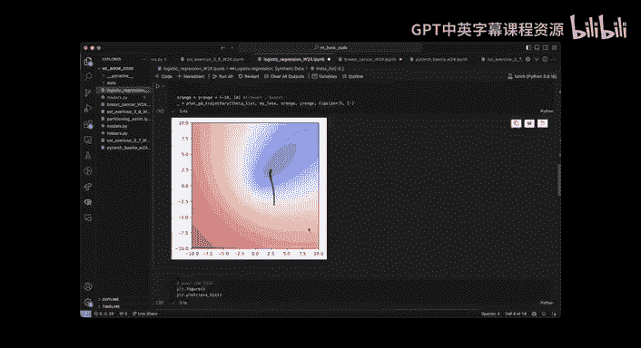

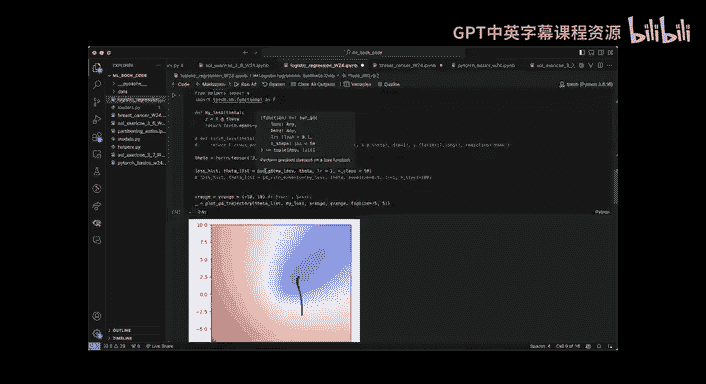

基础梯度下降在损失函数平坦区域可能收敛缓慢。为了解决这个问题，我们可以使用带动量的梯度下降。

带动量的梯度下降引入了一个速度变量 `v`，其更新规则如下：
*   `v = α * v + ∇L(θ)` （累积梯度动量）
*   `θ = θ - η * v` （沿动量方向更新参数）

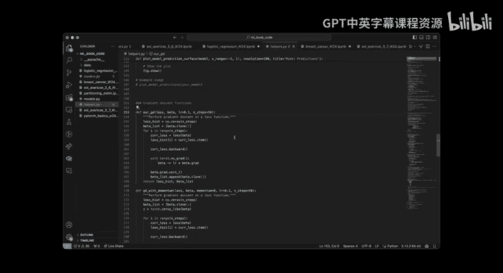

其中 `α` 是动量系数（通常接近0.9）。这种方法有助于在梯度变小时继续保持更新速度，加速收敛。

学习率 `η` 和动量系数 `α` 是需要调优的超参数。在实践中，经常使用网格搜索在验证集上寻找最佳组合。

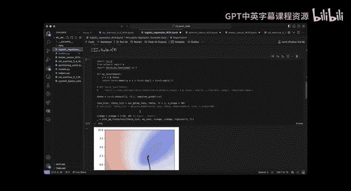

## 代码实践：从生成数据到模型训练

现在，让我们通过代码将理论付诸实践。我们将生成合成数据，并用带动量的梯度下降训练一个逻辑回归模型。

首先，我们生成数据。假设真实的 `θ* = [3, 3]`，`X` 来自标准高斯分布，SNR控制信号的强度。

**代码：数据生成**
```python
import torch
n_samples = 500
SNR = 1.0
X = torch.randn(n_samples, 2) # 设计矩阵
theta_true = torch.tensor([3.0, 3.0])
z = X @ theta_true * SNR
prob = torch.sigmoid(z) # P(Y=1|X)
Y = torch.bernoulli(prob) # 根据概率生成标签
```

接下来，我们定义对数损失函数。

**代码：损失函数**
```python
def logistic_loss(theta, X, Y):
    z = X @ theta
    # 使用数值稳定的log-sigmoid计算
    loss = torch.nn.functional.binary_cross_entropy_with_logits(z, Y, reduction='mean')
    return loss
```

然后，我们实现带动量的梯度下降。

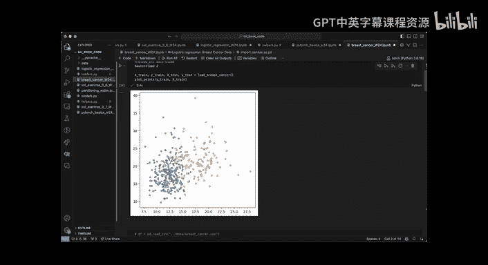

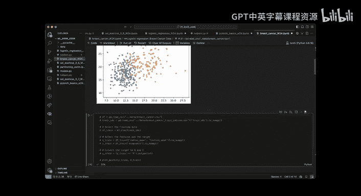

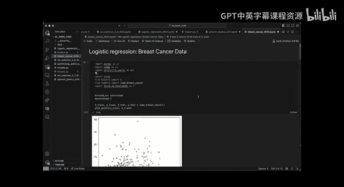

**代码：带动量的梯度下降**
```python
def gradient_descent_momentum(loss_fn, theta_init, X, Y, lr=0.1, momentum=0.9, steps=1000):
    theta = theta_init.clone().requires_grad_(True)
    v = torch.zeros_like(theta) # 速度变量
    loss_history = []
    theta_history = [theta_init.clone()]
    
    for _ in range(steps):
        loss = loss_fn(theta, X, Y)
        loss.backward()
        
        with torch.no_grad():
            v = momentum * v + theta.grad # 更新动量
            theta -= lr * v # 更新参数
            theta.grad.zero_() # 梯度清零
            
        loss_history.append(loss.item())
        theta_history.append(theta.clone())
        
    return theta, loss_history, theta_history
```

在真实数据（如乳腺癌数据集）上应用时，需要注意为线性模型添加偏置项（intercept）。这可以通过在特征矩阵 `X` 前添加一列全1来实现。

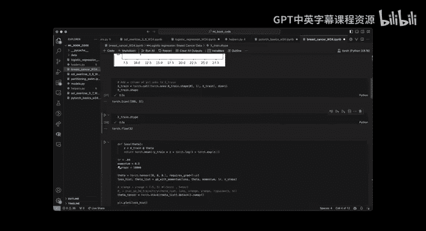

**代码：添加偏置项**
```python
# X_original 是原始特征矩阵 [n_samples, n_features]
X_augmented = torch.cat([torch.ones(X_original.size(0), 1), X_original], dim=1)
# 现在 theta 的维度是 [n_features + 1]，第一个元素是偏置
```

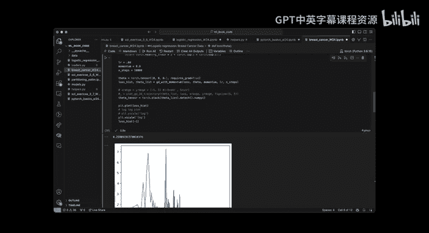

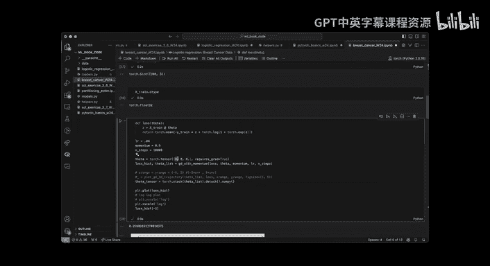

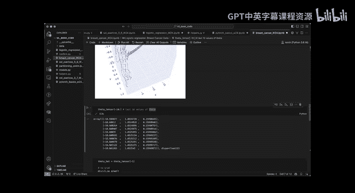

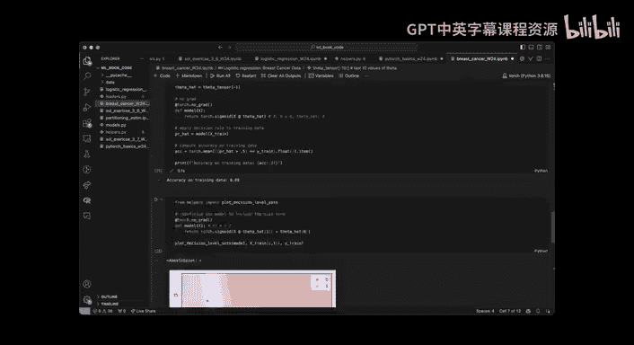

训练完成后，我们可以评估模型在训练集和测试集上的准确率，并绘制决策边界。


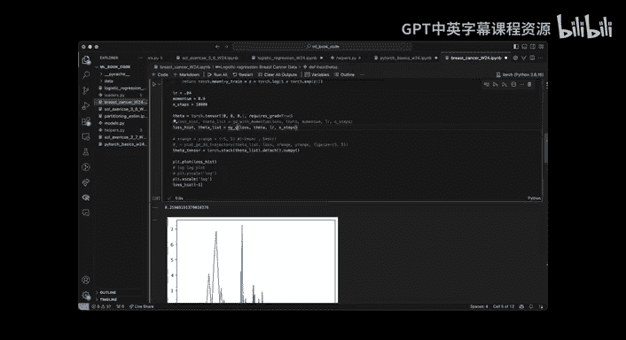

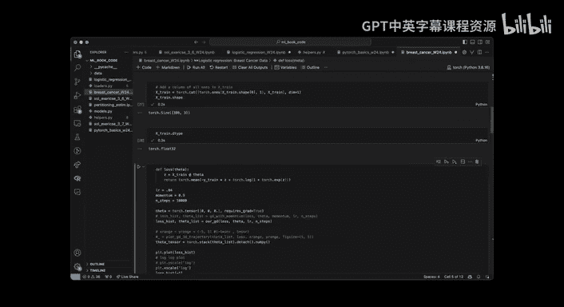

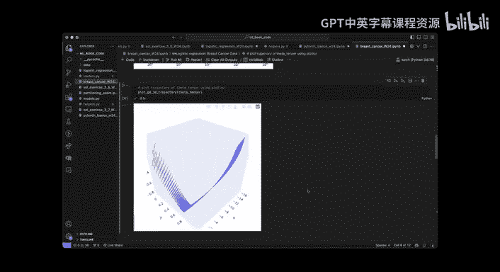

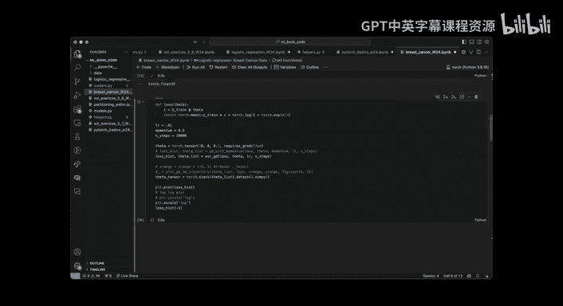

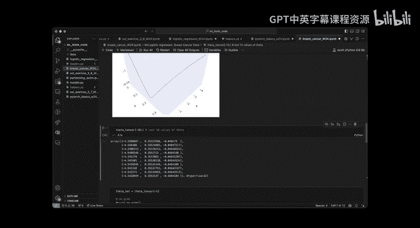

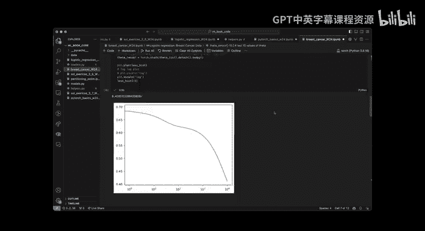

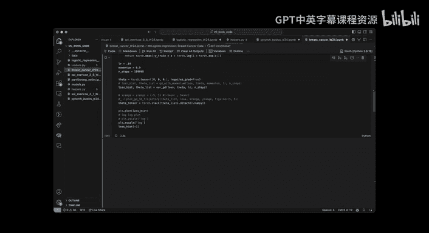

## 总结

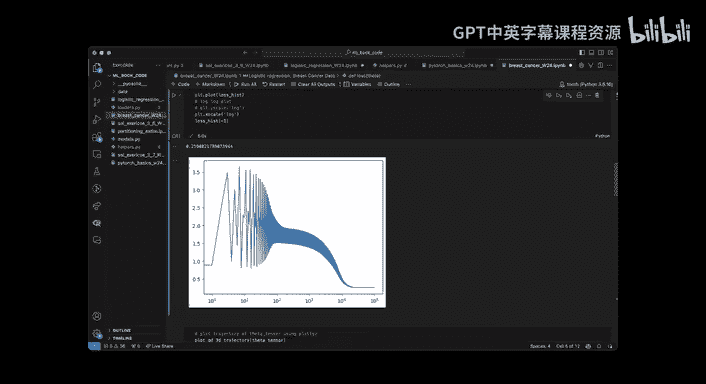

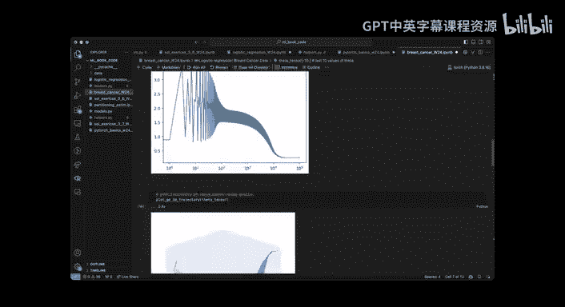

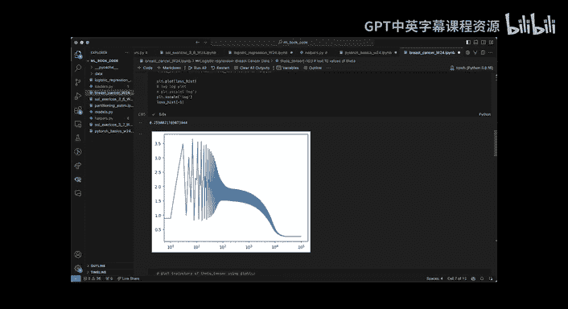

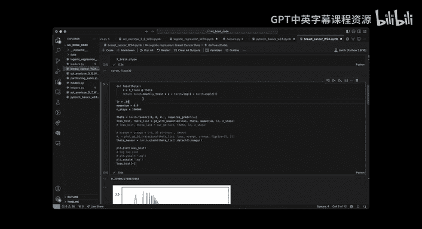

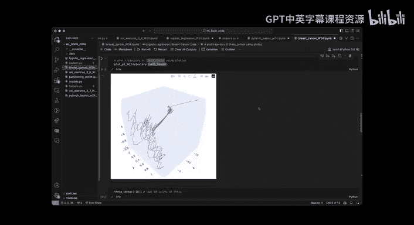

本节课中我们一起学习了逻辑回归模型的核心内容。我们从贝叶斯决策边界出发，理解了模型的参数化形式 `σ(θ^T x)` 以及其几何意义。我们探讨了模型固有的噪声和信号噪声比（SNR）对数据可分性的影响。

在模型拟合部分，我们推导了通过极大似然估计得到的目标函数——二元交叉熵损失。为了最小化这个损失，我们深入介绍了梯度下降优化算法，并针对其收敛慢的问题，引入了带动量的梯度下降变体，它通过累积历史梯度方向来加速训练。

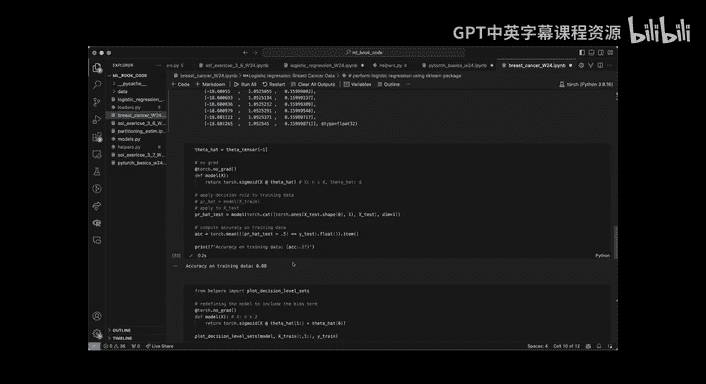

最后，我们通过完整的代码实践，演示了从合成数据生成、模型定义、带动量的梯度下降实现，到在真实数据上应用（包括添加偏置项）的全过程。这些知识为理解更复杂的分类模型和优化算法奠定了坚实的基础。