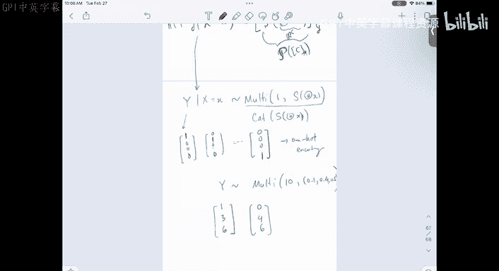
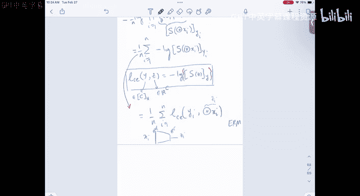
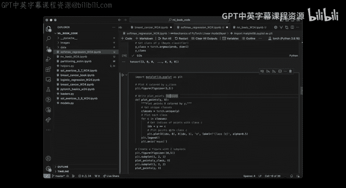
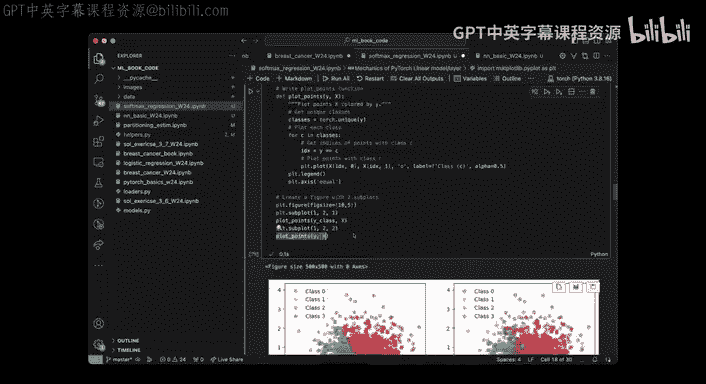
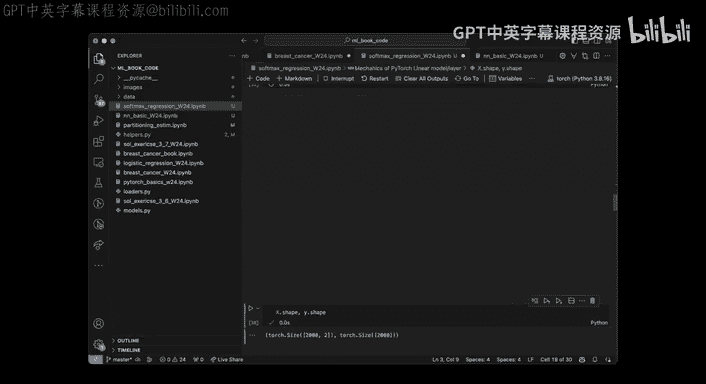
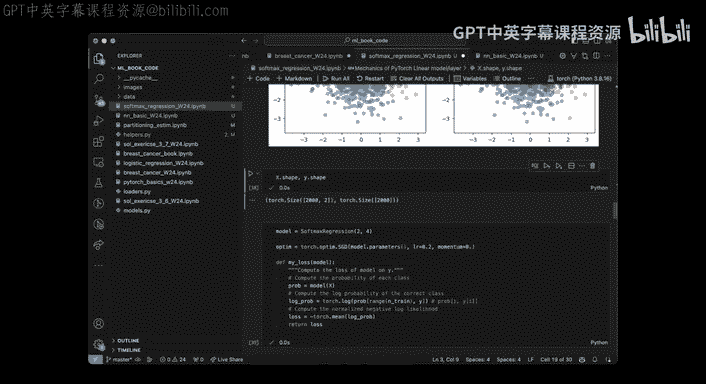
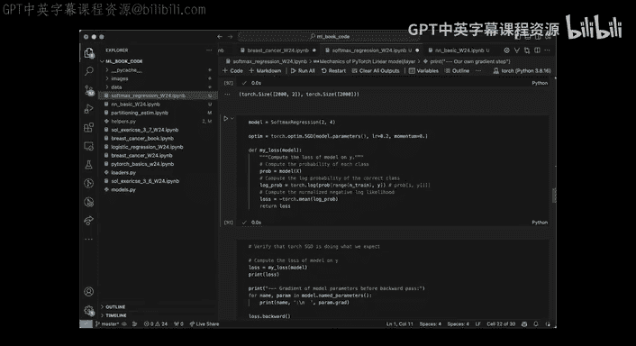

# 14：多类别分类与Softmax回归 🧠

## 概述
在本节课中，我们将学习如何将二分类的逻辑回归模型扩展到多类别分类问题。我们将介绍Softmax函数，并学习如何构建和训练一个参数化的多类别分类模型。

---

## 从二分类到多类别分类
上一节我们讨论了逻辑回归模型及其优化方法。本节中，我们来看看如何将其扩展到处理多个类别。

二分类问题的目标是学习一个从输入 **x** 到输出 **y** 的映射，其中 **y** 是二元的（例如0或1）。多类别分类则非常相似，我们仍然学习从 **x** 到 **y** 的映射，但现在的 **y** 可以取多个值，例如从0到 **C-1**，其中 **C** 是类别总数。

为了简化表示，我们使用集合 **{0, 1, ..., C-1}** 来表示 **C** 个类别。这与PyTorch等框架的零基索引惯例一致。

## 参数化模型与决策边界
在二分类中，我们使用逻辑回归模型，它指定了条件概率 **P(Y=1|X=x)**，其形式为 **σ(θᵀx)**，其中 **σ** 是sigmoid函数。这本质上定义了一个线性决策边界。

对于多类别分类，我们需要指定 **C** 个概率值：**P(Y=y|X=x)**，其中 **y ∈ {0, 1, ..., C-1}**。这些概率必须非负且和为1，因此我们有一个约束条件。

我们可以将模型写成一个通用形式：**P(Y=y|X=x) = g_θ(x)_y**。这里的 **g_θ(x)** 是一个从输入 **x** 映射到 **C** 维概率向量的函数。在二分类特例中，**g_θ(x)** 就是 **[1-σ(θᵀx), σ(θᵀx)]**。

## Softmax函数：从得分到概率
如何构造函数 **g_θ(x)**，使其输出一个有效的概率向量（各元素≥0，和为1）？一个标准且方便的选择是Softmax函数。

Softmax函数将一个 **C** 维向量 **u** 映射到另一个 **C** 维向量，其第 **y** 个分量为：
**softmax(u)_y = exp(u_y) / Σ_{j=0}^{C-1} exp(u_j)**

这个函数确保输出向量的所有元素都是正数且总和为1，正好满足概率分布的要求。当 **C=2** 时，Softmax函数退化为sigmoid函数。

以下是Softmax函数的一个关键特性：它对输入向量的常数偏移具有不变性。也就是说，对于任意常数 **c**，**softmax(u + c) = softmax(u)**。这意味着模型参数存在不可识别性问题，不同的参数可能给出完全相同的预测。如果我们只关心预测结果，这通常不是问题；但如果需要精确恢复参数值，则需要施加额外的约束（例如固定某一类别的参数为零）。

## 构建多类别分类模型
现在我们可以构建完整的模型了。模型接收一个 **D** 维输入 **x**。首先，我们使用一个线性变换将 **x** 映射到 **C** 维空间，得到得分向量 **z = Θᵀx**，其中 **Θ** 是一个 **C × D** 的矩阵参数。然后，我们对得分向量 **z** 应用Softmax函数，得到属于各个类别的概率。

因此，完整的模型定义为：
**P(Y=y|X=x) = softmax(Θᵀx)_y**

这个模型通常被称为多项逻辑回归（Multinomial Logistic Regression）或Softmax回归。其最优决策规则是选择概率最大的类别：**ŷ = argmax_y P(Y=y|X=x)**。可以证明，该模型的决策边界是由超平面交集构成的，仍然是线性的，但比二分类情况更复杂。




## 模型训练：损失函数与优化
给定训练数据 **{(x_i, y_i)}**，我们如何学习参数 **Θ**？与二分类类似，我们采用最大似然估计（MLE）。

模型的似然函数是每个样本预测概率的乘积。我们通常最小化负对数似然，这等价于最小化交叉熵损失（Cross-Entropy Loss）。

对于单个样本 **(x, y)**，交叉熵损失定义为：
**L_CE(y, z) = -log( softmax(z)_y )**
其中 **z = Θᵀx** 是模型的得分输出。

对于整个训练集，经验风险为：
**R_n(Θ) = (1/n) Σ_{i=1}^n L_CE(y_i, Θᵀx_i)**

我们的目标是找到最小化 **R_n(Θ)** 的参数 **Θ**。由于这个损失函数通常是凸的（对于线性模型），我们可以使用梯度下降法或其变体（如带动量的随机梯度下降）进行优化。优化过程与二分类逻辑回归非常相似，只是损失函数的形式不同。

## 在PyTorch中实现
以下是如何在PyTorch中实现和训练一个Softmax回归模型的关键步骤。

首先，我们需要理解PyTorch中的一些基本模块。



**1. Softmax函数**
PyTorch的 `F.softmax` 函数可以方便地计算Softmax。需要指定沿哪个维度进行归一化（通常是特征维度）。

```python
import torch.nn.functional as F
z = torch.tensor([[1.0, 0.0, -1.0]])
prob = F.softmax(z, dim=1) # 沿列（特征）维度计算
```

**2. 线性层**
PyTorch的 `nn.Linear` 层实现了 **z = Wx + b** 的线性变换。

```python
import torch.nn as nn
linear_layer = nn.Linear(in_features=2, out_features=3, bias=True)
# 这将创建一个 3x2 的权重矩阵 W 和一个 3 维的偏置向量 b
```

**3. 构建完整的Softmax回归模型**
我们可以通过继承 `nn.Module` 类来定义自己的模型。

```python
class SoftmaxRegression(nn.Module):
    def __init__(self, input_dim, output_dim):
        super(SoftmaxRegression, self).__init__()
        self.linear = nn.Linear(input_dim, output_dim)

    def forward(self, x):
        # 线性变换后接Softmax
        z = self.linear(x)
        return F.softmax(z, dim=1)
```

**4. 生成与可视化模拟数据**
为了演示，我们可以从一个已知的“真实”模型中生成数据，并观察决策边界。

```python
# 创建真实模型并生成数据
true_model = SoftmaxRegression(input_dim=2, output_dim=4)
X = torch.randn(2000, 2)
# 通过真实模型得到概率，然后根据多项式分布采样标签
with torch.no_grad():
    probs = true_model(X)
    # torch.multinomial 用于根据概率进行采样
    Y = torch.multinomial(probs, num_samples=1).squeeze()
```
通过缩放线性层的权重，可以控制生成数据中的“噪声”水平，从而观察决策边界的清晰度变化。

**5. 训练新模型**
定义好模型、损失函数（`nn.CrossEntropyLoss` 已经包含了Softmax）和优化器后，就可以进行训练了。

```python
model = SoftmaxRegression(input_dim=2, output_dim=4)
criterion = nn.CrossEntropyLoss()
optimizer = torch.optim.SGD(model.parameters(), lr=0.1, momentum=0.9)

for epoch in range(num_epochs):
    optimizer.zero_grad()
    outputs = model(X_train)
    loss = criterion(outputs, Y_train)
    loss.backward()
    optimizer.step()
```



---









## 总结
本节课中我们一起学习了多类别分类的基本框架。我们从二分类的逻辑回归出发，引入了Softmax函数作为将任意得分向量转换为概率分布的核心工具，并由此构建了Softmax回归模型。我们讨论了该模型的决策边界、参数不可识别性以及用于训练的最大似然估计/交叉熵损失方法。最后，我们简要介绍了在PyTorch中实现该模型的关键组件。这为后续学习更复杂的非线性模型（如神经网络）奠定了基础。