# 16：神经网络入门 🧠

在本节课中，我们将学习神经网络的基本概念。我们将从线性分类模型的局限性开始，探讨如何通过引入非线性组件来构建更强大的模型，即神经网络。我们将了解其基本结构、工作原理，并通过简单的代码示例来直观理解。

---

## 概述

上一节我们介绍了逻辑回归等线性分类模型。这些模型本质上是带有特定损失函数的线性函数，其分类边界是线性的（例如直线或超平面）。然而，当数据分布更复杂时，例如类别边界是曲线或环形时，单纯的线性模型将无法很好地工作。

本节中，我们将看看如何通过构建神经网络来扩展线性模型，使其能够学习复杂的非线性决策边界。

---

## 从线性模型到非线性模型

线性模型的形式通常为 **`f(x) = θ^T x`**，其中 `x` 是特征向量。这种模型的表达能力有限。

为了处理非线性模式，一个直接的扩展思路是使用特征映射。另一个非常流行且强大的方法是引入神经网络。

神经网络的核心思想是：**引入简单的非线性组件，并将它们组合起来**。

---

## 神经网络的基本构建块

那么，具体如何操作呢？让我们从一个简单的线性函数开始：

**`f(x) = w^T x + b`**

在神经网络中，我们在线性变换后引入一个非线性函数，称为**激活函数**。

假设 `σ` 是一个从实数映射到实数的非线性函数，例如：
*   **Sigmoid 函数**：将输入映射到 (0, 1) 区间。
*   **ReLU（修正线性单元）函数**：`σ(z) = max(0, z)`。它几乎像线性函数，但对负输入输出为零。

现在，我们构建一个简单的单层网络：
**`z = σ(θ^T x)`**

这里，`σ` 被逐元素地应用于线性组合的结果。这样，我们就得到了一个非线性变换。

---

## 组合层：深度神经网络

单个非线性层的能力仍然有限。神经网络的强大之处在于**层的组合**。

我们可以将第一层的输出 `z` 作为第二层的输入：

**`第一层：z = σ(θ₁^T x)`**
**`第二层：输出 = σ(θ₂^T z)`**

最终，我们得到一个由参数 `θ₁` 和 `θ₂` 定义的复合函数：
**`G(x) = σ( θ₂^T ( σ( θ₁^T x ) ) )`**

通过堆叠更多这样的层，我们就得到了一个**深度前馈神经网络**。信息从输入层流向输出层，没有反馈循环。

---

## 网络架构与神经元

以下是描述上述两层网络的常见图示方式：


```
输入 (x) → [线性层 θ₁] → [激活函数 σ] → 隐藏层 (z) → [线性层 θ₂] → [激活函数 σ] → 输出
```

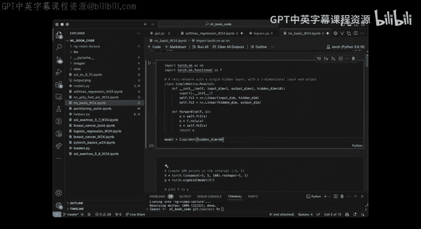

*   **输入层**：接收原始特征 `x`。
*   **隐藏层**：`z` 中的每个单元称为一个“神经元”。每个神经元计算所有输入的线性组合，然后通过激活函数。
*   **输出层**：产生最终的预测值。

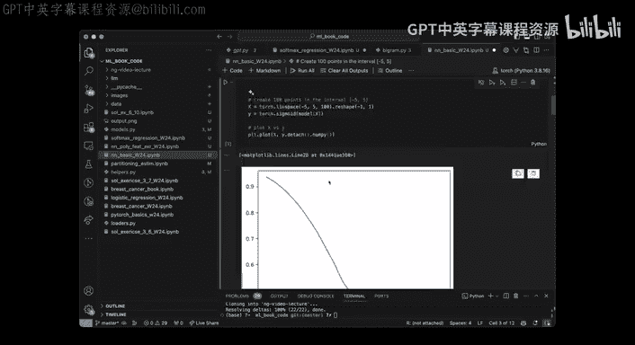

这种结构受到大脑中神经元连接方式的启发：每个神经元接收来自其他神经元的信号（加权和），如果信号超过某个阈值（由激活函数和偏置项控制），则被激活并传递信号。

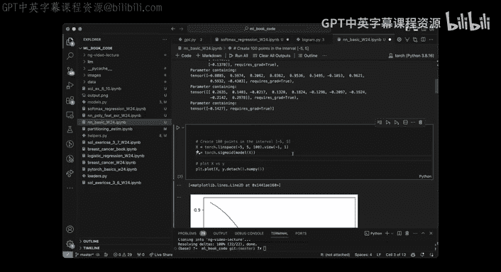

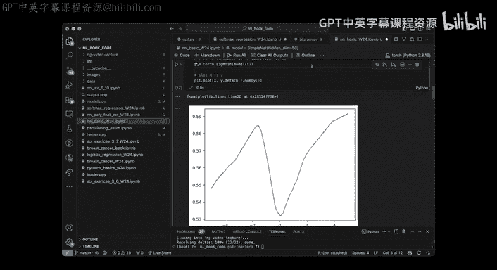

---

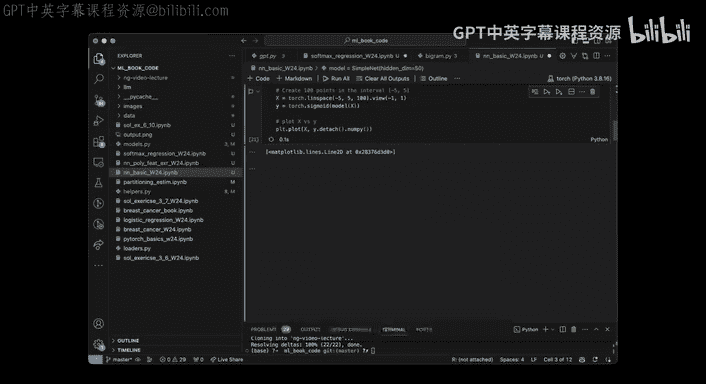

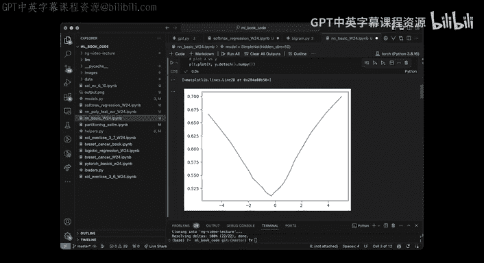

## 为什么使用多层组合？

一个自然的问题是：为什么不直接使用一个复杂的非线性函数，而要组合多个简单函数？

1.  **表达性与可控性**：直接设计一个通用的高维非线性函数非常困难。通过组合简单的线性层和固定的非线性激活函数，我们定义了一个受控但依然非常富有表达力的函数族。
2.  **参数效率与理论保证**：即使只有两层，只要隐藏层足够宽，神经网络理论上可以以任意精度逼近任何“合理的”函数（通用近似定理）。同时，其参数数量仍可管理。
3.  **优化便利性**：这种组合结构使得利用链式法则计算梯度（反向传播）变得非常高效，便于使用梯度下降法进行优化。

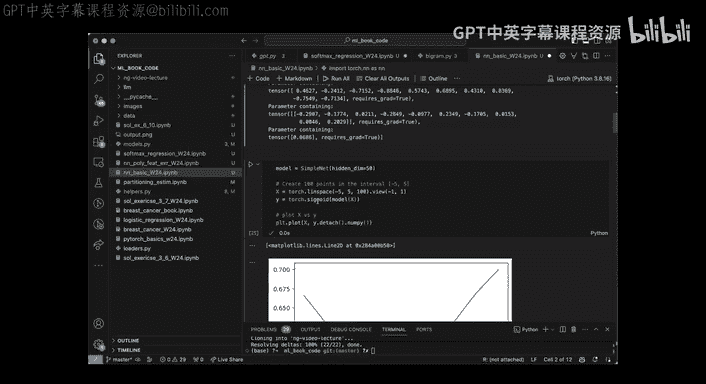

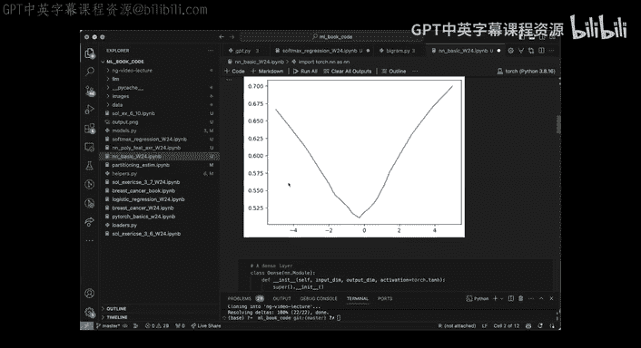

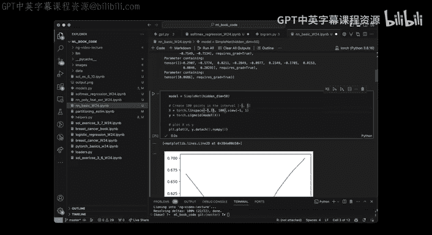

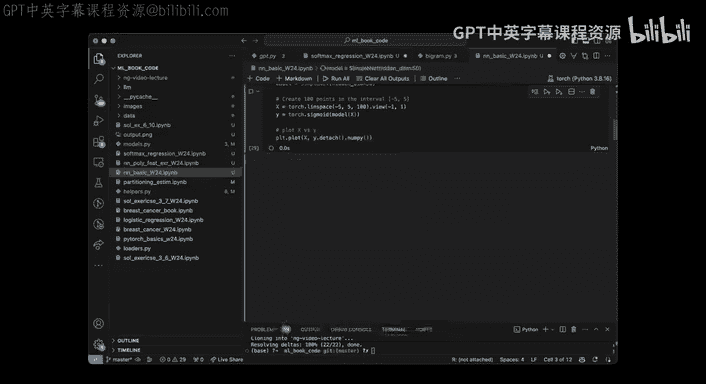

---

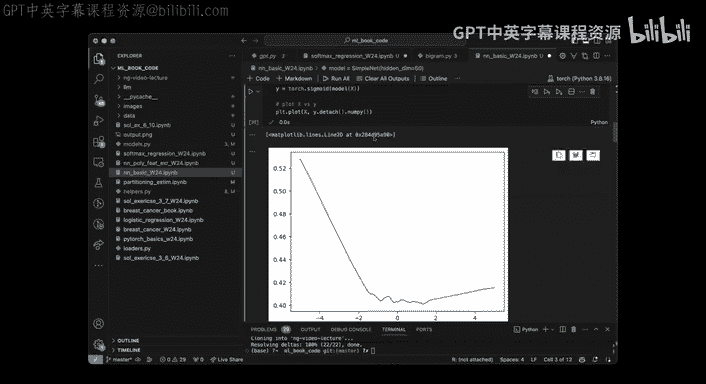

## 实践中的神经网络

在实际应用中，特别是在分类任务中，我们通常会在神经网络的末端加上一个 **Softmax 层**，将最终的输出转换为类别概率。

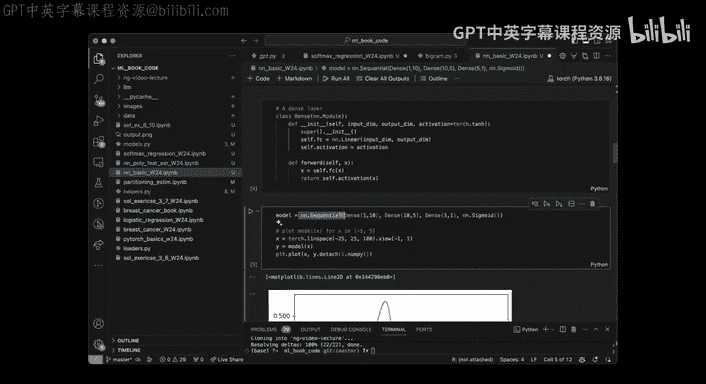

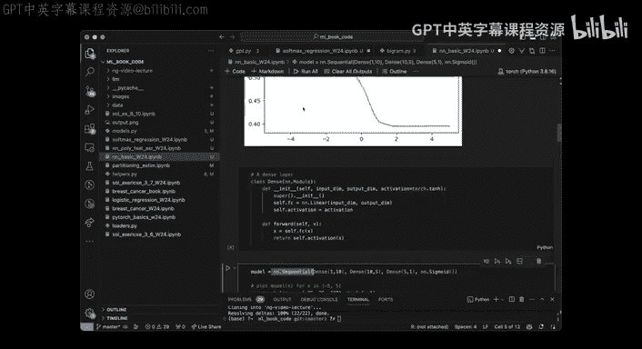

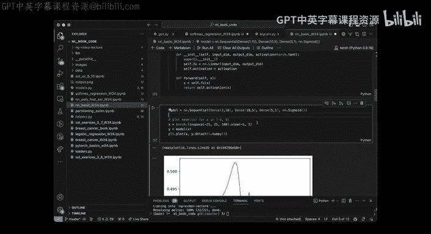

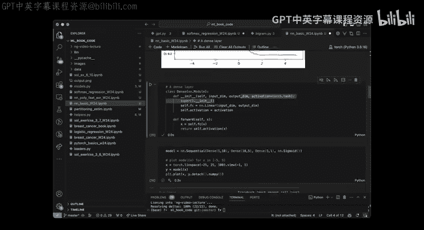

因此，一个用于多类分类的完整神经网络流程是：
**`输入 → 多个（线性层 + 激活函数）→ 最终线性层 → Softmax → 类别概率`**

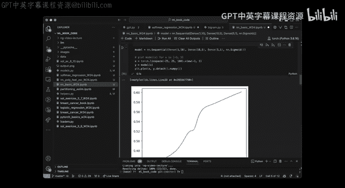

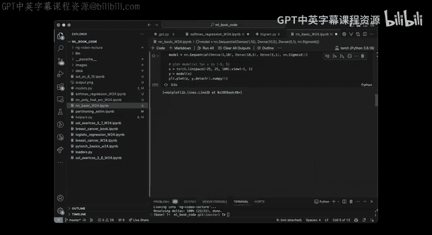

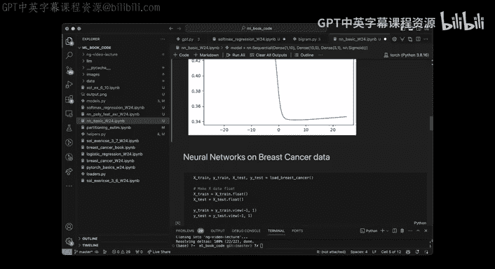

我们可以灵活地设计网络架构：
*   改变隐藏层的数量（深度）。
*   改变每一层神经元的数量（宽度）。
*   使用不同的激活函数。

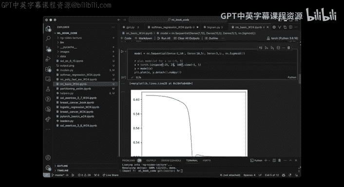

以下是构建一个简单两层网络的代码框架示例：

```python
import torch
import torch.nn as nn

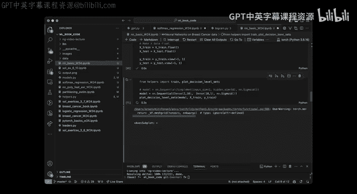

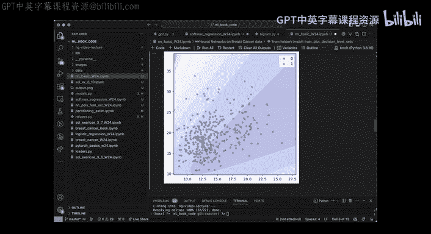

class SimpleNN(nn.Module):
    def __init__(self, input_dim, hidden_dim, output_dim):
        super(SimpleNN, self).__init__()
        self.layer1 = nn.Linear(input_dim, hidden_dim) # 第一线性层
        self.activation = nn.ReLU()                     # 激活函数
        self.layer2 = nn.Linear(hidden_dim, output_dim) # 第二线性层
        # 注意：分类任务中，Softmax通常合并到损失函数中计算

    def forward(self, x):
        z = self.activation(self.layer1(x))
        output = self.layer2(z)
        return output # 输出的是 logits（未归一化的对数概率）

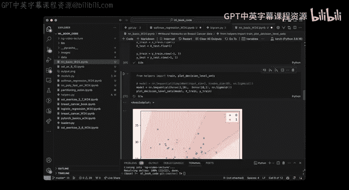

# 实例化模型
model = SimpleNN(input_dim=2, hidden_dim=10, output_dim=1)
```

当我们随机初始化这个模型并检查其输出时，即使尚未训练，它也已经可以产生复杂的非线性形状。训练过程就是通过优化算法（如梯度下降）调整参数 `θ`，使这些形状能够拟合我们的数据。

---

## 总结

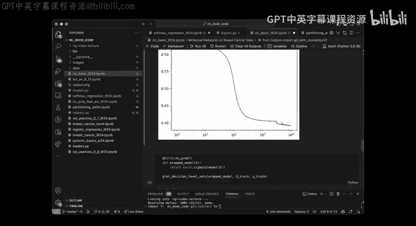

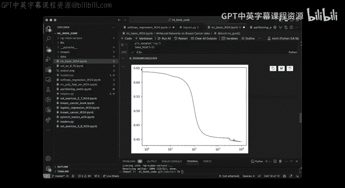

本节课中我们一起学习了：
1.  **线性模型的局限性**：无法处理复杂的非线性决策边界。
2.  **神经网络的核心思想**：通过组合线性变换与简单的非线性激活函数来构建强大的非线性模型。
3.  **基本架构**：包括输入层、隐藏层、输出层，以及前馈传播的过程。
4.  **设计灵活性**：可以通过调整深度、宽度和激活函数来设计不同的网络架构。
5.  **实践概览**：我们看到了如何用代码框架定义一个简单的神经网络，并理解了其初始状态和训练目标。

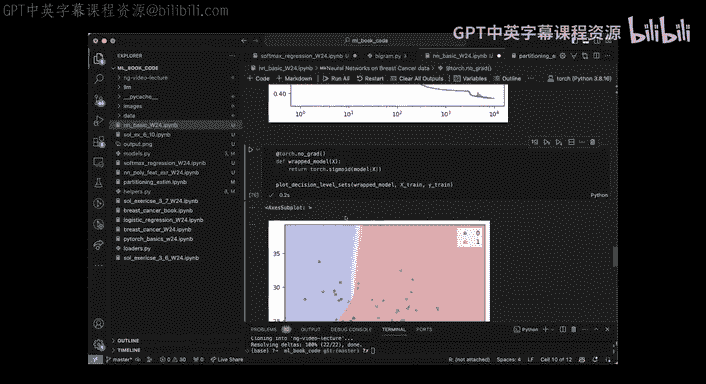

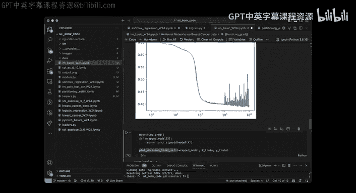

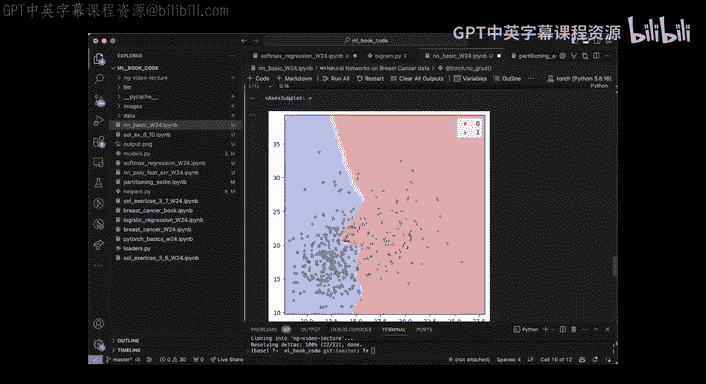

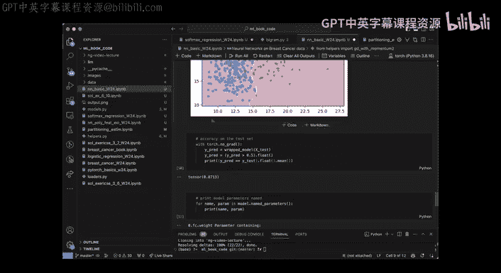

神经网络为我们提供了构建复杂模型的强大框架。在接下来的课程中，我们将深入探讨如何有效地训练这些模型。