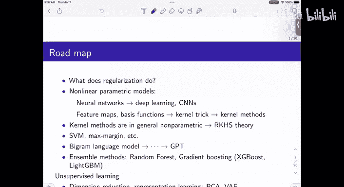
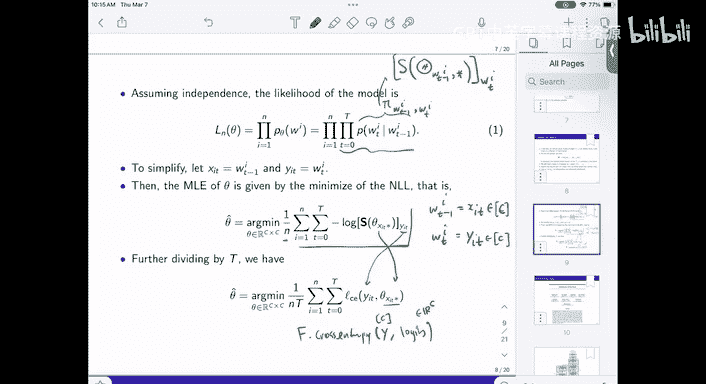
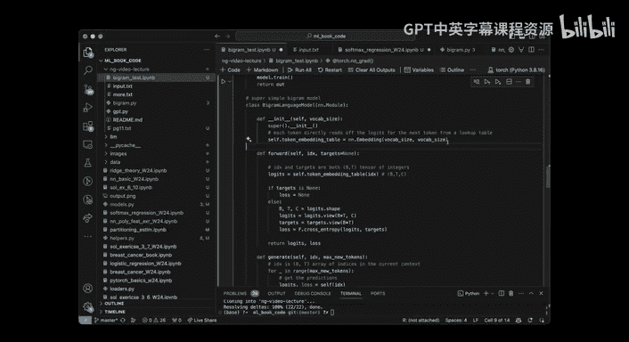

# 17：语言模型基础与Bigram实现 🧠



## 概述
在本节课中，我们将学习语言模型的基本概念，特别是Bigram模型。我们将了解如何将文本建模为一个简单的概率模型，并使用神经网络框架（如PyTorch）来实现和训练它。本节课是理解现代大型语言模型（如GPT）的基础。

---

## 从神经网络到语言模型
上一节我们讨论了通过神经网络进行非线性参数建模的方法。从这一思路出发，我们可以探索更多现代技术。

大规模、多层的神经网络在大量数据集上训练，催生了图像分类、语言建模等领域的突破性性能。

另一个方向是使用特征映射或基函数来建模非线性，这引出了核方法与核技巧。从核方法出发，我们可以讨论与再生核希尔伯特空间相关的有趣理论，这些是捕捉核思想的函数空间。

此外，还有像支持向量机这样的方法，它使用不同的损失函数（如铰链损失）和最大间隔分类的思想。正则化的思想也贯穿其中，我们在作业中已经见过。

本节课我想重点讨论的是特征映射和正则化。如果时间允许，我们也会简要提及集成方法（如随机森林）和无监督学习（如表示学习、聚类、密度估计）。生成模型（如扩散模型、变分自编码器）是当前的热点，但它们需要更多的背景知识。

鉴于课程时间，我们今天将聚焦于一个核心且 surprisingly simple 的模型：**Bigram语言模型**。它是理解ChatGPT等复杂模型的概念基石。

---

## 什么是语言模型？
人们希望建模语言，即对文本序列建模，然后进行预测。

基本思想是：如果给我一些文本，我能预测下一个词，那么我就能预测下下个词，从而生成文本。这就是当前所有生成模型的工作原理。

你给模型一些文本（上下文），它生成下一个词。你可以把整个问答过程看作是一段由分隔符隔开的文本。模型根据截止到当前点的文本来预测后续部分。

它基于海量文本进行训练，并不严格区分问题或答案，整个序列都是文本。模型根据之前生成的所有内容，来生成下一个词。

---

## 将语言建模转化为监督学习问题
这看起来不像一个监督分类问题，但我们可以将其转化为一个。

假设我们有一段文本。我们观察一个大小为 `T` 的块。在这个块中，每个元素是一个词，或者更技术地说，是一个**词元**。它可能是一个字符或字符组合。

我们从索引0开始，假设有 `T` 个词元。我们将前 `T-1` 个词元称为 `X`，将第 `T` 个词元称为 `Y`。

词元属于一个大小为 `C` 的词典。我们可以将每个词编码为索引（例如，0代表词典中的第一个词）。

这样一来，这就变成了一个多类分类问题：给定 `X`，预测 `Y` 的类别（即下一个词是什么）。我们学过的所有方法都可以应用到这里。

唯一的问题是 `X` 是离散的。`X` 有多少种可能的组合？是 `C^(T-1)` 种。如果上下文长度 `T` 是8，词典大小 `C` 是64，那么组合数就是 `64^8`，这是一个巨大的数字。

我们无法像最初几讲那样，简单地通过计数来估计经验联合分布 `P(X, Y)`，因为组合太多，很多组合在文本中根本不会出现。

---

## 伪似然与独立性近似
我们采用一种重要的近似思想：**伪似然**。

我们假设从长文本中随机抽取的、可能重叠的文本块是**独立同分布**的。虽然这些块在原始文本中并不独立，但我们忽略这种依赖性，将其视为独立样本。

这是一种一阶近似。它极大地简化了问题，并且在实践中效果很好。

现在，我们只需要对一个通用的文本块 `[w0, w1, ..., wT]` 进行建模。

---

## Bigram模型与马尔可夫假设
任何序列的概率都可以分解为：
`P(w0, w1, ..., wT) = P(w0) * P(w1|w0) * P(w2|w0,w1) * ... * P(wT|w0,...,wT-1)`

在**Bigram语言模型**中，我们做一个关键的简化假设：下一个词的出现**只依赖于前一个词**。即：
`P(wt | w0, ..., wt-1) ≈ P(wt | wt-1)`

这意味着序列是一个**马尔可夫链**。如果我们进一步假设这个条件概率不随时间位置改变（齐次马尔可夫链），那么整个模型就可以用一个矩阵来表示。

我们用一个 `C x C` 的矩阵 `θ` 来建模。其中，行索引由前一个词 `wt-1` 决定，列索引对应下一个词 `wt`。矩阵的每一行都是一个概率分布，表示给定前一个词时，下一个词的概率。

**公式表示：**
`P(wt = j | wt-1 = i) = softmax(θ[i])_j`
其中 `θ[i]` 是矩阵 `θ` 的第 `i` 行，`softmax` 函数将其转换为一个概率分布。

这个矩阵被称为**Bigram统计矩阵**，因为它收集了所有“词对”的统计信息。



---

## 模型生成文本的过程
模型是固定的。生成文本时：
1.  给定一个初始上下文（最后 `T` 个词）。
2.  模型查看上下文的最后一个词 `wt-1`，找到矩阵 `θ` 中对应的行 `θ[wt-1]`。
3.  对该行应用 `softmax` 得到下一个词的概率分布。
4.  从这个分布中采样（或选择概率最高的词），得到新词 `wt`。
5.  将 `wt` 加入上下文，移除最旧的词，重复步骤2-4。

这就是一个简单的自回归生成过程。模型的随机性来自采样步骤。同样的提示可能产生不同的输出。

---

## 模型训练：转化为交叉熵损失
我们将每个训练样本视为一个 `(X, Y)` 对，其中 `X` 是前一个词的索引，`Y` 是下一个词的索引。

对于参数矩阵 `θ`，给定 `X=i` 时，模型对 `Y` 的预测逻辑值为向量 `θ[i]`。经过 `softmax` 后，得到概率分布。

我们的目标是最大化训练数据的似然，这等价于最小化**负对数似然**。对于单个样本 `(i, j)`，损失为：
`L = -log( softmax(θ[i])_j )`

这正好就是**交叉熵损失**，衡量的是模型预测分布与真实“one-hot”分布之间的差异。

对于整个数据集，损失是所有样本损失的平均。我们可以使用梯度下降来优化矩阵 `θ`。

---

## 代码实现解析
以下我们将结合一段简化的PyTorch代码，说明Bigram模型的关键实现步骤。

### 1. 数据准备：编码与解码
首先，需要将文本字符转化为模型可以处理的数字索引。

```python
# 创建词汇表
text = "..." # 输入文本
chars = sorted(list(set(text))) # 唯一字符列表
vocab_size = len(chars) # 词典大小 C

# 创建编码映射
stoi = {ch:i for i,ch in enumerate(chars)} # 字符 -> 索引
itos = {i:ch for i,ch in enumerate(chars)} # 索引 -> 字符
encode = lambda s: [stoi[c] for c in s] # 编码函数
decode = lambda l: ''.join([itos[i] for i in l]) # 解码函数

# 将整个文本编码为张量
data = torch.tensor(encode(text), dtype=torch.long)
```

### 2. 构建数据集（批处理）
我们需要从长文本中随机抽取训练块 `(X, Y)`。这里 `X` 和 `Y` 是等长的序列，`Y` 是 `X` 向右移动一位的结果。

```python
def get_batch(split):
    # 选择训练集或验证集
    data = train_data if split == 'train' else val_data
    # 随机生成一批起始索引
    ix = torch.randint(len(data) - block_size, (batch_size,))
    # 构建输入 x 和目标 y
    x = torch.stack([data[i:i+block_size] for i in ix])
    y = torch.stack([data[i+1:i+block_size+1] for i in ix])
    return x, y

# 示例：x[0] = [24, 43, 58, ...], y[0] = [43, 58, 46, ...]
# 在位置 t，模型应根据 x[0][:t+1] 来预测 y[0][t]
```

### 3. 定义Bigram模型
模型的核心是一个词嵌入层，它本质上是一个查找表。

```python
import torch.nn as nn

class BigramLanguageModel(nn.Module):
    def __init__(self, vocab_size):
        super().__init__()
        # 词元嵌入表，形状为 (vocab_size, vocab_size)
        # 第 i 行对应词 i 的嵌入，也即预测下一个词的逻辑值向量
        self.token_embedding_table = nn.Embedding(vocab_size, vocab_size)

    def forward(self, idx, targets=None):
        # idx 和 targets 形状都是 (batch_size, block_size)
        # 获取逻辑值
        logits = self.token_embedding_table(idx) # 形状: (B, T, C)

        if targets is None:
            # 生成模式，只返回逻辑值
            return logits, None
        else:
            # 训练模式，计算损失
            B, T, C = logits.shape
            # 将逻辑值和目标展平，以计算交叉熵损失
            logits = logits.view(B*T, C)
            targets = targets.view(B*T)
            # 计算负对数似然损失（交叉熵）
            loss = F.cross_entropy(logits, targets)
            return logits, loss
```
**说明**：
*   `nn.Embedding(vocab_size, vocab_size)` 层是一个可学习的矩阵，其权重形状为 `(C, C)`。这正是我们的参数矩阵 `θ`。
*   输入 `idx` 是整数索引张量，嵌入层会输出对应行的向量。
*   `cross_entropy` 函数内部已经包含了 `softmax` 操作，它直接接受逻辑值 `logits` 和目标 `targets`。

### 4. 训练循环
训练过程就是标准的梯度下降。

```python
model = BigramLanguageModel(vocab_size)
optimizer = torch.optim.AdamW(model.parameters(), lr=1e-3)

for step in range(max_iters):
    # 获取一个数据批
    xb, yb = get_batch('train')
    # 前向传播，计算损失
    logits, loss = model(xb, yb)
    # 反向传播，更新参数
    optimizer.zero_grad(set_to_none=True)
    loss.backward()
    optimizer.step()
```

### 5. 文本生成
使用训练好的模型进行自回归生成。

```python
def generate(model, idx, max_new_tokens):
    # idx 是当前上下文，形状为 (B, T)
    for _ in range(max_new_tokens):
        # 获取预测（只取最后一个时间步的上下文）
        logits, loss = model(idx[:, -block_size:])
        # 聚焦于最后一个时间步的预测
        logits = logits[:, -1, :] # 形状变为 (B, C)
        # 应用softmax得到概率
        probs = F.softmax(logits, dim=-1)
        # 从分布中采样下一个词元
        idx_next = torch.multinomial(probs, num_samples=1)
        # 将新词元附加到序列中
        idx = torch.cat((idx, idx_next), dim=1)
    return idx



# 从初始上下文开始生成
context = torch.zeros((1, 1), dtype=torch.long) # 初始词元索引（例如0）
print(decode(generate(model, context, max_new_tokens=100)[0].tolist()))
```

---

## 总结
本节课我们一起学习了语言模型的基础——Bigram模型。

我们首先了解了如何将语言建模问题转化为监督学习中的分类任务。然后，通过引入**马尔可夫假设**（下一个词仅依赖于前一个词），我们得到了极其简单的Bigram模型，它仅用一个 `C x C` 的概率矩阵即可描述。

我们详细讨论了该模型的**训练目标**，即最小化交叉熵损失，这等价于最大似然估计。最后，我们通过PyTorch代码逐步解析了Bigram模型的**实现细节**，包括数据编码、批处理、模型定义、训练循环以及文本生成过程。


Bigram模型虽然简单，但它包含了现代语言模型最核心的自回归生成思想。理解它是迈向理解更复杂模型（如基于Transformer的GPT）的重要第一步。