# 18：从二元语法模型到GPT架构 🚀


在本节课中，我们将学习语言模型的核心思想，从基础的二元语法模型过渡到更复杂的GPT架构。我们将探讨如何将序列预测问题建模为分类任务，以及如何通过参数化和优化来构建更强大的模型。

---

## 概述：从序列预测到语言模型

上一节我们介绍了语言模型的基本概念。其核心思想是：给定一个由标记（token）组成的序列（上下文），我们想要预测序列中的下一个标记。这本质上是一个具有离散特征和离散标签（即词汇表中的所有可能标记）的多类别分类问题。

例如，如果我们的词汇表大小 `C = 64`，上下文长度 `T = 8`，那么可能的上下文组合数量是 `64^8`，这是一个巨大的数字。直接计算所有组合的联合概率分布是不现实的。

---

## 二元语法模型与马尔可夫假设

为了解决组合爆炸问题，我们引入了**马尔可夫假设**。该假设认为，下一个标记的概率仅依赖于前一个标记，而不是整个历史上下文。

具体来说，我们不是建模完整的联合概率 `P(w_0, w_1, ..., w_T)`，而是将其分解为一系列条件概率的乘积：
```
P(w_0, w_1, ..., w_T) ≈ P(w_0) * P(w_1 | w_0) * P(w_2 | w_1) * ... * P(w_T | w_{T-1})
```
这被称为**二元语法模型**。此时，我们需要估计的参数就从 `C^(T+1)` 个减少到了 `C * C` 个（一个条件概率表）。

以下是估计这些概率的直观方法：
*   遍历训练文本中的所有连续标记对。
*   统计每个标记 `w_i` 后面出现标记 `w_j` 的频率。
*   条件概率 `P(w_j | w_i)` 就可以用这个频率来近似。

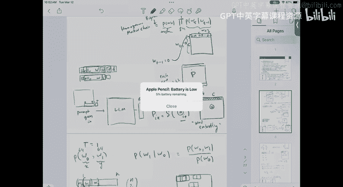

---

## 参数化与逻辑参数

然而，直接使用频率作为概率存在限制（例如，必须满足非负且和为1）。在机器学习中，我们更倾向于使用**参数化**的方法。

我们不直接建模概率矩阵 `P`，而是引入一个**逻辑参数矩阵** `θ`（logits）。这个矩阵的每一行对应一个上下文标记，每一列对应一个目标标记。`θ` 的元素可以是任意实数。

然后，我们通过 **softmax** 函数将每一行的逻辑值转换为概率分布：
```
P(w_next = j | w_current = i) = softmax(θ[i])_j = exp(θ[i, j]) / Σ_k exp(θ[i, k])
```
这种参数化的好处是：
*   优化过程可以自由地调整实数参数 `θ`，不受概率约束的限制。
*   我们可以使用基于梯度的优化算法（如随机梯度下降）来最小化损失函数。

---

## 经验风险最小化框架

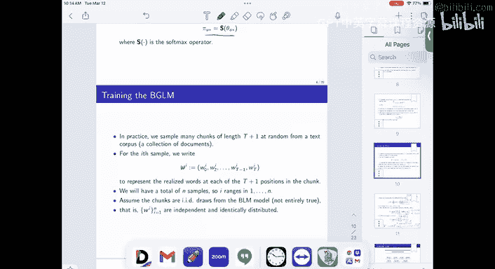

我们将语言模型训练纳入**经验风险最小化**框架。对于一组训练数据（文本块），我们的目标是最大化模型分配给真实下一个标记的概率，这等价于最小化**负对数似然**损失。

对于一个批次的数据，损失函数可以写为：
```python
# 伪代码示意
loss = 0
for (context, target) in batch:
    logits = model(context) # 模型输出逻辑值矩阵，形状为 [batch_size, context_length, vocab_size]
    probs = softmax(logits, dim=-1)
    # 计算交叉熵损失：-log(probs[对应真实目标标记的位置])
    loss += cross_entropy_loss(probs, target)
loss = loss / len(batch)
```
通过反向传播计算损失相对于参数 `θ` 的梯度，并使用优化器（如Adam）更新参数，模型就能逐渐学会预测下一个标记。

---

## 从二元模型到GPT：引入嵌入

二元语法模型只考虑了前一个标记的信息。而像GPT这样的现代模型，其核心突破之一是能够考虑**整个上下文**中所有标记的信息。这是通过**嵌入**和**自注意力机制**实现的。

首先，每个输入标记（一个整数ID）会被转换成两个嵌入向量：
1.  **标记嵌入**：表示标记本身的语义信息。
2.  **位置嵌入**：表示该标记在序列中的位置信息。

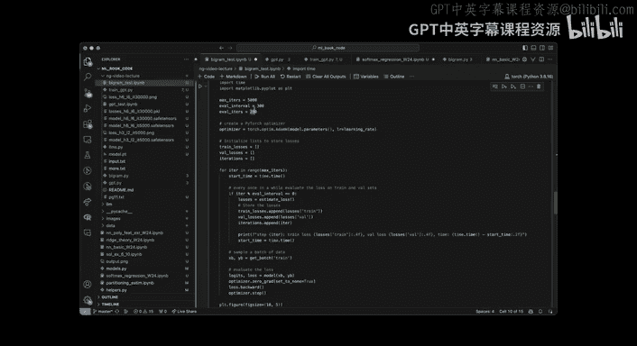

这两个向量相加，得到该标记的最终表示 `x_t`，它是一个 `d_model` 维的向量（例如384维）。因此，一个长度为 `T` 的上下文被表示为一个矩阵 `X`，其形状为 `[T, d_model]`。

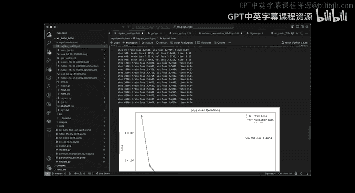

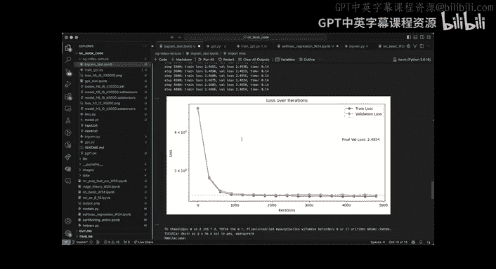

---

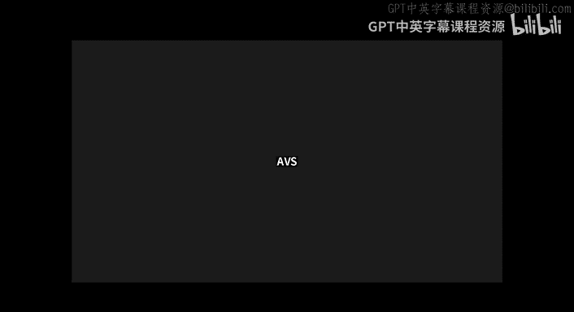


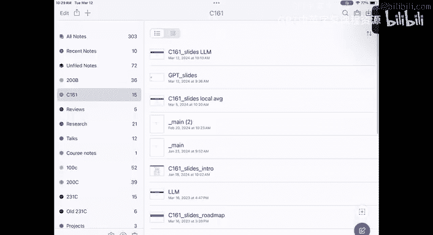

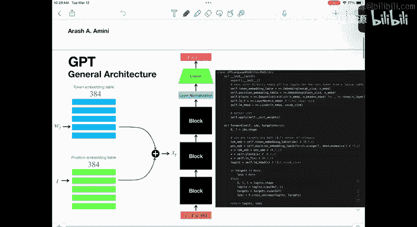

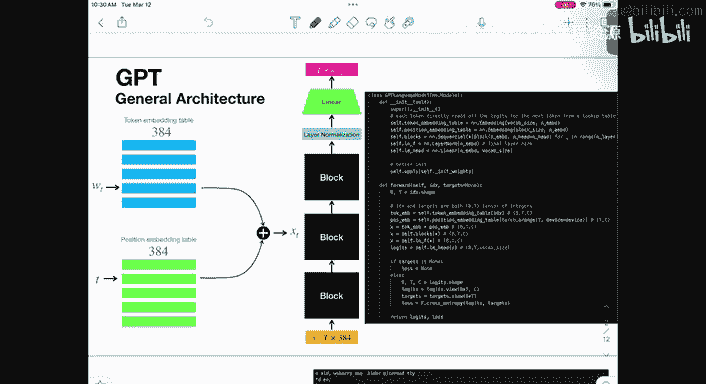

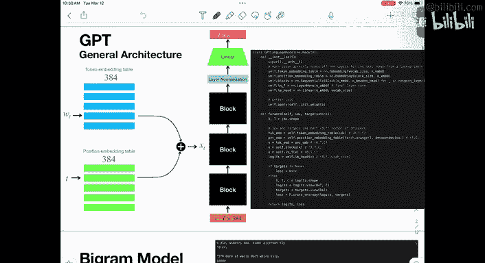

## GPT的Transformer块

GPT模型由多个相同的 **Transformer块** 堆叠而成。每个块的主要作用是让序列中每个标记的表示能够“注意到”其他所有标记的信息，并进行信息整合。

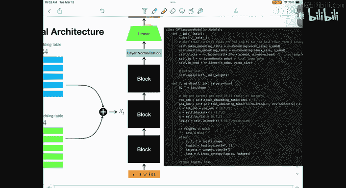

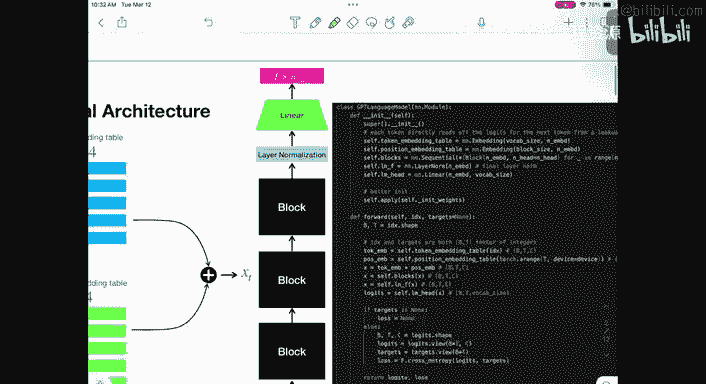

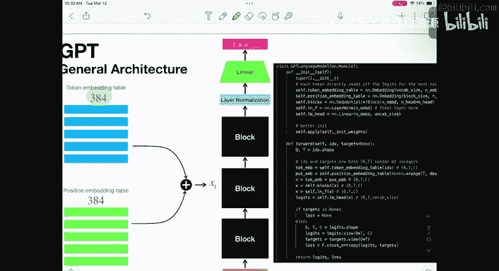

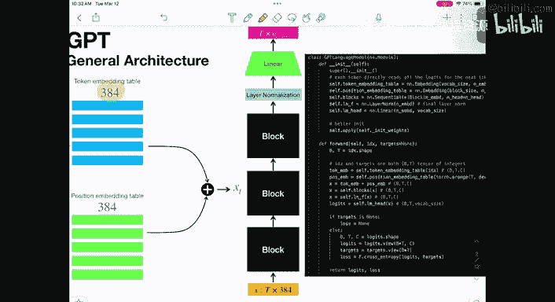

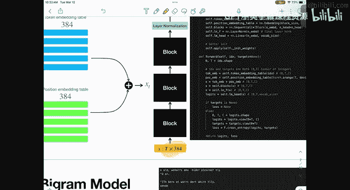

一个Transformer块主要包含两个子层：
1.  **多头自注意力层**：这是模型的核心。它允许序列中的每个位置根据其他所有位置的加权组合来更新自己的表示。权重（注意力分数）由标记之间的相关性动态计算得出。
2.  **前馈神经网络层**：这是一个应用于每个位置上的独立全连接层，用于进一步处理信息。

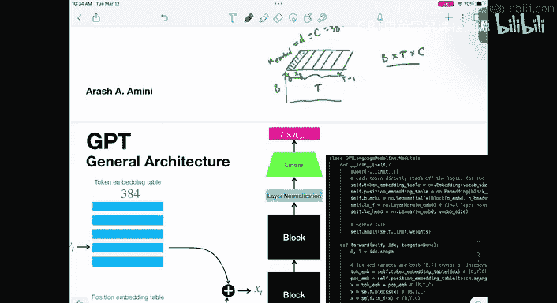

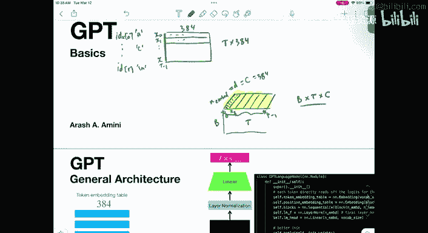

每个子层周围都应用了**残差连接**和**层归一化**，这有助于稳定深度网络的训练。

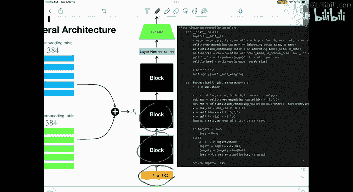

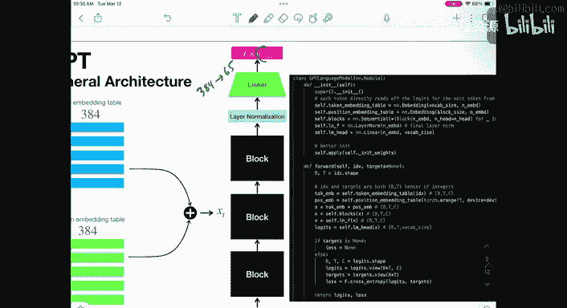

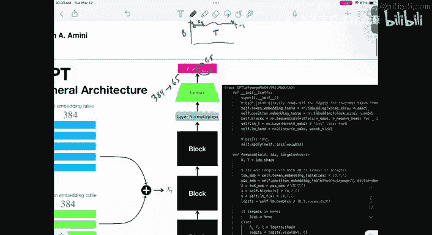

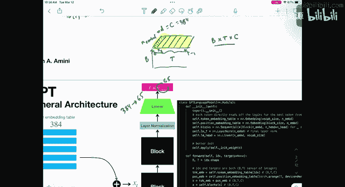

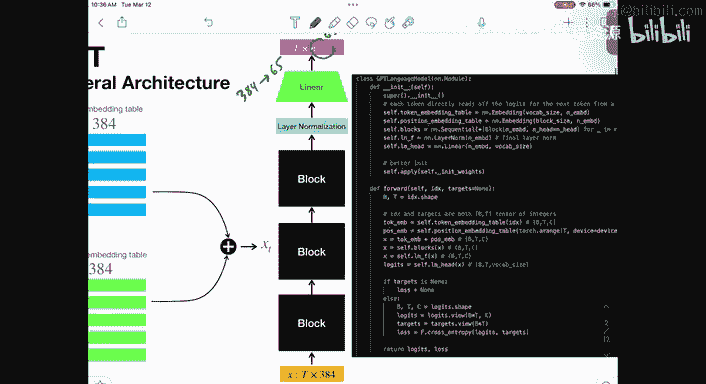

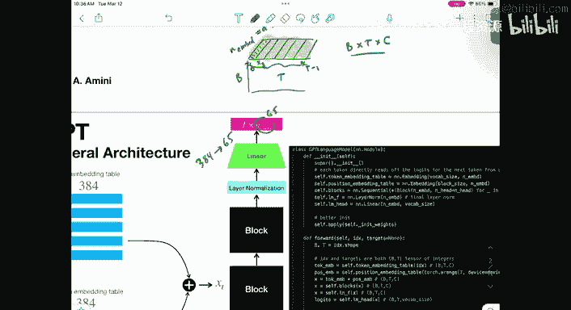

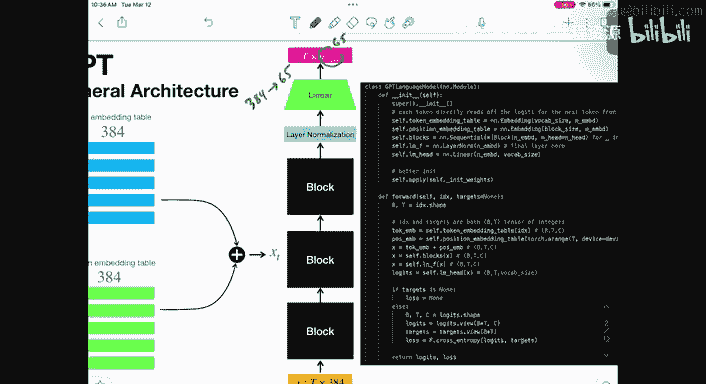

---

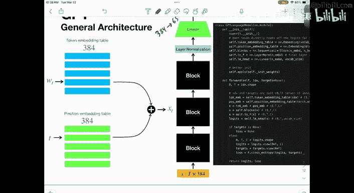

## 模型输出与预测


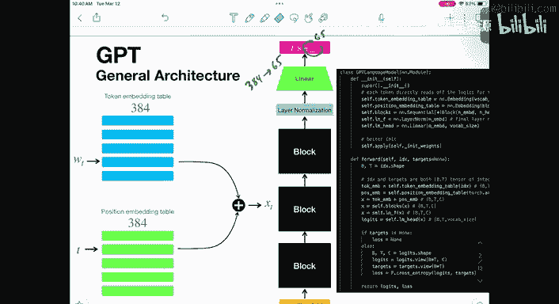

经过多个Transformer块处理后，我们得到了经过深度上下文编码的序列表示。最后，通过一个**线性层**（通常称为语言模型头）将每个位置的 `d_model` 维向量映射回词汇表大小 `C` 的维度，得到逻辑值。

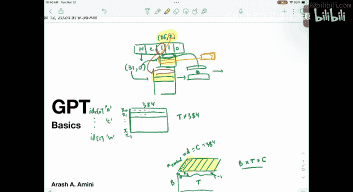

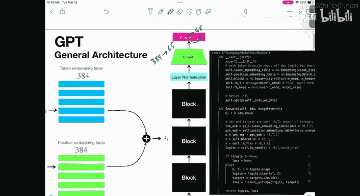

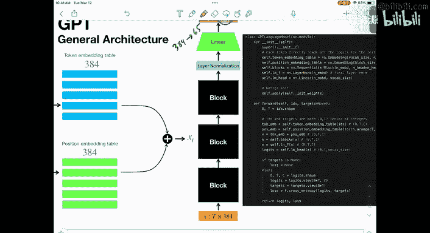


最终，对最后一个位置的输出逻辑值应用 softmax，就得到了下一个标记的预测概率分布。
```
最终输出逻辑值: logits = Linear(LayerNorm(TransformerBlock(...(X))))
预测概率: P(next_token) = softmax(logits[-1, :])
```

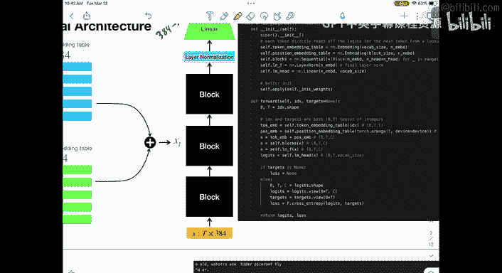

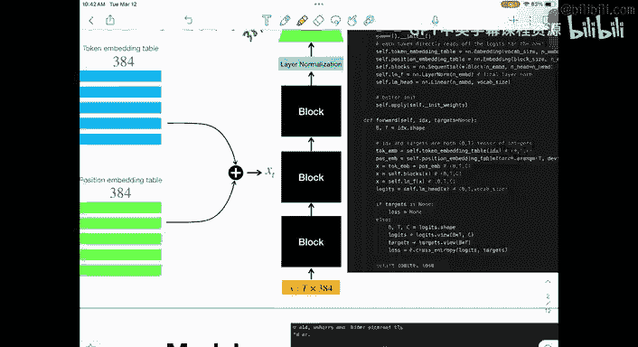

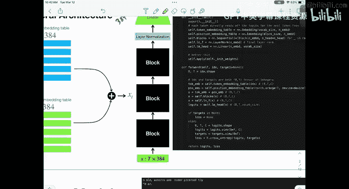

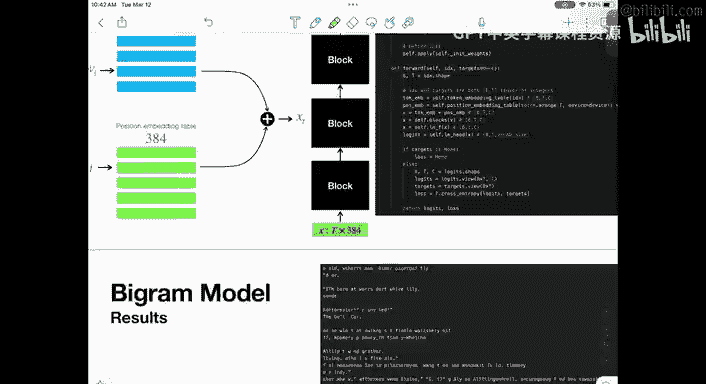

---

## 总结

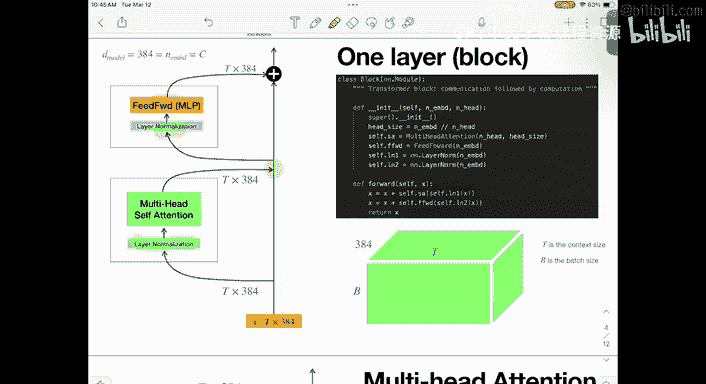

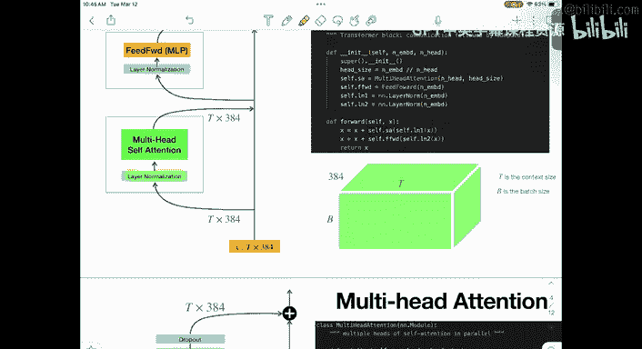

本节课我们一起学习了语言模型的演进路径：
1.  我们从**序列预测**问题出发，将其形式化为分类任务。
2.  为了简化计算，引入了**马尔可夫假设**和**二元语法模型**。
3.  通过**逻辑参数化**和**softmax**函数，我们将问题转化为可优化的机器学习模型。
4.  在**经验风险最小化**框架下，使用梯度下降来训练模型。
5.  最后，我们探讨了**GPT架构**的核心思想：使用**标记嵌入**和**位置嵌入**将离散符号转化为连续向量，并通过堆叠**Transformer块**（利用自注意力机制）来建模长距离上下文依赖，从而构建出强大的语言模型。

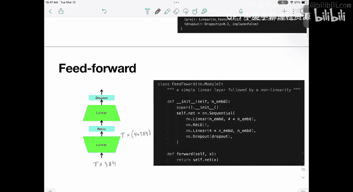

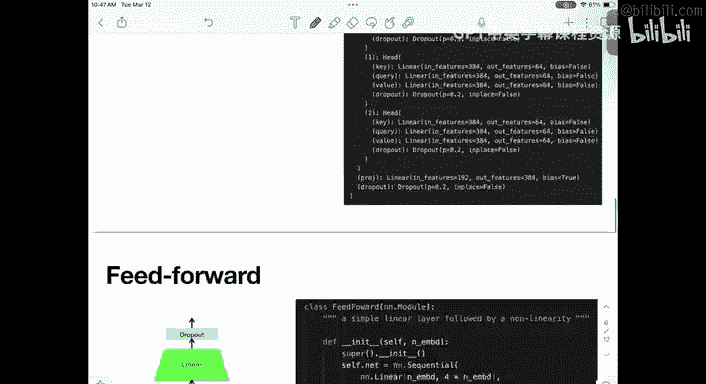

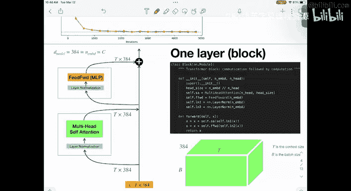

下一节课，我们将深入探讨Transformer块中**自注意力机制**的详细工作原理。