# 19：GPT模型架构与正则化 🧠

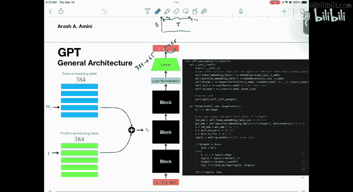

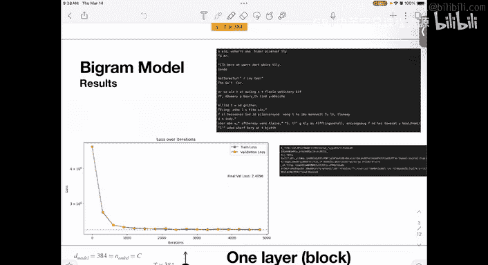

在本节课中，我们将学习GPT（Generative Pre-trained Transformer）模型的核心架构，并探讨如何通过正则化技术来防止模型过拟合。我们将从语言模型的基本概念出发，深入理解自注意力机制，最后介绍一种处理高维特征空间过拟合问题的方法。

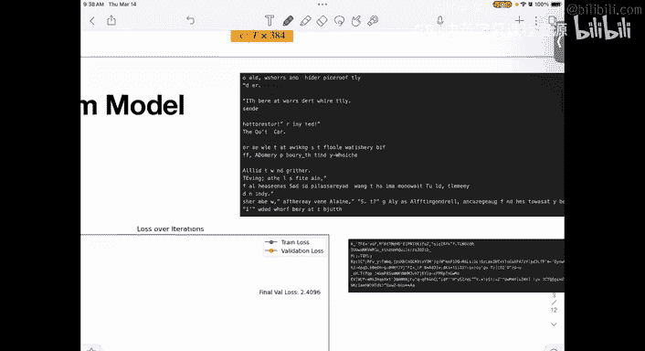

---

## 语言模型与监督学习

上一节我们讨论了语言模型学习。其核心在于，这些模型本质上是一个监督学习问题，目标是预测给定上下文中的下一个词。

这是一个非常自然的分类问题。例如，上下文可能很长，如果仅将其视为离散特征，预测效果可能不佳。二元语言模型（Bigram Language Model）就是一个简单的例子。

在初始化阶段，模型的输出可能不理想。经过训练后，输出会有所改善，但仍然不够完美，生成的句子可能不连贯或存在语法问题。

训练损失与评估损失通常非常接近，这表明模型复杂度适中，没有出现过拟合。这与我们在第一章中看到的训练集和测试集误差接近的情况类似。

---

## GPT模型的核心创新

那么，GPT模型试图建模和学习词语之间的复杂关系。它有几个关键创新：

### 1. 词嵌入（Word Embedding）

在更大的语言模型中，我们有一个参数表 `theta`，可以将其视为词的嵌入（Embedding）。这本质上是为每个词创建一个向量表示，用于计算下一个词的条件概率。

词嵌入将词语映射到向量空间，使其能够编码语义信息。这样做的好处是，我们可以对词向量进行数学运算。例如，“猫”和“狗”的向量相加，可能得到一个代表“动物”含义的向量。我们可以通过线性或非线性变换来操作这些向量，就像操作实数向量一样。

### 2. 位置编码（Positional Encoding）

同样地，词语在序列中的位置也是一个离散索引。我们可以将位置信息也编码成一个向量。

例如，一个句子中的每个词，我们不仅嵌入词本身，还嵌入其位置。然后，我们将词嵌入向量和位置编码向量相加。这样，位置信息就可以与词语的语义信息进行交互。

最终，对于一个长度为 `T` 的上下文，我们得到一个维度为 `T x d_model` 的矩阵，其中 `d_model` 是嵌入维度（例如384）。

---

## GPT模型架构总览

这些嵌入向量会经过一系列块（Blocks）或层（Layers）的处理。每一层通常包含层归一化（Layer Norm）和自注意力（Self-Attention）等操作。

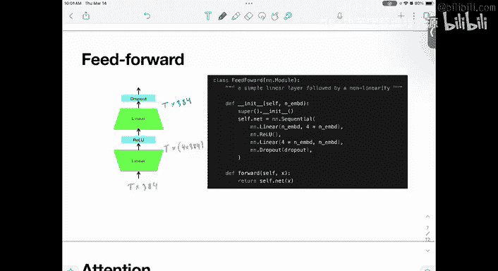

在模型的最后，有一个线性层将 `d_model` 维的向量映射到词汇表大小 `V` 的维度（例如65）。这样，对于序列中的每个位置，我们都得到一个 `V` 维的向量，可以看作是下一个词的逻辑值（Logits）。我们取最后一个位置的输出，应用Softmax函数，就得到了下一个词的概率分布。

整个模型架构可以概括为以下几个步骤：
1.  通过查表获取词嵌入和位置编码，并相加。
2.  将结果输入一系列相同的Transformer块。
3.  每个块内部进行自注意力和前馈神经网络处理。
4.  最后通过一个线性层（LM Head）映射到词汇表维度。

---

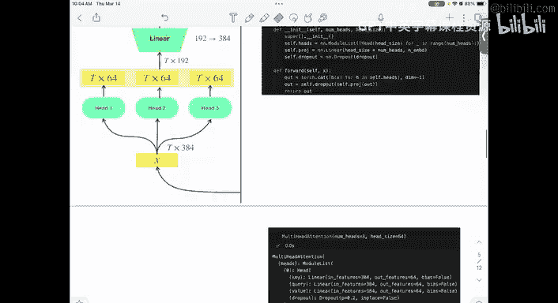

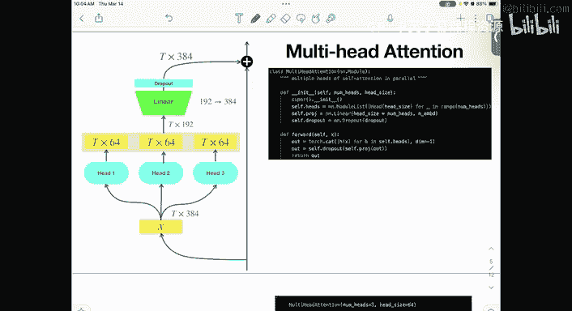

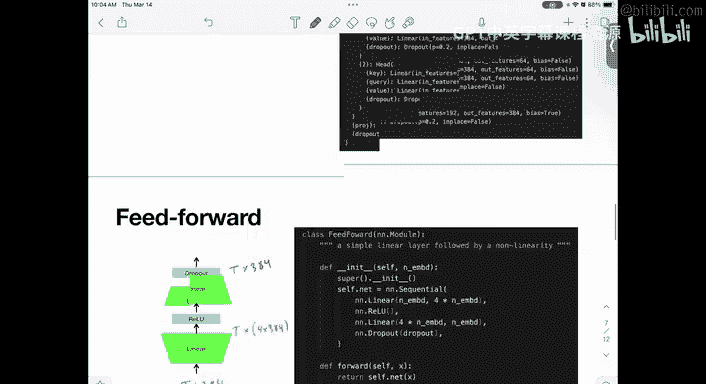

## Transformer块详解

每个Transformer块是模型的核心组件。它的结构基于残差连接（Residual Connection）的思想。

残差连接是指将块的输入直接加到其输出上。这类似于在回归中，先用一个模型预测，然后对残差（预测值与真实值的差）再用另一个模型建模。在神经网络中，这有助于信息流动和梯度传播，使深层网络更容易训练。

一个标准的Transformer块主要包含两个子层：
1.  **多头自注意力层（Multi-Head Self-Attention）**：这是模型的核心创新，我们稍后会详细解释。
2.  **前馈神经网络层（Feed-Forward Network）**：这是一个简单的多层感知机（MLP），通常包含一个隐藏层和非线性激活函数。

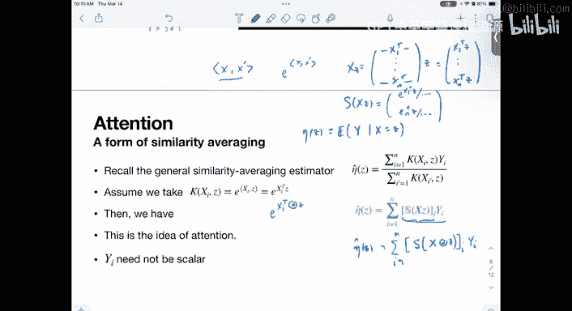

每个子层周围都应用了层归一化和残差连接。具体流程为：`输入 -> 层归一化 -> 子层计算 -> 加回输入（残差连接）`。

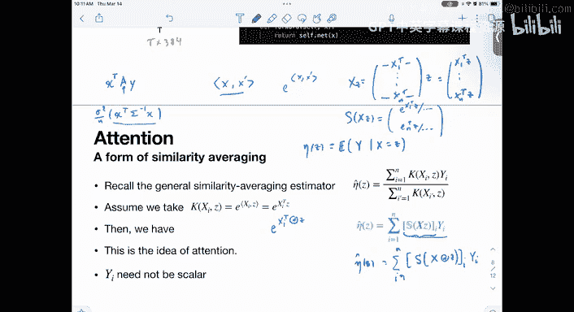

---

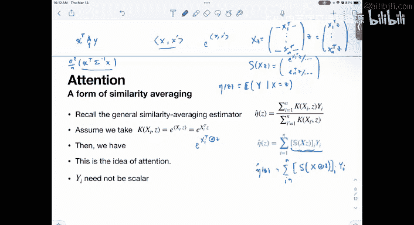

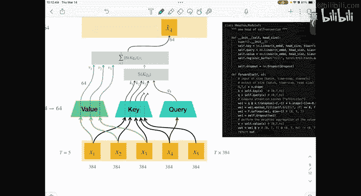

## 自注意力机制

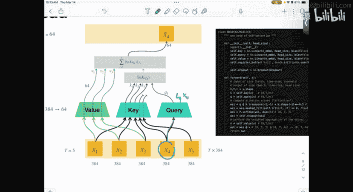

现在，让我们深入理解自注意力机制，它是Transformer架构的灵魂。

自注意力的灵感可以追溯到我们在第二章讨论过的“相似性加权平均”思想。在非参数回归中，我们通过计算查询点与所有训练数据点的相似度，来加权平均对应的响应值。

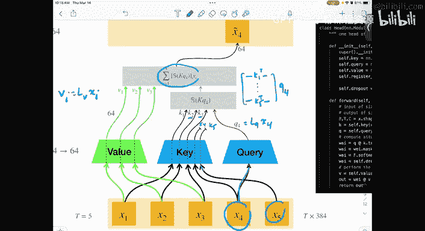

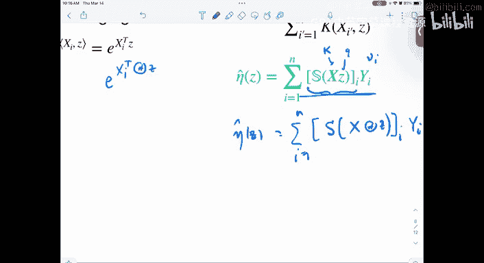

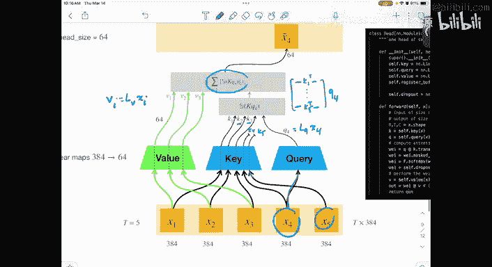

一个常见的相似度度量是内积的指数形式：`sim(x, z) = exp(x^T z)`。这可以写成Softmax函数的形式。我们可以将其参数化，引入一个可学习的权重矩阵 `A`，使得相似度变为 `exp(x^T A z)`。这定义了在由 `A` 决定的度量下的内积，增加了模型的灵活性。

Transformer中的自注意力机制正是这一思想的扩展和应用。其核心操作如下：

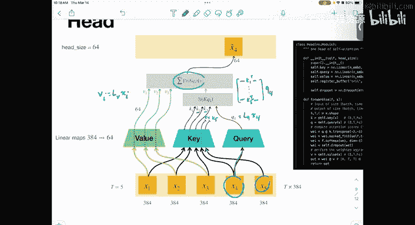

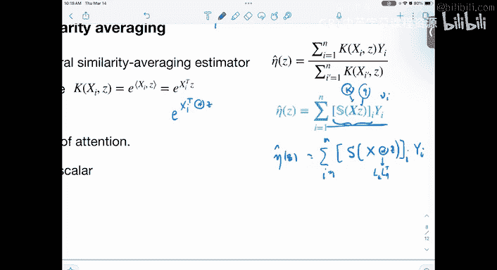

对于输入序列中的每个位置 `i` 的向量 `x_i`：
*   通过线性变换生成一个**查询向量（Query）** `q_i`。
*   通过另一个线性变换生成一个**键向量（Key）** `k_i`。
*   通过第三个线性变换生成一个**值向量（Value）** `v_i`。

为了计算位置 `i` 的新表示，我们：
1.  用 `q_i` 与所有位置的 `k_j` 计算相似度（通常用点积）。
2.  对这些相似度应用Softmax函数，得到一组权重。
3.  用这组权重对所有的 `v_j` 进行加权求和，得到位置 `i` 的输出。

**公式表示如下：**
`Attention(Q, K, V) = softmax(Q K^T / sqrt(d_k)) V`

其中，`Q`, `K`, `V` 分别是由所有位置的查询、键、值堆叠而成的矩阵，`d_k` 是键向量的维度，缩放因子 `sqrt(d_k)` 用于稳定梯度。

**“自注意力”** 的含义在于，查询、键、值都来自同一组输入序列。这使得序列中的每个位置都可以关注到所有其他位置的信息，并根据相似度动态地聚合信息。

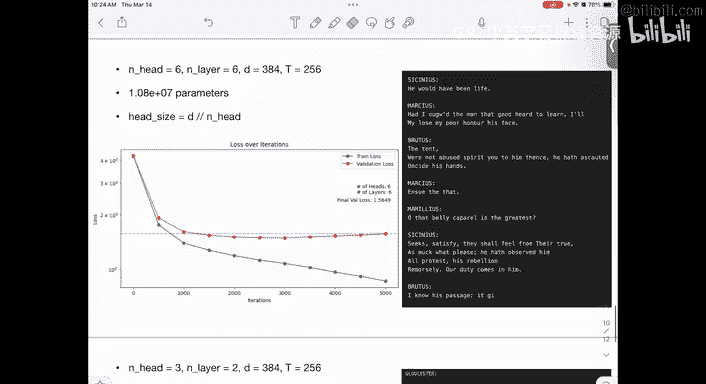

**“多头注意力”** 是指并行地运行多个这样的自注意力机制（即多个“头”），每个头使用不同的线性变换参数，从而允许模型在不同的表示子空间中关注不同的信息。最后，将所有头的输出拼接起来，再通过一个线性层映射回原始维度。

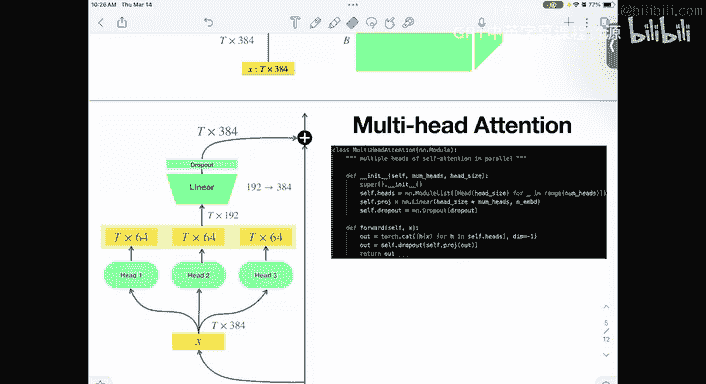

在GPT这样的解码器（Decoder-Only）模型中，我们还会使用**掩码（Mask）**，确保在预测位置 `i` 时，只能看到位置 `i` 之前的信息，而不能看到未来的信息，这符合语言建模的因果性。

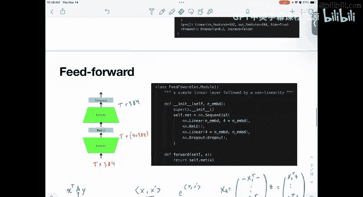

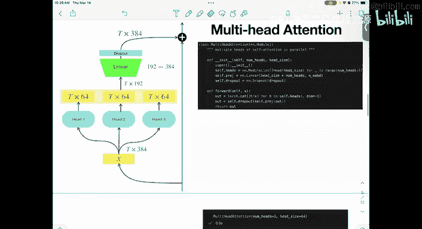

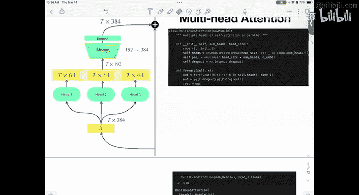

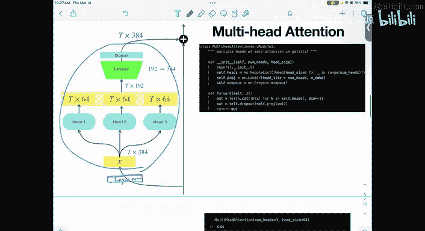

---

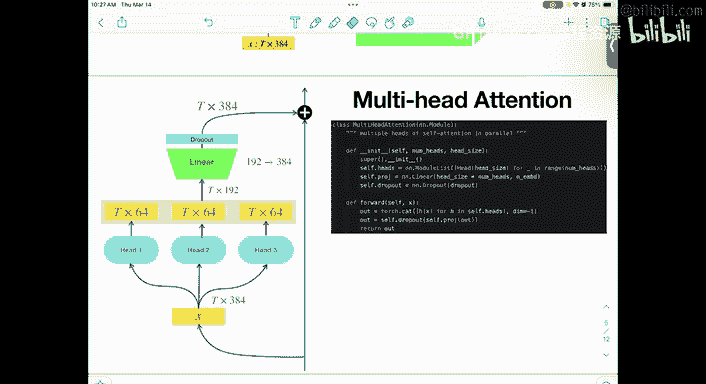

## 模型规模与过拟合

当我们增加模型的层数（块的数量）和参数量时，模型的表达能力会增强。例如，一个拥有6层、约1000万参数的小型GPT模型。

然而，如果模型参数量远大于训练数据量（token数量），就容易出现**过拟合**。过拟合表现为训练损失持续下降，但验证损失在经过一段下降后开始上升，这意味着模型记住了训练数据的噪声，而非学习到泛化模式。

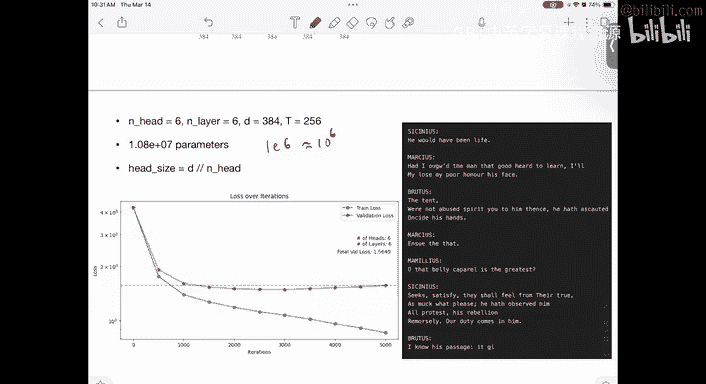

解决过拟合的一种常见方法是**早停（Early Stopping）**，即在验证损失不再下降时停止训练。另一种更根本的方法是使用**正则化（Regularization）**。

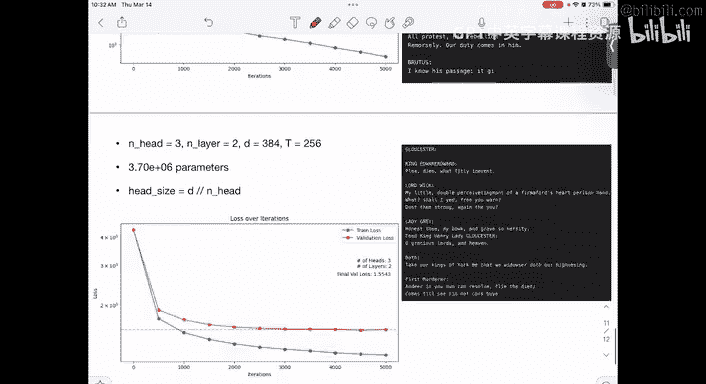

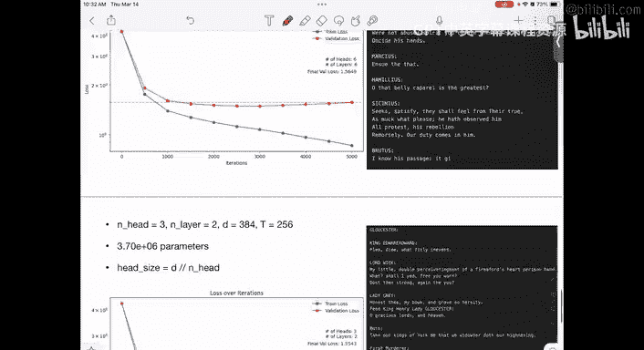

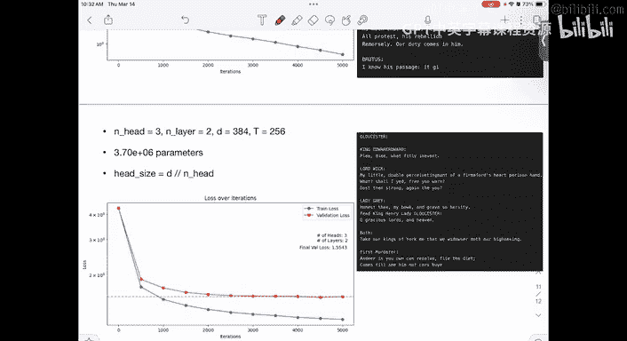

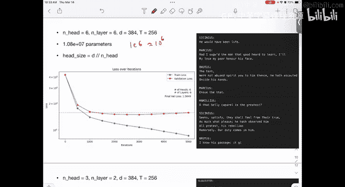

---

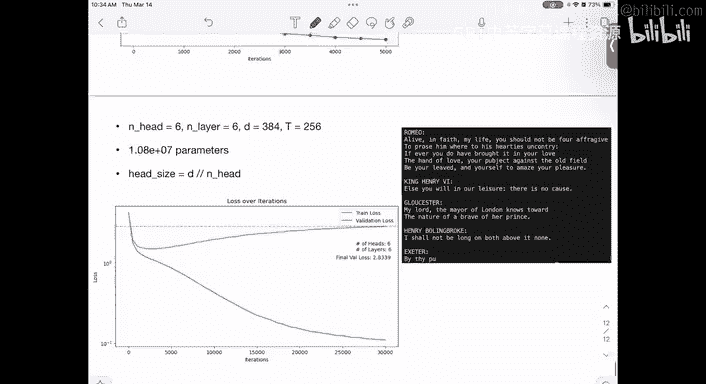

## 特征映射与正则化

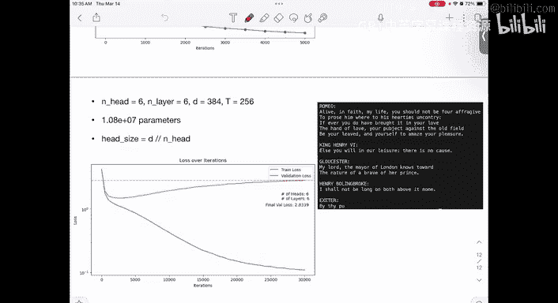

最后，我们简要介绍一种将线性模型扩展到非线性领域并控制过拟合的方法：**特征映射结合正则化**。

假设我们有一个线性回归模型：`y = θ^T x`。要使其能够拟合非线性关系，我们可以先将输入 `x` 通过一个**特征映射函数 φ(x)** 映射到高维空间。例如，将一维的 `x` 映射为多项式特征 `φ(x) = [1, x, x^2, ..., x^k]`。

然后，我们在新的高维特征空间 `φ(x)` 中执行线性回归：`y = θ^T φ(x)`。这样，在原输入空间 `x` 中，模型就变成了一个非线性函数（如多项式）。

然而，特征映射会急剧增加特征维度。如果原始特征维度是 `d`，映射到 `k` 阶多项式，特征数量会爆炸式增长。当参数数量接近甚至超过样本数量时，方差会增大，极易导致过拟合。

此时，我们可以引入**正则化**，例如在损失函数中添加权重的L2范数惩罚项（岭回归/Ridge Regression）：

**损失函数公式：**
`L(θ) = Σ (y_i - θ^T φ(x_i))^2 + λ ||θ||^2`

其中，`λ` 是正则化强度超参数。通过调整 `λ`，我们可以在偏差（Bias）和方差（Variance）之间进行权衡：
*   `λ` 很大时，模型权重被严重压缩，偏差高，方差低（可能欠拟合）。
*   `λ` 很小时，模型接近普通最小二乘，方差高，偏差低（可能过拟合）。
*   合适的 `λ` 可以找到最佳平衡点，提升模型在未见数据上的性能。

在实际的深度学习框架中，这种L2正则化通常通过**权重衰减（Weight Decay）** 来实现，即在优化器更新权重时，额外减去一个与权重成正比的小量。

---

## 总结

本节课中，我们一起学习了：
1.  **GPT模型架构**：理解了词嵌入、位置编码、Transformer块（包含残差连接、层归一化、前馈网络）以及最终的概率映射。
2.  **自注意力机制**：深入探讨了其数学原理（查询、键、值、相似度加权平均），以及多头注意力和因果掩码的作用。
3.  **过拟合与正则化**：认识了模型规模过大可能导致的过拟合问题，并学习了通过特征映射将模型非线性化后，如何使用L2正则化（权重衰减）来控制模型复杂度，在偏差和方差之间取得平衡，从而提升泛化能力。

这些概念是现代大语言模型的基础，理解它们有助于我们更好地把握深度学习模型的设计与优化思路。