# 01：课程大纲与描述 📚

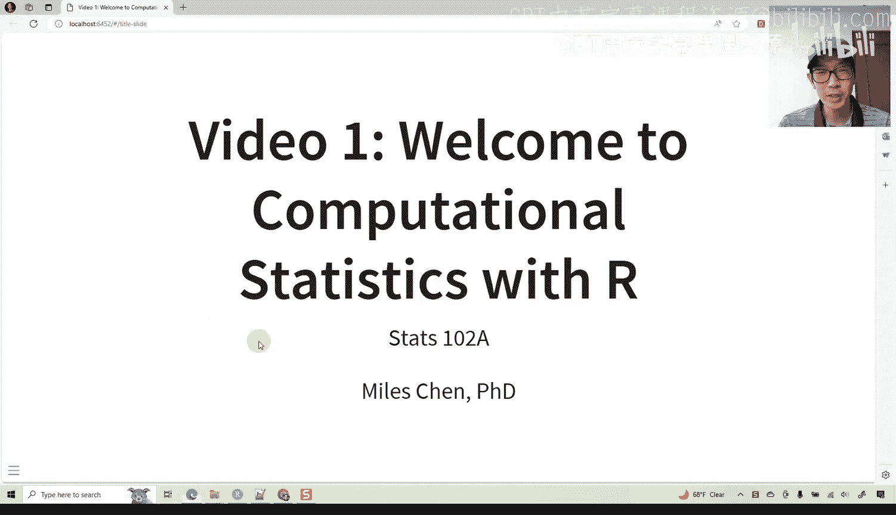

在本节课中，我们将学习Stats 102A《使用R的计算统计学》课程的基本信息，包括课程结构、评分标准、核心目标以及学术诚信要求。

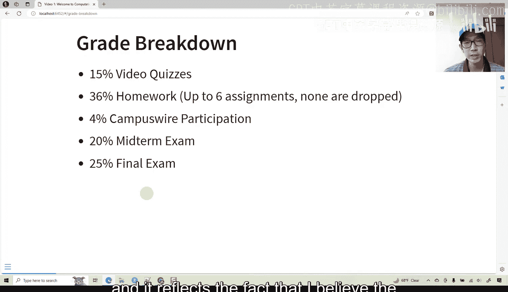

## 课程概述与教师介绍 👨‍🏫

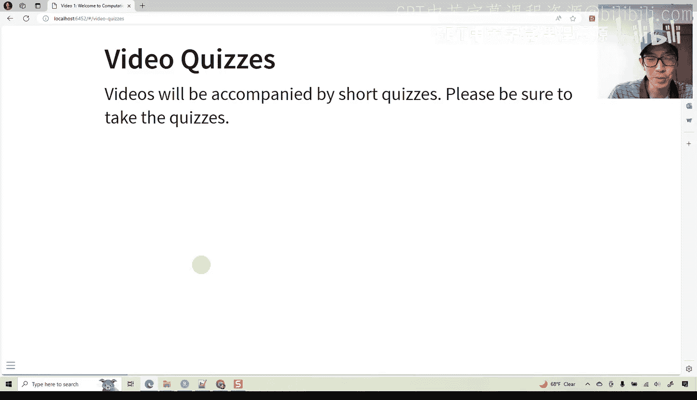

大家好，欢迎来到Stats 102A《使用R的计算统计学》课程。本学期我将尝试录制较短的视频，并每周发布一系列内容。让我们从课程大纲的几个要点开始。

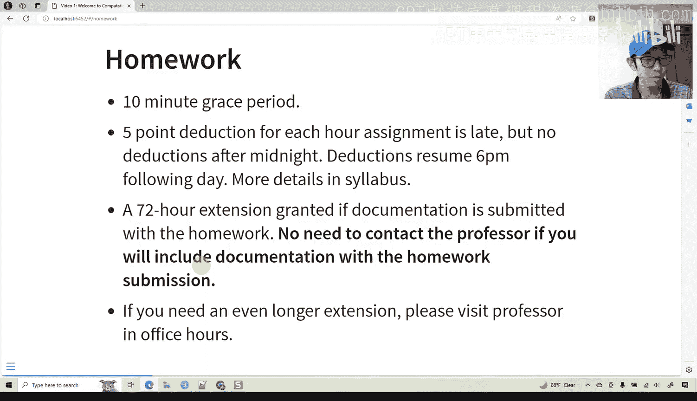

我的名字是Miles Chen，我将担任本学期的教授。你们可以称呼我为陈教授、陈博士，或者直接叫我Miles。无论哪种方式，我都可以接受。

## 评分标准与课程要求 📊

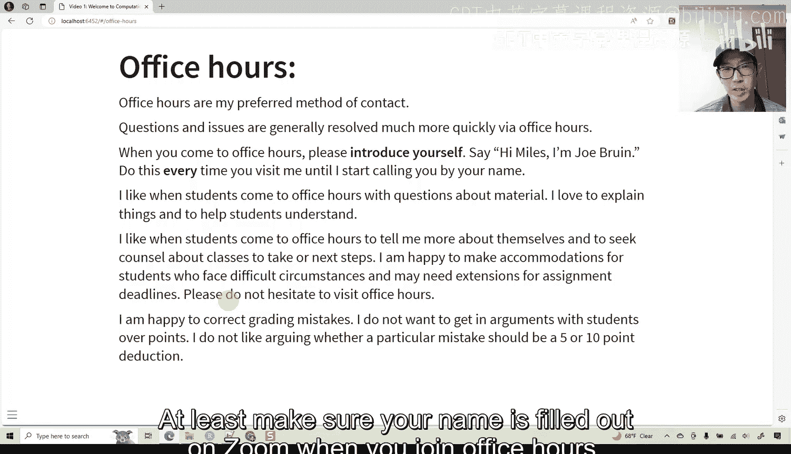

以下是本课程的评分构成。我将为发布的视频设置小测验，这会计入你的成绩。此外，还有作业、期中考试和期末考试。同时，你们需要参与Campus Wire论坛的讨论，你们应该会收到加入该论坛的邀请。

作业是成绩中占比最重的部分，这反映了我认为作业可能是本课程中最重要的环节。

我采用直线评分标准，不进行分数曲线调整。请查阅大纲了解具体细节。

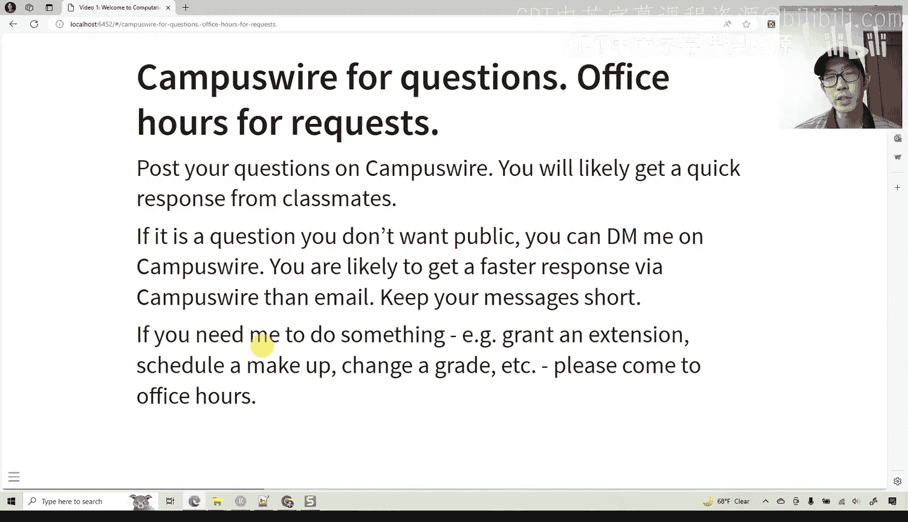

## 视频测验与作业提交 📝

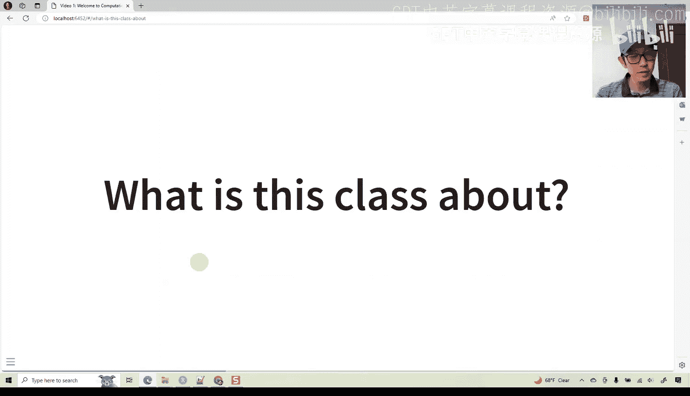

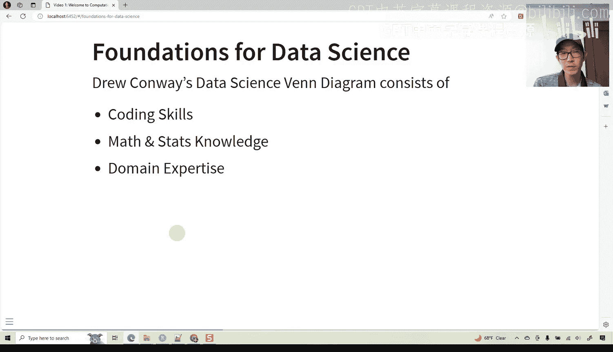

如前所述，视频将伴随简短的测验。请务必完成测验以获得学分，并像对待测验一样对待它们，不要分享答案。如果你观看了视频，应该能够回答这些问题。

关于作业提交，你们需要将作业“编织”成PDF格式。作业将以R Markdown文件的形式发布，你们需要完成它们，将其编织为PDF，然后上传到GradeScope。上传时正确标记页码至关重要，如果标记不正确，我们将无法看到输出结果。

## 办公时间与沟通方式 💬

我每周会安排几次办公时间，这是我首选的沟通联系方式。你们可以给我发邮件，但我回复邮件较慢，这不是我最快的沟通方式。因此，如果需要联系，请优先考虑参加办公时间。如果需要私下会面，我可以在Zoom上设置分组讨论室。我很乐意纠正任何错误。请确保在加入办公时间时，在Zoom上填写好你的名字。

关于作业的问题，可以在办公时间提问，我很乐意提供帮助。但如果你在Campus Wire论坛上发帖，可能会从同学那里得到更快的回复。Campus Wire是一个讨论论坛，我要求你们参与其中。如果遇到私人问题，可以参加办公时间，也可以在Campus Wire上直接给我发消息。

无论是邮件还是其他信息，请尽量保持简短。例如，如果你需要作业延期，只需简单说明“我遇到了一些个人问题，可以申请作业延期吗？”。如果需要更多细节，我会询问。大多数情况下，作业延期我通常会批准三天（72小时）。如果需要更长时间或安排补考，建议为此类请求参加办公时间。如果是关于作业的具体问题，例如“我在作业上卡住了，不太知道如何入手”，那么Campus Wire是更适合的地方。

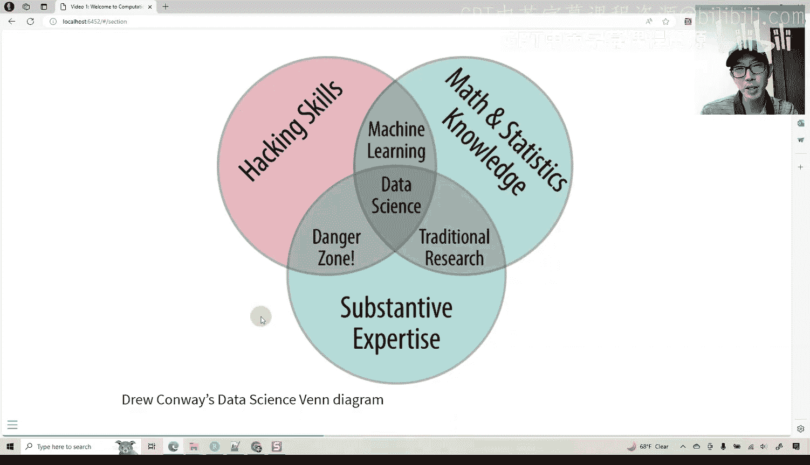

## 课程目标与数据科学基础 🎯

现在，让我们谈谈这门课的内容。这是Stats 102A，标题是《使用R的计算统计学导论》。我喜欢将其视为数据科学的基础课程。

数据科学通常被认为由三个不同部分组成。Drew Conway创建了这个数据科学的维恩图，将其分解为编码技能、数学与统计知识以及领域专业知识。

在这个时代，我们的数据集如此庞大，以至于除了使用计算机，我们无法以任何其他方式与之交互。很多时候，数据集已经超出了Excel等传统工具能高效处理的范围。因此，你必须使用像R或Python这样的编程语言进行编码。你需要对编码有一定的熟悉度。

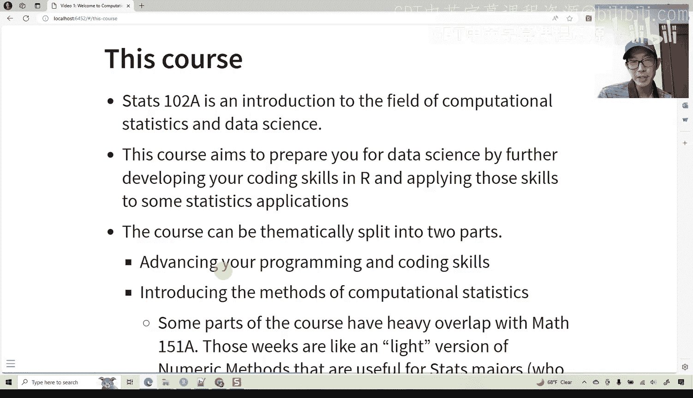

我们将编码能力与数学和统计知识相结合。你们在统计100系列课程（如Stats 100A和100B）中获得了大量的数学和统计基础。这些课程提供了必要的理论基础，确保你理解这些思想的来源。将编码能力与这些基础数学和统计知识相结合，我们可能称之为机器学习，即应用算法从数据中学习的能力。

另一个要素是实质性专业知识，即主题领域的专业知识。这基本上是你将要进行数据分析或数据科学的任何领域。如果你想分析棒球数据，你需要成为棒球专家；如果你想进行医疗诊断，例如查看肾脏患者的数据，你应该了解这些数字的含义。如果你对这些数字一无所知，你的数据分析就不可能真正有用。你必须成为该主题领域的专家。

作为统计与数据科学或数据理论专业的学生，我们无法提供这种实质性专业知识，因为学科领域太多。这真的取决于你自己，在你想要进行数据分析的任何主题上成为专家。然后，将我们教授的编码技能、数学和统计知识应用到你感兴趣的任何主题上，你就能进行数据科学工作。

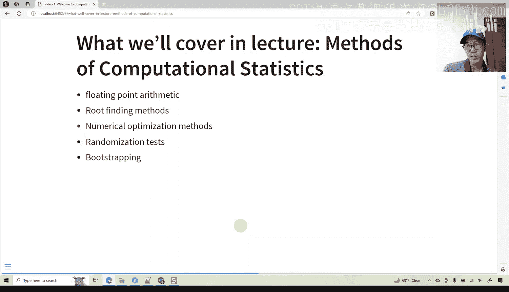

传统研究是将你的主题专业知识应用于传统或经典的数学和统计知识。而编码技能与实质性专业知识的结合，Drew Conway称之为“危险区”，因为如果你没有数学和统计基础，可能会以不恰当的方式应用分析工具和方法，拼凑出一些结果，但可能做出了本不该做的假设。

## 课程结构与主题 📖

就本课程而言，我认为这是对计算统计学和数据科学领域的一个入门介绍。课程旨在通过培养你在R中的编码技能，为你从事数据科学做好准备。然后，我们将把这些技能应用到一些统计应用中。

从主题上，我们可以将课程分为两部分。前半部分将更多涉及R的中高级编程。你们所有人都上过先修课程Stats 20，在那里学习了R编程入门。我们将在此基础上进行扩展。其中一些内容会是复习，一些内容则会深入探讨一些细节方面。我们可能还会通过额外的包（如正则表达式和网络爬虫）来扩展，因为这些在数据收集或清理等方面很重要。

之后，我们还将介绍一些计算统计学的方法。在课程的后半部分，当我们研究这些计算方法时，与另一门名为Math 151A（数值方法）的课程有相当多的重叠。你可以将我们在本课程中学习数值方法的那些周，视为Math 151A的简化轻量版。如果你已经或将要学习Math 151A，你当然会获得更深入的内容，但这对于统计和数据科学专业的学生不是必需的。不过，学习一些数值方法很重要。

## 编程与计算主题 🔧

以下是我们将涵盖的一些关于编程和编码的主题：
*   我们将学习一些数据结构以及子集选取。
*   流程控制，例如条件语句和循环等。
*   函数、作用域和环境。
*   我们还将学习tidyverse中的一些内容，如`tidyR`和`dplyr`，我认为这些是非常重要且有用的包。
*   正则表达式和面向对象编程。

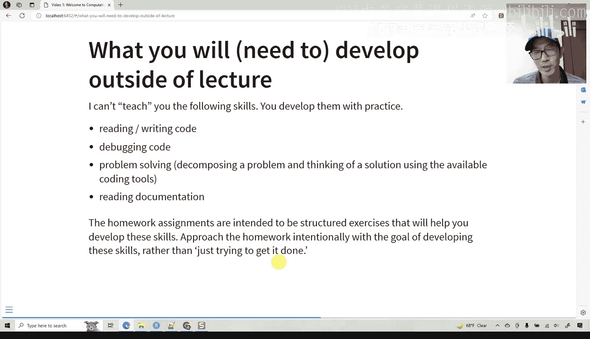

我认为这些都是相当有用的主题，也是我选择重点关注的。就计算统计学方法而言，我们将讨论浮点运算。理解计算机存储和处理数字的方式并非实数，这一点很重要。浮点数试图模仿实数，但它们肯定不相同。因此，这会产生某些影响，我们将讨论这些。一旦理解了这一点，我们就可以思考数值方法，如求根方法或优化方法。我们还将学习随机化检验和自助法等重采样技术，这些在计算统计学中很有用。

## 培养关键技能 🧠

然而，我在课堂上能教的内容是有限的。其余真正重要的东西需要你们自己培养，这些是我无法教授的。我将通过视频向你们展示内容，但像阅读和编写代码的能力，必须通过自己练习来培养。我将通过作业来鼓励这一点，你们必须在作业中读写代码，但这是你们自己需要负责培养的。

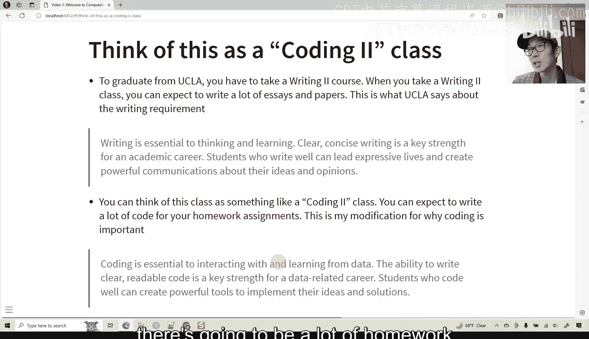

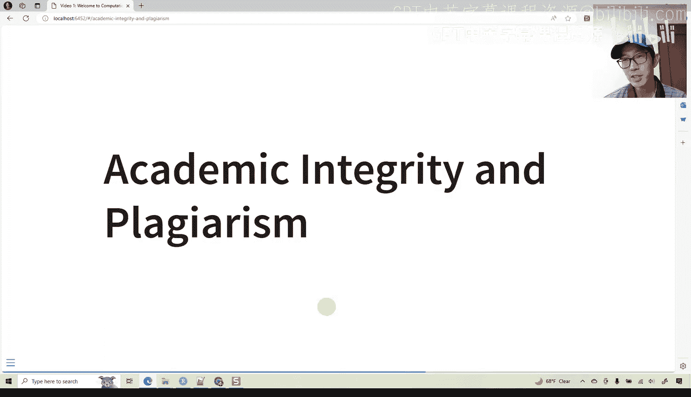

另一个重要方面是调试代码。编写代码时，你肯定会犯错误。要成为一名高效的程序员或编码员，你需要能够调试代码，能够通读自己的代码，理解错误可能发生的位置，找出并修复它。问题解决是指如何将一个复杂的程序分解成可以解决的小部分。如何分解问题，并使用可用的工具或解决方案来解决它？此外，阅读文档也很重要。我在课堂上能教的内容有限。最终，你必然会遇到我从未提及或你从未见过的函数。学习使用它们的方法是阅读这些函数、包或模块的相关文档。你未来的成功在很大程度上取决于你阅读和理解文档的能力。这些都是你们需要在课外自己努力的事情，是我无法仅通过视频传授的。

观看视频是一种非常被动的行为，你只是坐在那里听我讲，看屏幕上的东西。我认为很多技能的培养需要你积极尝试参与作业，主动运用大脑中需要思考这些问题的部分。我会布置相当多的作业，它们篇幅长且具有挑战性。这些作业旨在成为结构化的练习，帮助你培养这些技能。当你处理作业时，我希望你以培养这些技能为目标，有意识地对待它们，而不是仅仅试图完成作业。如果你把一切都当作“我只需要完成它”，我认为你会错过发展和练习的机会。

## 编码能力的重要性 ✍️

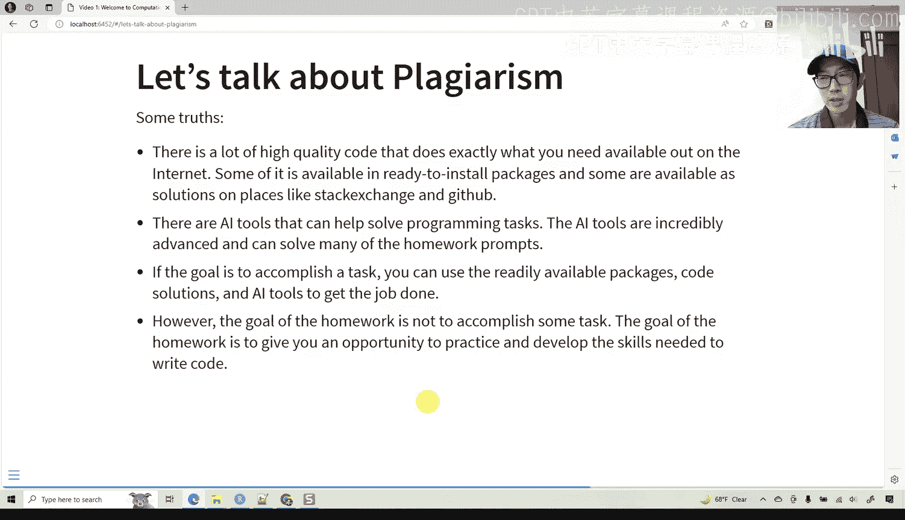

我喜欢把这门课看作一门“编码II”课程。为了从UCLA毕业，你必须满足所谓的“写作II”要求。你必须上一门课程，比如历史课，满足写作II课程的要求，你需要写论文和文章等。UCLA要求这样做，是因为写作和表达思想的能力很重要。因此，每个从UCLA毕业的学生都必须满足这个要求。虽然没有编码要求，但如果你要以统计学和数据科学或数据理论专业毕业，能够将想法转化为代码将非常重要。

因此，我喜欢把这门课看作一门“编码II”课程，我借鉴了UCLA对写作要求的理由，即编码对于与数据交互和从数据中学习至关重要，编写清晰、可读代码的能力将是任何数据相关职业的关键优势。编码能力强的学生可以创建强大的工具来实现想法和解决方案。所以，把这门课看作一门“编码II”课程，将会有很多需要编写大量代码的作业，这是有意为之的。

## 学术诚信与剽窃 ⚖️

这让我想谈谈学术诚信和剽窃问题。事实是，有很多工具可以让你非常容易地获得我布置的任何作业的答案。互联网上有很多高质量的代码，完全满足你的需求，如果你稍加搜索，就能找到这些解决方案。我们还有AI工具，如ChatGPT和GitHub Copilot等。这些工具非常出色，其中很多都经过代码训练。如果你问它们“如何解决这个问题”，你甚至可以直接复制粘贴一些作业提示，放入聊天机器人，它会为你写出解决方案。

如果你的工作只是完成任务，这些工具是很大的帮助，它们会帮助你完成任务。但这不是我布置作业的目的。例如，我可能会布置一个作业，要求你在R中编写“蛇梯棋”游戏。我实际上并不需要一个能运行的“蛇梯棋”游戏，那不是重点。我不是一家说“嘿，我们需要这个产品准备就绪”的公司。我布置这个作业给你的原因，是因为你思考的过程、你找到解决方案并创建和理解它的过程，将帮助你培养作为编码员的技能。

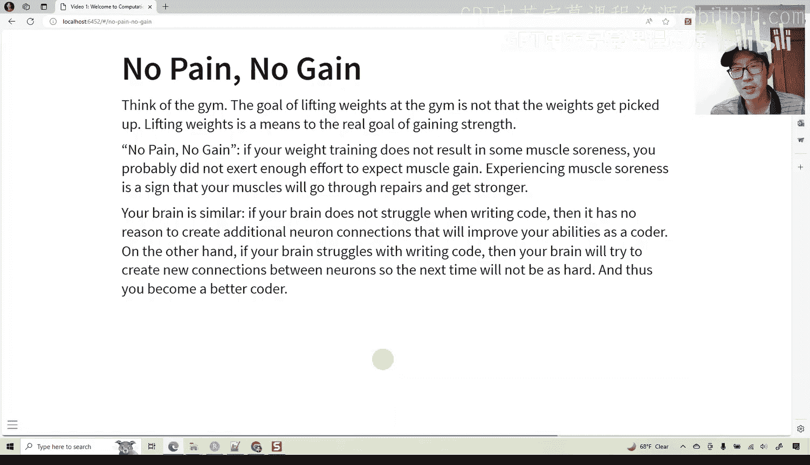

你可以把它想象成去健身房。当你去健身房举重时，举重的目标不是把重物从地上举起来。举重的整个过程是为了帮助你达到增强力量的真正目标。有一个概念叫“没有痛苦，就没有收获”。如果你进行重量训练，举重时没有挑战自己，只举一磅的重量，说“嘿，这很容易”，不让自己感到疲劳，你就不能指望有任何收获。如果你不举任何对你来说重的东西，你就不会变得更强壮。所以，如果你想在健身房变得更强壮，你必须举起对你来说困难的东西，体验肌肉酸痛，然后在休息和睡眠时，你的身体会重建得更强壮。同样，你的大脑也需要受到挑战。如果你的大脑在编写代码时完全没有挣扎，那么你的大脑就没有理由建立那些能提高你编码能力的额外神经连接。另一方面，如果你面临挑战，你的大脑努力思考解决方案，当你第一次看到这个问题，思考它很困难，你的大脑努力工作并因此感到疲劳，那么当你睡觉时，你的大脑会说“嘿，这挺难的，我们能建立新的连接吗？”。当它建立了新的连接，它就能更好地找出解决方案。这就是那种“豁然开朗”的感觉，你能够更好地理解主题，因为你的大脑形成了一些新的连接，当再次面对这个任务时，它就能做到。这就是你成为更好编码员的方式。

因此，如果你求助于ChatGPT或类似工具，或者剽窃他人的代码，就像去健身房让一个更强壮的人或机器人帮你把重物从地上举起来。如果目标是举起重物，那很好，但这不是举重的目标。举重的目标是增强力量，让你自己去做。同样，复制粘贴别人的代码或AI的代码，如果目标是完成一项编码任务，那是可行的，但这不会帮助你提高编码技能。

我真诚地呼吁你们内心学习和成为更好编码员、更好地进入市场的愿望。我呼吁这种愿望，所以你们不要只是求助于AI或抄袭他人的代码。同样，如果你去健身房说“哦，这些重物太重了，你能帮我举起来吗？”，然后一个强壮的人帮你举起来，你拍手说“哦，太好了，我们进行了一次很棒的锻炼”，这完全违背了初衷。让别人（无论是真人还是AI工具）为你完成作业，以这种方式完成作业不会对你有帮助。我希望你经历挣扎，挑战自己，以这种方式进步。

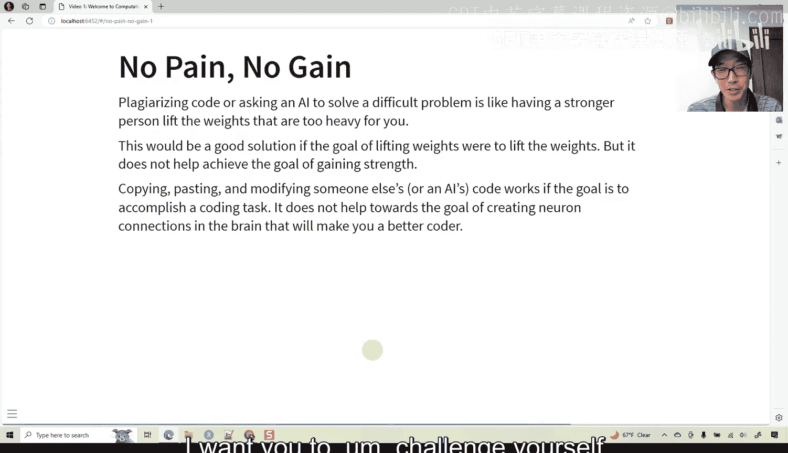

## 关于努力与诚信的呼吁 🤝

我认为学生之所以剽窃，有时是因为他们混淆了课程的目标。我认为剽窃的学生相信，为了完成作业而完成作业、避免得低分比学习的目标更重要。但这不是正确的处理方式。课程的目标是你们的学习。现在存在一个冲突问题，我无法创建能精确评估每个学生在课程期间学习多少的个性化评分方案，每个人都必须按照相同的标准评分。

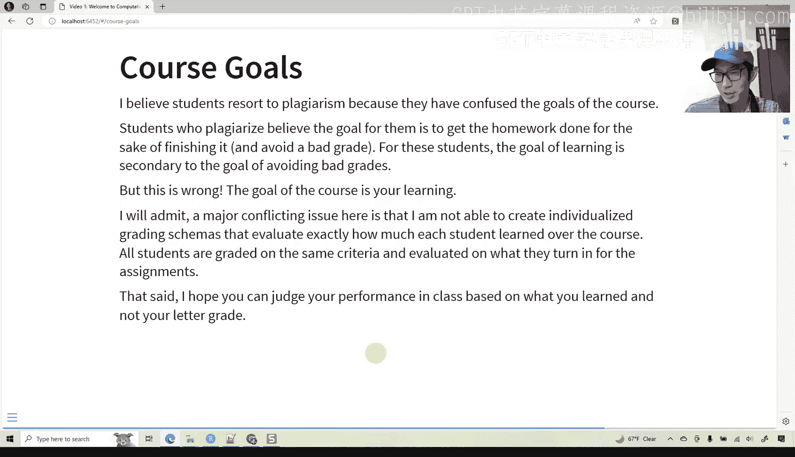

尽管如此，我希望你们能根据所学来评判自己在课程中的表现，而不是字母成绩。如果你觉得自己学到了很多，我希望你能说那是成功的。

当你面对具有挑战性的作业时，我希望你付出真诚的努力。我希望你不要在网上寻找解决方案，或使用AI工具或他人的代码。如果截止日期到了，你无法完成作业要求的所有内容，那就提交你能完成的部分。这可能意味着你不会在作业上得到100分。作业是根据正确性评分的，不仅仅是完成，实际完成并正确完成很重要。因此，如果你编写的作业不能正常工作，你会被扣分。但我希望你对此能够接受，并将其视为你仍需努力和实践的领域，而不是你编码能力的失败。如果情况严重，我们会认真对待剽窃问题，必要时会升级到学生院长办公室处理。但我对你们的呼吁是，在作业中保持诚实。

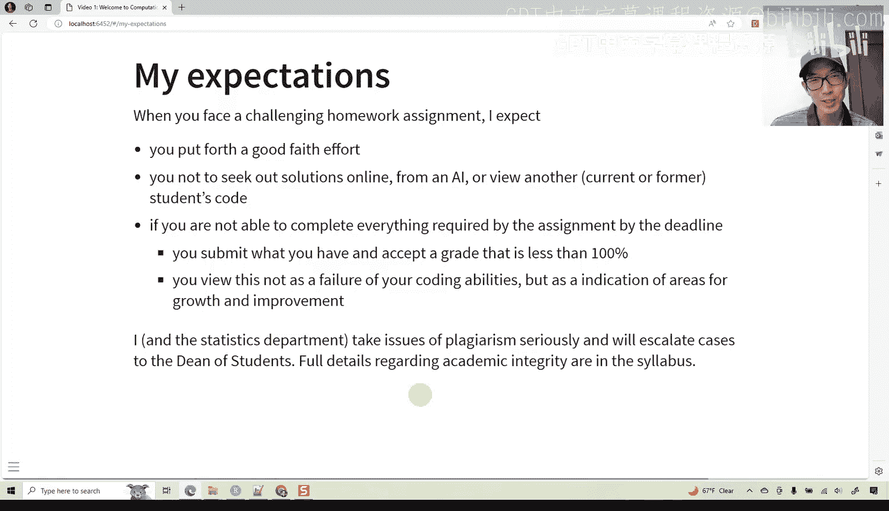

## 合作政策 📄

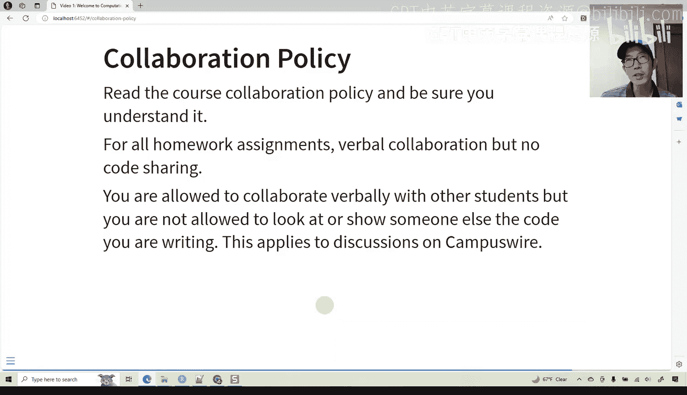

有一项合作政策。作业零是阅读大纲并签署合作政策。基本上，当涉及到Campus Wire讨论论坛，甚至只是与同学和朋友交谈时，你们可以互相讨论，但不能分享实际的代码。你们可以与其他学生进行口头协作，但不能向他人展示你的代码或查看他人的代码。例如，你可以回答“你是如何解决第二题的？”，有很多内容你可以在不写出代码的情况下回答。你可以写“我创建了一个for循环，在每次迭代中，我做了这个，我子集了向量X”等等，而不是“这是我写的用来解决问题的代码”。你不能要求别人为你调试代码或检查你的工作。同样，你不能说“我能看看你是怎么做的第二题吗？来检查一下我的工作”。如果你展示了代码，那将是违规行为。

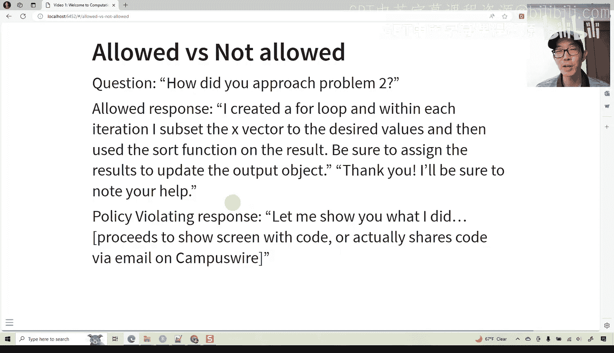

有时你会遇到错误信息。你可以复制粘贴错误信息，错误信息中包含大量信息，可以帮助你找出问题所在。所以，阅读文档以及阅读和理解错误信息很重要。当你遇到错误信息时，可以复制粘贴你的错误信息，但不要复制粘贴你的代码。

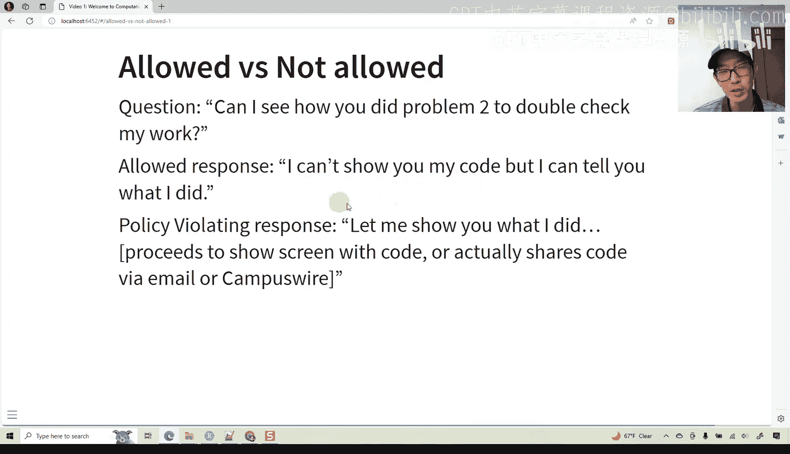

至于课堂上出现的其他代码，你们可以讨论。在Campus Wire上，如果某张幻灯片上有代码，你不太理解代码中发生了什么，可以复制它并放到你的Campus Wire帖子中说“嘿，这一行是怎么回事？”，这没问题，我同意。但至于作业和作业问题，请不要复制粘贴你的代码。

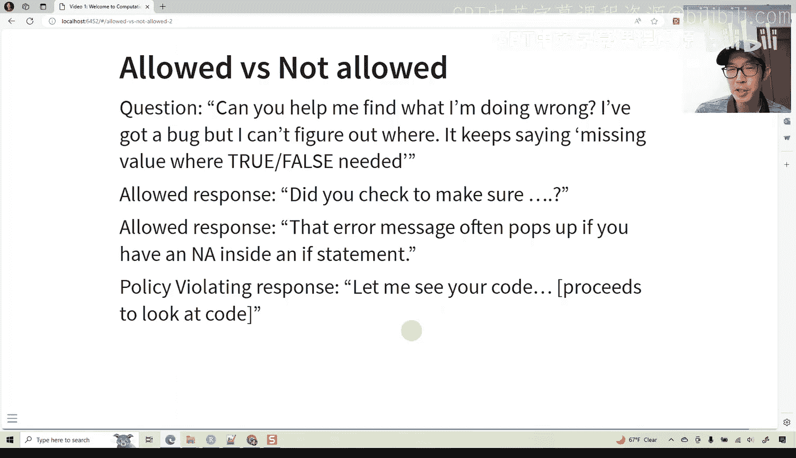

## 总结 📋

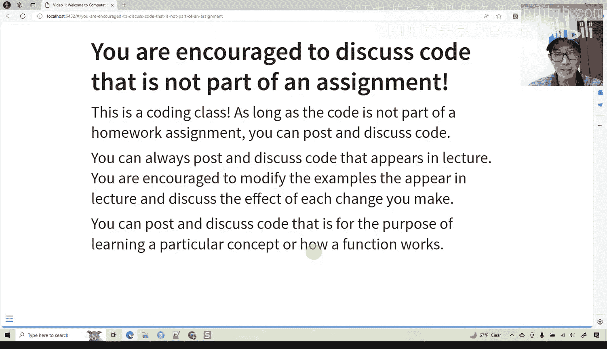

本节课中，我们一起学习了Stats 102A课程的基本框架。我们介绍了课程概述、评分标准、作业提交方式以及沟通渠道。我们探讨了课程的核心目标，即作为数据科学的基础，融合编码技能与统计知识。课程将分为R编程提升和计算统计学方法应用两大部分。我们强调了通过实践作业来自主培养阅读、编写、调试代码及解决问题能力的重要性。最后，我们深入讨论了学术诚信问题，呼吁大家重视学习过程本身，通过真诚努力和挑战自我来获得真正的进步，并明确了合作政策的具体界限。