# 02：成绩与生活平衡 🧭

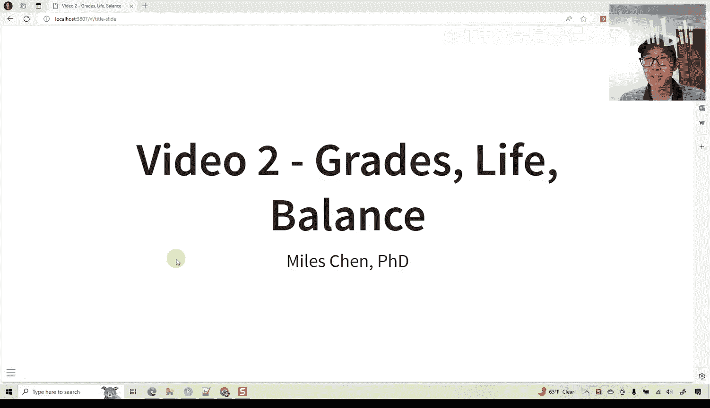

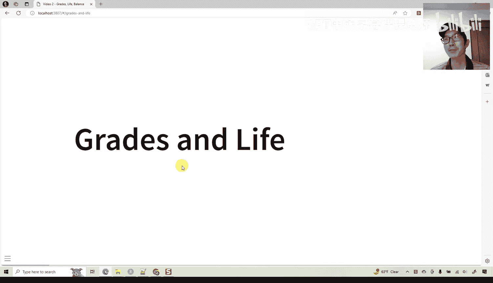

在本节课中，我们将探讨一个超越技术本身的重要话题：如何看待学业成绩，以及如何在学业、人际关系和个人健康之间找到平衡。我们将分享一些个人见解，帮助你建立更健康的学习和生活观念。

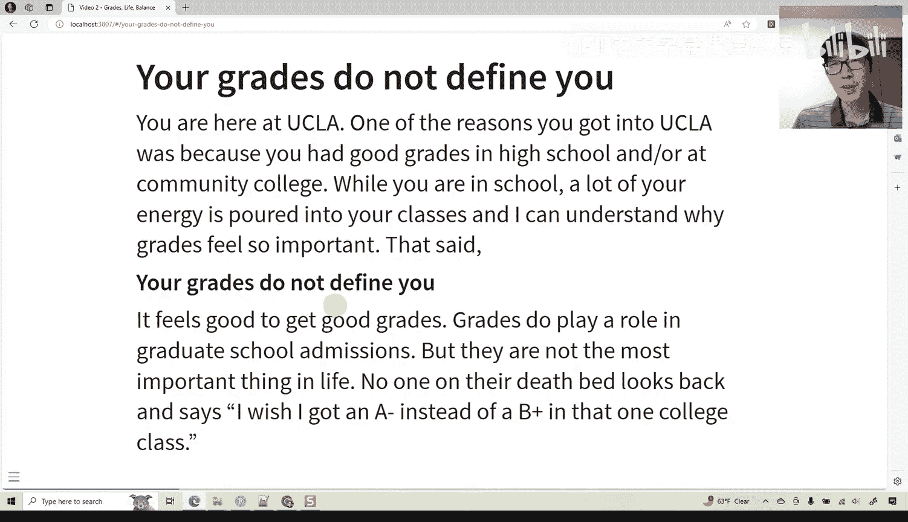

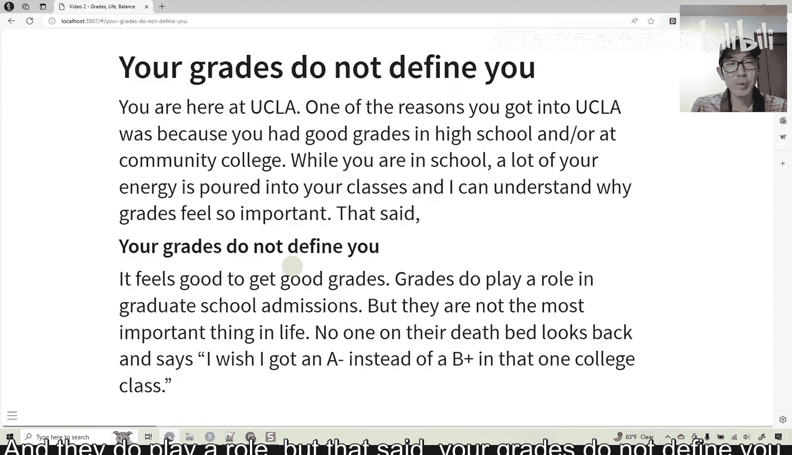

## 成绩不代表你的全部价值 💯

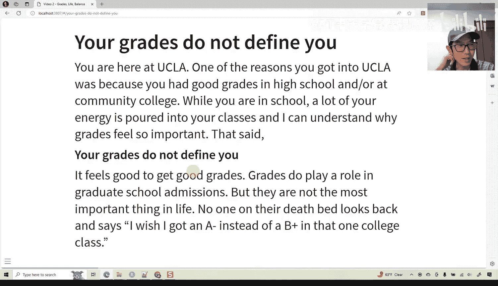

上一节我们介绍了课程的基本信息，本节中我们来看看如何正确看待成绩。

成绩很重要，但它们并不能定义你。进入UCLA这样的大学，很大程度上是因为你在高中或社区大学取得了好成绩。在大学里，你将大量精力投入到学习和作业中，因此成绩显得格外重要。

它们确实在某些方面发挥作用，例如研究生院的申请。但必须记住，成绩不是生活中最重要的事情。没有人会在回顾人生时说：“我真后悔当时没拿到A-，而是拿了B+。”这不会成为人们后悔的事情。

## 一个关于成绩与身份认同的故事 📖

我想分享一个我个人的故事。高中时我努力学习，取得了好成绩，并作为高年级学生被梦想的学校加州理工学院录取。我梦想成为火箭科学家，为NASA工作。收到录取通知书时，我欣喜若狂，觉得所有努力都得到了回报。

然而，进入加州理工学院后，学习异常艰难。秋季学期，我得到了人生中第一个C。冬季学期，我得到了第一个D。到了春季学期，情况变得更糟，我挂掉了多门课程，被处以留校察看。学校告知，如果秋季返校，必须达到一定的GPA要求。我感到绝望，认为自己无法做到，并陷入了抑郁。

问题的根源在于，在那之前，我将太多的个人价值和身份认同与学业成就绑定在一起。我觉得自己不是体育明星、不常参加社交活动都没关系，因为我有好成绩，这就是我作为人的价值所在。这在高中成绩好时没问题，但当大一失去好成绩、只剩下坏成绩时，我开始怀疑：如果我的价值来自成绩，而我没有成绩，那我的价值是什么？这种想法让整个情况雪上加霜。

我感激我的父母，尤其是我的父亲，在那段时间给予了我极大的支持。他基本上是说，这个梦想（去加州理工）不值得以牺牲我的个人和心理健康为代价。最终我选择了退学，转学到了密歇根州的一所小型工程学院——凯特林大学，并在那里完成了本科学位。

我感激这段痛苦的经历，因为它迫使我将自我认同与成绩分离开来。我作为一个人，其价值在于我是谁，而不在于我的成绩。如今，我不再从个人成就或职业成功中寻找价值，而是从我的信仰、与他人的关系中寻找内在价值。对我而言，这是一次被迫放弃我所珍视之物的痛苦经历，但它让我迈出了这一步。

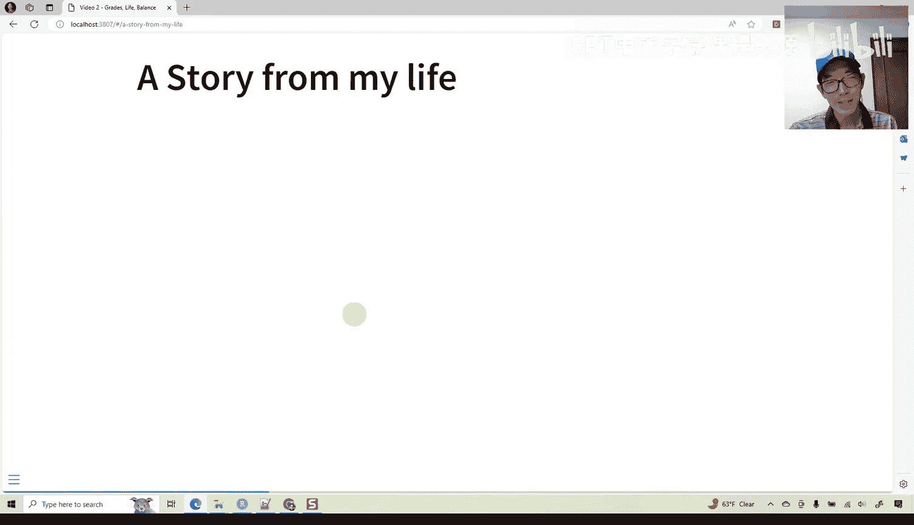

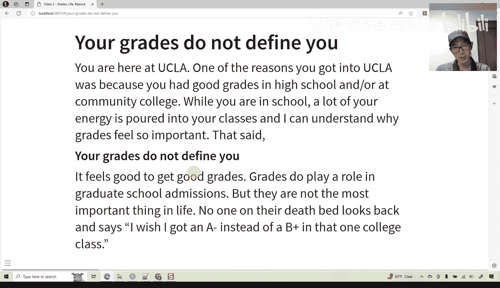

我分享这个故事，是希望你们不必经历同样的痛苦，但能够退一步认识到：你的生活、你这个人，不由你的成绩定义。未来，你作为人的价值也不由你的职业、头衔或收入定义。你作为一个人，其价值远超过这些东西所能衡量的。我想让你们知道，我理解取得好成绩的感觉很好，因为我曾是那个喜欢取得好成绩的人。但同样，你们的成绩不代表你们。

## 工作与生活的平衡 ⚖️

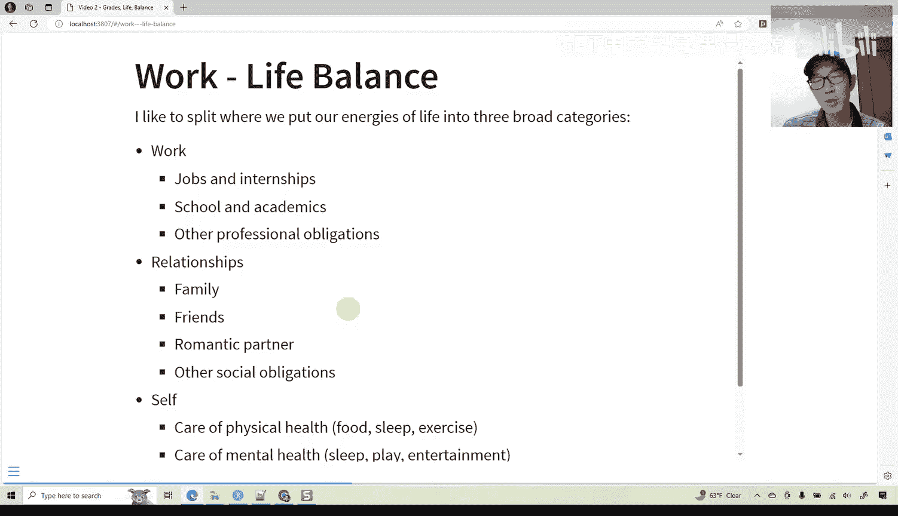

接下来，我们谈谈工作与生活的平衡。我们可以把精力投入到几个主要领域，我认为大致可以分为三类：工作、人际关系和自我。

以下是这三个领域的简要说明：
*   **工作**：包括实际的工作、实习等。对你们大多数人来说，目前“工作”主要指学业和学术活动，或其他任何职业义务。
*   **人际关系**：包括与家人、朋友的关系，或浪漫伴侣关系，以及其他社交义务。有些俱乐部活动可能同时属于人际关系和工作范畴。
*   **自我**：你必须照顾好自己。这包括照顾你的身体健康（如饮食、睡眠、锻炼）、心理健康（包括睡眠、娱乐、做能带来快乐的事），如果你是宗教或灵性人士，还包括照顾你的灵性健康。

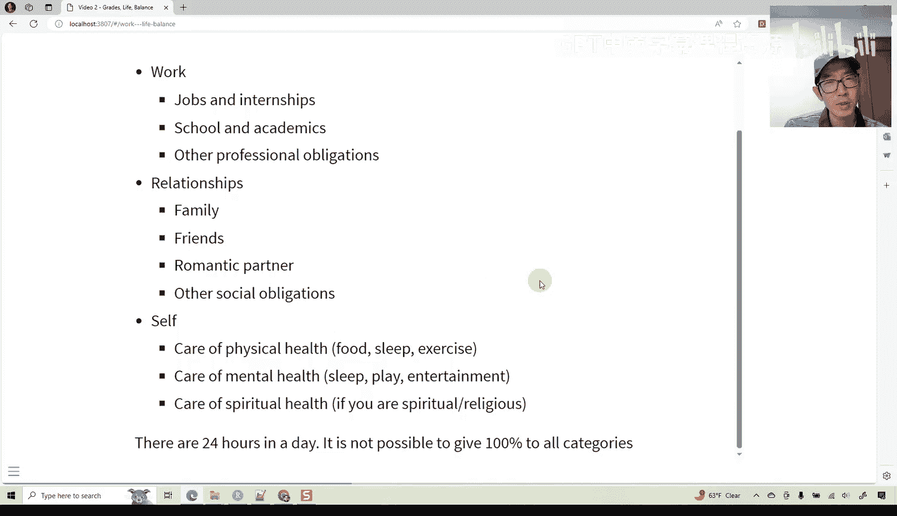

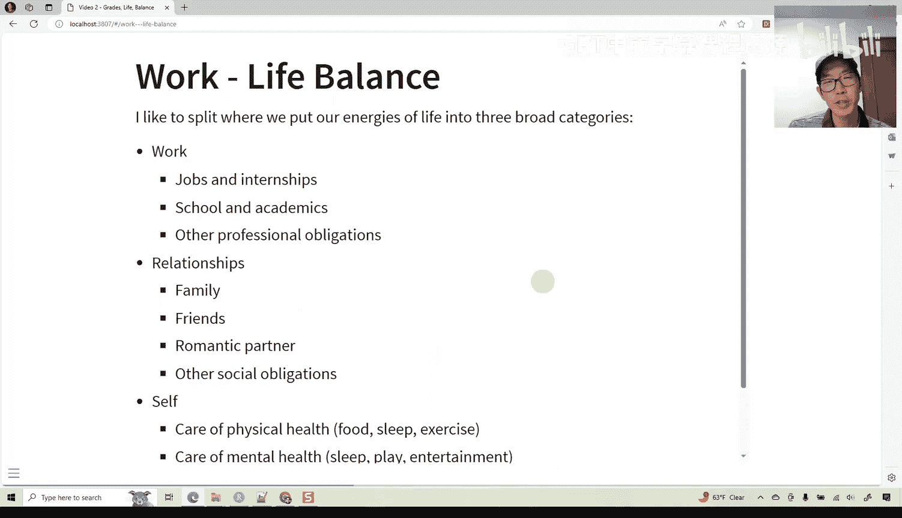

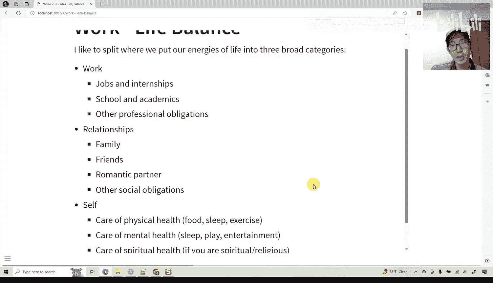

一天只有24小时，不可能在每个类别都投入100%的精力。因此，你需要决定和选择如何分配你的时间。

我相信，良好的工作生活平衡是通过有意识地决定什么对你重要，并相应地投入时间和精力来实现的。一般来说，你在某件事上投入越多，收获就越多；投入越少，收获就越少。我认为，通过接受你投入时间较少、优先级较低的事情自然无法蓬勃发展的后果，你可以在生活中找到满足感。

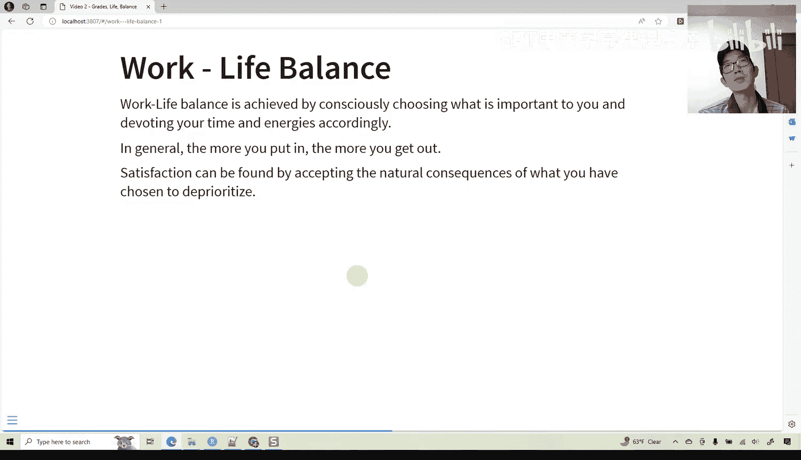

## 平衡选择的例子与心态 🤔

这是一个有点傻的例子。假设你有一个朋友圈子。有一天，你开始了一段浪漫关系，于是你选择将大量时间和精力投入到伴侣身上。因为你花了很多时间与伴侣相处，这段关系会蓬勃发展。但同时，你与原来那群朋友相处的时间变少了，自然就会与他们变得有些疏远。

有时，当你意识到并看到这种疏远开始时，可能会感觉有些敌意。但这不一定是因为你的朋友对你谈恋爱感到生气，这只是你花在他们身上的时间减少的自然结果。我认为他们不一定是在“报复”你谈恋爱，这只是你与某人相处时间减少时自然会发生的事情。

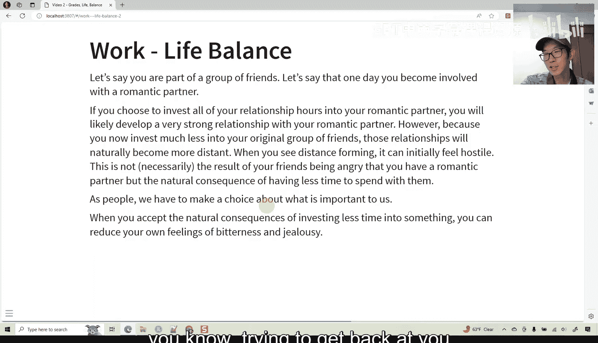

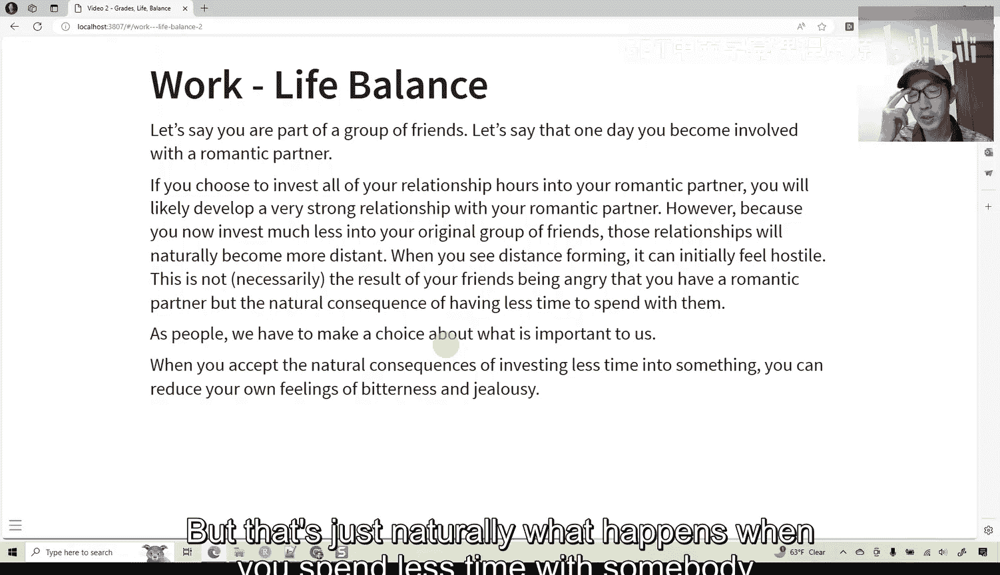

你个人有权选择什么对你重要。我认为正确的态度是：嘿，我最近花了很多时间和我的伴侣在一起，现在我们的关系很好，这部分生活正在绽放。至于友谊，我很感激，但我也能接受我们不如以前亲密的事实。当你花更多时间与一个人相处，而减少与其他人相处的时间时，这自然会发生。

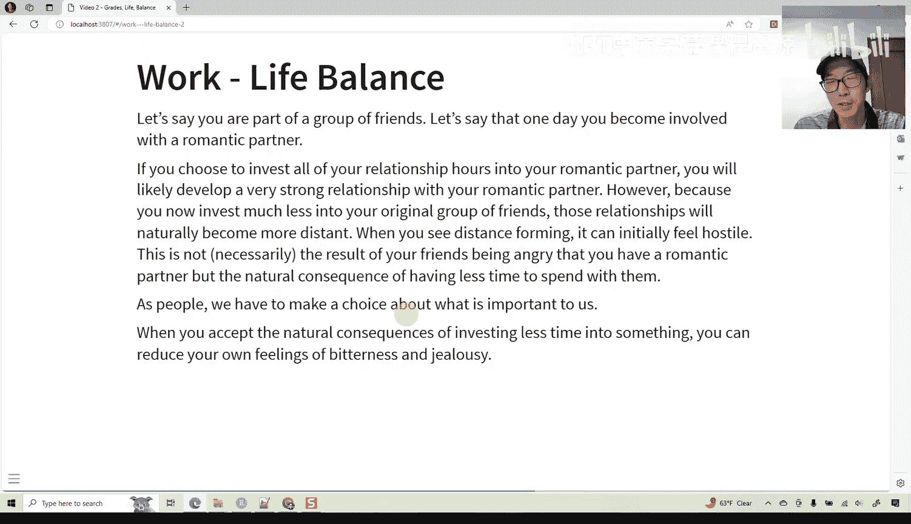

所以，当你能接受在某个方面投入较少时间所带来的自然结果时，我认为你可以减少自己的苦涩和嫉妒感，找到满足。

另一个例子是，当你开始工作时，会遇到各种各样的人。有些人会将大量时间和精力投入到公司目标中。当这种情况发生时，公司不一定是在惩罚那些有工作之外生活（如家庭、朋友）的人，但很自然地，从公司或管理者的角度来看，他们应该提拔谁？是提拔那个完成要求工作后还继续留下来做更多事的人，还是提拔那个完成要求工作后立即离开去陪伴家人、朋友或伴侣的人？从这个角度看，奖励留下来做更多事的人是合理的。

但这同样不是对有工作之外生活的人的惩罚。这只是你选择什么对你重要。如果你处于认为在公司内晋升非常重要的阶段，那么你应该相应地投入时间，努力晋升。但另一方面，在此期间，你的家庭、朋友或浪漫关系可能不会那么蓬勃发展。反之，如果花时间经营这些关系对你更重要，那么绝对应该相应地投入时间，但同时要认识到，你可能不会像那些把所有额外时间都花在公司的人那样得到那么多奖励。所以，要意识到这一点，认可这一点，并对自己的选择感到满足。

## 自我照顾的重要性与学业权衡 🛌

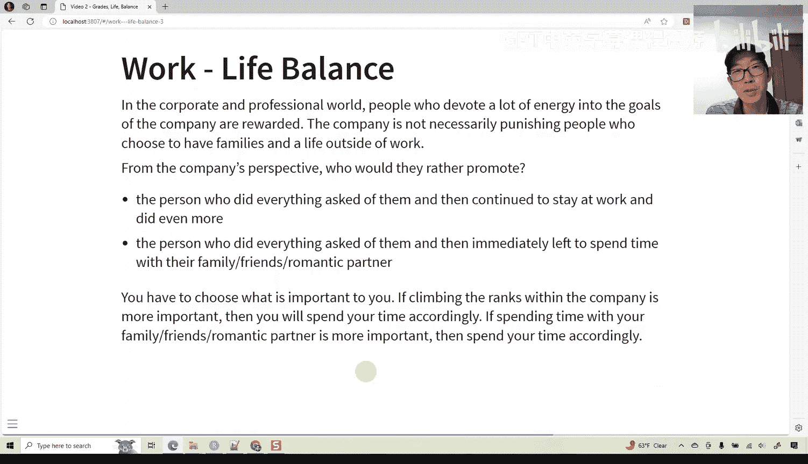

我还想说，照顾好自己也非常重要。如果你不照顾好自己，最终往往会以低于100%的效率运作，生产力也会下降。例如，如果你睡眠不足，可能会脾气暴躁，让人难以相处；或者可能生病，影响身体健康或心理健康。所以，请确保照顾好自己。

我认为统计和数据科学系的许多人都说过，自我照顾很重要，照顾好身心健康很重要。这些不只是我们喜欢说的客套话或空洞的陈词滥调，我们是真心实意的。

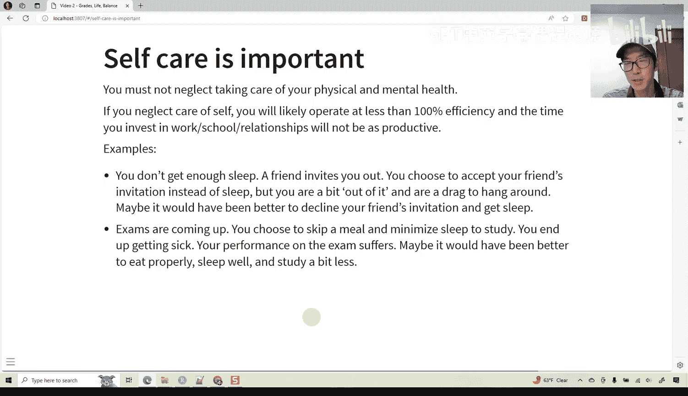

有时这意味着什么，你需要自己判断。但有时，照顾好自己意味着无法100%完成作业。如果生活中有太多事情发生，你只需要休息几天，无法做作业，那就意味着你无法完成作业。其自然结果是你的作业成绩会受到影响。如果你不交作业，你会因为迟交而失分；如果你只做了一半作业，你只能得到一半的分数。这就是会发生的事情。

但我希望你们能达到这样一种境界：能够说，你知道吗？我此刻的心理或身体健康更重要，我想照顾好我的健康，我可以接受我的作业成绩因此受到影响。当你能坦然接受优先考虑自身身心健康而让作业成绩受损这一自然结果时，我认为你可以更愉快地度过这个学期，拥有更多的快乐和更好的健康。

如果情况变得困难，你可以向教授、向我申请延期。有时我会同意，有时我会拒绝，这取决于具体情况。我倾向于更宽容一些，但这不保证我总是会批准你的延期请求。但即使有人不批准，也不意味着你突然就必须被成绩束缚。你总是可以说，嘿，即使这次没有延期，我也想休息一下，我可以接受失去这些分数。我认为这是你有权为自己做出的决定。

## 警惕无益的娱乐 🎮

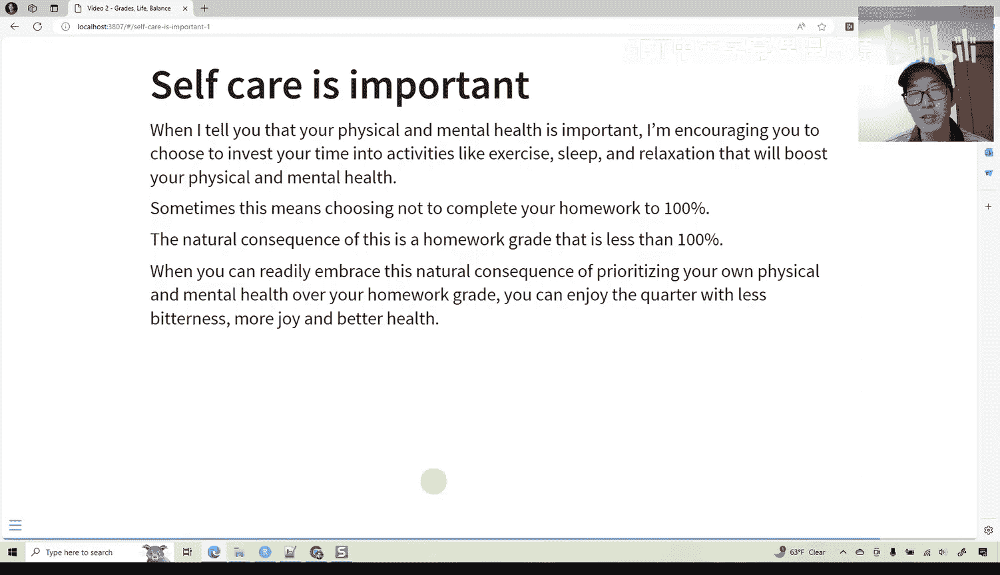

最后我想提一下，要注意我所说的“无益的娱乐”。我喜欢娱乐，喜欢做有趣的活动，我认为这对心理健康非常重要。我喜欢与人相处，看电视，看电影，玩游戏等等。运动、读书、听音乐或播客等，这些都是你可以做的很棒的事情。

当你参与某种娱乐活动时，它应该是工作的休息，应该给你带来快乐和精神能量，以便在需要回归工作时，你心情更好，更享受生活。但是，有些活动，甚至可能与某些人相处，最终可能产生相反的效果，让你感到精疲力竭。也有一些电子游戏、应用程序和社交媒体网站，其设计初衷就是让人上瘾，旨在让你无限滚动。它们给你即时的多巴胺刺激，让你一轮又一轮地玩下去或不停地刷，因为这就是它们赚钱的方式。

你最终可能会在这些应用或网站上花费数小时，结束后却不知道时间去哪了，也没有感觉更好，没有觉得生活更有乐趣。在这些情况下，我认为我们应该保持警惕。我不是说你必须删除社交媒体账户，你可以选择这样做，但不必如此。不过，请务必对你参与的活动类型以及你的时间流向保持警惕和选择性。因为，你不想把生命中的数小时浪费在那些实际上并没有让你对生活更兴奋的事情上。

这就是我想说的全部内容。感谢观看本视频，我们将在下一个视频中开始讨论R语言。

## 总结 📝

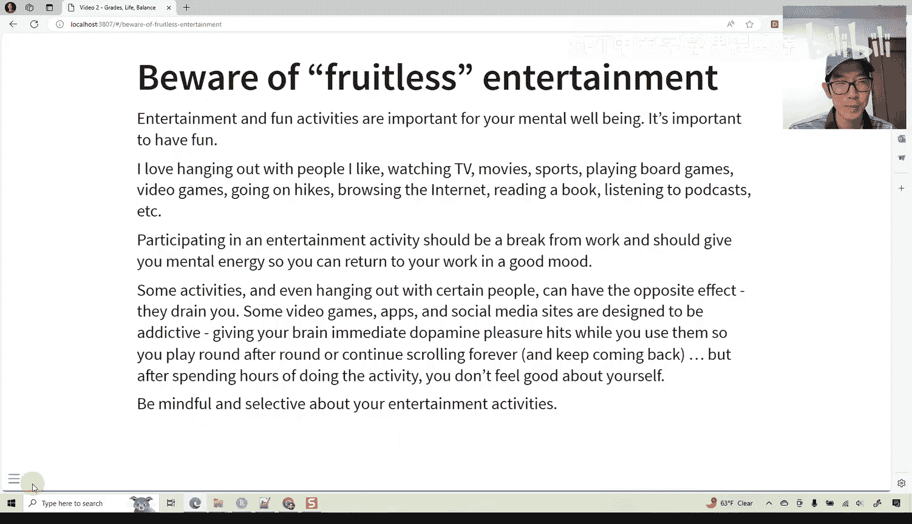

本节课中，我们一起学习了如何正确看待学业成绩，认识到成绩不能定义个人的全部价值。我们还探讨了如何在学业（工作）、人际关系和自我照顾之间找到平衡，强调了有意识选择和接受相应后果的重要性。最后，我们提醒大家要警惕那些消耗精力而非补充能量的“无益的娱乐”。希望这些思考能帮助你在大学及未来的生活中建立更健康、更平衡的视角。