# 04：R语言中的向量 📊

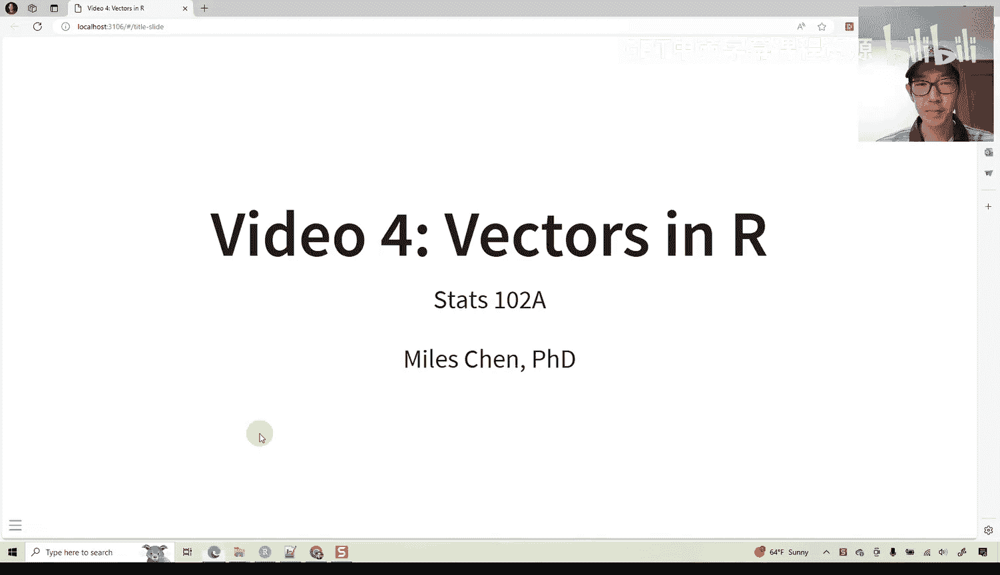

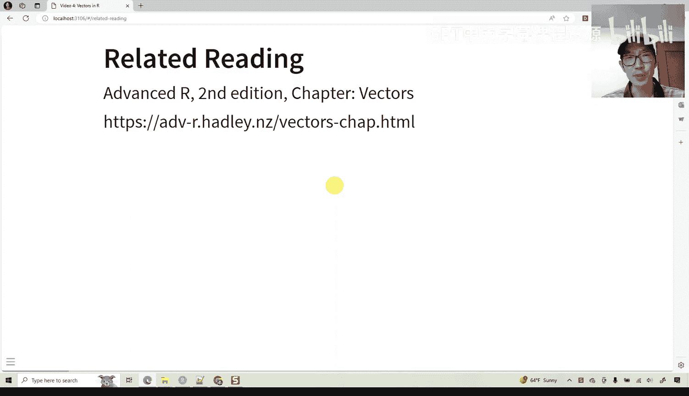

在本节课中，我们将要学习R语言中最核心的数据结构之一：向量。我们将了解向量的两种主要类型、它们的数据类型、自动类型转换（强制转换）的规则，以及如何为向量添加属性和名称。

---

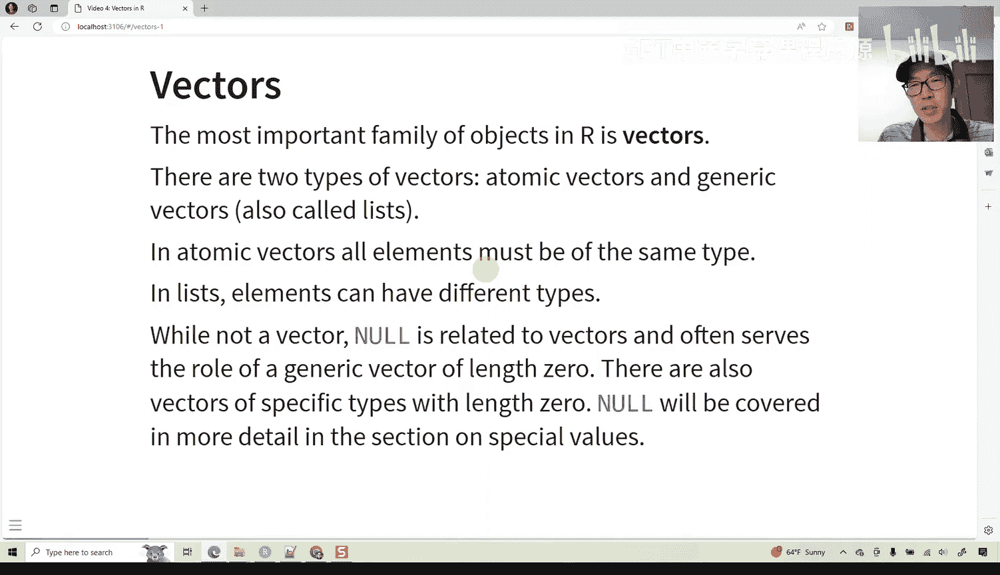

## 原子向量与列表

R语言中最重要的对象家族是向量。我们有两种类型的向量：**原子向量**和**通用向量**（通常称为**列表**）。

在原子向量中，所有元素必须是**相同类型**的，不能混合不同类型的值。而在列表中，可以包含不同类型的对象。

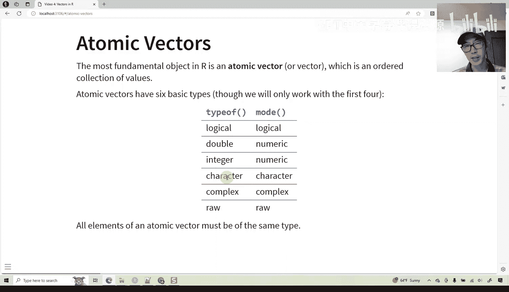

此外，`NULL`是一个特殊值，用于表示不存在的对象或零长度的通用向量。

## 原子向量的类型

原子向量主要有六种类型，其中四种最为常用：

1.  **逻辑型**：用于存储`TRUE`或`FALSE`值（也称为布尔值）。
2.  **数值型**：包含两种子类型：
    *   **双精度型**：用于存储浮点数（带小数点的数字）。
    *   **整型**：用于存储整数。
    *   使用`mode()`函数检查时，两者都返回`"numeric"`。
3.  **字符型**：用于存储字符串。

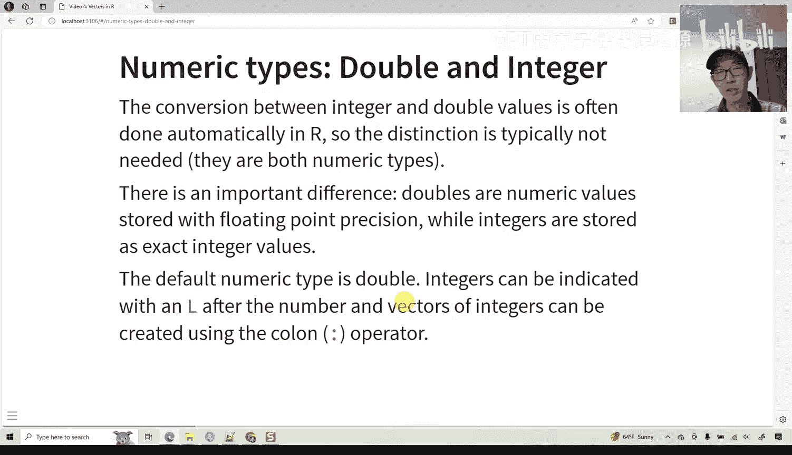

以下是创建和检查类型的示例代码：

```r
# 创建双精度向量
double_vec <- c(1, 2, 3)
typeof(double_vec) # 返回 "double"


# 创建整型向量
int_vec <- c(1L, 2L, 3L) # 使用 L 后缀
typeof(int_vec) # 返回 "integer"

# 使用冒号运算符创建整数序列
seq_vec <- 1:3
typeof(seq_vec) # 返回 "integer"

# 检查类型
is.double(double_vec) # TRUE
is.integer(int_vec)   # TRUE
```

## 强制转换

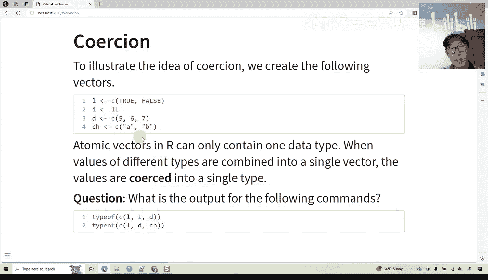

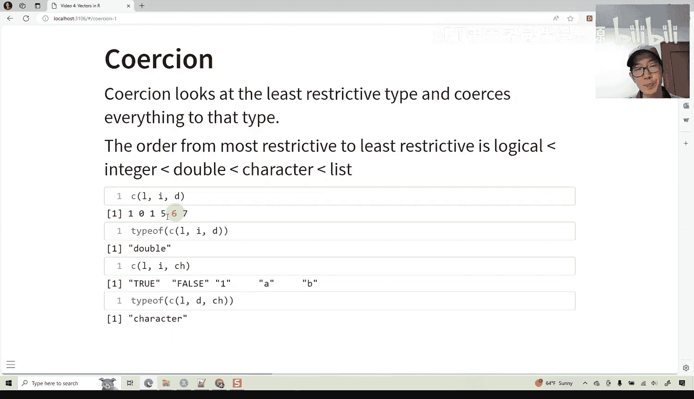

当我们将不同类型的数据组合成一个原子向量时，R会自动进行**强制转换**，将所有元素转换为最不严格（最通用）的类型。

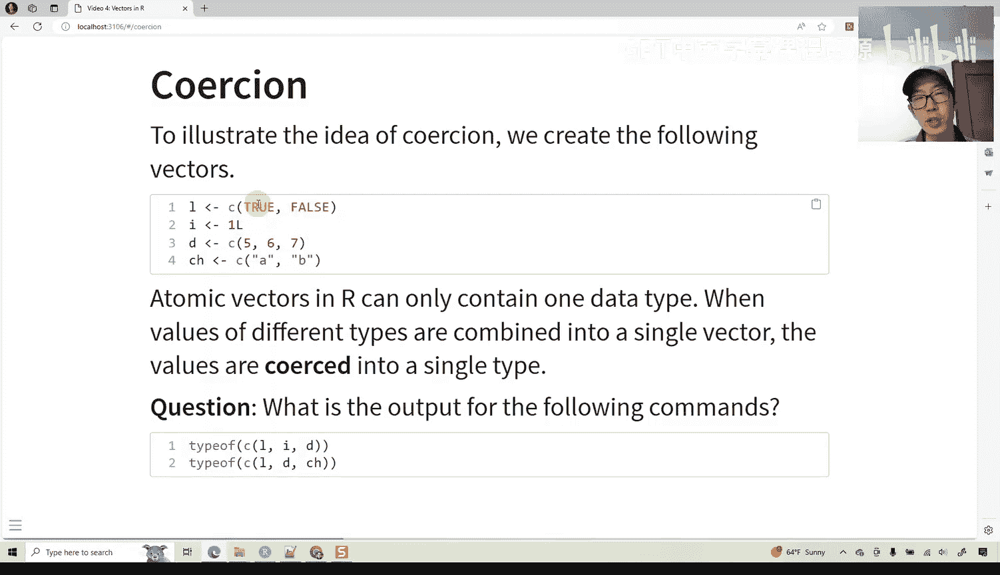

强制转换的优先级顺序为：**逻辑型 < 整型 < 双精度型 < 字符型**。

上一节我们介绍了向量的基本类型，本节中我们来看看当不同类型混合时会发生什么。

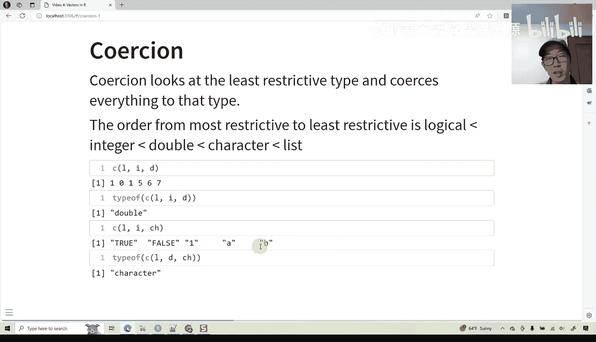

以下是强制转换的示例：

```r
# 逻辑型 + 整型 + 双精度型 -> 双精度型
logical_vec <- c(TRUE, FALSE)
integer_val <- 1L
double_vals <- c(5, 6, 7)
combined_num <- c(logical_vec, integer_val, double_vals)
typeof(combined_num) # "double"
# 结果: 1, 0, 1, 5, 6, 7 (TRUE->1, FALSE->0)

# 逻辑型 + 双精度型 + 字符型 -> 字符型
char_vals <- c("A", "B")
combined_char <- c(logical_vec, double_vals, char_vals)
typeof(combined_char) # "character"
# 结果: "TRUE", "FALSE", "5", "6", "7", "A", "B"
```

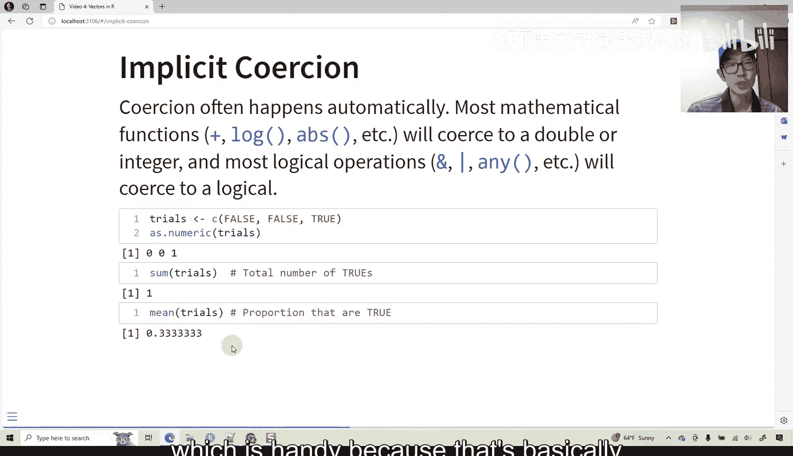

在使用数学或逻辑运算符时，也会发生自动强制转换。


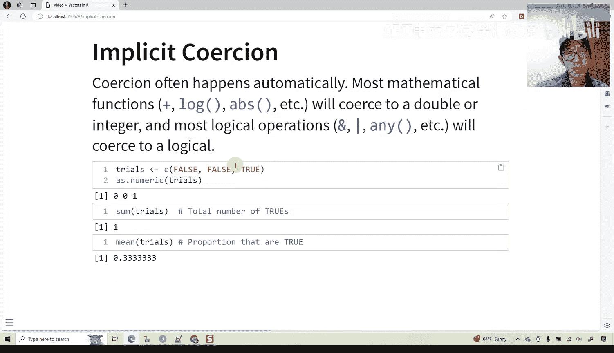

以下是相关操作的示例：

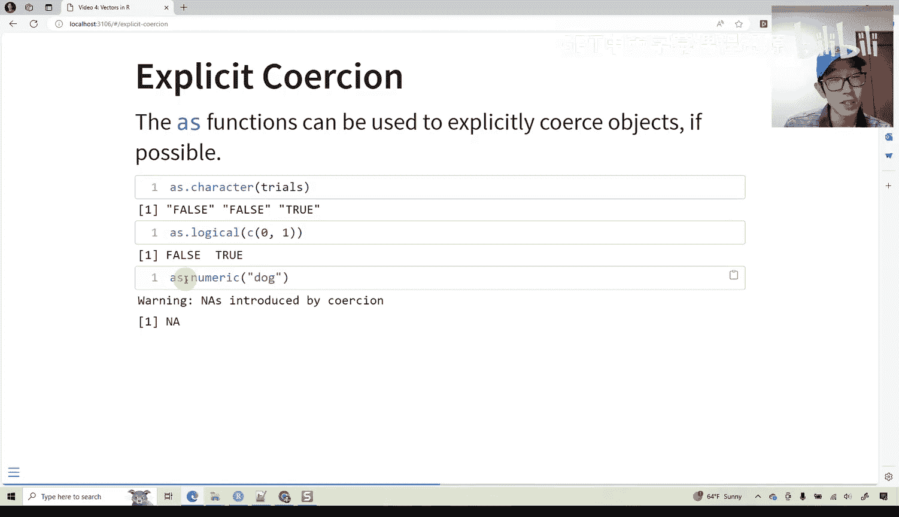

```r
logical_vec <- c(FALSE, FALSE, TRUE)

# 数学函数强制转换为数值
sum(logical_vec) # 1 (0+0+1)
mean(logical_vec) # 0.333 (1/3)

# 显式类型转换
as.numeric(logical_vec)   # 0, 0, 1
as.character(logical_vec) # "FALSE", "FALSE", "TRUE"
as.logical(c(0, 1, -5))   # FALSE, TRUE, TRUE

# 无法转换时产生 NA
as.numeric("dog") # NA (并带有警告)
```

关于逻辑值转换，需要注意：
*   `0` 强制转换为 `FALSE`，任何非零数值都转换为 `TRUE`。
*   只有特定的拼写（如`TRUE`, `True`, `FALSE`, `False`）能被识别。缩写`T`和`F`可能被覆盖，不建议使用。

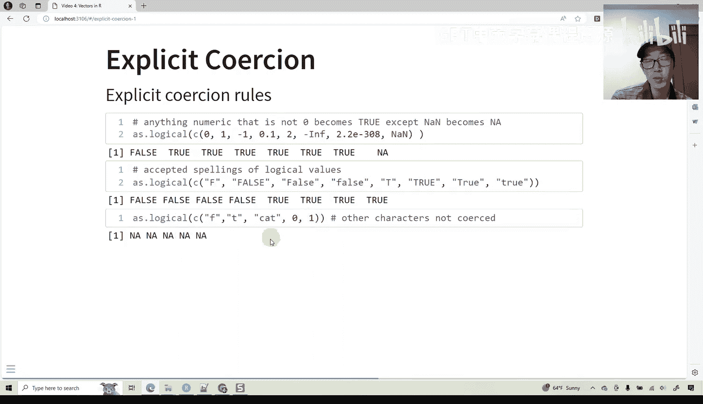

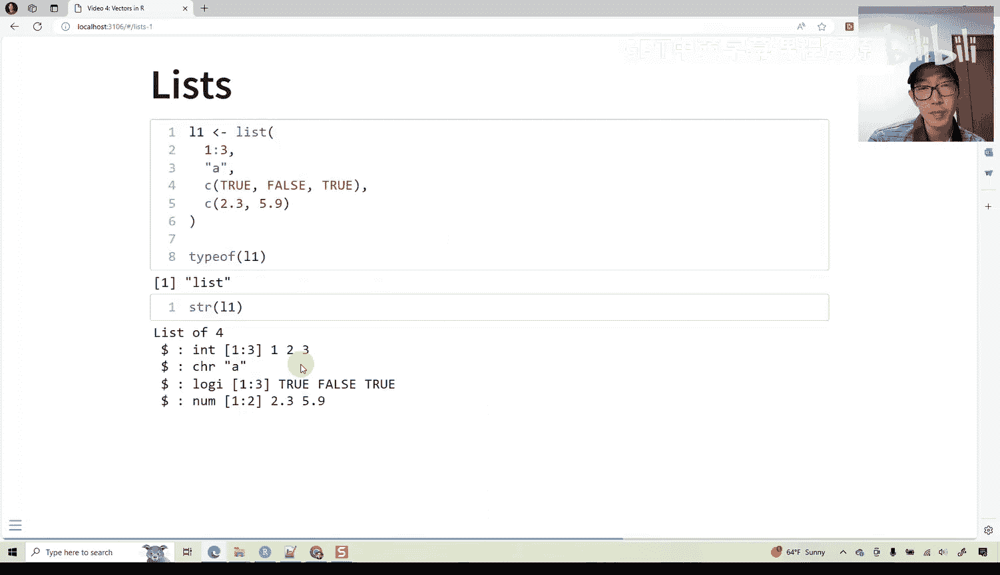

## 列表（通用向量）

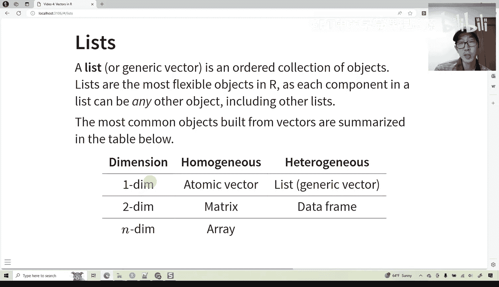

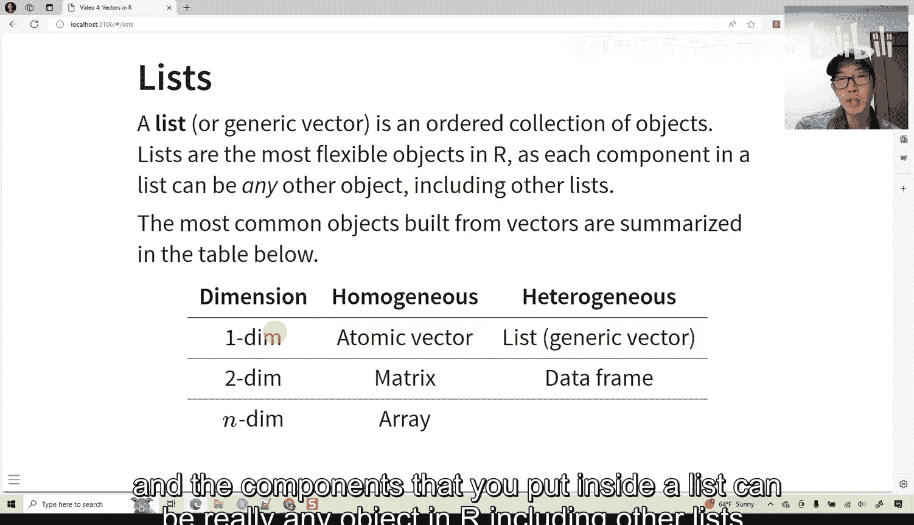

列表是R中最灵活的对象，它是一个**有序的对象集合**。列表中的组件可以是R中的任何对象，包括其他列表。

我们可以将数据结构这样理解：
*   **一维**，元素类型相同：**原子向量**。
*   **一维**，元素类型不同：**列表**。
*   **二维**，元素类型相同：**矩阵**。
*   **二维**，列类型不同：**数据框**。
*   **高维**，元素类型相同：**数组**。


以下是创建和操作列表的示例：

```r
# 创建一个包含不同类型元素的列表
list1 <- list(1:3, "A", c(TRUE, FALSE, TRUE), c(2.3, 5.9))
str(list1) # 显示结构

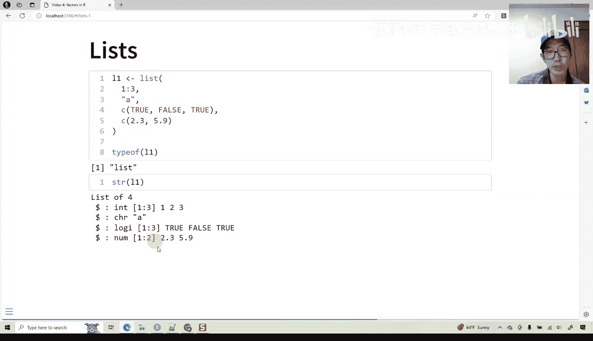

# 使用 c() 组合列表（会强制转换向量为列表）
list_a <- list(1, 2)
vec_b <- c(3, 4)
combined_list <- c(list_a, vec_b) # 结果为长度为4的列表: 1, 2, 3, 4

# 使用 list() 嵌套列表
nested_list <- list(list(1, 2), c(3, 4))
str(nested_list) # 顶层列表长度为2，第一个元素是子列表
```

## 属性

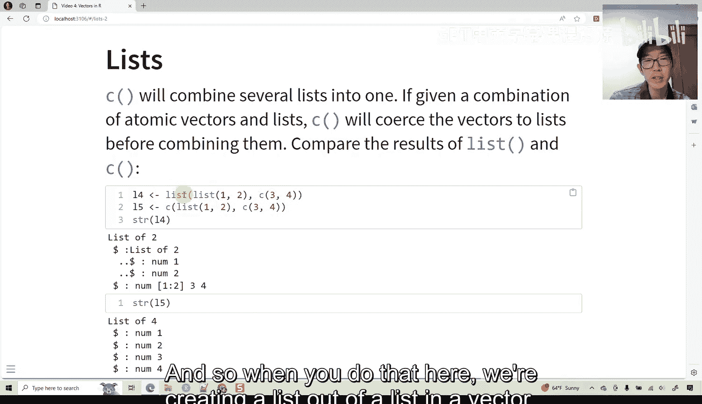

原子向量和列表都可以拥有**属性**。属性是一个**命名的元数据列表**，可以附加任何额外信息。

两个特别重要的属性是：
1.  **维度**：将向量转换为矩阵或数组。
2.  **类**：用于R的面向对象编程系统（如S3）。

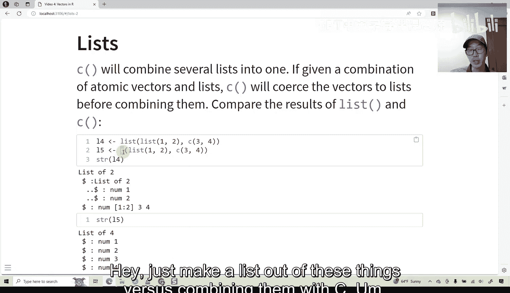

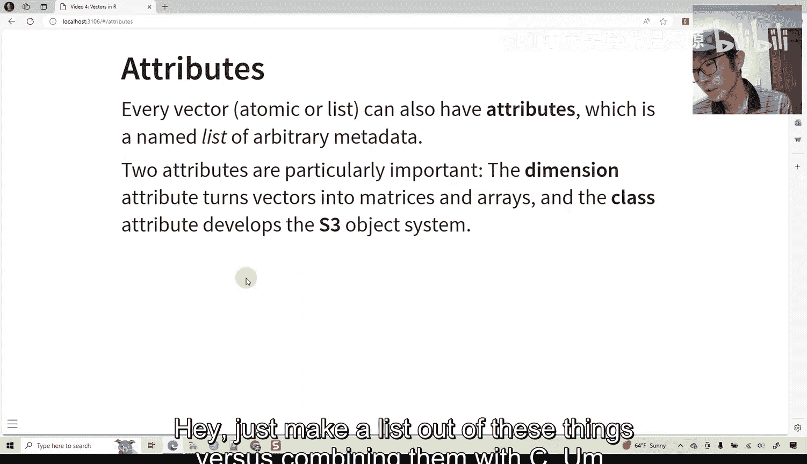

以下是查看和设置属性的示例：

```r
# 查看内置数据框的属性
data(trees)
attributes(trees)
# 输出通常包含: $names (列名), $class (类，如"data.frame"), $row.names (行名)

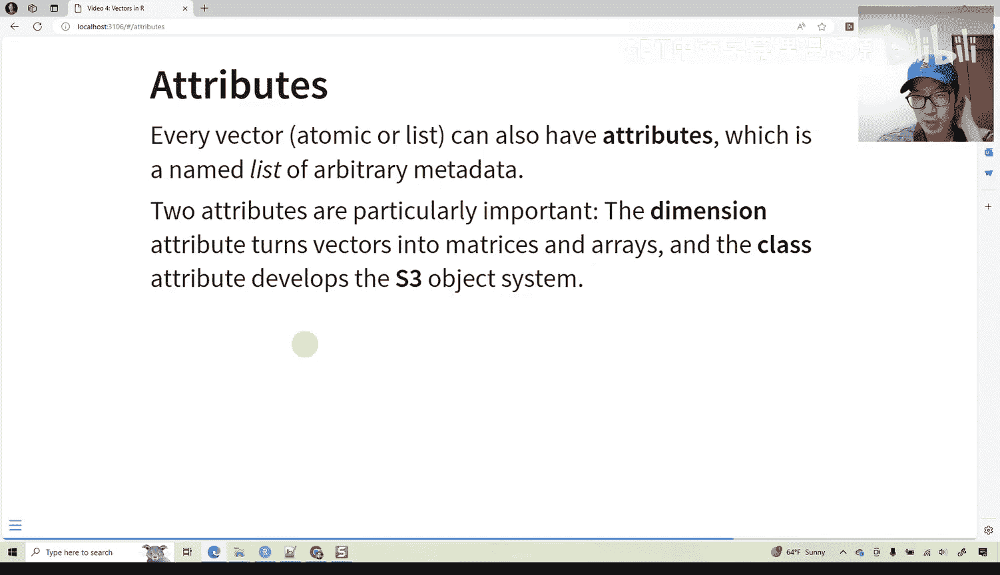

# 自定义属性
x <- 1:10
attr(x, "description") <- "这是一个数字序列"
attributes(x)

# 也可以一次性设置多个属性
attributes(x) <- list(description="我的向量", creator="我", date=Sys.Date())
```

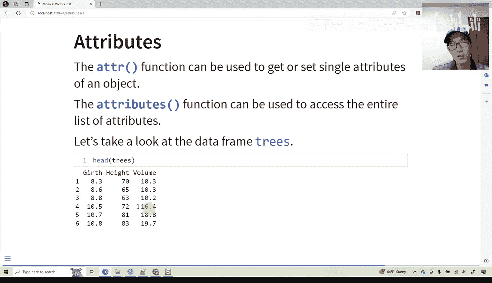

## 向量的命名

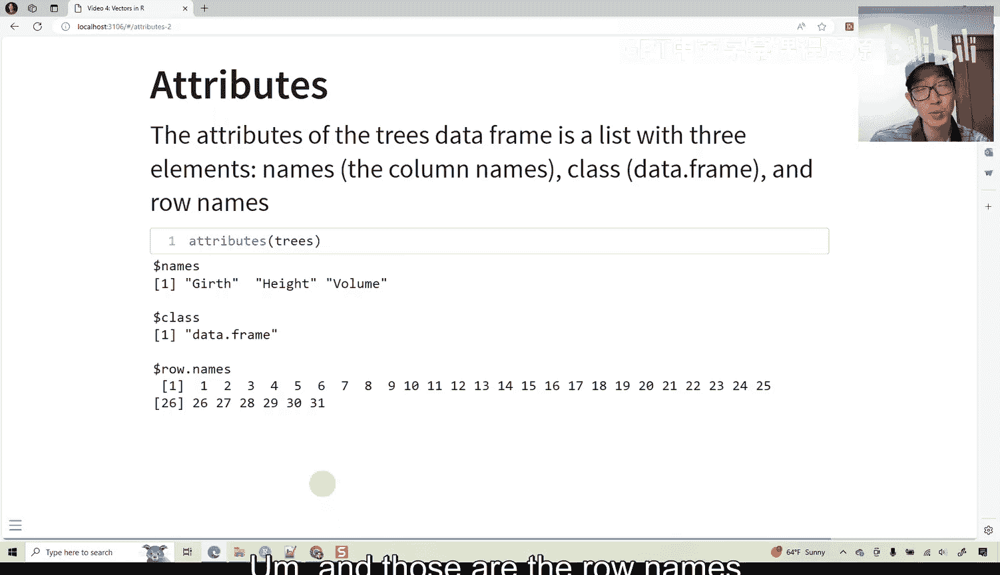

我们可以为向量的每个元素赋予名称，这些名称会存储在`names`属性中。

以下是命名向量的方法：

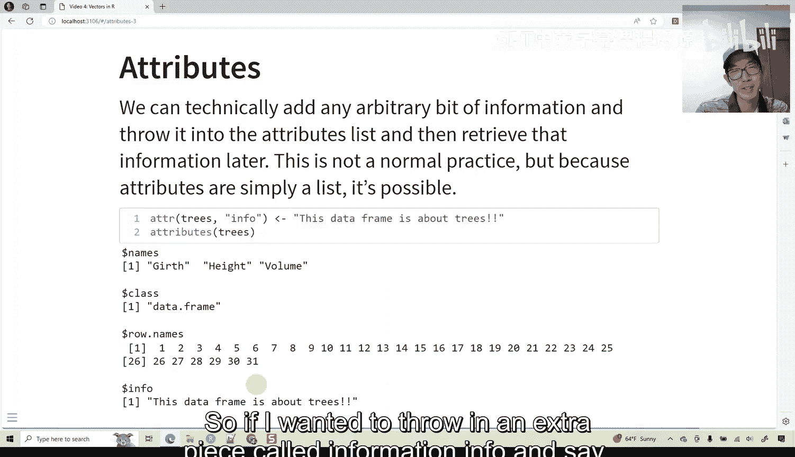

```r
# 创建时直接命名
named_vec <- c(a=1, b=2, c=3)
named_vec

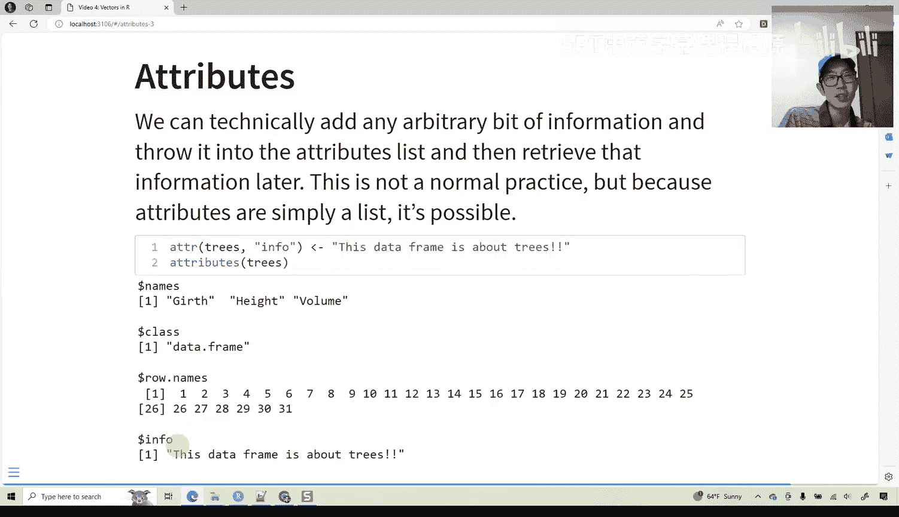

# 创建后赋值名称
vec <- 1:3
names(vec) <- c("A", "B", "C")
vec

# 使用 setNames 函数
vec2 <- setNames(1:3, c("X", "Y", "Z"))
vec2

# 移除名称
unname(vec)          # 返回一个不带名称的新向量
names(vec) <- NULL   # 直接移除原向量的名称属性
```


---


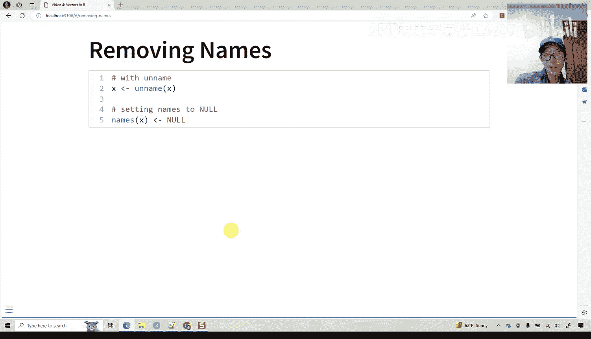

本节课中我们一起学习了R语言中向量的核心概念。我们了解了**原子向量**（元素类型必须一致）和**列表**（可包含不同类型）的区别，掌握了逻辑型、整型、双精度型和字符型这四种主要数据类型。我们探讨了**强制转换**的规则，即当混合类型时，数据会向更通用的类型（字符型 > 双精度型 > 整型 > 逻辑型）转换。此外，我们还学习了如何为数据结构添加**属性**和**名称**来存储元数据。理解这些基础数据结构是有效使用R进行数据操作和分析的关键。