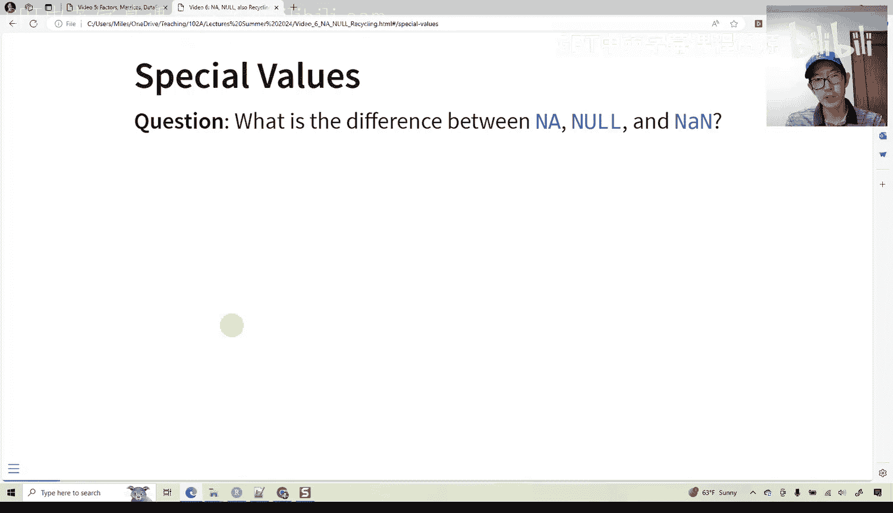
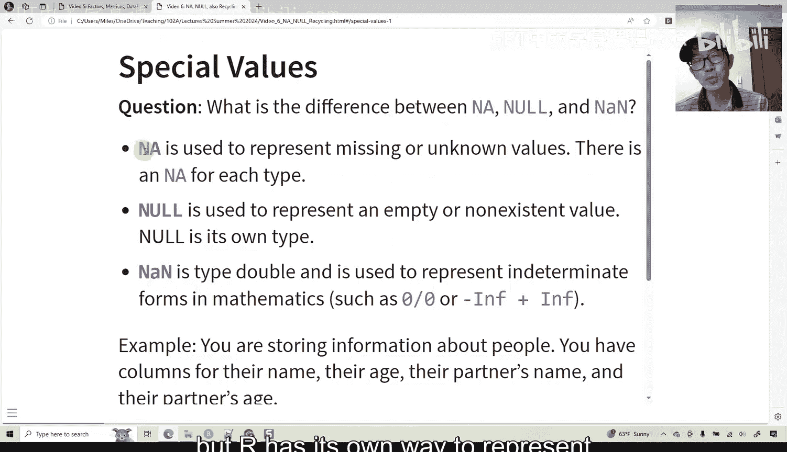
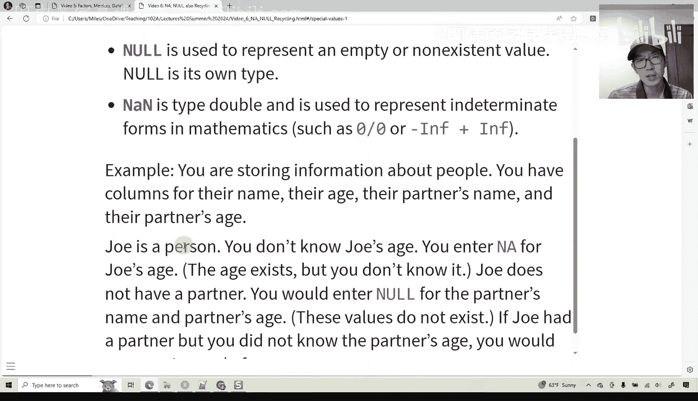
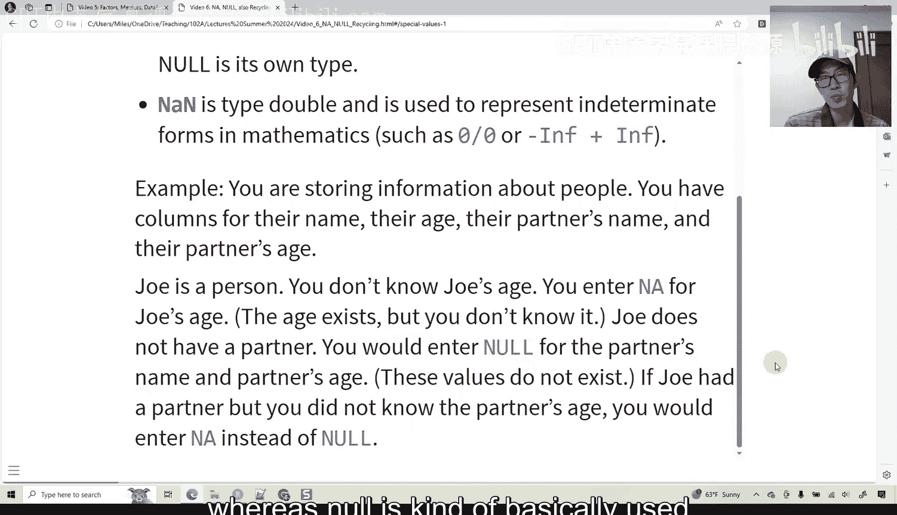
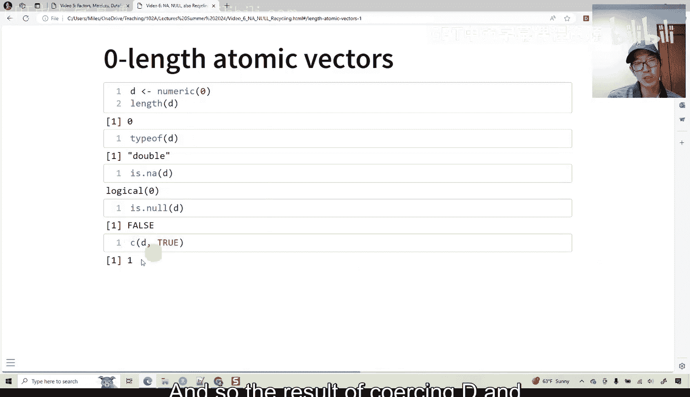
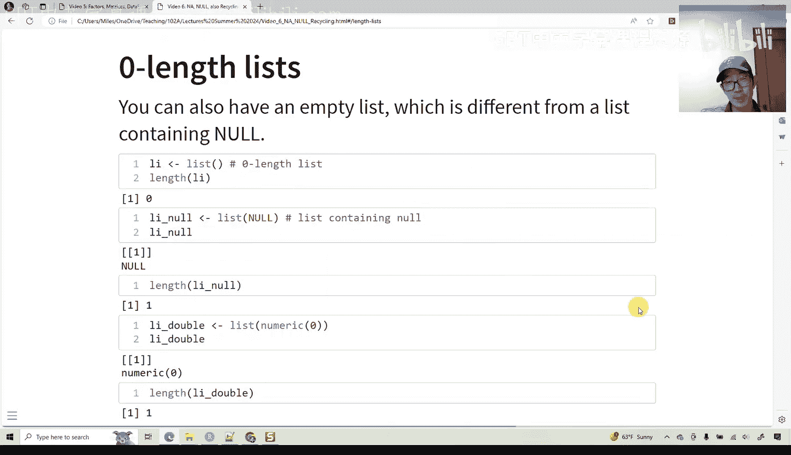
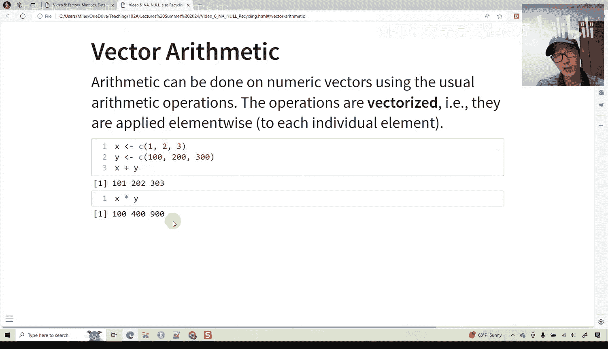
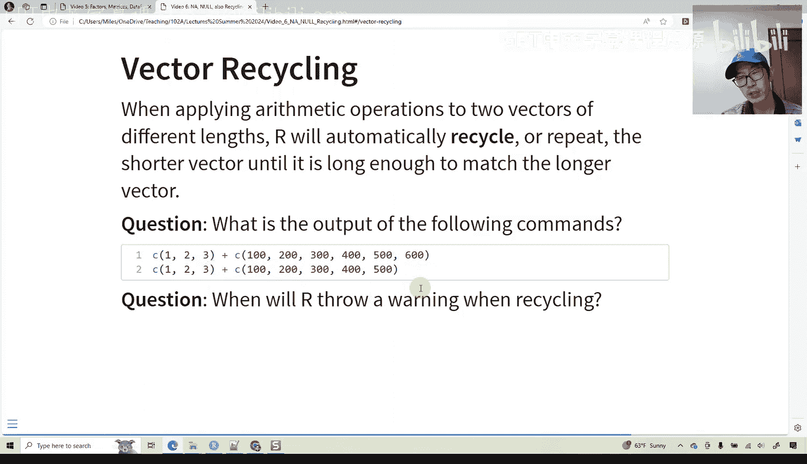
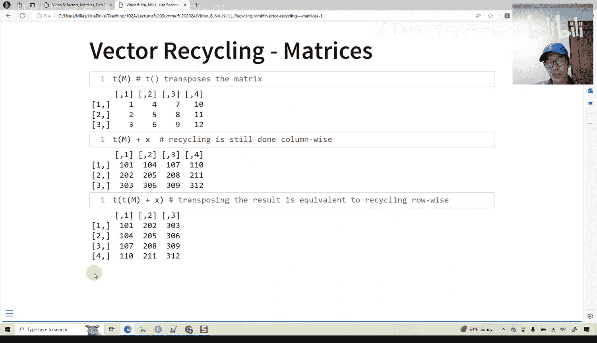

# 06：R语言中的NA、Null、NaN与向量循环使用规则 🧮




在本节课中，我们将学习R语言中的几个特殊值：`NA`、`NULL`和`NaN`。理解它们之间的区别对于正确处理数据至关重要。我们还将探讨R语言中向量化运算的一个强大特性——循环使用规则。

## 特殊值：NA、NULL与NaN

R语言使用几种特殊值来表示缺失、不存在或未定义的数值。



### NA：缺失值



`NA`用于表示**缺失或未知的值**。每种数据类型都有其对应的`NA`表示：
*   `NA` 逻辑型
*   `NA_integer_` 整型
*   `NA_real_` 双精度浮点型
*   `NA_character_` 字符型

当`NA`被放入一个向量时，它会被强制转换为该向量的类型。例如，将`NA`放入字符向量，它会变成字符型的`NA`。

**检测`NA`**：不能使用 `==` 运算符来检查一个值是否为`NA`。因为 `NA == NA` 的结果是 `NA`（未知）。必须使用 `is.na()` 函数。
```r
is.na(NA)  # 返回 TRUE
NA == NA   # 返回 NA
```



### NULL：空对象

`NULL`表示一个**不存在的对象**。它是一个长度为零的向量，并且是它自己的数据类型 (`NULL` 型)。

**检测`NULL`**：使用 `is.null()` 函数。
```r
is.null(NULL)  # 返回 TRUE
```

**`NULL`的特性**：任何与`NULL`进行的运算通常都会返回一个长度为零的向量。将`NULL`合并到向量中，相当于没有添加任何东西。
```r
length(c(4, 5, NULL, 3))  # 返回 3，向量为 c(4, 5, 3)
```

### NaN：非数字

`NaN` 表示 **“非数字”**，它总是**双精度浮点型**。它通常由未定义的数学运算产生，例如 `0 / 0` 或 `Inf - Inf`。

> **注意**：在Python中，`NaN`也常用来表示缺失值，但在R中，表示缺失值的标准方式是`NA`。

### 概念辨析：NA vs NULL

理解`NA`和`NULL`的区别是关键：
*   **`NA`** 用于表示**存在但未知**的值。
*   **`NULL`** 用于表示**根本不存在**的值。

**举例说明**：假设我们记录人物信息。
*   Joe的年龄未知 → 在“年龄”字段填入 `NA`（年龄存在，但我们不知道）。
*   Joe没有伴侣 → 在“伴侣姓名”和“伴侣年龄”字段填入 `NULL`（这些属性对Joe来说不存在）。
*   如果Joe有伴侣，但伴侣年龄未知 → 在“伴侣年龄”字段填入 `NA`。

## 零长度向量

R中每种数据类型都可以有长度为零的向量。它们与`NULL`不同，因为它们具有明确的类型。

```r
# 零长度逻辑向量
l <- logical(0)
length(l)  # 0
typeof(l)  # "logical"

# 零长度双精度向量
d <- double(0)
length(d)  # 0
typeof(d)  # "double"
```



对零长度向量使用 `is.na()` 或 `is.null()` 会返回长度为零的逻辑向量（`logical(0)`），因为提问的对象本身是空的。

**在列表中的应用**：
*   空列表 `list()` 的长度为0。
*   包含一个`NULL`元素的列表 `list(NULL)` 长度为1。
*   包含一个零长度向量的列表 `list(numeric(0))` 长度也为1。

这三者是不同的概念。

## 向量化运算与循环使用规则

上一节我们介绍了R中的特殊值，本节我们来看看R语言一个强大的特性：向量化运算。



R能够非常快速地对整个向量执行元素级运算。

```r
x <- c(1, 2, 3)
y <- c(100, 200, 300)
x + y  # 返回: 101 202 303
x * y  # 返回: 100 400 900
```



### 循环使用规则

当对两个长度不同的向量进行运算时，R会自动**循环使用**较短的向量，直到其长度与较长的向量匹配。

**规则匹配时**：
```r
c(1, 2, 3) + c(100, 200, 300, 400, 500, 600)
# 计算过程：1+100, 2+200, 3+300, 1+400, 2+500, 3+600
# 返回: 101 202 303 401 502 603
```



**规则不匹配时（发出警告）**：
如果较长向量的长度不是较短向量长度的整数倍，R仍会执行操作，但会发出警告。
```r
c(1, 2, 3) + c(100, 200, 300, 400, 500) # 会收到警告
```

### 矩阵中的循环使用

在矩阵运算中，循环使用是**按列进行**的。这有时可能不符合我们的直觉。

假设我们有一个矩阵 `m`：
```r
m <- rbind(c(1, 2, 3),
           c(4, 5, 6),
           c(7, 8, 9),
           c(10, 11, 12))
x <- c(100, 200, 300)
```
直接执行 `m + x`，向量`x`会沿着矩阵`m`的列向下循环添加，这可能不是我们想要的行方向添加。

**实现按行添加的技巧**：
如果想实现按行添加（即每一行都加上向量`x`），可以通过转置矩阵来实现。
```r
# 步骤：转置 -> 按列循环加x -> 再转置回来
result <- t(t(m) + x)
```
这样，`x`中的元素（100， 200， 300）就会被依次添加到`m`的每一行中。

## 总结

本节课中我们一起学习了R语言中三个关键的特殊值：
1.  **`NA`**：代表**存在但缺失**的值，使用 `is.na()` 检测。
2.  **`NULL`**：代表**不存在**的对象，使用 `is.null()` 检测。
3.  **`NaN`**：代表**非数字**的浮点值，由无效数学运算产生。



我们还探讨了零长度向量的概念，以及R语言强大的**向量化运算**和**循环使用规则**。理解循环使用规则，特别是其在矩阵中按列进行的特性，对于正确执行向量和矩阵运算至关重要。当需要按行操作时，可以巧妙地运用转置函数 `t()` 来实现目标。