# 07：原子向量的子集选取

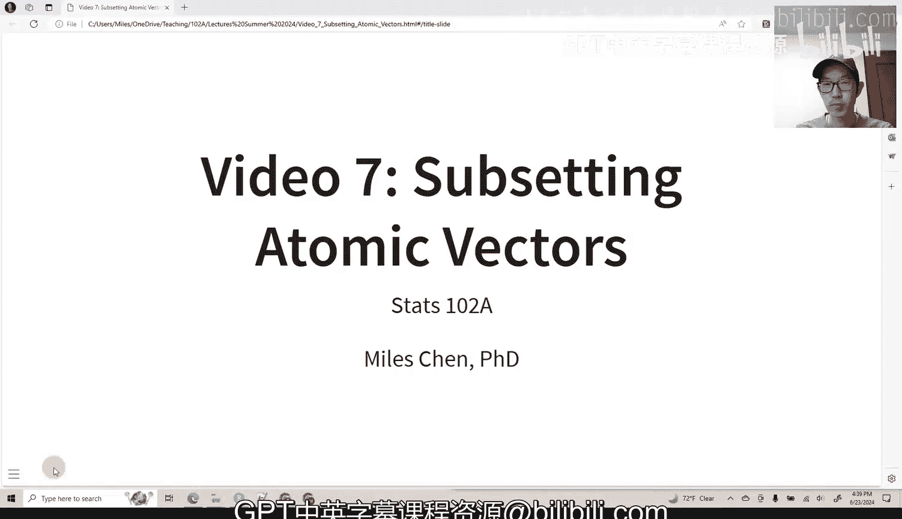

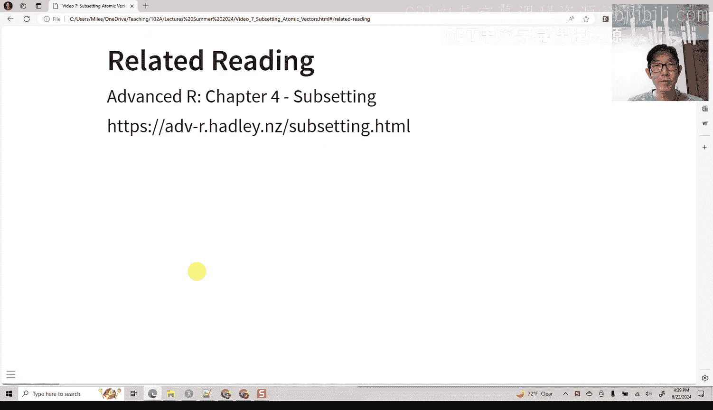


在本节课中，我们将学习如何在R语言中对原子向量进行子集选取。子集选取是数据操作的基础，它允许我们从向量中提取、排除或重新排列元素。我们将探讨四种主要方法：使用正整数、负整数、逻辑向量和字符向量。

## 子集选取方法概述

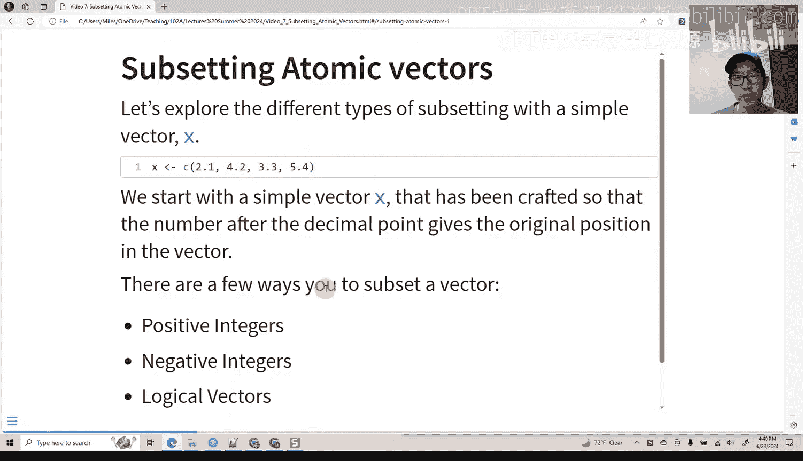

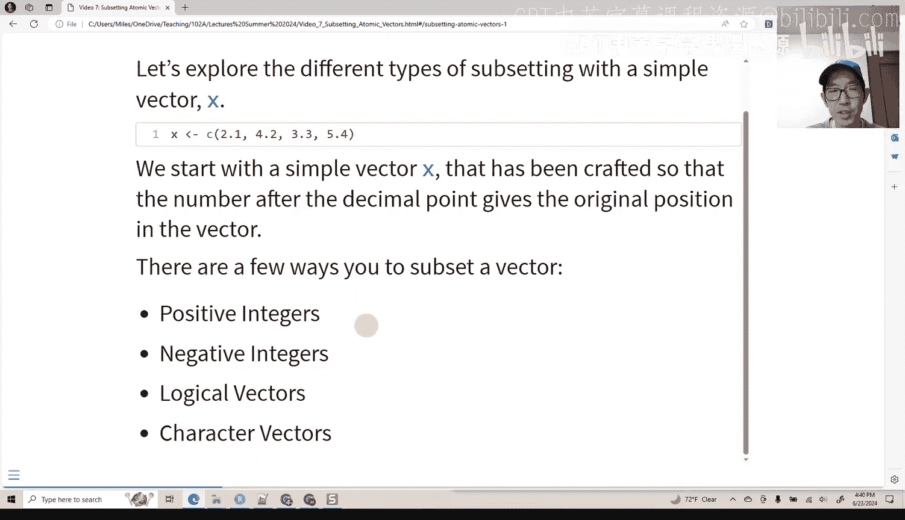

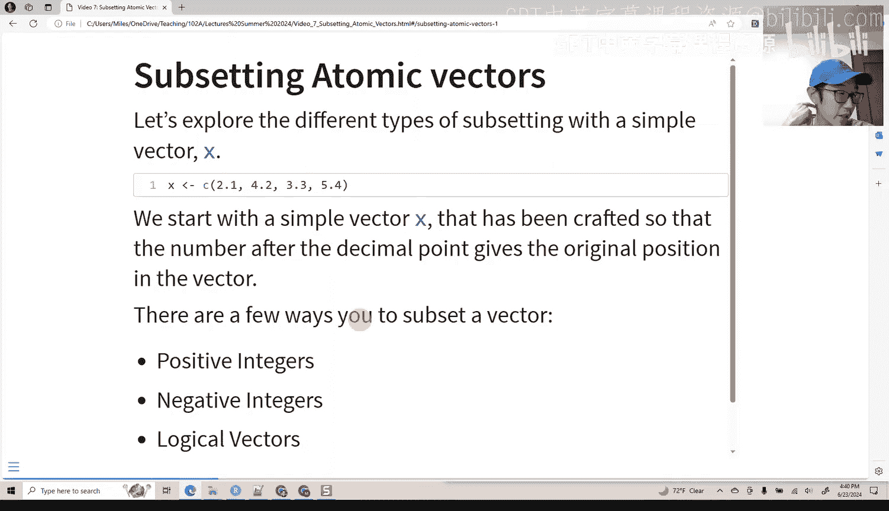

原子向量是R中最基本的数据结构之一。子集选取意味着从向量中选择一部分元素。以下是一个简单的向量 `x`：

```r
x <- c(2.1, 4.2, 3.3, 5.4)
```

向量中每个元素的位置（索引）从1开始。我们将学习如何通过不同的索引方式来操作这个向量。

## 使用正整数选取

使用正整数进行子集选取会返回指定位置上的元素。其基本语法是 `向量[索引向量]`。

以下是使用正整数选取子集的示例：

*   `x[3]` 返回第三个元素：`3.3`。
*   `x[c(3, 1)]` 返回第三和第一个元素：`c(3.3, 2.1)`。
*   `order(x)` 函数返回一个索引向量，如果按此顺序选取 `x`，则 `x[order(x)]` 会将向量从小到大排序。
*   可以重复选取同一位置，例如 `x[c(1, 1)]` 会返回 `c(2.1, 2.1)`。
*   如果索引不是整数，R会将其**截断**（而非四舍五入）。例如，`x[c(2.1, 2.9)]` 会被当作 `x[c(2, 2)]` 处理。
*   使用非精确的浮点数（如 `1.999999999`）作为索引可能导致意外结果，因为它会被截断为 `1`。

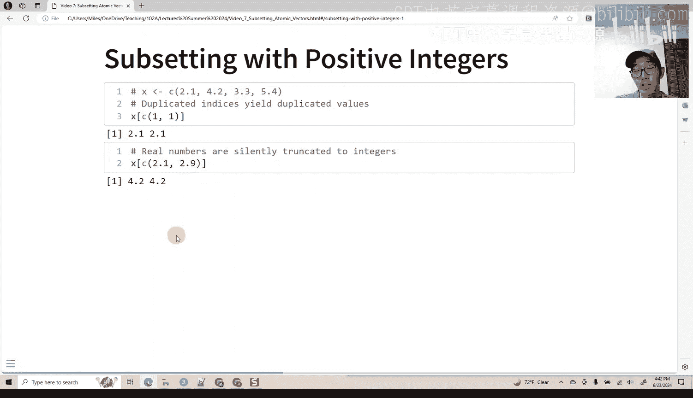

## 使用负整数排除

使用负整数进行子集选取会**排除**指定位置上的元素，返回其余所有元素。

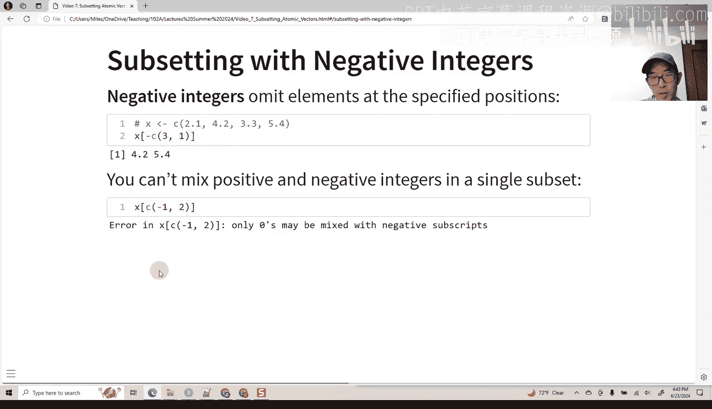

以下是使用负整数排除元素的示例：

*   `x[-3]` 返回除第三个元素外的所有元素：`c(2.1, 4.2, 5.4)`。
*   `x[-c(3, 1)]` 排除第三和第一个元素，返回：`c(4.2, 5.4)`。
*   **重要规则**：不能在同一个索引向量中混合使用正整数和负整数，例如 `x[c(-1, 2)]` 会导致错误。必须统一使用负号来排除元素。

## 使用逻辑向量筛选

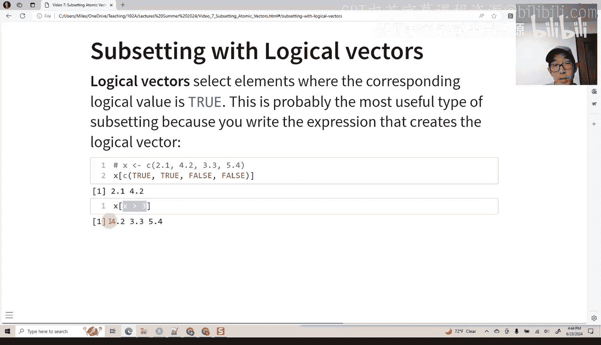

使用逻辑向量（仅包含 `TRUE` 和 `FALSE` 的向量）进行子集选取，会返回所有对应位置为 `TRUE` 的元素。这是根据条件筛选数据的强大工具。

以下是使用逻辑向量筛选的示例：

*   直接使用逻辑向量：`x[c(TRUE, TRUE, FALSE, FALSE)]` 返回前两个元素：`c(2.1, 4.2)`。
*   使用逻辑条件：`x[x > 3]` 返回所有大于3的元素：`c(4.2, 3.3, 5.4)`。
*   如果逻辑向量比被选取的向量短，R会**循环使用**该逻辑向量。例如，`x[c(TRUE, FALSE)]` 等价于 `x[c(TRUE, FALSE, TRUE, FALSE)]`，返回 `c(2.1, 3.3)`。
*   如果逻辑向量中包含 `NA`（缺失值），则对应位置的输出也是 `NA`。例如，`x[c(TRUE, TRUE, NA, FALSE)]` 返回 `c(2.1, 4.2, NA)`。

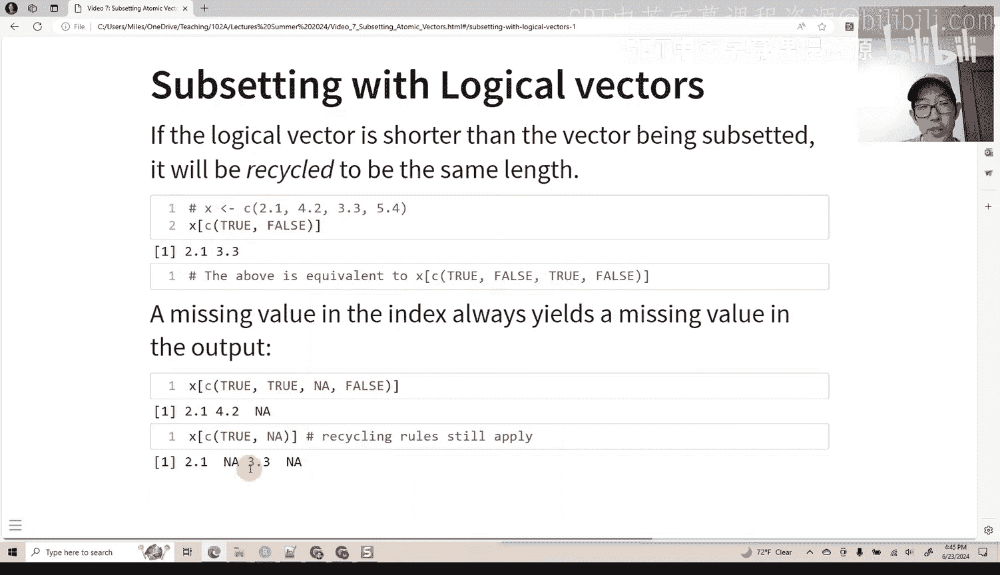

## 特殊索引情况

在子集选取中，有两个特殊但有用的索引值。

以下是两种特殊索引的说明：

*   **空索引**：在方括号中不放入任何内容（`x[]`）会返回整个原始向量。这在矩阵或数据框操作中非常有用，例如选择所有行或所有列。
*   **零索引**：使用 `x[0]` 会返回一个**零长度的向量**。这通常不直接用于数据选取，但在编写函数时，用于测试函数是否能正确处理空输入非常有用。

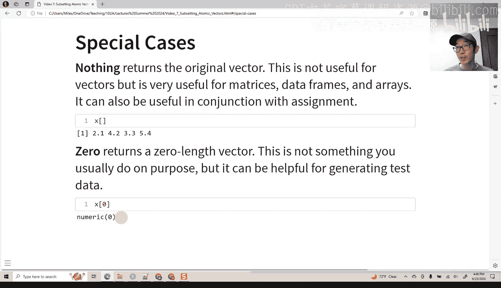

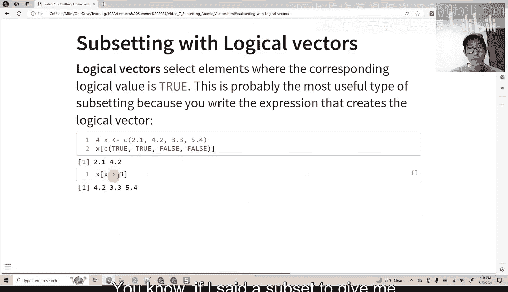

## 使用字符向量（命名向量）选取

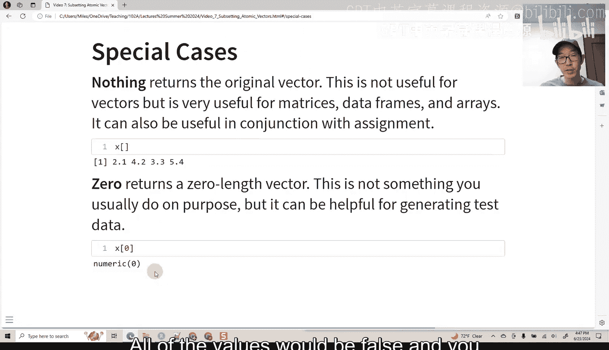

如果向量具有名称属性（即命名向量），则可以使用字符向量（名称）来选取子集。首先，我们需要为向量设置名称。

以下是使用命名向量进行子集选取的步骤和示例：

1.  **创建命名向量**：
    ```r
    y <- c(a = 2.1, b = 4.2, c = 3.3, d = 5.4)
    ```
2.  **使用名称选取**：`y[c("d", "c", "a")]` 会按指定名称顺序返回元素：`c(5.4, 3.3, 2.1)`。名称也可以重复。
3.  **精确匹配**：名称的拼写必须**完全一致**，包括大小写。如果名称不匹配，R会返回 `NA`。例如，`y[c("a", "e")]` 会返回 `c(2.1, NA)`。

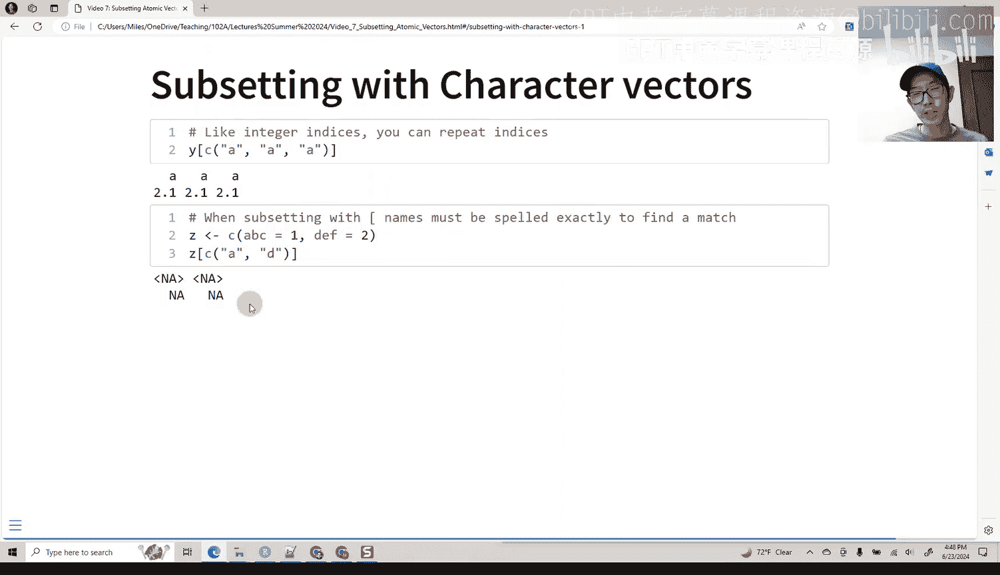

## 应用：创建查找表

命名向量的一个巧妙应用是创建“查找表”或“映射表”，用于批量替换值。

假设我们有一个包含性别代码的向量 `x`：
```r
x <- c("M", "F", "U", "F", "F", "M")
```
我们希望将 `"M"` 替换为 `"male"`，`"F"` 替换为 `"female"`，`"U"` 替换为 `NA`。

以下是创建和使用查找表的步骤：

1.  **创建查找向量**：这个向量的元素是目标值，名称是原始代码。
    ```r
    lookup <- c(M = "male", F = "female", U = NA)
    ```
2.  **使用原始向量作为索引**：通过 `lookup[x]`，R会使用 `x` 中的每个值作为名称去 `lookup` 中查找对应的元素。
3.  **移除名称（可选）**：结果会保留查找向量的名称，使用 `unname()` 函数可以移除它们。
    ```r
    result <- unname(lookup[x])
    # 结果: c("male", "female", NA, "female", "female", "male")
    ```

这种方法简洁高效，特别适用于将分类代码（如月份缩写、国家代码）转换为可读标签。

## 课程总结

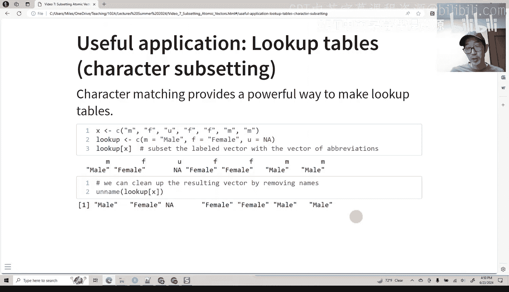

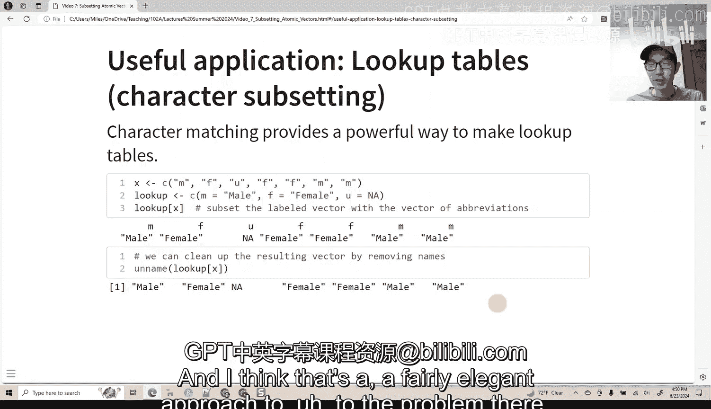

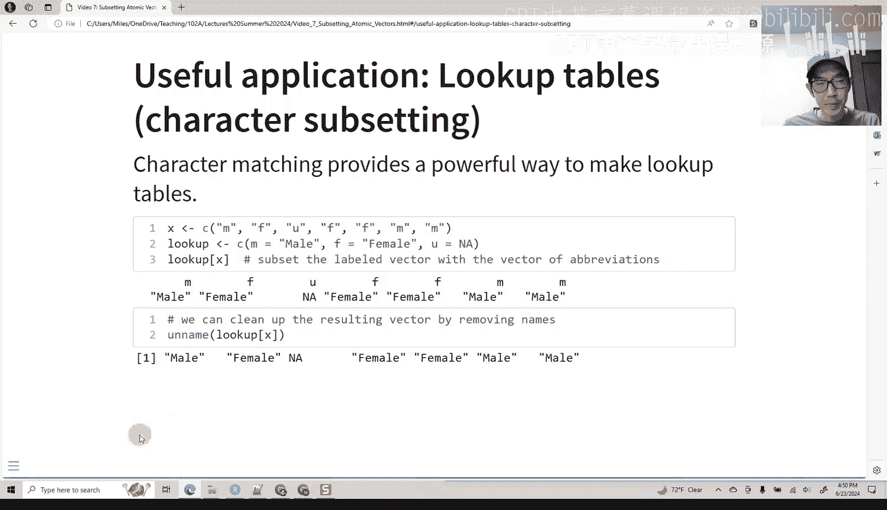

本节课中，我们一起学习了在R中对原子向量进行子集选取的四种核心方法。我们了解了如何使用**正整数**提取特定位置的元素，使用**负整数**排除不需要的元素，使用**逻辑向量**根据条件筛选数据，以及如何为向量命名后使用**字符向量**通过名称进行选取。最后，我们还探讨了如何利用命名向量创建“查找表”来实现值的批量替换，这是一个非常实用的数据清理技巧。掌握这些子集选取技术是进行有效数据分析和操作的基础。