# 10：条件语句

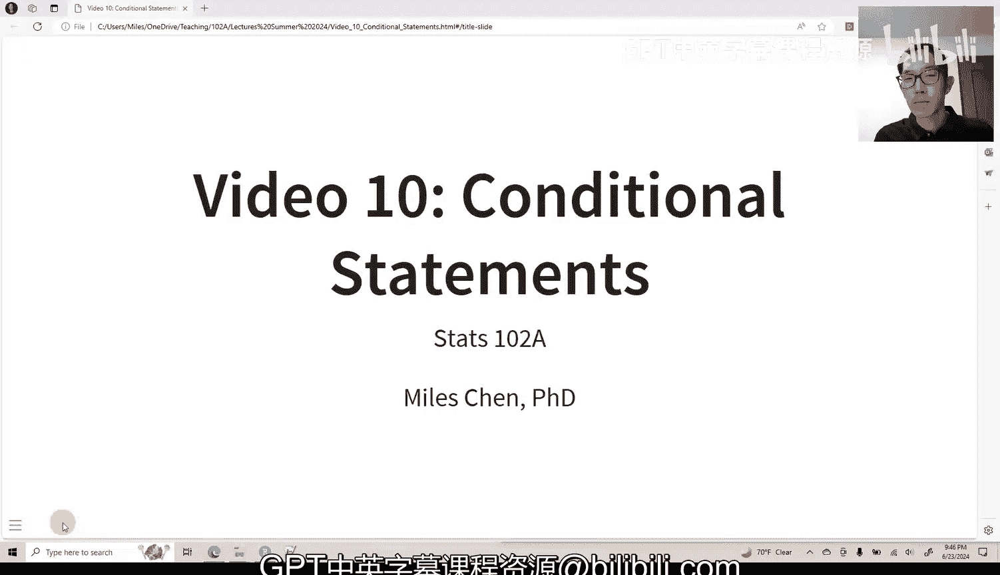

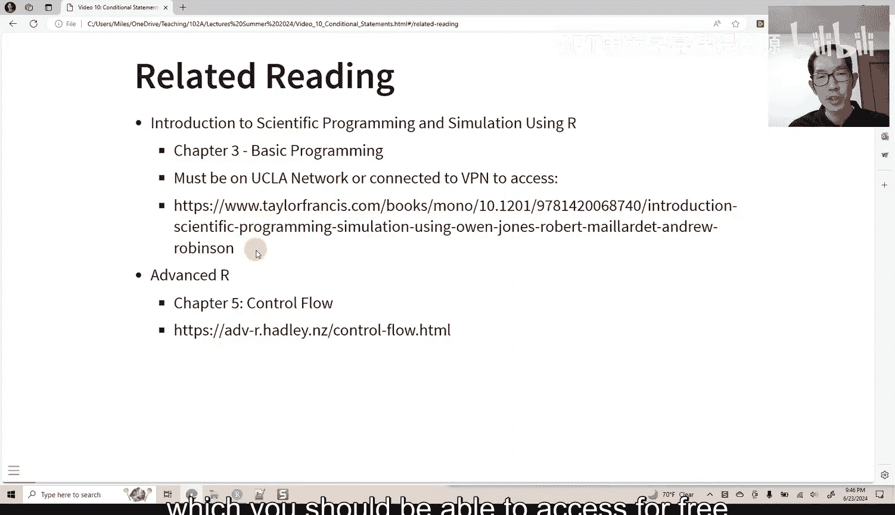

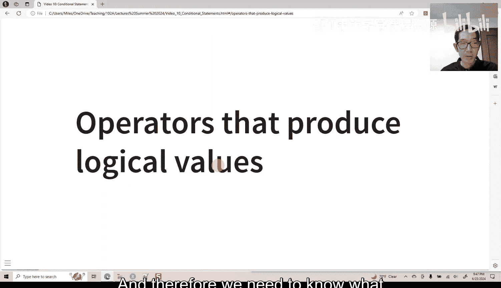

在本节课中，我们将学习R语言中的条件语句。条件语句是编程中控制代码执行流程的核心工具，它允许程序根据特定条件决定执行哪些代码块。我们将从逻辑运算符开始，逐步深入到`if`、`else if`、`else`以及`ifelse`语句的使用。

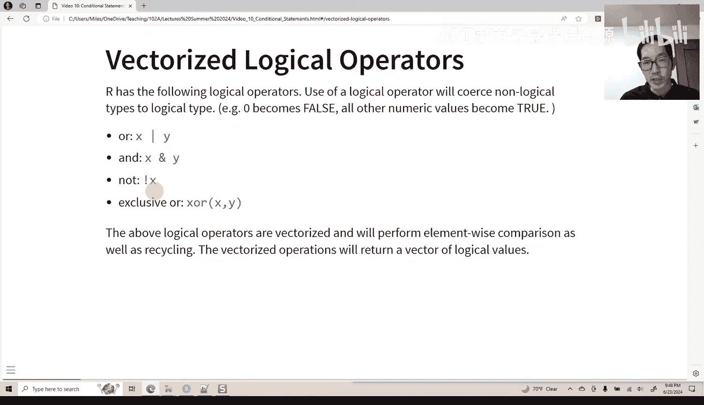

## 逻辑运算符

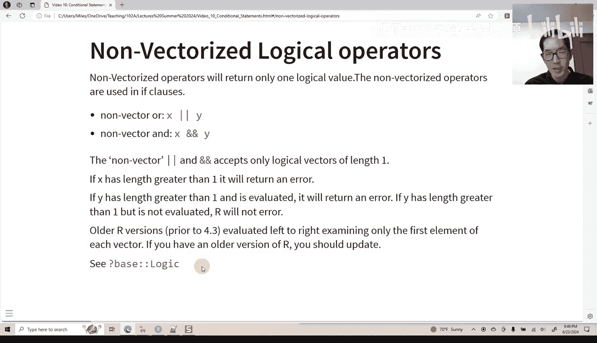

上一节我们介绍了条件语句的基本概念，本节中我们来看看构成条件的基础——逻辑运算符。这些运算符用于产生逻辑值（`TRUE`或`FALSE`），它们是构建条件判断的基石。

R语言中的向量化逻辑运算符包括：
*   **`|`**：逻辑“或”。只要`x`或`y`中有一个为`TRUE`，结果即为`TRUE`。公式：`x | y`
*   **`&`**：逻辑“与”。只有`x`和`y`都为`TRUE`时，结果才为`TRUE`。公式：`x & y`
*   **`!`**：逻辑“非”。将`TRUE`变为`FALSE`，将`FALSE`变为`TRUE`。公式：`!x`
*   **`xor()`**：逻辑“异或”。当`x`和`y`中只有一个为`TRUE`时，结果为`TRUE`。公式：`xor(x, y)`

这些运算符是向量化的，意味着它们可以对向量中的每个元素进行逐对计算，并自动进行循环补齐。

此外，R还有非向量化的逻辑运算符，它们只接受长度为1的逻辑值：
*   **`||`**：非向量化的“或”。
*   **`&&`**：非向量化的“与”。

如果提供给`||`或`&&`的参数长度大于1，R通常会报错。但在某些情况下，如果运算符能根据第一个值确定结果（例如`FALSE && ...` 或 `TRUE || ...`），则不会评估第二个参数，因此也不会报错。

处理缺失值`NA`时，逻辑运算的结果取决于运算符：
*   `TRUE | NA` 结果为 `TRUE`。
*   `TRUE & NA` 结果为 `NA`。
*   `FALSE | NA` 结果为 `NA`。
*   `FALSE & NA` 结果为 `FALSE`。

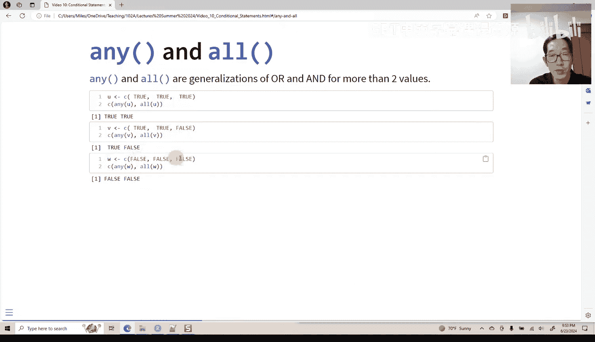

以下是用于检查多个值的逻辑函数：
*   **`any()`**：如果参数中**任何**一个元素为`TRUE`，则返回`TRUE`。可以看作是`|`运算符对多个值的推广。
*   **`all()`**：如果参数中**所有**元素都为`TRUE`，则返回`TRUE`。可以看作是`&`运算符对多个值的推广。

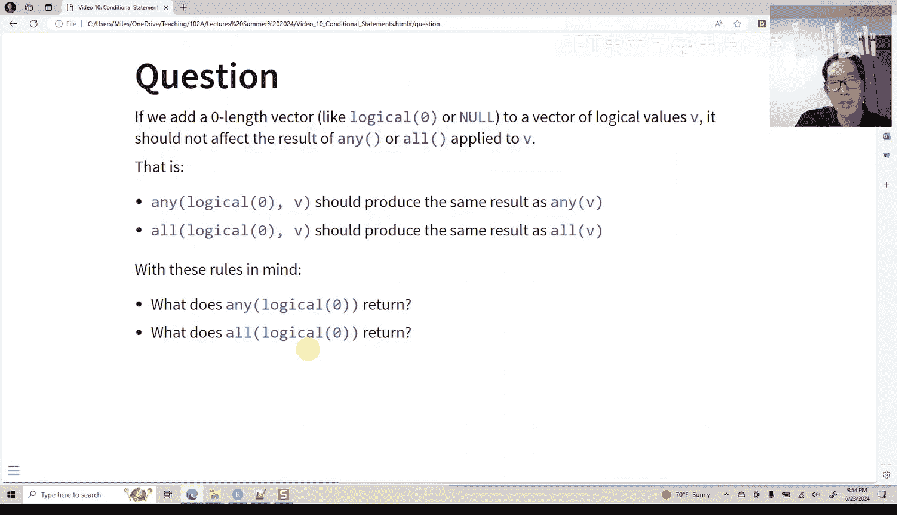

关于`any()`和`all()`函数，有一个重要的边界情况：对长度为零的逻辑向量应用这些函数时，`any(logical(0))`返回`FALSE`，`all(logical(0))`返回`TRUE`。这是为了确保向一个逻辑向量添加空向量不会改变`any()`或`all()`的结果。

## 比较运算符

掌握了如何组合逻辑值后，我们来看看如何生成它们。比较运算符用于比较两个值，并返回逻辑结果。

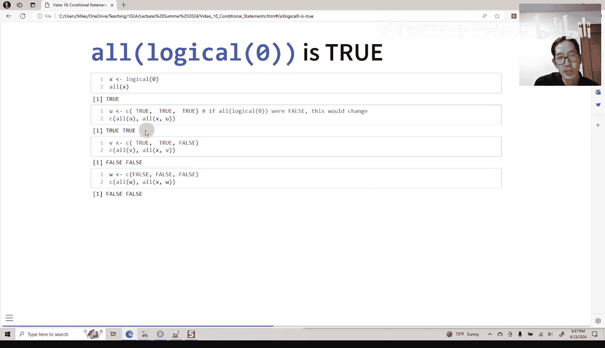

R中的比较运算符也是向量化的，它们包括：
*   **`==`**：等于
*   **`!=`**：不等于
*   **`<`**：小于
*   **`>`**：大于
*   **`<=`**：小于等于
*   **`>=`**：大于等于
*   **`%in%`**：属于。检查左侧向量的每个元素是否出现在右侧的集合中。例如：`x %in% c(1, 3, 5)`

比较字符向量时，顺序基于字母表，规则如下：符号 -> 数字（0-9）-> 小写字母（a-z）-> 大写字母（A-Z）。需要注意的是，字符串`"10"`会排在`"2"`之前，因为字符串比较是逐字符进行的。

R还提供了一系列`is.*()`函数，用于检查对象的类型、类别或特性，它们返回逻辑值。例如：
*   `is.na()`：检查是否为缺失值。
*   `is.null()`：检查是否为`NULL`。
*   `is.numeric()`：检查是否为数值型。

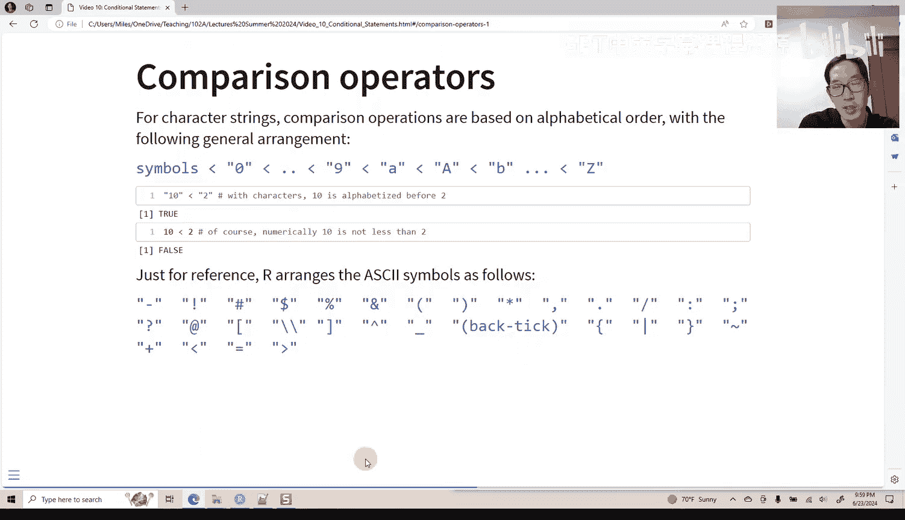

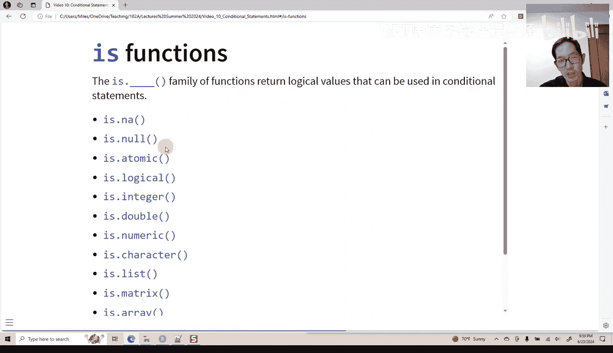

## If 语句

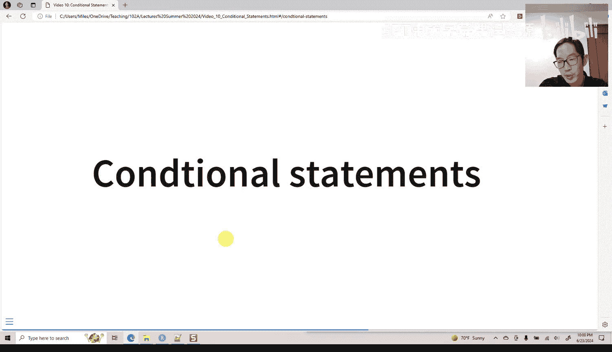

现在我们已经能够创建逻辑值，本节我们将学习如何使用`if`语句来根据这些值有条件地执行代码。`if`语句是实现条件代码执行的主要方式。

`if`语句的基本结构如下：
```r
if (condition) {
    # 当 condition 为 TRUE 时执行的代码
}
```
其中的`condition`必须是一个长度为1的逻辑值（`TRUE`或`FALSE`），不能是`NA`，也不能是长度大于1或长度为零的向量，否则会导致错误。

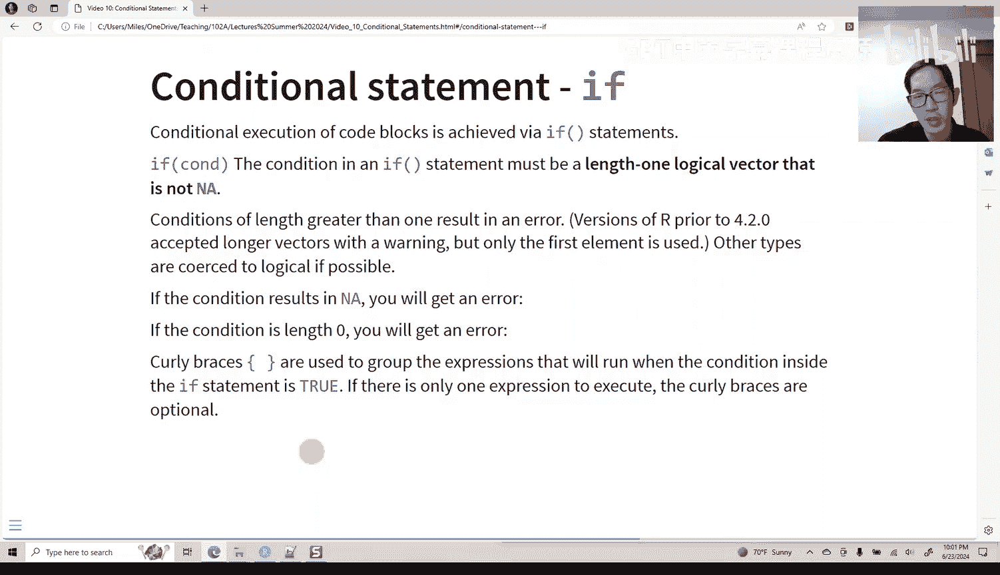

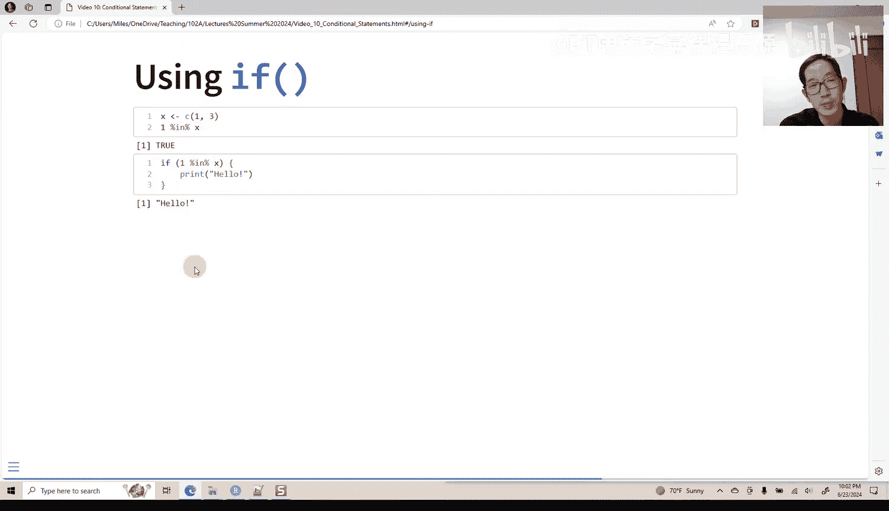

如果条件为真时需要执行的代码只有一行，花括号`{}`可以省略，但为了代码清晰，建议始终使用花括号。

让我们看几个例子：
1.  **有效条件**：`if (1 %in% c(1, 3)) { print("hello") }` 会打印“hello”。
2.  **长度大于1的条件（错误）**：`if (c(1, 3) <= 2) { ... }` 会产生错误，因为条件`c(TRUE, FALSE)`的长度为2。
3.  **使用`any()`/`all()`处理向量条件**：`if (any(c(1, 3) >= 2)) { print("can you hear me now") }` 会成功执行并打印。
4.  **条件为`NA`（错误）**：`if (NA) { ... }` 或 `if (c(1,2,3)[5] >= 2) { ... }` 会产生“missing value where TRUE/FALSE needed”错误。
5.  **长度为零的条件（错误）**：`if (which(c(1,2,3) == 4)) { ... }` 会产生“argument is of length zero”错误。

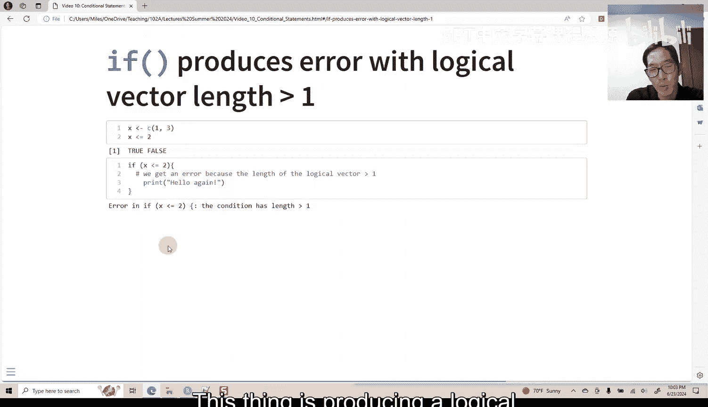

为了提高代码可读性，建议将复杂的条件判断赋值给一个具有描述性的变量，然后在`if`语句中使用这个变量。

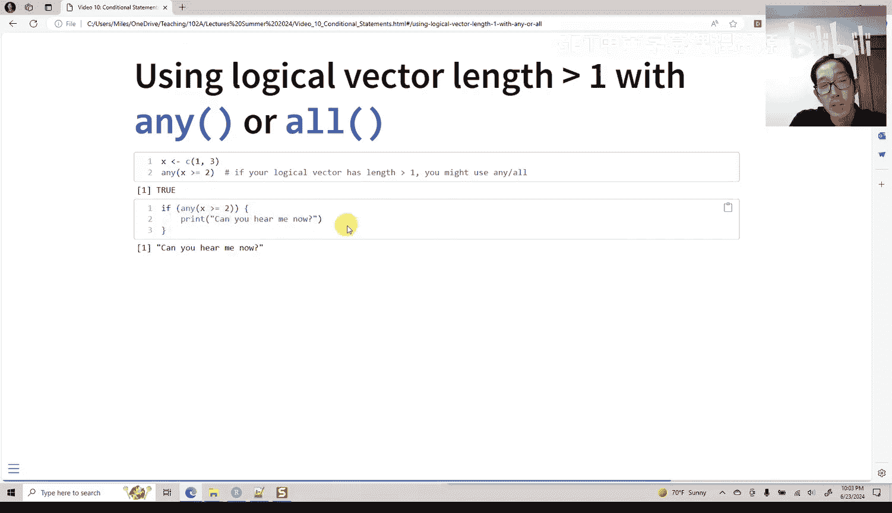

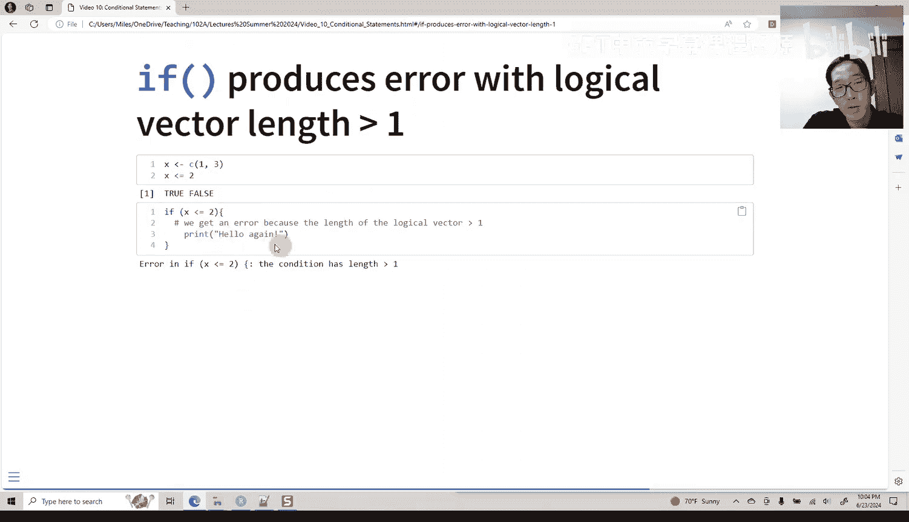

## Else 与 Else If

单一的`if`语句只能处理一种情况。为了处理多个分支条件，我们需要引入`else if`和`else`子句。它们允许我们在初始条件不满足时，检查其他条件。

`if...else if...else`结构允许进行多分支判断：
```r
if (condition1) {
    # 代码块1
} else if (condition2) {
    # 代码块2
} else {
    # 代码块3
}
```
`else if`和`else`必须紧跟在前面`if`语句的闭合花括号之后。`else`子句只有在所有前面的`if`和`else if`条件都为`FALSE`时才会执行。

需要注意条件的顺序。例如，在下面的代码中，“bigger than one”永远不会被打印，因为当`x > 0`为`TRUE`时，程序不会进入`else`分支去检查`x > 1`。
```r
x <- 3
if (x > 0) {
    print("positive")
} else if (x > 1) { # 这个条件永远不会被评估
    print("bigger than one")
}
```

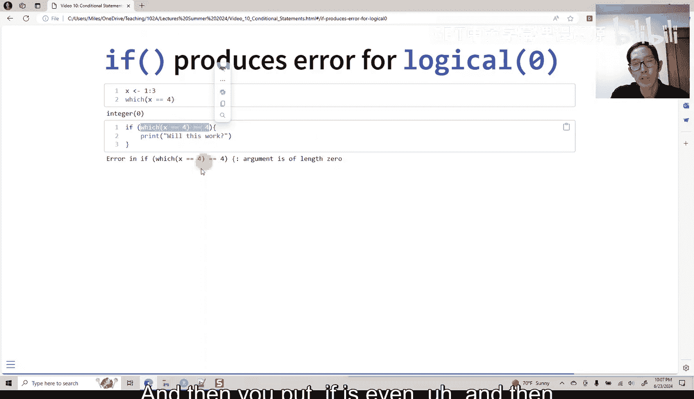

## 向量化的条件选择

标准的`if`语句不是向量化的，它一次只能处理一个逻辑值。如果我们希望对整个向量的每个元素应用条件判断，除了使用循环，还有一个更高效的工具——`ifelse()`函数。

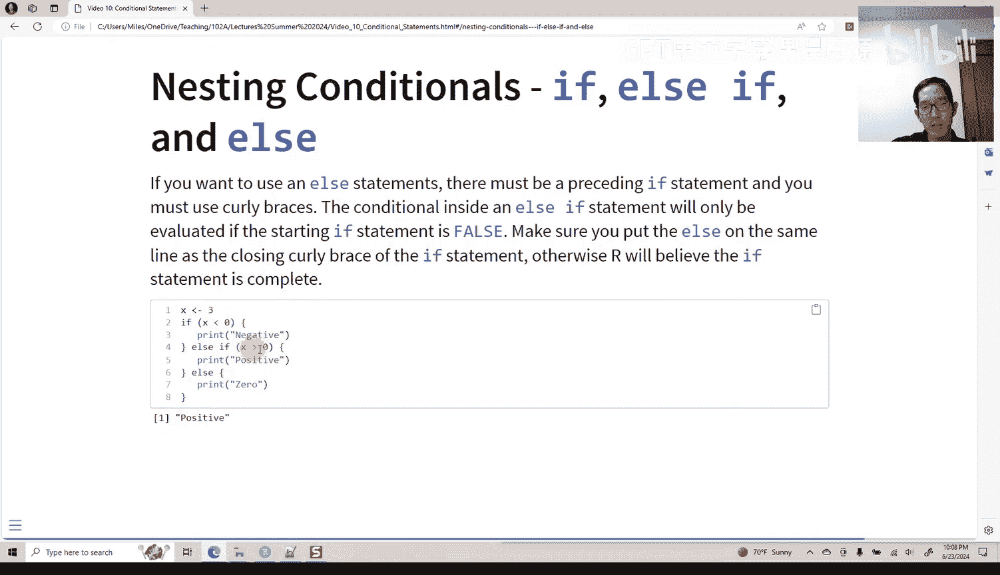

`ifelse()`函数是向量化的条件选择函数，其语法为：
```r
ifelse(test, yes, no)
```
*   `test`：一个可以产生逻辑值向量的表达式。
*   `yes`：当`test`中对应元素为`TRUE`时返回的值。
*   `no`：当`test`中对应元素为`FALSE`时返回的值。

`ifelse()`会对`test`向量中的每个元素进行判断，然后从`yes`或`no`中选取对应的结果，最终返回一个与`test`等长的向量。例如：
```r
x <- 1:10
result <- ifelse(x %% 2 == 0, "even", "odd")
# result 将是 c("odd", "even", "odd", "even", ...)
```

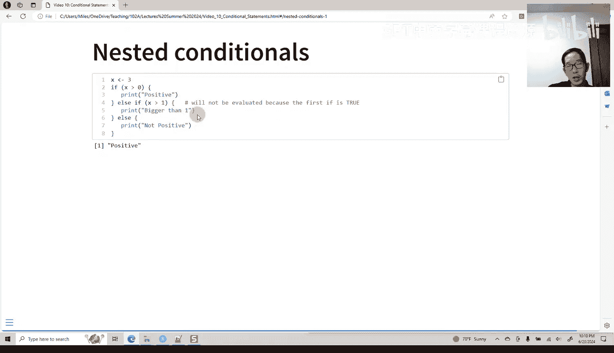

## 总结

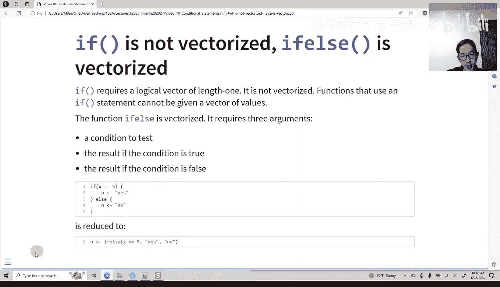

本节课中我们一起学习了R语言中条件语句的完整体系。我们从基础的逻辑运算符（`&`， `|`， `!`）和比较运算符（`==`， `>`， `%in%`等）开始，它们是生成逻辑条件的基础。接着，我们深入探讨了如何使用`if`语句进行条件判断，并扩展到了多分支的`else if`和`else`结构。最后，我们介绍了向量化的条件选择函数`ifelse()`，它可以高效地对整个向量应用条件逻辑。理解并熟练运用这些工具，对于编写能够根据不同情况做出决策的R程序至关重要。