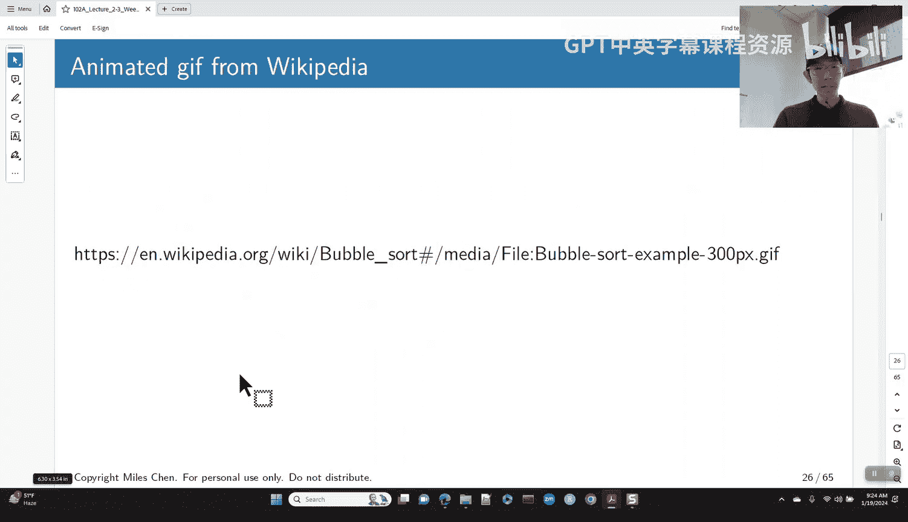
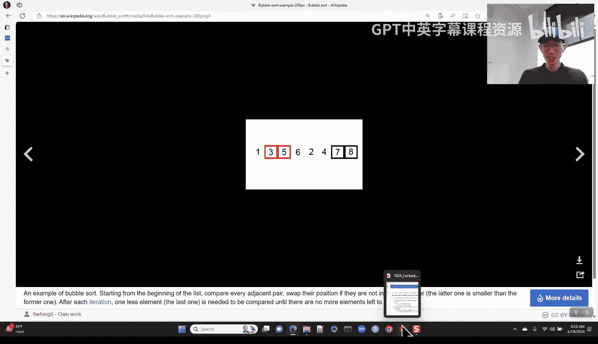
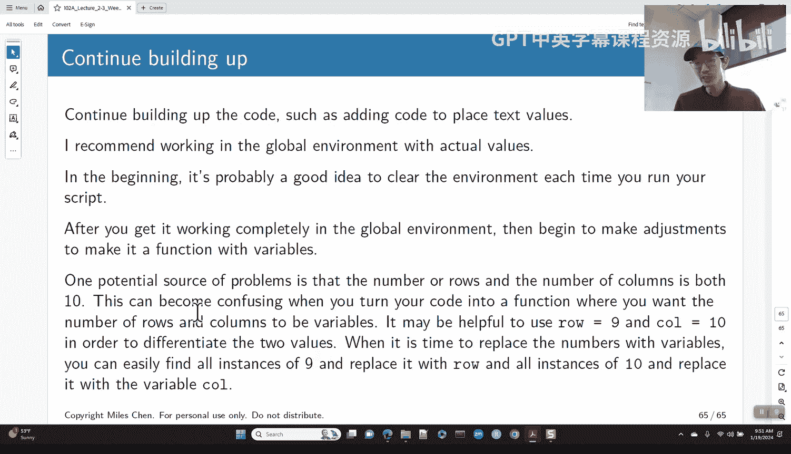

# 12：函数编写策略（可选）🎯

在本节课中，我们将学习如何有效地编写R函数。我们将回顾函数的基础知识，并深入探讨一种实用的策略：将复杂任务分解为更小的、可管理的部分，然后逐步构建解决方案。这对于完成更复杂的作业（如作业二）尤其重要。

## 函数基础回顾 📚

上一节我们介绍了课程概述，本节中我们来看看函数的基础知识。你们已经在作业一中编写过函数，对函数的基本形式应该有所了解。

在R中，函数的基本结构如下：
```r
function_name <- function(arg1, arg2, ...) {
  # 函数体：执行各种操作
  result <- some_calculation
  return(result) # 返回结果
}
```
我们使用关键字 `function` 来创建函数。参数名放在括号内，函数体包含在大括号 `{}` 中，其中可以执行各种计算、比较或赋值操作。函数最后会返回一个输出对象。

关于R函数，有几个需要注意的特点：
*   如果函数体只有一行代码，可以省略大括号，但这通常不是好的编码风格。
*   如果没有显式使用 `return()` 命令，R将自动返回函数体中最后一个被求值的表达式的结果。
*   函数本身也是对象，可以像其他对象一样被操作，例如放入列表中。

**函数只能返回一个对象**。如果需要返回多个值，必须将它们组合成一个单一对象，例如向量或列表。

以下是返回多个值的示例：
```r
# 返回向量
function1 <- function(x) {
  c(x, x^2, x^3)
}
# 返回带名称的列表
function2 <- function(x) {
  list(value = x, square = x^2, cube = x^3)
}
```

## 函数参数与调用 🔧

在定义函数时，我们指定了参数的名称。调用函数时，可以通过位置或名称来提供参数值。

*   **按位置匹配**：如果不指定参数名，R会按顺序将提供的值分配给参数。
*   **按名称匹配**：如果指定了参数名，可以以任意顺序提供参数。
*   **未使用的参数**：如果函数定义中包含了某个参数，但在函数体内未使用它，调用时即使不提供该参数的值，R通常也不会报错。
*   **缺失的参数**：反之，如果在函数体内使用了某个参数，但调用时没有为其提供值，R会报错，除非该参数有**默认值**。

可以通过在定义时赋值来设置默认值：
```r
f <- function(x=1, y=1, z=1) {
  paste("x=", x, "y=", y, "z=", z)
}
```

## 函数的作用域与返回值 🌐

理解函数作用域对于调试至关重要。在函数内部创建或修改的变量，其作用域仅限于该函数内部。

一般来说，不应尝试在函数内部直接修改全局环境中的变量。如果希望将函数内部的值传递到外部，应将其作为返回值的一部分。值通过参数传入函数，并通过返回对象传出函数。

请看以下示例：
```r
x <- 10 # 全局环境中的x
f <- function(x) {
  x <- x + 55 # 修改函数内部的x
  return(x)
}
result <- f(x) # result 是 65
print(x)       # 全局环境中的 x 仍然是 10
```
要改变全局变量 `x` 的值，需要显式赋值：`x <- f(x)`。

## 何时需要编写函数？🤔

函数的目的是让代码更易于重用和维护，使我们的生活更轻松。



一个实用的经验法则是：当你发现自己在**第三次**复制粘贴同一段代码（即该代码出现在四个地方）时，就应该考虑将其封装成函数了。原因在于，如果需要修改这段代码的逻辑（例如更改图表线条粗细），你只需要在函数中修改一次，而不是在多个地方重复修改，这能有效避免错误和不一致。



为函数起一个清晰易懂的名字非常重要。函数名应明确表明其功能。对于返回逻辑值（TRUE/FALSE）的函数，其名称最好是一个疑问句形式，例如 `is_prime()`。

## 函数编写策略：分解任务 🧩

上一节我们讨论了编写函数的时机，本节中我们来看看核心策略：如何将一个大任务分解为小任务。这是程序员需要培养的关键技能。我们将通过编写一个**冒泡排序算法**来演示这一过程。

冒泡排序的原理是重复遍历要排序的数列，一次比较两个元素，如果它们的顺序错误就把它们交换过来。遍历数列的工作是重复地进行直到没有再需要交换，也就是说该数列已经排序完成。

我们的目标是编写一个函数 `bubble_sort(x)`，将向量 `x` 按升序排序。

我们可以将这个大任务分解为几个小任务：
1.  **比较并交换相邻元素**：这是最基础的操作。
2.  **单次遍历（冒泡）**：对整个向量执行一次完整的比较和交换。
3.  **多次遍历**：重复执行单次遍历，直到整个向量有序。

### 第一步：在全局环境中验证思路

**不要一开始就写函数**。建议先在全局环境中逐步编写和测试代码逻辑，这样更容易查看中间结果和调试。

首先，我们尝试实现最小的任务：交换一个向量中的前两个元素。
```r
# 初始尝试（错误示范）
x <- c(5, 4, 3, 2, 1)
x[1] <- x[2]
x[2] <- x[1] # 此时x[1]已经是4，所以x[2]也被赋值为4，丢失了原来的5
print(x) # 输出: 4 4 3 2 1 (错误)
```
我们发现直接覆盖会导致数据丢失。正确的做法是使用一个临时变量：
```r
# 正确方法
x <- c(5, 4, 3, 2, 1)
temp <- x[1]
x[1] <- x[2]
x[2] <- temp
print(x) # 输出: 4 5 3 2 1 (正确)
```
然后，我们加入比较条件，只在需要时交换：
```r
x <- c(5, 4, 3, 2, 1)
if (x[1] > x[2]) {
  temp <- x[1]
  x[1] <- x[2]
  x[2] <- temp
}
print(x) # 输出: 4 5 3 2 1
```

### 第二步：实现单次遍历

接下来，我们需要将相邻元素的比较和交换应用到向量的每一对元素上。这需要一个循环。
```r
x <- c(5, 4, 3, 2, 1)
n <- length(x)
for (i in 1:(n-1)) { # 注意是 n-1，因为比较的是 i 和 i+1
  if (x[i] > x[i+1]) {
    temp <- x[i]
    x[i] <- x[i+1]
    x[i+1] <- temp
  }
}
print(x) # 经过一次遍历，最大的数被“冒泡”到最后: 4 3 2 1 5
```
每执行一次这个循环，当前向量中最大的元素就会被移动到正确的位置（末尾）。

### 第三步：实现多次遍历

一次遍历只能确保一个元素归位。对于一个长度为 `n` 的向量，我们最多需要 `n-1` 次遍历。我们可以将单次遍历的代码放入另一个循环中。
```r
x <- c(5, 4, 3, 2, 1)
n <- length(x)
for (sweep in 1:(n-1)) {
  for (i in 1:(n - sweep)) { # 优化：已排序的部分无需再比较
    if (x[i] > x[i+1]) {
      temp <- x[i]
      x[i] <- x[i+1]
      x[i+1] <- temp
    }
  }
}
print(x) # 输出: 1 2 3 4 5
```

### 第四步：封装成函数

在全局环境中验证逻辑正确后，我们就可以将其封装成一个整洁的函数了。
```r
bubble_sort <- function(x) {
  n <- length(x)
  for (sweep in 1:(n-1)) {
    for (i in 1:(n - sweep)) {
      if (x[i] > x[i+1]) {
        temp <- x[i]
        x[i] <- x[i+1]
        x[i+1] <- temp
      }
    }
  }
  return(x) # 记住要返回值
}

# 测试函数
test_vec <- sample(1:100, 20)
sorted_vec <- bubble_sort(test_vec)
print(sorted_vec)
```

## 应用于作业二：绘制游戏棋盘 🎲

作业二要求模拟“蛇梯棋”游戏，其中一个任务是绘制棋盘。这听起来很复杂，但同样可以分解。

绘制棋盘的基本要素是绘制网格线。我们可以使用R的 `segments()` 函数来画线，它需要起点 `(x0, y0)` 和终点 `(x1, y1)` 的坐标。

首先，思考如何画一条水平线：
```r
plot.new()
plot.window(xlim=c(0,10), ylim=c(0,10), asp=1) # 设置坐标范围和纵横比
segments(x0=0, y0=0, x1=10, y1=0) # 从(0,0)到(10,0)画线
```
要画多条水平线，可以使用循环：
```r
plot.new()
plot.window(xlim=c(0,10), ylim=c(0,10), asp=1)
for (row in 0:10) {
  segments(x0=0, y0=row, x1=10, y1=row)
}
```
同理，绘制垂直线：
```r
for (col in 0:10) {
  segments(x0=col, y0=0, x1=col, y1=10)
}
```
这样就得到了一个基本的网格。在此基础上，你可以继续添加任务：在特定格子内添加数字标签、绘制代表“梯子”和“蛇”的箭头等。**关键是从纸笔草图开始，确定每个元素的坐标，然后将每个小任务转化为代码。**

## 总结 📝



本节课中我们一起学习了高效的函数编写策略。核心要点是：不要急于编写完整的函数，而应先将复杂问题分解为简单的子任务。在全局环境中逐步实现并测试每个子任务，确保每行代码都符合预期。最后，将验证过的代码块组装并封装成函数。这种方法能显著降低调试难度，并帮助你更有条理地构建复杂程序，例如作业二中的棋盘绘制和游戏模拟。记住，清晰的函数名和结构化的思考是写出好代码的关键。